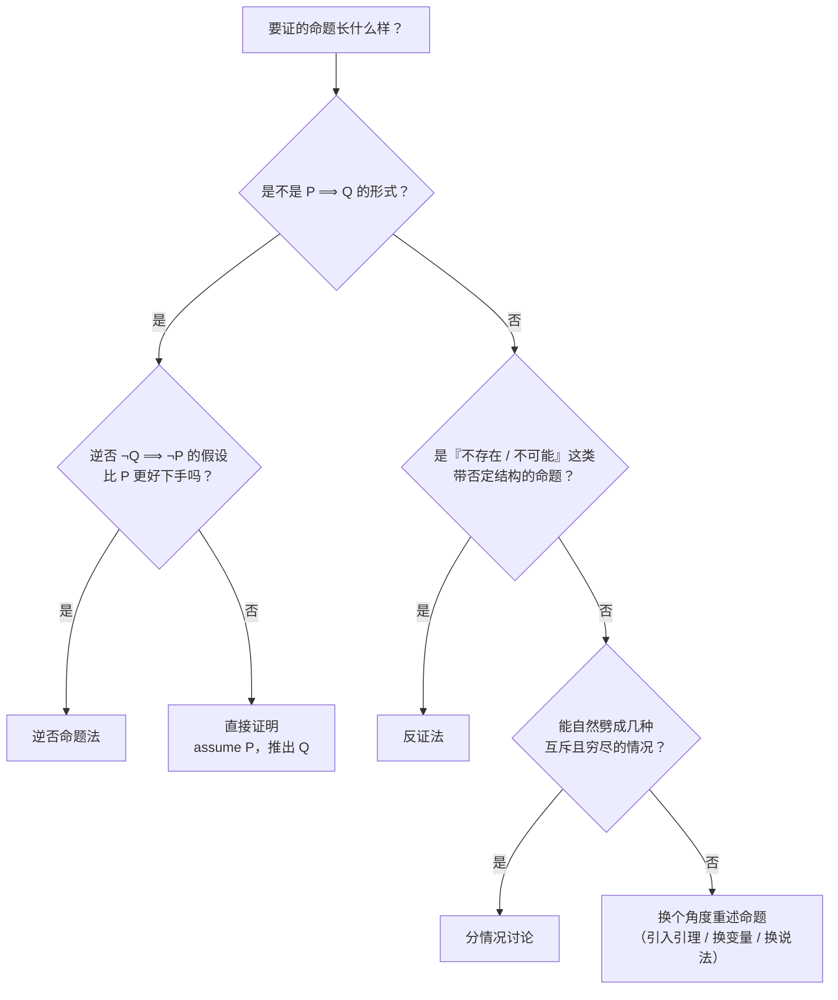

# 证明方法 (Methods of Proofs) — 直接证明、逆否命题、反证法与分情况讨论

前三讲一直在搭工具:LN1 把"对 / 错"变成可计算的符号,LN2.1 给数学对象一个容器(集合),LN2.2 让"对所有"、"存在"可以写下来,并给出一批**推理规则** (rule of inference)——全称实例化、全称 modus ponens、全称 modus tollens、全称推广。但那时这些规则只是"合法动作清单",我们没真正拿它们证过什么有意思的东西。

本讲就是**把清单变成手艺**。讲义开篇点题:已经学完逻辑基础,现在要**把逻辑规则应用到数学定理的证明上**。整讲围绕四种方法展开——**直接证明** (direct proof)、**逆否命题** (contrapositive)、**反证法** (proof by contradiction)、**分情况讨论** (proof by cases)。这四种会在接下来的整门课里反复出现,所以重点不是记住几个例子,而是建立"看到一道题该先试哪种方法"的判断力。

值得注意的是,这四种方法**在 LN2.2 里已经以推理规则的形式出现过**。本讲做的事情,是把它们从抽象符号搬到具体命题上:

| 本讲的方法 | 它背后的逻辑规则(来自 LN2.2) | 一句白话 |
| --- | --- | --- |
| 直接证明 | 假设 $P$ 为真,由推理规则链式推出 $Q$ | 从"已知"走到"要证" |
| 逆否命题 | $P \to Q \equiv \lnot Q \to \lnot P$(逆否等价) | 反面走一遍也一样 |
| 反证法 | 由 $\lnot P \to \mathbf{F}$ 推出 $P$ | 假设它假,结果自己炸了 |
| 分情况讨论 | $p \lor q,\ p \to r,\ q \to r \ \therefore\ r$ | 拆开,每种情况各证一遍 |

## 基本定义:奇偶性 (Basic Definitions)

第一个工具是**奇偶性** (parity)。讲义给的两条定义看似平淡,但后面几乎所有例子都建立在它们之上,而且是本课程第一次用**存在量词**定义新概念,值得逐字拆开。

一个整数 $n$ 是**偶数** (even number),当且仅当**存在**一个整数 $k$,使得

$$
n = 2k.
$$

一个整数 $n$ 是**奇数** (odd number),当且仅当**存在**一个整数 $k$,使得

$$
n = 2k+1.
$$

三处细节容易被一略而过。第一,**定义是双向的**:写成逻辑式就是 $n$ 偶 $\iff \exists k \in \mathbb{Z},\ n = 2k$,所以"我是偶数"和"我能写成 $2k$"是同一件事的两种说法,任一边都能替换另一边——这正是后面所有证明的引擎。第二,$k$ 被**存在量词**管着,不是固定的数,而且**不同的数对应不同的 $k$**;所以不能想当然认为两个偶数的 $k$ 相等(直接证明里马上要用到这一点)。第三,**$k$ 允许为负**,定义才对负整数也成立($n = -4$ 取 $k = -2$);若把 $k$ 限制为正整数,连 $0$ 都不能写成 $2k$,最重要的偶数反而被漏掉。

## 证明蕴含式 (Proving an Implication)

本讲的主战场是**蕴含式** $P \to Q$("If $P$, then $Q$")。讲义给出统一的目标框

$$
\text{Goal: If } P, \text{ then } Q. \qquad (P \text{ implies } Q)
$$

以及第一种打法:

> Method 1: Write assume $P$, then show that $Q$ logically follows.

这句读起来像废话,其实规定了一套**写作结构**:"Assume $P$"(把前提收进来当已知)→ 一步步推 → 推出 $Q$ 后收尾。初学者最常犯的错是**从结论反着写**:想证 $a^2+b^2=c^2$,就先把结论抄下来,两边平方、同除,推出一个显然为真的式子宣布证完。这种写法**只有在每一步都等价时才合法**——LN0 笔记里"面积 65 拼成 63"的坏证明正是栽在这里。讲义要求的单向前进写法天然规避它。

另一条隐含前提:证明蕴含式时**只需管 $P$ 为真的情况**。$P$ 为假时 $P \to Q$ 自动为真(空真,vacuously true),没什么可证。所以 "Assume $P$" 不是敷衍,而是把要处理的情形**缩小到真正有内容的那一半**。

### 直接证明 (Direct Proof)

**例子 1:两个偶数之和是偶数。** (The sum of two even numbers is even.)

思路完全照定义走。定义是关于**一个**数的,所以先给两个偶数起名字:设 $x, y$ 是偶数,按定义存在整数 $m, n$ 使

$$
x = 2m, \qquad y = 2n.
$$

这里**必须用两个不同的字母**——$x$ 和 $y$ 是独立的数,各自的"那个 $k$"没有理由相同。相加:

$$
x + y = 2m + 2n = 2(m+n).
$$

$m+n$ 是整数(整数对加法封闭),于是找到整数 $k = m+n$ 使 $x+y = 2k$,按定义 $x+y$ 是偶数。

注意**讲义省略了最后这句收尾**:幻灯片停在 $= 2(m+n)$,没有写"因此 $x+y$ 是偶数"。逻辑上不能省,读者要自己把"能写成 $2 \times$ 整数"和"是偶数"接上。我在笔记里补上,后面遇到类似省略也会标注。**直接证明的骨架**就是三拍:按定义展开前提 → 代数变形 → 翻译回定义的语言。

**例子 2:两个奇数之积是奇数。** 同一骨架。设 $x = 2m+1$、$y = 2n+1$。乘开:

$$
xy = (2m+1)(2n+1) = 4mn + 2m + 2n + 1 = 2(2mn + m + n) + 1.
$$

括号里是整数(整数对加法、乘法封闭),记 $k = 2mn+m+n$,则 $xy = 2k+1$,即奇数。

这个例子的教学价值在**整理步骤** $4mn+2m+2n+1 = 2(2mn+m+n)+1$。提出 $2$ 之后,剩下的 $2mn+m+n$ 必须确认是整数——数学上"显然",但整数的封闭性是这套定义的唯一支点。若题目换成"两个 $\frac{1}{2}$ 的奇数倍",同样的提公因式做完,$2mn+m+n$ 就不再是整数,证明当场垮掉。

**例子 3:完全平方数之和加交叉项还是完全平方数。** 讲义原文:

> If $m$ and $n$ are perfect squares, then $m + n + 2\sqrt{mn}$ is a perfect square.

**完全平方数** (perfect square) 就是某个整数的平方。设 $m = a^2$、$n = b^2$,则

$$
m + n + 2\sqrt{mn} = a^2 + b^2 + 2ab = (a+b)^2,
$$

所以它是完全平方数。

关键**不是计算而是识别**:$a^2+b^2+2ab$ 就是初二背过的 $(a+b)^2 = a^2+2ab+b^2$ 的右边,只是 $2ab$ 被伪装成了 $2\sqrt{mn}$。看穿这层伪装,题目就变成一句废话;看不出,就会卡在那里对 $\sqrt{mn}$ 做无用的变形。**数学题的难度常来自"换个外套就认不出来"**——看到 $X + Y + 2\sqrt{XY}$,第一反应应当是"这是不是 $(\sqrt{X}+\sqrt{Y})^2$"。

### 有理数与无理数 (Rational / Irrational Numbers)

接下来三个例子都围绕这对概念。讲义专门插一页把它们定义清楚,因为后面的逆否命题与反证法**全靠这个定义**。

一个实数 $r$ 是**有理数** (rational),当且仅当**存在整数** $a, b$,使得

$$
r = \frac{a}{b} \qquad \text{且} \qquad b \neq 0.
$$

讲义把 $a$ 标成 **numerator**(分子)、$b$ 标成 **denominator**(分母),提醒两者角色不同:分子随便,分母不能是 $0$。随后用五个小问答把定义"用一遍":

* $0.281$ 有理吗?有理,$\frac{281}{1000}$。任何有限小数都能写成"整数除以 $10$ 的幂"。
* $0$ 有理吗?有理,$\frac{0}{1}$。陷阱在于很多人觉得"$0$ 除以任何数都是 $0$,没法写成比值"——恰恰相反,$0 = 0/1$ 完全合法,只要分母非零。
* 若 $m, n$ 是非零整数,$\frac{m+n}{mn}$ 有理吗?有理:分子分母都是整数,分母 $mn \neq 0$(这里用到 $\mathbb{Z}$ 无零因子)。
* 两个有理数之和有理吗?有理:$\frac{a}{b} + \frac{c}{d} = \frac{ad+bc}{bd}$,$ad+bc$ 与 $bd$ 都是整数且分母非零。
* $x = 0.12121212\ldots$ 有理吗?有理。技巧是**乘上 $10^{\text{循环节长度}}$**:循环节 $\overline{12}$ 长度为 $2$,令 $100x = 12.121212\ldots$,相减得 $100x - x = 12$,即 $99x = 12$,

$$
x = \frac{12}{99} = \frac{4}{33}.
$$

这一步成立是因为两式的"尾巴"完全一样,相减时无限长的小数部分被**整体消掉**。这就是"无限循环小数都是有理数"的证明手法,而"是循环小数"与"是有理数"其实**等价**。

**注意定义的结构**:有理数不是"算出来的性质",而是"**能被写成分数**"这个存在性条件。所以

$$
r \text{ 无理} \iff \lnot \exists a, b \in \mathbb{Z},\ \left(b \neq 0 \land r = \frac{a}{b}\right),
$$

即**所有整数 $a, b$ 都写不出 $r$**——一个**否定套在存在量词上**。这解释了为什么证无理数总比证有理数难:有理数只要**交出**一对 $(a, b)$,"没有一对能做到"却必须**穷尽所有**整数对,正面做不到。**唯一出路是反过来**——假设"有一对能做到",再挤出矛盾。这就是下两节的方法为什么会成为处理无理数主力的原因。

## 逆否命题法 (Contrapositive)

### 为什么反转一下更好证

讲义给出一道看起来无从下手的题:

> **Claim:** If $r$ is irrational, then $\sqrt{r}$ is irrational.

目标是蕴含式 $P \to Q$,$P$ 是"$r$ 无理",$Q$ 是"$\sqrt{r}$ 无理"。按上节打法应假设 $r$ 无理,再推出 $\sqrt{r}$ 无理。但**接下来没有路**:证"某数无理"的唯一手段是"假设它有分数表示、推出矛盾",而手里只有"$r$ 无理"这个**否定性**事实,推不出关于 $\sqrt{r}$ 的任何**正面信息**——没有一个 $r = a/b$ 可以变形,证明卡在第一步。讲义很坦诚地把困境写在幻灯片上:"How to begin with?"。

然后它抛出关键一问:

> What if I prove "If $\sqrt{r}$ is rational, then $r$ is rational", is it equivalent?

答案是**是**,这正是"逆否命题"。给定 $P \to Q$,它的**逆否命题**是 $\lnot Q \to \lnot P$,两者**逻辑等价**:

$$
P \to Q \ \equiv\ \lnot Q \to \lnot P.
$$

这条恒等式在 LN1 里只是真值表的一行,现在变成了**实用工具**:你可以自由地把要证的命题换成逆否命题,证出的结果完全等价。直觉上,原命题说的是"$P$ 出现的每个地方 $Q$ 都跟着出现",那么"$Q$ 不出现的地方 $P$ 也不可能出现"——逆否命题就是**把这条禁止令改写成正面说法**。

要特别小心 **逆否命题 ≠ 逆命题**:

| 名称 | 形式 | 与 $P \to Q$ 等价? |
| --- | --- | --- |
| 原命题 (original) | $P \to Q$ | 等价(自己) |
| **逆否命题 (contrapositive)** | $\lnot Q \to \lnot P$ | **等价** |
| 逆命题 (converse) | $Q \to P$ | **不等价** |
| 否命题 (inverse) | $\lnot P \to \lnot Q$ | **不等价** |

后两个是典型的"看起来像但其实错"。四个变体两两配对:**原命题与逆否命题一组,逆命题与否命题一组**(否命题是逆命题的逆否),两组之间没有必然联系。

### 把逆否命题证出来

原 Claim 是"$r$ 无理 $\to \sqrt{r}$ 无理",逆否命题是"$\sqrt{r}$ **不是**无理 $\to r$ **不是**无理",而"不是无理"就是"有理",所以白话即:**若 $\sqrt{r}$ 是有理数,则 $r$ 是有理数**。**路一下通了**,因为假设变成了正面的存在性事实。讲义给的证明只有四行:

> We shall prove the contrapositive — "if $\sqrt{r}$ is rational, then $r$ is rational."
> Since $\sqrt{r}$ is rational, $\sqrt{r} = a/b$ for some integers $a, b$.
> So $r = a^2/b^2$. Since $a, b$ are integers, $a^2, b^2$ are integers.
> Therefore, $r$ is rational.
> (Q.E.D.)

第一步**声明自己在证什么**(不是客套,它告诉读者接下来假设的是 $\lnot Q$ 而不是 $P$,否则读者会以为你证错了方向)。第二步按有理数定义从"$\sqrt{r}$ 有理"里**取出**那对整数:$a, b \in \mathbb{Z}$、$b \neq 0$、$\sqrt{r} = a/b$——这是整个证明的**动力来源**,正是逆否命题法允许我们合法获得这个"存在的一对"。第三步平方得 $r = a^2/b^2$,$a^2$、$b^2$ 都是整数且 $b^2 \neq 0$。第四步对照定义:整数比整数、分母非零,故 $r$ 有理。

**Q.E.D.** 这个缩写在讲义上专门解释过:全称是拉丁语 *quod erat demonstrandum*,"thus it has been demonstrated";讲义还调侃地给了另一个读法 "quite easily done"。正式写作里用 $\blacksquare$ 或 Q.E.D. 都行,功能是标记**证明结束**。

### 关于这道题的两处补充

**其一,$\sqrt{r}$ 要有意义,前提是 $r \geq 0$。** 若 $r$ 是负无理数(如 $-\sqrt{2}$),$\sqrt{r}$ 在实数内没有定义,"$\sqrt{r}$ 无理"也就无从谈起。所以这条 Claim 真正的适用范围是 **$r \geq 0$ 的无理数**,规范写法应把 $r \geq 0$ 写成显式前提。讲义省略它大概是因为"提到 $\sqrt{\phantom{x}}$ 就默认被开方数非负"是数学圈的默契,但对新手值得点破。

**其二,这个证明顺带说明了"有理数在开方下封闭"。** 把逆否命题单独抽出来:一个数开平方后如果还有理,那它本来就有理;换个说法,**无理数不可能开出有理数的平方根**。整段证明没有任何特殊技巧,全靠"有理数 = 整数比"这个定义搬运——它的力量来自**定义本身足够具体**。

## 挑战"当且仅当" (Proving an "if and only if")

数学里更常见的是**双向**命题,讲义叫它"当且仅当":

> Goal: Prove that two statements $P$ and $Q$ are "logically equivalent", that is, one holds if and only if the other holds.

符号写成 $P \iff Q$(口语简称 **iff**),逻辑上

$$
P \iff Q \quad \equiv \quad (P \to Q) \land (Q \to P),
$$

即**两个方向都要证**。讲义给了三种打法:

* **Method 1a:** 证 $P \to Q$ **且** $Q \to P$。最直白。
* **Method 1b:** 证 $P \to Q$ **且** $\lnot P \to \lnot Q$。注意 $\lnot P \to \lnot Q$ 正是 $Q \to P$ 的**逆否命题**,两者等价,所以 1b 与 1a 逻辑上完全一样,只是第二个方向换了更好下手的写法。
* **Method 2:** 构造一条**当且仅当的链条** $P \iff R_1 \iff R_2 \iff \cdots \iff Q$,每环都等价。代数恒等式变形最常用这种。

### 例子:$n$ 是偶数 $\iff$ $n^2$ 是偶数

> For an integer $n$, $n$ is even if and only if $n^2$ is even.

**方向一:$n$ 偶 $\to$ $n^2$ 偶。** 由定义设 $n = 2k$,则

$$
n^2 = (2k)^2 = 4k^2 = 2 \cdot (2k^2),
$$

$2k^2$ 是整数,故 $n^2$ 偶。与前面"两偶数之和"是同一类操作:代定义、提公因式、翻译回定义。

**方向二:$n^2$ 偶 $\to$ $n$ 偶。** 讲义先在 Method 1a 的框架下**试着直接证明**,结果卡住了:由 $n^2$ 偶得

$$
n^2 = 2k \qquad \Longrightarrow \qquad n = \sqrt{2k},
$$

旁边打了一个大大的 **"??"**。

这个 "??" 值得停下来琢磨**为什么走不下去**。已知是"$n^2$ 能写成 $2k$",要证的是"$n$ 能写成 $2k'$"。但定义要求 $n$ **本身**含因子 $2$,而"$n^2$ 含因子 $2$"并不直接说明 $n$ 含因子 $2$——从 $2k$ 开平方得到的是带根号的式子,$\sqrt{2k}$ 是不是整数、更别提是不是偶数,都毫无线索。要走通这条路,本质上需要一条**数论定理**:"若素数 $p$ 整除 $n^2$,则 $p$ 整除 $n$"。它是对的(由算术基本定理推得),但还没讲;而且用一条比结论本身还重的定理去证一个小结论,显然不划算。

顺带指出一个记号问题:幻灯片这里**重复使用了字母 $k$**——方向一里 $k$ 满足 $n = 2k$,方向二里 $k$ 满足 $n^2 = 2k$,是两个完全不同的整数。严格应写 $n^2 = 2k'$ 以示区分。同一份讲义里换字母是有意义的,不换会让人误以为两个 $k$ 有关。

**改用逆否命题(Method 1b),障碍立刻消失。** 要证的是"$n^2$ 偶 $\to n$ 偶",取逆否:$\lnot(n \text{ 偶}) \to \lnot(n^2 \text{ 偶})$,即

$$
n \text{ 是奇数} \ \longrightarrow\ n^2 \text{ 是奇数}.
$$

**为什么这样通了?** 因为假设从"$n^2$ 偶"这个关于 $n^2$ 的结论式条件,换成了"$n$ 是奇数"这个关于 $n$ 的**正面结构式**条件;而按定义,奇数可以**直接写成** $n = 2k+1$,后面就变成纯粹的计算:

$$
n^2 = (2k+1)^2 = (2k)^2 + 2(2k) + 1 = 4k^2 + 4k + 1 = 2(2k^2 + 2k) + 1.
$$

$2k^2+2k$ 是整数,故 $n^2$ 能写成 $2 \times$ 整数 $+1$,即奇数。逆否证完,与原命题等价,故**方向二得证**。

### 这道题透露的方法论

把两次尝试放在一起看,会看到本讲反复出现的一条规律:

> **直接证明失败,往往不是因为你不够聪明,而是因为"假设"给的东西不对路。逆否命题法、反证法、分情况讨论,本质上都是"换一批假设"的手段。**

方向二的假设"$n^2$ 是偶数"**离 $n$ 太远**——中间隔着一层平方运算,信息传不回来;逆否把假设换成"$n$ 是奇数",**直接就是 $n$ 的形状**,信息零损耗。所以一条实用的判据是:**看你手上的假设是不是关于目标对象本身、可以直接套定义的形式。**

讲义还留了伏笔:这条结论在证 $\sqrt{2}$ 无理时**会再用一次**,届时它会明确写出 "Recall that $m$ is even if and only if $m^2$ is even."——刚证完的小引理立刻派上用场,这正是数学写作的常态。

## 反证法 (Proof by Contradiction)

### 规则长什么样

讲义把它写成**推理规则**的分数式:

$$
\frac{\overline{P} \to \mathbf{F}}{P}
$$

记号要认准:$\overline{P}$ 是 $\lnot P$ 的另一种写法(LN1 出现过),$\mathbf{F}$ 是逻辑常量"假",横线上是前提、下是结论。整条规则读作:

> **如果"非 $P$"能推出假(即矛盾),那么 $P$ 为真。**

直觉一句话:"To prove $P$, you prove that not $P$ would lead to a ridiculous result, and so $P$ must be true."

**为什么合法?** 它是**排中律** (law of excluded middle) 的直接产物:对任何 $P$,$P$ 与 $\lnot P$ 必有一个为真;既然假设 $\lnot P$ 会炸出矛盾,$\lnot P$ 只能是假的,那真的一定是 $P$。从等价角度看,还能和逆否命题法接起来:$\overline{P} \to \mathbf{F}$ 的逆否是 $\lnot \mathbf{F} \to \lnot\lnot P$,即"真 $\to P$",也就是 $P$——所以反证法本质上是**在 $\mathbf{F}$ 这个特殊终点上使用逆否命题法**,终点不是另一个命题,而是"假"本身。

### 适合反证法的命题长什么样

反证法最适合那些**本质上带否定结构**的命题。讲义的两个例子恰是这类命题的两种典型:

* "$\sqrt{2}$ 是无理数" —— 形如"**不存在**整数 $a, b$ 使 $\sqrt{2} = a/b$"。
* "素数有无穷多个" —— 形如"**不存在**一张有限素数列表能列完所有素数"。

这类命题的正面形式往往无法构造(你怎么拿出一对**不存在**的整数?),而反证法把"不存在 $X$"翻成"假设存在 $X$",于是手上**立刻多了一个可以变形的对象**。

### 定理:$\sqrt{2}$ 是无理数

数学史上最著名的反证法。讲义拆成两页,这里合成一条完整链条。

> **Theorem.** $\sqrt{2}$ is irrational.
>
> **Proof (by contradiction):**
> 1. Suppose $\sqrt{2}$ was rational.
> 2. Choose $m, n$ integers **without common prime factors** (always possible) such that $\sqrt{2} = \dfrac{m}{n}$.
> 3. Show that $m$ and $n$ are both even, thus having a common factor $2$ — a **contradiction**!

第二步里 **"without common prime factors (always possible)"** 是整个证明的**枢纽**,千万不能略过。它的意思是先把分数**约到最简**:若 $\sqrt{2} = m/n$,把公因子全部约掉,总能得到**既约分数** (fraction in lowest terms) $\sqrt{2} = m/n$,其中 $m$ 与 $n$ **没有公共素因子**。括号里 "always possible" 就是在声明这一步合法——你不需要证明它,因为约分是初等算术里已确立的。

**为什么这一句如此关键?** 因为整个证明最后要炸的矛盾就是"$m, n$ 都是偶数,于是有公因子 $2$",而这条矛盾**只在"$m, n$ 无公因子"的前提下才成立**。如果一开始选的是没约分的分数,证出"$m, n$ 都是偶数"一点也不矛盾,证明就白做了。**约分不是随手简化,它是把矛盾预先埋好。**

核心计算(讲义用左右两个方框,中间一支箭头表示推导方向):由 $\sqrt{2} = m/n$ 两边乘 $n$ 得 $\sqrt{2}\,n = m$;两边平方消去根号:

$$
2n^2 = m^2.
$$

右边含因子 $2$,故 $m^2$ 是**偶数**。现在**回头用上一节的引理**——讲义在此明确写 "Recall that $m$ is even if and only if $m^2$ is even."。既然 $m^2$ 偶,由这条**刚证完的等价式**,$m$ 也偶,即存在整数 $l$ 使 $m = 2l$。代回:

$$
m^2 = (2l)^2 = 4l^2 \qquad \Longrightarrow \qquad 2n^2 = 4l^2 \qquad \Longrightarrow \qquad n^2 = 2l^2.
$$

末步两边同除 $2$。$n^2 = 2l^2$ 说明 $n^2$ 偶,于是**再用一次同一条引理**得 $n$ 偶。

**矛盾出场**:$m$ 与 $n$ **都是偶数**,即有公因子 $2$;但第二步特意把分数约到最简,规定两者**没有公共素因子**。同一事实既被断言为真又被断言为假——这就是 $\mathbf{F}$。由反证法的推断规则,假设"$\sqrt{2}$ 是有理数"导致矛盾,故

$$
\sqrt{2} \text{ 是无理数}. \qquad \blacksquare
$$

### 这个证明里的三点收获

**第一,它是"刚证的引理马上被用两次"的范例。** 上一节为证 $n$ 偶 $\iff n^2$ 偶费了一番功夫改用逆否,当时可能觉得只是练习;但没有这条引理,这里会在"$m^2$ 偶 $\to m$ 偶"再次卡住(就是那个 "??")。**证明是一层层搭起来的**:引理单独看像琐碎的练习,放进大定理里就成了承重墙。这也是讲义按这个顺序排两节的原因。

**第二,矛盾来自"与已知事实冲突",不一定是内部矛盾。** 反证法里的矛盾有两种常见形态:与**前提**冲突(这里:$m,n$ 既被约定无公因子,又被证出有公因子 $2$),或与**已确立的定理**冲突(比如推出 $1$ 是偶数)。初学者常以为必须推出"$P$ 且 $\lnot P$"这种纯粹的逻辑矛盾,其实只要推出的东西**与任一已被接受的事实相冲突**就够了。

**第三,根号下的对象究竟是什么,决定了这条路靠不靠得住。** 这里只用了"$\sqrt{2}$ 的平方是 $2$"这一条性质,对 $\sqrt{2}$ 没有其他假设——这正是反证法的标准姿态:从"假设它是 $\frac{m}{n}$"出发,只做**合法**的代数操作,看代数会把自己撞到哪里。

### 定理:素数有无穷多个 (Infinitude of the Primes)

第二个例子是欧几里得两千多年前的经典证明。它比 $\sqrt{2}$ 那个长,但结构更漂亮,因为中途需要**再补一个小引理**——讲义把它拆成三页(第 17、18、19 页),这个"拆"本身就是教学内容:证到一半发现有一块拼图还没打出来,就停下来先打出来。

#### 整体战略(第 17 页)

> Assume there are only finitely many primes. Let $p_1, p_2, \ldots, p_k$ be all the primes.
> (1) We will construct a number $N$ so that $N$ is not divisible by any $p_i$. By our assumption, it means that $N$ is not divisible by any prime number.
> (2) On the other hand, we show that any number is divisible by **some** prime.
> This will lead to a contradiction, and therefore the assumption must be false. So there must be infinitely many primes.

这是**先写战略、后写战术**的典型,把证明拆成要造的两件武器:

* **武器一**:造一个数 $N$,让它**不被任何 $p_i$ 整除**。又因为正假设 $p_1, \ldots, p_k$ 是**全部**素数,所以这等价于"**不被任何素数整除**"。
* **武器二**:证明"**任何**大于 $1$ 的数都会被**某个**素数整除"。

两者并排立刻矛盾:武器一说 $N$ 谁都不整除它,武器二说 $N$ 必被某个素数整除。讲义把 "(some)" 加了斜体,强调武器二只要求**存在某个**素数,不要求是 $p_i$ 中的哪一个——可见到最后 $N$ 的素因子具体是谁仍无关紧要,**矛盾本身已足够**。末句 "It amounts to showing the claim in the next page." 是典型的过渡句:战略讲完,明说下一步的知识缺口在哪。

#### 补引理:任何大于 1 的整数都有素因子(第 18 页)

> **Claim.** Any integer $n > 1$ is divisible by a prime number.
> * Let $n$ be an integer.
> * If $n$ is a prime number, then we are done.
> * Otherwise, $n = ab$, both $a, b$ are smaller than $n$.
> * If $a$ or $b$ is a prime number, then we are done.
> * Otherwise, $a = cd$, both $c, d$ are smaller than $a$.
> * If $c$ or $d$ is a prime number, then we are done.
> * Otherwise, repeat this argument, since the numbers are getting smaller and smaller, this will eventually stop and we will find a prime factor of $n$.

这个手法叫**下降法** (method of descent):每一步都问"手里这个数是不是素数?"是就收工,不是就把它**分解成两个更小的正整数之积**,再去问那更小的数。因为每次分解都让数字**严格变小**,而正整数不能无限变小(最小正整数是 $1$),过程**必然在有限步内停下**;停下时手里那个数一定是素数,而且它整除 $n$(因为它是 $n$ 一层层除下来的因子)。

讲义在页脚还留了一句红字:"We will see a better proof by mathematical induction later." 这句自陈很诚实——它其实在承认**这段论证目前还不够严谨**。下降法依赖"正整数集合的任何非空子集都有最小元素"(**良序原理**,well-ordering principle),而讲义还没正式引入;另外"$n = ab$,$a$ 和 $b$ 都比 $n$ 小"这句里**漏掉了"$a, b > 1$"**——若允许 $a = 1$,则 $n = 1 \cdot n$ 也算一次"分解",而 $n$ 并未变小,过程会无限循环。规范写法是"若 $n$ 不是素数,则 $n = ab$,其中 $1 < a, b < n$"。补上这两处,论证才算严格;下一讲要学的**数学归纳法** (mathematical induction) 会把这条证明写得更干净,而且不需要额外引入良序原理。

#### 回到主定理(第 19 页)

战略和引理都备齐,现在造武器一。

> Let $p_1, p_2, \ldots, p_k$ be all the primes.
> Consider $p_1p_2\cdots p_k + 1$. Obviously, $p_1p_2\cdots p_k + 1 \neq p_i$ for all $i$.

即著名的"**把所有素数乘起来再加一**":

$$
N = p_1 p_2 \cdots p_k + 1.
$$

这个构造妙在:你把**每一个**已知素数都乘进了 $p_1p_2\cdots p_k$,于是这个乘积被每个素数整除;而它**加一**之后,就**离每个"整除点"都差一步**。讲义马上把这句话变成精确的 Claim:

> **Claim:** if $p$ divides $a$, then $p$ does not divide $a + 1$.

证明这条 Claim 用的是**再一次反证法**(引理内部套反证法,讲义把它框在虚线框里):

> **Proof (by contradiction):**
> $a = cp$ for some integer $c$. $a + 1 = dp$ for some integer $d$.
> $\Longrightarrow 1 = (d-c)p$, contradiction because $p \geq 2$.

拆开看:假设 $p$ 同时整除 $a$ 和 $a+1$。前者给整数 $c$ 使 $a = cp$,后者给整数 $d$ 使 $a+1 = dp$。两式相减:

$$
1 = (a+1) - a = dp - cp = (d-c)p.
$$

$d-c$ 是整数,所以 $1$ 被写成了 $p$ 乘一个整数,即 $p$ 整除 $1$。可是 $p \geq 2$(素数定义就要求 $\geq 2$),而 $1$ 的正因子只有 $1$ 自己,不存在 $\geq 2$ 的因子——矛盾。所以 $p$ 不可能同时整除 $a$ 与 $a+1$。

白话版本非常直观:**相邻的两个整数不可能被同一个素数整除**。因为 $a$ 与 $a+1$ 之间没有任何整数,而 $p$ 的倍数是每隔 $p$ 个出现一次($p \geq 2$ 保证间隔至少为 $2$),所以相邻两个整数里最多只有一个能是 $p$ 的倍数。这条 Claim 是整个证明里唯一"用到素数 $\geq 2$"的地方,也是为什么定理只能对素数成立——若允许 $p = 1$,那 $1$ 可整除一切,Claim 当场失效。

把 Claim 用到 $N$ 上:取 $a = p_1p_2\cdots p_k$、$N = a+1$。对每个 $i$,$p_i$ 整除 $a$,由 Claim 得 $p_i$ **不整除** $N$。于是**没有 $p_i$ 能整除 $N$**;而由假设 $p_1, \ldots, p_k$ 就是全部素数,所以**没有素数能整除 $N$**。但另一方面 $N = p_1\cdots p_k + 1 \geq 2 + 1 = 3 > 1$($k \geq 1$),由第 18 页的引理,$N$ **必然被某个素数整除**。

一边说"没有素数能整除 $N$",一边说"必有素数能整除 $N$"——矛盾。所以"素数只有有限个"为假,

$$
\text{素数有无穷多个}. \qquad \blacksquare
$$

### 关于这条证明的两点说明

**其一,$N = p_1\cdots p_k + 1$ 本身不一定是素数。** 这是最常见的误解。构造 $N$ 的**目的不是**"造出一个新素数",而是"造出一个**不被任何已知素数整除**的数"。$N$ 可能是素数(假设全部素数为 $2, 3$ 时 $N = 7$ 就是),也可能是合数(假设 $2, 3, 5, 7, 11, 13$ 时 $N = 30031 = 59 \times 509$)——但无论哪种情况,$N$ 的素因子都**必然不在原列表里**,这才是矛盾所在。这条证明的力量**不来自 $N$ 是素数,而来自 $N$ 与整张列表的"错位"**。

**其二,幻灯片上那句 "Obviously, $p_1p_2\cdots p_k + 1 \neq p_i$ for all $i$" 严格说来并非后续推理所必需。** 这句话本身是对的:所有 $p_j \geq 2$,所以乘积 $\geq p_i$,于是 $N > p_i$,$N$ 不可能等于列表里任何一个素数。它的作用是**提示 $N$ 是列表之外的新数**,帮助建立直觉。真正驱动矛盾的两块砖是**第 18 页的引理**("$N>1$ 必有素因子")与**第 19 页的 Claim**("$p_i$ 整除 $a$,故不整除 $N$")。读到这里如果觉得"这句好像没用",感觉是对的——它是一句**背景旁白**,不在推理链上,正式写证明时删掉不影响正确性。

## 分情况讨论 (Proof by Cases)

### 规则长什么样

对应的推理规则讲义用竖排推断式写出:

$$
\begin{aligned}
&p \lor q \\
&p \to r \\
&q \to r \\
\hline
\therefore\ &r
\end{aligned}
$$

读法:已知"$p$ 或 $q$ 至少一个成立",又知"$p$ 则 $r$"、"$q$ 则 $r$",那么**无论走哪条路都通向 $r$**,所以 $r$ 成立。这条规则揭示了分情况讨论的**两个必要动作**:

1. **穷尽** (exhaustive):前提 $p \lor q$ 必须覆盖所有情形。只讨论"$x$ 是正数"和"$x$ 是负数"而漏掉"$x = 0$",$p \lor q$ 就断了,整个证明作废——这是新手最常犯的错,因为它**悄无声息**,证出来看着挺完整。
2. **每条路都到达终点**:每个 $p \to r$、$q \to r$ 都必须真的证出来,不能因为"看起来明显"就跳过。

(幻灯片上这个分数式其实**缺少横线**,只有竖排四行;这里按标准推断式补上,不影响语义。)

**例子:非零数的平方是正数。** 讲义给的是最朴素的版本:

$$
\begin{aligned}
&x \text{ is positive} \lor x \text{ is negative} && \text{(非零实数,只能正或负)} \\
&x \text{ is positive} \to x^2 > 0 \\
&x \text{ is negative} \to x^2 > 0 \\
\hline
\therefore\ &x^2 > 0
\end{aligned}
$$

第一行的"或"之所以成立,是因为前提已说 $x \neq 0$——**这就是"穷尽性"的体现**:若题目改成"任意实数 $x$",第一行就不成立(漏了 $x = 0$,那时 $x^2 = 0$ 而不是 $> 0$),整个证明会崩。这个例子短到近乎 trivial,但正好把"穷尽性为什么要靠前提来保证"演得清清楚楚。

顺带指出:幻灯片对两个 $x \to x^2 > 0$ 都只写了结论。规范地写,**正数情形**依赖实数序公理("两正数之积为正"),**负数情形**要把负号提出来:若 $x < 0$,令 $x = -u$($u > 0$),则 $x^2 = (-u)^2 = u^2 > 0$(回到正数情形)。这两步属于"太基础以至于不写"的省略。

### 例子:奇数的平方 (The Square of an Odd Integer)

讲义上干货最足的一个例子:它既是**分情况讨论的实战**,也是**"怎样把一道没头绪的题变成能做的题"的教学演示**。题目写在页顶:

$$
\forall \text{ odd } n,\ \exists m,\ n^2 = 8m + 1 \, ?
$$

白话:对每个奇数 $n$,都存在整数 $m$ 使 $n$ 的平方恰比 $8$ 的某个倍数多 $1$——即**奇数的平方除以 $8$ 余 $1$**。

#### Idea 0:先找反例 (find counterexample)

讲义的第一个主意是**先试几个数**:

$$
3^2 = 9 = 8 + 1, \qquad 5^2 = 25 = 3 \times 8 + 1, \qquad \ldots \qquad 131^2 = 17161 = 2145 \times 8 + 1.
$$

三个例子都成立($m$ 分别为 $1$、$3$、$2145$;验算 $2145 \times 8 = 17160$,$+1 = 17161$ ✓)。既然小规模试不出反例,这条命题**值得花力气去证**。

**为什么这一步要放最前面?** 因为命题的**真假是未知的**,而"找一个反例"比"写一个证明"便宜得多。若 $n = 3$ 就不成立,那什么也不用证,直接举反例收工。这就像写代码前先跑一个最小样例——**先花一分钟排除最坏的可能,再投入两小时的正经工作**。这也是讲义把它编号为 **Idea 0** 而不是 Idea 1 的原因:它是所有想法之前的**前置检查**,不是竞争者。

#### Idea 1:证 $n^2 - 1$ 能被 $8$ 整除

第二个主意是**换一种说法**:$n^2 = 8m+1$ 等价于 $n^2 - 1 = 8m$,即

$$
8 \mid (n^2 - 1),
$$

而 $n^2 - 1$ 可以**因式分解**:$n^2 - 1 = (n-1)(n+1)$。讲义写到这里就停住,留下一行 "= ??…"。这个悬念的位置值得注意:它留给读者的是**"怎么用 $n$ 是奇数"**。若 $n$ 是奇数,则 $n-1$ 与 $n+1$ 都是偶数,而两个相差 $2$ 的偶数中必有一个是 $4$ 的倍数——把两个因子各自能提供的因子 $2$ 凑起来,就已经攒够 $8$ 的因子。这条路讲义**没有展开**,我补完在下面(Idea 2 走的是另一条路,效果相同,两条都值得会)。

**补完 Idea 1(讲义未展开)**:设 $n = 2k+1$,则 $n-1 = 2k$、$n+1 = 2k+2 = 2(k+1)$,所以

$$
n^2 - 1 = (n-1)(n+1) = 4k(k+1).
$$

而 $k(k+1)$ 是**两个连续整数之积**,其中必有一个偶数,所以 $k(k+1)$ 一定是偶数,写成 $k(k+1) = 2t$。代回得 $n^2 - 1 = 4 \cdot 2t = 8t$,故 $8 \mid (n^2-1)$,即 $n^2 = 8t+1$,取 $m = t$ 即可。

#### Idea 2:直接看 $(2k+1)^2$,并对 $k$ 的奇偶分情况

讲义选的是第三条路——**展开平方,再对 $k$ 分奇偶**。这正好把本节两种手法(代数展开 + 分情况讨论)合到一起。

设 $n = 2k+1$,展开:

$$
(2k+1)^2 = 4k^2 + 4k + 1 = 4(k^2 + k) + 1.
$$

目标是把 $\text{?}$ 填进 $n^2 = 8m+1$ 的 $m$ 位置,所以只需说明 $4(k^2+k)$ 是 $8$ 的倍数,即 $k^2+k$ 是偶数。**于是分情况讨论 $k$ 的奇偶**:

* **情况一:$k$ 是偶数。** 那么 $k^2$(偶 $\times$ 偶)也是偶数,所以 $k^2$ 与 $k$ 都偶,和 $k^2+k$ 是偶数。
* **情况二:$k$ 是奇数。** 那么 $k^2$(奇 $\times$ 奇)也是奇数,所以 $k^2$ 与 $k$ 都奇,两个奇数之和 $k^2+k$ 是偶数。

两种情况下 $k^2+k$ 都偶,而 $k$ 的奇偶**穷尽了所有可能**,所以对任意整数 $k$,$k^2+k$ 恒为偶数。记 $k^2+k = 2m$,代回得

$$
n^2 = 4 \cdot 2m + 1 = 8m + 1.
$$

命题得证。$\blacksquare$

**这段证明的结构非常典型**:要证的是一个有两个量词的全称命题 $\forall \text{ odd } n, \exists m, \ldots$,处理顺序是"**先把 $\forall$ 变成变量 $n$,再把 $\exists$ 变成具体的构造 $m$**"。而中间对 $k$ 分奇偶,是因为展开后的 $4(k^2+k)$ 里存在一个**无法统一处理的分支**($k^2+k$ 是偶数的理由在 $k$ 偶和 $k$ 奇时不同)。**当证明在某一步需要"看情况"时,八成说明这一步的表达式里藏着某个取模 $2$(或其他模数)的分支——找到它,是把证明变干净的关键。** 顺着这条线索还有个更简洁的写法:$k^2+k = k(k+1)$ 是连续整数之积,恒为偶数,根本不用分情况。实际写证明时推荐用它(省掉一整段 case 论证);不过对**学习分情况讨论**来说,讲义的 case 写法反而更好,因为它把"偶 $\times$ 偶 $=$ 偶"、"奇 $\times$ 奇 $=$ 奇"、"奇 $+$ 奇 $=$ 偶"三条基础事实都摆到了台面上。

### 例子:有理 vs 无理 (Rational vs Irrational)

讲义最后一道题是这一讲**最漂亮**的证明。

> **Question:** If $a$ and $b$ are irrational, can $a^b$ be rational??

白话:两个无理数做指数运算,结果能不能是有理数?题目看起来很玄——我们手头的无理数好像只知道一个 $\sqrt{2}$。讲义的处境声明也很老实:"We (only) know that $\sqrt{2}$ is irrational, what about $\sqrt{2}^{\sqrt{2}}$?"

关键问题是 $\sqrt{2}^{\sqrt{2}}$ 到底是不是无理数。**我们不知道**——而讲义的巧妙之处在于,**它不需要知道**。

**Case 1:$\sqrt{2}^{\sqrt{2}}$ 是有理数。** 那么题目已经答完:取 $a = \sqrt{2}$、$b = \sqrt{2}$,两者都是无理数,而 $a^b = \sqrt{2}^{\sqrt{2}}$ 在这个 case 假设下正是有理数。找到一对,收工。

**Case 2:$\sqrt{2}^{\sqrt{2}}$ 是无理数。** 换一对数:取 $a = \sqrt{2}^{\sqrt{2}}$(按本 case 假设,无理)、$b = \sqrt{2}$(已知无理)。算 $a^b$:

$$
\left(\sqrt{2}^{\sqrt{2}}\right)^{\sqrt{2}} = \sqrt{2}^{\sqrt{2}\,\cdot\,\sqrt{2}} = \sqrt{2}^{2} = 2.
$$

第一步用指数律 $(x^y)^z = x^{yz}$(这里 $x = \sqrt{2} > 0$,条件满足);第二步因 $\sqrt{2} \cdot \sqrt{2} = 2$;第三步 $\sqrt{2}^2 = 2$。结果是 $2$,一个**有理数**,所以这一对 $(a,b)$ 满足题目要求。

**结论**:两种情况下都存在一对无理数 $a, b$ 使 $a^b$ 有理,所以答案是"**能**"。讲义在页脚用一段粉底框写下全篇最精彩的一句:

> **We don't (need to) know which case is true!**

我们**不知道**——而且**不需要知道**——究竟哪个 case 成立。

**这个证明为什么重要?** 它在方法论上展示了分情况讨论的一种特殊威力:**非构造性存在证明** (non-constructive existence proof)。通常要证"存在一个 $X$ 满足 $P$",你得**把那个 $X$ 交出来**;但这里我们把所有可能劈成两半,然后证明**不管真相落在哪一半,答案都是"能"**——于是我们没真的给出那对 $(a,b)$ 长什么样,却已确定它存在。逻辑上完全严密:两个 case 的并集是全集(要么有理要么无理,穷尽),而每个 case 都能交付,所以命题必然成立。这在哲学上颇有意味:它是一次"**逻辑上的二选一排除法**",把"我算不出来"变成了"我不需要算"。

**补一句后续(讲义未提)**:今天我们已经**知道 Case 2 是真的**了。$\sqrt{2}^{\sqrt{2}}$ 不仅无理,而且是**超越数** (transcendental number,即不是任何整系数多项式的根),这来自 **Gelfond–Schneider 定理**:若 $a$ 是代数数、$a \notin \{0,1\}$,$b$ 是代数无理数,则 $a^b$ 是超越数。取 $a = \sqrt{2}$、$b = \sqrt{2}$ 立刻得 $\sqrt{2}^{\sqrt{2}}$ 超越,因此当然无理——所以幻灯片里 Case 2 是实际成立的那条,真正的例子是 $a = \sqrt{2}^{\sqrt{2}}$、$b = \sqrt{2}$。但请注意:**这完全不影响原证明的合法性**。原证明在不知道任何超越数知识的前提下就已完整,这正是它的了不起之处。

## 四种方法怎么选

讲义把四种方法讲完没有给"选择指南",但四条路之间有一条清晰的**决策链**。下图是我根据本讲所有例题的成败经验整理的(非讲义内容,属我的归纳;勘误节会再标注):

核心判断只有三条:**命题是不是蕴含式**、**假设好不好下手**、**命题是不是否定结构**。把本讲例子对上号,三条全都灵验:

* "若 $r$ 无理则 $\sqrt{r}$ 无理"是蕴含式,但"$r$ 无理"这个假设**推不动**,于是改走逆否,假设换成"$\sqrt{r}$ 有理"——立刻可做。
* "$n^2$ 偶 $\to n$ 偶"是蕴含式,直接证明卡在 "??",改走逆否,假设换成"$n$ 是奇数"——立刻可做。
* "两个偶数之和是偶数"、"两个奇数之积是奇数"是蕴含式,而假设**本来就能直接套定义**($x = 2m$、$x = 2m+1$),于是直接证明最省事。
* "$\sqrt{2}$ 无理"、"素数无穷多"都不是蕴含式,而是"不存在……"式的否定命题,反证法是唯一自然的入口。
* "奇数平方 $\equiv 1 \pmod 8$"是全称命题,展开后天生带 $k$ 的奇偶两支,分情况讨论顺水推舟。
* "无理数的无理数次幂可能有理"是存在命题,而**手上没有候选对象**,于是分情况把"候选对象的性质"劈成两支,反而绕开了构造。

还有一条不在图上但同样重要:**这四种方法不是互斥的,而是可以套用的**。本讲就有三处嵌套:$\sqrt{2}$ 的证明里,"$m$ 偶 $\iff m^2$ 偶"这个**子命题**用了逆否命题法;素数无穷多的证明里,"$p \mid a \Rightarrow p \nmid a+1$"这个**子引理**本身用反证法证;奇数平方的证明里,主证明是分情况讨论,每一支内部都是直接计算。所以真正要练的不是"挑一种",而是"**把大目标拆成小块,每块挑最合适的那一种**"。

## 小结 (Summary)

讲义最后一页只写了四行:

> We have learnt different techniques to prove mathematical statements.
> * Direct proof
> * Contrapositive
> * Proof by contradiction
> * Proof by cases
> Next time we will focus on a very important technique, proof by induction.

整理成一张表:

| 方法 | 逻辑依据 | 你要假设什么 | 什么时候用 | 本讲的例子 |
| --- | --- | --- | --- | --- |
| 直接证明 | 从 $P$ 链式推出 $Q$ | 假设 $P$ 为真 | $P$ 可以直接套定义展开成具体形式 | 偶数 $+$ 偶数、奇数 $\times$ 奇数、完全平方 |
| 逆否命题 | $P \to Q \equiv \lnot Q \to \lnot P$ | 假设 $\lnot Q$ 为真 | $P$ 是否定性事实、$\lnot Q$ 反而是正面事实 | 无理数开方、$n^2$ 偶 $\to n$ 偶 |
| 反证法 | $\lnot P \to \mathbf{F} \ \therefore\ P$ | 假设 $\lnot P$,并额外埋好一个"待炸的"约定 | 命题是否定结构(不存在 / 不可能) | $\sqrt{2}$ 无理、素数无穷多、$p \mid a \Rightarrow p \nmid a+1$ |
| 分情况讨论 | $p \lor q,\ p \to r,\ q \to r \ \therefore\ r$ | 穷尽地把前提劈成若干互斥情形 | 表达式里有无法统一处理的分支 | 非零数平方为正、奇数平方模 $8$、无理数次幂 |

四条方法各自的关键动作,再用一句话点一下:

**直接证明**的关键是"**把定义翻译成算式**"——看到"$n$ 是偶数"就写 $n = 2k$,看到"$m$ 是完全平方"就写 $m = a^2$。定义一展开,剩下的就只是代数。

**逆否命题法**的关键是"**检查假设好不好下手**"。蕴含式证到一半卡住时,先问一句:"要证的是 $\lnot Q \to \lnot P$,那个假设是不是比现在这个好用?"很多时候答案是肯定的。

**反证法**的关键是"**在假设里埋雷**"。$\sqrt{2}$ 的证明靠的是第二步"约到最简"这个**额外约定**;"素数无穷多"靠的是 $N = p_1\cdots p_k + 1$ 这个**特意构造的对象**。反证法不是随口假设一下就完事,你得**主动制造**最后要炸的东西。

**分情况讨论**的关键是"**穷尽性**"。写完之后必须回头确认:所有情形都覆盖了吗?有没有漏掉边界(比如 $x = 0$、$n = 1$、$k$ 为负)?这个检查动作不能省。

下一讲是**数学归纳法** (mathematical induction),讲义已在几处提前打了招呼(第 18 页那句 "we will see a better proof by mathematical induction later")。它处理的是一类本讲四种方法都不太好使的命题——**形如 $\forall n \in \mathbb{Z}^+,\ P(n)$ 的"对所有正整数"命题**,比如 $\sum_{i=1}^{n} i = \frac{n(n+1)}{2}$。单靠分情况讨论证不完,因为整数有无穷多个 case;归纳法用一个"从 $n$ 推到 $n+1$"的机制把无限任务压缩成两步。呼应 LN2.2 笔记里提到的"全称推广往往很难,需要数学归纳"——那句伏笔,下一讲就兑现。

## 附:讲义勘误、省略与几点说明

按惯例把"讲义原文"与"我补的内容"分开列清。**本讲材料只有课件**,因此全文内容**仅来自课件**,没有任何"老师课上说了什么"的成分——凡称"讲义原文"处,指的都是幻灯片上的文字;凡我补的,都已在正文相应位置标明,这里再汇总一次。

**讲义省略了、我补上的内容(共 5 处):**

* **第 4 页**:"两个偶数之和是偶数"的证明停在 $x + y = 2(m+n)$ 一行,没有写最后那句"因此 $x+y$ 是偶数"。正文补上了这句收尾(并说明为什么不能省)。
* **第 14 页**:"Proof by Contradiction" 的推断式在幻灯片上**没有横线**(仅竖排四行)。正文按标准推断式补上。
* **第 21 页**:"非零数平方为正"的两个 case 都只写结论未给推导。正文补了正数情形依赖的序公理,以及负数情形如何归约到正数情形。
* **第 22 页**:"Idea 1: prove that $n^2-1$ is divisible by 8" 的推导停在 $n^2 - 1 = (n-1)(n+1) = \text{??}\ldots$,**没有做完**。正文把它补完(得 $n^2-1 = 4k(k+1)$,再用连续整数之积为偶)。
* **第 22 页**:对 $k$ 分奇偶的段落,我额外指出一条更简洁的等价写法($k^2+k = k(k+1)$ 恒为偶),并说明为什么**为学分情况讨论起见,讲义的 case 写法反而更好**。

**讲义未写明、但作为读者应当知道的前提(共 3 处):**

* **第 7、9 页**:"If $r$ is irrational, then $\sqrt{r}$ is irrational" 隐含 **$r \geq 0$**。若 $r$ 是负无理数(如 $-\sqrt{2}$),$\sqrt{r}$ 在实数内无定义,命题无从谈起。规范写法应把 $r \geq 0$ 写成显式前提。
* **第 5 页**:"If $m$ and $n$ are perfect squares, then $m+n+2\sqrt{mn}$ is a perfect square" 的证明里用了 $a^2+b^2+2ab = (a+b)^2$,这一步要求 $ab \geq 0$。若把"完全平方数"理解为某个整数的平方,而那整数可以是负的,则严格写法应取 $|a|, |b|$(因为 $\sqrt{mn} = \sqrt{a^2b^2} = |ab|$)。按通常约定($a, b \geq 0$)则无此问题。
* **第 18 页**:"Otherwise, $n = ab$, both $a, b$ are smaller than $n$" 漏掉了 **$a, b > 1$**。若允许 $a = 1$,则 $n = 1 \cdot n$ 是一次"分解"但 $n$ 并未变小,下降过程无法终止。规范写法是"若 $n$ 不是素数,则 $n = ab$,其中 $1 < a, b < n$"。

**讲义内部的记号与措辞问题(共 3 处):**

* **第 11 页**:直接证明方向二时,两次把存在量词的见证整数都写作 $k$——方向一里 $k$ 满足 $n = 2k$($n$ 偶),方向二里 $k$ 满足 $n^2 = 2k$($n^2$ 偶),这是两个互不相关的整数。严格应写 $n^2 = 2k'$。**不是错误,但会误导新手以为两者有关。**
* **第 19 页**:"Obviously, $p_1p_2\cdots p_k+1 \neq p_i$ for all $i$" 成立但**并非后续推理所必需**。真正驱动矛盾的是第 18 页的引理($N>1$ 必有素因子)与第 19 页的 Claim($p_i \mid a \Rightarrow p_i \nmid a+1$)。该行只是提示 $N$ 是列表之外的新数,属背景说明,删去不影响证明正确性。
* **第 18 页**页脚自陈 "We will see a better proof by mathematical induction later",即讲义**自己承认这段下降法论证还不够严谨**(需要良序原理,且如上所述漏了 $a,b>1$)。这里的"不严谨"是讲义明说的,不是我加的判断。

**我的补充(非讲义内容,共 3 处,均已标注):**

* 本讲开头那张"四种方法 ↔ LN2.2 推理规则"的对照表,是我为建立两讲连接而整理的。
* "四种方法怎么选"的 Mermaid 决策图与随后说明,是我根据本讲例题成败归纳的,讲义并无"选择指南"一节。
* 第 23 页的后续:Gelfond–Schneider 定理说明 **Case 2 实际上成立**($\sqrt{2}^{\sqrt{2}}$ 是超越数)。讲义只说"我们不知道哪个 case 为真",这是当时的真实状况;后来这个缺口已被补上。请注意这**不影响**原证明的正确性。
