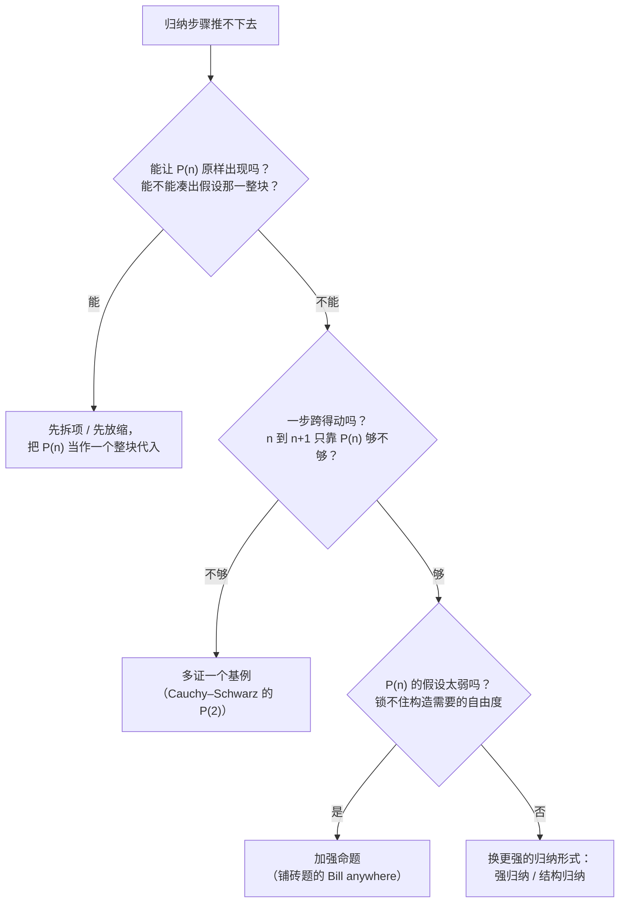

# 数学归纳法 I (Mathematical Induction I) — 归纳原理与三类经典证明

上一讲(LN3)结尾留了一句伏笔:四种证明方法都讲完了,"下一讲要讲一个非常重要的技术"。这一讲就是它。讲义开篇把话直接说满——归纳法大概是**整门课最重要的一种证明方法**(probably the most important one)。

讲义给本讲排了四块:

> * The idea of mathematical induction
> * Basic induction proofs (e.g. equality, inequality, property, etc.)
> * Inductive constructions
> * A "paradox" (an incorrect proof)

四块分工很清楚。第一块回答"**为什么需要它、它凭什么合法**";第二块回答"**怎么用它证等式 / 不等式 / 性质**";第三块展示它的另一种用法——**归纳不只能证明,还能构造对象**,这是整讲最有意思的部分;第四块反过来给一个**看起来像归纳、其实是错的**证明,把归纳法最容易翻车的地方暴露出来。

## 为什么要归纳:全称命题的困境 (Proving For-All Statements)

本讲的目标形式只有一种:

$$
\forall n \ge 0 \quad P(n).
$$

也就是"**对每个不小于 $0$ 的整数 $n$,命题 $P(n)$ 都成立**"。讲义举了三个例子说明这种形式有多常见:

| 命题 | 写成 $\forall$ 形式 | 难点在哪 |
| --- | --- | --- |
| 若 $m$ 是奇数,则对一切非负整数 $i$,$m^i$ 都是奇数 | $\forall i \ge 0\ \text{odd}(m^i)$ | 要证的命题有**无穷多个**,$i$ 取 $0,1,2,\dots$ 各是一个 |
| 任何整数 $n > 1$ 都能被某个素数整除 | $\forall n > 1\ \exists p\ (\text{$p$ 是素数} \wedge p \mid n)$ | 同上,且对每个 $n$ 找的素数还不同 |
| (Cauchy–Schwarz) 对任意 $a_1,\dots,a_n$ 与 $b_1,\dots,b_n$ | $\forall n\ge1$,不等式成立 | 待证的式子本身随 $n$ 变长 |

三例的共同点:要证的**不是一件事,而是无穷多件事**。列表里每一项都无辜地长得像——这正是问题所在。

### 全称推广规则为什么不顶用 (Universal Generalization)

LN2.2 里我们学过一条处理全称命题的规则,**全称推广** (universal generalization):

$$
\frac{A \to R(c)}{A \to \forall x.\ R(x)} \qquad \text{valid rule, providing } c \text{ is independent of } A
$$

拆开读:如果你在假设 $A$ 之下,能证出 $R(c)$——而这里的 $c$ 是一个你**没有做任何额外假设**的符号(它和 $A$ 无关)——那么你就有权把 $c$ 换成"任意 $x$",得到 $\forall x.\ R(x)$。这条规则在 LN2.2 已经出现过;当时它只是清单上的一项,现在我们第一次真正拿它去撞数学命题。

撞的结果是:**它合法,但不好用**。讲义的原话是"this is often difficult to prove directly"。原因是它要求你**一次性地、不借助任何关于 $c$ 的特殊信息**把 $R(c)$ 证出来。可回到上面那张表:要证 $m^i$ 是奇数,用哪条信息?$P(2)$ 的证明要用到"$m$ 是奇数"(事实),$P(5)$ 的证明要把这个事实用四次——**不同的 $n$ 需要的论证长度不同,而全称推广只允许你写一次**。对 Cauchy–Schwarz 更极端:左边有多少项完全取决于 $n$,$n$ 是符号时你甚至不知道该怎么展开。

这里要看清一件事:全称推广规则**依然是对的**,归纳法并没有否定它、也并非它的替代品。归纳法提供的是**另一条路**——讲义用了 "another way" 这个词。两者的关系后面 §归纳原理 会专门对照。

## 归纳的想法:两个引子 (The Idea of Induction)

讲义没有直接砸出公式,而是先给了两个例子,让"归纳"这个动作自己浮现出来。

### 引子一:奇数的幂还是奇数 (Odd Powers Are Odd)

先有一条已经知道的事实:

> **Fact**: 若 $m$ 是奇数、$n$ 是奇数,则 $nm$ 是奇数。

(两个奇数相乘,乘积还是奇数——这条本身很好证,直接展开 $m=2a+1,\ n=2b+1$ 就有 $nm = 2(2ab+a+b)+1$。)

要证的是:**固定一个奇数 $m$,对一切非负整数 $i$,$m^i$ 都是奇数**。记 $P(i)$ 为"$m^i$ 是奇数"这句话。讲义接着写的东西值得逐行看:

* $P(1)$ 由定义直接成立($m^1 = m$ 是奇数,这是前提);
* $P(2)$ 由 $P(1)$ 加上上面那条事实成立($m^2 = m \cdot m$,奇数乘奇数);
* $P(3)$ 由 $P(2)$ 加上那条事实成立($m^3 = m^2 \cdot m$);
* 一般地,$P(i+1)$ 由 $P(i)$ 加上那条事实成立($m^{i+1} = m^i\cdot m$);
* 所以对一切 $i$,$P(i)$ 成立。

前四行是**同一件事的重复**:每一步的动作完全一样,只是把 $i$ 换成了下一个数。第五行才是真正想要的结果,可它**不是由前四行推出来的**——前四行只告诉你 $P(1),\dots,P(4)$ 成立,推不出 $P(100)$。这个"$\dots$"里藏着的才是关键:第三行那行的写法是**关于任意 $i$ 的一句断言**,它才是一次性覆盖无穷多个 $i$ 的东西。讲义在下一页把这个动作单独拎了出来。

### 引子二:把无穷多条命题串成一条链

要证 $\forall n \ge 0\ P(n)$,等价于要证下面这**无穷多个命题全体为真**:

$$
P(0) \wedge P(1) \wedge P(2) \wedge \dots \wedge P(n) \wedge \dots
$$

讲义在这行下面画了一串**接力箭头**:从 $P(0)$ 底下引出一根弧线指向 $P(1)$,再从 $P(1)$ 指向 $P(2)$,一直指向右边无穷远处。配的文字是:

> The idea of induction is to first prove $P(0)$ unconditionally,
> then use $P(0)$ to prove $P(1)$
> then use $P(1)$ to prove $P(2)$
> and repeat this to infinity…

关键在 "unconditionally"(无条件地)。第一块砖 $P(0)$ 必须**不借助任何假设**直接立住,否则整串箭头没有起点。之后每一块砖都由前一块顶上去。这就是多米诺骨牌:**推倒第一张**(base case),并且**保证任意一张倒下时能撞倒下一张**(induction step),那么所有牌都会倒——即使牌有无穷多张。

注意这里有一个思维转折值得单独点出:我们不再试图"一次性看清所有 $n$",而是**只研究相邻两个 $n$ 之间的关系**。无穷多的事被压缩成了一件关于 $n$ 和 $n+1$ 的事。

## 归纳原理 (The Induction Rule)

### 规则本身

把上面的直觉写成推断式,就是**归纳原理** (the induction rule / principle of mathematical induction):

$$
\frac{P(0), \qquad \forall n \in \mathbb{N}\ \ P(n) \to P(n+1)}{\forall m \in \mathbb{N}\ \ P(m)}
$$

读法:上面的横线之上是**两条前提**,横线之下是**结论**。横线之上用逗号并列,意思是两条都要拿到:

1. $P(0)$ —— 第一块砖。讲义在旁边批注"The very easy to prove"(**最容易证的那一条**),因为它只是单个命题,套定义就能办。
2. $\forall n \in \mathbb{N}\ P(n) \to P(n+1)$ —— 承接机制。讲义批注"Much easier to prove with $P(n)$ as an assumption"。

第二条为什么"容易得多"?这正是整条规则的**全部魔力所在**:证 $P(n+1)$ 的时候,你手上**多了一个已知条件 $P(n)$**。讲义下面那段蓝底说明把这点讲得最清楚:

> The point is to use the knowledge on smaller problems to solve bigger problems (i.e. can assume $P(n)$ to prove $P(n+1)$).

"用小问题的知识去解决大问题"——证明 $P(5)$ 的时候,你被允许**免费拿走 $P(4)$**。这跟全称推广的处境完全相反:全称推广里你不能假设任何东西;归纳法里你必须假设点什么,而且规则明文允许。

页面上还配了排成一列倒下去的多米诺骨牌,以及那句概括——"(证 $0$ 与证 from $n$ to $n+1$) proves $0,1,2,3,\dots$"。

### 它是一条公理,不是定理

讲义在推断式左侧标了一行小字:

> induction rule (an axiom)

这一行值得停下来看。**归纳原理不是靠前面那些推理规则推出来的,它被直接接受为公理**(对自然数结构而言)。原因是:它讨论的是"所有自然数"这个无穷集合,而 LN2.2 那些规则(全称实例化、modus ponens 等)只能处理符号层面的操作,无法凭自身把一个由 $P(0)$ 加 $P(n)\to P(n+1)$ 构成的局部链条延伸成对全体自然数的断言。要跨过这道坎,必须额外承认一条关于 $\mathbb{N}$ 的公理,归纳原理就是最常见的那条(等价的说法还有**良序原理**,well-ordering principle:$\mathbb{N}$ 的每个非空子集都有最小元)。

顺带说一句:上一讲 LN3 里那个用"$n = ab$ 且 $a,b$ 更小,所以可以无限下降"来证的素数分解,当时讲义自己在页脚承认"later we will see a better proof by mathematical induction"——那句伏笔在这里兑现了。**无限下降法与归纳法是同一枚硬币的两面**(下降终止性的假设,就是良序原理),所以那里能用归纳法重写成更严整的版本。

### 和全称推广的对照

把两条规则摆在一起,差别一眼可见:

| | 全称推广 (universal generalization) | 归纳原理 (induction rule) |
| --- | --- | --- |
| 形状 | $\dfrac{A \to R(c)}{A \to \forall x.\ R(x)}$ | $\dfrac{P(0),\ \forall n\ P(n)\to P(n+1)}{\forall m\ P(m)}$ |
| 前提有几条 | 一条 | 两条(基例 + 承接步骤) |
| 证明时能假设什么 | **什么都不能**($c$ 必须与 $A$ 无关) | 可以假设 $P(n)$(且必须用到) |
| 覆盖范围 | 一次覆盖全部 $x$ | 逐级覆盖,像爬梯子 |
| 性质 | 逻辑推理规则 | **关于 $\mathbb{N}$ 的公理** |

两条规则并不冲突。全称推广更"通用",适合定义域小、结构简单的场合;归纳原理专门为 $\mathbb{N}$ 这种**有起点、每个元素都有唯一后继**的结构服务,代价是必须承认那条公理,收益是证明时可以"借前面那一步的结论"。

## 基本归纳证明 (Basic Induction Proofs)

讲义用三道题演示三种最典型的归纳证明:等式、性质、不等式,最后追加一道 Cauchy–Schwarz 作为"不太典型"的收尾。每种方法的写法其实都一样,讲义在第 15 页把这个共同骨架明确列成了三步(见 §三条重要提醒),这里先用起来。

### 证等式:立方和公式

待证命题是

$$
\forall n \ge 1, \qquad 1^3 + 2^3 + \dots + n^3 = \left(\frac{n(n+1)}{2}\right)^2.
$$

先花十秒看一眼这式子**在说什么**,因为它的内容比外表有意思:右边括号里的 $\frac{n(n+1)}{2}$ 正是 $1+2+\dots+n$,所以这条恒等式说的是

$$
1^3+2^3+\dots+n^3 = (1+2+\dots+n)^2.
$$

**前 $n$ 个立方之和,等于前 $n$ 个自然数之和的平方。** 取 $n=3$:左边 $1+8+27=36$,右边 $(1+2+3)^2=36$ ✓。

记 $P(n)$ 为"上式对 $n$ 成立"。讲义特别强调了一句:$P(n)$ 就是**归纳假设** (induction hypothesis)——这里先把它写清楚,是因为后面每一步都要拿它来替换,写不清楚就替换不对。

**基例 (Base case):$P(1)$ 成立。** 左边是 $1^3=1$,右边是 $\left(\frac{1\cdot 2}{2}\right)^2 = 1$。$1=1$ ✓。

**归纳步骤 (Induction step):假设 $P(n)$ 成立,证明 $P(n+1)$ 成立。** 也就是说,已知

$$
1^3+2^3+\dots+n^3 = \left(\frac{n(n+1)}{2}\right)^2
$$

要证

$$
1^3+2^3+\dots+n^3+(n+1)^3 = \left(\frac{(n+1)(n+2)}{2}\right)^2.
$$

注意到要证的左边**比归纳假设左边多了一项** $(n+1)^3$——这是所有"求和型"归纳题的通用形状。于是从左边出发:

$$
\begin{aligned}
& 1^3 + 2^3 + \dots + n^3 + (n+1)^3 \\
&= \left(\frac{n(n+1)}{2}\right)^2 + (n+1)^3 && \text{(by induction)}
\end{aligned}
$$

第一步是**唯一需要灵感的动作**:把前 $n$ 项整体替换成归纳假设的右边。讲义在这个等号旁边挂了一个 "by induction" 的小框,就是在提醒阅卷人"这一步用了 $P(n)$,不是凭空来的"。替换之后,式子里已经没有 $\sum$ 了,剩下纯代数:

$$
\begin{aligned}
\left(\frac{n(n+1)}{2}\right)^2 + (n+1)^3
&= (n+1)^2\left(\frac{n^2}{4} + n + 1\right) \\
&= (n+1)^2 \cdot \frac{n^2+4n+4}{4} \\
&= (n+1)^2 \cdot \frac{(n+2)^2}{4} \\
&= \left(\frac{(n+1)(n+2)}{2}\right)^2
\end{aligned}
$$

第二行到第三行是**整个证明的技术核心**,值得说透:$n^2+4n+4$ 恰好是 $(n+2)^2$。这不是巧合,而是**倒推**出来必然如此——回头看去证的目标是 $\left(\frac{(n+1)(n+2)}{2}\right)^2$,它拆开就是 $(n+1)^2 \cdot \frac{(n+2)^2}{4}$。也就是说,在动笔之前你就应该已经知道"要把 $\frac{n^2}{4}+n+1$ 凑成 $\frac{(n+2)^2}{4}$"。(顺手验证一下:$\left(\frac{n(n+1)}{2}\right)^2 = \frac{n^2(n+1)^2}{4}$,提公因子 $(n+1)^2$ 后括号里剩 $\frac{n^2}{4} + (n+1) = \frac{n^2}{4}+n+1$ ✓。)

**等式两端对上了,$P(n+1)$ 成立。** 由归纳原理,$\forall n\ge1$ 命题成立。$\blacksquare$

这类题给人的错觉是"代数凑巧成立"。真实情况是:**目标的形式决定了你要凑什么**,证明的难度全在"提前看出该凑成 $(n+2)^2$"这一步。

### 证性质:整除性 $3 \mid 2^{2n}-1$

待证命题:

$$
\forall n \ge 1, \qquad 3 \mid 2^{2n} - 1
$$

("$3 \mid x$" 读作"$3$ 整除 $x$",即 $x$ 是 $3$ 的倍数。)先看一眼它在说什么:$2^{2n} = (2^2)^n = 4^n$,所以这说的是 **$4$ 的任意次幂减去 $1$,都是 $3$ 的倍数**。

**基例 ($n=1$):** $2^{2\cdot1}-1 = 4-1 = 3$,是 $3$ 的倍数 ✓。(顺便一提,命题对 $n=0$ 也成立:$2^0-1 = 0 = 3\cdot0$。讲义选择从 $n=1$ 开始,更稳妥。)

**归纳步骤:设 $P(i)$ 对某个 $i \ge 1$ 成立,证 $P(i+1)$。** 注意讲义这里把指标从 $n$ 换成了 $i$——只是换了个字母,表示"当前假设的那个数",别被绕住。

已知 $3 \mid 2^{2i}-1$,要证 $3 \mid 2^{2(i+1)}-1$。这里不能像上题那样直接"替换",因为**目标式子里的 $2^{2i}$ 不是孤零零的一个整块**,它被套在指数上。所以先把它拆开:

$$
\begin{aligned}
2^{2(i+1)} - 1 &= 2^{2i+2} - 1 \\
&= 4 \cdot 2^{2i} - 1
\end{aligned}
$$

($2^{2i+2} = 2^{2i}\cdot 2^2 = 4\cdot 2^{2i}$ ✓。)现在 $2^{2i}$ 露出来了,但前面顶着一个系数 $4$,还是接不上 $2^{2i}-1$。关键的一步是**把 $4$ 写成 $3+1$**:

$$
\begin{aligned}
4 \cdot 2^{2i} - 1 &= (3+1)\cdot 2^{2i} - 1 \\
&= 3 \cdot 2^{2i} + 2^{2i} - 1
\end{aligned}
$$

讲义在这一行下面画了两个**大括号**外加两个虚线框,分别标注:

* $3 \cdot 2^{2i}$ —— **Divisible by 3**(显然,它就是 $3$ 乘一个整数);
* $2^{2i} - 1$ —— **Divisible by 3 by induction**(这正是归纳假设 $P(i)$ 说的)。

两个 $3$ 的倍数相加仍是 $3$ 的倍数,所以 $2^{2(i+1)}-1$ 是 $3$ 的倍数,$P(i+1)$ 成立。由归纳原理,命题得证。$\blacksquare$

**这类题的动作可以总结成一句话:拆出一个"显然被整除的块",再把剩下的部分凑成归纳假设的原样。** 而"把 $4$ 写成 $3+1$"这一步是全部技术含量所在——它为什么是 $3$ 而不是别的数?因为**目标就是要造出 $3$ 的倍数**。看清目标,拆法就定了。

**这个结论在后面的铺砖问题里还会再出现一次**(见 §铺砖问题),到时你会看到它并不只是道练习题。

### 证不等式:$\sum_{k=1}^{n} \frac{1}{\sqrt{k}} > \sqrt{n}$

待证命题:

$$
\forall n \ge 2, \qquad \frac{1}{\sqrt{1}} + \frac{1}{\sqrt{2}} + \dots + \frac{1}{\sqrt{n}} > \sqrt{n}
$$

**先是基例的选择,这里有个小坑。** 讲义写的是 "Base Case ($n=2$): is true",没解释为什么不用 $n=1$。自己试一下就知道:$n=1$ 时左边 $=\frac{1}{\sqrt1}=1$,右边 $=\sqrt1=1$,得到的是 $1>1$——**假**。所以命题的起点只能是 $n=2$。验一下 $n=2$:$\frac{1}{\sqrt1}+\frac{1}{\sqrt2} \approx 1+0.7071 = 1.7071 > \sqrt2 \approx 1.4142$ ✓。

这说明一件事:**基例不是从 $n=1$ 起就随便写的**,它是命题真正开始成立的那一点。写归纳证明前,必须先确认命题从哪个 $n$ 起为真。

**归纳步骤:设 $P(n)$ 对某个 $n \ge 2$ 成立,证 $P(n+1)$。** 已知

$$
\frac{1}{\sqrt{1}} + \dots + \frac{1}{\sqrt{n}} > \sqrt{n},
$$

要证

$$
\frac{1}{\sqrt{1}} + \dots + \frac{1}{\sqrt{n}} + \frac{1}{\sqrt{n+1}} > \sqrt{n+1}.
$$

和等式题一样的套路:前 $n$ 项整体用归纳假设替换,但**替换方向要注意**——我们已知前 $n$ 项 $> \sqrt n$,所以

$$
\frac{1}{\sqrt{1}} + \dots + \frac{1}{\sqrt{n}} + \frac{1}{\sqrt{n+1}} > \sqrt{n} + \frac{1}{\sqrt{n+1}}.
$$

(不等式只能往一个方向用:$A > B$ 且 $A' \ge A$ 才能推出 $A' > B$。这里 $A'$ 是"前 $n$ 项加上一个正项",所以 $A' > A$ ✓。)现在问题变成:**$\sqrt{n} + \frac{1}{\sqrt{n+1}}$ 是否 $> \sqrt{n+1}$?** 通分:

$$
\sqrt{n} + \frac{1}{\sqrt{n+1}} = \frac{\sqrt{n}\sqrt{n+1}+1}{\sqrt{n+1}}.
$$

接下来要把这个分式与 $\sqrt{n+1}$ 比较。注意

$$
\sqrt{n+1} = \frac{n+1}{\sqrt{n+1}},
$$

所以只要说明分子 $\sqrt{n}\sqrt{n+1}+1 > n+1$ 就够了。而这是真的:两边同减 $1$ 得 $\sqrt{n}\sqrt{n+1} > n$,平方得 $n(n+1) > n^2$,即 $n > 0$——对一切 $n \ge 1$ 成立 ✓。于是

$$
\frac{\sqrt{n}\sqrt{n+1}+1}{\sqrt{n+1}} > \frac{n+1}{\sqrt{n+1}} = \sqrt{n+1}.
$$

串起来就得到 $P(n+1)$。由归纳原理,命题对一切 $n\ge2$ 成立。$\blacksquare$

> **讲义在这里有一处笔误,必须先纠正再照抄。** 幻灯片上这一段的中间两行写的是
>
> $$\frac{\sqrt n\sqrt{n+1}}{\sqrt{n+1}} = \frac{n+1}{\sqrt{n+1}}$$
>
> 这个等式**是错的**:左边 $=\sqrt n$,右边 $=\sqrt{n+1}$,两者不相等(只有 $n = n+1$ 才成立)。正确的写法应该**跳过中间那个分式**,直接从分子的比较得到结论,也就是上面那两行。按讲义原样抄,整个证明就断了。详见 §附:讲义勘误。

这题暴露了不等式归纳和等式归纳的**根本区别**:等式题里,把归纳假设代进去以后剩下的全是恒等变形,方向无所谓;**不等式题里,你必须刻意地"放缩"**——把要证的左边换成一个更小的量,只要连这个更小的量都已经超过目标就行。这一步"故意变弱"是有技巧的,也是不等式归纳题的全部难度。

### Cauchy–Schwarz 不等式:需要两个基例的归纳

待证的是数学里最有名的不等式之一:

$$
a_1b_1 + a_2b_2 + \dots + a_nb_n \le \sqrt{a_1^2 + a_2^2 + \dots + a_n^2}\ \sqrt{b_1^2 + b_2^2 + \dots + b_n^2}
$$

($a_1,\dots,a_n$ 与 $b_1,\dots,b_n$ 是任意两组实数。)左边是两个向量的**内积**,右边是两个向量的**长度之积**,整句话是"内积不超过长度之积"。

**归纳步骤先看,因为这道题的难点全在这里。** 假设命题对 $n$ 成立,要证对 $n+1$ 成立。左边多出一项:

$$
a_1b_1 + \dots + a_nb_n + a_{n+1}b_{n+1}.
$$

对前面 $n$ 项用归纳假设,把它们的上界记成一个整体,讲义把这两个根号分别命名为 $c$ 和 $d$:

$$
c := \sqrt{a_1^2 + \dots + a_n^2}, \qquad d := \sqrt{b_1^2 + \dots + b_n^2}.
$$

于是前 $n$ 项 $\le c\,d$,自然想往下写

$$
c\,d + a_{n+1}b_{n+1} \le \sqrt{c^2 + a_{n+1}^2}\ \sqrt{d^2 + b_{n+1}^2} \quad (\star)
$$

讲义在 $(\star)$ 这一行旁边挂了一个大大的"思考"表情并配文 **"How to get to this step?"**——因为它不是显然的。看破它的方法:把 $(c,\ a_{n+1})$ 看成**一个二维向量**,把 $(d,\ b_{n+1})$ 看成**另一个二维向量**。那么

$$
(\star) \iff \text{（二维的内积）} \le \text{（二维的长度之积）},
$$

**也就是说,$(\star)$ 恰好就是 $n=2$ 时的命题 $P(2)$!** 讲义在下一行直接标了 "This is exactly $P(2)$!"。

把 $c^2$、$d^2$ 展开回去,$\sqrt{c^2+a_{n+1}^2} = \sqrt{a_1^2+\dots+a_{n+1}^2}$ ✓,右边同理,正是 $P(n+1)$。证毕。$\blacksquare$

**所以基例要证两个:**

* $P(1)$:左边 $= a_1b_1$,右边 $= \sqrt{a_1^2}\sqrt{b_1^2} = |a_1||b_1|$,而 $a_1b_1 \le |a_1b_1| = |a_1||b_1|$ ✓。
* $P(2)$:要证 $a_1b_1 + a_2b_2 \le \sqrt{a_1^2+a_2^2}\sqrt{b_1^2+b_2^2}$。两边都是正数,平方不改变方向,于是等价的只需看

$$
(a_1^2+a_2^2)(b_1^2+b_2^2) - (a_1b_1+a_2b_2)^2 \ge 0.
$$

把第一项展开:

$$
\begin{aligned}
& a_1^2b_1^2 + a_1^2b_2^2 + a_2^2b_1^2 + a_2^2b_2^2 - a_1^2b_1^2 - 2a_1b_1a_2b_2 - a_2^2b_2^2 \\
&= a_1^2b_2^2 + a_2^2b_1^2 - 2a_1a_2b_1b_2 \\
&= (a_1b_2 - a_2b_1)^2 \ \ge 0
\end{aligned}
$$

四项约掉两项($a_1^2b_1^2$ 与 $-a_1^2b_1^2$、$a_2^2b_2^2$ 与 $-a_2^2b_2^2$),剩下的三行恰好是**完全平方** $(a_1b_2 - a_2b_1)^2$,而平方永不为负 ✓。

**这道题的方法论价值比它的结论更大。** 它示范了一种通用的归纳步骤设计:

> 把"$n+1$ 项"拆成"**前 $n$ 项(已由归纳假设控制)+ 1 项(新的)**",把前 $n$ 项的上界打包成一个整体,然后**用一个小的基例(这里是 $P(2)$,即二维情形)把这个打包后的整体和新项重新组装起来**。

讲义在第 12 页把归纳步骤写成 "assume true for $\le n$, prove $n+1$",措辞像**强归纳** (strong induction);但实际用到的只有 $P(n)$ 和 $P(2)$ 两条,并不需要 $P(1),\dots,P(n-1)$ 全部。所以这里更准确的理解是:**归纳步骤同时依赖一个已经被前一步证好的"大情形"和一个单独证好的"小情形"**——这是"单个基例不够用"的第一个例子,后面 §三条重要提醒 还会点名。

### 三条重要提醒 (Some Remarks)

讲义在第 15 页停下,把归纳证明的三个必备动作列成了清单。这三条不是可选建议,是**格式要求**:

> * **First step**: write down clearly the inductive hypothesis $P(n)$.
>   (This is sometimes super IMPORTANT!!! You will see this soon.)
> * **Second step**: prove the base case $P(1)$, $P(2)$, etc.
>   (You may need to prove more than one base cases sometimes. E.g. Cauchy-Schwarz inequality.)
> * **Inductive step**: prove the inductive case, that is, show $P(n) \Rightarrow P(n+1)$
>   (You need to make sure you have used the assumption $P(n)$.)

逐条说清它们的含义:

**第一条:先把 $P(n)$ 写清楚。** 这句话看起来像文件夹里的废话,但它被加了三个感叹号外加一句"you will see this soon"——这是讲义在**预告铺砖问题**。铺砖问题的原始命题办不成,原因正是 $P(n)$ 写得不够强;把它换成一个更强的 $P(n)$,整个归纳就通了。**同一道题,同一个归纳法,仅仅因为 $P(n)$ 选得不同就从"证不出"变成"一眼就通"**——这是本讲最反直觉、也最重要的一个点。

**第二条:基例可能不止一个。** Cauchy–Schwarz 就是现成的例子。还有一类更隐蔽的情形:如果归纳步骤从 $P(n)$ 推 $P(n+1)$ 时其实需要"$P(n)$ 和 $P(n-1)$"两条一起用(比如 Fibonacci 型递推),那基例就必须把 $P(1)$ 和 $P(2)$ 都验掉,否则链条一开始就没有第二块砖。

**第三条:必须真的用到 $P(n)$。** 这一条是**检查错误的自检信号**。如果你在证 $P(n+1)$ 的过程中从头到尾没碰过 $P(n)$,那就说明:要么这个命题根本不需要归纳法(直接证就行),要么你某个地方推错了、把归纳假设该出现的位置漏掉了。下面 §一个"悖论" 里的错误证明,以及很多初学者犯的错,都能被这条检查抓住。

## 归纳构造 (Inductive Constructions)

前面所有内容里,归纳法都只是**证明工具**。这一节换一种用法:**用归纳法逐步造出对象**。这是本讲最有意思的一块,也是归纳法在计算机科学里真正大显身手的地方。

### Gray 码 (Gray Code)

**问题:** 能不能把所有 $n$ 位二进制串排成一个序列,使得**相邻两个串只差一个比特**?

这样的序列叫 **Gray 码** (Gray code),讲义说它"has some applications"。先看小例子($n=2$ 和 $n=3$):

| 2 位 | 3 位 |
| --- | --- |
| 00 | 000 |
| 01 | 001 |
| 11 | 011 |
| 10 | 010 |
| — | 110 |
| — | 111 |
| — | 101 |
| — | 100 |

自己核一遍 3 位那一列:000→001 差最后一位;001→011 差中间一位;011→010 差最后一位;010→110 差首位;110→111、111→101、101→100 各差一位 ✓。**没有一处相邻两行差多于一位。**

看出来了吗?**3 位的列表是把 2 位的列表"改造"出来的**:前四行 = `0` 加上 2 位列表的每一行(00→000, 01→001, 11→011, 10→010);后四行 = `1` 加上 2 位列表的**倒序**(10→110, 11→111, 01→101, 00→100)。讲义在旁边追问:"Can you see the pattern? How to construct 4-bit gray code?"——这就是要求你把它**归纳地**想出来。

**归纳构造 (on $n$):** 已知一个 $n$ 位 Gray 码 $L_n$(一个长度为 $2^n$ 的序列),构造 $n+1$ 位的:

$$
L_{n+1} \;=\; \big[\ 0\ \Vert\ \ell \quad :\ \ell \in L_n \ \big] \quad \text{后接} \quad \big[\ 1\ \Vert\ \ell \quad:\ \ell \in L_n^{\text{reversed}} \ \big]
$$

($0\Vert\ell$ 表示"在 $\ell$ 前面加一位 $0$"。)前半段是把 $L_n$ 原样抄一遍、每行前缀 $0$;后半段是把 $L_n$ **倒着**抄一遍、每行前缀 $1$。用 4 位验证(讲义第 18 页原表):

| 前半段(前缀 0) | 后半段(前缀 1,来自倒序) |
| --- | --- |
| 0000 | 1100 |
| 0001 | 1101 |
| 0011 | 1111 |
| 0010 | 1110 |
| 0110 | 1010 |
| 0111 | 1011 |
| 0101 | 1001 |
| 0100 | 1000 |

**为什么这样拼一定对?** 要检查三件事,讲义在图上用箭头分别标了出来:

1. **前半段内部相邻两行只差一位** —— 因为去掉前缀 $0$ 之后就是 $L_n$ 的相邻两行,由归纳假设只差一位,而共同的前缀 $0$ 不构成差别。(讲义标 "differed by 1 bit **by induction**"。)
2. **后半段内部同理** —— 倒序不改变"相邻只差一位"这个性质。
3. **两段交界处只差一位** —— 前半段最后一行是 $0\Vert$($L_n$ 的末项),后半段第一行是 $1\Vert$($L_n$ 的末项,因为倒序后它跑到最前面了)。**两行只差最前面那一位**。讲义标 "differed by 1 bit **by construction**"(由构造保证)。

再加一条:每个 $(n+1)$ 位串都**恰好出现一次**——因为任何 $(n+1)$ 位串的首位不是 $0$ 就是 $1$,去掉首位后是一个 $n$ 位串,而它在 $L_n$ 里恰好出现一次,所以两种前缀各收它一次,总和恰好一次。(讲义原文:"Every $(n+1)$-bit string appears exactly once.")

**归纳构造能成立,靠的是一个隐含条件,讲义没有明说:$L_n$ 必须以上下文里的 $00\ldots0$ 开头、以 $10\ldots0$ 结尾。** 检查一下:3 位列表以 `000` 开头、以 `100` 结尾 ✓;2 位以 `00` 开头、`10` 结尾 ✓;4 位以 `0000` 开头、`1000` 结尾 ✓。这个性质正是第 3 条(交界处只差一位)能成立的**前提**——如果 $L_n$ 的末项不是 $10\ldots0$ 而是别的,那么"$0\Vert$末项"和"$1\Vert$末项"之间除了首位之外还可能有别的位不同,构造当场失效。

顺带说明:这个性质有个名字——上面构造出的 Gray 码是**循环的** (cyclic),它的**首项与末项也只差一位**($00\ldots0$ 与 $10\ldots0$ ✓)。这正好让下一轮归纳能继续用(因为下一轮的 $L_{n+1}$ 也必须"以 $00\ldots0$ 开头、以 $10\ldots0$ 结尾",而构造恰好给出这一性质)。

**基例是 $n=1$:** $L_1 = (0,\ 1)$。它以 $0$ 开头、以 $1$ 结尾,且两项只差一位 ✓。讲义只画了 2 位和 3 位两张表,没有显式写出 $n=1$ 作基例——但按构造往上推,2 位表正是从 1 位表得到的,所以 $n=1$ 就是基例。

### 铺砖问题:加强命题的艺术 (Tromino Tiling / Bill's Puzzle)

这是本讲的**压轴题**,也是"$P(n)$ 写得好不好决定成败"最生动的一次示范。

**设定。** 有一块 $2^n \times 2^n$ 的正方形棋盘,棋盘中心有一格被 Bill 占了(讲义用一张人脸照片表示 Bill),其余格子要全部铺满。能用的砖只有一种:**三格骨牌** (tromino),它是 L 形的,一次覆盖三个格子。$8\times8$ 的棋盘有 $64$ 格,Bill 占 $1$ 格,剩 $63$ 格,$63 = 21 \times 3$ ✓ 刚好用 $21$ 块。

**先看这里的一处呼应。** 铺垫是否可能,一个**必要条件**是剩余格子数必须是 $3$ 的倍数,也就是 $2^{2n} - 1$ 必须能被 $3$ 整除。**这正是 §证性质 里刚证过的那条命题!** 讲义在第 22 页专门框出一句:"(Do you remember that we proved $2^{2n}-1$ is divisible by $3$?)"。所以那道整除题不是练习题,它是在这里保证**计数上不构成障碍**。(注意:必要条件的成立并不能推出一定能铺,它只是排除了一种明显的失败方式;真正的构造在下面。)

**第一次尝试:直接归纳,结果卡在第一步。**

$$
P(n) := \text{能把 } 2^n \times 2^n \text{ 的棋盘铺满,且 Bill 在正中间。}
$$

* **基例 ($n=0$)**:棋盘是 $1\times1$,只有 Bill 一格,**不需要任何砖** ✓。(Bill 在"正中间"这件事对 $1\times1$ 来说也无争议。)
* **归纳步骤**:假设能把 $2^n\times2^n$ 铺好且 Bill 在正中,要处理 $2^{n+1}\times 2^{n+1}$。自然的做法是把大棋**切成四个 $2^n\times2^n$ 的象限**。可切完之后就愣住了——**Bill 只在一个象限里**,另外三个象限里没有 Bill,它们各自是一块"要全铺满"的完整正方形,而"全铺满"这件事跟我们假设的 $P(n)$ 不一样($P(n)$ 说的是"留一格给 Bill")。讲义在这里画了一个 "Now what??" 的气泡。

卡住的**根本原因**是:$P(n)$ 这个命题太弱,它只保证"Bill 在正中"这一种情形,而我们需要的却是"Bill 在任意指定位置"。于是有了本讲最漂亮的一步——

**换一个更强的命题 (a stronger property)。** 讲义把它叫做 Theorem B:

$$
P_B(n) := \text{能把 } 2^n \times 2^n \text{ 的棋盘铺满,且 Bill 在}\textbf{任意} \text{指定的位置。}
$$

Theorem B 明显**蕴涵**原来那个定理("正中间"只是"任意位置"中的一个特殊位置)。按常理,"更强的命题"应该更难证,但讲义指出:**恰恰相反,它更好证**。原因在归纳步骤里——

> Note 1: It may help to choose a stronger statement (i.e., $P(n)$) than the desired result (e.g. "Bill in anywhere"). We need to prove a stronger statement, but in return we can assume a stronger property in the induction step.

"我们要多证一点,但换来的回报是:归纳步骤里可以假设更多。"归纳法的力量全在"归纳假设 $P(n)$ 能用",所以**把 $P(n)$ 加厚,就是在给归纳步骤补充弹药**。

**用 Theorem B 走一遍归纳步骤。** 把 $2^{n+1}\times2^{n+1}$ 切成四个 $2^n\times2^n$ 象限:

1. Bill 真实所在的那个象限:按照归纳假设(现在是 Theorem B,$P_B(n)$),可以在**任意位置**铺好——就选 Bill 的真实位置,把它铺满。
2. 另外三个象限:它们没有 Bill。**但我们故意往每个象限里"借"一个假 Bill**——位置就选在**紧邻大棋盘中心的那一格**。因为归纳假设允许 Bill 在任意位置,这个要求也满足得了,于是三个象限都能按假设铺满。
3. 现在这三个"假 Bill"格子各自被留空了。它们在哪儿?大棋盘的中心点是四个象限的交界处,围着它有四格(每象限一格)。其中一格属于第 1 步那个(真 Bill 所在的)象限,**剩下三格恰好就是我们在第 2 步留空的三个格子,而这三格组成一个标准的 L 形三格骨牌!** 讲义原话:"Now group the squares together, and fill the center with a tromino."——用**一块**骨牌把这三个格子同时覆盖掉。

至此整个 $2^{n+1}\times2^{n+1}$ 棋盘被骨牌铺满,只留 Bill 一格,且 Bill 可以在任意位置。$P_B(n+1)$ 成立。

**基例 ($n=0$):** $P_B(0)$ 说"$1\times1$ 棋盘上 Bill 可以在任意位置"——只有一格,Bill 当然只能在那儿,成立 ✓。

由归纳原理,$P_B(n)$ 对一切 $n\ge0$ 成立;而 $P_B$ 蕴涵原定理,所以原定理也对一切 $n \ge 0$ 成立。$\blacksquare$

讲义还补了一条很值得记的观察:

> Note 2: The induction proof of "Bill anywhere" implicitly defines a recursive algorithm for finding such a tiling.

**这段证明同时是一个递归算法的伪代码。** 归纳步骤"切成四个象限、递归处理、中心补一块骨牌"直接就是算法的三步:规模 $2^n$ 的问题被约化成四个规模 $2^{n-1}$ 的子问题加一次常数动作。这个算法的复杂度是 $T(n) = 4T(n-1) + O(1)$,解出来 $T(n) = O(4^n)$,与棋盘格子数同阶——也就是说它是**线性时间**的(输入规模就是 $4^n$ 个格子)。"归纳证明 = 递归算法"这个对应关系,在计算机科学里出现得极其频繁。

### Hadamard 矩阵

**问题:** 能不能构造一个 $n\times n$ 的矩阵,所有元素取 $\pm 1$,且**任意两行都正交**?

先用到的定义是**内积** (inner product):对 $a = (a_1,\dots,a_n)$ 和 $b = (b_1,\dots,b_n)$,

$$
a\cdot b = a_1b_1 + a_2b_2 + \dots + a_nb_n.
$$

两行**正交** (orthogonal) 就是它们的内积为 $0$。讲义提到这类矩阵很有名,在**编码理论** (coding theory) 里有应用。

**先看小例子**——讲义建议"想归纳,先凑小例子"。最小的非平凡例子是

$$
H_2 = \begin{bmatrix} 1 & 1 \\ 1 & -1 \end{bmatrix}
$$

两行 $(1,1)$ 与 $(1,-1)$ 的内积 $= 1\cdot1 + 1\cdot(-1) = 0$ ✓,元素全是 $\pm1$ ✓。

**归纳构造 (on $n$):** 若已有 $n\times n$ 的 Hadamard 矩阵 $H_n$,把它拼成一个 $2n\times 2n$ 的:

$$
H_{2n} = \begin{bmatrix} H_n & H_n \\ H_n & -H_n \end{bmatrix}
$$

(四个 $n\times n$ 的方块,右下角那个整体取负。)

**验证 $H_{2n}$ 确实是 Hadamard 矩阵。** 设 $H_n$ 的行依次是 $r_1,\dots,r_n$(它们按归纳假设两两正交)。那么 $H_{2n}$ 的行是两类:

* 前 $n$ 行:$R_i = (r_i,\ r_i)$,$i = 1,\dots,n$;
* 后 $n$ 行:$R_{n+i} = (r_i,\ -r_i)$,$i = 1,\dots,n$。

分三种情况验证内积(只需要验证下标不同的一对):

**情况一:两行都来自前 $n$ 行。** 取 $R_i,R_j$($i\ne j$):

$$
R_i \cdot R_j = r_i\cdot r_j + r_i\cdot r_j = 0 + 0 = 0
$$

第一个 $0$ 来自 $H_n$ 的行正交(归纳假设),第二个 $0$ 是同一个事实再用一次。

**情况二:两行都来自后 $n$ 行。** 取 $R_{n+i},R_{n+j}$($i\ne j$):

$$
R_{n+i}\cdot R_{n+j} = r_i\cdot r_j + (-r_i)\cdot(-r_j) = 0 + 0 = 0
$$

**情况三:一行在前、一行在后。** 取 $R_i$ 与 $R_{n+j}$:

$$
R_i \cdot R_{n+j} = r_i\cdot r_j + r_i\cdot(-r_j) = r_i\cdot r_j - r_i\cdot r_j = 0
$$

这一格最干净:两个内积**永远互相抵消**,连 $i \ne j$ 都不需要。特别地当 $i=j$ 时,$r_i\cdot r_i = n$、$r_i\cdot(-r_i) = -n$,和仍是 $0$ ✓。

三种情况全部成立,所以 $H_{2n}$ 是 Hadamard 矩阵。

**收尾。** 从 $H_1 = [1]$(平凡地成立:只有一行,不存在"两行"要检查)出发反复套用,就得到:对一切 $k \ge 0$,存在 $2^k \times 2^k$ 的 Hadamard 矩阵。讲义原文写的是 "there is a $2k$ x $2k$ Hardmard matrix for any $k$"——这里有两处笔误($2k$ 应为 $2^k$;"Hardmard" 应为 "Hadamard"),见 §附:讲义勘误。

**剩下两个讲义没有解决的问题。** 讲义问:"奇数 $n$ 能存在吗?"——回答说 **NO**,"偶数 $n$ 呢?"——回答说 **Not sure**,并说这引出长期的"**Hadamard 猜想**" (Hadamard conjecture)。这两句话都需要一点补充才准确:

* **奇数情形**:严格地说,例外是 $n=1$($[1]$ 就是 $1\times1$ 的 Hadamard 矩阵)。对 $n>1$ 的奇数,确实不存在。更强的结论是:若 $n\times n$ 的 Hadamard 矩阵存在且 $n>2$,则必然 $4 \mid n$。(证明思路:把各行、各列分别乘以 $\pm1$ 做"规范化",可让第一行和第一列全变成 $+1$;此时其余每一行必须与第一行正交,故一行中 $+1$ 和 $-1$ 各占一半,推出 $n$ 为偶数;再把第二行也规范化成全 $+1$,则第 $3$ 行往后的每一行与前两行都正交,四种符号组合 $(1,1),(1,-1),(-1,1),(-1,-1)$ 必须各出现 $n/4$ 次,于是 $4 \mid n$。)所以 $n \equiv 2 \pmod 4$ 且 $n > 2$ 时(如 $n=6$)也是不存在的——讲义"偶数情形不确定"这个说法因此不够精确:**真正未解决的只是 $n \equiv 0 \pmod 4$ 那一支**。
* **Hadamard 猜想**的内容就是:对一切 $4 \mid n$,都存在 $n\times n$ 的 Hadamard 矩阵。目前对很大的范围已构造性地验证过,但没有一般证明——这才是它"long term"的原因。

### 归纳构造能造什么

讲义在第 35 页把这种技术单独列了一页,强调 "This technique is very useful",并给了一串能造的东西:

> codes(编码)、graphs(图)、matrices(矩阵)、circuits(电路)、algorithms(算法)、designs(设计)、proofs(证明)、buildings(建筑)、…

最后那个"buildings"不是玩笑——本讲三个例子里,Gray 码是**构造一个序列**,铺砖是**构造一个几何铺法**,Hadamard 矩阵是**构造一个矩阵**。它们的共同结构是:

> **先造出最小规模的对象(基例),再给出一个"把规模 $k$ 的对象改造成规模 $k+1$ 的对象"的机械规则(归纳步骤)。**

值得强调:**这类归纳不是在证明某个命题,而是在"生产"对象**。归纳步骤给出的规则本身就是一份**配方**,照它执行就能得到任意大规模的对象(铺砖问题里讲义专门点出了这一点,见 Note 2)。这也是为什么归纳法在算法设计、编码构造、电路综合这些"造东西"的领域里地位特殊。

## 一个"悖论":所有马同色 (A "Paradox")

讲义最后用一个**错误证明**收尾。它的价值不在于结论(结论显然是假的),而在于**它错得极其隐蔽**。

**"定理":所有马都是同一个颜色。**

**"证明" (对 $n$ 归纳)。** 归纳假设取

$$
P(n) := \text{任意 } n \text{ 匹马的集合里,所有马颜色相同。}
$$

* **基例 ($n=0$)**:没有马,"所有马颜色相同"这句话**空洞地成立**(vacuously true)——不存在反例。讲义写着 "No horses, so obviously true!" ✓。
* **归纳步骤**:假设任意 $n$ 匹马同色,证任意 $n+1$ 匹马同色。取 $n+1$ 匹马排成一列,造两个集合:$S_1$ = 前 $n$ 匹、$S_2$ = 后 $n$ 匹。两个集合大小都是 $n$,按归纳假设各自**内部**同色。而两个集合**有重叠**——$S_1$ 和 $S_2$ 共有的马(从第 $2$ 匹到第 $n$ 匹,共 $n-1$ 匹)同时属于两边。取其中任意一匹作为"桥梁":它在前一组里是某色,在后一组里也是同一匹马,所以也是同色,于是前 $n$ 匹与后 $n$ 匹的颜色被迫一致。$n+1$ 匹马全部同色,$P(n+1)$ 成立。

两边都立住了,按归纳原理,"所有马同色"。**荒谬。**

**错在哪里。** 讲义把答案直接摆出来了:

> Proof of $P(n) \to P(n+1)$ is **false when $n = 1$**, because the two horse groups do not overlap.

在 $n=1$ 这一步:$n+1 = 2$ 匹马;$S_1$ = 前 $1$ 匹,$S_2$ = 后 $1$ 匹——但两匹马总共只有两匹,$S_1$ 是第 $1$ 匹,$S_2$ 是第 $2$ 匹,**它们没有交集**。"$|S_1 \cap S_2| = n-1$"这个计算在 $n=1$ 时给出 $0$,也就是**"桥梁"不存在**,没有共同的马去把两边颜色钉在一起。于是 $P(1) \to P(2)$ 这一步推不出来,链条在最需要它的地方断了。

讲义补了一句关键的话:

> (But the proof works for all $n \ne 1$)

**这句话才是这个例子真正的重点。** 归纳步骤对 $n = 2,3,4,\dots$ **全部是正确的**:只要有 $n \ge 2$,两个集合就有 $n-1 \ge 1$ 匹重叠的马当桥梁,论证完全成立。所以这个"证明"的失败**不在整体逻辑,而在恰好一环**:$n=1$ 那一环。而链条断一环,整条就断——因为想从 $P(1)$ 走到 $P(2)$ 就必然要经过 $n=1$ 这一环。

**三条教训。** 这个例子之所以放进讲义,是因为它一次暴露了三种常见错误:

1. **基例对、归纳步骤"看起来"对,不等于证明对。** $P(0)$ 空洞成立、$P(1)$ 平凡成立(集合里只有一匹马,当然同色),开局无比顺当,问题出在中间的**承接环节**。而承接环节必须对范围内**每一个** $n$ 验证:这个例子的论证结构**随 $n$ 变化**($n=1$ 时 $S_1\cap S_2=\varnothing$,$n\ge2$ 时非空),结构会变就必须逐点检查,不能因为前几个 $n$ 顺就跳过。

2. **注意论证中隐含的额外条件。** "两个集合有重叠"不是自动成立的,它是引导出结论的**隐含前提**。$n\ge2$ 时它真、$n=1$ 时它假,而定理要求它处处为真。这类"藏在句子缝隙里的前提"是错误证明最爱藏身的地方。回头看 §三条重要提醒 第三条(必须用掉 $P(n)$)——这里的 $P(n)$ 确实用到了,所以那条自检**没能**抓住这个错误;这正说明自检信号只是提示,不是保证。

3. **和铺砖问题对照着看,这两个例子的毛病是同一个。** 铺砖问题里,四个象限**互不重叠**——所以把一个象限的结论"嫁接"到另一个象限上是不成立的,必须换用更强的命题 $P_B$ 才能让每个象限独立地拿到自己要的那一格"Bill"。马的例子反过来:论证**假装**两组有重叠,而 $n=1$ 时重叠恰好消失。**两个例子都在同一个问题上翻车/过关:"上下两块之间有没有可用的重叠(或衔接)"。** 一个是衔接不存在所以要加强命题,一个是衔接不存在却假装它在——这就是本讲"$P(n)$ 怎么选、归纳步骤凭什么站得住"这个主题的两个极端。

## 归纳步骤卡住时的三条出路

讲义把所有例题都讲完,但从没给过"卡住了怎么办"的指南。把本讲四道成功案例和一道失败案例对着看,可以归纳出一条诊断路径。下图是我根据本讲例题整理的(**非讲义内容,属我的归纳**):

三条判断各自对应本讲一道题:第一条对应立方和、整除性、不等式三道题(**这三道题的第一步动作完全一样**,都是先想办法让归纳假设那一整块原样出现);第二条对应 Cauchy–Schwarz(归纳步骤需要二维情形 $P(2)$ 当"接头",而它必须是独立证好的事实);第三条对应铺砖问题($P(n)$ 只锁住"Bill 在正中",锁不住归纳步骤真正需要的"Bill 在任意位置")。

真正的技能不是背下这三种招,而是**卡住时按顺序试**:先试能不能凑整块(最便宜),再试是不是基例不够,最后才动命题本身(最贵)。而且这些出路可以叠加——铺砖问题解决之后,它的归纳步骤内部还嵌了一层"切四块 + 中心补一块"的构造。

## 小结 (Summary)

讲义最后一页的总结很简短:

> You should understand the principle of mathematical induction well, and do basic induction proofs like
> * proving equality
> * proving inequality
> * proving property
>
> Mathematical induction has a wide range of applications in computer science. In the next lecture we will see more applications and more techniques.

整理成表:

| 类型 | 待证形式 | 归纳步骤的关键动作 | 本讲例子 |
| --- | --- | --- | --- |
| 证等式 | $\sum = \text{闭式}$ | 把前 $n$ 项整体替换成归纳假设的右边,再做纯代数,往目标形式凑 | $1^3+\dots+n^3 = \left(\frac{n(n+1)}{2}\right)^2$ |
| 证性质(整除) | $d \mid f(n)$ | 拆项造出"显然 $d$ 的倍数",剩下部分凑成归纳假设原样 | $3 \mid 2^{2n}-1$ |
| 证不等式 | $\sum > \text{闭式}$ | 前 $n$ 项替换成更小的界(**放缩**),再证这个更小的界已超过目标 | $\sum_{k=1}^n \frac{1}{\sqrt k} > \sqrt n$($n \ge 2$) |
| 需要两个基例 | $P(1)$ 与 $P(2)$ | 归纳步骤把"前 $n$ 项打包"后用 $P(2)$ 做接头 | Cauchy–Schwarz |
| 加强命题 | $P_B(n) \supsetneq P(n)$ | 把假设加厚,换取归纳步骤里的自由度 | 铺砖题 Bill anywhere |
| 归纳构造 | "造一个规模 $n$ 的对象" | 给出规模 $n\to n+1$ 的机械改造规则,规则即算法 | Gray 码、Hadamard 矩阵 |

归纳法的原理用一句话概括:$\forall n\ P(n)$ 这种"无穷多条命题",被**两条前提**——一个不用假设的基例、一个关于 $n \to n+1$ 的承接机制——完全覆盖。它的合法性来自一条关于 $\mathbb{N}$ 的**公理**,不是从逻辑规则推出来的。

三个最容易翻车的点,本讲用三道不同的方式都碰到了:

1. **基例选错起点的 $n$** —— 不等式题必须从 $n=2$ 起,因为 $n=1$ 时命题为假;铺砖题的基例是 $n=0$。
2. **$P(n)$ 选得不够强** —— 铺砖题。这不是技巧问题,而是"定理能否被证出来"的分界线。
3. **归纳步骤在某个 $n$ 上是假的** —— 马的悖论。承接环节必须对范围内**每一个** $n$ 成立,不能因为前几个 $n$ 顺就跳过。

下一讲(LN4.2)讲义预告会给出"more applications and more techniques"——按常见安排,接下来会补上**强归纳** (strong induction) 与**结构归纳** (structural induction),以及归纳法在算法正确性证明、递归定义、递推式求解中的具体用法。本讲的铺砖问题与 Hadamard 构造已经提前用到了"构造 + 递归"这一套,下一讲会把它们背后的通用框架讲清楚。

## 附:讲义勘误、省略与几点说明

按惯例把"讲义原文"与"我补的内容"分开列清。**本讲材料只有课件**,全文内容**仅来自课件**,没有任何"老师课上说了什么"的成分。凡称"讲义原文"处指幻灯片上的文字与公式;凡我补的一律在正文相应位置标明,这里再汇总。

**讲义勘误:确凿的公式错误(共 1 处,影响证明成立)**

* **第 11 页**(证不等式 $\sum 1/\sqrt k > \sqrt n$):归纳步骤的倒数第 2 行写的是
  $$\frac{\sqrt n\sqrt{n+1}}{\sqrt{n+1}} = \frac{n+1}{\sqrt{n+1}}$$
  这个等号**不成立**:左边 $= \sqrt n$,右边 $= \sqrt{n+1}$。它只在 $n = n+1$ 时成立,即永不成立。
  正确的写法应跳过这个中间分式,直接从分子做比较:由 $\sqrt n\sqrt{n+1}+1 > n+1$(等价于 $\sqrt{n(n+1)} > n$,对一切 $n\ge1$ 成立),得
  $$\frac{\sqrt n\sqrt{n+1}+1}{\sqrt{n+1}} > \frac{n+1}{\sqrt{n+1}} = \sqrt{n+1}.$$
  该行我已在正文 §证不等式 中按此改正。**这不是排版小疵,照原样抄会导致证明断裂**,所以特别提前到勘误节第一条。我已经把该页渲染到 420 dpi 逐字核对过,确认讲义原样如此,不是我读错。

**讲义勘误:拼写与记号(共 3 处,不影响论证)**

* **第 34 页**:"Hardmard" 应为 **Hadamard**(共出现 2 次);同页 "there is a $2k$ x $2k$ Hardmard matrix for any $k$" 里的 **$2k$ 应为 $2^k$**。由下文"for any $k$"与构造方式(每次规模翻倍)可确认作者指的是 $2^k \times 2^k$。
* **第 33 页**:记号**重载**。第 32 页里 $a = (a_1,\dots,a_n)$、$b=(b_1,\dots,b_n)$ 指的是 $H_n$ 的行向量;到第 33 页,$R_1 = (a,b)$、$R_2=(c,d)$ 里的 $a,b,c,d$ 变成了**半行**($n$ 维子向量)。同一组字母在两页里含义不同,容易读混。正文里我改用 $r_i$ 表示 $H_n$ 的行、$R_i$ 表示 $H_{2n}$ 的行,以免歧义。
* **第 5 页**:写作 $\forall i \in Z\ \text{odd}(m^i)$,但命题原文限定了 "for all **non-negative** integer $i$"。$\mathbb{Z}$(全体整数)会带上负指数(如 $m^{-1} = 1/m$,不是整数,命题无从谈起)。应以 $\mathbb{N}$ 或 $i \ge 0$ 为准。

**讲义措辞不够精确、我做了澄清的地方(共 3 处)**

* **第 34 页**:"Does there exist an $n \times n$ Hadamard matrix for odd $n$? NO!" —— 严格说 $n=1$ 是例外($H_1 = [1]$ 成立)。且"偶数 $n$ 不确定"也不准确:**真正未解决的只是 $n \equiv 0 \pmod 4$ 那一支**;$n \equiv 2 \pmod 4$ 且 $n > 2$ 时(如 $n=6$)已知不存在,因为 Hadamard 矩阵的阶 $n>2$ 必须满足 $4 \mid n$。正文 §Hadamard 矩阵 里补了这个必要条件的证明思路与"Hadamard 猜想"的准确内容。
* **第 33 页**:验证第 3 种情况时写 "If $a \ne c$, $b \ne -d$, then $R_1\cdot R_2 = 0+0=0$"。这个条件写得不干净——它实际想说的是"$R_1$、$R_2$ 分别由 $H_n$ 的**不同行**生成"。按字面理解会漏掉一个细节:当 $R_1$ 由第 $i$ 行生成、$R_2$ 也由第 $i$ 行生成(此时 $a=c$)时,$a\cdot c = n$、$b\cdot d = -n$,两者相加**仍然是 $0$**。所以这个 case 其实不需要任何附加条件就成立。讲义用 "2. If $a=b=c=-d$" 把这一情形单独列出来,方向是对的,只是前置条件的表述容易让人以为还有第三种遗漏情形。正文按"$i\ne j$ / $i=j$"重写,并指出 $i=j$ 时是**两数相消**而不是"两个 $0$ 相加"。
* **第 12 页**:归纳步骤写成 "assume true for $\le n$, prove $n+1$",措辞像强归纳;但实际只用到 $P(n)$ 与 $P(2)$,并不需要 $P(1),\dots,P(n-1)$。正文已指出这一点。

**讲义省略了关键理由、我补上的地方(共 6 处)**

* **第 5 页**:只列了 $P(1),P(2),P(3)$ 的链式样板加一句 "So $P(i)$ is true for all $i$",没有说明这串 "$\dots$" 为何能一次性覆盖无穷多个 $i$。正文点明:链式样板本身**不是**合法证明,覆盖无穷多个 $i$ 的是"$P(i+1)$ 由 $P(i)$ 成立"这句**关于任意 $i$ 的断言**,以及归纳公理。
* **第 11 页**:基例写 "Base Case ($n=2$): is true",**没解释为什么不用 $n=1$**。正文补上:$n=1$ 时命题变成 $1 > 1$,为假。
* **第 11 页**:归纳步骤中 "$\sqrt n + \frac{1}{\sqrt{n+1}}$ 与 $\sqrt{n+1}$ 比较" 的换写(把 $\sqrt{n+1}$ 写成 $\frac{n+1}{\sqrt{n+1}}$)未交代动机。正文补上这一步的理由。
* **第 12–13 页**:$c$、$d$ 为什么这么取、$P(2)$ 为什么能用在 $(c,a_{n+1})$ 与 $(d,b_{n+1})$ 上,讲义只写了 "This is exactly $P(2)$!"。正文补上"把 $(c,a_{n+1})$ 看成二维向量"这一关键视角——不点破这一点,读者会以为 $(\star)$ 是凭空出现的。
* **第 17–19 页**(Gray 码):**没有显式写出基例**。正文补上 $L_1 = (0,1)$。同处还补了一个讲义未写、但构造能否成立所**必需**的前提:$L_n$ 必须以 $00\ldots0$ 开头、以 $10\ldots0$ 结尾(这正是交界处"只差一位"的保证,也是这个码被称为**循环 Gray 码**的原因)。
* **第 29–30 页**(铺砖):只画了"四个象限 + 中心补一块"的示意,没有文字说明**为什么三个留空的格子恰好构成一块骨牌**。正文补上:它们是大棋盘中心点周围四格中不属于真 Bill 象限的那三格,天然成 L 形。

**我的补充(非讲义内容,共 4 处,均已标注)**

* **§归纳步骤卡住时的三条出路** 里那张 Mermaid 诊断图与随后的三条判断,是我把本讲四道成功案例和一道失败案例横向对比后归纳的,讲义没有"选择指南"这一节。(这与 LN3 笔记里"四种方法怎么选"那张图同样是归纳性总结,不是讲义内容。)
* **§Hadamard 矩阵** 里补的 $4 \mid n$ 必要条件及其证明思路,以及"Hadamard 猜想实际只覆盖 $n \equiv 0 \pmod 4$ 这一支"的澄清,均非讲义内容。
* **§Gray 码** 里指出这个构造产出的码是**循环的**($00\ldots0$ 与 $10\ldots0$ 只差一位),并说明这一性质正是归纳能不断继续下去的原因;讲义只写了 "differed by 1 bit by construction",没有点出这个性质本身。至于讲义说 Gray 码 "has some applications",我未展开具体应用场景(旋转编码器、卡诺图化简等),因为讲义没有点名,展开会超出本讲范围。
* **§它是一条公理,不是定理** 里补的良序原理,以及"LN3 的无限下降法其实就是归纳法的另一种形式"这层联系,是我为了衔接上一讲而加的;讲义只标了 "an axiom" 三个字,没有解释为什么它只能是公理。
