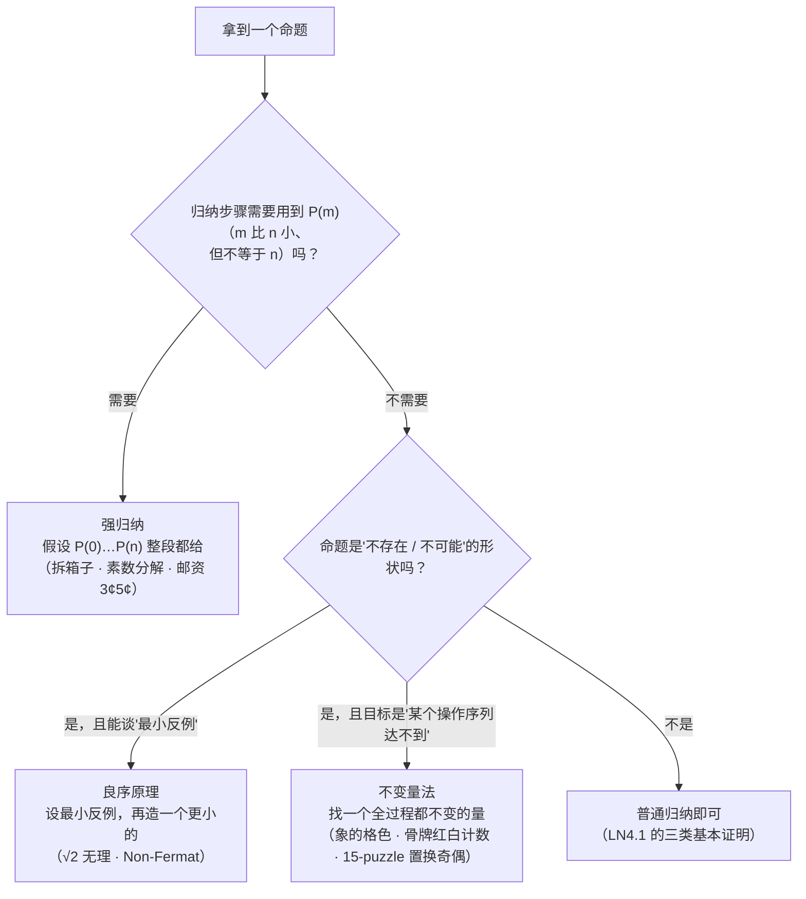

# 数学归纳法 II (Mathematical Induction II) — 强归纳、良序原理与不变量法

上一讲(LN4.1)把归纳原理、三类基本证明(等式/不等式/性质)、归纳构造和一个错误证明讲完了,结尾讲义留了一句"下一讲有更多应用、更多技巧"。这一讲兑现它,给的正是"更多技巧"——**归纳法的三个变体**。讲义在 p2、p21、p31 各插了一页 "This Lecture" 提纲,同一份纲领标了三遍:

> * Strong Induction
> * Well Ordering Principle
> * Invariant Method

三个变体共享同一个动作:**把大问题归约成小问题**。差别只在"小问题从哪来":强归纳从**更早的所有 $n$** 里拿假设;良序原理不拿现成的小问题,而是先假定"最小的反例"存在,再自己造一个更小的;不变量法干脆放弃归约,改去找一个**全过程都不变的量**。

讲义的编排次序也是有意的:先拿一个游戏(拆箱子)把"归纳假设不够用"这件事**撞出来**,再引出强归纳;然后用它证两个经典命题(素数分解、邮资);接着把整件事倒过来看——把归纳当"最小反例"用,得到良序原理;最后离开"数",去证"某个操作**不可能**达到"——不变量法。

顺带提一句封面:那一页画的不是标题装饰,而是一个 15-puzzle(滑块拼图)的两个状态。p43 的 "Challenge" 是**同一幅图**,讲义明确说 "We will come back to this problem later"。所以封面其实是本讲留给不变量法的伏笔,而这一讲不解它。

## 1. 拆箱子游戏 (The Unstacking Game)

### 1.1 规则

p3 把游戏讲得很干净:

* **Start**: 一摞箱子,总数 $n$。
* **Move**: 把**任意**一摞拆成两摞,大小 $a,b>0$。
* **Scoring**: 这一步得 $ab$ 分。
* **Keep moving**: 一直拆到拆不动(即每摞都只剩 1 个)。
* **Overall score**: 所有步得分之和。

画成图就是一摞 $a+b$ 的箱子拆成 $a$ 和 $b$ 两摞,得分 $ab$。注意记分的**只跟这一步涉及的两摞尺寸有关**,跟拆的先后、跟其他摞的状态都无关——这个"局部性"后面是证明的关键。

### 1.2 两道例题:4 个箱子,两种拆法

p4 的拆法:先 $4 \to 2+2$,得 $2\times2=4$ 分;再把两摞各拆 $2 \to 1+1$,各得 $1\times1=1$ 分。总分 $4+1+1=6$。

p5 的拆法:先 $4 \to 3+1$,得 $3\times1=3$ 分;再 $3 \to 2+1$,得 $2$ 分;再 $2 \to 1+1$,得 $1$ 分。总分 $3+2+1=6$。

两种拆法差别不小(一个先把大摞对半分,一个从头到尾一个一个剥离),**总分却一样**。这不是巧合,本节的 Claim 就是这件事。

### 1.3 两种"极端"打法

既然拆法不止一种,自然要问怎么拆最赚(p6、p7 的黄色提问框 "What is the best way to play this game?")。讲义挑了两个极端来算。

**打法一:一次只剥一个箱子**(p6)。第一步 $n \to (n-1)+1$,得 $n-1$ 分;第二步 $(n-1)\to(n-2)+1$,得 $n-2$ 分;……;最后 $2 \to 1+1$,得 $1$ 分。总分

$$\sum_{i=1}^{n-1} i = \frac{n(n-1)}{2}.$$

**打法二:每次都尽量对半切**(p7)。$n=8$ 时:

$$1\times(4\times4) \;+\; 2\times(2\times2) \;+\; 4\times(1\times1) \;=\; 16+8+4 \;=\; 28 .$$

这串记号的读法值得停一下:每一项的**第一个数字是"这一轮发生了几次拆分"**,后面才是"每次拆分的得分"。第一轮把 8 拆成 $4+4$,发生 1 次,每次得 $4\times4=16$;第二轮两摞 4 各拆成 $2+2$,发生 2 次,每次得 $2\times2=4$;第三轮四摞 2 各拆成 $1+1$,发生 4 次,每次得 $1$。所以 $28$。

$n=16$ 时:第一轮 $16\to8+8$ 得 $8\times8=64$;剩下两摞 8 各自用上面那套打法,共 $2\times28$。总 $64+56=120$。

两个数都对上了同一个式子:$28=8\cdot7/2$,$120=16\cdot15/2$。讲义在 $28$ 旁边挂了个气泡:**"Not better than the first strategy!"**——对半切并没有更优,它和一次剥一个给出完全相同的分数。

### 1.4 猜想

p8 上并排写了两条 Claim:

* **Claim A**: 任何**一种**拆法都给出**同一个**分数。
* **Claim B**: 从 $n$ 个箱子开始,最高分是 $\dfrac{n(n-1)}{2}$。

这两条的强弱关系要理清:A 严格强于 B。只要证明了"每种拆法分数都一样","最高分"就自动等于那个共同值——谈不上"最高",因为根本没有更低的选择。讲义把两条并列摆出,又接了一句 "Proof: by Induction with Claim(n) as hypothesis",但下面的证明一路代进去的全是"**任意**打法下的分数",所以**实际被证明的是 A**,B 只是 A 的一句话推论。

换句话说,讲义 p6、p7 那两句反问 "What is the best way to play this game?" 的答案是:**这个游戏没有策略**——所有打法完全等值,问"怎么拆最赚"和问"先迈左脚还是右脚"一样,是个空问题。这也是为什么 §1.3 算完两种极端打法之后,讲义只在气泡里淡写一句 "Not better than the first strategy!"——不是"对半切略逊",而是**分毫不差**。

### 1.5 证明,以及它露出的破绽

记 $C(n)$ 为 Claim A 在规模 $n$ 上的版本。

**基例 $n=1$**(p8):只有 1 个箱子,一步也走不了,分数 $0$,而 $\dfrac{1(1-1)}{2}=0$ ✓。

**$n+1=2$**(p9):唯一一步是 $2\to1+1$,得 $1$ 分,而 $\dfrac{2(2-1)}{2}=1$ ✓。

**一般情形 $n+1>1$**(p10):第一步必然把 $n+1$ 个箱子拆成 $a$ 和 $b$ 两摞,其中

$$a+b = n+1,\qquad a,b \ge 1 .$$

于是

$$(a+b)\text{-stack score} \;=\; ab \;+\; (a\text{-stack score}) \;+\; (b\text{-stack score}).$$

这个等式有两个前提,讲义一句都没写,但整个证明都靠它们:

1. **$ab$ 是第一步的得分**——因为第一步就是拆 $(a+b)$ 这一摞,拆成 $a$ 与 $b$;
2. **拆开之后两摞互不干扰**——第一步之后,对 $a$ 摞的任何操作都不会碰到 $b$ 摞里的箱子,反之亦然。所以整局的总分就是"第一步 + $a$ 摞内部的总分 + $b$ 摞内部的总分"。游戏规则里"把**任意**一摞拆成两摞"这句,保证了拆分不会跨摞;而记分只看被拆的那一摞,保证了分数可以这样相加。

用归纳假设把两个内部分数换成闭式:

$$ab + \frac{a(a-1)}{2} + \frac{b(b-1)}{2} \;=\; \frac{2ab + a^2-a + b^2-b}{2} \;=\; \frac{(a+b)^2-(a+b)}{2},$$

中间那一步就是配方:$a^2+2ab+b^2=(a+b)^2$。最后把 $a+b=n+1$ 代进去:

$$\frac{(a+b)\bigl((a+b)-1\bigr)}{2} \;=\; \frac{(n+1)n}{2}.$$

于是 $C(n+1)$ 成立。**关键问题藏在"用归纳假设"这五个字里**(这道破绽在 p12 被单独指出来):

我们代进去的是 $C(a)$ 和 $C(b)$,其中 $1 \le a,b \le n$。可普通归纳的假设只有 **$C(n)$ 一条**——它没授权我们在 $C(a)$、$C(b)$ 上用归纳。

举个具体的崩点看得更清楚。要证 $C(5)$(即 $n=4$ 那一步),手头只有 $C(4)$(外加已经证过的基例 $C(1)$、$C(2)$)。如果对手选择先把 5 拆成 $2+3$,你就需要 $C(3)$ —— 它**不在假设清单里**。而 Claim A 说的是"**每一**种拆法",所以你无权禁止对手这样拆。这就是归纳假设"太薄"的后果。

### 1.6 修补:把假设加厚 (p12)

修补办法不是加基例、也不是换更强的命题,而是**把要归纳的命题本身换掉**:

$$Q(n) ::= \forall m \le n.\ C(m).$$

读作"$C$ 对**一切**不超过 $n$ 的自然数都成立"。换成用 $Q(n)$ 当归纳假设,前面每一步就都通了:归纳步骤需要的 $C(a)$、$C(b)$ 因为 $a,b\le n$,由 $Q(n)$ 直接给出。讲义的原话是 "Proof goes through fine using $Q(n)$ instead of $C(n)$",并在旁边注了一句大白话:

> In words, it says that we assume the claim is true for all numbers up to $n$.

这就是**强归纳** (strong induction)。

这里有个细节:讲义 p9 单独验证了 $n+1=2$ 的情形。在普通归纳的框架下这一步是**必要**的(要证 $C(3)$ 得拆成 $1+2$,需要 $C(2)$);但改用 $Q(n)$ 之后,$C(2)$ 可以由 $Q(1)$ 自动给出,这一步就变得多余了。讲义保留它不算错,只是稍显累赘——毕竟它先按普通归纳写了一遍、又回头改成强归纳,中间这段是改稿留下的痕。

### 1.7 我的补充:为什么每种拆法都给出同一个数

强归纳把 Claim A 证完了,但它回答的是"**确实如此**",没有回答"**为什么会如此**"。这里补一条不用归纳的路子——用**数数**。

把分数换一种读法:一步拆成 $a$ 与 $b$,得 $ab$ 分。而 $ab$ 正好是"**从这两堆里各取一个箱子**"的取法数,也就是**被这一刀分开的箱子对**的个数。于是

> 一局的总分 $=$ 全程"被分开的箱子对"的总次数。

现在盯住**任意一对**箱子 $\{x,y\}$。开局时它们同在最开始那一摞里;结局时各自单独成摞。所以中间必然有一刀把它们分开。在那**第一刀**之前它们始终同摞(每次都一起被分到同一侧),那一刀把它们分开、贡献 1 次;分开之后它们再也不在同一摞里,后面任何一刀都不会再算上这一对。所以每一对箱子**恰好被计数一次**。

$n$ 个箱子共有 $\dbinom{n}{2}=\dfrac{n(n-1)}{2}$ 对,于是**任何**一局的总分都等于 $\dbinom{n}{2}$。

这条路一次就把三件事全说清楚了:每种打法分数相同(Claim A)、那个共同值就是 $\dfrac{n(n-1)}{2}$(Claim B)、以及"没有最优打法"(§1.4)。它还顺手解释了 §1.3 为什么两种极端打法给出同一个数——它们都只是在用不同顺序把同一批箱子对拆开而已。

顺带一提,这条思路和不变量法(§5)是近亲:$\dfrac{n(n-1)}{2}$ 就是这局游戏在"每一次完整对局"下保持不变的量,而它同时也是个**势能函数** (potential function)——"数箱子对"这个量在过程开始时已经是定值,过程只是把它逐对兑现。p42 那句 "Very useful in analysis of algorithms" 说的就是这种东西。

## 2. 强归纳 (Strong Induction)

### 2.1 陈述

p13 把强归纳写成三步:

1. 先证 $P(0)$;
2. 再证 $P(n+1)$,**假设 $P(0),P(1),\dots,P(n)$ 全都成立**(instead of just $P(n)$);
3. 于是 $\forall n\ P(n)$。

和普通归纳比,只有第 2 步的**假设变厚了**:从"假设一条"变成"假设一整段"。

### 2.2 它与普通归纳等价(p13 那支双向箭头)

讲义用一句话解释了为什么两者等价:普通归纳其实**早就把所有前面的结论拿到手了**。链条

$$0 \to 1,\quad 1 \to 2,\quad 2 \to 3,\quad \dots,\quad n-1 \to n$$

一路走下来,走到 $n+1$ 这一步时,"$P(0),P(1),\dots,P(n)$" 全部都在手上——只是普通归纳从来**没有把这句话拿出来当资源用**。所以强归纳不是一条新公理,而是"把普通归纳已经拥有的东西**显式写进假设**"。两者的合法性都来自同一条归纳公理。

这个视角是本讲第一个真正的 insight:**强归纳与普通归纳的差别不在"能证什么",而在"证起来顺不顺"**。讲义把这一点放在最后一行加粗:

> The point is: assuming $P(0),P(1)$, up to $P(n)$, it is often easier to prove $P(n+1)$.

(我的补充:严格说,"等价"不只是直觉,也有构造性证明——把命题换成 $Q(n)=\forall m\le n\ P(m)$ 再对 $Q$ 用普通归纳,就是 §1.6 做过的事。所以"strong"这个词有点误导:强归纳并不比普通归纳证出更多命题,只是换了一种更顺手的写法。这一点在 §1.5 的崩点上看得最清楚:崩的不是结论,是写法。)

## 3. 强归纳的三个用例

### 3.1 素数分解定理 (Prime Products)

p14 先回放了一道**旧题**:"任何整数 $n>1$ 都能被某个素数整除"。这道题在 LN4.1 里作为"全称命题的困境"的例子出现过,当时的论证是一段**非形式**的想法:若 $n$ 不是素数就写 $n=ab$,而 $a,b$ 都比 $n$ 小;若 $a$ 也不是素数再拆成 $cd$……"数字越来越小,这个过程总会停,于是找到一个素因子"。p14 的批注点破了它的价值:

> Remember this slide? Now we can prove it by strong induction very easily. In fact we can prove an even **stronger** theorem very easily.

**强得多**的那个定理是(p15):**每一个 $>1$ 的整数都是素数的乘积**。

> 先约定一条讲义没写、但少它就不成立的事:**一个素数本身算作"一个素数的乘积"**(乘积里只有一个因子)。不点明这条,基例 $n=2$ 就没法算过。

证明(强归纳,基例 $n=2$):

* **归纳假设**:断言对一切 $2 \le i < n$ 成立。
* 若 $n$ 是素数,它本身就是"一个素数的乘积",完。
* 否则 $n$ 是合数,写 $n = k\cdot m$,其中整数 $k,m$ 满足 $2 \le k,m < n$。(性质"真因子严格小于自身"对 $k,m \ge 2$ 成立,所以能夹在这个区间里。)
* 由归纳假设,$k$ 和 $m$ 都已经分解好了:

$$k = p_1 p_2 \cdots p_u, \qquad m = q_1 q_2 \cdots q_v .$$

* 于是

$$n \;=\; k\cdot m \;=\; p_1 p_2 \cdots p_u \cdot q_1 q_2 \cdots q_v$$

也是素数乘积。归纳步骤完成。∎

对比一下新旧两个命题的强弱,能看出"证更强的反而不难"这件事:**旧结论**只要求给 $n$ 找**一个**素因子,**新结论**要求把 $n$ 彻底分解。但两者都依赖同一条资源——"归纳假设可以在**任意一个比 $n$ 小的数**上使用"。$k$ 和 $m$ 都是 $<n$ 但未必等于 $n-1$,所以这里**必须**是强归纳,普通归纳给不出 $C(k)$。至于新结论多要的东西(两个因子都要**完全分解**),恰好是归纳假设能整块给出来的——这就是"加强命题"这个动作在 LN4.1 铺砖题里已经出现过一次的味道。

(我的补充:p15 证的是**算术基本定理** (Fundamental Theorem of Arithmetic) 的**存在性那一半**——"能分解成素数乘积"。定理的另一半是**唯一性**(分解在不计次序的意义下唯一),本讲完全没有涉及,它要靠 Euclid 引理($p \mid ab \Rightarrow p\mid a$ 或 $p\mid b$)来证,和归纳法关系不大。另外,旧结论(p14,"$n>1$ 必有素因子")是新结论的**一行推论**:既然 $n$ 是若干素数的乘积,取其中任意一个素数即可。所以这个"更强的定理更容易证"的例子里,顺带把旧题也一起解决了——这正是讲义 p14 那句 "In fact we can prove an even stronger theorem very easily" 想说的。) 

### 3.2 邮资问题:3¢ 与 5¢

p17 换了场景:手头有**无限多**的 3¢ 与 5¢ 邮票,问哪些金额拼得出来?

> **Theorem**: 任意 $\ge 8$¢ 的金额都能拼出。

记 $P(n)$ := "能拼出 $n$¢",用强归纳证明(p18–p19)。

**基例是三个,不是通常的一个**:

| $n$ | 拼法 |
| --- | --- |
| $8$ | $3 + 5$ |
| $9$ | $3+3+3$ |
| $10$ | $5+5$ |

**归纳步骤**:设 $n \ge 11$,取 $m = n-3$。则

$$n > m \ge 8,$$

由归纳假设 $m$¢ 拼得出来,再补一张 3¢ 邮票,得 $n$¢。

**为什么基例要三个?** 因为归纳步骤只把 $n$ 往回推 **3**(每次借一张 3¢ 票)。要让 $m=n-3$ 落在"已经覆盖"的区间里,就必须有一段**长度 3 的连续基例** $8,9,10$——这样任何 $n\ge11$ 回推一步都掉进已覆盖区间。

只给一个基例 $8$ 会怎样:算到 $n=11$ 时 $m=8$ 勉强能过,但 $n=12$ 时 $m=9$,而 $9$ 要再借 3 得 $6<8$,链子当场断掉。这是"**基例块**"这个概念第一次出现,它和 LN4.1 里 Cauchy–Schwarz 需要两个基例是同一类现象,不过这里基例的**规模由回推步长直接决定**:步长 3 就要 3 个连续基例,步长 5 就要 5 个。

(我的补充:门槛为什么恰好是 8¢?这是 **Frobenius 数** (Frobenius number) 问题——两个互素的邮票面额 $a,b$,不能用它们拼出的**最大**金额是 $ab-a-b$。取 $a=3,b=5$ 得 $15-3-5=7$,所以 7¢ 及以下有拼不出的(比如 7¢ 本身就拼不出:只有 3 和 5 两种票,$7=3+4$ 不行、$7=5+2$ 也不行),而 $\ge 8$ 的全部可拼。讲义直接抛出 8 这个数字,没交代来历。)

### 3.3 思考题:5¢ 与 7¢ (p20)

讲义最后留了一道**只提问、不给答案**的题:给定无限多的 5¢ 与 7¢ 邮票,哪些金额拼得出?并给出

> **Theorem**: 对一切 $n \ge 24$,$n$¢ 都能用 5¢ 与 7¢ 拼出。

(我的补充:门槛 24 同样来自上面的 Frobenius 公式,$5\cdot7-5-7 = 23$,即不能用 5¢ 与 7¢ 拼出的**最大**金额是 23¢,所以 $\ge 24$ 的全部可拼。这个公式只对 $\gcd(a,b)=1$ 成立。若要自己补证明,按 §3.2 的套路来即可:回推步长是 5,所以基例取**连续 5 个** $24,25,26,27,28$($24=5\cdot2+7\cdot2$,$25=5\cdot5$,$26=5+7\cdot3$,$27=5\cdot4+7$,$28=7\cdot4$),归纳步骤取 $m=n-5$。$n\ge29$ 时 $m\ge24$ 必落进已覆盖区间。)

## 4. 良序原理 (Well Ordering Principle)

第二块换了个完全不同的角度。前三节都在"顺着 $n$ 往上证",这一节是**倒过来想**:先假定反例存在,再盯着"最小的那个反例"做文章。

### 4.1 陈述与它的边界 (p22)

> **Fact**: 每个非空的**自然数**集合都有最小元。

"least" 取通常含义——最小 (smallest)。讲义紧接着框了一句非常关键的话:

> This fact is a consequence of **axiom of induction**.

用词要抠一下:良序原理**不是**一条独立公理,而是从归纳公理**推出来**的**推论**。这和 LN4.1 里"归纳原理本身是一条关于 $\mathbb{N}$ 的公理"是配套的——公理账上只有归纳那一条,良序原理是它的利息。

(我的补充:反过来,良序原理也能推出归纳原理,所以两者其实**互为等价**——"非空自然数集有最小元"和"归纳公理"是一体两面。讲义只写了单向,对本讲够用。)

空口说"有最小元"没有信息量,讲义用两个**外貌极像、但都是错的**句子把边界划出来:

* "每个非空的**非负实数**集合都有最小元" —— **NO!**
  反例:$S = \{1,\ 1/2,\ 1/3,\ \dots,\ 1/n,\ \dots\}$。下确界是 0,但 0 不在 $S$ 里;任何一个 $1/n$ 下面都还压着 $1/(n+1)$,所以没有最小元。
* "每个非空的**整数**集合都有最小元" —— **NO!**
  反例:全体整数 $\mathbb{Z}$,或者 $\{-1,-2,-3,\dots\}$。它们都能一直往小走,没有尽头。

两条反例划出的是同一条界线:良序性来自"**有下界 + 步长离散**",跟"是不是数"无关。实数有下界但可以无限逼近(不离散),所以没有最小元;整数离散但可以没有下界,所以也没有最小元。$\mathbb{N}$ 恰好同时具备两条(最小的自然数是 $0$,步长恒为 1)——**唯一**的那个特例。

顺带记一处在幻灯片上能看见的修改:p22 第二句原本写的是 "nonnegative integers",其中 `nonnegative` 这个词被**划掉**、改成 `integers`。这处改动必须记下来,因为它正好演示了本节的分量:写成 nonnegative integers(即自然数)那句话是**真**的,划掉前缀变成 integers 之后才是**假**的。差一个前缀,真假互换。

### 4.2 变体 (p23)

讲义列了两条同样被称作"良序原理"的推论(措辞是 "as consequences of this axiom"):

* **有限多个负整数与自然数的并**有最小元。因为负整数部分只有一个有限集,里面最负的那个就是整个并的最小元(自然数部分最小是 0,比负数大)。
* **$\mathbb{Z}^+$ 的非空子集**有最小元。$\mathbb{Z}^+$ 与 $\mathbb{N}$ 只差一个 0,去掉 0 不影响良序性。

### 4.3 用例一:$\sqrt 2$ 是无理数 (p24–p25)

标准证明的第一句话通常是:"设 $\sqrt 2 = m/n$,**且 $m,n$ 互素**。"p24 就盯住这个附加条件发问:

> …can **always** find such $m,n$ without common factors… —— **why always?**

也就是说,凭什么我们总能这样取?平时这句话是当"显然"糊过去的(约分一下不就行了)。WOP 的回答是:约分这件事本身就需要一个理由,而这个理由正是良序原理。

构造集合

$$S := \{\, |m| \;:\; m,n \in \mathbb{Z}^+,\ \sqrt 2 = m/n \,\}.$$

即"所有能作为分子的数的绝对值"的集合。假设 $\sqrt 2$ 是有理数,则 $S$ **非空**(至少有一个 $m$),由 WOP 取到最小元 $|m_0|$,配着一个 $n_0$,即 $\sqrt 2 = m_0/n_0$。

**此时 $m_0$ 与 $n_0$ 必然互素**:若它们有公因子 $c>1$,则

$$\sqrt 2 \;=\; \frac{m_0/c}{n_0/c}, \qquad \bigl|m_0/c\bigr| < |m_0| ,$$

也就是说 $S$ 里还蹲着一个比最小元更小的元,与"$|m_0|$ 最小"直接冲突。"总能取互素"从此有了根据。

**这里有一处讲义省略,必须点明。** 讲义到"取到互素的 $m_0,n_0$"就停了(p25 结束),后面**经典的推理一句没写**——它假定读者在更早的讲次已经见过("Remember this proof?" 那个表情包就是在提醒这件事)。完整的证明还差另一半:由 $\sqrt 2 = m_0/n_0$ 得 $m_0^2 = 2n_0^2$,故 $m_0^2$ 是偶数、$m_0$ 是偶数,写 $m_0 = 2k$ 代回得 $4k^2 = 2n_0^2$,即 $n_0^2 = 2k^2$,于是 $n_0$ 也是偶数。$m_0,n_0$ 有公因子 2,与刚刚证出的"互素"矛盾。

所以 WOP 在这道题里**只承担了一半的活**:它把 "WLOG 互素" 从一句"显然"升级成一句"有理由的",剩下的反证照旧走标准论证。讲义的意思不是"WOP 能证 $\sqrt2$ 无理",而是"WOP 补上了标准证明里那个从没被交代的窟窿"。

p25 下半页把这套用法总结成四句话:

* 先构造一个集合 $S$(我们希望它是良序的);
* 假设命题不成立,于是 $S$ 非空;
* 从 $S$ 里取一个"最小"的元,再证明 $S$ 里还有一个**更小**的元;
* 矛盾,故命题成立。

### 4.4 用例二:Non-Fermat 定理 (p26–p29)

p26 摆出一对反差,题目的名字本身就是个玩笑:

| 方程 | 结论 | 讲义的评价 | 名字 |
| --- | --- | --- | --- |
| $a^3 + b^3 = c^3$ | 无正整数解 | **难证** | Fermat's theorem |
| $4a^3 + 2b^3 = c^3$ | 无正整数解 | **好证** | Non-Fermat's theorem |

提示写得很直白:"Prove by contradiction using well ordering principle…"

**为什么系数一变就好证了?** 关键在**齐次性**:方程左右都是三次齐次,把三个变量同时除以 2 仍然满足方程。所以只要证明 $a,b,c$ 全都是偶数,就能得到一个"缩了一半的解"——而这一步会撞上良序原理的墙:**非空的正整数集不允许无限下降**。

构造集合

$$S := \{\, a \in \mathbb{Z}^+ \;:\; \exists\, b,c \in \mathbb{Z}^+,\ 4a^3 + 2b^3 = c^3 \,\},$$

即"能充当 $a$ 的那些数"。假设定理不成立,则 $S$ 非空,由 WOP 取到**最小元** $a$,并配上使等式成立的 $b,c$。

**下降的三步**,每一步都只用同一条事实——**奇数的立方还是奇数**,所以它的逆否命题是"偶数立方 $\Rightarrow$ 底数是偶数":

1. $c^3 = 4a^3+2b^3 = 2(2a^3+b^3)$ 是偶数 $\Rightarrow$ $c$ 是偶数。写 $c = 2c'$,代回得

$$4a^3 + 2b^3 = (2c')^3 = 8c'^3 \quad\Longrightarrow\quad b^3 = 4c'^3 - 2a^3 .$$

2. 右边 $b^3 = 4c'^3-2a^3 = 2(2c'^3-a^3)$ 是偶数 $\Rightarrow$ $b$ 是偶数。写 $b = 2b'$:

$$(2b')^3 = 4c'^3 - 2a^3 \quad\Longrightarrow\quad 8b'^3 = 4c'^3-2a^3 \quad\Longrightarrow\quad a^3 = 2c'^3 - 4b'^3 .$$

3. 右边 $a^3 = 2c'^3-4b'^3$ 是偶数 $\Rightarrow$ $a$ 是偶数。

三步走完,$a,b,c$ **全是偶数**。现在把原方程两边同除以 8:

$$4\left(\frac a2\right)^3 + 2\left(\frac b2\right)^3 \;=\; \left(\frac c2\right)^3$$

(验证:左边 $= \dfrac{4a^3+2b^3}{8} = \dfrac{c^3}{8}$ ✓,齐次性在这里派上用场。)

于是 $\dfrac a2 \in S$,而 $0 < \dfrac a2 < a$ ——**$S$ 里出现了一个比最小元更小的元**。矛盾。定理得证。∎

(我的补充:这道题还有一条更短的走法,而且它能解释"$4$ 和 $2$ 这两个系数不是随手挑的"。直接对 $c^3 = 4a^3+2b^3$ 取模 8:偶数的立方 $\equiv 0 \pmod 8$,所以必须 $4a^3+2b^3 \equiv 0 \pmod 8$。把 $a,b$ 的四种奇偶组合逐个试(用 $a$ 奇时 $4a^3 \equiv 4$,以及 $b$ 奇时 $b^3$ 奇、$2b^3 \equiv 2b \pmod 8$):

| $a$ | $b$ | $4a^3 \bmod 8$ | $2b^3 \bmod 8$ | 和 $\bmod 8$ | 结论 |
| --- | --- | --- | --- | --- | --- |
| 偶 | 偶 | $0$ | $0$ | $0$ | **唯一通行** |
| 偶 | 奇 | $0$ | $2$ 或 $6$ | $2$ 或 $6$ | 排除 |
| 奇 | 偶 | $4$ | $0$ | $4$ | 排除 |
| 奇 | 奇 | $4$ | $2$ 或 $6$ | $6$ 或 $2$ | 排除 |

四种组合里只有"全偶"能过模 8 这一关——**系数 $4$ 与 $2$ 的全部作用,就是让另外三种组合被模 8 一次性清掉**。拿掉系数、改成 $a^3+b^3=c^3$ 试试:$a,b$ 同为奇数时 $a^3+b^3 \equiv a+b \pmod 8$,只要 $a+b \equiv 0 \pmod 8$(例如 $a=1,b=7$)模 8 就挡不住,下降的第一步就断在这儿。这就是"Fermat 难、Non-Fermat 易"的技术分界线:难度差异几乎全在**模 8 能不能把奇偶组合清干净**。)

### 4.5 把套路写成模板 (p30)

讲义把两个例题都讲完之后,才给出通用五步(p30)——像是**事后**从例题里归纳出来的:

1. 构造集合 $S := \{\, n \in \mathbb{N} : \neg P(n) \,\}$,即"**反例集**";
2. 假设 $\neg P(n)$ 存在,于是 $S$ 非空;
3. 由 WOP,$S$ 有最小元 $n_0$(讲义附了一句提醒:"we may have different meanings of 'least' in some circumstances");
4. **导出矛盾**——"用上任何你能用的手段,包括数学归纳法",通常的办法是在 $S$ 里再找一个 $< n_0$ 的元;
5. 于是 $P(n)$ 成立。QED。

讲义最后补了一句 "Note: this is the general strategy, but it may vary in practice."——上面两个例题正是两个变体:$\sqrt 2$ 那道最小化的是 $|m|$(分母没动,只最小化分子),Non-Fermat 那道最小化的是 $a$。**"最小化的对象由自己选"**,选得好不好直接决定第 4 步能不能走通:选得不好,你根本造不出更小的元。

另外要点一句:**这正是 LN3 里"无限下降法" (infinite descent) 的原形。**LN3 讲反证法时提到过"假设有解 → 造出更小的解 → 无穷下降不可能",当时那句话是靠直觉成立的;用 WOP 一句话就能把它的合法性说清:"非空的自然数集有最小元,所以下降不可能无限进行"。LN4.1 里我把这层联系标为"归纳法的另一种形式",这一讲给了它的正式版本。

## 5. 不变量法 (Invariant Method)

第三块战场完全不同:证**某个操作序列不可能达到某个目标**。这类命题里根本没有"$\forall n\ P(n)$"的形状,顺着 $n$ 归纳无从下手。办法是换一个方向——找一个**全过程始终保持不变的性质**,再看目标状态**不满足**它。

### 5.1 象与棋盘 (p32–p34)

棋盘上放一个象 (bishop),象只能**沿对角线**走。问:能不能从当前位置走到左边紧邻的那格(p32 图里标 "?" 的位置)?

答案是不能(p33 "Impossible!"),理由在 p34 才展开:

1. 象当前在**红格**;
2. 沿对角线走,红格只能走到红格;
3. "?" 处是**白格**;
4. 所以象到不了那里。

**颜色就是这里的"不变量"**——这就是不变量法最简单的例子。

(我的补充:p32 那一页的棋盘是**没有染色的**,颜色是到 p34 讲理由时才引入的,所以图上看不出结论,必须靠"染成棋盘格"这个动作。严格说,"沿对角线走保持颜色"是因为对角相邻两格的横纵坐标各变 $\pm1$,于是 $x+y$ 的变化量是 $\pm2$ 或 $0$——**$x+y$ 的奇偶性不变**。染色只是这句话的视觉版本。讲义直接说颜色,更直观,但读者可能不知道颜色从哪来的。)

### 5.2 多米诺骨牌与两个洞 (p35–p41)

讲义用三步把问题逐步收紧:

* **p35–p36**:$8\times8$ 棋盘,32 块 $1\times2$ 骨牌,能铺满吗?——能(p36 只有一句 "Easy!")。
* **p37**:挖掉**两个洞**,剩 62 格、31 块骨牌,能铺满吗?(气泡里是 "Easy??" 加两个问号)
* **p38**:换成 $4\times4$ 挖两个洞、7 块骨牌——"**Impossible!**"。

答案的钥匙在 **p41**:棋盘黑白相间染色后,$8\times8$ 有 32 红 32 白;而

> **每一块 $1\times2$ 骨牌恰好覆盖一个红格和一个白格。**

这是关键不变量——不管你怎么摆,一块骨牌永远是"一红一白"。而图上挖掉的两个洞(右上角与左下角)**恰好都是白格**:在偶数边长的棋盘上,对角两个角格同色(角格的 $x+y$ 同为奇或同为偶)。于是剩下的格子是 **32 红 30 白**。

31 块骨牌需要 **31 个白格**,但棋盘上只剩 30 个白格。**不可能。** 一句话就够了。

p38 的 $4\times4$ 版本是同一个道理,只是数量更小:$4\times4$ 有 8 红 8 白,挖掉两个同色格后变成 8 红 6 白,而 7 块骨牌需要 7 红 7 白,同样凑不出。那一页上的几道深色短线是**尝试铺放的痕迹**,用来展示"怎么摆最后都会剩两格凑不成一块",它本身**不是证明**——证明是数颜色。

(我的补充一:这里有个容易被忽略的前提——**结论取决于两个洞的颜色**。挖掉一红一白两个格子时,剩下 31 红 31 白,颜色计数**不再矛盾**。所以"挖两个洞就铺不满"这句话是错的,准确的命题是"挖掉两个**同色**格子后铺不满"。讲义全程用的都是同色的两个角格,结论没错,只是"挖两个洞"这个说法覆盖的范围比实际结论大,记的时候要带上"同色"这个条件。)

(我的补充二:颜色计数只是**必要条件**。一红一白被挖走时计数过关,但是否真能铺满需要另证——答案是能(这是经典结论,可以用一条"切割路径"把棋盘剖成两块再递归构造),但那是另一个话题,讲义完全没有涉及。这里不要因为计数过关就默认铺得满。)

### 5.3 不变量法的三步 (p42)

p42 把整块内容收成三步:

1. 观察全过程都成立的性质(即**不变量**),并**用归纳法**证明它确实全程成立;
2. 证明**目标状态不满足**这个性质;
3. 于是目标不可达。

两个例子的对应关系:象那题的不变量是"象所在格的颜色";骨牌那题是"任意一批骨牌的摆放都占同样多的红格与白格"。

有一处措辞值得停一下:**第 1 条后面那个括号 "(by induction)"**。它容易被略过去,但它是整节的技术核心——一个性质之所以能称为"不变量",正因为它在**初始状态**成立、并且**每一步操作都保持**。而"初始成立 + 每步保持"这句话,本身就是一个归纳证明。所以不变量法没有绕开归纳,它只是**把归纳的对象从"命题"换成了"某个量"**。

讲义最后补了一句 "Very useful in analysis of algorithms."——算法分析里这类量到处都是:循环不变量 (loop invariant)、势能函数 (potential function)、算法正确性证明、下界论证。这也是本讲把不变量法放进"归纳法"名下的原因。

### 5.4 留给后面的挑战:15-puzzle (p1 / p43)

封面那幅图与 p43 是同一个问题。两幅 $4\times4$ 滑块图:左图末行是 $13,14,15,\text{空}$,右图末行是 $13,15,14,\text{空}$。问能不能从左**移**到右。讲义把它标成 "Challenge",并明说本讲不解:

> Usually, the invariant methods are not easy. We will come back to this problem later.

所以下面这段是**我的补充,不是讲义内容**——算是提前把伏笔挑明。

答案是**不能**,而且用的正是不变量法,只是不变量比"棋盘颜色"藏得深。取两个量:读 15 个数字、忽略空格得到的**置换** $\sigma$,以及**空格所在的行**。

* 左图末行 $13,14,15$ 对应置换是恒等;右图 $13,15,14$ 与它差一个**对换**。所以两者置换的**奇偶性相反**。
* 而两幅图的**空格位置完全相同**(都在右下角)。所以两个状态在"空格行"这个量上也相同。

再看两种移动如何影响这两个量:

* **水平移动空格**:数字序列不变、空格不换行 —— 两个量都不动。
* **垂直移动空格**:空格跨一行。只看数字序列,那个被换过去的数字在序列里**跨过了 3 个数字**(挪 3 个位置),等价于 **3 次相邻对换**——奇数次,所以置换的奇偶性**翻转**;同时空格的行号也变了 1,行位置的奇偶性也**翻转**。

两个量**同翻**或者**同不翻**,于是它们的"乘积"全程不变:

$$I \;=\; \operatorname{sgn}(\sigma)\cdot(-1)^{\text{空格下方还有几行}} .$$

起点与终点空格同位置(下方行数都是 0),而 $\operatorname{sgn}$ 相反 ⇒ $I$ 不同 ⇒ **不可达**。

顺带用这条判据校一下经典结论:当空格停在右下角时(下方 0 行),$I=\operatorname{sgn}(\sigma)$ 必须等于初始值 $+1$,也就是"空格在右下角时可达当且仅当置换是偶置换"。这正是 15-puzzle 教科书里那句"15-puzzle 只有一半状态可达"的来源。

这就是"不变量不容易找"的典型:性质不是棋盘的颜色,而是**置换的奇偶性**乘上**空格位置的奇偶性**这种藏得较深的量。它和 §4.5 那句"最小化的对象要自己选"是同一个道理——不变量同样要自己选。

## 6. 三种工具怎么选(我的归纳)

本讲三块内容在讲义里各占一段,互不交叉。但放在一起看,它们其实是一张"**拿到命题后先看形状、再挑工具**"的图。下面这张是我按本讲五道例题归纳的(**非讲义内容,属我的归纳**):

三条判断各自对应本讲的一段:

* **第一条**(归纳步骤要不要用 $P(m)$,$m<n$):这是**拆箱子游戏撞出来的那条线**。如果归纳步骤里出现了"两个更小的参数"($a+b=n+1$)或者"任意更小的参数"($k\cdot m=n$、$m=n-3$),普通归纳就授权不足,必须换成强归纳。本讲三道题(拆箱子、素数分解、邮资)全部落在这里。
* **第二条**(命题是"不存在"、且能谈最小反例):落在这里的两道题($\sqrt2$、Non-Fermat)有一个共同外形——**"不存在满足某条件的对象"**。这类命题没法顺着 $n$ 归纳,但可以"假定反例存在,取最小的那个"。这就是良序原理。注意 §4.5 那句"最小化的对象自己选"是这一支的核心操作。
* **第三条**(目标是"某个操作序列达不到"):落在这里的三道题(象、骨牌、15-puzzle)连"反例"都没有——不是"某个数不存在",而是"某条路径不存在"。这时归约无从下手,只能去找一个**过程量**并证明它不变。注意这一支的成立**仍然依赖归纳**(§5.3 那个括号),只是归纳的对象从一个命题变成了一个量。

三条判断的**顺序也有讲究**:先试最便宜的一条(能不能把归纳假设加厚就能过),再试"最小反例"这条(要选对象、要能造出更小的),最后才动"不变量"这条(最难找,而且找错方向就白费——讲义自己也说 "Usually, the invariant methods are not easy")。

## 小结 (Summary)

讲义最后一页(p44)的总结给得相当克制,几乎没提具体技巧,全在讲"该怎么学":

> Induction is perhaps the most important proof technique in computer science. For example it is very important in proving the correctness of an algorithm (**by invariant method**) and also analyzing the running time of an algorithm.
>
> There is **no particular example that you should remember**. The point here is to understand the principle of mathematical induction (the way that you "reduce" a large problem to smaller problems), and apply it to the new problems that you will encounter in future. Possibly the only way to learn this is by doing more exercises.

注意括号里那半句 "by invariant method"——**算法正确性靠不变量法**,这一句把 §5 和计算机科学的日常直接接上了。而 "no particular example that you should remember" 是本讲最该记住的一句态度:五道例题没有一道是要背的,要背的是**归约这个动作本身**。

把本讲三个变体整理成表:

| 变体 | 归纳假设是什么 | 命题的形状 | 本讲例题 |
| --- | --- | --- | --- |
| 强归纳 | $P(0),P(1),\dots,P(n)$ **整段**给出 | 归纳步骤需要"比自己小的**任意**参数"的结论 | 拆箱子、素数分解、邮资 3¢/5¢ |
| 良序原理 | 无假设;改为**假定最小反例存在** | "不存在解" / "最小反例不可能存在" | $\sqrt2$ 无理、Non-Fermat 定理 |
| 不变量法 | 无假设;改为**找一个不变的量** | "某个操作序列达不到目标" | 象、多米诺骨牌、15-puzzle |

三个变体的关系可以一句话收住:**强归纳换的是"假设的厚度",良序原理换的是"看问题的方向"(从最小的反例往上顶),不变量法换的是"观察的对象"(从命题换成过程量)**。三者都还是在做同一件事——把大问题归约成小问题,而它们**证不出**普通归纳证不出的命题。

最后交代一下上一讲留下的伏笔。LN4.1 结尾我按常见安排猜"下一讲会补上强归纳与结构归纳,以及归纳法在算法正确性、递归定义里的用法"。现在可以对一下账:猜中的是**强归纳**(本讲第二、三节,占到三分之二篇幅);**没出现**的是结构归纳 (structural induction) 与递推式求解 (solving recurrences)——本讲完全没有涉及。讲义改用了两个新面孔补位:**良序原理**与**不变量法**。而"归纳法在算法正确性证明中的用法"这一条只出现在最后的总结页一句话里("by invariant method"),没有展开。所以如果后续讲次不再回头补,结构归纳这条路大概是靠习题或者后面的课程内容自己补齐的。

## 附:讲义勘误、省略与几点说明

按惯例把"讲义原文"与"我补的内容"分开列清。**本讲材料只有课件**,全文内容**仅来自课件**,没有任何"老师课上说了什么"的成分。凡称"讲义原文"处指幻灯片上的文字与公式;凡我补的一律在正文相应位置标明,这里再汇总。

**讲义勘误与措辞问题(共 5 处,均不影响论证成立)**

* **p8**:两条 Claim 混写。页面上并排给出 "Every way of unstacking gives the same score" 和 "Starting with size $n$ stack, the highest score will be $n(n-1)/2$",但下面的证明一路代进去的都是**任意打法**下的分数,所以实际被证的是**前一条**(更强),后一条是它的一行推论。讲义没有交代两条的强弱关系,"highest" 这个词容易让人以为还有更低的选择可以挑。
* **p9**:单独验证 $n+1=2$ 这一步,在改用 $Q(n)$ 之后是**冗余**的——$C(2)$ 可以由 $Q(1)$ 自动给出。这一步在**普通归纳**的框架下才是必要的(要证 $C(3)$ 得拆成 $1+2$,需要 $C(2)$)。看起来是"先按普通归纳写、再回头改成强归纳"留下的改稿痕迹,不算错,只是读起来像多了一道。
* **p22 与 p23 用词不一致**:p22 说良序原理 "is a consequence of **axiom of induction**"(即它是**推论**),紧接着 p23 又说 "The following variations (as consequences of **this axiom**) are also called Well Ordering Principle"——这里把良序原理本身也叫成了 "axiom"。同一份讲义两种说法,严格说 p23 的措辞不准(它是从归纳公理导出的定理,不是公理)。对证明没有影响。
* **p22 的一处划改**:第二句原写 "Every nonempty set of **nonnegative** integers has a least element",其中 `nonnegative` 被划掉改成 `integers`。这不是误改,恰恰是**必要的**修改:nonnegative integers 就是自然数,那句话为真;改成 integers 之后才是假的("每个非空的整数集合都有最小元" —— NO)。此处照改后的版本理解。
* **p26 的 "Fermat's theorem" 指哪一支**:讲义把 $a^3+b^3=c^3$(即 $n=3$ 的情形,由 Euler 证明)直接叫 "Fermat's theorem",而一般的 Fermat 大定理(Fermat's Last Theorem,$n\ge3$ 全部情形)直到 1995 年才由 Wiles 证出。措辞上略有歧义,读时按 "$n=3$ 的这一支" 理解即可。

**讲义省略了关键理由、我补上的地方(共 10 处)**

* **p10**:归纳步骤里 "拆开之后两摞互不干扰、分数可加" 这个前提**完全没写**,但整个证明靠它。正文 §1.5 补上,并指出它来自规则里"把**任意**一摞拆成两摞"这句(拆分不跨摞)与记分只看被拆那一摞这两件事。
* **p7**:只给了 $28$ 与 $120$ 两个数,没有说清它们其实都等于 $\dfrac{n(n-1)}{2}$(**这本身正是 p8 的 Claim**)。另外记号 "$1\times4\times4 + 2\times2\times2 + 4\times1$" 里第一个数字是"该轮发生的拆分次数",讲义也没说明读法。§1.3 补上了这两点。
* **p12**:只说 "by induction can only assume $C(n)$",没有给出**具体的崩点**。正文补上 $C(5)$ 需要 $C(3)$ 这个最小反例(拆成 $2+3$ 时),让"假设不够用"从抽象判断变成可复现的具体场景。
* **p13**:用一句话解释强归纳与普通归纳 "equivalent",只给了直觉(走到 $n+1$ 时前面的都已知道),没有给构造性证明。正文补上:把命题换成 $Q(n)=\forall m\le n\ P(m)$,再对 $Q$ 用普通归纳——这就是 §1.6 已经做过的事。
* **p14–p16**:"Base case is easy" 一句带过,没有说清"**一个素数本身算作一个素数的乘积**"这条约定。缺了它,基例 $n=2$ 无法算过(2 要写成"一个因子的乘积")。正文 §3.1 点明。
* **p17–p19**:直接给出 $8$¢ 这个门槛,没有交代**它从哪来**,也没有解释**为什么基例必须恰好是三个**。正文补上:门槛来自 Frobenius 数 $3\cdot5-3-5=7$;基例个数由**回推步长**决定(步长 3 ⇒ 需连续 3 个基例),并给了"只给基例 8 会在 $n=12$ 断链"的反例。
* **p20**:5¢ 与 7¢ 这道题**只提问、不给证明**。正文补上门槛 $24$ 的来历(Frobenius 数 $5\cdot7-5-7=23$)与按 §3.2 套路的完整证明骨架(基例 5 个、回推 5)。
* **p24–p25**:$\sqrt2$ 的证明**只写了前半**——WOP 负责证"总能取到互素的 $m_0,n_0$",而"$m_0,n_0$ 都是偶数"这后半段经典论证**一个字也没写**(讲义靠 "Remember this proof?" 假定读者已见过)。正文 §4.3 把后半段补齐,并明确指出 WOP 在这道题里只承担了一半的活。
* **p32–p34**:棋盘图**没有染色**,颜色是 p34 讲理由时才引入的;而"沿对角线走保持颜色"其实等价于"$x+y$ 的奇偶性不变",这层对应讲义没写。正文 §5.1 补上,并说明读者在图上根本看不出结论、必须靠"染成棋盘格"这个动作。
* **p42**:三步骤第 1 条后面那个括号 "(by induction)" 一带而过。正文 §5.3 点明它的分量:不变量之所以成立,靠的正是"初始成立 + 每步保持"这一次归纳——不变量法并没有绕开归纳,只是把归纳对象从命题换成了过程量。**p43**:15-puzzle 的不变量是什么,讲义明说 "We will come back to this problem later",本讲一字未提。见下条。

**我的补充(非讲义内容,均已标注)**

* **§1.7 的"数配对"证明**:把每刀得分 $ab$ 读成"被分开的箱子对数",再论证每对箱子恰好被计数一次,从而一步得出总分 $=\binom n2$——这条路子以及它与不变量法/势能函数的联系,讲义完全没有("分数可加、每对箱子恰好分开一次"这两个观察都是我加的)。它和讲义的强归纳证明是**两条独立的路**,互不替代:讲义那条重在演示强归纳,我这条重在解释"为什么是这个数"。**若考试要求写出讲义式证明,以讲义的为准**,§1.7 只能当理解辅助。
* **§3.1 关于算术基本定理的定位**:指出 p15 证的是**存在性那一半**,唯一性要用 Euclid 引理另证;以及 p14 的旧结论是新结论的一行推论。均非讲义内容。
* **§3.2 / §3.3 的 Frobenius 数**:门槛 8¢ 与 24¢ 的来历($ab-a-b$,仅对 $\gcd(a,b)=1$ 成立),以及 5¢/7¢ 那道题的完整证明骨架,均非讲义内容。
* **§4.1 的双向等价**:讲义只写了"良序原理是归纳公理的推论"这一向;我补上反向(良序原理也能推出归纳原理,两者互为等价)。
* **§4.4 的模 8 表格**:"为什么系数取 4 与 2" 这条解释——四种奇偶组合里只有"全偶"能过模 8,而换成 $a^3+b^3=c^3$ 时模 8 挡不住($a+b\equiv0 \pmod 8$,如 $1,7$)——是我加的技术补充,讲义只给了提示不给解。这张表是整篇笔记里唯一我自己动手算过的东西,也和讲义 §4.4 的三步下降等价(只是更短)。
* **§5.2 的两处限定**:① 结论必须带上 "两个洞**同色**" 这个前提——挖一红一白时颜色计数不再矛盾,而讲义那句 "挖两个洞就铺不满" 的覆盖面比实际结论大;② 颜色计数只是**必要条件**,一红一白时是否真能铺满需另证(答案是能,但讲义未涉及)。**§5.4 的 15-puzzle 完整不变量**:讲义明确说 "later",本讲不给解,所以我给的是**提前的答案**,不是讲义内容。其中"不变量 $I=\operatorname{sgn}(\sigma)\cdot(-1)^{\text{空格下方行数}}$"这个式子和"垂直移动等价于 3 次相邻对换"的论证是我自己推的;我另用经典结论("空格在右下角时可达当且仅当置换为偶置换")反向校过一遍,两者一致。如果后面讲次给出了讲义版本的不变量,**以讲义为准**,并回来核对这一节。
* **§6 那张三工具选择的 Mermaid 图**与三条判断顺序,是我把本讲五道例题横向对比后归纳的,讲义没有"选择指南"这一节。(这与 LN3 笔记里"四种方法怎么选"、LN4.1 里"归纳步骤卡住时的三条出路"那两张图同属归纳性总结,均非讲义内容。)
* **§小结 里与 LN4.1 预告的对账**:指出 LN4.1 我猜的"结构归纳 + 递推式求解"本讲**没有出现**,改由良序原理与不变量法补位——这一条是我自己的核对,讲义没有回顾上一讲的内容。

**关于本讲"够不够"的一句话判断**:本讲三个变体的**陈述与用例都讲足了**——强归纳给了拆箱子(动机)、素数分解、邮资三道;良序原理给了 $\sqrt2$、Non-Fermat 两道加一个通用模板;不变量法给了象、骨牌两道加一个明说"later"的 15-puzzle。**不够的地方有两处**:① 5¢/7¢ 那道题、15-puzzle 那道题都是**抛题不解**,如果考试范围包含它们,得自己补(正文 §3.3、§5.4 已给出);② LN4.1 预告过的结构归纳 (structural induction) 与递推式 (recurrence) 在这个变体分支里完全没有出现,如果后续讲次不再回头,这块要靠教材或其他课程补。