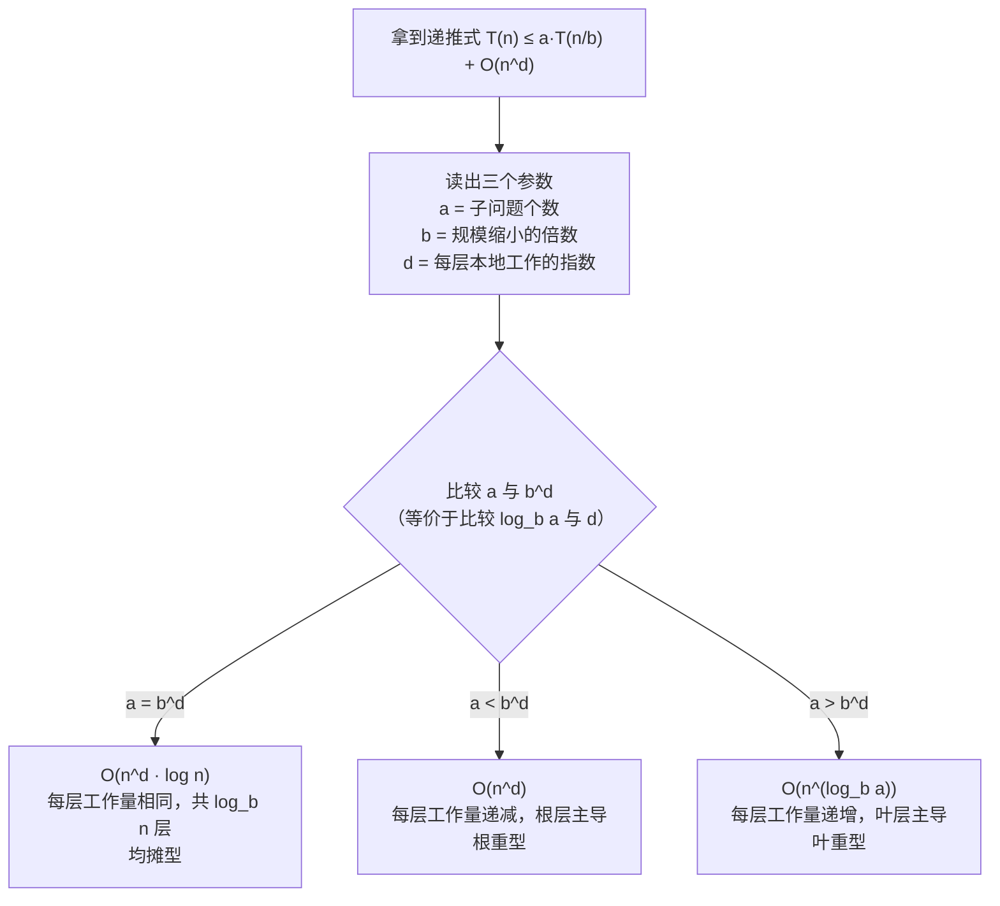

# CSC3100 Lecture 6 课堂笔记：Complexity of Divide-and-Conquer and Recursion（分治与递归的复杂度分析）

> 本讲内容完全基于课件 `lecture 6 (complexity of divide-and-conquer and recursion).pdf`（共 40 页），没有老师口述的部分。课件结构分以下几块：复习渐进记号与最坏情况两步流程（p.2-5）、递归的复杂度怎么数（以二分搜索为例，p.6-11）、选择排序的递归复杂度（p.12-15）、两道练习（p.16-17）、主定理（p.18-21）、分治实例最大子数组（p.22-30）、课堂练习（p.31）、阅读作业（p.32）、以及标为"不考"的附页主定理证明（p.33-40）。本讲讲义里的**公式全部是图片**，纯文本抽取会把 `n(n-1)/2` 抽成 `𝑛𝑛(𝑛𝑛−1)/2` 这类重字符，所以全文的公式我都逐页渲染成图核对过；可疑的几处按 420 dpi 放大复核（见文末「诚实备注」）。本文正文里凡标「我的补充」或「我的复算」的地方，都是课件没写、由我推导或独立验证的。

## 0. 一句话概括本讲在讲什么

上一讲（Lecture 5）建立了渐进记号这套语言，也给了"数操作 → 化简"的两步流程，但它分析的都是**直筒循环**：求和、线性搜索、暴力最大子数组和。那些代码里没有"自己调用自己"，操作次数一数就到底。

这一讲处理的是**循环里套着自己**的东西——递归（recursion）与分治（divide-and-conquer）。一旦代码里出现"调用它自己"，数操作就卡住了：调用那一行要花多少次操作？答案取决于被调用的那个自己又要跑多久，而那又是一次同样的调用。这个循环依赖就是本讲要拆开的核心难题。

拆法是把"未知的递归代价"命名成一个函数 $g(n)$，然后不去直接求它，而是找它和更小规模的关系：

$$g(n) = a + g(n/2)$$

这个式子叫**递推式（recurrence relation）**。有了它就能一路展开到基例（base case）解出封闭形式，于是二分搜索的 $O(\log n)$、选择排序的 $O(n^2)$、最大子数组分治解的 $O(n\log n)$ 全都能算出来。

本讲还给了**主定理（master theorem）**——一张"看到 $T(n) \le aT(n/b) + O(n^d)$ 就照表填答案"的公式。它把递推式求解这件事从"每次重新展开"变成"比较两个数"。

最后用最大子数组问题（maximum subarray problem）把整套工具跑了一遍完整的分治设计：$O(n^3) \to O(n^2) \to O(n\log n)$。这也是上一讲末尾留下的那个悬案——"$O(N\log N)$ 到底是怎么来的"——的正面回答。

## 1. 复习与最坏情况分析的两步流程（p.2-5）

### 1.1 三个记号（p.3）

课件第 3 页用三行把上一讲的三个记号原样搬了过来：

**Big-Oh 定义**：$g(n) = O(f(n))$ 当且仅当存在两个正常数 $c$ 与 $n_0$，使得对所有 $n \ge n_0$ 都有 $g(n) \le c\cdot f(n)$。

**Big-Omega 定义**：$g(n) = \Omega(f(n))$ 当且仅当存在两个正常数 $c$ 与 $n_0$，使得对所有 $n \ge n_0$ 都有 $g(n) \ge c\cdot f(n)$。

**Big-Theta 定义**：若 $g(n) = O(f(n))$ 且 $g(n) = \Omega(f(n))$，则 $g(n) = \Theta(f(n))$。

这三行的完整讲解（包括"$=$"应读成"$\in$"、$O$ 与 $\Omega$ 的对偶、五条化简规则）都在上一讲笔记的 §3 到 §5，这里不重复。本讲只需要记住一件事：**$O$ 是上界、$\Omega$ 是下界、$\Theta$ 是两者都有**，因为下面所有递推式的分析结果都会在这三个记号之间来回选。

### 1.2 最坏情况分析的两步流程（p.4）

课件第 4 页复述了流程：

**Step 1**：找出算法在**最坏情况**下执行的基本操作数，写成输入规模 $n$ 的函数。
**Step 2**：用 Big-Oh 和 Big-Omega 分析这个函数，能推出 Big-Theta 就推。

紧接着两句话值得单独拎出来，因为它们是本讲的"心理准备"：

第一句是"**我们可能没那么幸运，正好能让 Big-Oh 和 Big-Omega 相同**"（We may not be lucky enough to derive that Big-Oh and Big-Omega to be the same）。

第二句是"**不那么严格地说**（less rigorously），当没能导出上下界一致时，我们仍然可以说 $O(\log n)$ 的算法比 $O(n)$ 的好"。

这两句在上一讲 p.31 出现过一次，本讲会**反复用到**——因为递推式天然只给上界。递推式长这样：

$$g(n) \le g(n-1) + c\cdot n$$

不等式左边右边都是 $\le$，展开到最后得到的是"$g(n)$ 不超过某个式子"，也就是一个上界。想同时得到下界，得再重复一遍论证把不等号反向，而课件从 p.15 开始就明确放弃了这件事（下面 §3 会看到那句蓝框）。所以**本讲的大部分结论都是 $O(\cdot)$ 而不是 $\Theta(\cdot)$**，这不是偷懒，是递推式这套工具的自然结果。

### 1.3 第一个例子：把已知代价的方法调用串起来（p.5）

课件第 5 页给了一个稍长的例子，它本身没什么新东西，但演示了一件事：**当一个算法里调用了你已知复杂度的方法时，把那个复杂度直接当成这一行的代价**。

```text
Sum_LinearSearch(A, searchnum, sumestimation)
Input:  array A, a search number, and a sum estimation
Output: return 1 if the search number exists in A and the sum estimation
        is exactly the sum of the array, otherwise return 0

1  tempsum = 0                                          O(1)
2  for i = 0 to n-1                                     O(n)
3      tempsum += A[i]                                  O(n)
4  findmatch = linear_search(A, searchnum)               O(n)  ← 见下方红框
5  return findmatch != -1 and tempsum == sumestimation   O(1)
```

第 4 行的 $O(n)$ 旁边课件画了一个红框，里面写着"**通过进一步数它的基本操作数**（by further counting its number of basic operations）"。这句话指的就是上一讲 §2.3 数过的结果：线性搜索在最坏情况下的基本操作数是 $4n+3$，即 $O(n)$。

整段的复杂度按求和性质（the bigger of the two big）取最大项：$O(1) + O(n) + O(n) + O(n) + O(1) = O(n)$。

这里其实藏着上一讲 §1.2 提过的那条约定："调用一个方法算一次基本操作"与"方法内部的代价另算"——第 4 行给出的 $O(n)$ 就是"另算"的结果。它引出一个自然的追问：**如果被调用的方法是它自己呢？** 那"另算"就变成了一个自我指涉的循环，第 2 节的全部内容就是在处理这个循环。

## 2. 递归的复杂度：二分搜索（p.6-11）

### 2.1 难题出在哪：递归调用那一行没法直接数（p.6）

课件第 6 页给出二分搜索的完整代码，逐行标复杂度：

```text
BinarySearch(arr, searchnum, left, right)
1  if left >= right                                          O(1)
2      if arr[left] == searchnum                             O(1)
3          return left                                       O(1)
4      else                                                  O(1)
5          return -1                                         O(1)
6  middle = (left + right)/2                                 O(1)
7  if arr[middle] == searchnum                               O(1)
8      return middle                                         O(1)
9  elseif arr[middle] < searchnum                            O(1)
10     return BinarySearch(arr, searchnum, middle+1, right)  O(?)
11 else
12     return BinarySearch(arr, searchnum, left, middle -1)  O(?)
```

前 9 行都是 $O(1)$——纯比较、算术、赋值、数组访问，与 $n$ 无关。到第 10 和第 12 行，课件把问号标成**红色**：这两行的代价没法这样标。

原因很直白：这两行**调用 BinarySearch 自己**。它的代价取决于被调用的那次又要执行多少次基本操作——而那正是我们还没算出来的量。对比一下循环就清楚了：在 `for i = 0 to n-1` 里，"下一步"是 $i$ 自增，是件与问题规模无关的小事；在递归里，"下一步"又是同一个问题（只是规模小一点），于是"数操作"这件事被自己绊住了。

顺便注意一个写法细节：第 6 行算出 `middle` 之后，第 10 行的递归区间是 `[middle+1, right]`、第 12 行是 `[left, middle-1]`——**两段都把 `middle` 这个位置排除在外**。这是有意的：第 7 行已经比较过 `arr[middle]`，知道 `searchnum` 不在那里，所以不需要再带着它递归。下面 p.9 那张图上被涂黄的 "excluded" 一格说的就是它。

### 2.2 插曲：一个警示故事（p.7）

课件在这里突然插了一页历史故事，值得看，因为它解释了**为什么这么短的算法值得用五页去分析**。

页面上的三条要点是：**只有 10% 的程序员能写对二分搜索**；二分搜索至少可以追溯到 1946 年，而第一份**正确的描述**出现在 1962 年；Jon Bentley（CMU）写出了权威版本的二分搜索并证明了它的正确性。

配图是 Jon Bentley 本人的照片、他的书《Programming Pearls》的封面，以及书中一段文字的截图。截图里被红笔圈出的两个词是 **"Professional programmers"** 和 **"ninety percent"**。这段话的意思是：Bentley 在 Bell Labs 和 IBM 的课程上布置过这道题，让**专业程序员**用两小时把它写成自己熟悉语言的程序（伪代码也行），几乎所有人都报告说写对了；然后用三十分钟逐份检查代码、用测例验证，结果显示 **90%** 的程序里有 bug——而 Bentley 自己也加了一句限定："我也不总是确信那些没发现 bug 的代码是对的。"

二分搜索的代码可以写在一张名片上，可它的边界条件（`left >= right` 还是 `>`、`middle` 要不要 $\pm 1$、$n = 0/1$ 怎么处理）几乎人人都会写错。所以它是最适合用来练"精确计数"的样本：**它够短，短到能逐行数；又够刁，刁到不逐行数就会错。**

### 2.3 把"未知的递归代价"命名成一个函数（p.8-9）

课件第 8 页给出了本讲的方法论起点：

> **给定输入规模 $n$，设 $g(n)$ 为 BinarySearch 在最坏情况下执行的基本操作总数。**

然后它把代码切成两段分别处理。

**第一段是第 1 到 9 行。** 课件用括号把这一段框起来，旁边两个红框写着："这部分我们仍然可以数它的基本操作数"、"它执行的基本操作总数是一个与输入规模 $n$ 无关的常数，我们用 $a$ 表示"。

**第二段是第 10、12 行。** 页面底部一个方框写着：

> 我们**要么**执行第 10 行、**要么**执行第 12 行，不会两行都执行。那么第 10 行或第 12 行执行的基本操作数是多少？

这个问题的答案是本讲的第一个关键跳跃。课件第 9 页给出了它：**我们不知道这个数是多少，但按我们的定义，它就是 $g(n/2)$。**

第 9 页是这样论证的：

- 一开始，输入规模是 $n$；
- 执行完 $a$ 次基本操作之后，输入规模减半；
- 然后我们运行规模为 $n/2$ 的递归二分搜索；
- 这次规模为 $n/2$ 的搜索在最坏情况下要执行多少次基本操作？——不知道，但按上面的定义，答案是 $g(n/2)$。

配图是两个格子条：左边 $n$ 格，右边把前半截涂成黄色标 "excluded"，剩下 $n/2$ 格。于是

$$g(n) = a + g\left(\frac{n}{2}\right)$$

**这一步为什么不是循环论证**，值得说清楚，因为初看很像"我要求 $x$，于是我令 $x = 1 + x$"。

区别在于：$g(n/2)$ 里的参数是 $n/2$，不是 $n$。我们并没有用 $g(n)$ 去表达 $g(n)$，而是用"规模减半的同一个问题"去表达它。这样就得到了一个**向下指的关系链**，而递归必然有尽头——二分搜索在 `left >= right` 时不再递归。课件把它记作 $g(1) = b$，$b$ 是一个可以数出来的常数（用上一讲的约定，它就是把第 1、2 行和第 3 或第 5 行执行一遍的代价）。

有了 $(a, b)$ 和这个关系链，$g(n)$ 就完全确定了。这正是**递推式（recurrence relation）**的定义：用较小规模处的取值来定义较大规模处的取值，再配一个基例（base case）收尾。数学上它与数学归纳法（induction）是同一个东西的两面——归纳法用较小的情形证明较大的情形，递推式用较小的情形**定义**较大的情形。

顺带说明一个写法上的松处：$n/2$ 在 $n$ 为奇数时不是整数，所以 $g(n/2)$ 这个写法严格来说是含糊的。课件在这里是概略写法，p.11 会专门处理这个问题（那一页我实测得到的结论比课件更强，见 §2.5）。另外还有一个更细的点：第 10 行递归的区间是 $[middle+1, right]$、第 12 行是 $[left, middle-1]$，两段长度之和其实是 $n-1$ 而不是 $n$（因为 `middle` 被排除了）。这也影响不了渐进结论，但它解释了为什么"两个分支的代价都是 $g(n/2)$"这句话是概略的。

### 2.4 展开递推式（p.10）

课件第 10 页给了两个问题：先用 $a$ 和 $b$ 表示 $g(4)$，再表示一般的 $g(n)$（条件是 $n = 2^x$）。

第一个很好算：

$$
g(4) = g(2) + a = \left(g(1) + a\right) + a = 2a + b
$$

第二个就是把这个动作重复下去：

$$
\begin{aligned}
g(n) &= g\left(\frac{n}{2}\right) + a \\
&= g\left(\frac{n}{2^2}\right) + a + a \\
&= g\left(\frac{n}{2^3}\right) + a + a + a \\
&= g\left(\frac{n}{2^4}\right) + a + a + a + a \\
&= \cdots \\
&= g(1) + \underbrace{a + a + \cdots + a + a}_{x\ \text{个}} = x\cdot a + b = a\cdot \log_2 n + b
\end{aligned}
$$

**要读懂这个展开，抓住三个点。**

第一，**每一步消耗一个 $a$**。每次从 $g(\cdot)$ 里"剥出"一层，就多出一个 $a$，因为每一层都要先花 $a$ 次操作才能把规模减半。

第二，**下标的规律是 $\frac{n}{2^k}$**。第 $k$ 步之后括号里是 $\frac{n}{2^k}$，参数每步除以 2。

第三，**为什么必须给 $n = 2^x$ 这个条件**。要让这个链条精确地落到 $g(1)$，必须存在整数 $k$ 使 $\frac{n}{2^k} = 1$，也就是 $n = 2^k$。如果 $n$ 是 3、5、1000 这种数，除着除着会出现 $\frac{3}{2}$ 这样的非整数规模，链条就踩不到 $g(1)$ 上——这也就是下一页要解决的问题。

而"从 $n$ 降到 1 需要几步"正是 $x = \log_2 n$，所以 $x$ 个 $a$ 加起来就是 $a\log_2 n$：

$$g(n) = a\cdot\log_2 n + b$$

**我的复算**：我按上一讲 §1.2 的计数约定（循环头 = 初始化 1 + 自增 $k$ + 比较 $k+1$；数组下标访问、赋值、算术、比较、方法调用、返回各计 1）把这段代码逐行实现成计数器，两条递归分支都走一遍取最大值，实测得到

$$g(n) = 9\cdot\lfloor \log_2 n\rfloor + 4$$

也就是说 $a = 9$（一个内部层：第 1 行的比较、第 6 行的加/整除/赋值、第 7 行的访问与比较、第 9 行的访问与比较、加上第 10 或 12 行的调用本身）、$b = 4$（$n = 1$ 时走第 1、2 行与第 3 或 5 行）。$n = 2^x$ 时 $\lfloor\log_2 n\rfloor = x$，与课件的 $a\log_2 n + b$ 形式一致。这也说明**课件里的 $a$ 和 $b$ 不是"某个神秘常数"，它们就是可以数出来的具体整数**——教材只写字母是因为具体数取决于计数约定，而结论 $O(\log n)$ 与约定无关。

### 2.5 当 $n$ 不是 2 的幂时（p.11）

课件第 11 页问："如果 $n \ne 2^x$，怎么分析？"然后给了一个很聪明的办法：

> 我们可以在一个规模为 $2^x$ 的数组上**模拟**这次搜索，其中 $x$ 是满足 $2^x \ge n$ 的最小整数。

配图是两个格子条：左边一格条下面标 $n$，中间一个箭头，右边一格条比左边多出一截、多出来的几格涂成黄色表示"补齐"的部分，下面标注 $n' = 2^x$ 且 $n' \le 2n$。（这张图是**示意**，两边的格子数是画得一样多的，只表示"补上一截"这个意思，不要按格子数去数 $n$ 和 $n'$。）

**为什么补到 $2^x$ 就能用上一页的结论**：规模 $2^x$ 是 2 的幂，所以 p.10 的展开式对它精确成立，$g(2^x) = a\cdot x + b$。而 $x$ 是**最小的**满足 $2^x \ge n$ 的整数，所以 $2^x$ 是"不小于 $n$ 的下一个 2 的幂"——在一个这么大的数组上做二分搜索，最坏情况不会比在原来 $n$ 格的数组上更轻松（多的那些格子只会让搜索多切下去一层，不会让它少切）。于是 $g(n) \le g(2^x)$。

接着课件写道：

$$
g(n) \le g(2^x) \le a\cdot x + b \le a\cdot\log_2(2n) + b = a\cdot\log_2 n + (a+b)
$$

$$g(n) = O(\log n)$$

**中间那步 $x \le \log_2(2n)$ 需要解释**（课件直接跳过了）。因为 $x$ 是**最小**的整数使 $2^x \ge n$，所以 $x - 1$ 就不满足，即 $2^{x-1} < n$，两边乘以 2 得 $2^x < 2n$。再因为 $2^x \ge n$，合起来 $n \le 2^x < 2n$，取以 2 为底的对数就有 $\log_2 n \le x < \log_2(2n)$。我实测 $n = 1$ 到 $200000$ 全部成立。

于是 $O(\log n)$ 的结论对**所有** $n$ 都拿到了，不只是 2 的幂。

**我的复算给了一个比课件更紧的结果**（这是我的补充，课件没有）：实测的精确式是

$$g(n) = a\cdot\lfloor\log_2 n\rfloor + b$$

也就是把 $x$ 从 $\lceil\log_2 n\rceil$ 换成 $\lfloor\log_2 n\rfloor$ 仍然成立，而且是**等式**不是不等式。理由是二分搜索每层都把候选区间**排除掉中间那一个元素**再切两半，所以"还能再切下去多少层"取决于 $\lfloor\log_2 n\rfloor$ 而不是 $\lceil\log_2 n\rceil$。例如 $n = 3$（数组 0,2,4）：第一层比较中间元素后直接排除，两个子区间各剩 1 格，再一层就到底，总共 2 层，$g(3) = 9\times 1 + 4 = 13$；而 $\lceil\log_2 3\rceil = 2$，按课件的 $x$ 会估成 $9\times 2 + 4 = 22$。

这不是课件的错——课件要的是一个**上界**，用 $\lceil\log_2 n\rceil$ 更保险，且它的结论 $O(\log n)$ 完全正确。但如果你要做作业里"用定义证明 $g(n) = O(\log n)$"并要求构造 $c$ 与 $n_0$，知道真实值是 $\lfloor\log_2 n\rfloor$ 会让你取的 $c$ 更紧。在 $n = 1$ 到 $200000$ 的范围内，课件的上界与真实值的最大差距是 $18$（也就是 $2a$，出现在 $n = 131071$ 处），不会改变量级。

## 3. 选择排序：递归版的 $O(n^2)$（p.12-15）

### 3.1 算法思路（p.12）

课件第 12 页用三张格子图讲选择排序（selection sort）的**递归**版本，思路是三句话：

**Step 1**：扫描数组里全部 $n$ 个元素，找到最大元素 $maxnum$ 的位置 $i_{max}$。
**Step 2**：把最后一个位置和 $maxnum$ 交换。
**Step 3**：现在问题变小了——只要排前 $n-1$ 个元素。

图上的例子是数组 $4, 2, 3, 6, 9, 5$：第一张图上把 9 涂红，标注 $i_{max} = 4$、$maxnum = 9$；第二张图是交换后的 $4, 2, 3, 6, 5, 9$；第三张图把最后一格涂黄标 "sorted"，剩下要处理的是 $4, 2, 3, 6, 5$。

这个版本和一般教材里的选择排序（每次找**最小**的放到**前面**）是镜像的，效果一样。课件选"找最大放后面"是因为递归的写法更顺：排好的部分整齐地堆在数组右端，剩下的前缀就是要递归处理的那个"更小的问题"。

### 3.2 代码与追踪（p.13）

```text
SelectionSort(arr, n)
1  if n <= 1
2      return arr
3  maxnum = arr[0]
4  maxIndex = 0
5  for i = 1 to n-1
6      if maxnum < arr[i]
7          maxnum = arr[i]
8          maxIndex = i
9  arr[maxIndex] = arr[n-1]
10 arr[n-1] = maxnum
11 SelectionSort(arr, n-1)
```

页面右侧是这段代码的执行追踪图：数组 $4, 2, 3, 6, 9, 5$，下方五个向上箭头标注 $i = 1$ 到 $i = 5$；上方三个向下箭头分别标出扫描过程中的状态——"$maxnum = 4$, $maxIndex = 0$"（初始值，对应第 3、4 行）、"$maxnum = 6$, $maxIndex = 3$"（扫到 $i = 3$ 时更新）、"$maxnum = 9$, $maxIndex = 4$"（扫到 $i = 4$ 时更新）。最后一个大箭头指向下面的 $4, 2, 3, 6, 5$ 加一格 "sorted"，说明交换完成后进入第 11 行的递归。

**第 9、10 行是一个不用 if 的交换技巧**，值得看一眼：

```text
9  arr[maxIndex] = arr[n-1]
10 arr[n-1] = maxnum
```

先把"最后一个元素"写到最大元素原来的位置，再把最大值写到最后。如果 `maxIndex` 恰好就是 `n-1`（最大值本来就在最后），第 9 行相当于把 `arr[n-1]` 写给自己（无害），第 10 行再把 `maxnum`（它等于 `arr[n-1]` 的原值）写回去——结果仍然正确。所以这里**不需要额外的边界判断**，这是个省掉一次比较的小聪明。反过来说，如果写成"先用临时变量保存 `arr[n-1]` 再交换"的常规三行写法，逻辑也一样对，只是多一次赋值。

### 3.3 复杂度：逐行标记（p.14）

课件第 14 页在代码右侧逐行标复杂度：

| 行 | 代码 | 操作数 |
| --- | --- | --- |
| 1 | `if n <= 1` | $O(1)$ |
| 2 | `return arr` | $O(1)$ |
| 3 | `maxnum = arr[0]` | $O(1)$ |
| 4 | `maxIndex = 0` | $O(1)$ |
| 5 | `for i = 1 to n-1` | $O(n)$ |
| 6 | `if maxnum < arr[i]` | $O(n)$ |
| 7 | `maxnum = arr[i]` | $O(n)$ |
| 8 | `maxIndex = i` | $O(n)$ |
| 9 | `arr[maxIndex] = arr[n-1]` | $O(1)$ |
| 10 | `arr[n-1] = maxnum` | $O(1)$ |
| 11 | `SelectionSort(arr, n-1)` | $O(?)$ |

页面底部问："第 1 到 10 行的基本操作总数是多少？"答案是 **$O(n)$**——第 5 到 8 行各是 $O(n)$，其余是 $O(1)$，按求和性质取最大项。

第 11 行又打上问号，理由与二分搜索完全一样：它调用自己。

### 3.4 递推式与展开（p.15）

设 $g(n)$ 为最坏情况下的基本操作总数，$g(1) = b$，那么

$$g(n) = g(n-1) + O(n)$$

**注意这里和二分搜索的区别**：二分搜索是 $g(n/2)$（规模**除以** 2），选择排序是 $g(n-1)$（规模**减去** 1）。前者的递归层数是 $\log n$，后者的递归层数是 $n$——差了整整一个量级。再叠上"每层本地代价"这一项（二分搜索每层是 $O(1)$，选择排序每层是 $O(n)$），最终就是 $O(\log n)$ 与 $O(n^2)$ 的差别。**所以看递推式先看两件事：层数怎么涨、每层多少活。**

把 $O(n)$ 换成具体常数：存在常数 $c$ 使

$$g(n) \le g(n-1) + c\cdot n$$

然后逐层展开：

$$
\begin{aligned}
g(n) &\le g(n-1) + c\cdot n \\
&\le g(n-2) + c\cdot n + c\cdot(n-1) \\
&\le g(n-3) + c\cdot n + c\cdot(n-1) + c\cdot(n-2) \\
&\le g(1) + c\cdot n + c\cdot(n-1) + \cdots + c\cdot 2 \\
&\le c\cdot\frac{n(n+1)}{2} + b
\end{aligned}
$$

$$g(n) = O(n^2)$$

**两处细节**值得核对。第一，累加的是 $c\cdot n + c(n-1) + \cdots + c\cdot 2$，也就是从 $n$ 加到 $2$（**不含 $c\cdot 1$**，因为到 $g(1)$ 就停了），所以严格说是 $c\left(\frac{n(n+1)}{2} - 1\right)$；课件写成 $c\cdot\frac{n(n+1)}{2}$ 是把它放宽成上界，对一个 $O(\cdot)$ 结论来说没有影响。第二，最后那个 $\frac{n(n+1)}{2}$ 是 $\Theta(n^2)$ 的量级，与常数因子 $c$ 合并后不影响量级判断。

**我的复算**：按上一讲的计数约定，第 1 到 10 行的精确操作数是 $7n + 4$（$n \ge 2$；具体拆解是第 3 行 2 次、第 4 行 1 次、第 5 行 $2n$ 次、第 6 行 $2(n-1)$ 次、第 7 行 $2(n-1)$ 次、第 8 行 $n-1$ 次、第 9 行 3 次、第 10 行 2 次、第 1 行 1 次）。于是 $g(n) = \sum_{k=2}^{n}(7k+4) + 2 = 3.5n^2 + 7.5n - 9$，确实是二次的，且满足 $g(n) \le g(n-1) + cn$ 的最小整数 $c$ 是 $9$（因为 $7n + 4 \le 9n$ 对 $n \ge 2$ 成立）。$n = 20$ 时累计 $g = 1541$，与 $3.5\times 400 + 150 - 9 = 1541$ 逐项吻合。

**这一页最重要的是那个蓝色方框**，里面写着一句本讲后面反复用到的话：

> 很多情况下，我们只想要最坏情况运行时间的**上界（upper bound）**。导出它的 Big-Oh 就够了。

这是本讲第一次明确"放弃下界"。前面 §1.2 已经解释过原因：递推式一路用 $\le$ 展开，天然只产出上界。所以从这一页起，后面的结果都以 $O(\cdot)$ 给出，主定理（§5）也只给 big-Oh 版本。

## 4. 两道练习：每层 $O(1)$ 与每层分两半（p.16-17）

### 4.1 maxInArray1：减治（p.16）

```text
maxInArray1(arr, n)
1  if n == 1                                            O(1)
2      return arr[0]                                    O(1)
3  else
4      tempMax = maxInArray1(arr, n-1)                  ?
5      return max(arr[n-1], tempMax)                    O(1)
```

设 $g(n)$ 为最坏情况下的基本操作数。第 4 行以规模 $n-1$ 调用自己，所以它的代价是 $g(n-1)$：

$$g(n) = g(n-1) + O(1)$$

存在常数 $c$ 使 $g(n) \le g(n-1) + c$，设 $g(1) = a$，展开：

$$g(n) \le g(n-1) + c \le g(n-2) + 2c \le \cdots \le (n-1)c + a \le cn + a$$

$$g(n) = O(n)$$

**这页值得多看一眼的地方是"它其实是个坏设计"。** 复杂度 $O(n)$ 是对的，但同一个 $O(n)$ 用循环写（就像上一讲的 `LinearSearch`）明显更好：递归版每次调用都要压一层栈帧、传一次参数，而循环版只用一个计数器。$n$ 很大时，递归版可能**栈溢出**（stack overflow），而且常数因子大得多。这就是上一讲 §6.2 那条 caveat 的实例：**渐进复杂度相同不等于实现一样好**——被渐进分析丢掉的常数因子、栈空间、缓存局部性，在真实工程里是要付账的。

这里还引入了一个术语上的区分：这种"每次把规模**减去**一个常数"的结构叫**减治（decrease-and-conquer）**，与"每次把规模**除以**一个常数"的**分治（divide-and-conquer）**相对。前者层数是 $O(n)$ 级，后者是 $O(\log n)$ 级。选择排序、maxInArray1 是减治；二分搜索、maxInArray2、最大子数组是分治。

### 4.2 maxInArray2：把规模对半分（p.17）

```text
maxInArray2(arr, left, right)
1  if left == right                                     O(1)
2      return arr[left]                                 O(1)
3  else                                                 O(1)
4      mid = (left+right)/2                             O(1)
5      maxLeft = maxInArray2(arr, left, middle)          ?
6      maxRight = maxInArray2(arr, middle+1, right)      ?
7      return max(maxLeft, maxRight)                    O(1)
```

设 $g(n)$ 为最坏情况下的基本操作数，$g(1) = b$：

$$g(n) = 2g\left(\frac{n}{2}\right) + O(1)$$

**$n = 2^x$ 时**的展开（课件原文）：

$$g(n) \le 2g\left(\frac{n}{2}\right) + c \le 4g\left(\frac{n}{4}\right) + c + 2c \le 8g\left(\frac{n}{8}\right) + c + 2c + 4c \le \cdots \le 2^x g(1) + c + 2c + 4c + \cdots + 2^{x-1}c$$

$$2^x g(1) + c\left(1 + 2 + \cdots + 2^{x-1}\right) = bn + c\cdot(2^x - 1) = bn + cn - c$$

最后一步用了两件事：$2^x = n$（这是 $n = 2^x$ 的假设），以及等比级数 $1 + 2 + \cdots + 2^{x-1} = 2^x - 1 = n - 1$。

**$n \ne 2^x$ 时**，课件说按 p.11 同样的办法处理，得到 $g(n) \le g(n') \le bn' + n' - c \le 2bn + 2cn - c$，故 $g(n) = O(n)$。

**课件的笔误**（见诚实备注一）：上面那个中间式子里印的是 $bn' + n' - c$，**漏掉了第二个 $c$**。按上下文（以及紧邻的右边 $2bn + 2cn - c$ 里 $c$ 是在的），应为 $bn' + cn' - c$。我用 420 dpi 放大重渲染核对了原文，确认不是我读错。

**另外还有一处变量名不一致**：第 4 行定义的是 `mid`，但第 5、6 行用的是 `middle`。这两个名字在代码里是同一个东西，照抄会编译不过。

**我的复算与一个观察**（这是课件没有的）：maxInArray2 的递归树是一棵**满二叉树（full binary tree）**——每个内部结点的两个子区间正好把父区间**不重不漏地**分成两段。所以无论 $n$ 是不是 2 的幂，**叶子数恒等于 $n$、内部结点数恒等于 $n-1$**。于是

$$g(n) = b\cdot n + c\cdot(n-1) = (b+c)n - c$$

对**所有** $n$ 精确成立（我实测 $n = 1$ 到 $299$ 全部吻合，而且课件给的上界 $2bn + 2cn - c$ 一次都没被突破）。也就是说，课件 p.17 那半段"当 $n \ne 2^x$ 时……"的额外论证在这里**其实不必做**——它当然没错，但它给出的界比真实值松了整整一倍。这个"分成两段不重不漏 ⇒ 叶子数 = $n$"的观察在后面 §6 的最大子数组上还会再用一次，是判断分治算法代价的一个常用捷径。

## 5. 主定理（Master Theorem）（p.18-21）

### 5.1 定理陈述（p.18）

课件标题写的是 "Master theorem **(big-Oh version)**"，标题里那个括号就是在提醒：只给上界。

设 $T(n)$ 是依赖输入规模 $n$ 的运行代价，其递推式为

- $T(1) = O(1)$
- $T(n) \le a\cdot T(n/b) + O(n^d)$
- 其中 $a, b, d$ 是常数，且 $a \ge 1$、$b > 1$、$d \ge 0$。

那么

$$
T(n) = \begin{cases}
O(n^d\log n) & \text{若 } a = b^d \\
O(n^d) & \text{若 } a < b^d \\
O(n^{\log_b a}) & \text{若 } a > b^d
\end{cases}
$$

**读这个定理要抓住四点。**

**第一，它管的递推式形状是固定的**：$a$ 个子问题，**每个**规模都是 $n/b$，外加 $O(n^d)$ 的"本地工作"（把问题切开 + 把子解合并）。形状不对就用不了——§7 会看到两道"用不了"的例子。

**第二，三个分支比的是 $a$ 与 $b^d$**，不是 $a$ 与 $b$，也不是别的什么。这是个容易记错的地方。等价的说法是比 $\log_b a$ 与 $d$：因为 $a = b^d \iff \log_b a = d$，$a < b^d \iff \log_b a < d$，$a > b^d \iff \log_b a > d$。课件在例题里用的是后一种写法（"Since $\log_b a = d$"），两种写法可以随意切换，做题时挑好算的那个。

**第三，它是 $O$ 不是 $\Theta$**。因为递推式本身写的是 $\le$。（第 9 节会看到：递推树的证明过程中三个分支其实都能得到 $\Theta$，课件在附页里也确实写了 $\Theta$；但主定理在正文里只承诺 big-Oh。）

**第四，右下角那个注释很重要**：

> 注意 $n/b$ 可能不是整数，但这不会影响递推式的渐进行为。

这是整讲唯一一处明说"可以忽略取整"。它的作用很大：意味着我们**不必**去纠结 $\lfloor n/2\rfloor$ 还是 $\lceil n/2\rceil$，直接用 $n/2$ 算就行。我在 §2、§4、§6 的复算里到处都在用整数除法，而结论与课件用 $n/2$ 算出来的一致——这条注释就是背后的许可证。

### 5.2 直觉：$a$、$b$、$d$ 各是什么（p.19）

课件第 19 页标题就叫 "Master theorem: intuition"，标题下面一句话把三个参数解释了：

> 一个把规模 $n$ 的问题**分成 $a$ 个子问题、每个规模 $n/b$** 的算法。

然后用了三个词：

**$a$：子问题的个数（number of subproblems），也叫分支因子（branching factor）。**
**$b$：输入规模缩小的倍数（factor by which input size shrinks），也叫缩小因子（shrinking factor）。**
**$d$：为"创造子问题 + 合并它们的解"所需要的 $O(n^d)$ 工作量。**

**下面这段直觉是我的补充**（课件只给了 p.35-40 的递归树证明，没有把"三个分支为什么长这样"说成人话）：

把递归树按层看。第 $t$ 层有 $a^t$ 个结点，每个结点处理规模 $n/b^t$ 的问题，本地工作 $c\cdot(n/b^t)^d$。所以**第 $t$ 层的总工作量**是

$$a^t \cdot c\cdot\left(\frac{n}{b^t}\right)^d = c\cdot n^d\cdot\left(\frac{a}{b^d}\right)^t$$

请盯住这个式子：$c\cdot n^d$ 是个不随层数变的因子，**层与层之间唯一的差别就是那个公比 $\dfrac{a}{b^d}$ 的 $t$ 次方**。所以三个分支其实只是在问：**越往下越忙，还是越往下越闲？**

- **$a < b^d$（公比小于 1）**：每层的总工作量**逐层递减**。那么最重的一层是最上面那一层（根），总代价由根决定，约等于 $c\cdot n^d$。这叫**根重（root-dominated）**，答案是 $O(n^d)$。
- **$a = b^d$（公比等于 1）**：每层的总工作量**一直不变**，恒为 $c\cdot n^d$。树的深度是 $\log_b n$，所以总代价是"每层那么多 $\times$ 那么多层"，$O(n^d\log n)$。
- **$a > b^d$（公比大于 1）**：每层的总工作量**逐层递增**。那么最重的一层是最下面那一层（叶子），总代价由叶子决定，叶子的数量和规模合起来给出 $O(n^{\log_b a})$。这叫**叶重（leaf-dominated）**。

学名一句话记法：**根重、均摊、叶重**（民间也叫"谁重听谁的"）。判断依据永远只有一个：把 $a$ 和 $b^d$ 比一下。

### 5.3 四个例题（p.20-21）

课件在第 20、21 页给了四道，正好覆盖三个分支：

| 递推式 | $a$ | $b$ | $d$ | $\log_b a$ 与 $d$ | 结论 |
| --- | --- | --- | --- | --- | --- |
| $g(1)=c_0$，$g(n)\le g(n/2)+c$ | 1 | 2 | 0 | $0 = 0$ | $O(n^0\log n) = O(\log n)$ |
| $g(1)=c_0$，$g(n)\le g(n/2)+c_1 n$ | 1 | 2 | 1 | $0 < 1$ | $O(n^d) = O(n)$ |
| $g(1)=c_0$，$g(n)\le 2g(n/2)+c_1 n^{0.5}$ | 2 | 2 | 0.5 | $1 > 0.5$ | $O(n^{\log_b a}) = O(n)$ |
| $g(1)=c_0$，$g(n)\le 2g(n/4)+c_1\sqrt{n}$ | 2 | 4 | 0.5 | $0.5 = 0.5$ | $O(n^d\log n) = O(\sqrt n\log n)$ |

**第一道正是二分搜索**。$g(n) \le g(n/2) + c$：一次递归调用（$a=1$）、规模减半（$b=2$）、本地只做常数事（$d=0$）。$\log_2 1 = 0 = d$，落在第一分支，得 $O(\log n)$——与 §2 里手工展开得到的 $a\log_2 n + b$ 完全一致。**这是本讲一个很舒服的闭环**：同一个结论，一次靠"一层层剥开数出来"，一次靠"填表"，两条路都能走通。

**第二道要盯住看**：它和第一道**只差一点**——把常数 $c$ 换成了 $c_1\cdot n$。可答案从 $O(\log n)$ 跳成了 $O(n)$，整整差出一个 $n/\log n$ 的因子。

为什么会这样，用"每层总工作量"的直觉一眼就看出来：本地工作从 $O(1)$ 变成 $O(n^d)$（这里是 $d = 1$）后，第 $t$ 层的总工作量是 $c\cdot n\cdot\left(\frac{1}{2}\right)^t = \frac{cn}{2^t}$，逐层递减（公比 $1/2 < 1$，属于**根重**）。总和是 $cn\left(1 + \frac12 + \frac14 + \cdots\right) < 2cn = O(n)$。也就是说：**每层都扫一遍当前区间的话，虽然要扫 $\log n$ 层，但每层的长度在指数级缩小，总和仍然只有一个 $n$ 的量级**——这个"几何级数和被常数界住"的想法就是后面 §9 证明里的关键一步。

**第三、四道是纯练习**，把 $a, b, d$ 抄出来查表即可。第三道 $\log_2 2 = 1 > 0.5$，落在叶重分支，$n^{\log_2 2} = n^1 = n$，所以写 $O(n)$ 时指数恰好是 1（看起来像 $\Theta(n)$，但按 big-Oh 版本只承诺 $O(n)$）。第四道 $\log_4 2 = 0.5 = d$，落在均摊分支，$O(n^{0.5}\log n) = O(\sqrt n\log n)$。我核对了四道的指数与分支判定，全部与课件一致。

用这张图把选择过程固定下来（**这张判断图是我整理的，课件没有画**，课件只用文字给结论）：



**用这张表回看前面的例子**：二分搜索（$a=1, b=2, d=0$）在第一分支（$\log_2 1 = 0 = d$）；选择排序与 maxInArray1 根本不在表里（它们是 $T(n-1)$ 的减治，不是 $T(n/b)$）；maxInArray2（$a=2, b=2, d=0$）在**第三分支**（$b^d = 1$，$a = 2 > 1$），$O(n^{\log_2 2}) = O(n)$——和课件手工展开得到的 $bn + cn - c$ 一致。

（顺带核对一下 maxInArray2 走哪一支：$a=2$、$b=2$、$d=0$，$b^d = 1$，$a = 2 > 1$，所以是**叶重**分支，$O(n^{\log_2 2}) = O(n)$。这与我的复算结果"叶子数恒等于 $n$"完全对应：叶重分支的意思正是"总代价由叶子决定"，而叶子恰好有 $n$ 个，每个花常数时间。）

## 6. 分治实例：最大子数组和（p.22-30）

### 6.1 问题（p.22）

**输入**：一个整数数组 $A[1], A[2], \ldots, A[n]$。
**输出**：一个**和最大**的子数组（subarray）——子数组必须是**连续**的一段。

课件用三行具体数组把"答案长什么样"的三种典型情形都画了出来（红框圈出答案）：

| 行 | 数组 | 红框圈的范围 | 和 |
| --- | --- | --- | --- |
| 1 | $3, 7, 9, 17, 5, 28, 21, 18, 6, 4$ | 整行 | 118 |
| 2 | $-3, 7, -9, 17, -5, 28, -21, 18, -6, 4$ | $17, -5, 28$（第 4 到第 6 个） | 40 |
| 3 | $-3, -7, -9, -17, -5, -28, -21, -18, -6, -4$ | 只有第一个 $-3$ | $-3$ |

我用暴力枚举在三行上复算过，三行的红框位置**全部正确**：

- 第一行全是正数，所以取整行最划算，和 118；
- 第二行的答案是第 4 到第 6 个元素 $17, -5, 28$，和 40。它**不是**从第 2 个元素 7 开始的那一段（$7-9+17-5+28 = 38 < 40$），也**不能**把范围往右扩到包含 $-21$（$7-9+17-5+28-21+18 = 35$，再加 $-6$ 和 $4$ 只剩 33）；
- 第三行全负，答案是**最大的那个负数**（$-3$），不是一个空子数组。

第三行是最容易想错的一行：**当所有数都是负数时，答案是"最接近 0 的那个单元素"**。初学者常会写"如果全是负数就返回 0"（把空子数组也当合法答案）——那就错了，空子数组不是这个问题的合法输出。

### 6.2 两个暴力解（p.23）

课件先给了两个"笨办法"：

```text
MaxSubarray-1(i, j)
  for i = 1,...,n
    for j = i, i+1, ..., n
      S[i][j] = A[i] + A[i+1] + ... + A[j]
  return Champion(S)                        O(n^3)

MaxSubarray-2(i, j)
  R[0] = 0
  for i = 1,...,n
    R[i] = R[i-1] + A[i]
  for i = 1,...,n
    for j = i+1, i+2, ..., n
      S[i][j] = R[j] - R[i-1]
  return Champion(S)                        O(n^2)
```

**MaxSubarray-1 是三重循环**：最外层枚举起点 $i$、中间枚举终点 $j$、最内层那个 $\cdots$ 是显式地把 $A[i]$ 加到 $A[j]$，要 $j-i+1$ 次。三者相乘是 $O(n^3)$。

**MaxSubarray-2 用了一个很实用的技巧——前缀和（prefix sum）**。先花 $O(n)$ 预计算

$$R[i] = A[1] + A[2] + \cdots + A[i], \qquad R[0] = 0$$

之后任何一段的和都能 $O(1)$ 查出来：

$$\sum_{p=i}^{j} A[p] = R[j] - R[i-1]$$

于是最内层那个"显式求和"的循环消失了，只剩两重循环枚举端点，$O(n^2)$。

**读这段代码要注意两个细节。**

第一个是 **`R[0] = 0` 那一行不能省**。有了它，$i = 1$ 时 $R[i-1] = R[0] = 0$ 也成立，整个公式对 $i=1$ 不用特判。漏掉这一行，$i = 1$ 时就会去读一个不存在的 `R[0]`。

第二个是**内层循环的下标有个问题**：`for j = i+1, i+2, ..., n` 从 $i+1$ 开始，而 MaxSubarray-1 是 `for j = i, i+1, ..., n` 从 $i$ 开始。差这一格意味着 **MaxSubarray-2 枚举不到"只有一个元素"的子数组**（$j = i$ 那种）。这在 §6.1 第三行那个全负数组上会直接给出错答案：那一行的答案是单个的 $-3$，而 MaxSubarray-2 根本不会考虑长度为 1 的子数组。这一处我在诚实备注里作为勘误列出（420 dpi 复核过原文）。

页面右侧配了一只举着两个问号的小熊——这是课件在暗示"还有更快的办法吗？"。下一页开始回答。

### 6.3 分治思路：三种情况（p.24-25）

跟 §4.1 的 maxInArray1 一样，课件先写清递归的两个分支：

**基例（$n = 1$）**：返回它自己（单个元素就是最大的子数组）。
**递归情形（$n > 1$）**：把数组对半分成两个子数组 → 各自递归求最大子数组 → 把结果合并。

p.25 是本讲**最关键的一页**，它回答"合并到底要合并什么"。设中点是 $k = \lfloor (i+j)/2 \rfloor$，左半是 $[i..k]$、右半是 $[k+1..j]$。那么：

> **任意输入的最大子数组，必然落在下面三种情况之一。**

| 情况 | 图示（红框圈的位置） | 表达式 |
| --- | --- | --- |
| Case 1：left | 完全落在中点左边的红框 | $\text{MaxSub}(A,i,j) = \text{MaxSub}(A,i,k)$ |
| Case 2：right | 完全落在中点右边的红框 | $\text{MaxSub}(A,i,j) = \text{MaxSub}(A,k+1,j)$ |
| Case 3：cross the middle | 红框横跨中点（左右都占） | **不能用 MaxSub 表达！** |

第三行的红色标注是这一页真正在说的事。

**为什么 Case 3 无法用 MaxSub 表达**：MaxSub 是"在给定区间内找最大子数组"的函数。一个**跨过中点**的子数组既不完全在 $[i..k]$ 里，也不完全在 $[k+1..j]$ 里——它两边的部分都够不着两半各自的端点。递归调用 `MaxSub(A, i, k)` 能看到的候选全部局限在 $[i..k]$ 内部，它永远不会返回一个越过 $k$ 的答案。所以第三种情况**必须单独设计一个算法**来处理。

这一点值得单独强调，因为**分治在这里最容易写错**：很多人写成分治的形式（分两半、各自递归、取较大者），却忘了检查"跨中间"那一类，于是漏掉真正的答案。这不是实现 bug，而是**划分不完备**——p.25 那一页存在的意义就是把"三种情况覆盖全部可能"这件事说清楚。

（顺便，这也解释了为什么 §4.2 的 maxInArray2 可以直接"取较大者"就完事：最大值的候选**必须**在左半或右半之一里，没有"跨越"这个第三类。**能不能简单地取较大者，取决于问题的答案是不是"局部可判定"的。**最大子数组不是，因为它关心的是"连着的一段"。）

### 6.4 Case 3：跨中点的情况可以线性时间解决（p.26-27）

p.26 先给出目标："找到跨过中点的最大子数组"。设这个子数组是 $A[x..y]$，其中 $x \le k < y$。它的和是

$$\sum_{p=x}^{k} A[p] \;+\; \sum_{q=k+1}^{y} A[q]$$

也就是"左边那一截"加"右边那一截"。课件给的观察是：

> **左边**：$A[x..k]$ 的和必须是 $A[i..k]$ 所有后缀中**最大**的那个。
> **右边**：$A[k+1..y]$ 的和必须是 $A[k+1..j]$ 所有前缀中**最大**的那个。
> 可以在线性时间内解决 → $\Theta(n)$。

**为什么这个观察成立**（课件只给结论，这一步展开是我的补充）：上面那个和式里，左边的 $\sum_{p=x}^{k}A[p]$ 只依赖于 $x$，右边的 $\sum_{q=k+1}^{y}A[q]$ 只依赖于 $y$，**两者互相独立**——$x$ 取什么都不影响右边那截的和，反之亦然。要让两个独立项的和最大，就分别让每一项各自最大。所以，先在左半部分里找"以 $k$ 结尾、和最大的那一段"，再在右半部分里找"以 $k+1$ 开头、和最大的那一段"，把两者拼起来就是 Case 3 的答案。

这一句"互相独立、分别取最大"是把 $O(n^2)$（枚举所有 $x,y$ 组合）砍成 $O(n)$（两次单向扫描）的全部理由。图上也标了两个红色双向箭头，分别对应"从中点往左找"和"从中点往右找"，中间一个黄框写着："Case 3 的解是 (1) 和 (2) 的组合"。

p.27 给出代码：

```text
MaxCrossSubarray(A, i, k, j)
  left_sum = -∞
  sum = 0
  for p = k downto i                 O(k-i+1)
    sum = sum + A[p]
    if sum > left_sum
      left_sum = sum
      max_left = p
  right_sum = -∞
  sum = 0
  for q = k+1 to j                   O(j-k)
    sum = sum + A[q]
    if sum > right_sum
      right_sum = sum
      max_right = q
  return (max_left, max_right, left_sum + right_sum)
```

页面右侧用两个大括号标出复杂度：左边循环 $O(k-i+1)$、右边循环 $O(j-k)$，合起来 $= O(j-i+1)$。

**那个 $O(j-i+1)$ 而不是 $O(n)$ 的写法很重要**：它是"**当前这个区间的长度**"。写递推式的时候，每一层 MaxCrossSubarray 的代价是与**该层的区间长度**成正比的，而不是与最外层那个 $n$。这恰好就是主定理里那个 $O(n^d)$ 的位置——只是这里的 $n$ 要理解成"当前子问题的规模"。

**代码里有三个值得注意的细节。**

**第一，左侧循环从 $k$ 开始、右侧循环从 $k+1$ 开始**，两段不重叠，正好把 $A[k]$ 分给左边。这与 p.25 的划分 $[i..k]$ / $[k+1..j]$ 完全一致。如果两段都从 $k$ 开始（或都从 $k+1$ 开始），就会把 $A[k]$ 算两遍或漏掉一遍。

**第二，`left_sum = -∞` 而不是 `0`。** 这个初值的选择只在"区间为空"时才有影响，而这里循环**至少执行一次**（$p$ 从 $k$ 递减到 $i$，而 $i \le k$），第一次迭代就会把 `left_sum` 更新成 $A[k]$。所以初值写 $-\infty$ 还是写 $-10^9$ 都不影响结果。反过来说，**如果写成 `left_sum = 0`，"全是负数"时就会得到 0 而不是最大的负数**——这正是 §6.1 第三行那个例子的陷阱，也是初值为什么要写成 $-\infty$ 的教学理由。

**第三，`max_left` 和 `max_right` 在函数开头没有初始化。** 这看起来危险，但同样因为循环至少执行一次，它们一定会在循环体内被赋值，所以实际不会读到未定义的值。只有当调用者传入 `i > k`（左区间为空）时才会出问题——而 MaxSubarray 保证 $i \le k$。

### 6.5 完整算法（p.28-29）

```text
MaxSubarray(A, i, j)
  if i == j                                    // base case
    return (i, j, A[i])
  else                                         // recursive case
    k = floor((i + j) / 2)
    (l_low, l_high, l_sum) = MaxSubarray(A, i, k)
    (r_low, r_high, r_sum) = MaxSubarray(A, k+1, j)
    (c_low, c_high, c_sum) = MaxCrossSubarray(A, i, k, j)

  if l_sum >= r_sum and l_sum >= c_sum         // case 1
    return (l_low, l_high, l_sum)
  else if r_sum >= l_sum and r_sum >= c_sum    // case 2
    return (r_low, r_high, r_sum)
  else                                         // case 3
    return (c_low, c_high, c_sum)
```

p.28 用三种颜色把分治的三段标注得很清楚：蓝色的两行 `MaxSubarray` 调用和红色的 `MaxCrossSubarray` 调用标着 **Divide**（切分）与 **Conquer**（求解）；下面那个绿框（三路比较并返回）标着 **Combine**（合并）。

**三个设计要点。**

**第一，返回值是一个三元组 `(low, high, sum)`，不只是和。** 因为题目要求"输出一个子数组"，所以每个递归调用不仅要带回"最大值是多少"，还要带回"它是哪一段"。如果只返回和，Combine 阶段就没法拼接出区间了。这是设计分治算法时一个常见的坑：**要想清楚递归的返回值里必须携带哪些信息**——携带少了，合并的时候就补不回来。

**第二，三路比较的写法。** 用 `>=` 而不是 `>`，意味着打平的时候优先左、其次右。这**不影响正确性**：两个候选的和相同时，返回哪一个都是正确答案。

三个分支的**穷尽性**值得说清楚，因为这是"合并"这一步最容易漏东西的地方：第一个 `if` 判的是"左半是不是最大值"；如果它不成立，就说明最大值只能在右半或跨中点两者之中，所以第二个分支只要在这两者之间挑大的就行。**这意味着第二个条件里的 `r_sum >= l_sum` 其实是冗余的**——我核对过，把它删成 `else if (r_sum >= c_sum)` 同样不会出错（因为第一个 `if` 已经排除掉"左半严格最大"的可能了）；把三路的顺序打乱、只要每个条件都是完整的"$X$ 是不是最大值"测试，也都不会错。课件写成完整形式更啰嗦但更对称，也更容易读。

**真正不能改的是"覆盖面"**：如果只用 `l_sum >= r_sum` 在左右两半之间挑一个，而根本没把 $c_{sum}$ 放进比较，那么当 $l=5$、$r=6$、$c=9$ 时它会返回右半的 6，漏掉跨中点的 9——这正是 §6.3 里说的"漏掉 Case 3"那类错误。**判断一段分治代码有没有写错，看的是三路齐不齐，而不是条件的冗余度。**

**第三，`k = floor((i+j)/2)` 与 `MaxCrossSubarray(A, i, k, j)` 的参数要对上。** 左半递归是 $[i..k]$、右半递归是 $[k+1..j]$、跨中点用 $k$ 作分界，三处的 $k$ 必须是同一个。这类参数不一致是分治代码最难查的 bug。

p.29 是在同一段代码右侧逐行标出复杂度，这一页给出了递推式的来源：

| 行 | 代价 |
| --- | --- |
| `if i == j` 与 `return (i, j, A[i])` | $O(1)$ |
| `k = floor((i+j)/2)` | $O(1)$ |
| `MaxSubarray(A, i, k)` | $T(k-i+1)$ |
| `MaxSubarray(A, k+1, j)` | $T(j-k)$ |
| `MaxCrossSubarray(A, i, k, j)` | $O(j-i+1)$ |
| 三路比较与 return | $O(1)$ |

把 $k-i+1$ 和 $j-k$ 都近似成 $n/2$、把 $j-i+1$ 近似成 $n$，就得到了递推式。

### 6.6 复杂度：$O(n\log n)$（p.30）

课件第 30 页把每一部分的代价列出来：

| 步骤 | 代价 |
| --- | --- |
| 把规模 $n$ 的列表切成两个规模 $n/2$ 的子数组 | $\Theta(1)$ |
| **递归情形**（$n > 1$）：对每个子数组求 MaxSub | $T(\lceil n/2\rceil) + T(\lfloor n/2\rfloor)$ |
| **基例**（$n = 1$）：返回自己 | $\Theta(1)$ |
| 对原列表求 MaxCrossSub | $\Theta(n)$ |
| 在三个候选里挑和最大的那个 | $\Theta(1)$ |

于是

$$
T(n) = \begin{cases}
O(1) & n = 1 \\
2T(n/2) + O(n) & n \ge 2
\end{cases}
\quad \Longrightarrow \quad
T(n) = O(n\log n)
$$

**套主定理验证**：$a = 2$（两次递归调用）、$b = 2$（规模减半）、$d = 1$（MaxCrossSubarray 是线性时间）。$\log_2 2 = 1 = d$，落在第一分支（均摊型），$O(n^d\log n) = O(n\log n)$。✓

**这一页是本讲的技术高点**，因为它把整条路走完了：同一个问题，从 $O(n^3)$ 到 $O(n^2)$（前缀和）再到 $O(n\log n)$（分治）。

**我的复算**做了两件事：

第一，**正确性**。我用分治版和暴力枚举在 5000 组随机短数组（长度 1 到 13、取值 $-20$ 到 $20$）上逐组比对，**0 处不一致**。这也顺带说明 §6.4 里那些"看起来危险"的写法（$-\infty$ 初值、未初始化的 `max_left`）实际是安全的。

第二，**复杂度**。我统计了 MaxCrossSubarray 在所有递归层里累计扫描的元素总数，得到

| $n$ | 累计扫描量 | $n\log_2 n$ | 比值 |
| --- | --- | --- | --- |
| 8 | 24 | 24 | 1.000 |
| 32 | 160 | 160 | 1.000 |
| 128 | 896 | 896 | 1.000 |
| 512 | 4608 | 4608 | 1.000 |
| 2048 | 22528 | 22528 | 1.000 |

**恰好等于 $n\log_2 n$**，比值全是 1.000。这是主定理第一分支"每层工作量相同"在实数上的直接体现：每层扫 $n$ 个元素（因为该层所有子区间的长度之和恰好是 $n$），一共 $\log_2 n$ 层。

**顺带一句超出本讲范围的背景**（上一讲 §6.1 末尾也提过一次）：最大子数组问题**还可以做到 $\Theta(n)$**——Kadane 算法，一次扫描、边扫边维护"以当前位置结尾的最大和"，转移是"要么接着前面，要么从这里重新开始"。所以 $O(n\log n)$ 并不是这个问题的最优解，只是分治这条路上的答案。这是"渐进分析能帮你判断该不该继续优化"的又一处示范。

## 7. 课堂练习（p.31）

课件第 31 页给了两组题。

### 7.1 解递推式（三道）

**第一道**：$g(1) = c_0$，$g(n) \le 8g(n/2) + c_1 n^2$。
读出 $a = 8$、$b = 2$、$d = 2$。$\log_2 8 = 3$，而 $d = 2$，所以 $\log_b a > d$（叶重型），

$$g(n) = O\left(n^{\log_b a}\right) = O(n^3)$$

**第二道**：$g(1) = c_0$，$g(n) \le 2g(n/8) + c_1 n^{1/3}$。
读出 $a = 2$、$b = 8$、$d = \dfrac13$。$\log_8 2 = \dfrac{\ln 2}{\ln 8} = \dfrac13$，恰好等于 $d$（均摊型），

$$g(n) = O\left(n^d\log n\right) = O\left(n^{1/3}\log n\right)$$

**第三道**：$g(1) = c_0$，$g(n) \le 2g(n/4) + c_1 n$。
读出 $a = 2$、$b = 4$、$d = 1$。$\log_4 2 = \dfrac12 < 1 = d$（根重型），

$$g(n) = O(n^d) = O(n)$$

三道题正好各落一个分支，出题意图很明显。我核对了三道的指数与分支判定，全部成立。

### 7.2 主定理能不能用？（两道）

**第一道**：$T(n) \le a\cdot T(n-1) + c$。

**不能用。** 主定理要求的形状是 $T(n/b)$——子问题的规模是"原规模**除以**一个常数"。这里给的是 $T(n-1)$——规模"**减去**一个常数"。这是**减治**，不是分治。

怎么解：直接展开。$T(n) \le aT(n-1) + c \le a^2T(n-2) + ac + c \le \cdots$，一共 $n-1$ 步到基例。算出来是

$$T(n) \le a^{n-1}T(1) + c\left(1 + a + a^2 + \cdots + a^{n-2}\right)$$

- 若 $a = 1$：右边是 $T(1) + c(n-1) = O(n)$；
- 若 $a > 1$：右边是 $O(a^n)$，**指数级**。

所以这道题的答案取决于 $a$：$a=1$ 时线性，$a>1$ 时指数。§3 的选择排序正是 $a=1$ 的情形（$g(n) \le g(n-1) + cn = O(n^2)$，注意那里每层本地代价是 $O(n)$ 而不是常数，所以是二次的）。**这解释了为什么主定理"用不了"不是一句敷衍——它换出去的是一个完全不同的分析路线。**

**第二道**：$T(n) = T(n/5) + T(7n/10) + n$，其中 $T(n) = 1$ 当 $1 \le n \le 10$。

**不能用。** 主定理要求在"$a$ 个子问题"里，**每个**子问题的规模都是同一个 $n/b$。这里两个子问题的规模分别是 $n/5$ 和 $7n/10$——**不相等**。形状对不上，表自然查不了。

（这道题是算法课里的经典例子，因为它长得像快排的平均情况分析：一个不平衡的划分。判据是 $\frac15 + \frac{7}{10} = 0.9 < 1$。）

**怎么解**（课件只提问、没给答案，这里的做法是我的补充）：画递归树。第 $t$ 层所有子问题的**规模之和**是

$$n\left(\frac15 + \frac{7}{10}\right)^t = n\cdot 0.9^t$$

这是个逐层递减的几何级数，所以总工作量被

$$n\sum_{t \ge 0} 0.9^t = n\cdot\frac{1}{1-0.9} = 10n$$

界住，即 $T(n) = O(n)$。

**判据的推广**：这类递推式 $T(n) = T(\alpha n) + T(\beta n) + n$（$\alpha, \beta < 1$）的答案完全由 $\alpha + \beta$ 与 1 的关系决定。$\alpha + \beta < 1$ 时每层规模之和逐层递减，总代价被 $\frac{n}{1-(\alpha+\beta)}$ 这个常数倍界住，得 $O(n)$；$\alpha + \beta = 1$ 时每层规模之和恒为 $n$，于是多出一个 $\log n$ 因子，得 $O(n\log n)$（归并排序与最大子数组的分治都是这种，$\alpha = \beta = \frac12$）；$\alpha + \beta > 1$ 时每层规模之和在膨胀，最重的一层落到叶子上，界会比 $O(n\log n)$ 更差（一般不再是线性，而是某个幂次）。

**我的复算**：直接按定义迭代计算 $T(n)$，得到 $T(n)/n$ 从 $3.62$（$n=100$）单调升到 $8.97$（$n = 10^7$），确实朝 $10$ 收敛，与 $O(n)$ 一致；而且数值一直**小于** 10，说明 $10n$ 这个界是实在的（不是放得太松的估计）。

## 8. 阅读作业与考试范围（p.32-33）

**课本阅读**：本周读 **Chapter 4**（教材是 CLRS）。**下一周**预告读 **Chapter 10**（Topic: List）。

对照 CLRS 第 3 版，这一页的信息相当明确：

- **Ch4 = Divide-and-Conquer（分治）**，它的六个小节基本覆盖了本讲的全部内容：§4.1 最大子数组问题（本讲 §6）、§4.2 矩阵乘法的 Strassen 算法（**本讲没讲**）、§4.3 代入法（substitution method，**本讲没讲**）、§4.4 递归树法（本讲附页 §9）、§4.5 主方法（本讲 §5）、§4.6 主定理的证明（本讲附页 §9）。**所以本讲的阅读作业实际是"对着课本补齐两节"（§4.2、§4.3），而这两节正是我在诚实备注里列为"不够"的部分。**
- **Ch10 = Elementary Data Structures（基本数据结构）**：栈、队列、链表、有根树。这就是下一讲的内容，也解释了 §4.1 里那个"递归可能栈溢出"的隐患下一讲大概会说清楚（栈是那里的主角）。

课件第 33 页单独占一页，红字写着一句很重要的话：

> **（附页的内容不计入期中与期末考试。）**（Materials of back slides are NOT included in the midterm and final exams）

这一页下面就是 "Backup slides"。所以 p.34 到 p.40 那七页——主定理的递归树证明——**是选学内容**。我仍然在下一节把它整理了，理由有两个：一是主定理三个分支的来历只有在这里才说得清楚（作为一个"照表填答案"的公式，它是本讲最像黑箱的东西，而证明正好把黑箱拆开了）；二是这套递归树求和的手法在后面（快排、堆、图算法）都会反复用到，它是工具而不只是知识点。**但如果只在期中期末的范围内复习，这一节可以跳过。**

## 9. 附页：主定理的证明（p.34-40，课件标注不计入考试）

### 9.1 预备知识：五条公式（p.34）

课件先列了五条要用的公式：

1. $\log_b n^x = x\cdot\log_b n$
2. $a^{\log_b n} = n^{\log_b a}$，由此可得 $b^{\log_b n} = n$
3. 当 $x > 1$ 时，$\sum_{i=0}^{n} x^i = \dfrac{x^{n+1} - 1}{x - 1}$
4. 当 $0 < x < 1$ 时，$\sum_{i=0}^{n} x^i \le \dfrac{1}{1 - x}$
5. 当 $x = 1$ 时，$\sum_{i=0}^{n} x^i = n + 1$

**这五条各是什么用途，值得一一对上**——因为整个证明的骨架就是"求和 → 得到一个等比级数 → 看公比与 1 的大小关系 → 用第 3、4 或 5 条"。

- 第 1 条是"指数可以搬到对数外面"。它出现在把 $\log_b n$ 换成 $\frac{\log n}{\log b}$ 的时候（构造出 $n^d\log n$ 这个形式）。
- 第 2 条是"指数与对数互换"：$a^{\log_b n} = n^{\log_b a}$。（特别地，取 $a = b$ 就得到 $b^{\log_b n} = n$，也就是"第 $\log_b n$ 层的子问题规模恰好是 1"。）这一条是第三分支能不能化简成 $n^{\log_b a}$ 的关键。
- 第 3、4、5 条是**等比级数（geometric series）**的三种情况，分别对应主定理的三个分支：
  - $x = 1$（即 $a = b^d$）用第 5 条，级数是 $(\log_b n + 1)$ 项，**每项都是 1**，加起来是 $\log_b n + 1$ → 均摊型；
  - $x < 1$（即 $a < b^d$）用第 4 条，级数被**常数** $\frac{1}{1-x}$ 界住 → 根重型；
  - $x > 1$（即 $a > b^d$）用第 3 条，级数由**最后一项**主导 → 叶重型。

一句话总结这五条：**递归树逐层求和之后，剩下的全部工作就是算一个等比级数。**

### 9.2 画树、填表、求和（p.35-37）

课件给出的三步是：**为 $T(n) = a\cdot T(n/b) + c\cdot n^d$ 画出递归树；填一张表；把最后一列加起来（从 $t = 0$ 加到 $t = \log_b n$）**。

p.35 是画的树：根结点标 $g(n)$；每个内部结点处都用一条红色弧线标出分支、旁边写 $a$（表示它分出 $a$ 个子结点）；第二层的结点标 $g(n/b)$、第三层标 $g(n/b^2)$；最下面一层是 $g(1)$ 排成一排。**每一层右侧标注的是该层的总工作量**，依次是 $c\cdot n^d$（根这一层的本地工作）、$a\cdot c\cdot(n/b)^d$、$a^2\cdot c\cdot(n/b^2)^d$，一直到最后那层 $a^{\log_b n}\cdot c\cdot(n/b^{\log_b n})^d$。

p.36 是那张表（我把表头按课件原文保留，注意 "# OF PROBLEMS" 那一列在课件里被排版断成了两行 "PROBLE / MS"）：

| LEVEL | # OF PROBLEMS | SIZE OF EACH PROBLEM | WORK PER PROBLEM | TOTAL WORK AT THIS LEVEL |
| --- | --- | --- | --- | --- |
| 0 | 1 | $n$ | $c\cdot n^d$ | $1\cdot c\cdot n^d$ |
| 1 | $a$ | $n/b$ | $c\cdot(n/b)^d$ | $a\cdot c\cdot(n/b)^d$ |
| $\vdots$ | $\vdots$ | $\vdots$ | $\vdots$ | $\vdots$ |
| $t$ | $a^t$ | $n/b^t$ | $c\cdot(n/b^t)^d$ | $a^t\cdot c\cdot(n/b^t)^d$ |
| $\vdots$ | $\vdots$ | $\vdots$ | $\vdots$ | $\vdots$ |
| $\log_b n$ | $a^{\log_b n}$ | $n/b^{\log_b n} = 1$ | $c\cdot(n/b^{\log_b n})^d$ | $a^{\log_b n}\cdot c\cdot(n/b^{\log_b n})^d$ |

最后一行里"$n/b^{\log_b n} = 1$"这件事，课件特意在旁边标了一句 "**This = 1**"——因为 $b^{\log_b n} = n$（预备公式 2 的特例），这就是"树到了最底层"的判据，也确定了树的深度是 $\log_b n$。

p.36 右侧框里写着求和的做法：**"把每一层的加总起来，然后把 $c$ 与 $n^d$ 提出来，写成求和形式"**，得到

$$T(n) \le c\cdot n^d\cdot\sum_{t=0}^{\log_b n}\left(\frac{a}{b^d}\right)^t$$

**这一步的代数过程**（课件跳过了，我补上）：

$$a^t\cdot c\cdot\left(\frac{n}{b^t}\right)^d = a^t\cdot c\cdot\frac{n^d}{b^{td}} = c\cdot n^d\cdot\left(\frac{a}{b^d}\right)^t$$

也就是说把 $n^d$ 提出来之后，剩下的变化部分就是公比 $\frac{a}{b^d}$ 的 $t$ 次方。

**我的复算**：我按"第 $t$ 层工作 = （该层结点数）$\times$（每个结点的本地工作）"逐层精确求和（$c = 1$），拿 $a = 2, b = 2, d = 1$ 试了一遍，$n = 64$ 到 $16384$ 得到的结果**精确等于** $n\log_2 n$——与这个求和式完全吻合。

### 9.3 三个分支（p.38-40）

p.37 先把求和式再写一遍，然后说"**我们可以验证，对三种情况（$a = , <, > b^d$）这个式子都能给出我们要的结果**"。接着三页逐支算。

**Case 1：$a = b^d$（p.38）**

公比 $\frac{a}{b^d} = 1$，所以求和号里每一项都是 1：

$$
T(n) = c\cdot n^d\cdot\sum_{t=0}^{\log_b n} 1 = c\cdot n^d\cdot(\log_b n + 1) = c\cdot n^d\cdot\left(\frac{\log n}{\log b} + 1\right) = \Theta(n^d\log n)
$$

课件的箭头注释："**This is equal to 1!**"指的就是公比那项。

**注意最后一行的记号是 $\Theta$ 不是 $O$**（三页里都是）。这是有道理的：$c$ 是个正常数，$\log_b n = \frac{\log n}{\log b}$ 与 $\log n$ 只差一个常数因子 $\frac{1}{\log b}$，所以得到的式子既能被 $n^d\log n$ 的常数倍从上界住、也能从下界住——**这个分支的结果其实是紧的**。课件在正文里只承诺 big-Oh（因为递推式是 $\le$），在证明里顺手拿到了 $\Theta$。$\Theta$ 和 $O$ 在这里的差别是"有没有一条同样量级的下界"，而递归树因为把每一项都算清楚了，下界也顺带有了。

**Case 2：$a < b^d$（p.39）**

公比 $\frac{a}{b^d} < 1$，用预备公式 4：

$$T(n) = c\cdot n^d\cdot[\text{某个常数}] = \Theta(n^d)$$

课件的两个注释都在说明这是什么："**This is less than 1!**"指着公比；"**Geometric series with the 'multiplier' < 1**"指着那个常数。具体来说，这个常数就是 $\frac{1}{1 - a/b^d}$（预备公式 4 的右端），它只依赖 $a$、$b$、$d$ 三个常数，与 $n$ 无关——所以整个级数被一个**常数**乘上 $c\cdot n^d$ 界住。

**这个分支的直觉**：公比小于 1 意味着越往下越不忙，最忙的是根那一层。所以总代价就是根那一层的代价 $c\cdot n^d$ 乘以一个常数。这就是"根重"。

**Case 3：$a > b^d$（p.40）**

公比大于 1，级数被**最大项**（$t = \log_b n$ 那一项）主导：

$$
T(n) = \Theta\left(n^d\cdot\left(\frac{a}{b^d}\right)^{\log_b n}\right) = \Theta\left(n^{\log_b a}\right)
$$

课件在这两行下面写了三句注释，把这步代数说清楚了：

- "**This is greater than 1!**"指着公比。
- "**Use the geometric series formula to convince yourself that this is legitimate!**"——这句需要解释一下。第一行只写了最大项，等于把级数里其余项都扔掉了。这合法吗？合法的：对 $r > 1$，
$$1 + r + r^2 + \cdots + r^L \le r^L\left(1 + \frac1r + \frac1{r^2} + \cdots\right) = r^L\cdot\frac{r}{r-1} = O(r^L)$$
  后面那一串是公比 $\frac1r < 1$ 的递减级数，和是常数。所以"只留最大项"误差不超过一个常数因子，在 $\Theta$ 意义下完全合法。**这就是课件让你自己用等比级数公式确认的那个"legitimate"。**
- "**The $n^d$ term cancels with $(b^d)^{\log_b n}$! and $a^{\log_b n} = n^{\log_b a}$!**"——这是化简的最后一步，展开写是：
$$n^d\cdot\frac{a^{\log_b n}}{b^{d\log_b n}} = n^d\cdot\frac{a^{\log_b n}}{(b^{\log_b n})^d} = n^d\cdot\frac{a^{\log_b n}}{n^d} = a^{\log_b n} = n^{\log_b a}$$
  关键的两步：$(b^d)^{\log_b n} = b^{d\log_b n} = (b^{\log_b n})^d = n^d$（预备公式 2 的特例），以及 $a^{\log_b n} = n^{\log_b a}$（预备公式 2）。所以 $n^d$ 与分母上的 $n^d$ **正好抵消**，剩下的就是 $n^{\log_b a}$。指数位置从 $\log_b a$ 挪到了底数位置，这就是为什么答案里会出现 $\log_b a$ 当指数这种看着别扭的写法。

**我的复算**：我用三种参数各跑一遍逐层求和，把结果与主定理给出的参照值相除：

| 参数 | 分支 | "树的总工作量 ÷ 参照值"在 $n$ 增大时的表现 |
| --- | --- | --- |
| $a=2, b=2, d=1$ | $a = b^d$ | 恒为 1.0000（精确等于 $n^d\log_2 n$） |
| $a=1, b=2, d=2$ | $a < b^d$ | 趋于 1.3333，即 $\frac{4}{3}$ |
| $a=8, b=2, d=1$ | $a > b^d$ | 趋于 0.3333，即 $\frac{1}{3}$ |

三个比值都收敛到**常数**，验证了三支结论的量级都正确。而且注意后两个常数不是 1，它们恰好是等比级数留下的残差：Case 2 那个 $\frac43$ 就是求和式 $\frac{1}{1-a/b^d} = \frac{1}{1-1/4}$；Case 3 那个 $\frac13$ 是 $\frac{1}{r-1}$（记 $r = \frac{a}{b^d} = 4$，因为"只保留最大项"丢掉的是 $1 + \frac1r + \frac1{r^2} + \cdots$ 那段有限尾巴）。**它们说明为什么这里只能写 $\Theta$ 而不能写 $=$，也说明"常数因子不影响量级"这句话是有代价的。**

## 10. 本讲要点小结

**"递归里调用自己的那一行"没法直接数，这是本讲全部技术的起点。** 于是我们把"未知的递归代价"命名成一个函数 $g(n)$，再用更小规模的 $g$ 去表达它——这就是**递推式**。它不是循环论证，因为参数在变小（$n \to n/2$ 或 $n \to n-1$），而递归总有 $n = 1$ 的基例收尾。二分搜索的例子完整走了一遍：把第 1 到 9 行的代价记成常数 $a$，把第 10 或 12 行的代价记成 $g(n/2)$，得到 $g(n) = a + g(n/2)$；在 $g(1) = b$ 的条件下展开 $x = \log_2 n$ 步，得 $g(n) = a\log_2 n + b$，于是 $g(n) = O(\log n)$。

**$n \ne 2^x$ 不是漏洞，只是需要一步补丁。** 只有 2 的幂才能被 2 除到 1，其他数除着除着会出小数。课件的补丁是"在下一个 2 的幂 $2^x \ge n$ 的数组上模拟"，靠 $\log_2 n \le x < \log_2(2n)$ 把 $x$ 换成 $\log_2 n + 1$ 量级，结论 $O(\log n)$ 对全体 $n$ 成立。**我的复算给出了比课件更紧的等式**：实测 $g(n) = a\lfloor\log_2 n\rfloor + b$，对 $n = 2^x$ 就是课件那个式子。

**减治与分治的区别就一个字符，但它决定量级。** $g(n-1)$ 是减治，层数 $O(n)$；$g(n/2)$ 是分治，层数 $O(\log n)$。选择排序与 maxInArray1 是前者，二分搜索、maxInArray2、最大子数组是后者。同一个 $O(n)$，递归写的 maxInArray1 还比循环版差得多（栈帧开销、可能栈溢出）——**这是上一讲"常数因子被丢掉"那条 caveat 的具体实例，不是抽象的告诫。**

**主定理是一张表，但表后面的逻辑只有一句话：比较 $a$ 与 $b^d$。** 把它翻译成人话是"比较第 $t$ 层的总工作量 $c\cdot n^d\cdot(a/b^d)^t$ 是逐层递增、持平、还是递减"。递增（$a > b^d$）则叶重，答案是 $O(n^{\log_b a})$；持平（$a = b^d$）则每层一样重、共 $\log_b n$ 层，答案是 $O(n^d\log n)$；递减（$a < b^d$）则根重，答案是 $O(n^d)$。三个分支的证明就是"算一个等比级数，看公比落在 1 的哪一边"——预备公式 3、4、5 恰好一一对应。**注意主定理要求形状严格是 $a$ 个规模**都是**$n/b$ 的子问题**，所以 $T(n-1)$（减治）和 $T(n/5) + T(7n/10)$（不均匀划分）都用不了。

**最大子数组这一节是本讲的技术高点，它把设计分治算法的完整套路演了一遍。** 关键在于 p.25 那一页：答案只可能"全在左半、全在右半、跨过中点"三种情况之一，而**第三种无法用递归函数本身表达**——它必须为"合并"这一步单独写一个算法。写分治最容易犯的错就是漏掉这一类。跨中点的那一步能在线性时间解决，靠的是一个可分离性观察：左边那一截和右边那一截互相独立，所以分别取"以中点结尾的最大后缀"和"以中点开头最大前缀"即可，把 $O(n^2)$ 的枚举砍成 $O(n)$ 的两次扫描。最后 $T(n) = 2T(n/2) + O(n)$ 套主定理得 $O(n\log n)$，整条路是 $O(n^3) \to O(n^2) \to O(n\log n)$。

**所有递推式分析给的都是上界，不是紧界。** 因为递推式一路用 $\le$ 展开。课件在 p.15 的蓝框里明确说"只求最坏情况的上界，导出 Big-Oh 就够"；主定理的标题也写着 "big-Oh version"。有意思的是**附页的证明里反而得出了 $\Theta$**——因为递归树把每一层的代价都算出来了，下界顺带就有了。所以"主定理只给 $O$"是课件在正文里的保守承诺，而不是数学上的极限。

**和上一讲预告对账**（我的核对）：上一讲（Lecture 5）笔记的「覆盖度判断」里写了三件事：①"递推式与主定理完全没出现，也没有预告"；②建议我"拿归并排序的代码自己试着列出递推式，看能不能猜出解"；③在 §6.2 里提到"二分搜索在渐进意义下优于线性搜索"是本讲 L5 想带走的结论。

- **第 ① 条完全命中**：本讲从 p.6 到 p.31 全是递推式，p.18 起就是主定理。"$O(N\log N)$ 是怎么来的"现在能算了。
- **第 ③ 条也命中**：本讲 §2 用整整六页精确分析了二分搜索，§5.3 第一个例题就是它。
- **第 ② 条只对了一半**：本讲确实用 $T(n) = 2T(n/2) + O(n)$ 这个递推式套了主定理（p.30 的最大子数组），但**归并排序一次也没出现**。全讲的例子是二分搜索、选择排序、maxInArray1、maxInArray2、最大子数组五个，归并排序不在其中。所以"$O(N\log N)$ 的量级现在能算"，但"归并排序的 $O(N\log N)$ 是这么来的"这个联系得自己接上——两个递推式一模一样，接起来只需要一句话。

## 本讲核心概念速查表

| 概念 | 英文原名 | 一句话解释 | 课件位置 |
| --- | --- | --- | --- |
| 递推式 | recurrence relation | 用较小规模处的取值定义较大规模处取值，再配一个基例 | p.9 |
| 基例 | base case | 递推的尽头，不再递归、可以直接数出代价的情形 | p.9 |
| 减治 | decrease-and-conquer | 每次把规模**减去**常数（$T(n-1)$），层数 $O(n)$ | p.15-16 |
| 分治 | divide-and-conquer | 每次把规模**除以**常数（$T(n/b)$），层数 $O(\log n)$ | p.17、p.24 |
| 每层常数代价 | per-level constant $a$ | 二分搜索每层（第 1-9 行）的操作数，与 $n$ 无关 | p.8 |
| $n \ne 2^x$ 的补丁 | simulate on size $2^x$ | 在下一个 2 的幂的数组上模拟，$x = \lceil\log_2 n\rceil$ | p.11 |
| 主定理 | master theorem | $T(n)\le aT(n/b)+O(n^d)$ 的三分支表 | p.18 |
| 分支因子 | branching factor $a$ | 子问题的个数 | p.19 |
| 缩小因子 | shrinking factor $b$ | 输入规模缩小的倍数 | p.19 |
| 本地工作指数 | $d$ | "创造子问题 + 合并子解"所需的 $O(n^d)$ 工作量 | p.19 |
| 三分支判据 | compare $a$ with $b^d$ | 等价于比较 $\log_b a$ 与 $d$ | p.20-21 |
| 递归树 | recursion tree | 把递推式画成树、按层求和，主定理证明的工具 | p.35-37 |
| 等比级数三种情况 | geometric series | $x>1$ 取最大项、$x=1$ 取项数、$x<1$ 被常数界住 | p.34 |
| 最大子数组问题 | maximum subarray problem | 找和最大的连续子数组 | p.22 |
| 前缀和 | prefix sum | $R[i]=R[i-1]+A[i]$，使区间和 $O(1)$ 可查 | p.23 |
| 跨中点的情况 | cross the middle | 唯一**不能**用递归函数本身表达的那一类 | p.25 |
| 最大跨中点子数组 | MaxCrossSubarray | 左取最大后缀、右取最大前缀，线性时间 | p.26-27 |
| 分治三段 | Divide / Conquer / Combine | 切分 / 递归求解 / 合并，合并这一步要单独设计 | p.28 |
| 主定理不适用的两种形状 | — | 减治型 $T(n-1)$、不均匀划分型 $T(n/5)+T(7n/10)$ | p.31 |

## 核心直觉（如果只能记住五句话）

1. **递归让"数操作"变成"解方程"。** 循环里"下一步"是小事，递归里"下一步"又是同一个问题——于是唯一的出路是把未知量命名成 $g(n)$，写出 $g(n) = a + g(n/2)$，再展开到基例。这套动作叫递推式，它是本讲全部内容的工具。

2. **$g(n-1)$ 与 $g(n/2)$ 只差一个字符，量级差一整个 $n/\log n$。** 减治的层数是 $n$、分治的层数是 $\log n$。看到递推式先问一句"规模是减还是除"，这比记住任何一种解法都管用。

3. **主定理的三个分支只是在问"越往下越忙还是越闲"。** 第 $t$ 层的总工作量是 $c\cdot n^d(a/b^d)^t$，公比与 1 的关系决定一切：递增则叶子最重（$O(n^{\log_b a})$）、持平则每层一样重（$O(n^d\log n)$）、递减则根最重（$O(n^d)$）。

4. **分治最危险的错误是"划分不完备"。** 最大子数组的答案有三种落法，而"跨过中点"那一种**不能被递归函数本身表达**——合并这一步必须专门设计。凡是"想分成两半再取较大者"的地方，都要先检查有没有第三类够不着的情况。

5. **递推式分析天然只给上界，而"忽略常数"是有代价的。** 一路 $\le$ 展开得到的都是 $O(\cdot)$；$\Theta$ 只在附页的递归树证明里才拿到。同时别忘了 maxInArray1 那种"$O(n)$ 但比循环版差很多"的例子——渐进复杂度相同不等于实现一样好。

## 中英术语对照

| 中文 | 英文 |
| --- | --- |
| 递推式 / 递推关系 | recurrence relation |
| 递归 | recursion |
| 分治 | divide-and-conquer |
| 减治 | decrease-and-conquer |
| 基例 | base case |
| 递归情形 | recursive case |
| 二分搜索 | binary search |
| 选择排序 | selection sort |
| 插入排序 / 归并排序 | insertion sort / merge sort |
| 最大子数组（问题） | maximum subarray (problem) |
| 前缀和 | prefix sum |
| 跨过中点 | cross the middle |
| 最大后缀 / 最大前缀 | maximum suffix / maximum prefix |
| 切分 / 求解 / 合并 | divide / conquer / combine |
| 主定理 | master theorem |
| 分支因子 | branching factor |
| 缩小因子 | shrinking factor |
| 递归树 | recursion tree |
| 等比级数 | geometric series |
| 公比 | common ratio |
| 代入法 | substitution method |
| 上界 / 下界 / 紧界 | upper bound / lower bound / tight bound |
| 栈溢出 | stack overflow |
| 摊还分析 | amortized analysis |
| 附页（不计入考试） | backup slides |

## 附：诚实备注

以下内容**完全基于课件** `lecture 6 (complexity of divide-and-conquer and recursion).pdf`（40 页），没有老师口述的部分。本讲课件**公式全部以图片形式存在**，纯文本抽取会把数学斜体字符重复嵌入（例如 `n(n-1)/2` 抽成 `𝑛𝑛(𝑛𝑛−1)/2`），所以我把 40 页全部渲染成 130 dpi 的图片逐页读过，可疑处再按 420-500 dpi 裁切放大复核。

### 一、课件的笔误与不一致（共 7 处）

1. **第 17 页的公式漏了一个 $c$。** 原文写"$g(n) \le g(n') \le bn' + n' - c \le 2bn + 2cn - c$"，中间那一项**漏了第二个 $c$**。按上下文（同一行右边 $2bn + 2cn - c$ 里 $c$ 在）与推导过程（$g(n') \le bn' + cn' - c$ 是上一段 $n = 2^x$ 情形的结论），应为 $bn' + cn' - c$。我用 420 dpi 放大重渲染该行逐字核对过，确认不是我读错，也不是渲染问题——排除了 $c$ 被裁切的可能（同一行的 $c$ 在其他位置都正常显示）。

2. **第 17 页代码的变量名前后不一致。** 第 4 行定义的是 `mid`，但第 5、6 行调用时写的是 `middle`（第 5 行我按 420 dpi 放大复核过）。这两个名字在代码里指同一个东西，照着抄会编译不过。

3. **第 23 页 MaxSubarray-2 的内层循环漏了 $j = i$。** 原文是 `for j = i+1, i+2, ..., n`，而 MaxSubarray-1 是 `for j = i, i+1, ..., n`。差这一格导致 MaxSubarray-2 **枚举不到长度为 1 的子数组**。后果不是无关紧要的：第 22 页第三行那个全负数组（$-3,-7,\ldots,-4$）的正确答案是单个的 $-3$，而按这段代码根本不会考虑它。从 $O(n^2)$ 的推导看，起点取 $i$ 还是 $i+1$ 不影响量级，所以这更可能是笔误而不是有意为之——但**照抄会得到错答案**。

4. **第 8 页的代码里把 `==` 印成了 `=`。** 原文是 `if arr[middle] = searchnum`，而第 6 页同一个位置是 `if arr[middle] == searchnum`。纯排版不一致，不影响内容。

5. **第 3 页 Big-Omega 的定义写成 "there exists two positive constants"。** 应为 "there exist"（复数主语）。**这一处有意思的地方是同一页内部就不自洽**：上面 Big-Oh 的定义写的是 "there **exist** two positive constants"，下面 Big-Omega 的定义却变成了 "there **exists** two"。所以这是同一页里的两种写法，不是全课件统一的笔法。我核对了上一讲（Lecture 5）的第 21 页，那里写的是 "there **exist** positive constants"——**写对了**。所以这一条是 L6 自己引进的，不是从上一讲复制来的（我原先的判断是"与上一讲同一处错法完全相同"，核对 L5 原文后已更正）。

6. **第 5 页第 4 行的 `linear_search` 只传了两个参数。** 原文是 `findmatch = linear_search(A, searchnum)`，而上一讲 §2.3 给出的签名是 `LinearSearch(A, n, searchnum)`。$n$ 可以从 `A.length` 推出，所以这不算逻辑错，但两讲的接口不统一。另外该行返回类型也有点含糊：这里把 `-1` 当"没找到"用（下一行 `findmatch != -1`），而上一讲的版本返回的是下标。

7. **第 30 页的 `T(\lceil n/2\rceil) + T(\lfloor n/2\rfloor)` 与最后写下的 $2T(n/2)$ 之间有个小跳跃。** 课件在第 30 页第一处明确写出了取整符号（$\lceil\cdot\rceil$ 与 $\lfloor\cdot\rfloor$），但最后给出的递推式写成了 $2T(n/2) + O(n)$。这一步靠的是第 18 页右下角那条注释（"$n/b$ 可能不是整数，但不影响渐进行为"）来合法化，课件没有在 p.30 再提一次。这不是错误，只是**读者如果只记住 p.30 那行，会以为取整不重要**——实际上它需要 p.18 那条注释兜底。

### 二、课件未给、由我补充的内容

- **二分搜索的精确常数与更紧的表达式**（p.9-10 只给字母 $a$、$b$，p.11 只给上界）：我在 §2.4、§2.5 用上一讲的计数约定实测得到 $g(n) = 9\lfloor\log_2 n\rfloor + 4$，并指出这比课件 p.11 的 $a\cdot\log_2(2n)+b$ 更紧（最多紧 $a$）。
- **$x \le \log_2(2n)$ 那一步的证明**（p.11 直接跳过）：§2.5 补出"$x$ 最小 $\Rightarrow 2^{x-1} < n \Rightarrow 2^x < 2n$"的完整链条。
- **主定理三分支的"根重/均摊/叶重"直觉与每层工作量的推导**（p.19 只给关键词 intuition 和三个参数的含义）：§5.2 补出"第 $t$ 层工作量 $= c\cdot n^d(a/b^d)^t$"这个统一视角，以及三个分支各自对应"递增/持平/递减"。
- **选择排序的精确计数**（p.14 只说第 1-10 行是 $O(n)$）：§3.4 给出单层 $7n+4$、累计 $3.5n^2+7.5n-9$，以及满足 $g(n)\le g(n-1)+cn$ 的最小整数 $c = 9$。
- **maxInArray2 的"满二叉树"观察**（p.17 花了半段做"$n \ne 2^x$"的额外论证）：§4.2 指出叶子数恒等于 $n$、内部结点数恒等于 $n-1$，所以精确式 $g(n) = (b+c)n-c$ 对**所有** $n$ 成立，课件那段额外论证是多余的谨慎。
- **Case 3 能线性解决的实质原因**（p.26 只给"Observation"两行）：§6.4 把"左边那截与右边那截互相独立 ⇒ 分别取最大"这个可分离性说清楚，这是 $O(n^2) \to O(n)$ 的全部理由。
- **第 31 页第二道"主定理不适用"的题的解**（课件只提问不给答案）：§7.2 给出递归树解法、$O(n)$ 的结论、以及 $\alpha+\beta<1$ 的推广判据。
- **主定理三情形的数值验证**（课件只有代数推导）：§9.3 给出三组参数的逐层求和，比值分别趋于 $1$、$\frac43$、$\frac13$，并解释这两个非 1 的常数从哪来。
- **Kadane 算法的 $\Theta(n)$ 背景**（课件未提）：§6.6 末尾指出 $O(n\log n)$ 不是这个问题的最优解。
- **CLRS 章节映射**（p.32 只写"Chapter 4 / Chapter 10"）：§8 把 Ch4 的六个小节逐一对上本讲的各节，并指出 §4.2（Strassen）与 §4.3（代入法）是课件没覆盖的两节。
- **§5.3 的 Mermaid 判断图**：课件只用文字给结论，那张图是我整理的（已在正文标注）。

### 三、数值核验说明

本讲对所有关键结论都做了**独立复算**。计数约定沿用上一讲：循环头 = 初始化 1 + 自增 $k$ + 比较 $k+1$；数组下标访问、赋值、算术运算、比较、方法调用、返回各计 1。全部用 Python 脚本逐项累加，不是估值。

| 课件结论 | 位置 | 我的复算结果 |
| --- | --- | --- |
| 二分搜索 $g(n) = a\log_2 n + b$（$n=2^x$） | p.10 | 取 $a=9, b=4$ 时**精确成立**；更紧的一般式是 $9\lfloor\log_2 n\rfloor+4$，我在 $n = 1\ldots200000$ 上用解析递推逐项核对，**全部吻合**（另用"两条分支都走一遍取最大"的计数器抽查了 $n \le 1024$ 的 24 个值，结果一致） |
| 二分搜索上界 $g(n)\le a\log_2(2n)+b$ | p.11 | $n=1\ldots200000$ **无一次越界**；界与真实值的最大差距是 $18$（$=2a$），出现在 $n=131071$；最小差距为 0（$n$ 是 2 的幂时） |
| $\lceil\log_2 n\rceil \le \log_2(2n)$ | p.11 | $n=1\ldots200000$ **全部成立** |
| 选择排序单层 $O(n)$、总 $O(n^2)$ | p.14-15 | 单层精确 $7n+4$（$n\ge2$，$n=2\ldots32$ 逐项吻合）；累计 $3.5n^2+7.5n-9$（$n=20$ 时 1541，逐项吻合）；最小 $c=9$ |
| maxInArray1 $g(n)\le cn+a$ | p.16 | 与 $g(n)=g(n-1)+c$ 的结构一致，量级 $O(n)$ 成立 |
| maxInArray2 $g(n)\le bn+cn-c$（$n=2^x$） | p.17 | **精确相等**：$n=1,2,4,8,16,32,64$ 时叶子数 $=n$、内部结点数 $=n-1$ |
| maxInArray2 上界 $2bn+2cn-c$（$n\ne2^x$） | p.17 | $n=1\ldots299$ **无一次越界**（真实值恒为 $(b+c)n-c$，比界松一倍） |
| 主定理三情形 | p.38-40 | 逐层求和 ÷ 参照值：$a=b^d$ 恒为 $1.0000$；$a<b^d$ 趋于 $1.3333$（$=\frac43$）；$a>b^d$ 趋于 $0.3333$（$=\frac13$）。三支量级全部正确 |
| 最大子数组分治解正确 | p.28-29 | 与暴力枚举在 **5000 组**随机短数组（长度 1-13）上比对，**0 处不一致** |
| 最大子数组 $T(n)=O(n\log n)$ | p.30 | MaxCrossSubarray 累计扫描量 $n=8\ldots2048$ **恰好等于 $n\log_2 n$**（比值全为 1.000） |
| $T(n)=T(n/5)+T(7n/10)+n=O(n)$ | p.31 | $T(n)/n$ 从 $3.62$（$n=100$）升到 $8.97$（$n=10^7$），向 $10$ 收敛且始终小于 10 |
| p.31 三道练习 | p.31 | $O(n^3)$、$O(n^{1/3}\log n)$、$O(n)$，分支判定全部成立 |
| p.20-21 四道例题 | p.20-21 | 四道的 $a,b,d$ 与分支判定全部与课件一致 |
| p.22 三行示例的最大子数组 | p.22 | 分别为整行（和 118）、第 4-6 个元素（和 40）、第一个元素（和 $-3$），红框位置**全部正确** |

### 四、与上一讲笔记的对账

| 上一讲（Lecture 5）说过的话 | 本讲的实际情况 | 判定 |
| --- | --- | --- |
| "递推式与主定理完全没出现，也没有预告" | 本讲 p.6-31 全是递推式与主定理，且 p.32 把阅读作业明确指到 CLRS Ch4 | **命中** |
| "建议拿归并排序代码自己列出递推式" | 本讲确实用了 $T(n)=2T(n/2)+O(n)$（p.30 最大子数组），但**归并排序全程未出现** | **部分命中** |
| "二分搜索在渐进意义下优于线性搜索"是 L5 想带走的结论 | 本讲用六页精确分析二分搜索，主定理第一个例题就是它 | **命中** |
| "$\Theta$ 相同只在 $n$ 够大时意味着一样好，常数因子在真实规模下可能是决定性的" | 本讲 p.15 蓝框"只求上界就够"；p.16 的 maxInArray1（同是 $O(n)$ 但递归版明显更差、还可能栈溢出）是同一主题的另一面 | **延续并具体化** |
| 上一讲没提"两个 $O$ 的算法实现成本可以差很多" | 本讲 p.7 的"90% 的程序员写不对二分搜索"是个很好的补注：**同一份 $O(\log n)$ 的算法，边界写错就是错的**，与复杂度无关 | 新增 |

另外有一处值得记下的落差：上一讲 §6.2 提到"$O(\log n)$ 的算法比 $O(n)$ 的好"时用的例子是二分搜索 vs 线性搜索，但那时**没有真正数过二分搜索**（因为不会处理递归）。本讲把这件事补上了，$a$ 和 $b$ 甚至可以数出具体整数。**所以 L5 和 L6 合起来才构成了"比较两个算法"这件事的完整工具链。**

### 五、本讲笔记的覆盖度判断

**够的部分**：递推式这套方法论（从"为什么递归难数"到"命名未知量"到"展开到基例"）讲得很完整，二分搜索这个贯穿性的例子从头走到尾；主定理的陈述、三个参数的含义、四个例题、以及附页的完整证明都在；最大子数组的分治设计三段（划分完备性 → Case 3 的线性解法 → 复杂度）全部给足，还配了正确性验证。作为"分治与递归的复杂度分析"这一讲，骨架无缺口，而且附页那份递归树证明讲得比一般教材更直白（五条预备公式与三个分支一一对应这一点，课件点得很清楚）。

**不够的部分**，如果要做作业或应付考试，建议自行补齐：

1. **完全没讲代入法（substitution method）。** 这是主定理不适用时最常用的手段（CLRS §4.3），而 p.31 第二组题恰好问了两个"主定理能不能用"——课件提了问题，却没给出"不能用时该怎么办"。本讲笔记 §7.2 补了这两道的答案，但方法本身（"猜答案 + 用归纳法验证"）没有系统展开。
2. **主定理的适用条件只给了最粗的一条**（$a\ge1, b>1, d\ge0$）。CLRS §4.5 里还有一条**正则条件（regularity condition）**$af(n/b)\le cf(n)$，课件完全没提。对课件给出的这种 $O(n^d)$ 形式的本地代价，正则条件自动满足，所以课件不算错；但如果遇到本地代价是 $f(n)$ 而非 $n^d$ 的递推式，就会需要它。
3. **所有分析都只有上界，没有一处给下界。** 除了附页那三个分支在证明过程中顺带得到了 $\Theta$。如果要回答"这个算法的最坏情况到底是 $\Theta(n\log n)$ 还是只是 $O(n\log n)$"，本讲的正文材料不够。
4. **空间复杂度（栈深度）完全没提。** 这是本讲最实际的缺口：maxInArray1 的 $O(n)$ 递归深度会栈溢出，分治最大子数组的深度是 $O(\log n)$，二分搜索迭代化后是 $O(1)$——这些判断恰恰是工程上选实现方式时最先要问的，课件一句没提。
5. **归并排序始终没出现。** 它的递推式与 p.30 一模一样（$T(n)=2T(n/2)+O(n)$），上一讲讲过它的代码，本讲讲了它的递推式，但两讲之间没有任何一句话把二者联系起来。
6. **摊还分析（amortized analysis）与"不均匀划分"的一般理论没有。** p.31 第二道题 $T(n/5)+T(7n/10)+n$ 其实是快排平均情况的骨架，且该题的判据 $\alpha+\beta<1$ 可以推广出好几条结论，课件只提问就收住了。
7. **没有做"$n$ 到多大就不可行"的量化。** 上一讲 §3.8 那张表格有类似意图（$2^{32}\approx 4.3\times10^9$），本讲一次也没做这种换算——而"$O(n\log n)$ 与 $O(n^2)$ 在 $n=10^6$ 时差多少个数量级"这类数字，是让复杂度分析有说服力的最好材料。

**建议的下一步**：① 把 p.31 的五道题遮住答案重做一遍（三道查表 + 两道判形状），这是本讲最快见效的练习；② 亲手画一遍 $T(n) = 2T(n/2) + n$ 的递归树并按层求和（应当得到 $n\log_2 n$），这是理解主定理证明最好的方式；③ 用代入法试证 $T(n) = T(n/5) + T(7n/10) + n = O(n)$，体会"猜答案 + 归纳验证"的手法；④ 把二分搜索改写成**迭代版**，数一遍它的操作数，验证与递归版同阶但常数更小、且不需要栈——顺便回答 p.7 那个"90% 的人写不对"的现实问题；⑤ 读 CLRS §4.1（最大子数组，与本讲 §6 逐段对照）与 §4.2-4.6，其中 §4.2 Strassen、§4.3 代入法是本讲没覆盖的两节。
