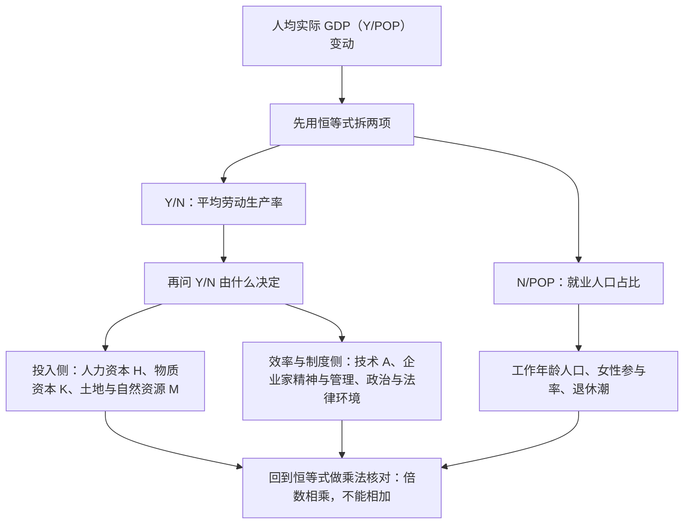

# ECO2021 课堂笔记：第 7 章　经济增长（Economic Growth）

> 对应课件：Chapter 7, Basic Macroeconomics（Instructor: Jieshuang He），共 64 页
> 笔记内容全部基于课件整理；课件页码（7-1 至 7-64）与我的分节编号不一一对应，我按逻辑重排了顺序
> 本讲的主线是一条：**先用两组数字把"富与穷"摆出来（差多少、跑多快），再把"人均 GDP"拆成"每个工人产出 × 干活人口占比"，然后用一个生产函数把这套直觉写成公式，最后用"追赶效应"回答谁追上了、谁没追上，以及增长要付什么代价**。课件最后一页自己画了一张总图（p64），全章骨架就是它：左侧三个方框（人均实际 GDP、就业人口占比、平均劳动生产率）通过右上角的"经济增长 → 生活水平"接起来，右下角的"六个决定因素"指向"平均劳动生产率"。

---

## 〇、本讲地图

这张表是"一条线"的锚点：读正文时如果迷路，回到这里看当前这一节在整章里的位置。本讲的顺序与课件基本一致，只在三处做了合并（第 9–12 页四户人家的食物照片并入第三节、第 13 页的四个问题收到第三节末尾、第 55 页的追赶效应图与第 56–59 页的证据合成第十节），因为它们是前一节内容的直接延伸，拆开会打断思维。

| 本章小节 | 对应讲义页 | 这一节在回答什么问题 |
|---|---|---|
| 一、六个学习目标 | p2 | 这一讲要交付哪六件事 |
| 二、开场：两百年前的日子与"12 倍" | p3–p4 | 增长到底改变了什么？用什么尺子量？ |
| 三、谁富谁穷 | p5–p13 | 跨国差距有多大？富国穷国的家庭分别拥有什么？ |
| 四、1870–2010：水平与速度 | p14–p15 | 谁在什么位置？谁跑得快？ |
| 五、复利与 72 法则 | p16–p19 | 为什么"每年多 1%"能在几代人后变成天壤之别 |
| 六、把人均 GDP 拆成两半 | p20–p25 | 人均产出 = 效率 × 干活的人占比 |
| 七、平均劳动生产率的六个决定因素 | p26–p37 | "效率"本身由什么决定 |
| 八、制度、政策与三个国家案例 | p38–p49 | 为什么"要素给够"不等于"增长会来" |
| 九、把故事写成模型：生产函数 | p50–p55 | 把前七节的直觉装进一个式子 |
| 十、追赶效应与它没兑现的部分 | p55–p59 | 穷国一定会追上富国吗 |
| 十一、增长的代价与"可持续性"之争 | p60–p63 | 增长要付什么代价？付得起吗？ |
| 十二、速查表与易错点 | p64 | 考前速览 |
| 十三、附：诚实备注 | — | 我算了什么、补了什么、课件哪里有问题 |

**这份笔记的读法。** 括号里第一次出现的英文是课件原名，中文是我给的译名，考试与作业里请以英文术语为准。凡是课件给了数字的地方，我都保留原数字并说明口径；凡是我自己算的、补的，都集中在第十三节交代清楚，正文里不再逐句加标记——只有两类例外会在正文里明说：**答案课件没给的练习题**，以及**课件自己内部对不上、需要我把两处并排摆出来的地方**。

---

## 一、六个学习目标（Learning Objectives，p2）

课件第 2 页把本章要交付的东西列成了六条，它们恰好构成一个从"事实"到"模型"再到"评价"的漏斗：

第一，**展示增长率的微小差别如何导致生活水平的巨大差别（show how small differences in growth rates can lead to large differences in living standards）**。这是本章的动机页——不讲模型，只讲"为什么这件事值得学"。

第二，**解释为什么人均 GDP 等于"平均劳动生产率 × 就业人口占比"，并用这个分解讨论增长的来源**。这是本章唯一的会计恒等式，也是后面所有分析的分母。

第三，**讨论一国之内平均劳动生产率的决定因素，并用这些概念解释跨国人均 GDP 差异**。这一步是从"恒等式"走到"机制"：拆出来之后，每一项由什么决定。

第四，**讨论并评价促进经济增长的政府政策**。这是把机制变成处方。

第五，**比较经济增长的收益与成本**。注意这一条的关键词是 compare and contrast——课件要的不是"增长好不好"，而是"好在哪里、坏在哪里"。

第六，**描述经济增长与环境质量之间的权衡（trade-offs between economic growth and environmental quality）**。

把这六条连起来看，本章的路线是：**摆事实 → 拆恒等式 → 找决定因素 → 谈政策 → 算代价**。第五、六两条在课件里份量明显比前四条轻（只占第 60–63 页四页），但它们恰好是期末论述题最喜欢问的角度，别因为页数少就跳过。

> **一个交叉参照。** 同一目录下的教材 Mankiw《Principles of Macroeconomics》8th ed. 里，对应内容是**第 12 章 Production and Growth**（书里对应 pp.239–252）、以及**第 13 章 Saving, Investment, and the Financial System**。两者**不完全重合**：课件把生产率归结为**六个**决定因素（见第七节），而 Mankiw 只给**四个**（physical capital per worker、human capital per worker、natural resources per worker、technological knowledge）；课件把"企业家精神与管理""政治与法律环境"单列成因子，Mankiw 则把制度问题放在"public policy"一节里讲。复习时**以课件为准**，Mankiw 的四因素可以当记忆骨架。

---

## 二、开场：两百年前的日子与"12 倍"（p3–p4）

### 2.1 五个"19 世纪的事实"（p3）

课件第 3 页用一串具体到有点残酷的数字，把"增长之前的世界"变成一个可以想象的生活场景：

- **预期寿命 40 岁**。更要紧的是下面那句注：**大多数家庭会有两三个孩子夭折**。这句话的作用不是耸人听闻，而是告诉你"40 岁"这个数字背后的分布——不是大家整齐地活到 40 岁，而是大量婴幼儿死亡把平均数拉了下来。
- **没有任何东西比马跑得更快**（Nothing moved faster than the speed of a horse）。课件特意给 Nothing 加了下划线：这是在说"速度"这件事在 19 世纪之前是**有物理上限的**，而这个上限决定了市场能有多大、信息能跑多远。
- **最好的公路是从波士顿到纽约的那条**，驿站马车（stagecoach）跑完 **175 英里要 3 天**。折合约 **2.4 英里/小时**——比走路快不了多少，而且这还是当时"最好"的条件。

然后课件跳到结论：**技术变化的步伐一直在加速**，并且补了两句很关键的话：

- **Inventions are not sufficient to create growth**（光有发明不足以创造增长）；
- **Structure of production and economy must change**（生产结构与经济结构必须跟着变）。

这两句是整章的伏笔。第七节会看到：中国宋代就有造纸、火药、印刷术、水车、指南针、瓷器（p36），却随后陷入停滞——因为发明没有配上能让它变成产出的制度。**"要素齐备"和"增长发生"之间隔着一个制度层**，这是本章后半段反复回到的主题。

> **一处疑似笔误。** 第 3 页第二个大标题写的是 "**Since 1990**, pace of technical change has been accelerating"。我认为这里的 **1990 应为 1900**（甚至 1800）。理由有两条：① 同一页上一段讲的是 18 世纪末、19 世纪初，下一句讲的是"发明不够、生产结构要变"，这是典型的**工业革命**叙事；② 课件第 33 页自己画的技术时间线是"18 世纪马力 → 19 世纪蒸汽机/铁路/内河 → 20 世纪公路网/航空"，技术加速显然远早于 1990。我在正文里按"1900 年前后"理解，但**照录了课件原文**，你可以自己判断。

### 2.2 一把尺子：人均实际 GDP（p4）

第 4 页交代了度量工具：**人均实际 GDP（real GDP per person）是衡量"一个普通人能拿到多少商品"的指标**。然后给出本章最响亮的一个比较：

> 美国 2010 年的人均 GDP 是 **1870 年的 12 倍**。

这个"12 倍"可以用第 14 页的表直接核出来：$30{,}491 \div \$2{,}445 = 12.47$，四舍五入到整数就是 12。**注意这是 140 年 12.47 倍，折合年均只有 1.82%**——一个看起来微不足道的年增长率，累积一件事就变成了十二倍。这正是第五节要讲的复利，也是整章"小差别变成大差距"的第一个实例。

课件紧接着给了两个**限制条件**，这两句比那个 12 倍更重要：

- **长时间跨期的比较受数据可得性拖累**（comparisons across long periods are complicated by lack of data）——1870 年没有国民收入核算体系，那些数字是经济史学家用工资、物价、产出片段拼出来的估计。
- **19、20 世纪商品的种类、数量和质量的提升是巨大的**（variety, quantity, and quality increased enormously）——这句是 CPI 偏差那一章（第 5 章）的老问题在这里的翻版：**用"今天的购物篮"去衡量 1870 年的产出，会系统性低估当年的实际生活水平**，反过来说，"12 倍"很可能低估了真实改善的程度。这个 caveat 课件只提了一句，但它决定了你怎么读第 14 页那张表。

---

## 三、谁富谁穷（p5–p13）

### 3.1 八条线：1960–2024 年的人均 GDP（p5）

课件第 5 页是世界银行的一张折线图，标题写明口径：**Annual GDP per capita (in current US\$), 1960–2024**，八个国家分别是美国、德国、英国、日本、中国、巴西、印度、乌干达。图上能读出的四件事（数值是我从图上读的近似值）：

| 国家 | 1960 年前后（约） | 峰值（约） | 2023/24 年末（约） |
|---|---|---|---|
| 美国 U.S. | \$3,000 | —（一路向上） | **\$86,000** |
| 德国 Germany | \$1,500 | — | **\$55,000** |
| 英国 U.K. | \$1,400 | — | **\$50,000** |
| 日本 Japan | \$500 | **约 \$44,000（1990 年代中期）** | **约 \$33,000** |
| 中国 China | 约 \$100 | — | **约 \$13,000** |
| 巴西 Brazil | 约 \$200 | — | **约 \$10,000** |
| 印度 India | 约 \$80 | — | **约 \$2,700** |
| 乌干达 Uganda | 约 \$60 | — | **约 \$1,000** |

四件事值得单独说：

**第一，日本是这张图上唯一一条"先冲高再回落"的富国曲线。** 它在上世纪 90 年代中期一度几乎追平美国，之后一路下滑到美国的三分之一多一点。**这个下滑不能读成"日本生产率崩了"**——这张图的单位是**当年美元**（current US\$），里面混了汇率。日元在 1995 年后大幅贬值、日本物价水平又长期偏低，两件事叠加就足以把一条用市场汇率换算的曲线压下去。要比较真实的生产率，得看第 47 页那种"劳动生产率增速"的图，或者用购买力平价。**这一页和后面第 14 页的表不是同一把尺子，绝对不能拼读**（见第十二节的坑 2）。

**第二，中国的位置已经翻过去了。** 中国在 1960 年比印度和乌干达都高不了多少，2000 年前后开始陡起来，2023/24 年已经超过巴西，达到印度的 4.8 倍左右。

**第三，美国的曲线在 2020 年之后有一段异常陡的上升**，这在当年美元口径下很大一部分来自通胀与美元升值，不全是实产出的增长——这也是当年美元口径的通病。

**第四，乌干达这条线几乎贴着地面。** 它 60 年的爬升总量比不上美国 1960 年一年的起点。这是本章开头那句"小差别变成大差距"最直观的一张图。

### 3.2 三种收入水平的三户人家（p6–p8）

课件第 6–8 页用了《Material World: A Global Family Portrait》的三张照片：每户人家把**全部家当**搬到院子里，配上三个指标。这三个数字是本章最省事的"生活水平"定义：

| 国家 | 收入档位（课件用语） | 人均实际 GDP | 预期寿命 | 成人识字率 |
|---|---|---|---|---|
| 英国 U.K. | an advanced economy（发达经济体） | **\$30,800** | **78 岁** | **99%** |
| 墨西哥 Mexico | a middle income country（中等收入国家） | **\$9,800** | **74 岁** | **92%** |
| 马里 Mali | a poor country（穷国） | **\$1,000** | **41 岁** | **46%** |

这三行是本讲的"三档标尺"。注意三个指标**同向变化**：人均 GDP 差 31 倍（\$30,800 / \$1,000），预期寿命从 78 岁掉到 41 岁（**少了 37 年**），成人识字率从 99% 掉到 46%。**收入差距从来不只是"钱多钱少"，它同时是寿命差距和识字率差距**——这就是为什么本章的标题不用 "GDP growth" 而用 "Economic Growth" 与 "standard of living"。

### 3.3 一周的食物：四户人家的账（p9–p12）

接下来四页（p9–p12）用《Hungry Planet: What the World Eats》的照片，把"生活水平"落到一个非常具体的量上：**一家人一周的食物，值多少钱**。

| 页码 | 家庭 | 地点 | 一周食物价值 |
|---|---|---|---|
| p9 | The Caven family | 美国加州 American Canyon | **\$159.18** |
| p10 | The Ukita family | 日本东京小平市 Kodaira City | **37,699 日元 = \$317.25** |
| p11 | The Dong family | 中国北京 | **1,233.76 元 = \$155.06** |
| p12 | The Aboubakar family | 苏丹 Breidjing 难民营 | **685 非洲法郎 = \$1.23** |

**这是一组可以核验的数字，因为课件同时给了本币和美元。** 用课件自己的两个数反除，可以还原出它隐含的汇率：

| 家庭 | 课件给的两种货币 | 隐含汇率 | 是否合理 |
|---|---|---|---|
| Ukita（日本） | 37,699 日元 = \$317.25 | **118.8 日元/美元** | ✓ 合理（2000 年代中期的水平） |
| Dong（北京） | 1,233.76 元 = \$155.06 | **7.96 元/美元** | ✓ 合理 |
| Aboubakar（苏丹） | 685 非洲法郎 = \$1.23 | **557 法郎/美元 ≈ 668 法郎/欧元** | ✓ 合理（非洲法郎 CFA franc 对欧元的官方平价是 **655.957**，按 1 欧元 ≈ 1.2 美元折算约 547 法郎/美元，与 557 相差不到 2%） |

三个隐含汇率互相独立，却都落在它们各自历史上的真实区间里——**这说明课件这四个数字不是随手编的**。

不过用这组数字时有两个坑必须说清：

- **\$1.23 这个数字的"口径"课件没交代。** 照片里那户人家住在难民营，这类家庭的食品通常有一部分来自援助，所以 \$1.23 更可能是"这家人**购买**的食物"的市场价，而不是"这家人一周吃掉的食物的全部价值"。**把它当作"量级对比"来记，不要读成"这家人一周只吃得起 1.23 美元"**——课件没有说明口径，这是我的推断。
- **日本那户人家的 \$317.25 比美国那户高出一倍**，但它所在的人均 GDP 并不比美国高一倍。这说明"一周食物支出"同时受**物价水平**和**饮食结构**影响（日本家庭那周的食物里有大量生鲜与海产品），它**不是**生活水平的直接度量，只是一个很直观的窗口。

### 3.4 本章要回答的四个问题（p13）

课件第 13 页把上面这些照片和曲线收成四个问题，它们就是本章的目录：

1. **为什么有些国家比另一些国家富？长期看，什么决定生活水平？**
2. **为什么有些发展中国家能比富裕的发达国家增长得快得多？**
3. **为什么有些穷国增长很快，另一些却像陷在"贫困陷阱（poverty trap）"里？**
4. **什么样的政策能提高增长率和长期生活水平？**

四个问题里，第 1 个是"水平"问题，第 2、3 个是"速度"问题，第 4 个是"政策"问题。**第 3 个问题其实是第 2 个问题的反面**，而这一对问题正是第十节"追赶效应"的主角：为什么有的穷国追上了（韩国、新加坡），有的没有（尼日尔、刚果民主共和国）。

---

## 四、1870–2010：水平与速度（p14–p15）

### 4.1 水平表：谁在什么位置（p14）

课件第 14 页给出八国在六个年份的人均实际 GDP。**这张表没有标注计价单位**（第 38 页的同类图注明是"1990 international dollar"，但第 14 页没写），引用时要注意这一点。

| 国家 | 1870 | 1913 | 1950 | 1980 | 1990 | 2010 |
|---|---|---|---|---|---|---|
| 美国 US | \$2,445 | \$5,301 | \$9,561 | \$18,577 | \$23,201 | **30,491** |
| 英国 UK | \$3,190 | \$4,921 | \$6,939 | \$12,931 | \$16,430 | **23,777** |
| 德国 Germany | \$1,839 | \$3,648 | \$3,881 | \$14,114 | \$15,929 | **20,661** |
| 日本 Japan | **\$737** | \$1,387 | \$1,921 | \$13,428 | \$18,789 | **21,935** |
| 中国 China | \$530 | \$552 | **\$448** | \$1,061 | \$1,871 | **8,032** |
| 巴西 Brazil | \$713 | \$811 | \$1,672 | \$5,195 | \$4,920 | **6,879** |
| 印度 India | \$533 | \$673 | \$619 | \$938 | \$1,309 | **3,372** |
| 加纳 Ghana | **\$439** | \$781 | \$1,122 | \$1,157 | \$1,062 | **\$1,922** |

这张表里有五处值得单独圈出来：

**其一，1870 年最富的是英国，不是美国。** \$3,190 对 \$2,445 —— 这是"日不落帝国"的巅峰时刻，美国要再过几十年才反超。

**其二，日本在 1870 年是八国里最穷的**（\$737，倒数第二是中国的 \$530）。到 2010 年，日本（\$21,935）已经站到八国的第二位，仅次于美国。**"起点最穷"和"终点第二"之间只隔了 140 年**，这是本讲最励志的一行。

**其三，中国的人均 GDP 在 1950 年低于 1870 年。** \$530（1870）→ \$552（1913）→ **\$448（1950）**。近八十年里，中国的人均产出**绝对下降**了 15%。这是本章少见的一次"负增长 80 年"，也是理解"为什么中国 1980 年之后的速度能到 7%"的必要背景——起点被压得很低。

**其四，1980–1990 这十年里，巴西、加纳的人均 GDP 是下降的**（巴西 \$5,195 → \$4,920；加纳 \$1,157 → \$1,062），中国、日本、美国是上升的。这张表横着看是"谁富"，竖着看是"哪十年谁在退"。

**其五，加纳 1950 年（\$1,122）比中国（\$448）和印度（\$619）都富。** 到 2010 年，加纳（\$1,922）只有中国的四分之一、印度的 57%。**起点高不等于终点高**，这一行的信息量比平均值大得多。

### 4.2 速度表：谁跑得快（p15）

第 15 页换成三段年均增长率。注意列的年份区间是**重叠的**，不是首尾相接的三段：

| 国家 | 年均增长 1870–2010 | 年均增长 1950–2010 | 年均增长 1980–2010 |
|---|---|---|---|
| 美国 US | 1.8% | 2.0% | 1.7% |
| 英国 UK | 1.4% | 2.1% | 2.1% |
| 德国 Germany | 1.7% | 2.8% | 1.3% |
| 日本 Japan | 2.5% | **4.1%** | 1.6% |
| 中国 China | 2.0% | 4.9% | **7.0%** |
| 巴西 Brazil | 1.6% | 2.4% | 0.9% |
| 印度 India | 1.3% | 2.9% | 4.4% |
| 加纳 Ghana | **1.1%** | **0.9%** | 1.7% |

### 4.3 两张表能不能对上——我的复核（这一步别省）

**一个必须做的检查是：第 15 页的增长率，是不是能从第 14 页的水平反算出来？** 如果对不上，说明两张表用了不同口径（例如一个用本币、一个用 PPP），那么后面所有"谁跑得快"的推论都要重新检查。我把 24 个格子全部用复利公式 $\left(\dfrac{Y_{t_2}}{Y_{t_1}}\right)^{1/(t_2-t_1)}-1$ 算了一遍：

| 国家 | 1870–2010 我算 / 课件 | 1950–2010 我算 / 课件 | 1980–2010 我算 / 课件 |
|---|---|---|---|
| 美国 | 1.82 / 1.8 | 1.95 / 2.0 | 1.67 / 1.7 |
| 英国 | 1.45 / 1.4 | 2.07 / 2.1 | 2.05 / 2.1 |
| 德国 | 1.74 / 1.7 | 2.83 / 2.8 | 1.28 / 1.3 |
| 日本 | 2.45 / 2.5 | 4.14 / 4.1 | 1.65 / 1.6 |
| 中国 | 1.96 / 2.0 | 4.93 / 4.9 | 6.98 / 7.0 |
| 巴西 | 1.63 / 1.6 | 2.39 / 2.4 | 0.94 / 0.9 |
| 印度 | 1.33 / 1.3 | 2.87 / 2.9 | 4.36 / 4.4 |
| 加纳 | 1.06 / 1.1 | 0.90 / 0.9 | 1.71 / 1.7 |

**24 个格子里每一个都落在课件的四舍五入范围内（最大偏差 0.05 个百分点）。** 结论：**两张表是同一套数据**，可以放心地"横向比水平、纵向比速度"。

顺带核出课件的另外三句话：
- 第 16 页"中国 1870 年的人均产出约为加纳的 120%"：\$530 / \$439 = **120.7%** ✓
- 第 16 页"到 2010 年中国超过加纳的 4 倍"：\$8,032 / \$1,922 = **4.18 倍** ✓
- 第 4 页"美国 2010 年是 1870 年的 12 倍"：\$30,491 / \$2,445 = **12.47 倍** ✓

### 4.4 从两张表里读出的四件事

**第一，长期看，增长速度的差别几乎决定了一切。** 140 年 1.1%（加纳）与 2.0%（中国）差 0.9 个百分点，结果是从"中国是加纳的 120%"变成"中国是加纳的 4.2 倍"。

**第二，1950 年之后出现了一个"追赶带"。** 看 1950–2010 这一列：日本 4.1%、中国 4.9%、印度 2.9%、德国 2.8%，而美国只有 2.0%。起点越低、这六十年的速度越快。

**第三，但这个规律在 1870–2010 这一列完全不成立。** 我把"1870 年水平"与"1870–2010 增速"做了相关：**Pearson 相关系数只有 −0.077，Spearman 秩相关 +0.26**——也就是说，**把时间拉长到 140 年，穷国并没有比富国跑得快，甚至毫无关系**。换成 1950–2010 这一列，相关变成 **Pearson −0.37、Spearman −0.50**，方向对了，但强度也只是中等。**"穷国天然追得快"是一个只在特定时段、特定国家群里成立的规律，不是一个普遍定律。** 这正是第十节的主题，而第 57 页那张满屏散点的图就是对它的直接反驳。

**第四，加纳 1950–2010 的年均增速（0.9%）比它自己的 1870–2010 长周期（1.1%）还低。** 一个 1950 年比中国富两倍多的国家，在"全球化黄金六十年"里几乎没有动。这就把第三节的第 3 个问题逼出来了：**为什么有的穷国追，有的不追？**

---

## 五、复利与 72 法则（p16–p19）

### 5.1 复利的定义与一个 215 年的例子（p16）

课件给的复利（compound interest）定义是：**利息按"本金 + 之前累积的所有利息"计算**——第一年赚到的利息，第二年会替你继续赚钱。页码上那句话写得很直白：**Interest paid in year 1 earns interest in year 2**。

然后是一个能让人坐直的例子：

$$\$10 \times (1.04)^{215} = \$45{,}937.56$$

（1800 年存 10 美元，年利率 4%，到 2015 年——正好 215 年。）我重算的结果是 **\$45,937.56**，与课件分毫不差。

**这个例子的要点不是"钱会变多"，而是"时间才是主角"。** 10 美元的本金撑不起 4.6 万美元的结果，是 215 年的复利撑起来的。课件紧接着把结论推到增长上：

> **GDP 人均增长率和利率有一样的效果**——人均 GDP 上相对很小的增长，在长时间里会产生非常大的影响。**长期来看，一个经济的增长率才是真正重要的事。**

### 5.2 利率差一点，结果差很多（p17）

第 17 页把 215 年后的结果列成一张表，这张表就是"复利敏感度"的直观展示：

| 年利率 | 215 年后 \$10 的价值（课件） | 我复算 |
|---|---|---|
| 2% | \$706.38 | **\$706.38** ✓ |
| 4% | \$45,937.56 | **\$45,937.56** ✓ |
| 6% | \$2,759,059.28 | **\$2,759,059.28** ✓ |

**利率从 2% 提到 6%，只差 4 个百分点，结果差了 3906 倍**（\$2,759,059.28 / \$706.38 = 3906.4）。这就是"增长率为什么重要"的全部论证：**你不需要增长率很高，你需要它持续得足够久，而且不要差几个百分点。**

### 5.3 72 法则（p18）

课件给的近似式是：

$$\text{翻倍所需年数} \approx \frac{72}{\text{年利率（\%）}}$$

两个例子：利率 2% → **36 年**翻倍；GDP 增速 3% → **24 年**翻倍。

**这个法则的准确度值得单独说清楚，因为课件把它当精确公式在用了。** 精确的翻倍时间是 $\ln 2 / \ln(1+r)$：

| 年增长率 | 72/r（课件法） | 精确值 | 误差 |
|---|---|---|---|
| 1% | 72.0 年 | **69.66 年** | +2.3 年 |
| 2% | 36.0 年 | **35.00 年** | +1.0 年 |
| 3% | 24.0 年 | **23.45 年** | +0.6 年 |
| 4% | 18.0 年 | **17.67 年** | +0.3 年 |
| 6% | 12.0 年 | **11.90 年** | +0.1 年 |
| 8% | 9.0 年 | **9.01 年** | −0.01 年 |
| 10% | 7.2 年 | **7.27 年** | −0.07 年 |

**规律是：72 在 4%–10% 这一段最准（误差不超过半年），但增长率越低，72 越偏高。** 到 1% 的时候，72 法则会告诉你"72 年翻倍"，而真实答案是约 70 年——**多算了两年多**。原因很简单：连续复利下精确的分子是 $100 \ln 2 = 69.3$，所以 72 是"为 5%–10% 这个区间调过参的版本"。**同一目录下的 Mankiw 教材用的是"70 法则"（rule of 70）**，在低增长率下比 72 准，在高增长率下比 72 差一点。考试如果只要求估算，哪个都行；如果题目给了具体数字让你算，就直接用 $\ln 2/\ln(1+r)$。

### 5.4 练习：Poorland 什么时候追上 Richland（p19）

> Richland 的人均实际 GDP 是 **\$10,000**，Poorland 是 **\$5,000**。Richland 以每年 **1%** 增长，Poorland 以每年 **3%** 增长。**Poorland 大约需要多少年才能追上 Richland？**

**课件只给题目，没给答案。下面是我的解答。**

设 $t$ 为年数，"追上"意味着两者相等：

$$10{,}000 \times (1.01)^t = 5{,}000 \times (1.03)^t$$

两边同除以 $5{,}000 \times (1.01)^t$：

$$2 = \left(\frac{1.03}{1.01}\right)^{t} = (1.0198)^t
\qquad\Longrightarrow\qquad
t = \frac{\ln 2}{\ln(1.03/1.01)} = \frac{0.6931}{0.019609} \approx 35.3\ \text{年}$$

**答案：约 35 年**（更精确地说是 35.3 年，即在第 36 年追上）。验证一下：

| 年数 | Richland | Poorland | 谁高 |
|---|---|---|---|
| 35 年 | \$14,166 | \$14,069 | 还差 \$97，Poorland 略低 |
| 36 年 | \$14,308 | \$14,491 | Poorland 反超 |

**这道题真正的考点不是算术，而是那个"2%"：** 起点差一倍，只要增速差 2 个百分点，一代人（35 年）就能抹平。把它和第四节的表放在一起看——加纳 1950–2010 的年均增速是 0.9%，中国是 4.9%，**差 4 个百分点，六十年下来就是 4 倍 vs 16 倍的差距**。

> **另一种问法（课件没问，但很可能考）：如果 Poorland 的增速只有 2%，多久追上？** 此时 $t = \ln 2/\ln(2.02/1.01)$… 注意这里不能直接用比值，正确式子是 $t = \ln 2/\ln(1.02/1.01) = 0.6931/0.009852 \approx 70.4$ 年。**差 1 个百分点，追上年数从 35 年拉到 70 年**——这就是复利对"差额"的极端敏感性。

---

## 六、把人均 GDP 拆成两半（p20–p25）

### 6.1 记号与恒等式（p20）

课件先立三个记号，这三个记号是本章后面所有公式的地基：

| 记号 | 含义 |
|---|---|
| $Y$ | 实际 GDP（real GDP），一国产出的总量 |
| $N$ | **就业人数**（number of people **employed**）——注意不是劳动力、不是人口 |
| $POP$ | 总人口（population） |

然后给出本章唯一的恒等式：

$$\frac{Y}{POP} = \frac{Y}{N} \times \frac{N}{POP}$$

这个式子右边两项各有名字，而且这两个名字本身就是结论：

- $\dfrac{Y}{N}$ = **平均劳动生产率（average labor productivity）**，即"每个干活的人平均产出多少"；
- $\dfrac{N}{POP}$ = **就业人口占总人口的比重（share of the population employed）**。

**它为什么是恒等式而不是理论？** 因为右边的 $N$ 一上一下正好抵消，所以这个式子在**任何**国家、**任何**年份都成立，不需要任何假设。它的作用不是"解释"，而是**把一个总量问题切成两个可以分别研究的问题**。课件接下来说得很清楚：**人均消费取决于两件事——每个工人产出多少，以及有多少人在工作。**

> **一个容易搞混的地方：分母是 POP，不是劳动年龄人口。** 所以 $\dfrac{N}{POP}$ 里同时含了三件事：① 人口中有多少是劳动年龄，② 劳动年龄人口里有多少参与劳动，③ 劳动力里有多少真的被雇用了。美国这个比重只有 0.46 左右，不是因为一半人失业，而是因为**小孩和退休的人也在分母里**。这一点在第 6 章的"三个群体、两个比率"里讲过，两章要连起来看。

### 6.2 美国 1960–2013 的三个数字（p21）

课件给出人均 GDP 增长的两条渠道（$\dfrac{Y}{N}$ 上升，**和/或** $\dfrac{N}{POP}$ 上升），然后用美国 1960–2013 的数据做了一次分解：

| 项目 | 1960 → 2013 的变化 |
|---|---|
| 人均 GDP（$Y/POP$） | **+189%** |
| 产出/工人（$Y/N$，平均劳动生产率） | **+131%** |
| 就业人口占比（$N/POP$） | **从 36% 升到约 46%**，课件写"增长 27.8%" |

关于第三个数字，课件给了三条解释：**劳动年龄人口变大**、**女性劳动参与率上升**，以及一条判断——**2010 年以后这个比重不太可能继续上升了**（However, unlikely to rise after 2010）。

### 6.3 三个数字对不上——这是本讲最值得记的一处

**这里有一个必须指出来的问题：课上给的三个百分比，不能同时成立。** 因为 $\dfrac{Y}{POP} = \dfrac{Y}{N} \times \dfrac{N}{POP}$ 是恒等式，所以**三个变化率的"倍数"必须相乘**，而不是相加：

$$(1 + 1.31) \times (1 + 0.278) = 2.310 \times 1.278 = 2.952 \quad\Longrightarrow\quad +195.2\%$$

可是课件给的第三个数是 **+189%**（即倍数 2.89）。两者差 6.2 个百分点。反推一下，如果人均 GDP 真的只涨了 189%，那么就业占比必须只涨

$$\frac{2.89}{2.31} = 1.2511 \quad\Longrightarrow\quad +25.1\%$$

而如果就业占比真的涨了 27.8%（即倍数 1.2778），那么产出效率只该涨

$$\frac{2.89}{1.2778} = 2.2615 \quad\Longrightarrow\quad +126.2\%$$

**哪一个是错的？我倾向于"27.8%"这个数。** 它的来源很可能是把两个**四舍五入后**的百分数直接相除：$46/36 - 1 = 27.78\%$。而如果用未四舍五入的实际数（就业占比大约从 **36.8%** 升到 **46.1%**），比值是 $0.461/0.368 \approx 1.252$，也就是 **+25.2%**，与恒等式要求的 +25.1% 几乎完全吻合。**也就是说：课件前面两个数（189%、131%）是自洽的，第 27.8% 是"用圆整后的数字再算一次百分比"造出来的假精度。**

这一处给我两个可迁移的教训：

1. **百分比变化永远要还原成倍数再相乘，绝不能相加。** 如果有人写"$189\% \approx 131\% + 27.8\% = 158.8\%$"，那是把乘法当加法。反过来说，**"乘出来对不对"是检验一组百分比是否自洽的最快办法**。
2. **不要在四舍五入后的数字上再做百分比运算。** 这是宏观经济数据里最常见的假精度来源。

### 6.4 两条曲线：$Y/POP$ 与 $Y/N$（p22–p23）

课件用两页图把上面那三个数字画出来。**第 22 页**是一张双线图（单位：2009 年美元），标题是 "Y / POP and Y / N, 1960 – 2013 U.S."：

- **红线在上：Real GDP per worker（$Y/N$）**，从约 \$48,000 升到约 **\$110,000**，比值约 2.29 倍；
- **蓝线在下：Real GDP per person（$Y/POP$）**，从约 \$17,500 升到约 **\$50,700**，比值约 2.89 倍。

两条线**形状几乎一样**（都是平缓上行、2008–09 年有个小坑），但**水平差一倍以上**——这个"两条平行线之间的空隙"就是 $\dfrac{N}{POP}$ 的倒数，也就是"一个干活的人要养多少人"。

**第 23 页**单独画出那第三项：标题 "N / POP, 1960 – 2013 U.S."，纵轴是百分比。曲线从 1960 年的约 **0.36** 一路升到 2000 年前后的约 **0.48** 高点，2010 年前后回落到约 **0.44**，2013 年收在 **0.455 左右**。

**这条线为什么重要？** 因为它是第 6 章"劳动参与率"的另一种画法：1960–2000 年的上升主要来自**婴儿潮一代进入劳动年龄**和**女性参与率上升**；2000 年之后的回落主要是**金融危机后就业率下滑 + 婴儿潮开始退休**。而课件第 21 页那句"2010 年以后不太可能继续上升"，说的就是这条线：**它已经到顶了**。**这意味着未来的人均 GDP 增长，只能靠 $\dfrac{Y}{N}$ 这一条腿。** 这是第 25 页那道练习的全部背景。

### 6.5 结论句（p24）

第 24 页单独放了一个绿色方框，只有一句话：

> **长期来看，人均产出的增长主要来自平均劳动生产率的增长。**
> （In the long run, increases in output per person arise primarily from increases in average labor productivity.）

这句是本章的转折点：**从这一页开始，$\dfrac{N}{POP}$ 退居二线，全章的注意力转向"什么决定 $\dfrac{Y}{N}$"**——也就是接下来第七节的六个决定因素。

### 6.6 练习：人口老龄化会把人均 GDP 拉回多少（p25）

> 美国的"银发潮"会让未来几十年里退休人口占比大幅上升。为说明它对生活水平的影响，**假设 2013 年之后的 53 年里，就业人口占比回落到 1960 年的水平，同时平均劳动生产率的提升幅度与 1960–2013 年相同**。在这个情景下，**2013 到 2066 年之间人均实际 GDP 的净变化是多少？**

**课件同样只给题目、不给答案。下面是我的解答。**

这个情景有两件事同时发生：

1. **劳动生产率的贡献不变**：$\dfrac{Y}{N}$ 的倍数仍然是 **2.31**（即 +131%）；
2. **就业占比往回走**：从 2013 年的约 0.46 退回 1960 年的 0.36，倍数 $= \dfrac{0.36}{0.46} = 0.7826$。

因为恒等式是乘法，把两件事乘起来：

$$\frac{(Y/POP)_{2066}}{(Y/POP)_{2013}} = 2.31 \times \frac{0.36}{0.46} = 2.31 \times 0.7826 \approx 1.808
\qquad\Longrightarrow\qquad \textbf{+80.8\%}$$

**答案：人均实际 GDP 大约只涨 81%**（即变成 2013 年的约 **1.8 倍**）。

**这个数对所用比重很敏感，我把三种取法都算了：**

| 用的就业占比 | 2066 / 2013 | 净变化 |
|---|---|---|
| 课件口径 0.36 → 0.46 | 1.808 | **+80.8%** |
| 从第 23 页图上读 0.36 → 0.455 | 1.828 | +82.8% |
| 由恒等式反推出的更精确值 0.368 → 0.461 | 1.845 | +84.5% |

**所以稳妥的答法是"约 +80%，即 1.8 倍左右"。** 无论取哪一组，结论都一样，而且结论本身就是这道题的考点：

> **生产率涨了 2.31 倍，人均 GDP 却只涨了不到 1.9 倍——中间被"干活的人变少"吃掉了两成。** 如果只看劳动生产率那条线，你会严重高估老龄化的后果；如果只看就业占比那条线，你会低估长期增长的韧性。**这就是为什么必须先拆成两项。**

### 6.7 拿到一个增长数据，按什么顺序拆

下面这张图是我整理的诊断顺序，**课件没有画这张图**。它的作用是把第六、七、八三节串成一条可操作的路：遇到"某国人均 GDP 涨了 X%"这种题，先做恒等式分解，再往下一层找决定因素。第七节会逐个展开最下面那六个因素。

**两条使用提醒：** ① 图上第一层是**恒等式**，所以拆出来的两项一定能对回去，对不上就说明某个数字抄错了（第 6.3 节就是这么发现课件那处不自洽的）；② 第二层的六个因素**不是互斥的**，第七节会看到它们之间有大量重叠（例如"技术"和"企业家精神"常常是同一件事的两个侧面），所以不要指望用这张图做精确的定量分解。

---

## 七、平均劳动生产率的六个决定因素（p26–p37）

### 7.1 六个决定因素与一组倍数（p26）

课件先给一组对比，说明"劳动生产率"的跨国差距有多大：**美国的平均劳动生产率是印度尼西亚的 24 倍、是孟加拉国的 100 倍**。（课件的这一页没有标注口径与年份，我无法用课件内部的数据复核这两个比值；只能确认它们**属于同一个口径**，因为 24 与 100 的比意味着"印尼大约是孟加拉的 4.2 倍"。）

然后列出六个决定因素（six determinants of average labor productivity）：

| # | 英文 | 中文 | 我的归类 |
|---|---|---|---|
| 1 | Human capital | 人力资本 | 投入侧 |
| 2 | Physical capital | 物质资本 | 投入侧 |
| 3 | Land and other natural resources | 土地与其他自然资源 | 投入侧 |
| 4 | Technology | 技术 | 效率侧 |
| 5 | Entrepreneurship and management | 企业家精神与管理 | 效率侧 |
| 6 | Political and legal environment | 政治与法律环境 | 制度侧 |

**这个"3 + 2 + 1"的归类是我做的，课件没有这样分。** 它的用处在于：前三个是**可以被"投"进去的东西**（多建学校、多买机器、多找矿），后三个更像**环境**——你不能"投"一份企业家精神，只能把制度改成让企业家愿意投。这个区分在第 41–45 页的"政策"部分会显出价值。

**同时要提醒一处与教材的结构差异**：Mankiw 第 12 章只给**四个**决定因素（物质资本/工人、人力资本/工人、自然资源/工人、技术知识）。课件把"技术"与"企业家精神/管理"拆成两项，又单列了"政治与法律环境"。**考试按课件的六项答，但要能说出教材的四项版本**，因为两套分类的差别本身就是一道像样的简答题。

### 7.2 #1 人力资本（Human capital，p27）

课件给的定义值得逐字看：

> **人力资本是教育、培训、经验、智力、精力、工作习惯、可信赖程度、主动性等因素的组合，它影响一个工人边际产品的价值。**

（Human capital is a combination of factors such as education, training, experience, intelligence, energy, work habits, trustworthiness, and initiative that affects the value of a worker's marginal product.）

这个定义有两处容易被忽略：

**第一，人力资本不只是"上学年限"。** 定义里八项中只有第一项是正规教育，其余七项（培训、经验、智力、精力、工作习惯、可信赖度、主动性）都是"人身上的"属性。**这就是它和物质资本的根本区别：物质资本可以换主人，人力资本不能。** 一台机器可以卖给另一个厂，一个熟练工人的技能卖不掉（除非连人一起走）。

**第二，"边际产品的价值"这个词把这一节和第 6 章接起来了。** 第 6 章讲劳动需求时用的正是 VMP（边际产品价值）：企业雇人雇到 $VMP = W$ 那一点。人力资本提高的是 $VMP$，所以**它同时提高了劳动需求曲线和工资**。第 27 页最后那句"**成本—收益原则同样适用于人力资本的积累**"（Cost–Benefit Principle applies to building human capital）和"**支付给技术工人的溢价**"（premium paid to skilled workers），说的就是个人决定"要不要读这个学位"时的那笔账：学费与放弃的工资是成本，未来的工资溢价是收益。

课件的两个例子是**德国与日本用人力资本完成战后重建**：

- 两国都有**大量幸存的专业科学家与工程师**（Many professional scientists and engineers）；
- **学徒制与在职培训被强调**（Apprentice and on-the-job training emphasized）；
- 日本还**加重了早期教育**（increased emphasis on early education）。

**这三个例子的共同点是：人力资本在"物理资本被炸掉"的时候还能留下来。** 这是理解战后德国、日本能在 20 年内回到世界前列的关键——**工厂可以重建，工程师不能速成**。把它和第八节的"两个德国"对照着看会更有味道。

### 7.3 #2 物质资本：一张表看边际报酬递减（p28）

课件用一个只有两个工人的小工厂说明物质资本：

> 更多、更好的资本会提高工人的生产率。**厂主雇两个人并增加资本——但每台机器需要一个专人操作。**

然后给出那张表（这张表是本章信息密度最高的一页）：

| 机器数量 Number of Machines | 周产出 Output per Week | 周工时 Hours Worked per Week | 每小时产出 Output per Hour Worked |
|---|---|---|---|
| **0** | 16,000 | 80 | **200** |
| **1** | 32,000 | 80 | **400** |
| **2** | 40,000 | 80 | **500** |
| **3** | 40,000 | 80 | **500** |

**这张表必须会自己算。** 三个关键量：

- **每台机器的边际产出**：第 1 台 $= 32{,}000-16{,}000 = \mathbf{16{,}000}$；第 2 台 $= 40{,}000-32{,}000 = \mathbf{8{,}000}$；第 3 台 $= 40{,}000-40{,}000 = \mathbf{0}$。
- **每小时产出的增量**：200 → 400 → 500 → 500，增量是 **+200、+100、+0**。
- **每台机器的"每小时产出"回报**：第 1 台带来 +200，第 2 台只带来 +100，第 3 台 **0**。

**为什么第 3 台机器的边际产出是零？** 这是这张表最容易被读漏的地方。答案就藏在题干里：**"每台机器需要一个专人操作"，而厂里只有两个工人**。所以第三台机器**没人开**——它不是"效率低"，而是完全不能用。这告诉我们两件事：

1. **"边际报酬递减"是"其他投入不变"的产物。** 这里保持不变的是劳动（80 小时/周）。加资本而不加劳动，迟早会撞上"没人操作"这个物理约束。
2. **边际产出掉到 0 是递减的一个极端情形，不是"递减"的常态。** 常态是从 16,000 掉到 8,000（掉一半）——**这已经是很好的递减示例了**。

课件在这一页的结论是两句：**More capital increases output per hour**（更多资本提高每小时产出）与 **Diminishing returns to capital**（资本的边际报酬递减）。这两句同时成立，并不矛盾——**总量还在涨，但每一台新机器带来的增量在变小。**

> **一个口径提醒。** 这张表的产出单位是"每小时"（Output per **Hour** Worked），而第 22 页那两条曲线是"每个工人"（per **Worker**）。两者只有在工时不变的时候才等价。本表的周工时被固定在 80 小时，所以这里等价；换成真实数据就不一定了（第 47 页中国的图用的又是"劳动生产率"，第三个口径）。**做题时先看清分母是 hour 还是 worker。**

### 7.4 边际报酬递减的定义与两个推论（p29–p30）

第 29 页给出正式定义：

> **如果"在其他投入保持不变的情况下"增加一单位资本，产出的增加量小于上一单位资本带来的增加量，就发生了资本的边际报酬递减（diminishing returns to capital）。**
> 假设：除资本外的所有投入保持不变。结果：产出以递减的速度上升。

然后给了**机制解释**，这段比定义更有用：

> 当一家企业已经有很多机器时，**最有生产力的用途已经被占满了**；新增加的那一单位资本必然会被分配到比上一单位**更没有生产力**的用途上。

最后一句把它和微观的"**机会成本递增原理（Principle of Increasing Opportunity Cost）**"挂上钩。**这个连接值得单独记**：边际报酬递减在宏观里是"每台机器新带来的产出变少"，在微观里是"要再挤出一点资本，得放弃越来越多的消费品"——**是同一件事的两个说法**。

第 30 页把推论收成两条，两条方向相反、必须一起记：

- **正面**：不断增加资本会提高产出和劳动生产率，**对增长有正贡献**；
- **限制**：因为边际报酬递减，**靠无限加资本来提高生产率是有尽头的**。

**第二条是本讲后半段的钥匙。** 第八节的中国案例（第 49 页：投资贡献了 64.2% 的增长）和第十一节关于"增长能不能持续"的争论，都建立在"加资本的回报会递减"之上。

### 7.5 跨国证据：资本/工人 与 产出/工人（p31）

第 31 页是一张 1990 年的散点图，横轴是**每个工人的实际资本**（Real capital per worker，1990 美元），纵轴是**每个工人的实际 GDP**（Real GDP per worker，1990 美元）。图上用两个色块标出两个角：

| 分组 | 典型国家 | 大致坐标（资本/工人，GDP/工人） |
|---|---|---|
| **高资本/工人，高 GDP/工人**（右上） | 美国、加拿大、德国、法国、澳大利亚、意大利 | 资本 \$31,000–52,000；产出 \$29,000–36,000 |
| **低资本/工人，低 GDP/工人**（左下） | 印度、尼日利亚、菲律宾、泰国、土耳其 | 资本 \$3,000–13,000；产出 \$3,000–9,000 |
| **两个明显的例外** | 英国（资本约 \$22,000，产出约 \$26,000）和日本（资本约 \$38,000，产出约 \$23,000） | 日本"资本很多但产出不算高" |

**图上的核心事实是：资本/工人与产出/工人高度正相关。** 这条关系是第 7.3 节那张小厂表的跨国版本——**资本多的国家，工人产出高**。

但要小心三件事，课件都没有提：

1. **这是横截面相关，不是因果。** 富国能买得起更多资本，**恰恰是因为**它富——"资本多"和"产出高"互为因果，这张图分不出谁是因。要识别因果，得靠外生冲击（例如援助、资源发现）或者面板数据里的固定效应。
2. **两个轴都用了"每工人"的口径**，而第 28 页的表用的是"每小时"。**同一个国家在两页上的位置不能直接对着读。**
3. **日本的点位是本图最有意思的地方**：它的资本/工人（约 \$38,000）已经接近美国（约 \$31,000）甚至更高，但产出/工人（约 \$23,000）明显低于法国、德国、加拿大。**这正是"资本不是唯一决定因素"的直接证据**——如果生产率只看资本，日本应该排在最前面。课件把它画出来但没解释它，第七节的其余五个因素就是解释它的候选清单。

### 7.6 #3 土地与其他自然资源（p32）

第 32 页讲资源，核心是两句话：

**第一，除了资本以外的投入也提高工人生产率**：农业要看**土地**（美国农民不到总人口的 **3%**，却能供应全国并出口余粮）；制造业需要**原材料与能源**（石油、金属）。

**第二，资源可以到国际市场上买。** 课件用一组反例说明这一点：**日本、中国香港、新加坡、瑞士都在资源禀赋很有限的情况下拥有很高的人均 GDP**。

**这一页的考点是"资源不是命运"。** 但它有个前提课件没写：**你得买得起。** 资源可以通过国际市场获得，前提是你能出口别的东西换外汇——这又回到了"技术、人力资本、制度"那五个因素。所以资源这一项的正确读法是：**它既不是必要条件（日本式反例），也不是充分条件（"资源诅咒"的存在说明它可能还是负面的）**。课件的处理偏乐观，我把它标注出来。

### 7.7 #4 技术（Technology，p33–p34）

第 33 页的标题句是一个很强的断言：

> **新技术是生产率提升最重要的单一来源。**
> （New technologies are the single most important source of productivity improvement.）

然后给出两个论点：

**第一，技术的影响会溢出到它最初应用的行业之外。** 课件列了四条溢出渠道：**交通运输扩大了农产品的市场**、**医药**、**通讯**、**电子与计算机**。

**第二，技术变化本身有一条时间线**（课件在右侧列了一个两栏的清单）：

| 时期 | 运输技术 |
|---|---|
| 18 世纪 | **马力（Horse power）** |
| 19 世纪 | **蒸汽机（Steam engine）、铁路（Rail）、内河（River）** |
| 20 世纪 | **公路网（Road network）、航空（Air）** |

**把这条时间线和第 3 页那句"没有任何东西比马快"接起来，就得到本讲的一个隐藏论证**：19 世纪之前，"速度"有物理上限，所以市场半径有限、信息传递慢；蒸汽机与铁路把这个上限拆掉之后，**分工、规模经济、技术扩散才成为可能**。技术的重要性不只是"让工厂更有效率"，而是**它改变了整个经济的可能集合**。

第 34 页给出美国劳动生产率增长的三个时期，这组数字常考：

| 时期 | 美国劳动生产率年均增长 |
|---|---|
| 1947 – 1973 | **2.8%** |
| 1973 – 1995 | **1.4%**（"生产率放缓"，slow-down） |
| 1995 – 2010 | **2.6%**（"复苏"，resurgence） |

课件对 1973 年那次放缓的评价是坦白的：**"放缓仍然是个谜"**（Slow-down remains a mystery）。对 2010 年以后则说：**"还有待观察，这是上一次衰退的暂时效应，还是一轮新的生产率放缓期的开始"**。

至于 1995 年之后为什么回升，课件的解释是：**主要归功于信息与通讯技术让工人变得更有生产率**，并且给出一个很细的判别标准——**增长出现在"生产这些技术的行业"和"使用这些技术的行业"，而"不使用这些技术的部门增长更慢"**。**这个判别标准比结论本身有用**：它说明"技术是不是罪魁"这件事，是可以看出来的（看行业内 vs 行业间的差异）。

### 7.8 #5 企业家精神与管理（p35）

这一节很短，但概念上很重要：

> **企业家创造新的经济企业**，这对一个**有活力的、健康的、增长中的经济**是**必不可少的**（essential to a dynamic, healthy, growing economy）。

课件给了四个例子（都是人名 + 一件具体的事）：**亨利·福特与大规模生产**、**比尔·盖茨与标准化的图形界面操作系统**、**拉里·佩奇与谢尔盖·布林与 Google 搜索**、**史蒂夫·乔布斯与史蒂夫·沃兹尼亚克与个人电脑**。

然后是一个政策判断，**这一句是本章少见的"处方"**：

> **政策应当把企业家精神引导到生产性的方向上去**（Policies should channel entrepreneurship in productive ways），工具是**税收政策与监管制度**（Taxation policy and regulatory regime）与**保护创新的知识产权**（Value innovation: copy rights）。

**注意这里的措辞是"引导"（channel）而不是"鼓励"（encourage）。** 这个用词很讲究：企业家精神本身是中性的，**它既可以用来开新厂，也可以用来做寻租、游说、钻监管空子**。所以政策的目标不是"让企业家变多"，而是"让企业家的精力花在提高生产率上"。这一层意思课件只用了 channel 一个词带过，但它是理解第 36、45 页那两张"制度清单"的钥匙。

### 7.9 #6 政治与法律环境（p36–p37）

**第 36 页用了一个中国案例，这是本章唯一一个古代案例。** 课件把它放在"制度"这一项下面，标题写的是 **Sung period（960 – 1270 AD）**，描述是"**技术上很先进**"（technically sophisticated），列了六项技术：

> **造纸（Paper）、火药（Gunpowder）、印刷（Printing）、水车（Water wheels）、指南针（Compass）、瓷器（Porcelain）**

然后给出结论：**但经济停滞随之而来**（But economic stagnation followed）。课件给了四条原因：

- **腐败泛滥，法律体系不可靠**（Corruption was endemic, legal system unreliable）；
- **社会制度限制了企业家精神**（Social system limited entrepreneurship）；
- **皇帝保留了对商业的产权**（Emperor retained property rights to business）；
- **可以在不通知的情况下被没收**（Seizure possible without notice）。

最后一句是本页的落点，也是最值得背的一句：

> **科学进步本身并不保证技术变革与增长。**
> （Scientific advances alone do not ensure technical change and growth.）

**这段话和本章其他部分的呼应非常清楚**：中国宋代已经有造纸、火药、印刷术（第七节 #4 里的"技术"），但因为**产权没有保障、企业家精神被限制**（第七节 #6 里的"制度"），这些发明没有变成持续的生产率增长。**换句话说，"技术"这一项是**必要条件但不是充分条件**，制度这一项才能把技术变成增长。** 第 8 节里"苏联要素齐备却没有增长"是同一个论点的现代版本。

> **两处与本页有关的细节。** ① 课件的年份写的是 "960 – 1270 AD"，通行写法是**宋（Song）960–1279 年**，罗马化通常用 **Song** 而不是 Wade-Giles 式的 **Sung**；"1270" 与通行的 1279 年（崖山海战）也差 9 年。这属于课件的写法问题，**我把课件原文照录**。② 课件写的是 "**copy rights**"（两个词），标准写法是 **copyrights**（一个词）。

**第 37 页**把"政治与法律环境"归纳成四条正面要求：

1. **鼓励人们从事有经济生产性的活动**（Encourage people to be economically productive）；
2. **界定清晰的产权是根本**（Well-defined property rights are essential）——包括**谁拥有什么、这些东西怎么用**，以及**通过法院获得可靠救济**（Reliable recourse through courts）；
3. **维持政治稳定**（Maintain political stability）；
4. **促进思想的自由开放交流**（Promote free and open exchange of ideas）。

**这四条要当成一个整体记，它们是一套"约束条件"而不是四个独立指标。** 第 8 节的第 39 页（苏联）和第 45 页（"处方"）都是在这四条上做的对照。

---

## 八、制度、政策与三个国家案例（p38–p49）

### 8.1 两个德国：计划与资本主义（p38）

第 38 页是一张对数坐标的折线图（单位：**1990 国际美元**，ourworldindata 的 "the two Germanies: planning and capitalism"），1950–1989 年，四条线：**西德、东德、日本、西班牙**。

**课件没有给任何数字，下面是我从图上量出来的值**（我用图像像素做了坐标标定：先定出 \$2,000、\$5,000、\$10,000 三条网格线的位置验证对数刻度，再逐列读四条线的纵坐标）：

| 国家 | 1950 年（约） | 1989 年（约） | 1989/1950 倍数 | 年化增速 |
|---|---|---|---|---|
| **西德 West Germany** | \$4,270 | **\$17,800** | 4.16 | **约 3.7%** |
| 日本 Japan | \$1,900 | **\$17,400** | 9.16 | **约 5.8%** |
| 西班牙 Spain | \$2,200 | \$11,300 | 5.16 | 约 4.2% |
| **东德 East Germany** | \$2,100 | **\$8,300** | 3.95 | **约 3.6%** |

**这张图最容易被讲成"市场经济赢了计划经济"，但把数字量出来之后，故事比这精确得多，也更有意思：**

- **东德和西德的相对差距在这 40 年里几乎没有变**：1950 年西德是东德的 **2.04 倍**，1989 年是 **2.14 倍**。**东德没有"越落越远"，它一直稳定在对方的一半左右。**
- **变的是绝对差距**：从 \$2,170 拉大到 \$9,500（约 4.4 倍）。
- **真正"起飞"的是日本**：1950 年日本（\$1,900）比东德（\$2,100）**还穷**，1989 年日本（\$17,400）已经**超过东德一倍以上**，并与西德基本持平。**同一起跑线上，一个追上了，一个没追上。**

**所以这张图正确的读法是**：东德的制度安排让它**能跟上（维持比例），但不能超越**；而日本在 1950–89 这 40 年里做对了某些事，从"不如东德"变成"东德的两倍"。**"做对了什么"就是第七节那六个因素**——这是本章结构上最漂亮的一处呼应。

> **三点使用提醒。** ① 这是**对数坐标**（ratio scale），所以两条线之间的**垂直距离**代表**比值**稳定，而不是绝对差距稳定——很多人会把这张图读反。② 单位是"1990 国际美元"，是购买力平价调整后的估计值，**对一个计划经济体的产出做 PPP 折算本身就是有争议的操作**（价格由计划定、很多产出没有市场价格），所以这些数字应当看作**量级**而不是精确值。③ 课件本身**一句话都没解释**这张图，只给了数据来源——我上面的读数是自己量的，没有课件数字可以对照。

### 8.2 苏联：要素齐备，制度不对（p39）

第 39 页用苏联做反例，这个例子的设计意图很明确——**它把第七节的六个因素里的"投入侧"全部打上勾，然后指出"制度侧"是空的**。

课件给的数字：**1991 年苏联的人均产出大约是美国的七分之一以下**（less than one-seventh）。

然后是一句关键的话：**苏联拥有经济增长的全部"原料"——人力资本、物质资本、自然资源、技术**（The Soviet Union had ingredients for growth – human capital, physical capital, natural resources, technology）。

**两大缺陷（Two main flaws）：**

| 缺陷 | 课件原文 | 后果 |
|---|---|---|
| **1. 资本存量公有**（Communal ownership of capital stock） | 普遍缺乏私有产权（General absence of private property rights） | **激励原理（Incentive Principle）无法起作用** |
| **2. 政府计划取代了市场体系**（Government planning replaced market system） | — | **大量机会未被利用**（Abundant unexploited opportunities） |

最后课件补了两条：**政治不稳定**（Political instability）与**缺乏适当的法律框架**（appropriate legal framework）。

**"激励原理无法起作用"这句话是这一页的核心。** 它和第 36 页宋代那段是同一个机制：**如果没有人能确定地占有努力的成果，努力就不会发生**。**注意这不是"苏联人懒"的道德判断，而是产权与激励之间的逻辑关系**——这一点课件用 Incentive Principle 一笔带过，但它是整章最有解释力的一句话。

### 8.3 分化：后来的追赶者（p40）

第 40 页是另一张 ourworldindata 图（Maddison Project Database 2018），标题是 **Divergence of GDP per Capita Among Latecomers to the Capitalist Revolution (1928–2015)**——"**分化**"（divergence），注意标题用的词。七条线：

| 国家/地区 | 1928 年（约） | 2015 年（约） | 图上最关键的一段 |
|---|---|---|---|
| **韩国 Republic of Korea** | 约 \$1,500 | **约 \$39,000** | 1960 年后陡直上升，全场最高 |
| 俄罗斯联邦 Russian Federation | 约 \$5,000 | 约 \$24,000 | 1990 年代**掉下来一大截** |
| 前苏联 Former USSR | 约 \$2,500 | 约 \$19,000 | 同上（该序列不含 1992 年后的俄罗斯） |
| 阿根廷 Argentina | 约 \$5,500 | 约 \$17,000 | **1928 年最富，140 年几乎原地踏步** |
| 博茨瓦纳 Botswana | 约 \$800 | 约 \$15,000 | 起步极低、增长极快 |
| 巴西 Brazil | 约 \$1,500 | 约 \$15,000 | 1980 年代后走平 |
| **尼日利亚 Nigeria** | 约 \$1,000 | 约 \$5,000 | 全程贴地 |

**这张图是本讲的"总结陈词"，它同时表达了四件事：**

**第一，起点不能预测终点。** 阿根廷在 1928 年是这批国家里最富的（高于俄罗斯联邦），到 2015 年却落在韩国、俄罗斯之后。博茨瓦纳 1928 年几乎是垫底，最后到了 \$15,000。

**第二，制度崩塌会立刻显形。** 前苏联与俄罗斯联邦在 1990 年代**掉了一大截**（图上是一个非常明显的 V 形）。这不是数据噪声，而是转轨期的实产出下降——**"要素还在、制度换了"就足以让产出掉下来**，再次印证第 39 页。

**第三，非洲内部差别巨大。** 博茨瓦纳能到 \$15,000，尼日利亚只有 \$5,000。**把"非洲"当一个整体来分析，在这张图上就站不住。**

**第四，这就是标题里那个"分化"（divergence）**：起点相近的一批后发国家，终点差了近 8 倍。

### 8.4 政府能做的两类基础性政策（p41–p42）

**第 41 页：政府支持教育与培训。** 课件举了三个美国项目：**从幼儿园到大学的公共教育支持**、面向学龄前儿童的 **Head Start 项目**、**职业培训与再培训项目**。然后是"**为什么政府来付钱**"，四条理由（这是本页的重点）：

- **教育有正外部性**（positive externalities）——具体展开为：
  - **民主制度在有受教育选民的条件下运转得更好**；
  - **累进税可以把一部分更高的收入收回来**；
  - **提高技术创新的机会**；
  - **贫困家庭自己付不起**。

**注意这四条理由的性质不一样**：第一条是标准的**正外部性**（教育的社会收益大于私人收益），第二条是**税收回收**（政府出钱，日后通过累进税拿回一部分，所以财政上划得来），第三条是**增长溢出**，第四条是**信贷约束/公平**。**四条里只有第一条是严格意义上的"市场失灵"，其余三条是分配或财政理由。** 这是课件没做的区分，但答简答题时把四条拆开讲会更清楚。

**第 42 页：政府影响资本形成与储蓄。** 课件给了三个工具：

| 工具 | 类型 | 例子 |
|---|---|---|
| **退休账户（IRAs）** | 激励个人储蓄 | Individual Retirement Accounts |
| **投资税收抵免** | 激励企业投资 | Government periodically offers investment tax credits |
| **政府直接投资基建** | 政府自己投 | 道路、桥梁、机场、水坝 |

第三个工具给了一个具体例子：**美国的州际高速公路系统降低了运输成本，让市场更有效率**。这条和第 33 页"运输技术扩大市场"是同一逻辑的两个版本——**一个讲技术，一个讲政府**。

### 8.5 投资与增长：一张正相关但绝不干净的图（p43）

第 43 页是两面板的水平条形图，标题 "Growth and Investment: 1960-1991"：左面板是 **15 个国家的年均增长率**（1960–1991）排成降序，右面板是**同样 15 个国家、同样顺序**的**投资占 GDP 比重**。**课件没给任何数字，下面全套数字都是我从图上量出来的**（先标定两轴的网格线刻度，再逐条读条形长度）：

| 国家 | 增长率（% / 年） | 投资（% of GDP） |
|---|---|---|
| 韩国 South Korea | **6.9** | 23.7 |
| 新加坡 Singapore | 6.7 | **30.8** |
| 日本 Japan | 5.4 | **34.2（全场最高）** |
| 以色列 Israel | 3.3 | 25.9 |
| 加拿大 Canada | 2.7 | 23.9 |
| 巴西 Brazil | 2.6 | 19.0 |
| 西德 West Germany | 2.6 | 27.7 |
| 墨西哥 Mexico | 2.4 | 16.5 |
| 英国 United Kingdom | 2.1 | 17.9 |
| 尼日利亚 Nigeria | 2.0 | 12.2 |
| 美国 United States | 1.9 | 21.4 |
| 印度 India | 1.6 | 13.6 |
| 孟加拉国 Bangladesh | 1.5 | **4.2** |
| 智利 Chile | 1.4 | 19.6 |
| 卢旺达 Rwanda | **1.1** | **3.8（全场最低）** |

**我顺手算了这 15 对数的相关系数**（课件图上是没有回归线、也没有 r 的）：

| 指标 | 15 国全样本 | 去掉新加坡 |
|---|---|---|
| **Pearson 相关系数 $r$** | **0.699** | 0.647 |
| **Spearman 秩相关 $\rho$** | **0.796** | 0.750 |

**结论：投资率与增长率之间确实存在中等到较强的正相关（$r \approx 0.70$，$\rho \approx 0.80$）。** 这是"资本积累重要"这一主张最直接的证据，也是第 42 页那些政策（鼓励储蓄、投资抵免、基建）的经验依据。

**但这张图有四个必须说的 caveat（课件都没提）：**

1. **相关不等于因果，而且这里的反方向因果很真实**：企业预期未来增长好，**才会**去投资。也就是说"投资高"可能是"增长预期好"的结果，而不是原因。图上完全无法区分这两种解释。
2. **右面板刻意没有按投资额重排**，而是沿用了左面板的增长率降序。这样排的好处是"读同一行就能对上"，代价是**右面板看起来毫无规律**（投资额忽高忽低），**相关性被视觉上掩盖了**——不自己重排或算相关系数，很容易得出"看不出关系"的错误印象。
3. **有几个醒目的"不听话"的点**：**智利**（投资 19.6%，全场中上，增长率只有 1.4%，倒数第二）和**日本**（投资 34.2% 全场最高，增长率只有 5.4%，还不如韩国、新加坡）。**这说明高投资不保证高增长，"投资效率"也是一个独立的因素**——这一条恰好是第七节"资本不是唯一决定因素"（日本的散点位置，第 31 页）的第二个版本。
4. **数字口径**：课件没说这 15 国的样本选择标准，也没说投资是固定资本形成还是含存货。**15 个国家的样本里，东亚占了 3 个（韩、新、日），而这三个恰好是最高增长、最高投资的**——样本构成本身会抬高相关系数。

### 8.6 研发与基础科学（p44）

第 44 页讲研究与开发（R&D）：

- **R&D 促进创新**；
- **但某些类型的研究，比如基础科学（basic science），会产生私营企业无法占有的外部性**（create externalities that a private firm cannot capture）。课件举的具体例子是 **硅芯片（Silicon chip）**；
- **所以政府要出钱**：通过**国家科学基金会（NSF）等政府拨款**资助基础科学；
- **政府还会为军事与航天应用出资研发**，并且给了一个很具体的例子——**政府拥有 GPS 卫星**。

**这一页的逻辑与第 41 页的教育完全同构**：私人市场在"有外部性的东西"上投入不足，所以政府补上。**但要注意"政府拥有 GPS 卫星"这个例子的特殊性**：它既是基础研究的外部性（GPS 技术后来催生了整个定位服务产业），也是**国防采购**——这两条理由在政策讨论里经常被混在一起，其实性质不同。课件把它们并排列出，没有区分。

### 8.7 制度清单与"处方"（p45）

第 45 页给出本章最重要的一段规范判断。它先说：

> **"更多人力资本与物质资本"这张处方大体是正确的**（Prescription for more human and physical capital is broadly correct）——连同**适当的技术与教育**。

紧接着是那个"但是"：

> **大多数国家需要的是支持增长的制度**（Most countries need institutions to support growth）。

然后列了五条制度失灵：

| # | 制度失灵 | 后果 |
|---|---|---|
| 1 | **腐败**（Corruption） | **造成产权的不确定性**，并把金融资源**抽离**本国 |
| 2 | **过度监管**（Regulation） | **抑制企业家精神** |
| 3 | **税收**（Taxes） | **抑制承担风险** |
| 4 | **市场无法有效运转**（Markets do not function efficiently） | — |
| 5 | **缺乏政治稳定**（Lack of political stability） | **抑制外国投资** |

**这一页是第 26 页那六个决定因素的收尾句。** 它把"投入侧的三个因素"和"制度侧的一个因素"合起来，说了一句本章最像结论的话：**要素给够不够是一回事，制度允不允许这些要素被有效使用是另一回事。** 宋代的六大发明、苏联的齐全要素、东德的持续落后、阿根廷的 140 年停滞，全是这一页的注脚。

### 8.8 中国案例（p46–p49）

课件最后用四页讲中国，这四页是本章最完整的一组案例材料。

**第 46 页：The alchemy of China's growth（中国增长的炼金术），1980–2011。** 这是《经济学人》的复合图，上半部是**中国的 GDP 增速**（同比百分比）以及**三大需求对增长的贡献**（消费 / 投资 / 净出口，堆叠柱），下半部是两个小图：**私人消费占 GDP 比重**与**投资占 GDP 比重**，每个都画了**中国、韩国、日本**三条线，横轴是"**起飞后的年数**"（Years since take-off）。

- 上半部的增速在 **4%–15%** 之间波动，1984、1992、2007 是三个明显的高点；堆叠柱里**投资（浅色）的块越来越大，净出口有时为负**（图上有几段红柱伸到零线以下）。
- 下半部左图（私人消费）：中国的线**从约 65–70% 一路掉到约 35%**，而日本、韩国在同样的"起飞后年数"上长期维持在 50–60%。**注意这张图的横轴在 35–40 年附近有一个断轴符号**（因为中国的序列更长）。
- 下半部右图（投资）：中国的线**从约 25% 升到约 48%**，显著高于日韩同期的 30–35%。

**这一页想说的是**：中国的增长模式里，**投资与出口的比重远高于日韩当年，消费的比重远低于日韩当年**。把第 30 页的"边际报酬递减"接上，这就是后面第 49 页那个数字的伏笔。

**第 47 页：China's Labor Productivity Growth, 1980–2024。** 一张面积图（CEIC 数据），纵轴是劳动生产率同比增速。图上几个关键点（我读的近似值）：

- **1984 年约 +11%**；**1990 年约 −12%**（全场唯一的一次深度负值，对应 1989–90 年的紧缩）；
- **1992–93 年约 +13%**（邓小平南巡后的加速）；
- **2007 年约 +13.5%，是这一轮的高峰**；
- 之后逐年走低：2015 年前后约 +6.5%，2019 年约 +6%，**2020 年掉到约 +2%**（疫情），2021 年反弹到约 +9.5%，2023–24 年回到 **约 +5%**。

**这张图的读法与第 46 页恰好互补**：第 46 页看的是"增长的构成"（投资/消费/出口），第 47 页看的是"增长的质量"（每单位劳动的产出）。**趋势很清楚：中国劳动生产率的增速自 2007 年起在系统性下滑**——这正是"资本边际报酬递减"在总量层面上的表现。

课件在页脚交代了 CEIC 的算法（这一段很值得记，它说明"劳动生产率"是怎么被算出来的）：**用国家统计局的"按上年价格计算的实际 GDP 指数"除以人力资源和社会保障部的就业人数**；并且注明**就业不含在境内工作的外籍人员**。**注意这里用的是"指数"而不是 GDP 水平**，所以它衡量的是增速而不是水平。

**第 48 页：Rural Migration to Urban（农村向城市的迁移）。** 这是《金融时报》（Steven Bernard 制图）的两幅中国地图，左图标注 **1990**、右图标注 **2015**，用小竖线的密度显示人口密度的变化。图上的说明是：**如果中国的流动人口组成一个国家，它会几乎和美国一样大；这些地图显示 2.5 亿人迁入城市后人口分布的变化。** 图上给了十个城市的 **1990–2010 年人口增幅**：

| 城市 | 增幅 | 城市 | 增幅 |
|---|---|---|---|
| **深圳 Shenzhen** | **+858%** | 北京 Beijing | +203% |
| 广州 Guangzhou | +203% | 上海 Shanghai | +158% |
| 天津 Tianjin | +134% | 西安 Xi'an | +117% |
| 武汉 Wuhan | +99% | 沈阳 Shenyang | +57% |
| 香港 Hong Kong | +25% | 成都 Chengdu | +265% |

图注还补了一句：深圳的增幅"**相当于把伦敦的人口搬到格拉斯哥**"。

> **一处标注不一致。** 右图的大标题写的是 **2015**，但图内的数字标注写的是 "**between 1990 and 2010 censuses**"（1990 年与 2010 年两次人口普查之间）。所以**标题的年份与数据的年份不是同一个**，读图时以图内标注的 1990–2010 为准。这很可能是制图时地图底图更新到 2015 年、而统计数字仍用 2010 年普查造成的。

**这一页为什么放在"经济增长"里？** 因为它提供了一个**纯投入侧的机制**：2.5 亿人从低产出的农业部门转到高产出的城市工业与服务业部门，**这个"转移"本身就是全要素生产率与劳动生产率的巨大来源**，不需要任何技术进步。把它和下一页的分解对照，就能看出中国增长里"要素再配置"与"要素投入"各占多少。

**第 49 页：Sources of China's Growth, 1990–2010。** 一张单柱分解图，标题注明单位是"**% of increase**"（占增量的百分比）：

| 增长来源 | 占比 |
|---|---|
| **投资 Investment** | **64.2%** |
| **全要素生产率 Total Factor Productivity** | **29.7%** |
| **劳动 Labour** | **6.1%** |
| **合计** | **100.0%** ✓ |

（我核过：$64.2 + 29.7 + 6.1 = 100.0$，正好 100%，是一个干净的分解。数据来源是 Vu, *The Dynamics of Economic Growth: Policy Insights from Comparative Analyses in Asia*, Edward Elgar, 2013。）

**这三个数字是整章最值得背的一组，因为它们直接给出了"增长能不能持续"的答案雏形：**

- **投资占 64.2%** —— 也就是说，**中国这二十年增长的三分之二靠"加资本"**。而第七节已经证明：**加资本的边际报酬递减**。所以这一条本身就在说"这条路会越走越窄"。
- **全要素生产率（TFP）占 29.7%** —— 这部分是"不靠多投入、靠效率提高"得到的，可以理解为技术、管理、制度改革与要素再配置（第 48 页的迁移就在这里面）的合计。**这是"可持续"的那一块，但它不到三分之一。**
- **劳动只占 6.1%** —— 这一点常被忽略：中国增长里**劳动力数量的贡献其实很小**（人口红利主要体现在"结构转移"而不是"人数增加"，而那部分被算进了 TFP 或投资）。

> **一个必须说清的口径问题：把 64.2%、29.7%、6.1% 读成"投资贡献了 64.2% 的增长"是可以的，但不能读成"投资解释了 64.2% 的产出水平"。** 增量分解与水平分解是两回事，这是所有"增长核算（growth accounting）"题目最常见的误读。

---

## 九、把故事写成模型：生产函数（p50–p55）

前八节讲了大量机制，但一直是"用文字说"。第 50 页开始，课件换了一套语言——**用一个函数把这些关系装进去**。这一步的意义在于：**只有写成函数，才能做"如果 K 翻倍、Y 会变成多少"这种定量推演。**

### 9.1 生产函数（p50）

> **生产函数（production function）表示投入（inputs，也称生产要素 factors of production）与产出（output，即 GDP）之间的关系。**

课件给的形式是：

$$Y = f(A,\ H,\ K,\ L,\ M)$$

六个符号的完整定义（这一页必须逐个记）：

| 符号 | 含义 |
|---|---|
| $Y$ | 实际 GDP（Real GDP） |
| $f(\ )$ | 某个函数形式（some functional form） |
| $A$ | **技术水平与其他因素**（level of technology and other factors） |
| $H$ | **人力资本的数量**（培训与教育）（amount of human capital） |
| $K$ | **物质资本的数量**（amount of physical capital） |
| $L$ | **劳动的数量**（amount of labor） |
| $M$ | **可用土地与其他资源的数量**（amount of available land and other resources） |

**这五个投入正好对应第七节的六个决定因素里的五项**（$A$ 对应技术，$H$ 对应人力资本，$K$ 对应物质资本，$L$ 对应劳动，$M$ 对应土地与自然资源）。**第六项"政治与法律环境"没有自己的符号**——它是一个**给出空格的位置**：制度好，$A$ 和 $K$ 才会被有效使用；制度坏，$f$ 的"形状"就不一样。**这处"缺一个符号"是课件结构上的一个诚实之处，也很可能是出题点**：问"六个决定因素里哪一个没有出现在生产函数中"，答案是政治与法律环境。

### 9.2 Cobb-Douglas 生产函数与规模报酬（p51）

课件给的例子是最常用的形式：

$$Y = A K^{\alpha} L^{\beta}, \qquad 0 \le \alpha,\ \beta \le 1,\quad A, K, L > 0$$

然后是一个算例（**课件只给了结果，过程要自己补**）：

> 若 $\alpha = \beta = 0.5$，$A = 1$，$K = 25$，$L = 100$，则
> $$Y = \sqrt{(25)(100)} = 50$$

**这个"50"是怎么来的：** 因为 $\alpha = \beta = 0.5$ 时 $K^{0.5} L^{0.5} = (KL)^{0.5} = \sqrt{KL}$，而 $A = 1$ 所以可以省略，于是 $Y = \sqrt{25 \times 100} = \sqrt{2{,}500} = \mathbf{50}$。我复算过：**50 ✓**。

**注意这个算例是"特例中的特例"**：它同时用到了 $A=1$（所以 $A$ 可以省）和 $\alpha=\beta=0.5$（所以幂可以并成平方根）。**换一组参数就不能这么算了**——例如 $\alpha = 0.3$、$\beta = 0.7$、$A = 2$ 时，$Y = 2 \times 25^{0.3} \times 100^{0.7} = 2 \times 2.6265 \times 25.119 = 131.9$。**做题时别把"开根号"当成通用算法。**

课件给的 **Properties（性质）** 有五条，逐条解释：

| 性质 | 意思 |
|---|---|
| **对每个投入要素都是递增的**（Increasing in each input factor） | 多给它任何一样投入，产出都会增加（这需要 $A,K,L>0$） |
| **当 $\alpha,\beta<1$ 时，对 $K$ 和 $L$ 的边际生产率递减** | 与第七节第 28–29 页一致 |
| **若 $\alpha+\beta=1$：规模报酬不变（constant returns to scale），且是 1 次齐次函数** | 所有投入同时翻倍，产出正好翻倍 |
| **若 $\alpha+\beta>1$：规模报酬递增**（increasing returns to scale） | 所有投入同时翻倍，产出翻得更多 |
| **若 $\alpha+\beta<1$：规模报酬递减**（decreasing returns to scale） | 所有投入同时翻倍，产出翻不到一倍 |

**"规模报酬"和"边际报酬递减"是两件完全不同的事，这是本讲最容易混的一对概念，必须分清：**

- **边际报酬递减**：**只**增加一个要素（例如只加 $K$），其他不动 → 增量越来越小。这是**沿一条曲线移动**的问题。
- **规模报酬**：**所有**要素按同一比例增加 → 产出增加多少倍。这是**跳到另一条（缩放后的）曲线**的问题。

**一个函数可以同时具有"边际报酬递减"和"规模报酬不变"这两种性质**——$\alpha=\beta=0.5$ 的 Cobb-Douglas 就是：$K$ 单独翻倍时 $Y$ 只涨 $\sqrt{2} \approx 1.414$ 倍（递减），但 $K$ 与 $L$ 同时翻倍时 $Y$ 正好涨 2 倍（不变）。**这两句话同时为真，不矛盾。**

**验证一下这条齐次性：** 取 $t = 2$，$f(2K, 2L) = (2 \times 25)^{0.5}(2 \times 100)^{0.5} = 50 \times 2^{0.5} \times 2^{0.5} = 50 \times 2 = 100$，正好等于 $2 \times f(K,L) = 2 \times 50 = 100$ ✓。$t = 1.5$ 时也是 $50 \times 1.5 = 75$ ✓。

### 9.3 齐次函数（p52）

为了给第 53 页的推导做准备，课件先定义齐次函数：

> **齐次函数是经济模型里用得非常多的特殊函数。对任意标量 $k>0$，一个实值函数 $f(x_1,\dots,x_n)$ 被称为 $k$ 次齐次（homogeneous of degree $k$），如果对任意 $x_1,\cdots,x_n$，**
> $$f(tx_1, \cdots, tx_n) = t^{k} f(x_1, \cdots, x_n)$$

**这个定义的两处细节（课件没讲，但影响理解）：**

- **"$k$ 次齐次"里的 $k$ 是"次数"，而放大倍数用的是 $t$。** 课件那句 "For any scalar $k>0$" 把 $k$ 说成"任意标量"，紧接着却出现了没有定义的 $t$。**严格的说法应该是：对任意 $t>0$，若 $f(t\mathbf{x}) = t^k f(\mathbf{x})$，则称 $f$ 为 $k$ 次齐次。** 这是课件的表述瑕疵，不是数学错误。
- **经济意义**：$k=1$ 就是规模报酬不变（上一节的 $\alpha+\beta=1$），$k>1$ 是规模报酬递增，$k<1$ 是递减。

### 9.4 人均化：把 $L$ 除出去（p53）

**这是本讲技术上最关键的一步**，它把生产函数从"总量"变成"人均"，从而直接接上第六节的恒等式。课件的推导是：

> 当生产函数是 **1 次齐次**、且形式为 $Y = A f(L, H, K, M)$ 时，**把投入要素乘以 $1/L$**，得到：
> $$\frac{Y}{L} = A\, f\left(\frac{L}{L}, \frac{H}{L}, \frac{K}{L}, \frac{M}{L}\right)$$
> $$\Longrightarrow\quad \textbf{Productivity} = A\, f\left(\frac{H}{L},\ \frac{K}{L},\ \frac{M}{L}\right)$$

右边的符号含义课件已经标好：$\dfrac{Y}{L}$ = **每个工人的实际 GDP**；$\dfrac{H}{L}$ = **人均人力资本**；$\dfrac{K}{L}$ = **资本-劳动比（capital/labor ratio）**；$\dfrac{M}{L}$ = **人均土地与自然资源**；$A$ = **技术水平与其他社会因素**。

**为什么这一步能成立？** 因为 $f$ 是 1 次齐次，取 $t = 1/L$：

$$Y = A f(L,H,K,M) \ \Longrightarrow\ \frac{Y}{L} = A \cdot \frac{1}{L} f(L,H,K,M) = A f\left(\frac{L}{L},\frac{H}{L},\frac{K}{L},\frac{M}{L}\right)$$

**注意课件从 $\dfrac{Y}{L} = A f\left(\dfrac{L}{L}, \dfrac{H}{L}, \dfrac{K}{L}, \dfrac{M}{L}\right)$ 走到 $\text{Productivity} = A f\left(\dfrac{H}{L}, \dfrac{K}{L}, \dfrac{M}{L}\right)$，悄悄把第一个参数 $\dfrac{L}{L} = 1$ 省略了。** 这在经济学写作里是允许的简写（把常数并进函数形式里），但**严格地说 $f$ 的定义域变了**——前一个 $f$ 有四个参数，后一个有五个（隐含的常数 1）或三个。**把它当作记号简化来接受，但知道它在偷懒。**

**这一步的意义有三个层次：**

1. **它把第六节的恒等式和生产函数接上了。** 第六节说人均产出靠 $\dfrac{Y}{N}$（劳动生产率），这一节说 $\dfrac{Y}{L}$ 由 $\dfrac{K}{L}$、$\dfrac{H}{L}$、$\dfrac{M}{L}$ 和 $A$ 决定。**两节的符号略有不同**（第六节用 $N$ 表示就业人数，这里用 $L$ 表示劳动量）——课件没有统一，读的时候要自己接上。
2. **它说明了"为什么我们要看人均量而不是总量"。** 中国和印度的 GDP 总量都很大，但人均小；分母 $L$ 就是那个"一除"，把规模效应剥掉了。
3. **它给出了"资本深化"（capital deepening）的正式定义**：$\dfrac{K}{L}$ 上升就是每个工人分到的资本变多。第四、八节讲的"投资驱动增长"，在模型里就是 $\dfrac{K}{L}$ 沿曲线向右移动。

> **⚠️ 一个前提条件不能忘。** 这一步**必须**要求 $f$ 是 1 次齐次（$\alpha+\beta=1$）。如果 $\alpha+\beta \ne 1$，除以 $L$ 之后会留下 $\dfrac{Y}{L} = A L^{\alpha+\beta-1} K^{\alpha} L^{\beta - \beta}$… 换句话说，**左边会多出一个 $L^{\alpha+\beta-1}$ 的因子，人均产出就不再只依赖人均投入了**（它会依赖经济体的**规模**）。考试如果给一个 $\alpha+\beta = 1.2$ 的函数让你做人均化，**要先指出这一步不合法**。

### 9.5 边际报酬递减的图形（p54）

第 54 页把第 29 页的文字定义画成一张图：横轴是资本/工人（$K/L$），纵轴是产出/工人（$Y/L$），一条**向上但越来越平的曲线**，配两个彩色说明框：

- **绿框（左，曲线陡的那一段）**：**如果工人手里资本很少，多给他们一点资本，会把他们的生产率提高很多。**
- **红框（右，曲线平的那一段）**：**如果工人已经有大量资本，再多给一点，提高的生产率相当少。**

图上用箭头标了两段"步长"：绿色的一对（水平箭头短、垂直箭头长）和红色的一对（水平箭头长、垂直箭头短）。

> **关于这张图的一处诚实说明。** 图上那两组水平箭头**长度并不相等**（红的长、绿的短）。严格地说，要演示"边际报酬递减"，必须让两次资本增量**相同**，否则读者看到的"垂直落差不同"就分不清是因为"递减"还是因为"本来加的资本就多"。**所以这张图只能当示意图看，不能从图上读出"斜率小了多少"。** 我这句判断只基于两点：曲线明显是凹的（这没问题），以及两组水平箭头的像素长度明显不等（绿约 75 px，红约 115 px）。

### 9.6 追赶效应（p55）

第 55 页把同一张图**原封不动地重画了一遍**，只换了两个方框的标签：

- 绿框（左，陡段）→ **Poor country's growth（穷国的增长）**
- 红框（右，平段）→ **Rich country's growth（富国的增长）**

标题句是：

> **穷国往往比富国增长得更快**（Poor countries tend to grow more rapidly than rich ones）。

**这张图的推导非常干净，值得自己复述一遍**：因为 $Y/L$ 对 $K/L$ 的曲线是凹的（边际报酬递减），**同样一笔资本投入，在资本稀少的穷国能换来大得多的产出增量**。所以——**给定同样的投资率，穷国的增长率会更高。** 这就是"追赶效应（catch-up effect）"的全部内容。

**这一步其实就是第 28 页那张小厂表的宏观版**：小厂从 0 台机器加到 1 台，每小时产出从 200 跳到 400（+200）；从 2 台加到 3 台，产出**一动不动**（+0）。**同一个递减规律，一个发生在企业内，一个发生在国家间。**

**但要立刻补一句课件没说、而第 56–57 页要打脸的话**：这张图**只从"资本报酬递减"一个机制推出的**，它默认了两件事——① 所有国家**有同样的生产函数 $f$**（同样的技术、同样的制度）；② 所有国家**投资率相同**。这两条一旦不成立，追赶就不必然发生。**第十节就是去检验这两条假设。**

---

## 十、追赶效应与它没兑现的部分（p55–p59）

### 10.1 高收入国家之间：追赶成立（p56）

第 56 页的标题是 **Catch-up Among High-Income Economies**。横轴是 **1960 年的人均实际 GDP**，纵轴是 **1960–2009 年的年均人均实际 GDP 增长率**，一个约 20 个高收入经济体的散点图，配一条**明显向下倾斜的直线**（回归线）。

图上标注的关键点（我读的近似值）：

| 国家/地区 | 1960 年人均 GDP（约） | 1960–2009 年均增速（约） |
|---|---|---|
| 中国台湾地区 Taiwan | \$1,300 | **5.8%** |
| 韩国 Korea | \$1,500 | **5.5%** |
| 新加坡 Singapore | \$2,300 | **5.0%** |
| 中国香港地区 Hong Kong | \$3,100 | **5.0%** |
| 以色列 Israel | \$6,800 | 3.3% |
| 日本 Japan | \$5,500 | 3.3% |
| 爱尔兰 Ireland | \$6,000 | 3.2% |
| 意大利 Italy | \$8,000 | 2.5% |
| 美国 United States | \$12,500 | 2.0% |
| **瑞士 Switzerland** | **\$18,200** | **1.7%** |
| 卢森堡 Luxembourg | \$13,500 | 3.3%（明显在线上方） |

**这张图是"追赶效应成立"的证据**：起点越低（横轴越靠左），增速越高（纵轴越高），散点沿着一条向下的线排列。**起点最低的四个经济体（台湾地区、韩国、新加坡、香港地区）恰好是增速最高的四个**；起点最高的瑞士增速最低。**"亚洲四小龙"就是这条线的最好例证。**

**注意两个细节**：① 横轴是**对数感觉**的（刻度 3,000 / 6,000 / 9,000 / 12,000 / 15,000 / 18,000 / 21,000 等距，但这是线性刻度）——所以线的斜率不能直接读成"弹性"；② **卢森堡是明显离群的点**（起点中等、增速 3.3%），它的经济高度依赖金融业与跨境通勤，**通常不作为标准样本处理**——课件没解释它。

### 10.2 世界上大多数国家：追赶不成立（p57）

第 57 页的标题是 **Most of the World Hasn't Been Catching Up**（世界上大多数国家并没有在追赶）。同样的两个轴，但样本换成**全世界**的散点（数以百计的点），**没有任何明显的线条**——图上的点构成一团从左到右摊开的云。

图上标注的几个点（近似值）：

| 国家/地区 | 1960 年人均 GDP（约） | 1960–2009 年均增速（约） |
|---|---|---|
| **中国 China** | \$400 | **6.2%** |
| 韩国 South Korea | \$1,300 | 5.9% |
| 马来西亚 Malaysia | \$1,800 | 4.2% |
| 以色列 Israel | \$6,500 | 3.3% |
| 委内瑞拉 Venezuela | \$8,000 | 2.2% |
| 尼日尔 Niger | \$1,000 | 约 1% |
| 马达加斯加 Madagascar | \$1,200 | 约 1% |
| **刚果民主共和国 Congo, Dem. Rep.** | \$1,000 | **约 −3%** |

**这张图的结论就是标题那句话**：把样本从"高收入经济体"换成"全世界"之后，**向下倾斜的关系消失了**。起始收入对后来增速的解释力几乎为零。

**把 10.1 和 10.2 放在一起，就得到本讲最重要的一条综合判断：追赶效应是"有条件的"，不是"普遍的"。** 条件是什么？就是 9.6 节里那两个被默认掉的假设：

| 9.6 节图里默认的假设 | 什么时候不成立 |
|---|---|
| **所有国家有同样的生产函数 $f$** | 技术、人力资本、制度差距大时（第 26、36、39 页的原因），穷国的曲线本身就在**更下面**——不是"在同一个函数上位置低"，而是"坐在另一条更低的曲线上" |
| **同样的投资率** | 穷国常常连资本都积累不起来（第 43 页：孟加拉国 4.2%、卢旺达 3.8% 的投资率），甚至资本在**流出**（第 45 页：腐败 drain financial resources out of the country） |

**所以第 56 页和第 57 页不矛盾，它们是同一句话的两半**：**当一群国家的制度与技术足够接近时，资本边际报酬递减会让低收入者追上来；当制度差距很大时，低收入者的生产函数本身更低，递减规律救不了它。** 这就是为什么第八节要用那么大篇幅讲制度——**它决定了你站在"收敛组"还是"发散组"里**。

### 10.3 一张练习图 + 三道判断题（p58–p59）

**第 58 页**给了一张三曲线的图，纵轴是"**每小时工作的实际 GDP**（Real GDP per hour worked, $Y/L$）"，横轴是"**每小时工作的资本**（Capital per hour worked, $K/L$）"，三条凹曲线分别标为 **Production function₁ / ₂ / ₃**，三个黑点标为 **A / B / C**。

**这张图有个坑，我放大核对过才敢下结论。** 图上**画了三条曲线，但三个点只用了其中两条**。我把三个点分别局部放大到 400 dpi 逐一看过：

- **点 C 落在最上面那条曲线（function₃）上**；
- **点 B 落在中间那条曲线（function₂）上**；
- **点 A 落在与 B 同一条曲线（function₂）上，只是 $K/L$ 更低**；
- **最下面那条深色曲线（function₁）上没有任何点**——它只是画在那里。

另外从像素测量可以确认：**B 与 C 的横坐标完全相同**（两点的中心都在同一列上），即**它们对应同一个 $K/L$；而 A 的 $K/L$ 明显更低**。

**第 59 页的三道判断题**（基于上面这张图，课件**只给题目、不给答案**）：

> a. 从点 A 移动到点 B，显示的是**技术变化**的效果。
> b. 只有**不存在资本边际报酬递减**时，经济才能从点 B 移动到点 C。
> c. 要从点 A 移动到点 C，经济必须**既增加每小时工作的资本量，又经历技术变化**。

**下面是我的答案与推理：**

| 题 | 我的答案 | 理由 |
|---|---|---|
| **a** | **False（错）** | A 和 B **在同一条生产函数（function₂）上**，所以 A→B 是**沿着同一条曲线向右移动**——这是"资本深化（capital deepening）"，即每小时工作的资本增加带来的产出增加，**里面没有任何技术变化**。技术变化应当表现为**整条曲线向上移**（例如从 function₁ 移到 function₂）。 |
| **b** | **False（错）** | B→C 是**跳到一条更高的曲线**（function₂ → function₃），**而 K/L 不变**——这正是技术变化的定义，与资本边际报酬递减**毫无关系**。更进一步说：**曲线向上弯、斜率递减**恰恰是"存在递减"的表现，也就是说**恰恰因为有递减（曲线凹），才需要用技术变化来解决**；如果不存在递减，沿着原曲线一路向右加资本就够了。所以"必须有 no diminishing returns 才能 B→C"这句话把两件事搞反了。 |
| **c** | **True（对）** | A→C 可以拆成两步：**A→B**（增加 $K/L$，效率从 function₂ 的低点走到高点）+ **B→C**（技术变化，从 function₂ 跳到 function₃）。所以"既要加资本、又要技术变化"是对的。 |

**这道题的最大价值在于它把三件事分清楚了**：① 沿曲线移动 = 资本深化；② 曲线整体上移 = 技术变化；③ 曲线的凹性 = 边际报酬递减。**只要能把"点在曲线上还是曲线之间"这件事看出来，三个小题都是送分题。** 而这张图的**制图问题**在于：它画了三条曲线却只用两条，而且 A 与 B 同在 function₂ 这一点不放大看并不明显——**很容易让人误以为 A 在 function₁ 上、从而把 (a) 答成 True**。

---

## 十一、增长的代价与"可持续性"之争（p60–p63）

### 11.1 增长的代价是"机会成本"（p60）

第 60 页的标题句是 **Increasing the capital stock will increase GDP**（增加资本存量会提高 GDP），紧接着问：**代价是什么？**

课件给的答案第一条，也是这一页的骨架：

> **生产更多资本品的机会成本，是更少的消费品**（Opportunity cost of producing more capital goods is fewer consumer goods）。

然后列出其余四项成本：

| 成本 | 课件原文 |
|---|---|
| 放弃的休闲 | **Reduced leisure time** |
| 健康与安全风险 | **Possible risks of health and safety from rapid capital production** |
| 研发成本 | **The cost of R&D to improve technology** |
| 教育成本 | **The cost of education to develop and use new capital** |

然后补了一句判断：**人们可能愿意放弃现在的消费，以换取将来更多**（People may be willing to forego present consumption to have more in the future）。

**这几项里只有第一项是真正的"机会成本"**，其余四项（休闲、健康安全、研发支出、教育支出）严格说是**实现资本积累与技术进步所必需的投入**——它们和"少消费"有重叠，但不是同一个概念。不过课件的意图很清楚：**增长不是免费的午餐，它的价格就是"现在少享受一点"**。这也是第 49 页中国那 64.2% 的另一面——投资占比高、消费占比低（第 46 页约 35%），正是"把现在的消费换成将来的产出"这句话在数据上的样子。

### 11.2 增长能持续吗？（p61）

第 61 页是本章的辩论页，两个小标题就是两方的立场：

**怀疑方的问题（Can growth be sustained?）：**

- **某些自然资源的耗竭**（Depletion of some natural resources）；
- **环境破坏与全球变暖**（Environmental damage and global warming）。

**课件的回应（这是本页的实质内容）**：**计算机模型曾暗示增长不可持续**，但这些模型有三个缺陷：

| 模型的缺陷 | 课件原文 |
|---|---|
| **没有充分处理"新的、更好的产品"** | Did not adequately treat new and better products |
| **没有考虑"更高的收入可以买更好的环境质量"** | Greater income can pay for better environmental quality |
| **忽略了市场对"稀缺程度上升"的反应** | Ignored the market's response to increasing scarcity |

后两条各给了一个例子：**高价格会触发反应**（High prices trigger a response），具体就是 **1970 年代中期对能源危机的强烈反应**；以及**在有外部性的场合需要政府行动**（Government action needed in case of externalities）。

**这一页要读出结构：课件给了"技术乐观派"的三个论据，并且在最后一句让了一步**——承认在**外部性**存在的场合，市场反应是不够的，需要政府。**"市场能解决稀缺，但解决不了外部性"是这一页真正的落脚点**，也是下一页（环境库兹涅茨曲线）和再下一页（碳排放分解）的过渡。

### 11.3 环境库兹涅茨曲线与墨西哥城（p62）

第 62 页用小图讲了"环境库兹涅茨曲线（Environmental Kuznets Curve, EKC）"的直觉。课件给的是：

- **研究表明，污染会随着人均 GDP 的上升而增加到某一点**；
- **过了 A 点之后，空气污染下降、空气质量改善**；
- **估计显示墨西哥接近 A 点**；
- 机制句：**超过某个收入水平之后，公民会更看重更清洁的环境，并且愿意也有能力为之付钱**。

图是一张横轴"人均实际 GDP"、纵轴"空气污染"的**倒 U 形曲线**，顶点标为 **A**，并用一条虚线从 A 垂到横轴。

> **⚠️ 这是本章最需要加 caveat 的一页，我把它标在这里：** 课件把 EKC 画成一条**平滑对称的倒 U**，并且用了"研究表明"这种口吻，但**这个形状在经验文献里是高度有争议的**：不同污染物（$\text{SO}_2$、颗粒物、$\text{CO}_2$）的结论并不一致，其中**二氧化碳几乎看不到倒 U 形状**（它对收入的弹性接近正相关）；而且"收入上升 → 污染下降"可能反映的只是**污染密集产业转移到别的国家**，而不是真正的减排。**课件把这条曲线当结论讲，请把它当"一种假说"记。**（这是我的补充，课件没有讨论这些争议。）

### 11.4 一份把排放拆开的图（p63）

第 63 页是《经济学人》的一张复合图，主标题 **Going down well**，副标题说明口径：**Contribution to greenhouse-gas emissions（温室气体排放的贡献）——二氧化碳当量（CO₂ equivalent），自 1990 年以来的百分点变化**。

图例把排放变化拆成四项，**这四项的拆法本身就是一堂课**：

| 因子 | 含义 |
|---|---|
| **Population** | 人口 |
| **GDP per person** | 人均 GDP |
| **CO₂ intensity of energy supply** | 能源供给的碳强度 |
| **Energy supply per unit of GDP** | 单位 GDP 的能源供给量（即能耗强度） |

**这个分解的漂亮之处在于：它把"排放 = 人口 × 人均产出 × 能耗强度 × 碳强度"这条恒等式画成了正负堆叠的柱。** 前两项（人口、人均 GDP）通常是**推高**排放的（在零线上方），后两项（能效、清洁化）通常是**压低**排放的（在零线下方），**净效果就是黑色粗线的位置**。

图上五个面板（都以 1990 年为基准、横轴 1991–2019）：

| 面板 | 图上读出的事实 |
|---|---|
| **中国 China** | 总排放自 1990 年以来**上涨约 +400%**；推高项几乎全部来自**人均 GDP**（那一大块青色柱），人口贡献很小；压低的粉红柱（能源强度）明显但远不足以抵消 |
| **墨西哥 Mexico** | 总排放**先升后降**，近年回到零线附近 |
| **美国 United States** | 总排放**上升约 +10% 到 +20% 后趋于平缓**；右侧单独的小图给出更直接的对比：**温室气体排放（Domestic 与"含贸易净效应"两条线）基本走平甚至回落，而 GDP 一路上升到 200（1990 = 100）** |
| **波兰 Poland** | 总排放**大幅下降**（1990 年经济转轨后工业收缩 + 能源结构调整） |
| **英国 Britain** | **总排放持续下降**（从煤炭转向天然气与可再生能源） |

**这一页和 11.2 节是同一件事的两个证据**：美国那张小图给出了"**排放与 GDP 脱钩**"的直接证据（GDP 翻倍、排放走平），英国、波兰是脱钩更强的例子；而中国正好相反（**排放增长快于 GDP 之外的所有因子**，因为人均 GDP 的权重太大）。

> **两个小提醒**：① 图注写明是"**Territorial**"（属地口径），也就是只算在**本国境内**产生的排放，**不含进口商品里隐含的排放**——美国小图里那条"Incl. net effect of trade"（含贸易净效应）的分支就是拿去修正这一点的，修正后美国的排放曲线**更高、更平**（因为大量制造业排放在境外）。② 数据来源跨了好几个机构（Penn World Table、Global Carbon Project、IEA、UN 等），**不同机构的口径混在一张图里**，跨面板比较时要注意。

---

## 十二、速查表与易错点（含 p64 总结图）

### 12.1 全章定义速查

| 术语（英文） | 中文 / 一句话定义 | 课件位置 |
|---|---|---|
| Real GDP per person | 人均实际 GDP，衡量一个普通人能拿到多少商品 | p4 |
| Compound interest | 复利：利息按"本金 + 已累积利息"计算 | p16 |
| Rule of 72 | 翻倍年数 ≈ 72 / 年利率(%)；低增长率时偏高 | p18 |
| Average labor productivity | 平均劳动生产率，$Y/N$（每个就业者的产出） | p20、p26 |
| Share of the population employed | 就业人口占总人口比重，$N/POP$ | p20 |
| $Y/POP = (Y/N)\times(N/POP)$ | 本章核心恒等式；**倍数相乘、不能相加** | p20 |
| Human capital | 人力资本：教育、培训、经验、精力、工作习惯、可信赖度、主动性等的组合，影响工人边际产品的价值 | p27 |
| Physical capital | 物质资本：机器、厂房、基建等生产出来的生产资料 | p28 |
| **Diminishing returns to capital** | 资本的边际报酬递减：**其他投入不变**时，新增一单位资本带来的产出增量小于上一单位 | p29 |
| **Constant returns to scale** | 规模报酬不变：所有投入同比例放大 $t$ 倍，产出也放大 $t$ 倍 | p51 |
| Production function | 生产函数：投入（生产要素）与产出（GDP）之间的关系 | p50 |
| **Homogeneous of degree $k$** | $k$ 次齐次：$f(t\mathbf{x}) = t^k f(\mathbf{x})$ | p52 |
| **Catch-up effect** | 追赶效应：其他条件相同时，起点较低的国家更容易快速增长 | p55 |
| Total factor productivity (TFP) | 全要素生产率：不靠增加要素投入、而靠效率提高得到的那部分增长 | p49 |

### 12.2 全章框架图（课件 p64）

课件最后一页自己画了一张总图，**这张图就是本章的目录**：左侧竖着三个方框——**Real GDP per Capita**、**Share of Population Employed**、**Average Product of Labor**；右上角是 **Pro-Growth Policies**（箭头指向 Economic Growth）与 **Compound Growth Rates**（箭头也指向 Economic Growth）；**Economic Growth** 向下指向 **Standard of Living**，**Real GDP per Capita** 也有一条箭头指向 Standard of Living；右下角 **6 Determinants of Average Product of Labor** 有一条箭头**向左**指向 **Average Product of Labor**。

| 图上的连接 | 对应本章哪一节 |
|---|---|
| Compound Growth Rates → Economic Growth | 第五节（复利与 72 法则） |
| Pro-Growth Policies → Economic Growth | 第八节（政策与制度） |
| Economic Growth → Standard of Living | 第二、三节（生活水平） |
| Real GDP per Capita ↔ Share of Population Employed / Average Product of Labor | 第六节（恒等式分解） |
| 6 Determinants → Average Product of Labor | 第七节（六个决定因素） |

> **一处需要指出来的地方。** 图上第一个方框是 **Real GDP per Capita**，而箭头**从它出发**指向另外两个方框（Share of Population Employed、Average Product of Labor）。按恒等式 $Y/POP = (Y/N)\times(N/POP)$，**因果方向是反的**：是两个分量决定人均 GDP，而不是人均 GDP 决定它们。这大概是做示意图时的省事画法，**读的时候要按"分解"而不是"因果"理解**。我保留这个观察，因为按图上的箭头方向答题会被判错。

### 12.3 最容易踩的十个坑

1. **百分比不能相加，只能把倍数相乘。** 这是本讲最实用的一条。$189\%$ 不是 $131\% + 27.8\%$；正确的是 $(1+1.31)(1+0.278) = 2.95$。**检验一组百分比是否自洽，最快的办法就是乘一遍。**
2. **不要在四舍五入后的百分数上再算百分比。** 课件那个"36% → 46%，增长 27.8%"就是 $46/36-1$ 造出来的假精度；用未圆整的 36.8% → 46.1% 算，是约 +25.2%。
3. **"当年美元"和"国际美元"绝对不能拼读。** 第 5 页那张图（current US\$）与第 14 页那张表（课件未标单位，同类图用的是 1990 international dollar）是两把尺子。日本在第 5 页上的"下滑"主要是汇率与物价，不是生产率崩塌。
4. **72 法则在低增长率下不准。** 增长率 2% 时精确值是 35.0 年，不是 36 年；1% 时 72 法则会多算 2.3 年。
5. **边际报酬递减的前提是"其他投入不变"。** 第 28 页第三台机器的边际产出是 0，不是因为机器不好，而是因为**只有两个工人、每台机器要一个人操作**。做题时先问"这一题里哪个投入被固定住了"。
6. **"边际报酬递减"和"规模报酬递减"是两件事。** 前者是只加一个要素（沿曲线移动），后者是所有要素同比例增加（比较缩放后的曲线）。Cobb-Douglas 在 $\alpha+\beta=1$ 时可以同时具有"边际递减"和"规模不变"。
7. **人均化推导要求 1 次齐次。** 把 $Y = A f(L,H,K,M)$ 除以 $L$ 时，**必须先确认是 1 次齐次**；$\alpha+\beta \ne 1$ 时这一步不合法。
8. **跨国散点图不能读成因果。** 第 31 页（资本/工人 vs 产出/工人）和第 43 页（投资 vs 增长）都是相关关系，反向因果（"因为预期增长好才投资"）在这两张图上都无法排除。
9. **追赶效应是有条件的，不是普遍规律。** 第 56 页（高收入经济体内部）成立，第 57 页（全世界）不成立。条件是"制度与技术相近"。
10. **增长的成本是机会成本，不是"花掉的钱"。** 第 60 页的核心是"**更多的资本品意味着更少的消费品**"——衡量方式是把现在与将来放在一起比较，而不是算账。

---

## 十三、附：诚实备注

**关于本讲的输入。** 笔记内容**全部来自课件**（`Economic Growth.pdf`，Chapter 7，共 **64 页**），不含课堂口述内容。因此文中所有讲解都是我基于课件文字的展开、推导与补充。课件页码（7-1 至 7-64）与我的分节编号**没有一一对应关系**，我按逻辑重排了顺序；实际对应关系见 §〇 的本讲地图表。

**关于体例。** 本讲目录下已有的三份笔记（Ch4、Ch5、Ch6）都**不使用 Markdown 警报块**，并且**不用 Mermaid**（Ch6 只在"三类失业怎么分"处加过一张）。本讲我只在**一处**引入了一张 Mermaid 图（§6.7 的"拿到一个增长数据按什么顺序拆"），因为"恒等式分解 → 六个决定因素"是本章唯一一处天然有诊断顺序的地方。**那张图是我整理的，课件没有画**，其余部分仍沿用该课程原有的散文 + 表格体例。

**我独立复算并验证的部分（全部与课件一致）：**

- **第 14 页水平表 → 第 15 页增长率表的完整对账**（§4.3）：用复利公式把 **24 个格子**全部反算，**每一个都落在课件的四舍五入范围内**（最大偏差 0.05 个百分点）。这是本讲最基础也是最重要的一次核验——它确认了两张表同源。
- **三处文字结论**（§4.3）：中国/加纳 1870 年比值 $530/439 = 120.7\%$（课件说"约 120%"）；2010 年比值 $8{,}032/1{,}922 = 4.18$ 倍（课件说"超过 4 倍"）；美国 2010/1870 $= 12.47$ 倍（课件说"12 倍"）。**三处全部对上。**
- **第 16、17 页的复利表**（§5.1、§5.2）：$10 \times 1.04^{215} = \$45{,}937.56$、$10 \times 1.02^{215} = \$706.38$、$10 \times 1.06^{215} = \$2{,}759{,}059.28$，**三个数与课件分毫不差**。
- **72 法则的准确度**（§5.3）：把 1%–10% 七个增长率下"72/r"与精确值 $\ln 2/\ln(1+r)$ 逐个对比，得出"4%–10% 误差不超半年、1% 时偏高 2.3 年"的结论。
- **第 19 页练习**（§5.4）：$t = \ln 2/\ln(1.03/1.01) = 35.35$ 年；用 35 年与 36 年两行数值验算确认"第 36 年追上"。
- **第 21 页三个百分比的恒等式检验**（§6.3）：这是本讲最有价值的一次复算，**发现课件三个数不自洽**（详见下面"课件问题"第 1 条）。
- **第 25 页练习**（§6.6）：按三种就业占比取法分别算出 +80.8% / +82.8% / +84.5%，给出"约 +80%，即 1.8 倍"的稳妥答案。
- **第 51 页 Cobb-Douglas 算例**（§9.2）：$A=1$、$K=25$、$L=100$、$\alpha=\beta=0.5$ → $Y = \sqrt{2{,}500} = \mathbf{50}$，与课件一致；并验证了 1 次齐次性（$t=1.5,2,3$ 三组取值下 $f(tK,tL) = t f(K,L)$ 全部成立）。
- **第 38 页两德与日本**（§8.1）：用图像像素标定对数坐标后逐列读数——1950 年西德 \$4,270 / 东德 \$2,100 / 日本 \$1,900 / 西班牙 \$2,200，1989 年西德 \$17,800 / 东德 \$8,300 / 日本 \$17,400 / 西班牙 \$11,300。**标定用了两次独立校验**（三条网格线的间距在 log 尺度下自洽，误差 < 0.5%；四条线的相对高低顺序与图上标签一致）。
- **第 43 页投资与增长的相关性**（§8.5）：把 30 个条形逐一量出长度后计算，得 **Pearson $r = 0.699$、Spearman $\rho = 0.796$**（15 国全样本）。
- **第 49 页增长来源分解**（§8.8）：$64.2 + 29.7 + 6.1 = 100.0$ ✓。
- **第 9–12 页四个家庭的隐含汇率**（§3.3）：由课件自己的本币/美元两数反除得 118.8 日元/美元、7.96 元/美元、557 法郎/美元，**三个都落在各自的真实历史区间内**（第三个与非洲法郎 CFA franc 对欧元的官方平价 655.957 折算值相差不到 2%），说明这四个数字不是编的。
- **两张"水平 vs 增速"散点的相关性**（§4.4）：1870 年水平与 1870–2010 增速的 Pearson $r = -0.077$、Spearman $+0.26$；1950 年水平与 1950–2010 增速的 Pearson $r = -0.37$、Spearman $-0.50$。
- **第 58 页那道判断题的图**（§10.3）：把三个点逐一圈定后用连通域定位出圆心坐标——C(2084, 845)、B(2084, 1041)、A(1452, 1364)，**确认 B 与 C 横坐标完全相同、A 更低**；再把 A 区域放大到 400 dpi 逐个看，**确认 A 落在与 B 同一条曲线上**，最下面那条深色曲线（function₁）上没有任何点。这一步是判断 (a) 题对错的关键，**不放大看图会答错**。

**我发现并核对了的课件问题（保持原文不做静默改写）：**

1. **第 21 页三个百分比不自洽（本讲最重要的一处）。** 课件给"人均 GDP +189%、产出/工人 +131%、就业占比从 36% 升到约 46%（增长 27.8%）"。但 $Y/POP = (Y/N)(N/POP)$ 是恒等式，所以倍数必须相乘：$(1+1.31)(1+0.278) = 2.952$，即 **+195.2%**，而不是 +189%。反推可知：若人均 GDP 真的只涨 189%，就业占比应当只涨 **+25.1%**（即倍数 1.2511）；若就业占比真的涨 27.8%，产出效率应当只涨 **+126.2%**。**我判断问题出在 27.8% 这个数**——它像是把四舍五入后的两个百分数直接相除（$46/36-1$）；用未圆整的实际数（约 36.8% → 46.1%，比值 1.252）算，恰好与恒等式的要求吻合。**建议把课件那三个数当"约数"用，考试时不要引用那个 27.8%。**
2. **第 3 页 "Since 1990" 疑为 "Since 1900"（甚至 1800）之误。** 理由见 §2.1：同页上下文的语境是 18 世纪末/19 世纪初的工业革命，且第 33 页自己的技术时间线是"18 世纪 → 19 世纪 → 20 世纪"，技术加速远早于 1990 年。
3. **第 13 页的"贫困陷阱"（poverty trap）只出现一次，此后再未讨论。** 课件把它写进第 3 个问题，但全讲没有任何一页解释它是什么、为什么会形成、怎么跳出来（在增长理论里这通常要用"多重均衡"或"临界点"来讲）。**这是一个"提了但不讲"的概念**，考试如果考到，只能靠第七、八节的因素自己组织答案。
4. **第 14 页的表没有标注计价单位。** 第 38 页的同源图注明了"1990 international dollar"，第 14 页什么也没写。引用这张表的数字时必须说明"课件未标单位"。
5. **第 5 页的图注与标题年份不一致。** 标题写 "1960 - 2024"，但页脚那条 World Bank 链接的参数是 `end=2023`。这不影响图的内容（图上曲线确实延伸过 2020 年），但**说明标题或链接有一处没更新**。
6. **第 5 页的图用"当年美元"（current US\$），与全讲其他数据不可比。** 它把真实增长、通胀、汇率三件事混在一条线里，最直接的后果就是**日本那条线在 1990 年代中期见顶后一路下滑**——这很容易被误读成"日本生产率崩塌"。
7. **第 36 页的宋代年份与罗马化写法都与通行写法不同。** 课件写 "Sung period (960 – 1270 AD)"，通行的是**宋（Song）960–1279 年**（"Sung" 是 Wade-Giles 式拼法，结束年份一般取 1279 年崖山）。同页还写了 "copy rights"（两个词），标准写法是 **copyrights**。
8. **第 43 页右面板刻意没有按投资额排序，把相关性在视觉上掩盖了。** 左面板是增长率降序，右面板沿用了同样的国家顺序。结果是**读同一行能对上、但右面板看起来毫无规律**。我自己重排并计算后得到 $r = 0.70$、$\rho = 0.80$——**如果不做这一步，会得出"看不出关系"的错误印象**。
9. **第 54、55 页那张递减示意图上，两组水平箭头长度不等。** 演示"同样一笔资本增量带来不同产出增量"时必须让两次增量相同，否则读者分不清落差是来自递减还是来自增量本身。**这张图只能当示意图，不能从图上读出"斜率小多少"。**
10. **第 58 页的图有三条曲线，但三个点只用了其中两条，而这一点不放大看是看不出来的。** 图上画了 function₁ / ₂ / ₃ 三条曲线，但点 A、B 都落在 **function₂** 上，点 C 落在 **function₃** 上，**最下面的 function₁ 上没有任何点**。这件事直接决定第 59 页 (a) 题的对错（A→B 是"沿同一条曲线移动"而不是"技术变化"），但它**在正常缩放下很容易被读成"A 在 function₁ 上"**——因为 A 的位置正好在三条曲线密集发散的扇形区域里。我用连通域定位出三个点的圆心、再到 400 dpi 放大逐一确认，才敢下这个结论。**建议复习时自己放大这张图看一遍。**
11. **第 64 页总结图上的箭头方向与恒等式的因果方向相反。** 图上有一条箭头从 **Real GDP per Capita** 出发，分别指向 **Share of Population Employed** 与 **Average Product of Labor**。按 $Y/POP = (Y/N)(N/POP)$，两个分量是"因"、人均 GDP 是"果"。**按图上箭头的方向答题会被判错**，所以这一处必须自己掰过来。
12. **全讲的"劳动生产率"其实有三个不同口径，课件没有统一。** 第 22 页用"每个**工人**"（$Y/N$）、第 28 页用"每**小时**"（Output per Hour Worked）、第 47 页和第 49 页又换成 CEIC 的"劳动生产率"。三者只有在工时不变时才等价（第 28 页的周工时被固定在 80 小时，所以那里等价）。**跨页比较前先看分母。**
13. **第 48 页地图的标题年份与图内数字年份不一致。** 右图的标题写 **2015**，图内的数字标注却写 "between **1990 and 2010** censuses"。读图时以图内标注为准。这很可能是底图更新到 2015 年、统计数字仍沿用 2010 年普查造成的。
14. **第 52 页的定义里 $k$ 与 $t$ 的关系没交代清楚。** 课件写 "For any scalar $k>0$"（把 $k$ 说成"任意标量"），紧接着的公式里却出现了一个从未定义的 $t$：$f(tx_1,\cdots,tx_n) = t^k f(x_1,\cdots,x_n)$。严格的说法是"**对任意 $t>0$**，若 $f(t\mathbf{x}) = t^k f(\mathbf{x})$，则称 $f$ 为 $k$ 次齐次"——**$k$ 是次数，$t$ 是放大倍数**。这是表述瑕疵，不是数学错误，但会让第一次学的人卡住。
15. **第 50 页与第 53 页对 $A$ 的处理不一致。** 第 50 页写的是 $Y = f(A, H, K, L, M)$（技术 $A$ 作为**函数的一个自变量**）；第 53 页写的是 $Y = A f(L, H, K, M)$（技术**乘在函数外面**）。这两种函数形式**不一样**：后者是"希克斯中性"技术进步（技术进步对所有要素的效率同比例提升），也是第 53 页那个"除以 $L$"的推导能成立的前提。课件在中途换了形式而没有说明，**读的时候要把第 53 页的形式当作后文的正式设定**。
16. **第 26 页"美国生产率是印尼的 24 倍、孟加拉的 100 倍"没有任何口径与年份。** 只有两个比值、没有单位、没有基准年，我无法用课件内部数据复核，也没法判断它是"每工人"还是"每小时"。**引用时请注明"课件未标口径"。**（顺带：这两个比值意味着印尼约是孟加拉的 4.2 倍。）
17. **第 8 节中国部分的四页数据来自四个不同来源，且只有第 47 页写了方法。** 第 46 页是《经济学人》、第 47 页是 CEIC（有详细方法说明）、第 48 页是《金融时报》（Steven Bernard）、第 49 页是 Vu (2013) 的学术研究。**四套口径混放在一起**，跨页比较时要注意（例如第 49 页的"TFP 占 29.7%"和第 47 页的"劳动生产率增速"含义不同）。
18. **第 62 页把环境库兹涅茨曲线当"研究结论"讲了，而它在经验上是高度有争议的。** 见 §11.3 的说明：不同污染物的结论不一致，$\text{CO}_2$ 几乎看不到倒 U 形，且"收入上升→污染下降"可能只是污染产业跨国转移。课件没有任何 caveat。
19. **第 13 页提到的"贫困陷阱"（poverty trap）此后全讲再未出现。** 课件把它写进第 3 个问题，却没有一页解释它的定义、形成机制或跳出的条件。**这是一个"提了不讲"的概念**，属于内容缺口而不算错误，我把它记录在此以免读者以为是自己看漏了。

**我补充的、课件没有的内容（课件只给题目、只给结论或完全没提的地方）：**

- **全部三道练习/判断题的解答**：第 19 页 Poorland 追平题（§5.4，$t = 35.35$ 年，含两行数值验算）；第 25 页老龄化题（§6.6，+80.8%，含三种就业占比取法的敏感度）；第 59 页的三道判断题（§10.3，答案 **F / F / T**，含每题的理由与"哪一步最容易看错"）。**课件这三处都只给题目不给答案。**
- **第 51 页 Cobb-Douglas 算例的完整步骤**（§9.2）：课件只写了 $Y = \sqrt{(25)(100)} = 50$，我补上了"为什么能开根号"(需要 $A=1$ 且 $\alpha=\beta=0.5$），并给了一个**不能**开根号的对照算例（$\alpha=0.3$、$\beta=0.7$、$A=2$ → 131.9）。
- **§6.3 那一整节的恒等式检验**：这是我自己发起的核对，课件里没有这一步。它同时给出了"27.8% 从哪来"的解释与两条可迁移的教训。
- **§6.7 那张 Mermaid 诊断图**，以及"第一层是恒等式、所以一定能对回去"这条使用规则。
- **§12.1 的术语速查表**：课件没有这样一张汇总表，是我按全章内容整理的。
- **§12.3 的"十个坑"**：全部是我从各节易错点汇总的。
- **§4.3 的"24 格对账表"**与**§4.4 的相关性计算**（1870 水平 vs 长期增速，$r = -0.077$）：课件只是把两张表并排放着，没有做这一步。
- **§5.3 的 72 法则精确度表**（七个增长率下的误差），以及"教材用 70 法则"这个对照。
- **§8.1 两德那张图上所有数字**：课件只有图，没有文字描述任何一个年份的水平。
- **§8.5 的相关系数**（$r = 0.70$、$\rho = 0.80$）**与四条 caveat**（反向因果、排序掩盖、智利与日本两个反例、样本构成）。
- **§10.2 与 §10.1 的"为什么两张图不矛盾"的综合解释**：课件把它们放在相邻两页却**没有一句话把两者连起来**——这是本讲最大的一个"需要读者自己补"的地方，我补了一张"默认假设 vs 何时失效"的表。
- **§9.4 里"课件省略了 $L/L = 1$"的说明，以及"这一步要求 1 次齐次"的前提警告**。
- **§7.9 与教材四因素的对照说明**（Mankiw Ch12 只给四个决定因素），以及"六个因素里哪一个没有出现在生产函数中"这个自查点。
- **§11.3 关于 EKC 经验争议的 caveat**，以及 **§11.4 把碳排分解恒等式写出来**（人口 × 人均产出 × 能耗强度 × 碳强度）。
- **§3.3 四个家庭的隐含汇率核验**（118.8 / 7.96 / 557），以及 "\$1.23 的口径可能是'购买的食物'而非全部食物"这一提醒。
- **第 5、22、23、31、38、40、43、46、47、56、57、63 页各图的具体读数与走向描述**：课件只有图，没有文字的数值描述。
- **第 7.3 节对第 28 页那张表的展开**（三台机器的边际产出 16,000 / 8,000 / 0，以及"第三台机器为什么是 0"的解释）。

**本讲的"够 / 不够"判断。**

**够的部分。** 有三块讲得很扎实。**第一，数据的对账链是完整的**：第 14 页的水平表、第 15 页的增速表、第 16 页的中国/加纳比较、第 17 页的复利表，我逐一反算过，**24 个格子与 3 个复利值全部对上**——这在只有课件的条件下已经是很高的自洽度，说明这套讲义的数字是认真做过的。**第二，从恒等式到生产函数的这一段逻辑闭合得很好**：$Y/POP$ 分解（p20–21）→ 两条曲线（p22–23）→ "长期靠生产率"（p24）→ 六个决定因素（p26–37）→ 制度（p36–45）→ 生产函数（p50–53）→ 边际报酬递减（p54）→ 追赶效应（p55），每一步都接得上，而且第 53 页那个"除以 $L$"的推导把前面全串成了一条线。**第三，追赶效应给了正反两面**：第 56 页（高收入经济体内部成立）与第 57 页（全世界不成立）并排放，这个处理方式比只讲一面要好得多。

**不够的部分。** 有五处明显的缺口，按重要性排序：

其一，**全讲没有增长理论，只有"增长会计 + 图形直觉"。** 本讲讲了边际报酬递减、讲了追赶效应，但**没有索洛模型**：没有储蓄率、没有稳态、没有"资本深化到什么程度会停下来"、也没有"稳态之后只能靠技术进步增长"这个核心结论。**后果是：你能说出"加资本有递减"，但说不出"加到什么时候会停"，也说不出"为什么长期增长率等于技术进步率"。** 这是本讲最大的理论空洞，也是与教材 Mankiw 第 12 章（以及第 13 章 Saving, Investment）之间最明显的落差。如果期末要考模型题，这一块必须自己补。

其二，**"增长核算"（growth accounting）只出现一次，且没有方法论。** 第 49 页给了中国 1990–2010 的 64.2% / 29.7% / 6.1%，但**全讲没有一页讲这三个数是怎么算出来的**（需要生产函数的参数、要素份额，以及"残差法"）。**你看到的是一个结论，不是一个方法。**

其三，**"贫困陷阱"提了不讲**（p13）。这是第 3 个问题的一半，却是全讲唯一一个完全没有对应内容的提法。要回答"为什么有些穷国陷在贫困陷阱里"，只能自己用第 26–37 页的六因素和第 39–45 页的制度论述去组织，**课件不给现成答案**。

其四，**环境与可持续性只有四页（p60–63），而且全是"一方立场"。** 第 61 页的三个反驳（新产品的处理、收入买环境、价格触发市场反应）都是**技术乐观派**的论据，课件没有给反方的当代论据（例如 $\text{CO}_2$ 的 EKC 不成立、全球公共品与搭便车问题、贴现率之争）；第 62 页的 EKC 更是当结论讲了。**如果论述题问到"增长与环境是否必然冲突"，本讲给的是单边材料。**

其五，**全讲没有一道题给出答案。** 第 19、25、59 页三处全部是"抛题不解"。这三题的答案我都在正文里补了，但**讲课/复习时没有标准答案可以对照**，这是使用这份课件时要注意的一点。

**一条额外提醒（跨章连接）。** 本讲把"资本 → 产出"的递减关系讲透了，但**没有回头用第 6 章的劳动市场**。两章其实有一条现成的连接线：第 7.2 节说人力资本提高工人的**边际产品的价值（VMP）**，而第 6 章讲过**劳动需求曲线就是 VMP 曲线**——所以"人力资本积累 → VMP 上升 → 劳动需求右移 → 实际工资上升"这条链条是把两章接起来的最短路径。第 6 章的第 44 页（教育回报表）正是这条链条的经验证据。**考试如果出跨章题，这里是切入点。**

**另外对一下账：** 同目录里现有的 `Assignment/Assignment 1`（Q1 增加值、Q2 支出法 GDP、Q3 增加值法与三种 GDP 口径、Q4 名义/实际 GDP、Q5 通胀率、Q6 百分比变化）**考的全是第 4–5 章的内容，一题都没涉及本章**（与我上一讲笔记里对第 6 章的判断一致）。所以本章的应用很可能落在 Assignment 2 或期中考里。**本讲最可能被直接考的形式**，我判断是两类：① **恒等式分解类的计算题**（给两个数求第三个，或给三个数检验自洽性——**注意这类题会故意利用"百分比不能相加"这个陷阱**）；② **判断题/短答**（"边际报酬递减在什么时候发生""追赶效应为什么在全世界不成立""沿曲线移动与曲线移动的区别"，第 59 页那三道题就是模板）。

**建议按这个顺序复习：先合上书把第 14 页那张表的 24 个增长率自己反算一遍（练手 + 验证课件数字），再把第 59 页那道判断题的图放大看一遍并说出 A、B、C 各在哪条曲线上，最后用自己的话解释"为什么第 56 页成立而第 57 页不成立"。这三件事做完，本讲的核心就稳了。**

---

*笔记整理自课件 Chapter 7（Economic Growth，共 64 页），内容全部基于课件；散点图与折线图上的具体数值均由我按图像像素标定后读出（课件未给数字）、三道练习/判断题的答案、恒等式自洽性检验、相关性计算、Mermaid 诊断图、速查表与易错点清单均为我自己补充，出处已在正文与该节中标明；课件的内部矛盾、口径不一致、年份笔误与图形问题已在诚实备注中逐条列出。*