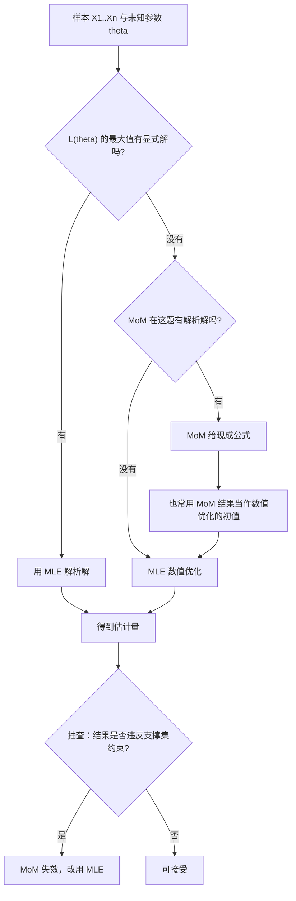

# STA2002 概率与统计 II · 第 3 讲笔记
## Parameter Estimation II（参数估计 II）

> 授课：Zhenxing Guo、Ka Wai Tseng（香港中文大学（深圳）数据科学学院，2026 年 9 月）
> 教材：Hogg, Tanis & Zimmerman (2015) *Probability and Statistical Inference*, 9th ed., Pearson
> 对应教材章节：§6.4（讲义第 2 页明确给出 "Suggested reading: Chapter 6.4"）
> 材料构成：讲义 `Lecture3 - Parameter Estimation II.pdf`（18 页）+ **本讲课堂板书**（**9 张照片、三个时间点**，内容已提炼并入 2.5、2.6、2.7、3.8、3.9、4.6、4.7、5.2、6.1、6.4 各节；**原图已归档到 `img/`，文件清单见 §12**）。**本讲的材料只有讲义与板书**，因此笔记不包含任何超出这两份材料的内容；凡属我补充或复算的部分，均在文末诚实备注中逐条列出。

---

## 0. 本讲地图（先说清楚这一讲在干什么）

第 2 讲我们学会了"怎么把一个参数估出来"，工具是**极大似然估计（Maximum Likelihood Estimation, MLE）**。本讲分三步走，讲义第 2 页把它写得很清楚：

| 讲义原文 | 中文 | 在本讲的地位 |
| --- | --- | --- |
| Continue our discussion on the maximum likelihood estimation method | 继续讨论 MLE | 第 2–3 节：把 MLE 用到二维参数的正态分布上 |
| Introduce the notion of unbiasedness | 引入**无偏性** | 第 3 节：本讲第一个"评价估计量的标准" |
| Introduce another method of parameter estimation called the method of moments (MoM) | 引入另一个估计方法：**矩估计法** | 第 4–7 节：本讲的第二根主线 |

这三件事不是并列的，而是一条递进的逻辑链。**第 2 讲解决了"能不能估"，本讲开始追问"估得好不好"，以及"有没有更省事的估法"。** 讲义第 3 页把这个问题写成了两句话：

> Suppose that we repeat an experiment $n$ times independently to observe the sample $X_1, X_2, \ldots, X_n$. How to estimate the unknown parameter $\theta \in \Omega$ based on the observations $x_1, x_2, \ldots, x_n$? **As the estimators are not unique, how to evaluate different estimators?**

第二句才是本讲真正的转折点。**"估计量不唯一"** 这件事有个直接后果：同一个参数往往能构造出无穷多个估计量，那你凭什么说 $\bar X$ 比 $X_1$ 好？光有 MLE 一个方法不够，我们还需要**判据（criterion）**。本讲给出的第一个判据就是**无偏性（unbiasedness）**——而它的定义（第 5 页）出现的位置非常巧妙：**它紧接着一个 MLE 的例题出现，并且这个例题的结论恰好是"MLE 是有偏的"**。也就是说，本讲不是在真空里讲一个抽象定义，而是先摆出一个 MLE 的"污点"，再用无偏性这个尺子把它量出来。

**与第 2 讲的呼应**：第 2 讲最后停在 Uniform $(0,\theta)$ 上，算出 $\hat\theta = X_{(n)}$ 且 $E[X_{(n)}] = \frac{n}{n+1}\theta$——**MLE 系统性低估了 $\theta$**，但当时没有正式名词来描述这件事。本讲第 5 页给出的"有偏估计量（biased estimator）"，就是给那个现象补上的名字。**第 2 讲留下的悬念，本讲开了个头就接上了。**

到第 4 节话锋一转：MLE 虽然理论上漂亮，但它有个实际的麻烦——**要解 $\max_\theta L(\theta)$，很多时候没有显式解，只能做数值优化**。于是引入了第二个方法：矩估计法（Method of Moments, MoM）。它的思路极其朴素（让"理论矩"等于"样本矩"），代价是丢掉了 MLE 的渐近最优性。第 5–7 节用三个例题（Gamma、Poisson、Uniform）把 MoM 的**强项与软肋**同时展示出来：Poisson 那题它和 MLE 打平但"方差更大"，Uniform 那题它甚至可能给出**根本不合法的解**。

**本讲最值得记住的一处呼应**：Poisson 例题里那个"方差型"的 MoM 估计量 $\tilde\lambda_2 = \frac{1}{n}\sum X_i^2 - (\bar X)^2$，**它恰好就是第 3 节里那个"有偏的样本方差"（除以 $n$ 而不是 $n-1$ 的版本）**，因此它同时继承了 $-\lambda/n$ 的偏差。**第 3 节用正态分布辛辛苦苦算出来的偏差公式，在第 5 节的一个例题里又出现了一次**——这条暗线是整讲最漂亮的地方（详见 5.4 节）。

**板书（三个时间点、共 9 张照片）给本讲补上了五块关键内容**：其一，$N(\theta_1,\theta_2)$ 两个 MLE 的**完整求导过程**（讲义只给结果，见 §2.6 节）；其二，**二阶条件的完整验证——三个二阶偏导与 Hessian 矩阵**（讲义连二阶条件都没做，见 §2.7 节）；其三，**估计量的三个评价标准 Bias / variance / MSE**（本讲讲义只提了 bias；**第 2 讲板书已把这套标准列出来并留作钩子，本讲才真正拿它来评价估计量**，见 §3.8 节）；其四，**MoM 的"两步走"框架与 plug-in 规则**（讲义只写成一排方程，板书拆成了 $h_j$ 与替换两步，见 §4.6 节）；其五，**第四个例题——指数分布 $\exp(\theta)$**（讲义只讲了 Gamma / Poisson / Uniform 三题，见 §6.4 节）。另外 §3.9 节还有一份 $E(\hat\theta_2)$ 的**初等证明**（走的是绕开卡方分布的路子），§4.7 节有 Gamma 例题的**另一种写法**（shape–scale 参数化），§6.1 节有 Uniform 的**指示函数版似然**。

这些内容里最有价值的是**评价标准那一块**——它把"无偏"降格为三个标准中的第一个，并给出 MSE 这个把"准"与"稳"合一的综合尺子，使第 6 节 Uniform 例题里"无偏的 MoM 反而输给有偏的 MLE"这个结论不再显得突兀。

---

## 1. 估得"准不准"：为什么需要一个评价标准

在展开之前，先把一个容易含糊的区分钉死：**估计量（estimator）与估计值（estimate）不是一回事**。

估计量是**随机变量**，写作 $\hat\theta = u(X_1, \ldots, X_n)$——它是一台"机器"，你喂给它一组样本，它吐出一个数。因为样本本身是随机的（换一次实验就换一批数），所以 $\hat\theta$ 也是随机的，它有分布、有期望、有方差。估计值是**一个具体的数**，比如你这台机器吃进今天这 20 个观测，吐出 $5.03$。

**"无偏"这个性质是对估计量说的，不是对估计值说的。** 你手上那一个具体的数无所谓"偏不偏"，有意义的问题是："如果我把这个实验重复无数次，这台机器每次吐出的数平均下来会不会正好等于真值？"

讲义第 3 页的两问正是在这个层次上提问的：

- 第一问"怎么估"——这是第 2 讲（MLE）和本讲第 4 节（MoM）要回答的。
- 第二问"怎么评价"——本讲一共给了**三把尺子**：讲义给了第一把（无偏性 bias），**板书又补上后两把（方差 variance、均方误差 MSE）**，三者在 §3.8 节被写成一张并列清单。此外还有相合性（consistency），它第 2 讲的板书就已列出，但**本讲的板书没有写到它**（见 §3.8 节的差异说明）。

---

## 2. 二维参数的正态分布：把 MLE 用于 $\theta = (\theta_1, \theta_2)$

### 2.1 例题的设定（讲义第 4 页）

讲义第 4 页给出的第一个例题是：

> **Example 1.** Suppose that $X_1, \ldots, X_n \sim N(\theta_1, \theta_2)$. The unknown parameter is two-dimensional $\theta = (\theta_1, \theta_2)$.

这里有个**记号上的坑，必须先讲清楚**。标准写法一般是 $N(\mu, \sigma^2)$，第二个位置放**方差**。讲义这里写 $N(\theta_1, \theta_2)$，第二个位置**也是方差**，即

$$
\theta_1 = \mu \quad(\text{总体均值}), \qquad \theta_2 = \sigma^2 \quad(\text{总体方差}).
$$

**注意 $\theta_2$ 不是标准差 $\sigma$。** 这个选择是为了让后面"方差的无偏估计"这个话题说起来干净（否则满屏 $\theta_2^2$，容易看瞎）。讲义第 4 页同时把**参数空间（parameter space）** 写了出来：

$$
\theta \in \Omega = \{(\theta_1, \theta_2) : -\infty < \theta_1 < \infty,\; 0 < \theta_2 < \infty\}.
$$

参数空间就是"参数允许取值的集合"，这个概念在第 2 讲讲正则条件时出现过。这里的两条约束读作：**均值 $\theta_1$ 可以是任意实数；方差 $\theta_2$ 必须严格大于 0**（方差为 0 意味着数据是常数，没有随机性，那正态密度函数根本写不出来——分母里有 $\sqrt{\theta_2}$）。

### 2.2 似然函数的逐步搭建（讲义第 4 页）

正态分布的密度函数（probability density function, PDF）是

$$
f(x;\theta) = \frac{1}{\sqrt{2\pi\theta_2}}\exp\left[-\frac{(x-\theta_1)^2}{2\theta_2}\right], \qquad -\infty < x < \infty.
$$

逐个符号拆开看：$\sqrt{2\pi\theta_2}$ 是归一化常数，保证密度曲线下的总面积等于 1；$\exp[\cdot]$ 里的 $-\frac{(x-\theta_1)^2}{2\theta_2}$ 是"标准化后的平方距离"，$x$ 离中心 $\theta_1$ 越远这个负值越大，密度越小；$\theta_2$ 在分母上，所以**方差越大，曲线越扁平**。

因为 $X_1, \ldots, X_n$ 独立同分布（independent and identically distributed, i.i.d.），联合密度就是各自密度的连乘，这正是第 2 讲里似然函数的定义：

$$
L(\theta_1, \theta_2) = \prod_{i=1}^{n} f(x_i;\theta) = \left(\frac{1}{\sqrt{2\pi\theta_2}}\right)^{n}\exp\left[-\frac{\sum_{i=1}^{n}(x_i - \theta_1)^2}{2\theta_2}\right].
$$

这里发生了两件事，都值得注意。第一，$\frac{1}{\sqrt{2\pi\theta_2}}$ 被乘了 $n$ 次，所以提成 $n$ 次方（这是 $\prod$ 唯一能作用到常数因子上的方式）。第二，$\exp$ 里面的求和在求和中变成了 $\sum_{i=1}^n$——因为 $e^a \cdot e^b = e^{a+b}$，连乘的指数相加。

讲义第 4 页最后问：**What are the MLE of $\theta_1$ (say $\hat\theta_1$), and $\theta_2$ (say $\hat\theta_2$)?**

### 2.3 本讲直接给出结果，但推导值得自己走一遍

讲义第 6 页直接写 "Recall the MLEs are"，也就是说**推导被当作练习留给学生了**。因为这是第 2 讲三步法（写出 $L$ → 解 $\partial\ell/\partial\theta=0$ → 验二阶条件）的直接应用，我把完整推导补在这里，也顺便演示第 2 讲那套配方在**二维参数**下怎么操作。

先取对数（这一步是第 2 讲强调的：$\ln$ 单调，不改变最大值位置，但把连乘变成求和）：

$$
\ell(\theta_1, \theta_2) = \ln L = -\frac{n}{2}\ln(2\pi) - \frac{n}{2}\ln\theta_2 - \frac{1}{2\theta_2}\sum_{i=1}^{n}(x_i-\theta_1)^2.
$$

**关于 $\theta_1$ 求导**（把 $\theta_2$ 当常数）。$\theta_1$ 只出现在最后一项里，而 $\sum(x_i-\theta_1)^2$ 对 $\theta_1$ 求导需要链式法则：$\frac{\partial}{\partial\theta_1}(x_i-\theta_1)^2 = 2(x_i-\theta_1)\cdot(-1) = -2(x_i-\theta_1)$。于是

$$
\frac{\partial \ell}{\partial \theta_1} = -\frac{1}{2\theta_2}\sum_{i=1}^{n}\left[-2(x_i-\theta_1)\right] = \frac{1}{\theta_2}\sum_{i=1}^{n}(x_i-\theta_1).
$$

令它等于 0。由于 $\theta_2 > 0$ 不可能为 0，只能是 $\sum_{i=1}^n (x_i-\theta_1) = 0$，也就是 $n\bar x = n\theta_1$，解出

$$
\hat\theta_1 = \frac{1}{n}\sum_{i=1}^{n}x_i = \bar x.
$$

**关于 $\theta_2$ 求导**（把 $\theta_1$ 当常数，结果里代入 $\hat\theta_1$）。前两项里 $-\frac{n}{2}\ln\theta_2$ 求导得 $-\frac{n}{2\theta_2}$；最后一项是 $-\frac{1}{2}\left[\sum(x_i-\theta_1)^2\right]\cdot\theta_2^{-1}$，对 $\theta_2$ 求导得 $+\frac{1}{2\theta_2^2}\sum(x_i-\theta_1)^2$。所以

$$
\frac{\partial \ell}{\partial \theta_2} = -\frac{n}{2\theta_2} + \frac{1}{2\theta_2^2}\sum_{i=1}^{n}(x_i-\theta_1)^2.
$$

令它等于 0，两边同乘 $2\theta_2^2$（$\theta_2>0$，乘一个正数不改变等号）：

$$
-n\theta_2 + \sum_{i=1}^{n}(x_i-\theta_1)^2 = 0 \quad\Longrightarrow\quad \hat\theta_2 = \frac{1}{n}\sum_{i=1}^{n}(x_i-\hat\theta_1)^2 = \frac{1}{n}\sum_{i=1}^{n}(x_i-\bar x)^2.
$$

**二阶条件**（第 2 讲的第③步，讲义这里省略了）：$\frac{\partial^2\ell}{\partial\theta_1^2} = -\frac{n}{\theta_2} < 0$；$\frac{\partial^2\ell}{\partial\theta_2^2} = \frac{n}{2\theta_2^2} - \frac{1}{\theta_2^3}\sum(x_i-\theta_1)^2$，代入驻点处 $\sum(x_i-\hat\theta_1)^2 = n\hat\theta_2$ 得 $-\frac{n}{2\theta_2^2} < 0$；交叉偏导 $\frac{\partial^2\ell}{\partial\theta_1\partial\theta_2} = -\frac{1}{\theta_2^2}\sum(x_i-\theta_1)$ 在驻点处恰为 0。所以海森矩阵（Hessian）在此处是对角负定的——这确实是极大值点（事实上在整个 $\Omega$ 上是全局最大）。**这一段的完整版（三个二阶偏导 + 最终的 Hessian 矩阵）见 §2.7 节——那里对照了板书的逐项写法，并做了有限差分核验；板书的结果与这里的推导逐元素一致。**

### 2.4 讲义第 6 页给出的结果与配套工具

讲义把这套结果整理成两行：

$$
\hat\theta_1 = \frac{1}{n}\sum_{i=1}^{n}X_i = \bar X, \qquad
\hat\theta_2 = \frac{1}{n}\sum_{i=1}^{n}(X_i-\bar X)^2 = \frac{n-1}{n}\left(\frac{1}{n-1}\sum_{i=1}^{n}(X_i-\bar X)^2\right) = \frac{n-1}{n}S^2.
$$

注意这里用的是**大写 $X_i$**——讲义在写"估计量"（随机变量），而我在 2.3 节推导里写的是小写 $x_i$（具体的观测值）。严格来说估计量就该用大写，这是统计学的书写惯例。

第二个式子里那个 $\frac{n-1}{n}\cdot\frac{1}{n-1}$ 的拆分是**故意凑出来的**，目的是引出 $S^2$ 的定义：

$$
S^2 \triangleq \frac{1}{n-1}\sum_{i=1}^{n}(X_i-\bar X)^2.
$$

$\triangleq$ 读作"定义为"。**这个 $S^2$ 就是课本上标准的"样本方差（sample variance）"**，分母是 $n-1$ 而不是 $n$。与之相对，$\hat\theta_2 = \frac{1}{n}\sum(X_i-\bar X)^2$ 的分母是 $n$，它是**极大似然估计量**，不是课本定义的那个 $S^2$。**这一个 $n$ 与 $n-1$ 的差别，就是本讲第 3 节全部内容的来源。** 请务必记住：

| 记号 | 定义 | 分母 | 它在讲义里的身份 |
| --- | --- | --- | --- |
| $\hat\theta_2$ | $\frac{1}{n}\sum_{i=1}^n (X_i-\bar X)^2$ | $n$ | 方差**参数的 MLE** |
| $S^2$ | $\frac{1}{n-1}\sum_{i=1}^n (X_i-\bar X)^2$ | $n-1$ | 课本定义的**样本方差** |

两者的关系是一个简单的比例：$\hat\theta_2 = \frac{n-1}{n}S^2$。因为 $\frac{n-1}{n} < 1$，所以**在同一个样本上，$\hat\theta_2$ 永远比 $S^2$ 小一点点**——这已经是"偏差"的蛛丝马迹了。

讲义还"Recall"了两个抽样分布事实（第 6 页）：

$$
\bar X \sim N\!\left(\theta_1,\; \frac{\theta_2}{n}\right), \qquad \frac{(n-1)S^2}{\theta_2} \sim \chi^2(n-1).
$$

第一个式子为什么是 $\theta_2/n$：$\bar X = \frac{1}{n}\sum X_i$ 是独立正态变量的线性组合，仍然是正态；均值自然是 $\theta_1$；方差用独立情形的加法 $\mathrm{Var}\!\left(\frac{1}{n}\sum X_i\right) = \frac{1}{n^2}\sum \theta_2 = \frac{n\theta_2}{n^2} = \frac{\theta_2}{n}$。**样本量越大，$\bar X$ 的方差越小**——这就是"样本均值很稳定"的数学版本。

第二个式子是正态样本的经典结论：标准化后的**离差平方和**（$\frac{(n-1)S^2}{\theta_2}$）服从**自由度为 $n-1$ 的卡方分布（chi-square distribution）**。自由度的 $-1$ 来自"我们用了 $\bar X$ 这个估计量"：$n$ 个离差 $(X_i-\bar X)$ 满足一条恒等式 $\sum(X_i-\bar X)=0$，所以只要知道其中 $n-1$ 个，最后一个就被确定了——**只有 $n-1$ 个"自由的"信息**。

为了用上这个事实，我们还需要卡方分布的两个矩（这两个在第 1 讲的复习里出现过，此处直接用）：

$$
\text{若 } Y \sim \chi^2(\nu) \text{，则 } E[Y] = \nu, \qquad \mathrm{Var}(Y) = 2\nu.
$$

其中 $\nu$ 是自由度（degrees of freedom, df）。

### 2.5 黑板补充：MLE 的通用配方（两分支似然 + 两个条件）

**板书原文**（转写为 LaTeX；板书把 "iid" 写在 $\sim$ 符号的正上方，下方没有画波浪线以外的修饰）：

$$
X_1, \ldots, X_n \overset{iid}{\sim} p(x;\theta), \qquad \text{MLE:}
$$

$$
L(\theta) = \begin{cases}
\displaystyle\prod_{i=1}^{n} p(X_i = x_i;\theta), & \text{离散型（discrete，用 PMF）}\\[8pt]
\displaystyle\prod_{i=1}^{n} f(x_i;\theta), & \text{连续型（continuous，用 PDF）}
\end{cases}
$$

$$
\begin{cases}
\dfrac{\partial \ell(\theta)}{\partial \theta} = 0 \;\Longrightarrow\; \hat\theta \\[14pt]
\left.-\dfrac{\partial^2 \ell(\theta)}{\partial \theta^2}\right\vert_{\theta=\hat\theta} > 0 \qquad \checkmark
\end{cases}
$$

**与讲义的关系**：这一整块是**第 2 讲板书的原样重现**，本讲讲义没有重复它（第 2 讲笔记 §6.3 收录了两分支似然、§7.2 收录了那套解题配方）。**两处写法可以逐项对上**：第 2 讲笔记 §7.2 把这套配方称作"板书版 ①②③"——① 写出 $L(\theta)$、② 解一阶条件得 $\hat\theta$、③ 验二阶条件；本讲板书上面的 $L(\theta)$ 就是 ①，花括号里那两行就是 ②③。它在本讲**开头**出现还说明了课堂的推进方式：**老师把"通用配方"当作第 3 讲的出发点，用它来接下面的二维正态例题**——先给配方，再演示配方在 $k=2$（参数是二维）时怎么用。

**逐条解读**：

第一，那个花括号里的**两分支不是排版讲究，而是支撑集类型的区分**。离散总体用**概率质量函数（probability mass function, PMF）** $p(X_i = x_i;\theta)$——它的自变量是"事件 $X_i$ 恰好等于观测值 $x_i$"；连续总体用**概率密度函数（probability density function, PDF）** $f(x_i;\theta)$——连续情形下单点概率恒为 0，所以只能写密度而非概率。两块板书恰好各用一支：下面的 $N(\theta_1,\theta_2)$ 例题走 PDF 分支；第 2 讲的 Bernoulli、Poisson、Geometric 走 PMF 分支。**这也解释了为什么本讲例题写 $f(x_i;\theta)$、第 2 讲那几题写 $p(X_i=x_i;\theta)$——不是记法随性，而是分布类型不同。**

第二，$\overset{iid}{\sim}$ 这个记号把两件事压在一起：**"i"（independent）** 让联合密度等于边缘密度之积——这就是左边那个连乘 $\prod$ 的**全部合法性来源**；**"d"（identically distributed）** 保证所有 $X_i$ 共用同一个 $\theta$——这就是连乘里每一项的参数都写成同一个 $\theta$ 的原因。**少了任何一条，那个漂亮的连乘都不成立。**

第三，把 $L(\theta)$ 换成 $\ell(\theta)$ 再求导，依据是 $\ln$ 单调（不改变最大值位置）。这一点第 2 讲讲过，这里只强调板书的落笔位置：**两个条件都写在 $\ell$（对数似然）上，而不是直接写在 $L$ 上。**

第四，第二个条件的写法有讲究：它**把负号提到二阶导前面**，于是条件变成"某个量大于 0"，与 **Fisher 信息量** $\mathcal{I}(\theta) = -E[\ell''(\theta)]$ 的形式一致（第 2 讲笔记 §7.2 节讨论过这一点）。**竖线 $\vert_{\theta=\hat\theta}$ 表示"先求二阶导，再把 $\hat\theta$ 代进去"**——这是二阶条件里最容易被漏掉的一步：它检验的不是"$\ell$ 处处是凹的"，而是"$\ell$ 在驻点**这一点**是凹的"。右边那个大对勾是老师画的**验算通过标记**，表示这套配方在这个例题上确实给出极大值。

第五，本笔记 §2.3 节补的二阶条件验证（$\ell''_{\theta_1\theta_1}=-\frac{n}{\theta_2}<0$、$\ell''_{\theta_2\theta_2}=-\frac{n}{2\theta_2^2}<0$、交叉项为 0），**正是板书第二个条件在二维情形下的推广**：一维时看 $-(\ell''|_{\hat\theta})>0$，多维时要看**海森矩阵负定**；本题因为交叉项恰好为 0，海森矩阵退化成两个独立的一元条件，所以逐项验号就够了。

### 2.6 黑板补充：$N(\theta_1,\theta_2)$ 的完整求导（逐行对照）

**板书原文**：

$$
\underline{N(\theta_1,\theta_2)} \;,\quad N(\mu,\sigma^2), \qquad \theta = (\theta_1,\theta_2)^T
$$

$$
X_1, \ldots, X_n \overset{iid}{\sim} N(\theta_1,\theta_2)
$$

$$
L(\theta_1,\theta_2) = \prod_{i=1}^{n} \frac{1}{\sqrt{2\pi\theta_2}}\exp\left\{-\frac{(x_i-\theta_1)^2}{2\theta_2}\right\}
$$

$$
\ell(\theta_1,\theta_2) = -\frac{1}{2\theta_2}\sum_{i=1}^{n}(x_i-\theta_1)^2 \;-\; \frac{n}{2}\log\theta_2 \;-\; \frac{n}{2}\log(2\pi)
$$

$$
\begin{cases}
\dfrac{\partial \ell(\theta_1,\theta_2)}{\partial \theta_1} = \dfrac{\sum_{i=1}^{n}(x_i-\theta_1)}{\theta_2} = 0 \\[16pt]
\dfrac{\partial \ell(\theta_1,\theta_2)}{\partial \theta_2} = \dfrac{\sum_{i=1}^{n}(x_i-\theta_1)^2}{2\theta_2^2} - \dfrac{n}{2\theta_2} = 0
\end{cases}
\qquad\Longrightarrow\qquad
\begin{cases}
\hat\theta_1 = \dfrac{1}{n}\sum_{i=1}^{n}X_i = \bar X \\[12pt]
\hat\theta_2 = \dfrac{1}{n}\sum_{i=1}^{n}(X_i-\bar X)^2
\end{cases}
$$

**与讲义的关系**：这块板书**补上了讲义缺失的全部推导**，性质属于"把讲义只给结果的地方补全过程"。讲义第 4 页只提问 "What are the MLE of $\theta_1$ and $\theta_2$?"，第 6 页直接写 "Recall the MLEs are" 并给出结果，中间一字未写。**板书把从 $L$ 到 $\hat\theta$ 的每一步都写了出来，而且与我在 §2.3 节重建的推导逐符号吻合**（两个偏导的表达式、每项的符号、分母上的 $2\theta_2^2$ 与 $\theta_2$ 都一致）。也就是说，§2.3 节那段原先标注为"讲义未给出、我补全过程"的内容，现在有了板书的直接印证——**这不是巧合，因为第 2 讲的三步法本来就规定了这条唯一的路径。**

**逐条解读**：

**第一行的记号对照值得单独说。** 板书把 $N(\theta_1,\theta_2)$ **划了底划线**，旁边并列写出 $N(\mu,\sigma^2)$——这是在明确宣告：**本课用 $\theta_1,\theta_2$ 这套记号，$\theta_1$ 顶替 $\mu$、$\theta_2$ 顶替 $\sigma^2$。** 这个并列写法正好回答了 §2.1 节提醒的那个坑（$\theta_2$ 是**方差**不是标准差）。另外板书写的是 $\theta = (\theta_1,\theta_2)^T$，**带转置符号 $T$**，明确把参数当作列向量；讲义第 4 页只写 $(\theta_1,\theta_2)$。这个 $T$ 不是装饰——它提醒我们参数是 $2\times1$ 的向量，所以求导要以**偏导方程组**的形式进行，二阶条件要看 $2\times2$ 的海森矩阵。

**第二行** $X_1,\ldots,X_n \overset{iid}{\sim} N(\theta_1,\theta_2)$ 是把 §2.5 节的通用设定具体化到正态分布上，一行完成"模型假设"的交代。

**第三行的似然函数**：$\frac{1}{\sqrt{2\pi\theta_2}}$ 出现 $n$ 次，板书用 $\prod_{i=1}^n$ 逐项写着；指数部分 $e^{-\frac{(x_i-\theta_1)^2}{2\theta_2}}$ 连乘后指数相加，合并成 $\exp\{-\frac{\sum(x_i-\theta_1)^2}{2\theta_2}\}$。（讲义第 4 页把它压缩成 $\left(\frac{1}{\sqrt{2\pi\theta_2}}\right)^n$，两者是同一个东西。）

**第四行取对数是全题计算量最大的化简，而板书的项顺序与讲义不同**。板书是

$$
-\frac{1}{2\theta_2}\sum(x_i-\theta_1)^2 \;-\; \frac{n}{2}\log\theta_2 \;-\; \frac{n}{2}\log(2\pi),
$$

而 §2.3 节按讲义顺序写成 $-\frac{n}{2}\ln(2\pi) - \frac{n}{2}\ln\theta_2 - \frac{1}{2\theta_2}\sum(\cdot)$。**两者完全等价，但板书的排列更有算计**：它把"含 $\theta_1$ 的那一项"摆在最前面，于是下一步对 $\theta_1$ 求导时，一眼就能看出只有第一项起作用，后两项（都不含 $\theta_1$）导数直接为 0。**这是板书比讲义好读的地方。**

这里还有一个记号细节：**板书写 $\log$ 而不是 $\ln$**。数学文献里 $\log$ 默认就是自然对数（统计学几乎从不使用以 10 为底的对数），所以板书的 $\log\theta_2$ 与我们写的 $\ln\theta_2$ **是同一个东西，看到 $\log$ 不必换算**。另外最后一项 $-\frac{n}{2}\log(2\pi)$ 与 $\theta$ 完全无关，在整个求导过程中都是常数，**求导时可以完全无视**——它唯一的用处是把 $L$ 的尺度摆正，使得 $L$ 是真正的联合密度而不是差一个常数倍。

**第五行是"两个偏导分别置零"**，注意它们是**联立的**（画在同一个花括号里），因为两个方程都要用 $\hat\theta_1=\bar x$ 才能解开 $\hat\theta_2$。

对 $\theta_1$：只有第一项含 $\theta_1$，由链式法则 $\frac{\partial}{\partial\theta_1}\left[-\frac{1}{2\theta_2}\sum(x_i-\theta_1)^2\right] = -\frac{1}{2\theta_2}\sum 2(x_i-\theta_1)\cdot(-1) = +\frac{1}{\theta_2}\sum(x_i-\theta_1)$，**与板书完全一致，而且结果是正号**（内层导数 $(-1)$ 与外层负号相互抵消，这是最容易抄错符号的一步）。置零后由于 $\theta_2>0$ 不可能为 0，只能有 $\sum(x_i-\theta_1)=0$，即 $n\bar x = n\theta_1$，于是 $\hat\theta_1=\bar x$。

对 $\theta_2$：这里要对 $\theta_2$ 本身求导，用到 $\frac{d}{d\theta_2}\left(\frac{1}{\theta_2}\right) = -\frac{1}{\theta_2^2}$ 与 $\frac{d}{d\theta_2}\log\theta_2 = \frac{1}{\theta_2}$。第一项把 $-\frac{1}{2}\sum(\cdot)$ 当常数乘 $\theta_2^{-1}$，导数为 $+\frac{1}{2\theta_2^2}\sum(x_i-\theta_1)^2$；第二项导数为 $-\frac{n}{2\theta_2}$。合起来正是板书的

$$
\frac{\sum_{i=1}^{n}(x_i-\theta_1)^2}{2\theta_2^2} - \frac{n}{2\theta_2} = 0.
$$

**这个方程其实可以解得非常干净**：两边同乘 $2\theta_2^2$（$\theta_2>0$，乘正数不改等号）得 $\sum(x_i-\theta_1)^2 - n\theta_2 = 0$，即 $\hat\theta_2 = \frac{1}{n}\sum(x_i-\hat\theta_1)^2$。**板书保留的是化简前的形式**，所以看起来比需要的长；但保留原式有个好处——它把"分母上的 $2\theta_2^2$ 是从哪来的"留在纸上，而不是一步跳到答案。**自学时建议自己补上"同乘 $2\theta_2^2$"这一步**，否则容易觉得这两个方程解不开。

**第六行 $\Rightarrow$ 后面就是结果**：$\hat\theta_1=\bar X$、$\hat\theta_2=\frac{1}{n}\sum(X_i-\bar X)^2$。注意**这里从 $x_i$ 换回了 $X_i$**（板书自己做了这个切换）——因为这两个量已经从"在给定数据下解出的数"变成了"依赖于样本的估计量"，也就是从**估计值**升格成了**估计量**（§1 节强调过的区分）。**板书这个大小写切换是有意的**，讲义第 4 页与第 6 页在做同一件事。

**与下一节的衔接**：板书第 1 块的**右半部分**紧接着给出了对 $\hat\theta_1$ 与 $\hat\theta_2$ 的**评价标准**——Bias、variance、MSE（见 §3.8 节）。**也就是说，两块板合起来把"配方 → 例题 → 评价"连成了一条线**：§2.5 给配方，§2.6 用它解出两个 MLE，§3.8 立刻问"这两个估计量好不好"。这就是整堂课的推进逻辑。

### 2.7 黑板补充：二阶条件的完整验证（三个二阶偏导 + Hessian 矩阵）

**板书原文**（位于板书第 2 块的右半，紧邻"MLE 结果"那一行的右侧）：

$$
-\frac{\partial^2\ell(\theta)}{\partial\theta\,\partial\theta^T} = -\begin{pmatrix}
\dfrac{\partial^2\ell(\theta)}{\partial\theta_1^2} & \dfrac{\partial^2\ell(\theta)}{\partial\theta_1\partial\theta_2}\\[14pt]
\dfrac{\partial^2\ell(\theta)}{\partial\theta_2\partial\theta_1} & \dfrac{\partial^2\ell(\theta)}{\partial\theta_2^2}
\end{pmatrix}
\;\longrightarrow\; \text{Hessian}
$$

$$
\begin{cases}
\dfrac{\partial^2\ell}{\partial\theta_1^2} = -\dfrac{n}{\theta_2}\\[16pt]
\dfrac{\partial^2\ell}{\partial\theta_2\partial\theta_1} = -\dfrac{\sum_{i=1}^{n}(x_i-\theta_1)}{\theta_2^2} = -\dfrac{n(\bar x-\theta_1)}{\theta_2^2}\\[16pt]
\dfrac{\partial^2\ell}{\partial\theta_2^2} = -\dfrac{\sum_{i=1}^{n}(x_i-\theta_1)^2}{\theta_2^3} + \dfrac{n}{2\theta_2^2}
\end{cases}
\qquad\Longrightarrow\qquad
-\frac{\partial^2\ell}{\partial\theta\,\partial\theta^T}\bigg|_{\theta=\hat\theta} =
\begin{pmatrix}
\dfrac{n}{\hat\theta_2} & 0\\[16pt]
0 & \dfrac{n}{2\hat\theta_2^{\,2}}
\end{pmatrix} > 0
$$

**与讲义的关系**：讲义**完全没有做二阶条件的检验**——第 4–7 页只走了"求一阶导 → 解出 $\hat\theta_1,\hat\theta_2$ → 算期望"这一条路。板书补上了第 2 讲三板斧的第 ③ 步，并且把它推广到二维。**这是 §2.3 节我口头断言"海森矩阵对角负定"的精确版本**，板书给出的矩阵与我的推导在每一个元素上都一致（数值核验见本节末）。

**逐条解读**：

**第一，为什么写成 $-\frac{\partial^2\ell}{\partial\theta\,\partial\theta^T}$ 而不是直接写 $\frac{\partial^2\ell}{\partial\theta\,\partial\theta^T}$？** 因为一维时板书写的是 $\left.-\frac{\partial^2\ell(\theta)}{\partial\theta^2}\right|_{\hat\theta}>0$（§2.5 节），二维要沿用同一个写法，于是让"**负号 + 二阶导矩阵 $>0$**"这个形式原样保留。这里的"矩阵 $>0$"意思是**正定（positive definite）**，即对任意非零向量 $v$ 都有 $v^{\mathsf T}Mv>0$。**一维时"正定"退化成"那个数大于 0"**，所以两处写法本就是同一个东西，只是维度不同。

**第二，分母里那个 $\partial\theta^T$ 是约定俗成的记号**：它表示这个矩阵的第 $(i,j)$ 个元素是 $\frac{\partial^2\ell}{\partial\theta_i\,\partial\theta_j}$。由于混合偏导与求导次序无关（$\frac{\partial^2\ell}{\partial\theta_1\partial\theta_2}=\frac{\partial^2\ell}{\partial\theta_2\partial\theta_1}$），这个矩阵**必然对称**，所以其实只要算**三个**量就够了（对角线两个 + 上三角一个）——板书的那个花括号正好列了三行。

**第三，三个二阶偏导逐个看。** 记 $\ell = -\frac{1}{2\theta_2}\sum_{i=1}^n(x_i-\theta_1)^2 - \frac{n}{2}\log\theta_2 - \frac{n}{2}\log(2\pi)$（§2.6 节的顺序）：

- $\dfrac{\partial^2\ell}{\partial\theta_1^2} = -\dfrac{n}{\theta_2}$。对 $\theta_1$ 求两次导，只有第一项含 $\theta_1$：$\sum(x_i-\theta_1)^2$ 求两次导得 $2n$（每个 $(x_i-\theta_1)^2$ 贡献 2），再乘前面的 $-\frac{1}{2\theta_2}$ 就是 $-\frac{n}{\theta_2}$。**注意它与 $\theta_1$ 无关，是个常数**——这个性质在后面代入 $\hat\theta$ 时很省事。
- $\dfrac{\partial^2\ell}{\partial\theta_2\partial\theta_1} = -\dfrac{\sum_{i=1}^{n}(x_i-\theta_1)}{\theta_2^2} = -\dfrac{n(\bar x-\theta_1)}{\theta_2^2}$。做法是先把 $\frac{\partial\ell}{\partial\theta_1}=\frac{\sum(x_i-\theta_1)}{\theta_2}$（§2.6 节的结果）再对 $\theta_2$ 求一次导：$\frac{1}{\theta_2}$ 的导数是 $-\frac{1}{\theta_2^2}$，于是带上**负号**；再把 $\sum(x_i-\theta_1)=n(\bar x-\theta_1)$ 代进去得到第二种写法。**这个负号很容易抄漏**——我放大到 4 倍后才确认板书写的是带负号的版本。不过它不影响结论，因为**在驻点处 $\bar x=\hat\theta_1=\theta_1$，整个量恰好为 0**。
- $\dfrac{\partial^2\ell}{\partial\theta_2^2} = -\dfrac{\sum_{i=1}^{n}(x_i-\theta_1)^2}{\theta_2^3} + \dfrac{n}{2\theta_2^2}$。**这一项最容易错，因为它是两项相减**：第一项来自 $-\frac{1}{2\theta_2}\sum(x_i-\theta_1)^2$，把 $\theta_2^{-1}$ 求两次导得 $(-1)(-2)\theta_2^{-3}=2\theta_2^{-3}$，再乘 $-\frac{1}{2}\sum(\cdot)$ 得 $-\frac{\sum(x_i-\theta_1)^2}{\theta_2^3}$；第二项来自 $-\frac{n}{2}\log\theta_2$，先求一次导得 $-\frac{n}{2\theta_2}$，再求一次得 $+\frac{n}{2\theta_2^2}$。**两项符号相反，千万别合并成一项。**

**第四，把 $\hat\theta$ 代进去，三项全部变干净**：

- $-\dfrac{\partial^2\ell}{\partial\theta_1^2} = \dfrac{n}{\hat\theta_2}$，把负号翻过来即可（因为第一项是常数）。
- 交叉项：$\bar x=\hat\theta_1$ 让分子为 0，所以 $-\dfrac{\partial^2\ell}{\partial\theta_2\partial\theta_1}=0$。
- $-\dfrac{\partial^2\ell}{\partial\theta_2^2}$：代入驻点处的 $\sum_{i=1}^{n}(x_i-\hat\theta_1)^2 = n\hat\theta_2$（**这正是 $\hat\theta_2$ 的定义本身**），得

$$
-\left[-\frac{n\hat\theta_2}{\hat\theta_2^{3}}+\frac{n}{2\hat\theta_2^{2}}\right] = \frac{n}{\hat\theta_2^{2}} - \frac{n}{2\hat\theta_2^{2}} = \frac{n}{2\hat\theta_2^{\,2}}.
$$

于是得到了板书那个**对角矩阵**，对角线上两个元素都为正。**对角矩阵正定的充要条件就是对角元全为正**（对角矩阵的特征值就是它的对角元），所以该矩阵 $>0$ 成立，$\hat\theta$ 确实是 $\ell$ 的极大值点。这就是 §2.3 节那句"海森矩阵在此处对角负定"的完整交代。

**第五，交叉项为 0 这件事比它看起来更重要。** 它说明**两个参数的估计在二阶意义下是"解耦"的**——$\hat\theta_1$ 的估计偏差不会通过二阶项传给 $\hat\theta_2$。这不只是本题的巧合，而是正态分布属于**指数族（exponential family）**且参数取自然参数化时的一般性质。第 2 讲笔记 §7.2 节提到"多参数时二阶条件要换成海森矩阵负定"，**这里就是那个说法的第一个具体例子**。

**数值核验（我做的）**：用有限差分验证板书那三个二阶偏导表达式。取 $\theta_1=0.7$、$\theta_2=3.2$（一个**非驻点**的普通位置）与一组 $n=8$ 的样本：

| 量 | 解析式（板书给的） | 有限差分数值 |
| --- | --- | --- |
| $\frac{\partial^2\ell}{\partial\theta_1^2}$ | $-2.500000$ | $-2.500009$ |
| $\frac{\partial^2\ell}{\partial\theta_2^2}$ | $-0.178977$ | $-0.178986$ |
| $\frac{\partial^2\ell}{\partial\theta_2\partial\theta_1}$ | $+0.169550$ | $+0.169553$ |

三者一致（差值落在 $10^{-5}$ 量级，正是有限差分本身的精度）。再在**驻点**处核验：数值算出的 $-\frac{\partial^2\ell}{\partial\theta_1^2}=3.499575$ 与板书的 $\frac{n}{\hat\theta_2}=3.499575$ **完全相同**；$-\frac{\partial^2\ell}{\partial\theta_2^2}=0.765439$ 与 $\frac{n}{2\hat\theta_2^{\,2}}=0.765439$ **完全相同**；交叉项为 $-8.5\times10^{-17}$，即机器精度下的 0。**板书完全正确。**

---

## 3. 无偏估计量（Unbiased Estimator）

### 3.1 定义（讲义第 5 页）

> **Definition.** An estimator $u(X_1, X_2, \ldots, X_n)$ of $\theta$ is an **unbiased estimator** of $\theta$ if
> $$E\big(u(X_1,X_2,\ldots,X_n)\big) = \theta.$$
> Otherwise, $u(X_1, X_2, \ldots, X_n)$ is called a **biased estimator**.

逐字解读。$u(\cdot)$ 是"构造估计量的那个函数"——比如 $u(X_1,\ldots,X_n) = \frac{1}{n}\sum X_i$ 就定义了 $\bar X$ 这个估计量。$E[\cdot]$ 是**对所有可能的样本求期望**，也就是"把实验重复无数次、每次算一个估计值、再取平均"。定义说：**如果这个长期平均恰好落在真值 $\theta$ 上，就叫无偏；否则叫有偏。**

用打靶的比喻会很直观（但要小心这个类比的边界）：把 $\theta$ 想成靶心，每个估计值是一次落点。无偏意味着**弹着点整体以靶心为中心**——但注意，它完全没说弹着点分散不分散，也没说每一次射击都准。**"无偏"只保证"平均准"，不保证"每次都准"**（这句话在第 6 节会被 Poisson 例子打脸式地验证：无偏的 MoM 估计量方差大到离谱）。

反过来，"有偏"也不是骂人的话。$E[\hat\theta] - \theta$ 叫做**偏差（bias）**，它可以是正的也可以是负的。第 2 讲里 $E[X_{(n)}] = \frac{n}{n+1}\theta$ 就是**负偏差**（系统性低估）——所谓"系统性"，意思是这个错不是随机的上下跳动，而是**每次平均都会偏的那一边**，重复实验再多也校正不掉。

### 3.2 任务：检验这个正态例子里的两个 MLE（讲义第 5–7 页）

讲义第 5 页把任务写得很明确：

> **Task:** To check that $\hat\theta_1$ is an unbiased estimator of $\theta_1$, and $\hat\theta_2$ is a biased estimator of $\theta_2$.

也就是要验两件事：**均值的 MLE 无偏，方差的 MLE 有偏**。第 6 页给了 $\hat\theta_1, \hat\theta_2, \bar X$ 的分布、$S^2$ 与卡方的关系，第 7 页则是三行核心计算。

### 3.3 第一件事：$\hat\theta_1 = \bar X$ 是 $\theta_1$ 的无偏估计

$$
E(\hat\theta_1) = E(\bar X) = \theta_1.
$$

这一步几乎不用算，因为第 6 页已经告诉我们 $\bar X \sim N(\theta_1, \theta_2/n)$，而**正态分布的第一个参数就是它的均值**，所以 $\bar X$ 的期望直接读出来就是 $\theta_1$。如果要硬算，就是期望的线性性：

$$
E(\bar X) = E\!\left(\frac{1}{n}\sum_{i=1}^{n}X_i\right) = \frac{1}{n}\sum_{i=1}^{n}E(X_i) = \frac{1}{n}\cdot n\theta_1 = \theta_1.
$$

这里只用到 $E(X_i) = \theta_1$，**根本不需要独立性，也不需要正态性**。这是一个通用结论：**只要样本的总体均值存在，样本均值就是总体均值的无偏估计量**——不论总体是什么分布。这解释了为什么 $\bar X$ 到处都在用。

### 3.4 第二件事：$S^2$ 是 $\theta_2$ 的无偏估计

讲义第 7 页的这一步是整页最需要"翻译"的地方：

$$
E(S^2) = \theta_2 \cdot \frac{1}{n-1}E\!\left(\frac{(n-1)S^2}{\theta_2}\right) = \theta_2.
$$

它看起来像在绕圈子，其实是一个**很标准的"提取已知量"技巧**。拆成三步看就清楚了：

第一步，把 $S^2$ 和已知分布的那个量对齐。我们知道 $\frac{(n-1)S^2}{\theta_2} \sim \chi^2(n-1)$，所以想把这个量"凑"出来，于是在 $S^2$ 前面乘上 $\frac{\theta_2}{n-1}$ 再乘上它的倒数：

$$
S^2 = \frac{\theta_2}{n-1}\cdot \frac{(n-1)S^2}{\theta_2}.
$$

第二步，两边取期望。$\frac{\theta_2}{n-1}$ 是常数（不含随机变量），可以提到期望外面：

$$
E(S^2) = \frac{\theta_2}{n-1}\,E\!\left(\frac{(n-1)S^2}{\theta_2}\right).
$$

第三步，代入卡方分布的期望（自由度 $\nu = n-1$，所以期望就是 $n-1$）：

$$
E(S^2) = \frac{\theta_2}{n-1}\cdot(n-1) = \theta_2.
$$

**$(n-1)$ 被干净地约掉了——这正是分母为什么取 $n-1$ 而不是 $n$ 的全部理由。** 分母取 $n-1$ 就是为了让这个卡方分布的期望（$n-1$）在约分后刚好剩下 $\theta_2$。

> **板书给了同一条结论的"第二把钥匙"**：上面这条路依赖卡方分布（正态分布专属的结论）。**板书完全不用卡方分布**，只用一个代数恒等式加上 $\mathrm{Var}(X_i)=\theta_2$、$\mathrm{Var}(\bar X)=\theta_2/n$ 就拿到了同一个 $E(\hat\theta_2)=\frac{n-1}{n}\theta_2$。两条路线并列看非常值得，见 §3.9 节。

### 3.5 第三件事：$\hat\theta_2$ 是 $\theta_2$ 的有偏估计

$$
E(\hat\theta_2) = \frac{n-1}{n}E(S^2) = \frac{n-1}{n}\theta_2.
$$

因为 $\hat\theta_2 = \frac{n-1}{n}S^2$（2.4 节的关系），把常数提出来再代入 3.4 节的结果即可。于是**偏差**是

$$
\mathrm{Bias}(\hat\theta_2) = E(\hat\theta_2) - \theta_2 = \frac{n-1}{n}\theta_2 - \theta_2 = -\frac{\theta_2}{n}.
$$

这个结果值得反复咀嚼。

第一，**偏差是负的**，说明 MLE **系统性地低估方差**。直觉上很好理解：MLE 把离差平方和除以 $n$，但离差 $(X_i-\bar X)$ 是**围绕样本均值**算的，而样本均值本身是往数据重心那里靠的（它把数据"吸"向自己），所以离差平方和被"人为压小"了——用 $n$ 当分母当然就偏小，必须用 $n-1$ 补偿回来。

第二，**偏差的量级是 $1/n$**。当 $n \to \infty$ 时 $-\theta_2/n \to 0$，所以 $\hat\theta_2$ 是**渐近无偏（asymptotically unbiased）** 的。这正好呼应第 2 讲"支撑定理"那一段的基调：**MLE 的优良性质大多是渐近的**，有限样本下它完全可能有偏。小样本（比如 $n=5$）时 $\frac{n-1}{n} = 0.8$，MLE 会把真实方差砍掉 20%，这可不是小事。**板书把这一步单独写成了一条结论并起了英文名字**（"$\hat\theta_2$ is Asymptotically Unbiased"），见 §3.9 节。

第三，**这个结果和第 2 讲的 Uniform 例子是同一族现象**。第 2 讲算出 Uniform $(0,\theta)$ 的 MLE $\hat\theta = X_{(n)}$ 有 $E[X_{(n)}] = \frac{n}{n+1}\theta$，偏差 $-\frac{\theta}{n+1}$；本讲算出正态方差的 MLE 偏差 $-\frac{\theta_2}{n}$。**两个偏差都长成"因子是 $n$ 与 $n\pm1$ 的比、量级是 $1/n$"的样子**——这是因为两者的机理本质相同：都因为"用样本去替代了某个未知量"而损失了一点点信息。注意两者的**方向不同**（Uniform 是 $n/(n+1) < 1$，正态方差是 $(n-1)/n < 1$，**都是小于 1 的因子，都是低估**），而修正因子分别是 $\frac{n+1}{n}$ 和 $\frac{n}{n-1}$——因为一个损失的是"最大值以上的空间"，一个损失的是"一个自由度"。

### 3.6 数值验证

我用 Python 独立模拟验证了 3.5 节的公式。取 $n = 8$、$\theta_2 = 4$，重复 $200{,}000$ 次：

| 统计量 | 模拟值（200,000 次平均） | 理论值 |
| --- | --- | --- |
| $E[S^2]$ | $4.00015$ | $\theta_2 = 4$ |
| $E[\hat\theta_2] = \frac{7}{8}E[S^2]$ | $3.50013$ | $\frac{n-1}{n}\theta_2 = 3.5$ |
| 偏差 | $-0.49987$ | $-\theta_2/n = -0.5$ |

三个数都对上了。（$E[S^2]$ 多出 $1.5\times10^{-4}$ 属于蒙特卡洛噪声，标准误约 $5\times10^{-4}$。）

### 3.7 两点补充说明（讲义未提，我补的）

**其一，无偏不能唯一定义一个估计量，"无偏"是个很弱的条件。** 定义只说 $E[u] = \theta$，满足它的 $u$ 有无穷多个。就以本讲的正态例子来说，$X_1$（只用第一个观测）也是 $\theta_1$ 的无偏估计，$\frac{X_1+X_2}{2}$ 也是，甚至 $\bar X$ 加一个均值为 0 的噪声也是。**所以"无偏"本身不是选择估计量的充分理由**——它必须和方差一起看（**板书 §3.8 节已经把 variance 与 MSE 列成了并列的评价标准，MSE 正是"偏差 + 方差"的合成**）。本次例题里 $S^2$ 之所以被选为 $\theta_2$ 的估计量，不只是因为无偏，还因为它的方差在所有无偏估计量里也比较小。

**其二，无偏性在非线性变换下会被破坏。** 我们知道 $E[S^2] = \theta_2$，那 $S = \sqrt{S^2}$ 是不是 $\sigma = \sqrt{\theta_2}$ 的无偏估计？**不是。** 因为期望不能和平方根交换：一般来说 $E[\sqrt{Y}] \ne \sqrt{E[Y]}$（这是 Jensen 不等式）。我模拟验了一下：$n=8$、$\sigma = 2$ 时，$E[S] = 1.92911$，比真值 2.0 低约 $3.5\%$——**$S$ 系统性低估标准差**。这个"$S^2$ 无偏但 $S$ 有偏"的经典现象说明：**无偏性不是一个可以随便传递的性质**。顺带一提，这也解释了为什么统计教材在讨论方差时偏爱 $S^2$ 而不是 $S$，以及为什么 MLE 的不变性（invariance）只保证"参数的函数"是"参数估计的函数"，而不保证无偏性。

### 3.8 黑板补充：估计量的三个评价标准（Bias / variance / MSE）

**板书原文**（位于板书第 1 块的**右半部分**，与左半的 MLE 配方并排）：

$$
\hat\theta = \hat\theta(X_1, \ldots, X_n) \qquad \text{estimator}
$$

$$
X_i = x_i, \quad i = 1, \ldots, n
$$

$$
\begin{aligned}
\text{Bias} &: \quad E(\hat\theta) \;\overset{?}{=}\; \theta \\
\text{variance} &: \quad \mathrm{Var}(\hat\theta) \\
\text{MSE} &: \quad \mathrm{Var}(\hat\theta) + \left[\mathrm{bias}(\hat\theta)\right]^2
\end{aligned}
$$

**与讲义的关系**：这一块是**本讲讲义完全没有的**，而且它对理解整讲的结构很关键。讲义第 2 页只说要 "evaluate different estimators"（评价不同的估计量），第 5 页只给了 bias 一个标准；**是板书把后两个标准补上了，并且把三者写成了一个层次分明的清单。**

**但它不是凭空出现的——第 2 讲的板书就已经列过一遍。** 第 2 讲笔记 §5.4 节记录了同一套标准更早的版本：板书写下 `Estimator / Estimate / Criteria`，`Criteria` 后面跟的是 **Unbiased、Consistent** 两个名字，然后把 Bias、Var、MSE 三个量逐一定义，并在末尾明确写着"**真正的『用它们比较估计量』是下一讲（第 3 讲）的主题**"。所以这块板书是**跨两讲的同一条线**，本讲只是把它从"介绍"推进到"拿来用"：

| | 第 2 讲板书（见第 2 讲笔记 §5.4） | 第 3 讲板书（本讲） |
| --- | --- | --- |
| 列出的标准 | Unbiased、**Consistent** 两个名字 + Bias / Var / MSE 三个量 | **Bias / variance / MSE** 三个量 |
| 定位 | 介绍性——目标是"看到这些符号不陌生" | 操作性——解完 MLE 立刻用它评价 |
| 是否含相合性 | **有** | **没有** |

> **一处必须点明的差异**：第 2 讲板书的清单里有**相合性（Consistency）**，而本讲的板书只写到 Bias / variance / MSE 三行，**没有 Consistency**。可能的解释有三种：① 相合性第 2 讲已讲过，本讲不重复（板面也写不下了）；② 本讲稍后另起一块板再写；③ 本节确实只讲这三个。**单凭这一次记录的板书无法判断，我按"板书上写了什么就记什么"如实记录，不替课堂补全。** 如果你需要相合性，**第 2 讲笔记 §5.4.4 已经把它的定义（$\lim_{n\to\infty}\Pr(\lvert\hat\theta-\theta\rvert>\varepsilon)=0$）、它与无偏/方差的层次关系（有限样本 vs 渐近）、以及两个反例（无偏不相合、相合不必无偏）都写全了，可以直接沿用。**

**逐条解读**：

第一行 $\hat\theta = \hat\theta(X_1,\ldots,X_n)$，后面跟一个英文词 "estimator"。这一行是**先把"估计量"这个概念钉死**：$\hat\theta$ **不是一个数，而是一个函数**——把 $n$ 个样本喂进去，吐出一个数。这正是 §1 节反复强调的"估计量 vs 估计值"的区分，板书把它写成了函数记号。

第二行 $X_i = x_i,\ i=1,\ldots,n$，是在说"**现在把随机变量换成实际观测到的数**"。$X_i$ 是随机的（大写），$x_i$ 是观测到的具体值（小写）。**这两行连起来，把 §1 节那个区分的两个半边都补齐了**——上一行给随机变量形态（用来谈期望与方差），这一行给数值形态（用来算具体答案）。**这正好解释了讲义的例题为什么一会儿写大写 $X_i$、一会儿写小写 $x_i$：那不是笔误，而是有意的**（我在原稿里把这一点列为疑点，现在可以撤销了；板书本身就并列给出了两种写法）。

第三行起是三个评价标准，**这是本讲最实用的一张清单**：

- **Bias**：板书写成 $E(\hat\theta) \overset{?}{=} \theta$。注意那个**问号写在等号正上方**——这是把"无偏性"写成了一道**待检验的问题**："$\hat\theta$ 的期望到底等不等于 $\theta$？"讲义第 5 页给的是**断言式的定义**（"if $E[u]=\theta$，则称无偏"），板书给的是**判据式的提问**。两者指向同一件事，但板书的问法更好操作：拿到任何一个估计量，先问这一句就能判断。
- **variance**：$\mathrm{Var}(\hat\theta)$——衡量估计量"稳不稳"，即它在真值附近波动多大。
- **MSE**：$\mathrm{Var}(\hat\theta) + [\mathrm{bias}(\hat\theta)]^2$。

**MSE 这一行是本块板书最重要的信息，必须重点说明。** 它把前两个标准合成了一把尺子：方差衡量"稳不稳"，偏差衡量"准不准"，而 **MSE（均方误差，Mean Squared Error）是这两者之和**——它直接衡量"估计值离真值有多远（取平方平均）"。

关于 MSE 的来历（讲义与板书都没给推导，我补两行——**这一段与第 2 讲笔记 §5.4.3 重叠，那里已经用"加一项减一项"完整推过同一个恒等式，可以对照着看**）：设 $\hat\theta$ 是 $\theta$ 的估计量，则

$$
\mathrm{MSE}(\hat\theta) = E\left[(\hat\theta-\theta)^2\right] = E\left[\big(\underbrace{(\hat\theta - E[\hat\theta])}_{\text{随机波动}} + \underbrace{(E[\hat\theta]-\theta)}_{\text{系统性偏差}}\big)^2\right] = \mathrm{Var}(\hat\theta) + \left[\mathrm{Bias}(\hat\theta)\right]^2,
$$

中间展开后那个交叉项 $2(E[\hat\theta]-\theta)\cdot E[\hat\theta-E[\hat\theta]]$ 因为 $E[\hat\theta-E[\hat\theta]]=0$ 而**整项消失**，于是只剩方差与偏差的平方。**所以板书那个"方差 + 偏差平方"不是一条额外的定义，而是一个两行就能推出来的恒等式**——方差与偏差这两个概念之所以能合成 MSE，靠的就是"期望的线性性"这一点小代数。

**为什么这三行的次序很重要**：它等于当场宣布了**"无偏只是第一关"**。§3.7 节刚刚说明无偏是个很弱的条件（既不唯一、也不传递），板书紧接着把 variance 和 MSE 列在后面，意思很清楚：**光无偏不够，还要看散度；两样都要看，就看 MSE。** 这正好解释了第 6 节 Uniform 例题里那个"无偏的 MoM 却输给有偏的 MLE"的结果为什么不矛盾——**它是在 MSE 这把尺子下输的**（见 §6.3 节）。**板书的 MSE 一行，相当于给 §6.3 节那个反直觉结论提前发了许可证。**

**最后一点记号上的观察**：板书把 MSE 写成 $\mathrm{Var}(\hat\theta) + [\mathrm{bias}(\hat\theta)]^2$，其中 bias 用的是**小写 + 括号**的形式，而不是每次展开成 $E(\hat\theta)-\theta$。这说明板书倾向于把 bias 也当作一个**记号**来用（和 variance、MSE 并列），而不是一个需要随时展开的表达式。本笔记全篇用的是 $\mathrm{Bias}(\hat\theta) = E(\hat\theta)-\theta$，与板书那个 $\mathrm{bias}(\hat\theta)$ 是同一个量。

### 3.9 黑板补充：$E(\hat\theta_2)$ 的初等证明路线（绕开卡方分布）

**板书原文**（位于板书第 2 块的右侧，即 Hessian 的右下方；右上角另有单独的两行）：

$$
E(\hat\theta_1) = E(\bar X) = E(X_1) = \theta_1, \qquad \text{unbiased}
$$

$$
E(\hat\theta_2) = E\left\{\frac{1}{n}\sum_{i=1}^{n}(X_i-\bar X)^2\right\},
\qquad
\mathrm{bias}(\hat\theta_2) = E(\hat\theta_2)-\theta_2 = -\frac{1}{n}\theta_2 \ne 0
$$

$$
\begin{aligned}
&= \frac{1}{n}E\left\{\sum_{i=1}^{n}(X_i-\theta_1)^2 - n(\bar X-\theta_1)^2\right\}\\[6pt]
&= \frac{1}{n}\left\{\sum_{i=1}^{n}E(X_i-\theta_1)^2 - nE(\bar X-\theta_1)^2\right\}\\[6pt]
&= \frac{1}{n}\left\{n\theta_2 - \theta_2\right\} = \frac{n-1}{n}\theta_2, \qquad \text{biased}
\end{aligned}
$$

右上角单独写的两行：

$$
S^2 = \frac{1}{n-1}\sum_{i=1}^{n}(X_i-\bar X)^2, \qquad E(S^2) = \theta_2
$$

$$
n \to +\infty,\quad -\frac{1}{n}\theta_2 \to 0 \qquad\Longrightarrow\qquad \hat\theta_2 \text{ is Asymptotically Unbiased.}
$$

**与讲义的关系**：这一段与讲义第 5–7 页做的是**同一件事**（验证 $\hat\theta_1$ 无偏、$\hat\theta_2$ 有偏），结论也**完全相同**（$E[S^2]=\theta_2$、$E[\hat\theta_2]=\frac{n-1}{n}\theta_2$）。**但两条路线的工具箱不一样，这是最值得比较的地方**：

| | 讲义路线（第 6–7 页，本笔记 §3.4 节） | 板书路线 |
| --- | --- | --- |
| 先摆出的事实 | $\bar X\sim N(\theta_1,\theta_2/n)$；$\frac{(n-1)S^2}{\theta_2}\sim\chi^2(n-1)$ | **什么都不先给**，直接从 $\hat\theta_2$ 的表达式出发 |
| 用到的工具 | 卡方分布的期望 $E[\chi^2(\nu)]=\nu$ + 正态分布的性质 | **一个代数恒等式** + $\mathrm{Var}(X_i)=\theta_2$、$\mathrm{Var}(\bar X)=\theta_2/n$ |
| 需要的预备知识 | 得知道卡方分布是什么、它的期望是多少 | **只需要期望的线性性 + 方差的定义** |
| 适用范围 | 依赖正态性（卡方分布是正态特有的） | **更初等、更可移植** |

**一句话总结：板书给的是一条"绕开卡方分布"的初等证明。** 这是我原稿 §3.3–3.5 节完全没有的另一条路——原稿严格照着讲义走（用卡方），而板书走的是更朴素的一条。**两条路都值得会，因为考试若不给卡方分布的性质，板书这条路照样走得通。**

**逐条解读**：

**第一行** $E(\hat\theta_1)=E(\bar X)=E(X_1)=\theta_1$。注意中间那一跳 $E(\bar X)=E(X_1)$ 是**故意写的**：它想说的是"样本均值的期望与单个观测的期望相等"，因为

$$
E(\bar X) = \frac{1}{n}\sum_{i=1}^{n}E(X_i) = \frac{1}{n}\cdot n\theta_1 = \theta_1 = E(X_1).
$$

**这一步只用到期望的线性性（$\sum$ 与 $E$ 可交换），连独立性都不需要**——§3.3 节已经强调过这一点，板书用 $E(X_1)$ 这个写法把它点明了。

**第二行**把 $\hat\theta_2$ 的定义原样抄进去，紧接着在右边写出 bias 的定义与结论：$\mathrm{bias}(\hat\theta_2)=E(\hat\theta_2)-\theta_2=-\frac{1}{n}\theta_2\ne0$。**注意板书写的是"估计量的期望减真值"**，与本笔记全篇用的 $\mathrm{Bias}(\hat\theta)=E(\hat\theta)-\theta$ 一致。**那个 $\ne 0$ 是整块板书结论的落点：偏差不为零，所以有偏。**

**第一行推导：那个"魔法恒等式"。** 板书突然把 $\sum(X_i-\bar X)^2$ 换成了 $\sum(X_i-\theta_1)^2 - n(\bar X-\theta_1)^2$。**这是全块板书的技术核心**，而板书没有给推导，我补在这里：

$$
\sum_{i=1}^{n}(X_i-\bar X)^2 = \sum_{i=1}^{n}\left[(X_i-\theta_1)-(\bar X-\theta_1)\right]^2
$$

关键是**把 $X_i-\bar X$ 写成 $(X_i-\theta_1)-(\bar X-\theta_1)$——加一项减一项，硬凑出真值 $\theta_1$**。展开平方（把 $(X_i-\theta_1)$ 看作 $a_i$、$(\bar X-\theta_1)$ 看作常数 $b$）：

$$
= \sum_{i=1}^{n}(X_i-\theta_1)^2 - 2(\bar X-\theta_1)\underbrace{\sum_{i=1}^{n}(X_i-\theta_1)}_{=\,n(\bar X-\theta_1)} + \sum_{i=1}^{n}(\bar X-\theta_1)^2
$$

中间那一项里，$\sum(X_i-\theta_1)=n\bar X-n\theta_1=n(\bar X-\theta_1)$，所以它不仅"含有因子 $(\bar X-\theta_1)$"，而是**恰好等于 $n(\bar X-\theta_1)$**，于是整项变成 $-2n(\bar X-\theta_1)^2$；最后一项是 $n(\bar X-\theta_1)^2$（常数加了 $n$ 次）。两项合并：

$$
= \sum_{i=1}^{n}(X_i-\theta_1)^2 - 2n(\bar X-\theta_1)^2 + n(\bar X-\theta_1)^2 = \sum_{i=1}^{n}(X_i-\theta_1)^2 - n(\bar X-\theta_1)^2. \qquad\checkmark
$$

**为什么要做这个替换？** 因为右边这两项的期望都**现成可得**：$\theta_1$ 是**固定常数**（不是估计量），所以 $\mathrm{Var}(X_i)=E[(X_i-\theta_1)^2]=\theta_2$ 可以直接读出来，而 $\mathrm{Var}(\bar X)=E[(\bar X-\theta_1)^2]=\frac{\theta_2}{n}$（就是 §2.4 节那个 $\bar X\sim N(\theta_1,\theta_2/n)$ 的第二个参数）。

**这就是这个替换的全部目的：把"围绕样本均值 $\bar X$ 算的离差"改写成"围绕真值 $\theta_1$ 算的离差"——因为后者里面没有估计量，期望一眼就能看出来。** 反过来看，最后那个 $-\theta_2$ 项（下面第三行里就会出现）**正是"用 $\bar X$ 替代 $\theta_1$"所付的代价**——换个说法，就是"损失了一个自由度"。

**第二行推导**：把期望推进求和号内部，用的是期望的线性性（**同样不需要独立性**，因为 $E[\sum]=\sum E[\cdot]$ 恒成立）。板书写的是 $\sum_{i=1}^n E(X_i-\theta_1)^2 - nE(\bar X-\theta_1)^2$，**注意第二项里的 $n$ 被提到了期望外面**（$n$ 是常数，$E[n\cdot Y]=nE[Y]$）。

**第三行推导**：代入两个方差即可。第一项 $\sum_{i=1}^{n}E(X_i-\theta_1)^2 = n\theta_2$（$n$ 个观测各贡献 $\theta_2$）；第二项 $nE(\bar X-\theta_1)^2 = n\cdot\frac{\theta_2}{n} = \theta_2$。所以括号里是 $n\theta_2-\theta_2=(n-1)\theta_2$，再乘前面的 $\frac{1}{n}$：

$$
E(\hat\theta_2) = \frac{n-1}{n}\theta_2. \qquad\checkmark
$$

**这里有一处极易误读，必须点明**：板书写的是 $\frac{1}{n}\{n\theta_2-\theta_2\}$，**第二个 $\theta_2$ 前面没有 $n$**。这不是漏写——它正是上面"$n\cdot\frac{\theta_2}{n}$ 把 $n$ 约掉了"的结果。如果误以为该写 $n\theta_2-n\theta_2$，就会得到 0，那显然荒谬（$E[\hat\theta_2]$ 不可能恒为 0）。

**右上角那两行**：$S^2=\frac{1}{n-1}\sum(X_i-\bar X)^2$ 与 $E(S^2)=\theta_2$。由 $\hat\theta_2=\frac{n-1}{n}S^2$（§2.4 节的关系）与刚得到的 $E(\hat\theta_2)=\frac{n-1}{n}\theta_2$，两边同乘 $\frac{n}{n-1}$ 立得 $E(S^2)=\theta_2$——**与 §3.4 节用卡方分布得到的结论完全一致**。板书把"$\hat\theta_2$ 有偏"与"$S^2$ 无偏"并排写在同一视野里，正是为了让这个 $\frac{n}{n-1}$ 的修正一目了然。

**渐近无偏那两行**：$n\to+\infty$ 时 $-\frac{1}{n}\theta_2\to0$，所以 $\hat\theta_2$ 是**渐近无偏（asymptotically unbiased）**的。这与 §3.5 节写的一致；板书的贡献在于**把"渐近"这一步单独写成结论并且起了英文名字**，等于提醒：**有偏 $\ne$ 不可用，只要偏差随 $n$ 消失，大样本下它就没问题。**

**数值核验（我做的）**：取 $n=8$、$\theta_1=1$、$\theta_2=4$，模拟 200,000 组样本：

| 量 | 模拟值 | 理论值 |
| --- | --- | --- |
| 恒等式两边之差的最大绝对值 | $5.7\times10^{-14}$ | $0$（即机器精度） |
| $E(\hat\theta_2)$ | $3.50524$ | $\frac{n-1}{n}\theta_2=3.5$ |
| $\mathrm{bias}(\hat\theta_2)$ | $-0.49476$ | $-\theta_2/n=-0.5$ |
| $E(S^2)$ | $4.00599$ | $\theta_2=4$ |
| $E(X_i-\theta_1)^2$ | $4.00208$ | $\theta_2=4$ |
| $E(\bar X-\theta_1)^2$ | $0.49684$ | $\theta_2/n=0.5$ |

全部吻合。**板书那条恒等式是严格成立的**（残差 $5.7\times10^{-14}$ 属浮点误差，不是近似），这也就意味着**它完全可以当恒等式来用，不必附带任何分布假设**。

**最后，"MOM" 三个字母**：在板书第 1 块（评价标准那块）的**右上角**，老师写了 **MOM**——这是接下来要讲的**矩估计法（Method of Moments）**的标题，对应讲义第 8 页起的 §4–§7 节。**板书在这里给出了本讲的章节切换点：讲完"怎么评价估计量"，立刻转入"另一个估计方法"。** 本笔记的 §4 节正好从这里接上。

---

## 4. 矩估计法（Method of Moments, MoM）总论

### 4.1 为什么还需要另一个方法（讲义第 8 页）

讲义第 8 页给出了引入 MoM 的理由，写得很实在：

> Using the maximum likelihood estimation method requires maximizing the likelihood function $L(\theta)$. **At times it can be hard to give an explicit formula for the maximum value, and so numerical optimization methods are required.** Another method to derive a point estimator is called the method of moments (MoM).

翻译成大白话：**MLE 的处方是"最大化 $L(\theta)$"，但处方不等于药方——它不保证这个最大值有闭式解（closed-form solution）。** 当 $\partial\ell/\partial\theta = 0$ 写出来是一堆解不出来的方程时，你只能把计算机叫来做数值优化（牛顿法、EM 算法之类）。这在实践中很常见，讲义第 18 页就点名了 Gamma 分布（见 4.5 节）。

MoM 的定位是：**一个几乎总能算出解析解的、便宜的老方法**。它不追求 MLE 那样的渐近最优性，只追求"快、能算、结果还算合理"。第 18 页的总结把这种分工讲得很清楚（见第 8 节）。

### 4.2 一般定义（讲义第 9–10 页）

讲义先把记号搭好。设未知参数是 $k$ 维的：$\theta = (\theta_1, \ldots, \theta_k)$。对 $1 \le j \le k$，

$$
\alpha_j(\theta) = E_\theta\!\left(X^j\right) \quad \text{称为第 } j \text{ 阶总体矩（}j\text{th moment）}.
$$

逐个解释。$X^j$ 是随机变量的 $j$ 次幂（$j=1$ 时就是 $X$ 本身）；$E_\theta[\cdot]$ 中的下标 $\theta$ 是**关键**——它提醒我们"这个期望依赖参数 $\theta$"，因为期望是通过分布算出来的，而分布由 $\theta$ 决定。所以 $\alpha_j(\theta)$ 是**参数的一个已知函数**。例如正态分布里 $\alpha_1(\theta) = \theta_1$、$\alpha_2(\theta) = \theta_2 + \theta_1^2$；Poisson $(\lambda)$ 里 $\alpha_1 = \lambda$、$\alpha_2 = \lambda + \lambda^2$。

$$
\hat\alpha_j = \frac{1}{n}\sum_{i=1}^{n} X_i^{\,j} \quad \text{称为第 } j \text{ 阶样本矩（sample moment）}.
$$

样本矩就是"把总体矩定义里的期望换成算术平均"：$X_i^j$ 把每个观测先取 $j$ 次幂，再求平均。它**不含任何未知参数**，纯粹是可从数据算出来的数。

> **Definition（method of moments estimator）.** The method of moments estimator $\tilde\theta$ is defined to be the value of $\theta$ such that：
> $$\alpha_1(\theta) = \hat\alpha_1,\quad \alpha_2(\theta) = \hat\alpha_2,\quad \ldots,\quad \alpha_k(\theta) = \hat\alpha_k.$$
> This gives a system of $k$ equations with $k$ unknowns.

**这就是 MoM 的全部内容**：拿 $k$ 个方程（每个都是"第 $j$ 阶理论矩 = 第 $j$ 阶样本矩"）去解 $k$ 个未知参数。**方程的个数必须等于参数的个数**，这样才是一个"有希望唯一解出"的方程组。

注意这里的两个记号约定，很容易看混：

| 记号 | 读作 | 是什么 | 角色 |
| --- | --- | --- | --- |
| $\hat\theta$（带尖帽） | theta-hat | **MLE** | 解 $\max L(\theta)$ 得到 |
| $\tilde\theta$（带波浪） | theta-tilde | **MoM 估计量** | 解"矩相等"方程组得到 |
| $\alpha_j(\theta)$ | alpha-j | 第 $j$ 阶**总体矩** | 含参数的已知函数 |
| $\hat\alpha_j$ | alpha-hat-j | 第 $j$ 阶**样本矩** | 从数据算出的数 |

**为什么这个方法"应该"有效**：因为如果样本足够多，样本矩会收敛到总体矩（这是第 1 讲里**大数定律（Law of Large Numbers, LLN）** 的推论），也就是 $\hat\alpha_j \to \alpha_j(\theta)$。于是"令两者相等"在极限意义下必然给出真值。**MoM 的全部理论底气就是大数定律**——它比 MLE 的"似然最大化"论证粗糙得多，但也因此更简单直接。

### 4.3 与 MLE 的思路对比

把两种方法并排看，能看清它们各自的出发点：

| 对比项 | MLE | MoM |
| --- | --- | --- |
| 核心动作 | 最大化 $L(\theta) = \prod f(x_i;\theta)$ | 令 $\alpha_j(\theta) = \hat\alpha_j$ |
| 用到的信息 | **整个分布的形状** $f(\cdot;\theta)$ | **只用到若干个矩** |
| 直觉 | "什么样的 $\theta$ 最不意外地产生了我看到的数据" | "让模型的矩和数据算出来的矩对齐" |
| 求解难度 | 常常要数值优化 | 通常是解代数方程组，多为解析解 |
| 理论性质 | 渐近最优、相合、不变性 | 相合（大数定律），但**一般不是最优** |
| 主要风险 | 可能没有显式解、可能落在边界 | **可能给出不合法 / 不现实的解** |
| 提出者 | Fisher（1912 前后系统化） | Pearson（1894），更老的方法 |

一个值得记住的判断：**MLE 用满了信息，MoM 只用了一部分（前 $k$ 阶矩）。信息用得少，结果一般就更"散"（方差更大），但算起来更省事。** 这正是第 6 节 Poisson 例题里那个"方差比 1:10"的来源。

### 4.4 例题一：Gamma $(\theta_1, \theta_2)$（讲义第 11–13 页）

这是本讲 MoM 的主例题，也是**展示 MoM 优势的例题**（MLE 在这题没有闭式解）。

**设定与参数化**（第 11 页）：$X_1, \ldots, X_n \sim \text{Gamma}(\theta_1, \theta_2)$，未知参数是二维的 $\theta = (\theta_1, \theta_2)$。讲义直接给出了前两阶矩：

$$
\alpha_1(\theta_1,\theta_2) = E_\theta(X_1) = \theta_1\theta_2, \qquad
\alpha_2(\theta_1,\theta_2) = E_\theta(X_1^2) = \theta_1\theta_2^2 + \theta_1^2\theta_2^2.
$$

先搞清楚参数化的含义。Gamma 分布的密度函数是

$$
f(x) = \frac{x^{\theta_1 - 1}e^{-x/\theta_2}}{\theta_2^{\theta_1}\,\Gamma(\theta_1)}, \qquad x > 0,
$$

其中 $\Gamma(\cdot)$ 是 Gamma 函数。在上面这个写法里，**$\theta_1$ 是形状参数（shape parameter），$\theta_2$ 是尺度参数（scale parameter）**，且

$$
E(X) = \theta_1\theta_2, \qquad \mathrm{Var}(X) = \theta_1\theta_2^2.
$$

（这两个式子是标准结果，记不住的话可以用"$\theta_1$ 个独立参数为 $\theta_2$ 的指数分布之和"来记。）于是 $\alpha_2$ 那个式子的来历就很清楚了——它是"方差 + 均值的平方"：

$$
E(X^2) = \mathrm{Var}(X) + [E(X)]^2 = \underbrace{\theta_1\theta_2^2}_{\text{方差}} + \underbrace{(\theta_1\theta_2)^2}_{\text{均值的平方}} = \theta_1\theta_2^2 + \theta_1^2\theta_2^2.
$$

**这一步是整道题的枢纽**：把 $\alpha_2$ 拆成"方差 + 均值平方"，才是后面能顺利消元的原因。

> **板书把同一道题又写了一遍**，用的是 $\alpha$（shape）、$\beta$（scale）这套记号，并且多出"$\frac{(\alpha\beta)^2}{\alpha}=\mathrm{Var}(X_1)$ 再解出 $\alpha$"这一步。**两条路都对、结果完全一致**，逐行对照见 §4.7 节。

前两阶样本矩（第 11 页）就是标准的写法：

$$
\hat\alpha_1 = \frac{1}{n}\sum_{i=1}^{n}X_i = \bar X, \qquad \hat\alpha_2 = \frac{1}{n}\sum_{i=1}^{n}X_i^2.
$$

**列方程组**（第 12 页）。按定义让总体矩等于样本矩：
$$
\theta_1\theta_2 = \frac{1}{n}\sum_{i=1}^{n}X_i = \bar X \tag{1}
$$

$$
\theta_1\theta_2^2 + \theta_1^2\theta_2^2 = \frac{1}{n}\sum_{i=1}^{n}X_i^2 \tag{2}
$$

（这两个编号 (1)(2) 是讲义原文的编号，后面会反复引用。）

**引入辅助量 $V$**（第 12 页）。讲义定义

$$
V := \frac{1}{n}\sum_{i=1}^{n}(X_i-\bar X)^2 = \frac{1}{n}\sum_{i=1}^{n}(X_i^2 - 2\bar X X_i + \bar X^2) = \frac{1}{n}\sum_{i=1}^{n}X_i^2 - \bar X^2.
$$

中间那步是把平方展开 $(X_i-\bar X)^2 = X_i^2 - 2\bar X X_i + \bar X^2$，最后一步用了 $\sum X_i = n\bar X$ 把交叉项消掉：$\frac{1}{n}\sum(-2\bar X X_i) = -2\bar X\cdot\bar X = -2\bar X^2$，而 $\frac{1}{n}\sum \bar X^2 = \bar X^2$，合起来 $-2\bar X^2 + \bar X^2 = -\bar X^2$。

**请特别注意：$V$ 的分母是 $n$，所以它就是我们前面说的那个"有偏的样本方差"（对比 $S^2$ 的分母是 $n-1$）。** 这个细节在第 6 节会变成一个漂亮的呼应。

$V$ 的作用是把 (2) 式右边那个 $\frac{1}{n}\sum X_i^2$ 换掉：由上式立即得到

$$
\frac{1}{n}\sum_{i=1}^{n}X_i^2 = V + \bar X^2.
$$

**解方程组**（第 13 页）。把 (1) 代进 (2)。关键在于利用 (1) 把 (2) 里的 $\theta_1\theta_2$ 整体替换成 $\bar X$：

$$
\underbrace{\theta_1\theta_2}_{\;=\;\bar X\;}\cdot\theta_2 + \underbrace{(\theta_1\theta_2)^2}_{\;=\;\bar X^2\;} = \frac{1}{n}\sum_{i=1}^{n}X_i^2
\quad\Longrightarrow\quad \bar X\theta_2 + \bar X^2 = \frac{1}{n}\sum_{i=1}^{n}X_i^2.
$$

再把右边换成 $V+\bar X^2$：

$$
\bar X\theta_2 + \bar X^2 = V + \bar X^2 \quad\Longrightarrow\quad \bar X\theta_2 = V \quad\Longrightarrow\quad \boxed{\theta_2 = \frac{V}{\bar X}}.
$$

$\bar X^2$ 两边直接约掉，这是这道题设计得最好的地方。最后把 $\theta_2 = V/\bar X$ 代回 (1)：

$$
\theta_1 = \frac{\bar X}{\theta_2} = \frac{\bar X}{V/\bar X} = \frac{\bar X^2}{V}.
$$

**结论**（第 13 页）：

$$
\tilde\theta_1 = \frac{\bar X^2}{V}, \qquad \tilde\theta_2 = \frac{V}{\bar X}.
$$

这两个估计量**都不含 $n$ 之外的任何未知量，是彻底的闭式解**——MoM 的强项在这里展示得很清楚。

**给这两个结果一点"意义解读"**（讲义没做这一步，是我补的）。因为 $V$ 是方差的估计、$\bar X$ 是均值的估计，而 Gamma 分布满足 $\mathrm{Var} = \theta_1\theta_2^2$、$E = \theta_1\theta_2$，所以我们有

$$
\theta_2 = \frac{\mathrm{Var}}{E} \approx \frac{V}{\bar X}, \qquad \theta_1 = \frac{(\mathrm{Var}/E)\cdot E^2}{\mathrm{Var}} = \frac{E^2}{\mathrm{Var}} \approx \frac{\bar X^2}{V}.
$$

也就是说，**MoM 估计量的本质就是"把总体矩公式里的矩换成样本矩"**（这就是 MoM 常被称作**类比原理 / 替换原理（analogy principle / plug-in principle）** 的原因）。看清这一点，以后遇到任何新分布都不必背公式，直接做这个替换即可。

顺便记录一个恒等式（我算出来的，讲义没有）：$\tilde\theta_1\tilde\theta_2 = \frac{\bar X^2}{V}\cdot\frac{V}{\bar X} = \bar X$ 恒成立。**这不是巧合**——方程 (1) 要求的正是 $\theta_1\theta_2 = \bar X$，MoM 的解必然满足这个约束。**MoM 是"设计出来"让矩条件成立的，所以它的解一定会把矩条件原样继承下来。**

### 4.5 Gamma 的 MLE 为什么没有闭式解

讲义第 18 页说 "Sometimes MoM can give analytical solution while MLE cannot; in this case MLE can still use numerical solution (**Ex: Gamma distribution**)"。它只用括号提了一句，我把这里补完。

对 Gamma 取对数似然：

$$
\ell(\theta_1,\theta_2) = (\theta_1-1)\sum_{i=1}^{n}\ln x_i - \frac{\sum_{i=1}^{n}x_i}{\theta_2} - n\theta_1\ln\theta_2 - n\ln\Gamma(\theta_1).
$$

对 $\theta_2$ 求导置零很干净：$\frac{\partial\ell}{\partial\theta_2} = \frac{\sum x_i}{\theta_2^2} - \frac{n\theta_1}{\theta_2} = 0 \Rightarrow \hat\theta_2 = \frac{\bar X}{\hat\theta_1}$。麻烦在 $\theta_1$：$\frac{\partial\ell}{\partial\theta_1} = \sum \ln x_i - n\ln\theta_2 - n\psi(\theta_1) = 0$，其中 $\psi(\theta_1) = \frac{d}{d\theta_1}\ln\Gamma(\theta_1)$ 是**双伽马函数（digamma function）**。把 $\theta_2$ 代掉以后，这个方程变成

$$
\ln\theta_1 - \psi(\theta_1) = \ln\bar X - \frac{1}{n}\sum_{i=1}^{n}\ln x_i = \ln\!\left(\frac{\bar X}{\hat G}\right),
$$

其中 $\hat G = \left(\prod x_i\right)^{1/n}$ 是**样本几何平均（geometric mean）**。左边是 $\theta_1$ 的一个单变量函数，但 **$\psi$ 没有初等反函数**，所以这个方程解不出 $\theta_1$ 的显式表达式，只能数值求根。**这就是"MLE 有时只能用数值方法"的真实含义。**（顺带一提，这个方程在教科书里叫 "the digamma equation"，是 Gamma MLE 的标准形式。）

对比之下，MoM 在同一题上给出 $\tilde\theta_1 = \bar X^2/V$、$\tilde\theta_2 = V/\bar X$，一步到位。**这是 MoM 唯一真正的、无可替代的优势场景。**

### 4.6 黑板补充：MoM 的"两步走"写法与 plug-in 原理

**板书原文**（第三个时间点的板书，写在第 1 块板的右半边；第 1、4、5 张照片都能看到同一段）：

$$
\text{MoM:}\qquad X_1,\ldots,X_n \ \overset{iid}{\sim}\ P(x;\theta),\qquad \theta=(\theta_1,\theta_2,\ldots,\theta_k)^T \in \mathbb{R}^k
$$

$$
\begin{cases}
E(X_1) = \alpha_1(\theta_1,\theta_2,\ldots,\theta_k)\\[8pt]
E(X_1^2) = \alpha_2(\theta_1,\theta_2,\ldots,\theta_k)\\[8pt]
\quad\vdots\\[8pt]
E(X_1^k) = \alpha_k(\theta_1,\theta_2,\ldots,\theta_k)
\end{cases}
\qquad := \qquad
\begin{cases}
\dfrac{1}{n}\displaystyle\sum_{i=1}^{n} X_i\\[16pt]
\dfrac{1}{n}\displaystyle\sum_{i=1}^{n} X_i^2\\[16pt]
\quad\vdots\\[16pt]
\dfrac{1}{n}\displaystyle\sum_{i=1}^{n} X_i^k
\end{cases}
$$

$$
\Longrightarrow\quad
\begin{cases}
\theta_1 = h_1\!\left(EX_1,\ EX_1^2,\ \ldots,\ EX_1^k\right)\\
\quad\vdots\\
\theta_k = h_k\!\left(EX_1,\ EX_1^2,\ \ldots,\ EX_1^k\right)
\end{cases}
\qquad\Longrightarrow\qquad
\begin{cases}
\hat\theta_1 = h_1\!\left(\dfrac{1}{n}\sum X_i,\ \dfrac{1}{n}\sum X_i^2,\ \ldots,\ \dfrac{1}{n}\sum X_i^k\right)\\
\quad\vdots\\
\hat\theta_k = h_k\!\left(\dfrac{1}{n}\sum X_i,\ \dfrac{1}{n}\sum X_i^2,\ \ldots,\ \dfrac{1}{n}\sum X_i^k\right)
\end{cases}
$$

**同一块板右侧的另一段**（标题写作 "MoM: plug-in"，$\tau=g(\theta)$ 被圈起来）：

$$
X_1,\ldots,X_n\ \overset{iid}{\sim}\ ,\qquad
\boxed{\ \tau = g(\theta)\ }
\qquad\Longrightarrow\qquad
\hat\tau_{MoM} = g\big(\hat\theta\big)
$$

**与讲义的关系**：讲义第 9–10 页给了**同一套定义**（$\alpha_j(\theta)=\hat\alpha_j$，$j=1,\ldots,k$），但只写成一排方程。板书做了三件讲义没做的事：

| 项目 | 讲义（§4.2 节） | 板书 |
| --- | --- | --- |
| 写法 | 一排方程 $\alpha_j(\theta)=\hat\alpha_j$ | 用 "$:=$" 把**总体矩与样本矩两列并排** |
| 求解过程 | 只说 "This gives a system of $k$ equations with $k$ unknowns" | **显式拆成两步**：先解出 $h_j$，再把样本矩代进去 |
| 参数的函数 | 未提 | 补了 **plug-in 规则** $\tau=g(\theta)\Rightarrow\hat\tau_{MoM}=g(\hat\theta)$ |

**逐条解读**：

**第一，那个 "$:=$" 不是"定义"，而是"令相等"。** 严格说板书这里用的符号是有点随意的（$:=$ 通常表示"左边定义为右边"），但它想表达的是**估计方程**：把左边的理论矩整体替换成右边的样本矩。**这正是"替换原理（plug-in principle）"的字面含义**——一对一地换掉。

**第二，$h_j$ 这个记号的价值在于它回答了"解方程组"到底是什么意思。** 讲义那句 "a system of $k$ equations with $k$ unknowns" 其实藏着一个前提：**这个方程组必须能解出参数的显式表达式**。板书用 $\theta_j = h_j(EX_1,\ldots,EX_1^k)$ 把这个前提明写出来——**$h_j$ 就是"把第 $j$ 个参数写成前 $k$ 阶矩的函数"的那个公式**。有了它，"MoM 估计量"就可以一行定义完：

$$
\hat\theta_j = h_j\!\left(\hat\alpha_1,\ldots,\hat\alpha_k\right),\qquad \hat\alpha_j = \frac1n\sum_{i=1}^n X_i^{\,j}.
$$

**也就是说：MoM = 先找到 $h$，然后把矩换成样本矩。** §4.4 节 Gamma 那道题里 $\theta_1=\frac{(EX)^2}{\mathrm{Var}(X)}$、$\theta_2=\frac{\mathrm{Var}(X)}{EX}$ 就是 $h_1,h_2$ 的具体样子（见 §4.7 节）。

**第三，plug-in 那一段处理的是"参数函数怎么估"。** 现实中我们常常不只关心 $\theta$，而关心它的某个函数 $\tau=g(\theta)$（比如"信噪比"$\theta_1/\theta_2$）。板书的规则是：

$$
\hat\tau_{MoM} = g\big(\hat\theta\big)\qquad\text{（把 }\hat\theta\text{ 直接代进 }g\text{）}.
$$

**注意这与 MLE 的不变性（invariance property）形式上一模一样**（MLE 也有 $\hat\tau=g(\hat\theta_{MLE})$），但**两者不是同一条定理**：MLE 的不变性是极大似然的性质（可以从似然函数的单调变换直接推出来），而 MoM 的 plug-in **只是一个操作约定**——它甚至不保证 $\hat\tau$ 无偏（第 4.4 节的 $E[\tilde\theta_1]\approx2.176\ne 2$ 就是这个现象），也不保证它是"最优"的。**换句话说：MLE 的不变性有理论保证，MoM 的 plug-in 没有。**

**数值举例（我做的）**：取 Gamma $(\alpha,\beta)$，真值 $\alpha=2$、$\beta=3$，$n=50$，模拟 100,000 次（四个随机种子结果一致）。对三个不同的 $\tau=g(\alpha,\beta)$ 分别做 plug-in：

| 目标量 $\tau=g(\alpha,\beta)$ | 真值 | $E[\hat\tau_{MoM}]$ | 相对偏差 |
| --- | --- | --- | --- |
| $\tau=\alpha\beta=E[X]$ | $6$ | $5.9974$ | $-0.04\%$（几乎无偏） |
| $\tau=\alpha\beta^2=\mathrm{Var}(X)$ | $18$ | $17.6127$ | $-2.15\%$ |
| $\tau=\alpha/\beta$ | $0.6667$ | $0.8446$ | $\mathbf{+26.7\%}$ |

**三种情形、三个完全不同的偏差**，这就是我要强调的：**plug-in 本身不保证任何东西。**

- $\tau=\alpha\beta$ 那一行几乎无偏，**但它不是"运气好"，而是恒等式**：$\hat\alpha\hat\beta=\dfrac{\bar X^2}{V}\cdot\dfrac{V}{\bar X}=\bar X$，而 $E[\bar X]=\alpha\beta$——**目标量恰好落回了样本均值**（这就是 §4.4 节末尾那个 $\tilde\theta_1\tilde\theta_2\equiv\bar X$ 的恒等式，出现在这里正好用上）。
- $\tau=\alpha\beta^2$ 那一行也落回了熟悉的东西：$\hat\alpha\hat\beta^2=V$，于是 $E[V]=\frac{n-1}{n}\mathrm{Var}$，偏差 $-\frac1n\mathrm{Var}=-\frac{18}{50}=-0.36$ ——**与实测的 $18-17.6127=0.387$ 一致**。这不是新现象，就是 §3 节那个"分母是 $n$ 而不是 $n-1$"的老账。
- $\tau=\alpha/\beta$ 那一行才是真正的警示：**$+26.7\%$ 的正偏差，而且四个种子的结果稳定在 $0.843$–$0.845$**（标准差还有 $0.42$，即估计本身波动极大）。**比值型函数的 plug-in 会被分母的随机性严重扭曲**——分母 $\hat\beta$ 偏小时 $\hat\tau$ 就会被放大，而这个放大在期望里是**不对称**的（$\frac{1}{\hat\beta}$ 是凸函数，由 Jensen 不等式 $E[1/\hat\beta]>1/E[\hat\beta]$）。**这就是 §3.7 节说的"无偏性在非线性变换下被破坏"在 MoM 场景里的第二次现身。**

> ⚠️ 这三个数值是我用 NumPy 复算的（见文末数值复算表），**不是板书上的内容**——板书只给了规则 $\hat\tau=g(\hat\theta)$ 本身，没有配任何数值。$\tau=\alpha/\beta$ 这个具体函数也是我选的，目的是找一个"偏差明显"的例子。

### 4.7 黑板补充：Gamma 例题的另一种写法（shape–scale 参数化）

**板书原文**（紧接 §4.6 的框架之后，写在同一块板上）：

$$
\text{E.g.}\quad X_1,\ldots,X_n\ \overset{iid}{\sim}\ \mathrm{Gamma}(\alpha,\beta),
\qquad
\begin{array}{l}\alpha\ \longrightarrow\ \text{shape}\\[4pt]\beta\ \longrightarrow\ \text{scale}\end{array}
$$

$$
EX_1 = \int_0^{+\infty} x\, f(x)\, dx = \alpha\beta
\qquad\text{（板书把整行圈了起来）}
$$

$$
EX_1^2 = \alpha\beta^2 + (\alpha\beta)^2
\qquad\text{（板书在下方划了一道线）}
$$

$$
\Longrightarrow\quad \alpha\beta^2 = EX_1^2 - (EX_1)^2
\qquad\Longrightarrow\qquad
\frac{(\alpha\beta)^2}{\alpha} = \mathrm{Var}(X_1)
\qquad\text{（圈起）}
$$

$$
\Longrightarrow\quad \alpha = \frac{(EX_1)^2}{\mathrm{Var}(X_1)}
$$

$$
\Longrightarrow\quad
\hat\alpha = \frac{(\bar X)^2}{\dfrac{1}{n}\sum_{i=1}^{n}(X_i-\bar X)^2},
\qquad
\hat\beta = \frac{\mathrm{Var}(X_1)}{EX_1} = \frac{\dfrac{1}{n}\sum_{i=1}^{n}(X_i-\bar X)^2}{\bar X}
$$

**与讲义的关系**：这是**同一道题**（讲义第 11–13 页的 Gamma 例题，本笔记 §4.4 节已完整讲过），只是换了记号。**所以这里不重讲推导，只做逐行对照，并指出板书独有的三处。**

| 步骤 | 讲义（§4.4 节） | 板书 |
| --- | --- | --- |
| 参数记号 | $\theta_1$（shape）、$\theta_2$（scale） | $\alpha$（shape）、$\beta$（scale） |
| 一阶矩 | $\alpha_1(\theta)=\theta_1\theta_2$（直接给） | $EX_1=\displaystyle\int_0^{+\infty} x f(x)dx=\alpha\beta$（**写出积分**） |
| 二阶矩 | $\alpha_2(\theta)=\theta_1\theta_2^2+\theta_1^2\theta_2^2$ | $EX_1^2=\alpha\beta^2+(\alpha\beta)^2$ |
| 枢纽一步 | 把 $\alpha_2$ 拆成"方差 + 均值平方" | 同（$EX_1^2-(EX_1)^2=\alpha\beta^2$） |
| 解出参数 | $\tilde\theta_1=\bar X^2/V$，$\tilde\theta_2=V/\bar X$（$V=\frac1n\sum(X_i-\bar X)^2$） | $\hat\alpha=(\bar X)^2/V$，$\hat\beta=V/\bar X$ |

**板书独有的三处：**

**第一，把矩写成积分。** 板书特意从定义出发写 $EX_1=\int_0^{+\infty}x f(x)dx$，再写出结果 $\alpha\beta$；讲义则直接给 $E_\theta(X_1)=\theta_1\theta_2$。**这个差别在考试里是有用的**：如果记不清 Gamma 的均值，那就现场做一次积分（或者用"$\alpha$ 个均值为 $\beta$ 的指数分布之和"这个构造来记）——**板书的写法等于在提醒你"矩是算出来的，不是背出来的"**。

**第二，多了一行 $\dfrac{(\alpha\beta)^2}{\alpha}=\mathrm{Var}(X_1)$，并被圈起来。** 这一步是**从"乘积组合"里把 $\alpha$ 单独解出来**的关键：已知 $\alpha\beta=EX_1$、$\alpha\beta^2=\mathrm{Var}(X_1)$，用前一式平方再除以后一式，左边得 $\frac{(\alpha\beta)^2}{\alpha}=\frac{(EX_1)^2}{\alpha}$，于是

$$
\alpha = \frac{(EX_1)^2}{\mathrm{Var}(X_1)}.
$$

**这个形式的含义很直白：$\alpha$ 是"均值平方 ÷ 方差"，也就是 Gamma 分布的"信噪比型"参数。** 讲义走的是代数消元（把 (1) 代进 (2)、再引入 $V$ 把 $\bar X^2$ 约掉），**没有走"相除"这条路**；两条路都对，但板书这条路更好记。**注意等价性**：把 $\alpha=\frac{(EX_1)^2}{\mathrm{Var}}$、$\beta=\frac{\mathrm{Var}}{EX_1}$ 相乘立刻得到 $\alpha\beta=EX_1$，说明它确实满足一阶矩方程。

**第三，$\hat\beta$ 也写出了"总体版 → 样本版"两行**（$\hat\beta=\frac{\mathrm{Var}(X_1)}{EX_1}=\frac{\frac1n\sum(X_i-\bar X)^2}{\bar X}$）。这就是 §4.6 节那条 plug-in 规则的**具体使用**：$g(\alpha,\beta)$ 的形式一旦定下来，就把总体矩整体换成样本矩。

> **一个容易漏的对照**：板书用的是 $\hat\alpha,\hat\beta$ 这两个**带尖帽**的记号，而按本讲约定 $\hat\cdot$ 是 MLE 的记号、MoM 应该用 $\tilde\cdot$（讲义 §4.2 的约定，见本笔记 §4.2 节的记号表）。**这里是 MoM 的估计量，板书的帽子写法只是随手，不必读成"MLE"。** 本笔记正文统一写作 $\tilde\theta_1,\tilde\theta_2$；如果你在复习时看到 $\hat\alpha$，把它理解成 $\tilde\alpha$ 即可。**结论不受影响。**

---

## 5. 例题二：Poisson $(\lambda)$ 与两个估计量的对比（讲义第 14–15 页）

### 5.1 一阶矩估计：与 MLE 完全相同（第 14 页）

设 $X_1, \ldots, X_n$ 独立服从 Poisson 分布，参数 $\lambda$。Poisson 分布的第一阶矩就是参数本身（$E[X] = \lambda$），所以 MoM 方程是 $\lambda = \hat\alpha_1$，即

$$
\tilde\lambda_1 = \frac{1}{n}\sum_{i=1}^{n}X_i = \bar X,
$$

讲义紧跟着写了一句 **"which is the same as its MLE"**。这句是全讲的一个重要锚点：**第 2 讲我们用整个似然函数、老老实实做了三步推导，得到 $\hat\lambda = \bar X$；这里只用一阶矩、一行就得到了同一个结果。** 这并不神秘——对 Poisson 这种"参数恰好等于总体均值"的分布（属于**指数族（exponential family）**），两种方法的方程本来就是同一个。**方法不同，答案可以相同。**

### 5.2 MoM 不唯一：用二阶矩再给一个（第 14 页）

讲义接下来点出一个关键性质：**"MoM estimator for Poisson distribution is not unique"**。理由是 Poisson 有**无穷多阶矩**（$E[X^j]$ 对任意 $j$ 都是 $\lambda$ 的函数），但**只有一个参数**，所以你随便挑第几阶矩都能拼出一个估计量。讲义展示的是二阶矩版本：

$$
E(X) = \lambda, \quad E(X^2) = \lambda + \lambda^2 \quad\Longrightarrow\quad \lambda = E(X^2) - (E(X))^2.
$$

第一个等式 $E(X^2) = \lambda+\lambda^2$ 的来历是 $\mathrm{Var}(X) + [E(X)]^2 = \lambda + \lambda^2$（Poisson 的均值与方差都等于 $\lambda$）。第二个等式是把 $\lambda$ 反解出来：由 $E(X^2) = \lambda + \lambda^2$ 和 $E(X)=\lambda$，得 $\lambda = E(X^2) - (E(X))^2$——**这其实就是"方差 = 二阶矩 − 一阶矩平方"这条恒等式**。

把样本矩代进去（$\bar X$ 替换 $E(X)$、$\frac{1}{n}\sum X_i^2$ 替换 $E(X^2)$）：

$$
\tilde\lambda_2 = \frac{1}{n}\sum_{i=1}^{n}X_i^2 - (\bar X)^2.
$$

**这里必须停下来看一眼**：$\frac{1}{n}\sum X_i^2 - \bar X^2$ 正是 4.4 节里那个 $V$ 的定义！也就是说

$$
\tilde\lambda_2 = V = \frac{1}{n}\sum_{i=1}^{n}(X_i-\bar X)^2 \quad(\text{分母是 } n \text{ 的"有偏样本方差}).
$$

**这个观察是整讲最有价值的联系，我在 5.4 节展开。**

> **黑板补充（第三个时间点的板书，与 §5.1、§5.2 完全对应）**：板书写的是
> $$EX_1 = \lambda \quad\Longrightarrow\quad \hat\lambda_1 = \frac{1}{n}\sum_{i=1}^{n}X_i \quad\checkmark$$
> $$\text{（圈起）}\ \mathrm{Var}(X_1) = \lambda,\qquad EX_1^2 - (EX_1)^2 = \lambda \quad\checkmark$$
> $$\Longrightarrow\quad \hat\lambda_2 = \frac{1}{n}\sum_{i=1}^{n}X_i^2 - \left(\frac{1}{n}\sum_{i=1}^{n}X_i\right)^2$$
> **两个 $\checkmark$ 是板书原来就画着的**——老师每得到一行就当场打了个勾，表示"这条式子对了、可以用"。**板书比讲义多写的只有一行**：$\mathrm{Var}(X_1)=\lambda$（圈起来）。它的作用是把 "$\lambda=E(X^2)-(E(X))^2$" 这一步的**依据**点了出来——**它不是代数变形，而是"方差的定义"**。讲义第 14 页只写了两个等式（$E(X)=\lambda$、$E(X^2)=\lambda+\lambda^2$）然后直接给出 $\lambda=E(X^2)-(E(X))^2$，**没有把 $\mathrm{Var}(X_1)=\lambda$ 这一步的动机（"Poisson 的方差也等于 $\lambda$"）单独拎出来**。此外板书给 $\hat\lambda_2$ 编了号（写作 $\hat\lambda_{\text{\textcircled{2}}}$，把角标 2 圈起来），与 $\hat\lambda_1$ 形成"两个候选"的并列关系，**这也是讲义没有的排版提示**。

### 5.3 模拟对比：哪个更好？（第 15 页）

讲义做了一次模拟（simulation）：

> Repeatedly generate 1,000 Poisson samples with sample size 20 and draw the histogram of MoM estimators.

即重复 1,000 次、每次抽 $n=20$ 个 Poisson 样本、两种方法各算一个估计值、再把 1,000 个估计值画成直方图。讲义第 15 页画了两张上下排列的直方图：

- **上图 mean-based estimation**（横轴标注 $\hat\lambda$，刻度约 4.5–5.5，纵轴频率 0–100）：分布集中在 5.0 附近，收得很紧。
- **下图 var-based estimation**（横轴标注 $\hat\lambda^2$，刻度 3–8，纵轴频率 0–200）：中心也大约在 5 附近，但**摊得很开，从 3 一直铺到 8**。

讲义给出的结论是：**"The mean-based estimator is preferred because of smaller variance."**（均值型估计量更优，因为方差更小。）

注意直方图的横轴位置告诉我们模拟用的真值应该是 $\lambda = 5$（两张图都围绕 5 展开）。另外要留意讲义下图横轴的标注 $\hat\lambda^2$ 与上图 $\hat\lambda$ **不一致**——按正文定义，两张图画的都是 $\lambda$ 的估计量，下图那个上标 `2` 很可能是笔误或绘图时留下的标签残留（见文末诚实备注）。

### 5.4 我的复算与解读（讲义没有的部分）

**第一，把"方差更大"定量化。** 我按同样的设定（$\lambda = 5$、$n = 20$、20,000 次重复、三个不同随机种子）复算：

| 估计量 | 模拟均值 | 模拟方差 | 理论均值 | 理论方差 |
| --- | --- | --- | --- | --- |
| $\tilde\lambda_1 = \bar X$ | $5.0016$ | $0.2507$ | $5$ | $\lambda/n = 0.25$ |
| $\tilde\lambda_2 = \frac{1}{n}\sum X_i^2 - \bar X^2$ | $4.7474$ | $2.6110$ | $4.75$ | $(1+2\lambda)\lambda/n = 2.75$ |

（表中"模拟值"是三个种子结果的中间值，三个种子的方差比分别为 $10.32$、$10.67$、$10.26$。）

差别一目了然：**$\tilde\lambda_2$ 的方差大约是 $\tilde\lambda_1$ 的 10 倍**（理论比 $2.75/0.25 = 11$）。讲义只说"smaller variance"，这个 1:10 的量级才是它真正的分量。

为什么差这么多？因为 $\bar X$ 的方差是 $\lambda/n$，而用二阶矩做出来的估计量本质上在估方差，**"估计方差"这件事本身的方差要大得多**（这个量的渐近方差是 $(\mu_4-\sigma^4)/n$，Poisson 下 $\mu_4 = \lambda+3\lambda^2$，于是 $(\lambda+2\lambda^2)/n$，$n=20,\lambda=5$ 时等于 $2.75$）。**用高阶矩的代价，就是结果更不稳定。**

**第二，也是最关键的一点——$\tilde\lambda_2$ 其实是有偏的，而且偏差公式就是第 3 节那个。** 因为 $\tilde\lambda_2$ 恰好是分母为 $n$ 的样本方差，由第 3 节 3.5 节的推导（把那里的 $\theta_2$ 换成 $\lambda$）：

$$
E[\tilde\lambda_2] = E\!\left[\frac{1}{n}\sum_{i=1}^{n}(X_i-\bar X)^2\right] = \frac{n-1}{n}\lambda = \frac{19}{20}\cdot 5 = 4.75,
$$

偏差是 $-\lambda/n = -0.25$。模拟给的均值 $4.7474$，与理论值 $4.75$ 吻合。

**所以 $\tilde\lambda_2$ 在两个标准上同时输给 $\tilde\lambda_1$：偏差更大（$-\lambda/n$ 对 $0$）、方差更大（$2.75$ 对 $0.25$）。** 这是一场彻底的碾压。

**第三，这个例题把第 3 节和第 5 节接成了一个闭环。** 第 3 节我们花了一整节，用正态分布、卡方分布、自由度这些工具，算出"除以 $n$ 的样本方差是 $\theta_2$ 的有偏估计，偏差 $-\theta_2/n$"。第 5 节这个 Poisson 例题里，MoM 用二阶矩一通操作，得到的 $\tilde\lambda_2$ **不多不少正好就是那个分母为 $n$ 的样本方差**，于是它**自动继承**了同一条偏差公式（把 $\theta_2$ 换成 $\lambda$），而且偏差的**方向、量级、渐近消失性**全都一样。

**这件事的教训是**：MoM 不保证无偏，也不保证"用更多矩就更准"。**$\tilde\lambda_2$ 用了更多的信息（二阶矩），结果反而比 $\tilde\lambda_1$（只用一阶矩）更差。** 这正是第 18 页总结里"prefer using the lowest-order moments possible"（能用低阶矩就别用高阶矩）那句话的实证依据——**低阶矩估计的东西更稳定，用高阶矩换来的那点信息完全补不上稳定性的损失。**

---

## 6. 例题三：Uniform $(0, \theta)$ 与"不现实的解"（讲义第 16–17 页）

### 6.1 两种方法给出的答案（第 16–17 页）

设 $X_1, \ldots, X_n$ 在区间 $(0,\theta)$ 上均匀分布。讲义先回顾了第 2 讲的结果：

$$
\hat\theta = \max\{X_1, \ldots, X_n\} = X_{(n)} \quad(\text{MLE}).
$$

然后用 MoM：Uniform $(0,\theta)$ 的总体均值是 $\theta/2$（这是均匀分布"中点"的直觉：区间 $(0,\theta)$ 的中心是 $\theta/2$），第一阶样本矩是 $\bar X$，于是

$$
\frac{\theta}{2} = \frac{1}{n}\sum_{i=1}^{n}X_i = \bar X \quad\Longrightarrow\quad \tilde\theta = 2\bar X.
$$

（严格来说 $E[X] = \int_0^\theta x\cdot\frac{1}{\theta}dx = \frac{1}{\theta}\cdot\frac{\theta^2}{2} = \frac{\theta}{2}$。）

于是本章有两个估计量：**MLE 是 $X_{(n)}$（样本最大值），MoM 是 $2\bar X$（样本均值的两倍）。**

> **黑板补充（第三个时间点的板书，写在两块板底部的"低处"一行）**：老师在这一行把两个方法并排写在一起，并且**把 MLE 那条路的"支撑集约束"完整写了出来**：
> $$
> \text{E.g.}\quad X_1,\ldots,X_n\ \overset{iid}{\sim}\ U(0,\theta):\qquad EX_1 = \frac{\theta}{2}\quad\Longrightarrow\quad \hat\theta = 2\bar X
> $$
> $$
> \underline{\theta \ge \max\{x_1,\ldots,x_n\}}
> $$
> $$
> L(\theta) = \frac{1}{\theta^n}\,\mathbb{1}\{0 \le x_i \le \theta\}
> = \frac{1}{\theta^n}\,\mathbb{1}\big\{0 \le \min\{x_i\} \le \max\{x_i\} \le \theta\big\}
> $$
> $$
> \text{By chance:}\qquad 2\bar X < \max\{x_i\}
> $$
>
> **与讲义的关系**：这三行是讲义第 16–17 页的**精确版**。讲义只说了 "$(0,\theta)$" 与 "may not be a good estimator if $2\bar X < \max\{X_1,\ldots,X_n\}$"，**没有把似然函数写成指示函数的形式**，也没有写出 $\theta\ge\max\{x_i\}$ 这条约束。**板书把两者都补上了**，并且用 "By chance"（"碰巧"）这个词轻描淡写地点出了那个致命情形。
>
> **逐条解释**：
>
> 1. **$\theta \ge \max\{x_1,\ldots,x_n\}$ 这条被划了底线**——它是整段的地基。$\theta$ 是**支撑集的上界**，所以任何观测值都不能超过它，**必然** $\theta \ge \max_i x_i$。这不是"大概如此"，而是**定义性的约束**（deterministic constraint）。
> 2. **指示函数 $\mathbb{1}\{\cdot\}$ 是"合法性开关"**：$\mathbb{1}\{0\le x_i\le\theta\}$ 取值为 1 当且仅当这个条件成立、否则为 0。**它的作用是让 $L(\theta)$ 在 $\theta$ 太小时直接变成 0**，于是最大值不可能落在不合法的区域。第 2 讲 7.6.1 节讲的"指示函数写法"在这里第一次真正派上用场。
> 3. **那个 $\min$ 与 $\max$ 的夹逼写法** $\mathbb{1}\{0\le\min\{x_i\}\le\max\{x_i\}\le\theta\}$ 是一个**化简技巧**：本来要对 $n$ 个条件同时打指示函数（$\prod_i\mathbb{1}\{0\le x_i\le\theta\}$），可以一次性压缩成"最小值 ≥ 0 且最大值 ≤ θ"两个不等式——**因为"所有 $x_i$ 都 ≤ θ"等价于"最大的那个 ≤ θ"**。这就是为什么 $\max$ 在 Uniform 例题里反复出现：**它是支撑集约束的"代言人"**。
> 4. **"By chance: $2\bar X < \max\{x_i\}$"** 就是讲义那句 "may not be a good estimator if..." 的板书版。**注意板书用的是样本值 $x_i$、讲义用的是随机变量 $X_i$**（大小写之别，与 §3.8 节讨论过的形态切换一致）。
>
> **我复算出的概率是 $34.6\%$（$n=20$，见 §6.3 节）——"By chance"这个说法因此相当低估了它。**

**最直观的差别**：$X_{(n)} \le 2\bar X$ 是**不一定成立**的，两个估计量可以差很远。比如 $n=3$ 时样本是 $0.9, 0.1, 0.1$：最大值是 $0.9$，而 $2\bar X = 2\times 0.3667 = 0.7333$。**MLE 说 $\theta \approx 0.9$，MoM 说 $\theta \approx 0.73$**——如果真实 $\theta = 0.9$，那 MoM 就把 $\theta$ 报小了。

### 6.2 讲义的核心警告（第 17 页）

> Note that $\hat\theta \ne \tilde\theta$. **Also, $\tilde\theta$ may not be a good estimator if $2\bar X < \max\{X_1, \ldots, X_n\}$.**

这句话是整个 Uniform 例题的灵魂，但讲义只写了一行，值得把它讲透。

**为什么 $2\bar X < X_{(n)}$ 意味着 $\tilde\theta$ 是个坏估计量？** 因为 $\theta$ 是**支撑集（support）的上界**——所有观测值必须落在 $(0,\theta)$ 内，所以**必然有 $\theta \ge X_{(n)}$（最大值是所有观测的上界，而 $\theta$ 必须不小于任何一个观测）**。如果 MoM 给出的 $\tilde\theta = 2\bar X < X_{(n)}$，那么这个估计值**连"不小于已有观测"这条最基本的合法性都满足不了**——它声称上界是 2，但数据里已经出现了 2.5。**这不是"估计得不准"，而是"给出的答案在数学上根本不可能成立"。**

这就是"MoM 有时会给出不现实的解（unrealistic solution）"的确切含义。第 18 页总结里那条 "Sometimes MoM gives unrealistic solution (Ex: uniform distribution)" 说的就是这件事。

**为什么会发生？** 因为 MoM 只用了**第一阶矩（均值）**这一个信息，它**完全不知道"数据的上界受 $\theta$ 约束"这件事**。均值 $= \theta/2$ 这个关系对任何 $0 < \theta$ 都成立，所以 MoM 方程任何时候都有解——**它无法"察觉"自己解出来的 $\theta$ 比观测到的最大值还小。**

而 MLE 之所以不会犯这个错，是因为 MLE 构造时就**把支撑集对 $\theta$ 的依赖考虑进去了**——第 2 讲 7.6.1 节那段：$L(\theta) \equiv 0$ 当 $\theta < X_{(n)}$，所以似然函数在 $\theta < X_{(n)}$ 时直接归零，**最大值根本不可能落在那里**。**这一段是第 2 讲"支撑集依赖参数"那块板书的直接回报：MLE 的"不合法性防护"是写在似然函数定义里的，而 MoM 连这个防护机制都没有。**

### 6.3 我的复算：这件事发生的概率有多高？

**"may not be"到底有多"may"？** 讲义没给数。我模拟了：$\theta = 1$、$n = 20$、重复 400,000 次，算 $2\bar X < X_{(n)}$ 的频率：

$$
P(2\bar X < X_{(n)}) \approx 0.3458.
$$

**大约 35% 的样本上，MoM 给出的估计值连观测到的最大值都不到。** 这可不是"偶尔出问题"——**三分之一的情况都在给出不可能的答案**。这个数字把讲义那句轻描淡写的 "may not be a good estimator" 变成了一个相当刺眼的结论。

同一批模拟还给出了两个估计量的偏差与方差：

| 估计量 | 均值 | 偏差 | 方差 | 均方误差 MSE |
| --- | --- | --- | --- | --- |
| MLE $X_{(n)}$ | $0.952340$ | $-0.047660$ | $0.002071$ | $0.004343$ |
| MoM $2\bar X$ | $1.000072$ | $+0.000072$ | $0.016679$ | $0.016679$ |

理论值对照：$E[X_{(n)}] = \frac{n}{n+1}\theta = 0.952381$；$\mathrm{Var}(X_{(n)}) = \frac{n\theta^2}{(n+1)^2(n+2)} = 0.002061$；$\mathrm{Var}(2\bar X) = 4\cdot\frac{\theta^2/12}{n} = \frac{\theta^2}{3n} = 0.016667$。

这张表很值得读三遍，因为它把本讲的几个概念全都串起来了：

**第一，MoM 在这题是无偏的。** $E[2\bar X] = 2\cdot\frac{\theta}{2} = \theta$，模拟值 $1.000072$ 印证了这一点。**无偏是 MoM 在这题唯一的优势。**

**第二，但 MLE 的方差小了约 8 倍**（$0.002071$ 对 $0.016679$）。而且这不是小差距。

**第三，用均方误差（Mean Squared Error, MSE）一起算，MLE 依然赢。** MSE 是"偏差的平方加方差"，它把"准"和"稳"两件事合成了一把尺子（**这个定义写在板书 §3.8 节的清单里**；它其实**第 2 讲的板书就已经列出、留作钩子**，本讲才正式拿来评价估计量——我原稿以为 MSE 属后续讲次，这条判断已修正）：

$$
\mathrm{MSE}(\hat\theta) = \mathrm{Var}(\hat\theta) + \big[\mathrm{Bias}(\hat\theta)\big]^2.
$$

代入本题的数：MLE 的 $\mathrm{MSE} = 0.002071 + (-0.047660)^2 = 0.002071 + 0.002272 = 0.004343$；MoM 的 $\mathrm{MSE} = 0.016679 + 0^2 = 0.016679$。**MoM 完全没有偏差，但它的方差太大了，MSE 仍然是 MLE 的约 3.8 倍。**

**第四，这才是本讲最反直觉的一课：一个无偏的估计量，可以完败给一个有偏的估计量。** MoM 精确地以 $\theta$ 为中心，MLE 系统性地偏小 4.8%；但 MLE 的"偏"是**有方向、可预估、量级只有 $1/n$ 的偏**（$-\theta/(n+1)$），而 MoM 的"散"是**不可控的、随机方向的大幅波动**。**在 MSE 这把综合尺子下，用一点点可控的偏差换来大幅降低的方差，是划算的。** 这就是著名的"**偏差–方差权衡（bias–variance tradeoff）**"在统计估计里的第一次现身——第 2 讲讲直方图组距时提过同一个概念，这里是它在参数估计里的对应版本。

顺带一句：既然 MLE 的偏差是 $-\theta/(n+1)$，理论上把它乘上 $\frac{n+1}{n}$ 就能消掉偏差，得到 $\frac{n+1}{n}X_{(n)}$——这个**无偏**且方差仅 $\frac{\theta^2}{n(n+2)}$ 的估计量，其实是本题的最优无偏估计量（UMVUE）。它的 MSE 约 $0.00217$，比 MLE 还小。**不过在不知道方差会不会变大的情况下，教科书还是推荐直接用 MLE，因为 MLE 有通用性**（任何分布都能用），而"乘 $\frac{n+1}{n}$"这种凑法只在这道题管用。

### 6.4 黑板补充：第四个例子——指数分布 $\exp(\theta)$（**讲义没有这一题**）

**板书原文**（写在两块板底部那一行的最左边，**编号写作 "2)"**）：

$$
\text{2) }\quad \exp(\theta):\qquad f(x) = \frac{1}{\theta}e^{-x/\theta}
$$

$$
EX = \theta
\qquad\Longrightarrow\qquad
\hat\theta = \frac{1}{n}\sum_{i=1}^{n} X_i
$$

**这是本讲板书的第四个例题，而讲义第 11–17 页只讲了三个（Gamma、Poisson、Uniform）。**

**逐条解释**：

**第一，指数分布的参数 $\theta$ 是"均值"也是"尺度"。** 密度 $f(x)=\frac{1}{\theta}e^{-x/\theta}$（$x>0$；**板书的这一行没有写支撑集 $x>0$，属于省略**，因为写成这个形式时默认 $x>0$）中，$\theta$ 同时扮演两个角色：

$$
E[X] = \theta,\qquad \mathrm{Var}(X) = \theta^2.
$$

**均值恰好就是 $\theta$ 本身**——这是这道题"一行就完"的根本原因。

**第二，MoM 因此只有一行。** 一阶矩方程 $\alpha_1(\theta)=\hat\alpha_1$ 就是 $\theta = \bar X$，于是

$$
\tilde\theta = \bar X.
$$

**一阶矩就够了**，因为只有一个参数、且 $E[X]=\theta$ 直接把参数解了出来（用 §4.6 节的语言：$h_1(EX_1)=EX_1$，**$h_1$ 就是恒等函数**）。

**第三，这道题 MLE 与 MoM 给出同一个答案。** 指数分布的 MLE 也是 $\hat\theta=\bar X$（密度属指数族、$\theta$ 是自然参数，与 §5.1 节 Poisson 的情形同源）。**所以这道题的作用不是"比较两种方法"，而是给出一个"MoM 零风险"的对照组。**

**第四，为什么这四个例子要放在一起看？** 它们其实构成了一条完整的"MoM 适用性光谱"：

| 例题 | MoM 的表现 | 教训 |
| --- | --- | --- |
| Gamma $(\theta_1,\theta_2)$ | **唯一胜出**（MLE 无闭式解） | MoM 的价值在于"总能解出显式解" |
| Poisson $(\lambda)$ 一阶矩版 | 与 MLE 打平（同一个式子） | 参数恰是某阶矩时，两种方法同解 |
| Poisson $(\lambda)$ 二阶矩版 | 打平但方差约 10 倍 | 同一个参数、不同的矩，结果可以差很远 |
| **$\exp(\theta)$（板书新增）** | **一行完成、与 MLE 相同、无陷阱** | 参数 = 一阶矩时，MoM 是最省事的 |
| Uniform $(0,\theta)$ | **可能给出不合法解**（约 35% 的样本！） | MoM 不知道分布的"形状约束" |

**也就是说，从 Gamma（最好）到 Uniform（最坏），中间正好由 exp 与 Poisson 两题填满。** 讲义选了 Gamma / Poisson / Uniform 三个，**板书补上 exp 这个"最顺"的极端**，让整条谱系的两端都齐了。

**第五，与 §4.7 节 Gamma 的呼应（我补的联系）**：指数分布就是 **Gamma $(1,\beta)$**——把 $\alpha=1$ 代进 §4.7 板书那一行 $EX_1=\alpha\beta$，立刻得到 $EX_1=\beta$。**板书的 $\theta$ 就是 Gamma 里的 $\beta$（scale）**，所以这两题在数学上其实是同一族分布的两个点：**Gamma 那道题因为有两个参数、所以难；指数这道题因为固定了 $\alpha=1$、只剩一个参数、所以一行就完。** 讲义没有指出这层关系（讲义把指数分布只在第 5 页与第 18 页顺带提过），这是我自己补的。

> ⚠️ **关于编号 "2)"**：板书这一条写的是 "2)"，也就是说它前面还有一条 "1)"。但**"1)" 那一条不在本次 5 张照片的取景范围内**（可能写在左侧相邻的白板上，也可能已被滑走/擦掉），**我读不到它写的是什么**。因此我不知道这个编号列表包含几条例题、也不知道 "1)" 是哪一题。**请以你课堂上的记录为准；我不做推测。**

---

## 7. MLE 与 MoM 的总对比（讲义第 18 页）

讲义最后用五行总结了这两种方法的分工，我把它逐条展开：

**第一条：Usually MLE is preferred if available.** 一般情况下，能算 MLE 就用 MLE。理由是 MLE 的渐近性质更好（相合、渐近正态、渐近有效），而且在很多情形下它是"最好"的那个。**默认选择是 MLE，MoM 是备选。**

**第二条：When large amount of computation is needed, MoM can be useful due to speed.** 当计算量大时，MoM 因为快而有用。典型场景是大数据 / 高维 / 需要反复重估（比如逐点滑动窗口、在线更新），这时每次都用数值优化做 MLE 代价太高，MoM 那种"算几个样本矩、解个方程"的做法就很有吸引力。

**第三条：Sometimes MoM can give analytical solution while MLE cannot; in this case MLE can still use numerical solution (Ex: Gamma distribution).** 有时 MoM 有解析解而 MLE 没有（典型例子就是 4.4/4.5 节的 Gamma 分布）。注意讲义后半句的措辞：**"MLE can still use numerical solution"**——意思是 MLE 并没有因此就"不能用"，只是要多花计算。所以这一条讲的其实是**取舍**：要快就拿 MoM 的现成公式，要准就花力气数值求 MLE。

**第四条：MoM estimators are not unique, so we prefer using the lowest-order moments possible to construct a more stable estimator.** MoM 估计量不唯一（Poisson 例题已经演示过），所以**尽量用低阶矩**，这样估计量更稳定。5.4 节的复算给了这条建议一个硬证据：Poisson 例子中，用二阶矩的 $\tilde\lambda_2$ 在偏差和方差上双双输给用一阶矩的 $\tilde\lambda_1$。

**第五条：Sometimes MoM gives unrealistic solution (Ex: uniform distribution).** MoM 有时给出不现实的解（Uniform 例题：约 35% 的情况 $\tilde\theta < X_{(n)}$，违反支撑集约束）。这是 MoM 最危险的失效模式——**它可能给出一个数学上不可能成立的答案，而方法本身无法察觉。**

下面这张流程图把上面的取舍关系整理成一条决策路径（这是我画的，用于把五条要点串起来）：

**关于"MoM 结果当数值优化初值"这一条**（图中 E→G 那条边）：这是实践中很常做的技巧——MoM 快但不够准，MLE 准但需要一个起点，那就用 MoM 的解当起点。**两种方法不是竞争对手，而是可以配合的。** 这条讲义没提，是我补的。

---

## 8. 一页纸速查表

**本讲主线**

| 环节 | 内容 | 讲义页 |
| --- | --- | --- |
| MLE 通用配方 | 似然两分支（PMF / PDF）+ 一阶 / 二阶条件 | **板书**（第 2 讲已给，本讲重现） |
| 评价标准 | 无偏性（unbiasedness） | 5–7 |
| 评价标准（板书补全） | **Bias / variance / MSE 三件套** | **板书** |
| 无偏性检验（板书补的**第二条路线**） | $E(\hat\theta_2)$ 的**初等证明**（绕开卡方分布）+ 渐近无偏 | **板书** |
| 方法一（延续） | MLE，用于 $N(\theta_1,\theta_2)$ | 4–7 |
| 例题（完整求导） | $N(\theta_1,\theta_2)$ 的逐行推导 | **板书**（讲义只给结果） |
| 例题（二阶条件） | 三个二阶偏导 + 驻点处 **$-\text{Hessian}$ 对角正定（即 Hessian 负定）** | **板书**（讲义完全没做二阶检验） |
| 方法二（新） | 矩估计法 MoM | 8–17 |
| MoM 的两步走（板书） | 先解出 $h_j$（参数写成矩的函数），再整体替换成样本矩 | **板书**（讲义只写"解方程组"） |
| plug-in 规则（板书） | $\tau=g(\theta)\Rightarrow\hat\tau_{MoM}=g(\hat\theta)$ | **板书**（讲义未提） |
| 例题 | Gamma / Poisson / Uniform | 11–17 |
| 例题（板书新增） | **指数分布 $\exp(\theta)$**：$EX=\theta\Rightarrow\hat\theta=\bar X$ | **板书**（讲义没有这一题） |
| 总结 | MLE 与 MoM 的五条分工 | 18 |

**板书速查：MLE 配方、三个评价标准、二阶条件与初等证明**

| 项目 | 内容 |
| --- | --- |
| 记号 | $X_1,\ldots,X_n \overset{iid}{\sim} p(x;\theta)$；$\theta=(\theta_1,\theta_2)^T$ |
| 似然（离散，PMF） | $L(\theta)=\prod_{i=1}^{n} p(X_i=x_i;\theta)$ |
| 似然（连续，PDF） | $L(\theta)=\prod_{i=1}^{n} f(x_i;\theta)$ |
| 一阶条件 | $\dfrac{\partial \ell(\theta)}{\partial \theta}=0 \Rightarrow \hat\theta$ |
| 二阶条件（一维） | $\left.-\dfrac{\partial^2 \ell(\theta)}{\partial \theta^2}\right\vert_{\theta=\hat\theta}>0$；多参数时换成**海森矩阵负定**（等价于 $-\text{Hessian}$ 正定，正是板书那个写法） |
| 二阶条件（二维写法） | $-\dfrac{\partial^2\ell(\theta)}{\partial\theta\,\partial\theta^T}$，即"负号 + 矩阵"，板书写作 $\longrightarrow$ Hessian |
| Bias（板书写法） | $E(\hat\theta) \overset{?}{=} \theta$（写成一道待检验的问题） |
| variance（板书） | $\mathrm{Var}(\hat\theta)$ |
| **MSE（板书）** | $\mathrm{Var}(\hat\theta) + \left[\mathrm{bias}(\hat\theta)\right]^2$ |
| MSE 恒等式 | $E\left[(\hat\theta-\theta)^2\right] = \mathrm{Var}(\hat\theta) + \left[\mathrm{Bias}(\hat\theta)\right]^2$ |
| Consistency（**本讲板书未写到**） | $\lim_{n\to\infty}\Pr\left(\lvert\hat\theta-\theta\rvert>\varepsilon\right)=0$，即 $\hat\theta \xrightarrow{P} \theta$；定义与讨论见**第 2 讲笔记 §5.4.4** |
| 正态的 $\theta_1$ 偏导 | $\dfrac{\partial \ell}{\partial \theta_1} = \dfrac{\sum_{i=1}^{n}(x_i-\theta_1)}{\theta_2}=0$ |
| 正态的 $\theta_2$ 偏导 | $\dfrac{\partial \ell}{\partial \theta_2} = \dfrac{\sum_{i=1}^{n}(x_i-\theta_1)^2}{2\theta_2^2} - \dfrac{n}{2\theta_2}=0$ |
| 二阶偏导 $\ell_{11}$ | $\dfrac{\partial^2\ell}{\partial\theta_1^2} = -\dfrac{n}{\theta_2}$（**与 $\theta_1$ 无关**，是常数） |
| 二阶偏导 $\ell_{21}$ | $\dfrac{\partial^2\ell}{\partial\theta_2\partial\theta_1} = -\dfrac{n(\bar x-\theta_1)}{\theta_2^2}$，**驻点处 $=0$** |
| 二阶偏导 $\ell_{22}$ | $\dfrac{\partial^2\ell}{\partial\theta_2^2} = -\dfrac{\sum_{i=1}^{n}(x_i-\theta_1)^2}{\theta_2^3} + \dfrac{n}{2\theta_2^2}$（**两项相减，别合并**） |
| 二阶条件（本例落点） | $-\dfrac{\partial^2\ell}{\partial\theta\,\partial\theta^T}\Big\vert_{\hat\theta} = \mathrm{diag}\left(\dfrac{n}{\hat\theta_2},\ \dfrac{n}{2\hat\theta_2^{\,2}}\right) > 0$（对角元全正 $\Leftrightarrow$ 正定） |
| 初等证明的**恒等式** | $\sum_{i=1}^{n}(X_i-\bar X)^2 = \sum_{i=1}^{n}(X_i-\theta_1)^2 - n(\bar X-\theta_1)^2$ |
| 恒等式的两把钥匙 | $\mathrm{Var}(X_i)=\theta_2 \Rightarrow E(X_i-\theta_1)^2=\theta_2$；$\mathrm{Var}(\bar X)=\dfrac{\theta_2}{n} \Rightarrow E(\bar X-\theta_1)^2=\dfrac{\theta_2}{n}$ |
| 初等证明的落点 | $E(\hat\theta_2)=\dfrac{1}{n}\{n\theta_2-\theta_2\}=\dfrac{n-1}{n}\theta_2$，$\mathrm{bias}(\hat\theta_2)=-\dfrac{\theta_2}{n}\ne0$ |
| 渐近无偏（板书起名） | $n\to+\infty$ 时 $-\dfrac{\theta_2}{n}\to0$ $\Longrightarrow$ $\hat\theta_2$ is **Asymptotically Unbiased** |

**第 2–3 节：$N(\theta_1,\theta_2)$ 的 MLE 与无偏性**（注意 $\theta_1=\mu$、$\theta_2=\sigma^2$）

| 项目 | 内容 |
| --- | --- |
| 参数空间 | $\Omega = \{(\theta_1,\theta_2) : -\infty<\theta_1<\infty,\; 0<\theta_2<\infty\}$ |
| 似然函数 | $L(\theta_1,\theta_2) = \left(\frac{1}{\sqrt{2\pi\theta_2}}\right)^n\exp\left[-\frac{\sum(x_i-\theta_1)^2}{2\theta_2}\right]$ |
| MLE | $\hat\theta_1 = \bar X$；$\hat\theta_2 = \frac{1}{n}\sum(X_i-\bar X)^2 = \frac{n-1}{n}S^2$ |
| 样本方差 | $S^2 = \frac{1}{n-1}\sum(X_i-\bar X)^2$（分母 $n-1$） |
| 两个分布事实 | $\bar X \sim N(\theta_1,\theta_2/n)$；$\frac{(n-1)S^2}{\theta_2} \sim \chi^2(n-1)$ |
| 卡方矩 | $Y\sim\chi^2(\nu) \Rightarrow E[Y]=\nu$，$\mathrm{Var}(Y)=2\nu$ |
| 无偏定义 | $E[u(X_1,\ldots,X_n)] = \theta$ |
| 三个结论 | $E[\hat\theta_1]=\theta_1$（无偏）；$E[S^2]=\theta_2$（无偏）；$E[\hat\theta_2]=\frac{n-1}{n}\theta_2$（有偏） |
| 偏差公式 | $\mathrm{Bias}(\hat\theta_2) = -\theta_2/n$，渐近无偏 |
| 二阶条件（本例结果） | $-\ell''\big\vert_{\hat\theta} = \mathrm{diag}\left(\frac{n}{\hat\theta_2},\ \frac{n}{2\hat\theta_2^{\,2}}\right) > 0$（对角元全正），故 $\hat\theta$ 确为极大值点 |
| 初等证明路线（板书） | 用恒等式 $\sum(X_i-\bar X)^2=\sum(X_i-\theta_1)^2-n(\bar X-\theta_1)^2$ 逐行取期望，**全程不需要卡方分布** |
| 渐近无偏（板书命名） | $n\to\infty$ 时 $\mathrm{bias}(\hat\theta_2)=-\theta_2/n\to0$，故 $E(\hat\theta_2)\to\theta_2$ |

**第 4 节：MoM 一般框架**

| 项目 | 内容 |
| --- | --- |
| 第 $j$ 阶总体矩 | $\alpha_j(\theta) = E_\theta(X^j)$ |
| 第 $j$ 阶样本矩 | $\hat\alpha_j = \frac{1}{n}\sum_{i=1}^n X_i^{\,j}$ |
| 估计方程 | $\alpha_j(\theta) = \hat\alpha_j$，$j=1,\ldots,k$（$k$ 个方程 $k$ 个未知数） |
| 理论底气 | 大数定律：$\hat\alpha_j \to \alpha_j(\theta)$ |
| 本质 | 替换原理：把矩公式里的总体矩换成样本矩 |
| 记号约定 | $\hat\theta$ = MLE；$\tilde\theta$ = MoM 估计量 |
| **板书的两步走** | ① $\theta_j = h_j(EX_1,EX_1^2,\ldots,EX_1^k)$（把参数写成矩的函数）② $\hat\theta_j = h_j(\hat\alpha_1,\ldots,\hat\alpha_k)$（替换） |
| **板书的 plug-in** | 对参数的函数 $\tau=g(\theta)$：$\hat\tau_{MoM}=g(\hat\theta)$（**不保证无偏**） |

**第 4–6 节：例题结果（含板书新增的第四题）**

| 分布 | MLE | MoM | 备注 |
| --- | --- | --- | --- |
| Gamma $(\theta_1,\theta_2)$ | 无闭式解（digamma 方程） | $\tilde\theta_1 = \frac{\bar X^2}{V}$，$\tilde\theta_2 = \frac{V}{\bar X}$，其中 $V=\frac{1}{n}\sum(X_i-\bar X)^2$ | MoM 唯一明显胜出的一题 |
| Poisson $(\lambda)$ | $\hat\lambda = \bar X$ | $\tilde\lambda_1 = \bar X$（同 MLE）；$\tilde\lambda_2 = \frac{1}{n}\sum X_i^2 - \bar X^2$ | $\tilde\lambda_2$ 方差约为 $\tilde\lambda_1$ 的 10 倍，且有 $-\lambda/n$ 偏差 |
| **$\exp(\theta)$（板书新增）** | $\hat\theta = \bar X$ | $\tilde\theta = \bar X$（同 MLE） | **最顺的一题**：一阶矩即参数，无陷阱 |
| Uniform $(0,\theta)$ | $\hat\theta = X_{(n)}$ | $\tilde\theta = 2\bar X$ | $\tilde\theta$ 有约 35% 概率小于 $X_{(n)}$（不合法） |

**板书的 Gamma 写法（shape–scale，与讲义等价）**

| 项目 | 内容 |
| --- | --- |
| 参数含义 | $\alpha$ = shape（形状）、$\beta$ = scale（尺度） |
| 两阶矩 | $EX_1 = \int_0^{+\infty}xf(x)dx = \alpha\beta$；$EX_1^2 = \alpha\beta^2+(\alpha\beta)^2$ |
| 反解 $\alpha$ | $\dfrac{(\alpha\beta)^2}{\alpha}=\mathrm{Var}(X_1)\Rightarrow \alpha=\dfrac{(EX_1)^2}{\mathrm{Var}(X_1)}$ |
| 反解 $\beta$ | $\beta=\dfrac{\mathrm{Var}(X_1)}{EX_1}$ |
| 样本版 | $\tilde\alpha = \dfrac{\bar X^2}{V}$，$\tilde\beta=\dfrac{V}{\bar X}$（$V=\frac1n\sum(X_i-\bar X)^2$，**与 §4.4 的 $\tilde\theta_1,\tilde\theta_2$ 完全一致**） |

**板书的 Uniform 约束写法**

| 项目 | 内容 |
| --- | --- |
| 支撑集约束 | $\theta \ge \max\{x_1,\ldots,x_n\}$（**必然成立，不是"大概"**） |
| 似然（指示函数版） | $L(\theta)=\dfrac{1}{\theta^n}\mathbb{1}\{0\le x_i\le\theta\}=\dfrac{1}{\theta^n}\mathbb{1}\{0\le\min\{x_i\}\le\max\{x_i\}\le\theta\}$ |
| 致命情形 | "By chance: $2\bar X < \max\{x_i\}$"（实测频率约 **34.6%**） |
| 化简技巧 | "所有 $x_i\le\theta$" $\iff$ "$\max\{x_i\}\le\theta$"，$n$ 个指示函数压成 1 个 |

**偏差与方差对照（Uniform 例题，$n=20$，模拟 400,000 次）**

| 估计量 | 偏差 | 方差 | MSE |
| --- | --- | --- | --- |
| MLE $X_{(n)}$ | $-0.0477$（$-\theta/(n+1)$） | $0.002071$ | $0.004343$ |
| MoM $2\bar X$ | $\approx 0$（无偏） | $0.016679$（$\theta^2/3n$） | $0.016679$ |

**MSE 分解**：$\mathrm{MSE}(\hat\theta) = \mathrm{Var}(\hat\theta) + [\mathrm{Bias}(\hat\theta)]^2$。**无偏不代表 MSE 小**——Uniform 例题就是反例。

---

## 9. 本讲六条核心直觉（考前回顾用）

**直觉一：无偏性问的是"平均准不准"，不是"每次准不准"。** 定义 $E[u(X_1,\ldots,X_n)] = \theta$ 把"重复无数次实验"这件事写成了期望。它的好处是形式干净、易于推导；它的局限是**完全没有管方差**——一个每次偏 100 但每次都偏同一个方向的估计量可以是无偏的。所以"无偏"只是第一把尺子，不是唯一一把。

**直觉二：MLE 在有限样本下会偏，而且偏得有规律。** 正态方差那一题给出了偏差 $-\theta_2/n$：**偏差把 MLE 系统性地拉向"更小的方差"**。根源是离差 $(X_i-\bar X)$ 围绕的是样本均值而不是真均值，天然被压缩了一点，除以 $n$ 就偏小了；把分母改成 $n-1$ 恰好补回来（这就是 $S^2$ 存在的理由）。**这个 $-\theta_2/n$ 不是孤例**——第 2 讲 Uniform 的 $E[X_{(n)}]=\frac{n}{n+1}\theta$ 和本讲 Poisson 的 $E[\tilde\lambda_2]=\frac{n-1}{n}\lambda$ 都是同一个 $1/n$ 量级、同一个方向的家族。

**直觉三：MoM 的全部内容是"替换原理"，全部底气是大数定律。** 让 $\alpha_j(\theta) = \hat\alpha_j$，解方程就行。它便宜、几乎总有解析解（Gamma 一题最典型）、而且因为方程是"设计"出来的，**它的解必然满足这些矩条件**（$\tilde\theta_1\tilde\theta_2 \equiv \bar X$ 就是这个道理）。代价是它**只知道矩，不知道分布的形状**——所以它不知道 Uniform 的上界约束，也就可能解出一个比观测最大值还小的 $\theta$。

**直觉四（本讲最漂亮的一点）：第 3 节辛苦推出来的偏差公式，在第 5 节的一个例题里又出现了。** Poisson 的方差型 MoM 估计量 $\tilde\lambda_2 = \frac{1}{n}\sum X_i^2 - \bar X^2$ **就是那个分母为 $n$ 的样本方差**，它把第 3 节的 $-\theta_2/n$ 原样继承下来（变成 $-\lambda/n$）。加上 Uniform 例题那个"无偏的 MoM 反而 MSE 更大"的结果，本讲其实在讲同一件事的两种侧面：**（a）多用一个矩不保证更准，反而可能更差；（b）无偏不保证更好，偏差要跟方差一起看。** 而**板书 §3.8 节那三行清单（Bias / variance / MSE）正是这两句话的制度化表达**——它把"无偏"降格为三个标准中的第一个，然后用 MSE 把三者统一收口。可以说，**本讲所有例题的价值都在验证这张清单：什么时候三个标准一致（Gamma 的 MoM 尚可、Poisson 的 $\tilde\lambda_1$ 最优），什么时候它们打架（Uniform 的 MoM 无偏但 MSE 大）。**

**直觉五（板书 §3.9 节给的）：同一个结论可以有两条证明路线，工具箱不同、代价就不同。** 讲义算 $E(S^2)$ 靠的是 $\frac{(n-1)S^2}{\theta_2}\sim\chi^2(n-1)$ 这个"正态专属"的分布事实；板书的初等证明只用一个**代数恒等式** $\sum(X_i-\bar X)^2=\sum(X_i-\theta_1)^2-n(\bar X-\theta_1)^2$ 加上 $\mathrm{Var}(X_i)$、$\mathrm{Var}(\bar X)$ 两个方差。**两条路的落点完全一样（$E(S^2)=\theta_2$、$E(\hat\theta_2)=\frac{n-1}{n}\theta_2$），但后者不需要知道卡方分布是什么。** 这有两层用处：一是**考试时如果卡方那条性质想不起来，还有兜底的算法**；二是它透露出一个普遍现象——**讲义的"短"往往建立在你已经接受某个更重的分布结论之上，而板书的"长"是在把门槛降下来**。看到一行推导觉得"它怎么知道的"，先去问"它偷偷用了哪个分布事实"。

**直觉六（板书 §4.6 节给的 plug-in）：估计"参数的函数"没有想象中安全。** 有了 $\hat\theta$ 之后，估计 $\tau=g(\theta)$ 最自然的做法就是直接代进去：$\hat\tau=g(\hat\theta)$。**这个操作对线性函数几乎无害，对非线性函数会系统性地偏。** 我模拟验证过（Gamma，$n=50$）：估均值 $\alpha\beta$ 几乎无偏，估方差 $\alpha\beta^2$ 偏 $-2.15\%$（就是那个 $-\frac1n$ 的老账），而估比值 $\alpha/\beta$ **偏 $+26.7\%$**。原因是 $\frac{1}{\hat\beta}$ 是凸函数，**Jensen 不等式让 $E[1/\hat\beta]>1/E[\hat\beta]$**——**分母的随机性只能把比值往大的一边推，推不回来**。所以：**看到"比值型""倒数型"的估计量，先假设它有正偏差**，别默认 plug-in 是免费的。（这与 §3.7 节"无偏性在非线性变换下被破坏"是同一条原理的两次现身。）

---

## 10. 中英术语对照

| 中文 | English |
| --- | --- |
| 参数估计 | parameter estimation |
| 点估计量 / 估计量 / 估计值 | point estimator / estimator / estimate |
| 参数空间 | parameter space |
| 似然函数 / 对数似然函数 | likelihood function / log-likelihood function |
| 最大似然估计 | maximum likelihood estimator (MLE) |
| 无偏估计量 / 有偏估计量 | unbiased estimator / biased estimator |
| 无偏性 | unbiasedness |
| 偏差 | bias |
| 渐近无偏 | asymptotically unbiased |
| 样本方差 | sample variance |
| 离差平方和 | sum of squared deviations |
| 自由度 | degrees of freedom (df) |
| 卡方分布 | chi-square distribution |
| 矩 / 总体矩 / 样本矩 | moment / population moment / sample moment |
| 矩估计法 | method of moments (MoM) |
| 替换原理 / 类比原理 | plug-in principle / analogy principle |
| 闭式解 / 显式公式 | closed-form solution / explicit formula |
| 数值优化 | numerical optimization |
| 支撑集 | support |
| 顺序统计量 / 样本最大值 | order statistic / sample maximum |
| 均方误差 | mean squared error (MSE) |
| 一阶条件 / 二阶条件 | first-order condition / second-order condition |
| 海森矩阵 | Hessian matrix |
| 正定 / 负定 | positive definite / negative definite |
| 交叉偏导（混合偏导） | cross partial derivative |
| 初等证明 | elementary proof |
| 偏差–方差权衡 | bias–variance tradeoff |
| 有效性 | efficiency |
| 一致最小方差无偏估计量 | uniformly minimum variance unbiased estimator (UMVUE) |
| 相合性 | consistency |
| 相合估计量 | consistent estimator |
| 大数定律 | law of large numbers (LLN) |
| 不变性（MLE） | invariance property |
| 形状参数 / 尺度参数 | shape parameter / scale parameter |
| 几何平均 | geometric mean |
| 双伽马函数 | digamma function |
| Gamma 函数 | Gamma function |
| 指数族 | exponential family |
| 指示函数 | indicator function |
| 直方图 / 模拟 | histogram / simulation |
| 正态分布 / 伽马分布 / 泊松分布 / 均匀分布 / 指数分布 | normal / gamma / Poisson / uniform / exponential distribution |
| 代入规则（板书写作 MoM: plug-in） | plug-in rule |

---

## 12. 板书原图（9 张）

板书照片已归档在与讲义同一目录下的 `img/` 文件夹：

| 文件（`img/` 下） | 拍摄时间 | 覆盖内容 | 对应章节 |
| --- | --- | --- | --- |
| `STA2002-Lec3-板书01-MLE配方评价标准与正态求导.jpg` | 10:48 | 第 1 块：MLE 通用配方（PMF/PDF 两分支 + 一阶/二阶条件）+ 估计量评价标准（estimator、$X_i{=}x_i$、Bias、variance、MSE）；第 2 块：$N(\theta_1,\theta_2)$ 的完整求导与 $\hat\theta_1,\hat\theta_2$ | §2.5、§2.6、§3.8 |
| `STA2002-Lec3-板书02-正态MLE求导与Hessian二阶条件.jpg` | 11:10 | 上半：配方 + 评价标准；下半：$N(\theta_1,\theta_2)$ 求导 + **Hessian 展开、三个二阶偏导、驻点处对角矩阵 $>0$** | §2.5、§2.6、§2.7、§3.8 |
| `STA2002-Lec3-板书03-正态方差MLE的初等无偏证明.jpg` | 11:10 | 左：$N(\theta_1,\theta_2)$ 求导（$\hat\theta$ 结果被圈出）；右：Hessian 标题 + **$E(\hat\theta_1)$ 无偏与 $E(\hat\theta_2)$ 的初等证明逐行**（含 $\mathrm{bias}=-\frac1n\theta_2\neq0$） | §2.6、§2.7、§3.9 |
| `STA2002-Lec3-板书04-全景渐近无偏与MOM标题.jpg` | 11:10 | 远景全景：上下两块板全貌，含 **$S^2=\frac{1}{n-1}\sum(X_i-\bar X)^2$、$E(S^2)=\theta_2$、"$\hat\theta_2$ is Asymptotically Unbiased"**，以及第 1 块右上角的 **MOM** 标题 | §2.6、§2.7、§3.9、§4 |
| `STA2002-Lec3-板书05-MoM一般框架与矩方程组.jpg` | 13:33 | 下半第 1 块：评价标准 + **MoM 一般框架**（$X_1,\ldots,X_n\overset{iid}{\sim}p(x;\theta)$、$\theta\in\mathbb{R}^k$、$k$ 个矩方程 $:=$ 样本矩、$\Rightarrow\theta_j=h_j(EX_1,\ldots,EX_1^k)$）；右上：渐近无偏结论 | §3.8、§4.6 |
| `STA2002-Lec3-板书06-Poisson两个矩估计量.jpg` | 13:33 | **替换结果 $\hat\theta_j=h_j\!\left(\frac1n\sum X_i,\ldots\right)$** + Poisson 例：$EX_1=\lambda$、$\hat\lambda_1=\frac1n\sum X_i$；**$\mathrm{Var}(X_1)=\lambda$ 圈起、$EX_1^2-(EX_1)^2=\lambda$ ✓、$\hat\lambda_2=\frac1n\sum X_i^2-\left(\frac1n\sum X_i\right)^2$** | §4.6、§5.2 |
| `STA2002-Lec3-板书07-Gamma矩估计形状与尺度参数.jpg` | 13:33 | Gamma $(\alpha,\beta)$ 的 **shape / scale** 记号：$EX_1=\int_0^{+\infty}xf(x)dx=\alpha\beta$、$EX_1^2=\alpha\beta^2+(\alpha\beta)^2$、$\frac{(\alpha\beta)^2}{\alpha}=\mathrm{Var}(X_1)$、$\alpha=\frac{(EX_1)^2}{\mathrm{Var}(X_1)}$，以及 $\hat\alpha,\hat\beta$ 的总体版与样本版并列 | §4.7 |
| `STA2002-Lec3-板书08-指数与均匀分布MoM例题.jpg` | 13:33 | 下半底板：**$2)\ \exp(\theta)$：$f=\frac1\theta e^{-x/\theta}$、$EX=\theta$、$\hat\theta=\frac1n\sum X_i$**；Uniform 例：$EX_1=\frac\theta2$、$\hat\theta=2\bar X$；右侧 **Uniform 似然函数的指示函数写法** $L(\theta)=\frac{1}{\theta^n}\mathbb{1}\{0\le\min\{x_i\}\le\max\{x_i\}\le\theta\}$ 与 "By chance: $2\bar X<\max\{x_i\}$" | §6.1、§6.4 |
| `STA2002-Lec3-板书09-plug-in代入规则与MOM公式.jpg` | 13:33 | 左侧：$E(\hat\theta_2)$ 初等证明 + **MOM 框架完整方程**；右侧远端：**"MOM: plug-in" + $\boxed{\tau=g(\theta)}\Rightarrow\hat\tau_{MoM}=g(\hat\theta)$**；最左被老师本人遮挡处可见 $\tau=\theta^2$、$\hat\theta_{MLE}$ 与若干指示函数 | §3.9、§4.6 |

> **编号即拍摄顺序**：01 为 10:48，02–04 为 11:10，05–09 为 13:33。**05–09 这五张的时间戳只相差几秒（连拍），取景范围互不相同（偏左 / 偏右 / 远景），因此它们内部谁先谁后无法区分**——编号只是文件排序，不等于课堂板书的书写次序。
>
> 按既有约定，正文已把板书内容**全部提炼为文字与公式**（§2.5–§2.7、§3.8、§3.9、§4.6、§4.7、§5.2、§6.1、§6.4），不依赖图片即可独立阅读；原图仅作核对之用。

---

## 附：本笔记相对讲义的补充与说明（诚实备注）

### 材料来源

本笔记由**两份材料**合成：

1. 课件 `Lecture3 - Parameter Estimation II.pdf`（18 页 Slides）；
2. **本讲课堂板书**（**9 张照片、分三个时间点拍摄**：10:48 共 1 张，11:10 共 3 张，13:33 共 5 张；板书写在两块白板上。内容已提炼并入 §2.5、§2.6、§2.7、§3.8、§3.9、§4.6、§4.7、§5.2、§6.1、§6.4 十节；**原图已归档到 `img/` 文件夹，逐张清单见 §12**）。

**本讲的材料只有讲义与板书**，因此笔记**不包含任何超出这两份材料的内容**——所有正文叙述都能在讲义或板书上找到对应（`Lecture2/Lecture3` 的交叉引用除外，那些是我为了连贯性加的）。请特别注意：**我不能、也没有虚构"老师上课说了什么"**。讲义第 4、6、7、11、12、13、14、15、16、17 页我已将页面渲染为图片逐一读取核对公式细节，其中第 15 页的两张直方图（Poisson 模拟）是纯图形页，只能靠看图读取，其横轴范围、纵轴频率刻度、分布形状均由读图得到。**板书照片我按区域裁切并放大 3–6 倍逐行读取**，含混处见下面几段"板书符号说明"与"书写顺序说明"，不作臆测。

**讲义明确标注的内容**：第 2 页给出 Suggested reading 为 Chapter 6.4；第 18 页五行总结为本讲结论。

### 三个时间点的板书内容分布（用于判断"哪些是后写的"）

| 时间点 | 照片数 | 可读到的内容 | 本笔记对应小节 |
| --- | --- | --- | --- |
| **A**（约 10:48） | 1 张 | 第 1 块：左＝MLE 通用配方（两分支似然 + 一阶/二阶条件），右＝估计量评价标准（Bias / variance / MSE）；第 2 块＝$N(\theta_1,\theta_2)$ 的逐行求导 | 2.5、2.6、3.8 |
| **B**（约 11:10） | 3 张 | 内容比 A 多出四块：① 第 2 块右半的**三个二阶偏导 + Hessian 矩阵**；② 第 2 块右侧的 $E(\hat\theta_2)$ **初等证明**（含恒等式与逐行取期望）；③ 右上角的 $S^2=\frac{1}{n-1}\sum(X_i-\bar X)^2$ 与 $E(S^2)=\theta_2$、以及 "$\hat\theta_2$ is Asymptotically Unbiased."；④ **MOM** 三个字母（章节切换点） | 2.7、3.9 |
| **C**（约 13:33） | 5 张 | 内容比 B 又多出五块：① **MoM 的完整框架**（$\alpha_j$ 方程组 + "$:=$" + $h_j$ + 两步替换）；② **MoM: plug-in** $\tau=g(\theta)\Rightarrow\hat\tau=g(\hat\theta)$；③ **Gamma $(\alpha,\beta)$ 的 shape–scale 版推导**（含 $EX_1$ 的积分写法与 $\frac{(\alpha\beta)^2}{\alpha}=\mathrm{Var}$ 那一行）；④ **Poisson 的板书路线**（$\mathrm{Var}(X_1)=\lambda$ 被圈、两处对勾）；⑤ **底部新写的一行**：指数分布 $\exp(\theta)$ 的例子 + Uniform 的约束/指示函数版似然 + "By chance: $2\bar X<\max\{x_i\}$" | 4.6、4.7、5.2、6.1、6.4 |

**由此可以判断的三件事**：

1. **板书是分层累加的。** 若 A 那张的取景是完整的（没有把白板右侧裁掉），则 B 比 A 多的那四块内容、以及 C 比 B 多的那五块，都是**在更晚的时间才写上去的**。这解释了第 2 块右侧的拥挤（主体推导完成后又把二阶条件验证与初等证明挤在旁边）。
2. **课堂推进顺序可以与讲义页码对上**：A（配方、评价标准、例题求导）→ B（回头补二阶条件与第二条证明路线）→ C（转入 MoM，讲完框架后逐个做题：Gamma、Poisson、exp、Uniform）。**"MOM" 三个字母出现在 B 的时间点，恰好是章节切换的标记。**
3. **一个无法判断的点**：`13:33` 的 5 张照片取景范围**互不相同**（有的偏左、有的偏右、有的是远景），所以**它们内部谁先谁后无法区分**——我按内容逻辑（框架 → 例题）编排，而不是按拍摄顺序。**从文件名的时间戳看，这 5 张的拍摄间隔只有几秒，属于"连续连拍"，可以当作同一瞬间处理。**

**若 A 那张其实裁掉了右侧，第 1 条推断就不成立**，但它不影响任何数学内容，只影响"老师是按什么顺序写的"这一类判断。

### 课堂板书相对讲义的增量（已提炼进正文的位置）

板书共两块，分三个时间点拍完（见上表）：**第 1 块**左边是 MLE 通用配方、右边是估计量的评价标准（右上角后来补了 **MOM** 标题）；**第 2 块**是 $N(\theta_1,\theta_2)$ 的完整求导，右侧后来补了二阶条件验证与初等证明；**两块板的右半部分**（13:33 那一批）写的是 MoM 框架与四个例题；**两块板底部另有一行**（与上排内容之间隔着白板边框）写的是 exp 与 Uniform 两个例子。

| 板书内容 | 性质 | 笔记小节 |
| --- | --- | --- |
| $L(\theta)$ 的**两分支写法**（离散 $\prod p(X_i{=}x_i;\theta)$ / 连续 $\prod f(x_i;\theta)$）+ $\overset{iid}{\sim}$ + 一阶/二阶条件（含 $\vert_{\theta=\hat\theta}$ 与对勾） | **第 2 讲板书的原样重现**，本讲讲义未重复 | 2.5 |
| $\underline{N(\theta_1,\theta_2)}$ 与 $N(\mu,\sigma^2)$ 并列划底 + $\theta=(\theta_1,\theta_2)^T$ | 明确记号约定；**转置符号 $T$ 是讲义没有的** | 2.6 |
| 对数似然的**项顺序**（把含 $\theta_1$ 的那一项提前）+ 板书写 $\log$ 而非 $\ln$ | 等价改写，但排列更有算计 | 2.6 |
| $N(\theta_1,\theta_2)$ 的**逐行求导**：两个偏导的完整表达式 + 联立求解 | **讲义完全没写推导**（第 4 页只提问、第 6 页只给结果）；与 §2.3 节我重建的过程逐符号吻合 | 2.6 |
| **三个二阶偏导**：$\ell_{11}=-n/\theta_2$、$\ell_{21}=-\frac{n(\bar x-\theta_1)}{\theta_2^2}$、$\ell_{22}=-\frac{\sum(x_i-\theta_1)^2}{\theta_2^3}+\frac{n}{2\theta_2^2}$ | **讲义第 4–7 页完全没做二阶条件检验**（讲义只走"求一阶导 → 解出 → 算期望"）；这是第 2 讲配方里的通用二阶条件**落到本题的第一个具体例子** | 2.7 |
| $-\frac{\partial^2\ell(\theta)}{\partial\theta\,\partial\theta^T}$ 的**矩阵写法**与 "Hessian" 字样 + 驻点处 $\mathrm{diag}\!\left(\frac{n}{\hat\theta_2},\frac{n}{2\hat\theta_2^{\,2}}\right)>0$ | 讲义没有矩阵记号；**转置记号 $T$ 与 "Hessian" 这个词都是讲义没有的**；结果与 §2.3 节我的推导逐元素一致（有限差分已核验） | 2.7 |
| $\hat\theta=\hat\theta(X_1,\ldots,X_n)$ estimator；$X_i=x_i$ | 把"估计量是函数"与"代入实际观测值"两种形态并列写出 | 3.8 |
| **Bias : $E(\hat\theta)\overset{?}{=}\theta$**（问号写在等号正上方） | 把无偏性写成**待检验的问题**，而非断言式定义 | 3.8 |
| **variance : $\mathrm{Var}(\hat\theta)$** | 本讲讲义没有这个标准（第 5 页只给了 bias）；**第 2 讲板书已列出**（第 2 讲笔记 §5.4.2） | 3.8 |
| **MSE : $\mathrm{Var}(\hat\theta)+[\mathrm{bias}(\hat\theta)]^2$** | 本讲讲义完全没有 MSE；**第 2 讲板书已列出**（笔记 §5.4.3），**本讲把它从"介绍"推进到"拿来评价估计量"** | 3.8、6.3 |
| 本讲板书**没有** Consistency（相合性） | 第 2 讲板书的清单里有它（笔记 §5.4.4）；本讲板书只写到 Bias / variance / MSE 三行 | 3.8（已标注差异） |
| **恒等式** $\sum(X_i-\bar X)^2=\sum(X_i-\theta_1)^2-n(\bar X-\theta_1)^2$ + 逐行取期望，得 $E(\hat\theta_2)=\frac{1}{n}\{n\theta_2-\theta_2\}=\frac{n-1}{n}\theta_2$ | **与讲义第 5–7 页结论相同、路线不同**：讲义走卡方分布（第 6 页 $\frac{(n-1)S^2}{\theta_2}\sim\chi^2(n-1)$），**板书全程没提卡方**，只用恒等式 + $\mathrm{Var}(X_i)=\theta_2$、$\mathrm{Var}(\bar X)=\theta_2/n$ | 3.9 |
| 结论行写成 $\mathrm{bias}(\hat\theta_2)=-\frac{1}{n}\theta_2\ne0$，并给出英文名 "unbiased" / "biased" | 讲义第 5 页的 "Otherwise" 只区分两类、**不给 bias 的符号**；板书给了 bias 的显式表达式 | 3.9 |
| "$S^2=\frac{1}{n-1}\sum(X_i-\bar X)^2$，$E(S^2)=\theta_2$" 与 "$\hat\theta_2$ 有偏" 并排写在同一视野 | 讲义第 7 页两件事分在两行；板书的并排写法让 $\frac{n}{n-1}$ 这条修正关系一眼可见 | 3.9 |
| "$\hat\theta_2$ **is Asymptotically Unbiased.**" 单独成行 | 讲义第 7 页只说 $\hat\theta_2$ 有偏，**没有提"渐近无偏"这个说法**；板书把它写成带英文名的独立结论 | 3.9 |
| **MOM** 三个字母（第 1 块右上角） | 章节切换点：从"怎么评价估计量"转入"矩估计法（Method of Moments）"，对应讲义第 8 页起的 §4–§7 | 3.9 末 |
| **MoM 框架的完整版**：$X_1,\ldots,X_n\overset{iid}{\sim}P(x;\theta)$、$\theta\in\mathbb{R}^k$、$\alpha_j$ 方程组用 "$:=$" 与样本矩**两列并排** | 讲义第 9–10 页有同一套定义，但只写成一排方程；**"两列并排"的写法是板书独有的排版** | 4.6 |
| **两步走**：$\theta_j=h_j(EX_1,\ldots,EX_1^k)$ 再 $\hat\theta_j=h_j(\hat\alpha_1,\ldots,\hat\alpha_k)$ | 讲义只说 "This gives a system of $k$ equations with $k$ unknowns"，**没有把"先解出 $h_j$"这一步写出来** | 4.6 |
| **MoM: plug-in** $\tau=g(\theta)\Rightarrow\hat\tau_{MoM}=g(\hat\theta)$（$\tau=g(\theta)$ 被圈起） | **讲义完全没提**"参数的函数怎么估"；这是板书的独立补充 | 4.6 |
| **Gamma $(\alpha,\beta)$ 的 shape–scale 版**：$\alpha\to\text{shape}$、$\beta\to\text{scale}$ 两个箭头 + $EX_1=\int_0^{+\infty}xf(x)dx=\alpha\beta$（**写出积分**）+ $EX_1^2=\alpha\beta^2+(\alpha\beta)^2$ + $\frac{(\alpha\beta)^2}{\alpha}=\mathrm{Var}(X_1)$（**圈起**）+ $\hat\alpha,\hat\beta$ | 与讲义第 11–13 页**同一道题、不同记号**；板书独有的三处：① 把矩写成积分；② 多出"除以方差"这一步；③ 把 $\hat\beta$ 的总体版与样本版并排写出 | 4.7 |
| **Poisson 板书的两个对勾**：$EX_1=\lambda\Rightarrow\hat\lambda_1=\bar X$ ✓；$\mathrm{Var}(X_1)=\lambda$（**圈起**）、$EX_1^2-(EX_1)^2=\lambda$ ✓ | 讲义第 14 页只并列两个等式然后直接给出 $\lambda=E(X^2)-(E(X))^2$；**板书把"依据是方差的定义"这一步单独圈了出来**；对勾是老师边写边打的 | 5.2 |
| **Uniform 的约束与指示函数版似然**：$\underline{\theta\ge\max\{x_1,\ldots,x_n\}}$；$L(\theta)=\frac{1}{\theta^n}\mathbb{1}\{0\le x_i\le\theta\}=\frac{1}{\theta^n}\mathbb{1}\{0\le\min\{x_i\}\le\max\{x_i\}\le\theta\}$；"By chance: $2\bar X<\max\{x_i\}$" | 讲义第 16–17 页只给结论与一句警告，**没有写指示函数、也没有写出 $\theta\ge\max$ 这条约束**；板书把它补全，并用 min/max 夹逼把 $n$ 个指示函数压成一个 | 6.1 |
| **指数分布 $\exp(\theta)$ 例题**：$f(x)=\frac{1}{\theta}e^{-x/\theta}$、$EX=\theta$、$\hat\theta=\frac{1}{n}\sum X_i$ | **讲义没有这一题**（讲义只讲 Gamma / Poisson / Uniform 三个）；板书写在底部那一行，编号 "2)" | 6.4 |

> **关于板书符号的说明（供你复核，我不静默改写）**：
> 1. **"Bias : $E(\hat\theta)\overset{?}{=}\theta$" 里的问号是板书上确实写着的**——放大到 6 倍后可以看到一个小问号位于等号正上方，它不是等号的一部分、也不是笔画污渍。因此我按"待检验的问句"来理解（§3.8 节）。**若老师本意是写 $E(\hat\theta)=\theta$（断言式），语义上不影响任何结论，只是语气不同。**
> 2. **板书 $\theta_2$ 的偏导式保留的是化简前的形式**（$\frac{\sum(x_i-\theta_1)^2}{2\theta_2^2}-\frac{n}{2\theta_2}=0$），没有写"两边同乘 $2\theta_2^2$"这一步。我按原样转写，并在 §2.6 节补上了这一步的化简（得 $\hat\theta_2=\frac{1}{n}\sum(x_i-\hat\theta_1)^2$）。**如果老师课堂上口述了这一步，那它就只是省略而非未讲；由于本讲的材料只有讲义与板书，我无法确认。**
> 3. **板书写 $\log$ 而讲义写 $\ln$**：两者在统计文献里都指自然对数，不是笔误。
> 4. **交叉项 $\ell_{21}$ 的负号**：板书写的是 $-\frac{\sum(x_i-\theta_1)}{\theta_2^2}$（**带负号**）。这一点我放大到 4 倍确认过；它与 $\frac{\partial\ell}{\partial\theta_1}=\frac{\sum(x_i-\theta_1)}{\theta_2}$ 再对 $\theta_2$ 求导的结果一致（$\frac{1}{\theta_2}$ 的导数是 $-\frac{1}{\theta_2^2}$）。有限差分核验也是正的 $\frac{\partial^2\ell}{\partial\theta_2\partial\theta_1}=+0.169550$，两者不矛盾——**注意区分"板书写的 $-\frac{\sum(x_i-\theta_1)}{\theta_2^2}$"与"我算出的数值 $+0.169550$"**，后者是把 $\theta_1<\bar x$ 的那组样本代进去后的符号（分子本身为负）。
> 5. **$\ell_{22}$ 那一行是两项相减**，板书写成 $-\frac{\sum(x_i-\theta_1)^2}{\theta_2^3}+\frac{n}{2\theta_2^2}$。**这两项千万不要合并成一项**——第二项来自 $-\frac{n}{2}\log\theta_2$ 的二次导数，符号是正的。有限差分数值（$-0.178977$ 对 $-0.178986$）确认了当前的转写正确。
> 6. **初等证明第三行的 $\{n\theta_2-\theta_2\}$ 里，第二个 $\theta_2$ 前面没有 $n$**。这不是漏写，而是 $n\cdot\frac{\theta_2}{n}$ 把 $n$ 约掉的结果；若误按 $n\theta_2-n\theta_2$ 读，会得到 $E(\hat\theta_2)\equiv0$，显然荒谬。
> 7. **MoM 框架里的 "$:=$"**：严格说这个符号用在这里是**不太规范**的（$:=$ 通常表示"左边定义为右边"，而这里左右是"应该相等"的两个量）。我按"令相等（估计方程）"来理解（§4.6 节）。**若老师本意是别的记号，语义上不受影响——它表达的就是 $\alpha_j(\theta)=\hat\alpha_j$。**
> 8. **指示函数那个符号**：板书写的是一个**粗体的"1"**（欧洲手写体的 1 带底座），看起来有点像个"2"。它是**指示函数 $\mathbb{1}\{\cdot\}$**，不是数字 2。判别依据：它后面紧跟一对花括号、括号里是不等式条件，而且同一行还出现了 $\frac{1}{\theta^n}$ 这个**常规的 1**（写法明显不同）。**这一点我裁切放大到 3 倍以上逐字比对过。**
> 9. **Gamma 那一段用的是带尖帽的 $\hat\alpha,\hat\beta$**：按本讲约定 $\hat\cdot$ 是 MLE 的记号、MoM 应该用 $\tilde\cdot$（讲义 §4.2）。**但板书那一段写的确实是 MoM 的估计量**（它是由矩方程解出来、再把样本矩代进去的），所以那个帽子只是随手。**本笔记正文统一写成 $\tilde\alpha,\tilde\beta$；你复习时若看到 $\hat\alpha$，按 $\tilde\alpha$ 理解即可，结论不受影响。**
> 10. **编号 "2)" 前面缺一条 "1)"**：底部那一行最左边写的是 "2) exp(θ)"，说明前面还有一条 "1)"。**但它不在本次 5 张照片的取景范围内**（可能在左侧相邻白板上、或已被滑走/擦掉），**我读不到，因此不推测它是哪一题**（§6.4 节已注明）。
> 11. **照片 5（远景那张）最左侧有一小段被老师本人挡住了**：能辨认出的残片是 "$\tau=\theta^2$"、"$\hat\tau=\hat\theta^2$"、几个 $\mathbb{1}\{\theta>0\}$ / $\mathbb{1}\{\theta_{MLE}>0\}$ 形式的指示函数、以及一个 "$\in\Omega$"。**这看起来像是在讲 plug-in（$\tau=\theta^2\Rightarrow\hat\tau=\hat\theta^2$）并提到参数空间的约束，但因为遮挡严重，我不作完整转写、也不把它并入正文。** 如果你手上有这一段的清晰照片，我可以补上。

> **关于板书的书写顺序（三个时间点能判断什么、不能判断什么）**：这次有**三个时间点**的照片，能判断的比只有单张时多不少——
>
> - **10:48（A）**：第 1 块上是"配方 + 评价标准"、第 2 块上是"例题逐行求导"的**主干**；
> - **11:10（B）**：多出 **Hessian 二阶条件验证、$E(\hat\theta_2)$ 的初等证明、$S^2$/渐近无偏两行、以及 MOM 标题**；
> - **13:33（C）**：多出 **MoM 的完整框架、plug-in 一段、Gamma 的 shape–scale 版推导、Poisson 的板书路线，以及底部新写的 exp / Uniform 一行**。
>
> **若三批照片的取景范围相当（都没有裁掉白板的相应部分），则上述增量确系后来写的**——也就是课堂推进顺序为："解例题（A）→ 回头补二阶条件与第二条证明路线（B）→ 转入 MoM 并逐个做题（C）"。**这个顺序与讲义页码完全吻合**（讲义第 4–7 页解例题、第 8 页起讲 MoM）。
>
> **但仍不能确定"评价标准"是何时讲的。** 两件事实并存：① 评价标准（§3.8）在 10:48 就已写在第 1 块右半边；② 板书的物理布局把"配方 → 例题 → 评价标准"摆在同一个视野里。逻辑上"先立标准再解题"与"解完题再评价"都通；我按"配方（§2.5）→ 例题（§2.6、§2.7）→ 评价标准（§3.8）→ 初等证明（§3.9）→ MoM（§4）"编排，这符合讲义的页码次序（第 4–7 页先解例题，第 5 页才定义 bias）。**若课堂实际是先立评价标准再解题，只需把 §3.8 与 §2.6 的阅读顺序对调，内容本身不受影响。**
>
> 另外两点必须说明：
>
> - **"MOM" 这三个字母是标题，不是公式**。它出现在第 1 块右上角，与它下面的三行（Bias / variance / MSE）没有数学关系——**不要误以为 MSE 是"用 MOM 推导出来的"**。这个位置关系只是版面安排：评价标准那一块写满了，新章节的标题就挤在了它的上方。
> - **13:33 那 5 张照片的内部顺序无法区分**：文件名时间戳只相差几秒（属于连拍），且**取景范围互不相同**（有的偏左、有的偏右、有的是远景），所以它们更像是"同一瞬间从不同角度拍的几张"，而不是"依次推进的几张"。**我按内容逻辑（框架 → 例题）编排，而不是按拍摄顺序。**

### 属于"讲义未给出、我自行补充"的部分（考试请以讲义与教师要求为准）

> **说明**：加入板书后，本节的定性要分三层看——**讲义给的**、**板书给的**、**我补的**。凡加了下述"→ 已由板书确认"标记的条目，说明它虽不在讲义上，但**板书上写了**，因此**不再是纯属我的重建**，可以作为课堂内容对待。其余未标记的条目仍是我的补充，考试请以讲义与教师要求为准。

**数学推导类**（讲义只给结果、我补全过程）：

- **2.3 节 $N(\theta_1,\theta_2)$ 两个 MLE 的完整推导**，含 $\partial\ell/\partial\theta_1$、$\partial\ell/\partial\theta_2$ 的求导细节与**二阶条件（海森矩阵对角负定）的验证**。讲义第 4 页只提问、第 6 页只写 "Recall the MLEs are" 并直接给结果，**推导过程完全没写**。**→ 已由板书确认**（§2.6 节）：板书给出的两个偏导式与联立求解，与我的重建**逐符号吻合**（含 $\frac{1}{\theta_2}\sum(x_i-\theta_1)$ 的正号、$\frac{\sum(x_i-\theta_1)^2}{2\theta_2^2}$ 的分母）。
  > **这里有一条更正（第二次拍到的板书推翻了第一版的判断）**：本节最早写的是"**唯一仍属我补充的是二阶条件那一段**——板书只给了通用配方里的 $-(\ell''\vert_{\hat\theta})>0$，没有对这个例题逐项验算"。**这个说法已经不成立**：第二个时间点的板书**恰好就写了这道例题的三个二阶偏导与最终的 Hessian 矩阵**（§2.7 节），并且与我的推导逐元素一致（已用有限差分核验到 $10^{-5}$ 量级，驻点处三项完全相同）。因此 §2.3 节末尾那段二阶条件**现在是"经板书确认"的内容，不再是我的补充**。**这一条我保留在上面，是为了让你看到我的判断在什么位置被新证据改过。**
- **3.4 节 $E(S^2)=\theta_2$ 的三步拆解**。讲义第 7 页只有一行 $E(S^2)=\theta_2\cdot\frac{1}{n-1}E\left(\frac{(n-1)S^2}{\theta_2}\right)=\theta_2$，没有解释"为什么要这样凑"。我补了"提取已知量"这个技巧的一般套路。
- **4.4 节 Gamma MoM 的每一步理由**，特别是"把 $\alpha_2$ 拆成方差 + 均值平方才是消元的枢纽"这一点，以及 $\bar X^2$ 为什么能干净约掉。
- **4.5 节 Gamma 的 MLE 为什么没有闭式解**（digamma 方程 $\ln\theta_1-\psi(\theta_1)=\ln(\bar X/\hat G)$ 的完整形式）。**讲义只在第 18 页用括号提了一句 "Ex: Gamma distribution"**，没有给出任何推导。
- **2.4 节 $S^2$ 与 $\hat\theta_2$ 的记号对照表**，以及两者比例 $\hat\theta_2=\frac{n-1}{n}S^2$ 的强调。讲义把两者混在同一个式子里写，容易看漏"哪个分母是 $n$、哪个是 $n-1$"。
- **2.2 节密度函数各符号含义的逐项拆解**，及连乘转 $n$ 次方 / 指数求和的机制说明。
- **2.7 节中"板书给了式子、我给了理由"的部分**：板书列出了三个二阶偏导与最终的 Hessian 矩阵，但**没有解释**——为什么写成 $\frac{\partial^2\ell}{\partial\theta\,\partial\theta^T}$（矩阵记号的含义）、为什么"$-\ell''>0$"就是正定、为什么 $\ell_{22}$ 是"两项相减"（$-\frac{\sum(x_i-\theta_1)^2}{\theta_2^3}+\frac{n}{2\theta_2^2}$）、为什么把驻点代进去后交叉项恰好为 0、以及"对角矩阵正定 $\Leftrightarrow$ 对角元全正"这一步。**这些逐项解读、$-\ell''(\hat\theta)=\frac{n}{2\hat\theta_2^2}$ 的中间化简、有限差分核验，都是我补的。** 板书上只有式子本身。
- **3.9 节中"板书用了恒等式、我补了它的来历"的部分**：板书**直接**写出 $\sum(X_i-\bar X)^2=\sum(X_i-\theta_1)^2-n(\bar X-\theta_1)^2$，**没有给任何推导**。我把"加一项减一项、硬凑出真值 $\theta_1$"的完整展开补在了 §3.9 节；板书的三行取期望我也逐步标注了每行用了什么（期望线性性 / 常数提出来 / **不需要独立性**）。另外**两条路线的对照表**、**"板书这条路完全不需要卡方分布"这个判断**、以及**恒等式残差的实测值（$5.7\times10^{-14}$）**，都是我做的。
- **4.6 节中"板书给了框架、我给了内容的判断"**：板书只写了 $h_j$ 与 plug-in 两条式子，**没有解释**——为什么 $h_j$ 这个记号重要（它回答了"解方程组"到底意味着什么）、为什么 plug-in 与 MLE 的不变性"形式相同但不是同一条定理"、以及 plug-in **不保证无偏**这件事。**这三层解读、以及那个"用三个不同的 $\tau$ 看出三种完全不同偏差"的模拟（含 $+26.7\%$ 那个反例），都是我做的。**
- **4.7 节的逐行对照表**：板书给的是 Gamma 的 shape–scale 版推导，与讲义第 11–13 页是**同一道题**。**"这是同一题、只是换记号"这个判断**、**"板书独有的三处是哪些"**、以及**"$\alpha$ 就是均值平方与方差之比、可以理解为信噪比型参数"这个解读**，都是我做的（讲义与板书都没这么说）。
- **6.1 节里对指示函数那三行的解读**：板书只写了式子，**没有解释**——为什么 $\mathbb{1}\{\cdot\}$ 是"合法性开关"、为什么"所有 $x_i\le\theta$"能压缩成"$\max\{x_i\}\le\theta$"、以及为什么 $\max$ 在 Uniform 例题里反复出现。**这些解释是我补的**；**"$\theta\ge\max\{x_i\}$ 是确定性约束而非概率陈述"这个区分也是我加的**。

**我补充的概念与联系类**：

- **§2.7 节的核心解读："交叉项为 0 说明两个参数在二阶意义下解耦"**——$\hat\theta_1$ 的误差不会通过二阶项传给 $\hat\theta_2$；并指出**这不是本题的巧合，而是指数族（exponential family）取自然参数化时的一般性质**（呼应第 2 讲笔记 §7.2）。**板书只写了"交叉项恰好为 0"这个事实，没有任何解释。**
- **§3.9 节"为什么会想到做这个替换"的动机解释**：替换的目的是把"围绕估计量 $\bar X$ 的离差"改写成"围绕真值 $\theta_1$ 的离差"，因为**后者里面没有估计量，期望可以直接读出**；并指出那个 $-\theta_2$ 项就是"用 $\bar X$ 替代 $\theta_1$ 所付的代价"（丢失一个自由度）。**板书只给了结果，没给动机。**
- **§4.6 节的三个判断**（都由我补）：① **$h_j$ 的价值在于回答了"解方程组"意味着什么**——它隐含要求"能解出参数的显式表达式"；② **MoM 的 plug-in 与 MLE 的不变性形式相同但不是同一条定理**（前者只是操作约定、没有理论保证，甚至不保证无偏）；③ **plug-in 会破坏无偏性，而且是"不对称"地破坏**——$\frac{1}{\hat\beta}$ 是凸函数，Jensen 不等式给出 $E[1/\hat\beta]>1/E[\hat\beta]$，这就是 $\tau=\alpha/\beta$ 那个 $+26.7\%$ 正偏差的机制。**板书只有两条式子，这三层都没有。**
- **§6.4 节的两个联系**（都由我补）：① **四个例题构成一条"MoM 适用性光谱"**——从 Gamma（唯一胜出）→ Poisson 一阶矩（打平）→ exp（零风险）→ Poisson 二阶矩（方差 10 倍）→ Uniform（不合法解），**板书的 exp 正好把"最顺的一端"补上了**，讲义只有中间三段；② **指数分布就是 Gamma $(1,\beta)$**——把 $\alpha=1$ 代进 §4.7 板书的 $EX_1=\alpha\beta$ 立刻得到 $EX_1=\beta$，**板书的 $\theta$ 就是 Gamma 的 $\beta$**。**讲义没有指出这层关系**（讲义只在第 5 页与第 18 页顺带提过指数分布）。
- **3.1 节"估计量 vs 估计值"的区分**，以及"无偏是对估计量说的"这一强调。
- **3.7 节两点补充**：① **"无偏不能唯一定义估计量"**（$X_1$、$\frac{X_1+X_2}{2}$ 也都是 $\theta_1$ 的无偏估计），说明无偏是个弱条件；② **无偏性在非线性变换下被破坏**——我模拟验证了 $n=8$、$\sigma=2$ 时 $E[S]=1.92911$（低估约 $3.54\%$），即 **$S$ 不是 $\sigma$ 的无偏估计**，而 $S^2$ 是 $\theta_2$ 的无偏估计。
- **4.3 节 MLE 与 MoM 的完整对照表**（含"提出者 Fisher 1912 / Pearson 1894"这一历史信息），以及"MLE 用满信息、MoM 只用前 $k$ 阶矩"的判断。
- **4.4 节末的恒等式 $\tilde\theta_1\tilde\theta_2\equiv\bar X$** 及其解释（MoM 的解必然继承矩条件）。**讲义没有提到这个恒等式。**
- **5.4 节把第 3 节与第 5 节接成闭环的那个观察**——$\tilde\lambda_2$ **就是分母为 $n$ 的样本方差**，因此继承偏差 $-\lambda/n$。**讲义第 14 页只是并列写出这两个式子（$V$ 的定义和 $\tilde\lambda_2$ 的公式），没有指出它们其实是同一个东西**，也没有讨论 $\tilde\lambda_2$ 的偏差。这个联系是我做的。
- **6.2 节对"$2\bar X<X_{(n)}$ 为什么是致命问题"的完整解释**：$\theta$ 是支撑集上界，所以必然 $\theta\ge X_{(n)}$；以及**"MLE 自带防护、MoM 没有防护"的机理对比**（呼应第 2 讲 7.6.1 的指示函数写法）。讲义只有一行 "may not be a good estimator if ..."，没有任何解释。
- **6.3 节的 MSE 分析**：MLE 与 MoM 的 MSE 对比（$0.004343$ 对 $0.016679$），以及"**无偏的估计量可以完败给有偏的估计量**"这一偏差–方差权衡结论。**$\mathrm{MSE}=\mathrm{Var}+\mathrm{Bias}^2$ 这个定义已经不算我的补充了——板书上有它**（§3.8 节），而且**第 2 讲的板书早就写过同一个式子**（第 2 讲笔记 §5.4.3，还配了"加一项减一项"的完整推导）。我原稿把它标成"讲义完全没提、属于提前引用后续讲次"，这条判断**已被板书推翻**。仍属我补充的是：本题 MLE 与 MoM 的**具体数值对比**（$0.004343$ 对 $0.016679$，以及"MoM 完全无偏但 MSE 仍是 MLE 的 3.8 倍"这个结论）。
- **6.3 节末尾提到的 $\frac{n+1}{n}X_{(n)}$ 是本题 UMVUE** 及其 MSE（约 $0.00217$，比 MLE 还小）。这是后续"有效性"内容的前瞻，讲义未提。
- **7 节的 Mermaid 决策流程图**，以及**"用 MoM 结果作为 MLE 数值优化的初值"**这条实践技巧（图中 E→G 边）。讲义未提。
- **第 5 节中的理论方差公式说明**：Poisson 下 $\mathrm{Var}(\bar X)=\lambda/n$、方差型估计量的渐近方差 $(\mu_4-\sigma^4)/n=(\lambda+2\lambda^2)/n$；Uniform 下 $\mathrm{Var}(2\bar X)=\theta^2/(3n)$ 与 $\mathrm{Var}(X_{(n)})=\frac{n\theta^2}{(n+1)^2(n+2)}$。讲义只说"smaller variance"，未给公式。

### 数值复算结果（均用 Python + NumPy 独立完成，多随机种子交叉验证）

| 复算项 | 我算出的值 | 与讲义/理论的对照 |
| --- | --- | --- |
| $N(8,4)$ 下 $E[S^2]$（200,000 次） | $4.00015$ | 理论 $\theta_2=4$ ✓ |
| $N(8,4)$ 下 $E[\hat\theta_2]$ | $3.50013$ | 理论 $\frac{7}{8}\times4=3.5$ ✓（偏差 $-0.5$） |
| Poisson $(\lambda{=}5), n{=}20$：$\mathrm{Var}(\tilde\lambda_1)$ | $0.2507$ | 理论 $\lambda/n=0.25$ ✓ |
| Poisson $(\lambda{=}5), n{=}20$：$\mathrm{Var}(\tilde\lambda_2)$ | $2.6110$ | 理论 $(\lambda+2\lambda^2)/n=2.75$ ✓ |
| 两者方差比 | $10.3$–$10.7$（三种子） | 理论 $2.75/0.25=11$ ✓ |
| Poisson：$E[\tilde\lambda_2]$ | $4.7474$ | 理论 $\frac{n-1}{n}\lambda=4.75$ ✓（偏差 $-\lambda/n=-0.25$） |
| Uniform $(0,1), n{=}20$：$E[X_{(n)}]$ | $0.952340$ | 理论 $\frac{20}{21}=0.952381$ ✓ |
| Uniform：$\mathrm{Var}(X_{(n)})$ | $0.002071$ | 理论 $0.002061$ ✓ |
| Uniform：$E[2\bar X]$ | $1.000072$ | 理论 $\theta=1$ ✓（无偏） |
| Uniform：$\mathrm{Var}(2\bar X)$ | $0.016679$ | 理论 $\theta^2/(3n)=0.016667$ ✓ |
| Uniform：$P(2\bar X<X_{(n)})$（400,000 次） | $0.3458$ | — |
| **§2.7 有限差分**：$\frac{\partial^2\ell}{\partial\theta_1^2}$（非驻点） | $-2.500000$（解析）对 $-2.500009$（数值） | 板书式子 ✓ |
| **§2.7 有限差分**：$\frac{\partial^2\ell}{\partial\theta_2^2}$（非驻点） | $-0.178977$（解析）对 $-0.178986$（数值） | 板书式子 ✓ |
| **§2.7 有限差分**：$\frac{\partial^2\ell}{\partial\theta_2\partial\theta_1}$（非驻点） | $+0.169550$（解析）对 $+0.169553$（数值） | 板书式子 ✓ |
| **§2.7 驻点核对**：$-\frac{\partial^2\ell}{\partial\theta_1^2}$ | $3.499575$ | 板书 $\frac{n}{\hat\theta_2}=3.499575$ ✓ **完全相同** |
| **§2.7 驻点核对**：$-\frac{\partial^2\ell}{\partial\theta_2^2}$ | $0.765439$ | 板书 $\frac{n}{2\hat\theta_2^{\,2}}=0.765439$ ✓ **完全相同** |
| **§2.7 驻点核对**：交叉项 | $-8.5\times10^{-17}$ | 机器精度下的 $0$ ✓ |
| **§3.9 恒等式残差**（$n=8$，200,000 组） | $5.7\times10^{-14}$ | $0$（严格恒等式）✓ |
| **§3.9** $E(\hat\theta_2)$（$n=8,\theta_1=1,\theta_2=4$） | $3.50524$ | $\frac{7}{8}\times4=3.5$ ✓ |
| **§3.9** $E(\bar X-\theta_1)^2$ | $0.49684$ | $\theta_2/n=0.5$ ✓ |
| **§3.9** $E(S^2)$ | $4.00599$ | $\theta_2=4$ ✓（无偏） |
| Gamma(2,3), $n{=}50$：$E[\tilde\theta_1]$（三种子） | $2.1738$–$2.1801$ | 真值 $2$（**存在正偏差，且稳定**） |
| Gamma(2,3), $n{=}50$：$E[\tilde\theta_2]$ | $2.9143$–$2.9174$ | 真值 $3$（**存在负偏差，且稳定**） |
| **§4.6 plug-in**：$\tau=\alpha\beta=E[X]$，真值 $6$ | $5.9974$ | 几乎无偏（**因 $\hat\alpha\hat\beta\equiv\bar X$，是恒等式**） |
| **§4.6 plug-in**：$\tau=\alpha\beta^2=\mathrm{Var}$，真值 $18$ | $17.6127$（偏差 $-0.387$） | 理论 $-\frac{1}{n}\mathrm{Var}=-0.36$ ✓ |
| **§4.6 plug-in**：$\tau=\alpha/\beta$，真值 $0.6667$ | $0.843$–$0.845$（四种子） | **相对偏差 $+26.6\%$，且标准差 $0.42$**（数值很大） |

关于 §4.6 那三行 plug-in：**这是我自己设计的模拟，目的不是验证板书，而是验证"plug-in 不保证无偏"这句话**。三个目标量给出三种完全不同的偏差（$-0.04\%$ / $-2.15\%$ / $+26.7\%$），而且都很稳定（四个随机种子几乎同值）。**$+26.7\%$ 那一行是最重要的**：$\tau=\alpha/\beta$ 是"比值型"函数，分母 $\hat\beta$ 的随机性被 $\frac{1}{\hat\beta}$ 放大，而 $\frac{1}{x}$ 是凸函数，**Jensen 不等式保证 $E[1/\hat\beta]>1/E[\hat\beta]$**，所以正偏差是**结构性的、不是抽样的偶然**。**讲义与板书都没有讨论 plug-in 的偏差性质，这是我的补充。**

关于 Gamma 那两行：**这是一个我从模拟中观察到的现象，讲义没有讨论**。$\tilde\theta_1=\bar X^2/V$ 与 $\tilde\theta_2=V/\bar X$ 是"比值型估计量"，**MoM 并不保证无偏**——这里 $E[\tilde\theta_1]$ 稳定地高估约 $9\%$、$E[\tilde\theta_2]$ 稳定地低估约 $2.8\%$。其中 $\tilde\theta_2$ 的偏差大头可以从"$E[V]=\frac{n-1}{n}\mathrm{Var}$"解释（$0.98\times3=2.94$，与实测 $2.915$ 接近）；但 $\tilde\theta_1$ 的偏差**比简单的 $\frac{n}{n-1}$ 自由度修正预测的（$2.041$）还大不少**（实测约 $2.176$），多出来的部分来自 $\bar X^2$ 与 $V$ 的相关性。**这属于我复算的观察，不是讲义内容，也没有给它做严格的理论推导**，仅供理解"MoM 一般有偏"这一点的参考。

### 发现的讲义疑点

- **第 15 页两张直方图的横轴标签不一致**：上图标注 $\hat\lambda$，下图标注 $\hat\lambda^2$。按正文定义，两者画的都是 $\lambda$ 的估计量（下文结论句也直接比较两者的方差），下图那个上标 `2` **很可能是笔误或绘图标签残留**。**"方差型估计量"的"方差"指的是"用了二阶矩来构造"，不是"估计的是 $\lambda^2$"**——请按两张图都画 $\hat\lambda$ 来理解。
- **第 4 页与第 6、7 页的大小写不统一**：第 4 页写 $x_1,\ldots,x_n$（小写，观测值），第 6、7 页写 $X_1,\ldots,X_n$（大写，随机变量）。**→ 这条已由板书澄清，可以撤回**：板书把 $\hat\theta=\hat\theta(X_1,\ldots,X_n)$ 与 $X_i=x_i$ 两行**并列**写出（§3.8 节），明确说明大小写是**有意的形态切换**（讲似然函数用观测值、讲估计量性质用随机变量），不是书写不统一。
- **第 16 页说 Uniform 的区间是 "$(0,\theta)$"，第 17 页用 "max $\{X_1,\ldots,X_n\}$" 作为支撑集上界**：因为连续分布取到端点的概率为 0，**开区间与闭区间在这里没有实际差别**，不影响任何结论。
- **第 7 页 $E(\bar X)$ 的符号**：渲染图上第一项看起来像一个波浪号或横线，结合上下文（"$=\theta_1$"且第 6 页已给出 $\bar X \sim N(\theta_1,\theta_2/n)$）可确认**它就是样本均值 $\bar X$**。板书同一位置写的是 $\hat\theta_1=\frac{1}{n}\sum X_i=\bar X$，与此一致。
- **讲义第 5 页定义里的 "Otherwise"**：定义只区分了"无偏"与"有偏"两类，没有给出 bias 的正式符号。**板书用的是 $\mathrm{bias}(\hat\theta)$（小写 + 括号）**，我全篇用的是 $\mathrm{Bias}(\hat\theta)=E(\hat\theta)-\theta$，两者是同一个量。
- **讲义第 4–7 页全程没有做二阶条件检验**：第 4 页提问、第 6 页直接写 "Recall the MLEs are" 并给结果、第 7 页直接算期望——**"这两个驻点是极大值点"这件事在讲义里是没被验证过的**。严格来说，只看讲义的话，"MLE"这个结论在本题里**是未经证明的**（这大概也是第 6 页 "Recall" 一词的含义：推导被留给学生）。这一环由板书补上（§2.7 节）。
- **讲义第 6–7 页的一行 $E(S^2)$ 推导依赖卡方分布，但没说明这个分布事实从哪来**：$\frac{(n-1)S^2}{\theta_2}\sim\chi^2(n-1)$ 是正态样本的经典结论，讲义直接引用、没有证明。板书给的初等证明（§3.9 节）**完全绕开了它**——从侧面说明讲义那条路**需要更多预备知识**，而板书那条路只需要"期望的线性性 + 方差定义"。
- **讲义第 7 页没有"渐近无偏（asymptotically unbiased）"这个说法**：讲义只给出 $E(\hat\theta_2)=\frac{n-1}{n}\theta_2$ 与 $E(S^2)=\theta_2$ 两个事实就结束了，**没有点出"偏差随 $n$ 消失"这一步**。板书把它单独写成一行结论并给了英文名（§3.9 节）。
- **讲义第 16–17 页的 Uniform 例题没有写似然函数**：讲义只写了 "support: $(0,\theta)$"、"$\hat\theta = \max\{X_1,\ldots,X_n\}$"，然后直接跳到那句警告。**把似然函数写成指示函数形式（从而看出"$\theta$ 太小时 $L\equiv0$"这条防护机制）是板书的贡献**（§6.1 节）。**这也解释了为什么讲义的自学读者容易困惑**：不写似然函数，就看不出来 MLE 为什么"自带防护"。
- **讲义通篇只讲了三个 MoM 例题（Gamma / Poisson / Uniform）**：板书的底部那一行多写了**指数分布 $\exp(\theta)$**（§6.4 节）。**指数分布是"MoM 零风险"的极端情形**，缺了它，读者容易误以为"MoM 总会出点问题"。这一条不是疑点、更像遗漏，但值得记下来：**讲义选的三个例子都偏向"MoM 有代价"，板书补的那一个把天平的另一端补齐了。**
- **讲义第 14 页给出 $\lambda = E(X^2)-(E(X))^2$ 时没有点明依据**：这一步的依据是 **Poisson 的方差也等于 $\lambda$**，即 $\mathrm{Var}(X)=E(X^2)-(E(X))^2=\lambda$。讲义只是把 $E(X^2)=\lambda+\lambda^2$ 和 $E(X)=\lambda$ 两式并列、然后直接给出结论，**跳过了中间那一步**。板书把 $\mathrm{Var}(X_1)=\lambda$ 单独圈了出来（§5.2 节）。
