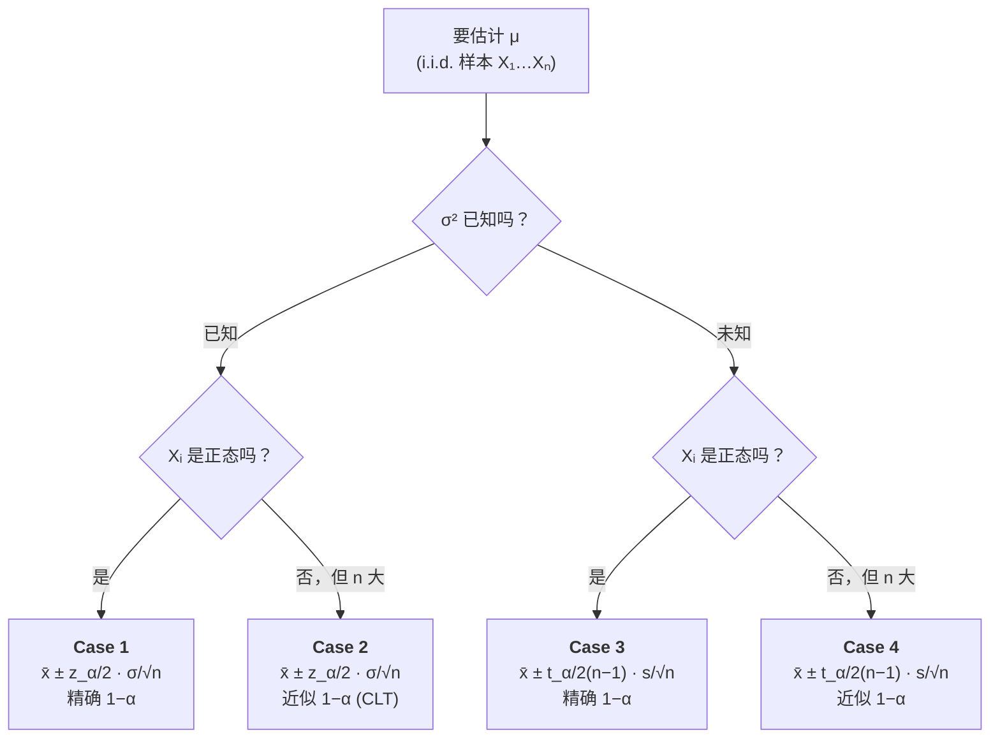

# STA2002 概率与统计 II · 第 4 讲笔记
## Confidence Interval I（置信区间 I）

> 授课：Zhenxing Guo、Ka Wai Tseng（香港中文大学（深圳）数据科学学院，2026 年 9 月）
> 教材：Hogg, Tanis & Zimmerman (2015) *Probability and Statistical Inference*, 9th ed., Pearson
> 对应教材章节：§7.1（讲义第 2 页明确给出 "Suggested reading: Chapter 7.1 of the textbook"）
> 材料构成：讲义 `Lecture4 - Confidence Interval I.pdf`（**17 页**）+ **本讲课堂板书**（**共 9 个不同文件、10 次提交**——其中一张被重复提交，已用 MD5 核对去重；**原图已归档到 `img/`，清单见 §13**）。**本讲的材料只有讲义与板书**，因此笔记不包含任何超出这两份材料的内容；凡属我补充、复算或模拟的部分，均在文末诚实备注中逐条列出。
> **组织方式**：正文**按讲义（PPT）的页序**撰写，**板书内容已融入对应位置**并用 **【板书】** 标出（后面的编号对应 §13 的 9 张原图与板面）；我补充的推导、复算与模拟用 **【补】** 标出。**来源标注约定见 §0**。讲义全部 17 页与九张板书原图都渲染（或裁切放大 2–9 倍）后逐行读过，公式与数值细节以读图为准。

---

## 0. 本讲地图（先说清楚这一讲在干什么）

第 2、3 讲解决的是**点估计（point estimation）**：把未知参数 $\theta$ 估成**一个数**——$\bar X$、$\hat\theta = X_{(n)}$、$\tilde\theta = \frac{\bar X^2}{V}$ 等等。本讲换了一个完全不同的交付物：不再给一个数，而是给**一段范围**。这段范围叫**置信区间（confidence interval, CI）**。

讲义第 2 页把本讲的范围划得很窄：

> In this lecture we will introduce the technique of confidence interval (CI), which is an important way to construct interval estimators for parameters. We will discuss confidence intervals for means: The observations are normally distributed or not; The variance of the observations is known or unknown.

注意它明确说了 **confidence intervals *for means***（均值的置信区间）。本讲**只处理均值 $\mu$** 这一个参数，方差 $\sigma^2$ 只是"已知/未知"这个开关，不是被估计的对象。（比例的 CI、方差的 CI 在后续讲次。）

"正态 / 非正态"乘上"$\sigma^2$ 已知 / 未知"，就是**四种情形**，这是本讲唯一的结构：

| 情形 | 分布假设 | $\sigma^2$ | 用什么分布 | 讲义页 |
| --- | --- | --- | --- | --- |
| **Case 1** | $X_i \sim N(\mu,\sigma^2)$ | 已知 | 标准正态 $N(0,1)$ | 5–7 |
| **Case 2** | 任意分布，$n$ 大 | 已知 | 中心极限定理 → $N(0,1)$ | 8–9 |
| **Case 3** | $X_i \sim N(\mu,\sigma^2)$ | 未知 | $t(n-1)$ | 10–12 |
| **Case 4** | 任意分布，$n$ 大 | 未知 | 近似 $t(n-1)$ | 13–14 |

最后第 15–16 页加了一个变体：**单边置信区间（one-sided CI）**，第 17 页是全表总结。

**这四格不是四个孤立公式，而是同一个套路走四遍。** 这个套路只有三步，而且每一步本讲都有明确的理由：

1. **造一个"枢轴量"（pivot）**——也就是把 $\mu$ 包装成一个形式为 $\dfrac{\hat\mu - \mu}{\text{标准误}}$ 的比值，使得它的分布在**任何 $\mu$ 下都相同**。Case 1/2 用的是 $\dfrac{\bar X - \mu}{\sigma/\sqrt n}$，Case 3/4 用的是 $\dfrac{\bar X - \mu}{S/\sqrt n}$。
2. **把"枢轴量落在中间一段"这个事件的概率写下来**。因为它的分布与 $\mu$ 无关，我们能写出 $\Pr(-c \le \text{pivot} \le c) = 1-\alpha$，其中 $c$ 是分布的分位数。
3. **把不等式反解成 $\mu$ 的形状**。左右两边同乘分母、再移项，就得到 $\mu \in [\bar X - c\cdot\text{SE},\ \bar X + c\cdot\text{SE}]$。

**第 2 讲的 MLE、第 3 讲的 MoM 回答的是"估多少"；本讲回答的是"敢说多少"。** 这是一个很不同的哲学问题：点估计器**几乎必然**给不出真值（连续分布下 $\Pr(\bar X = \mu) = 0$），所以它的价值从来不在于"猜中"，而在于"平均离真值有多远"。置信区间把这个"多远"**直接写进答案里**——你看到的不是一个数，而是一个数加上一个由 $n$、$\sigma$、$\alpha$ 三者共同决定的**误差范围（margin of error）**。这也是为什么本讲的所有公式长得几乎一样，唯一的区别只在**那个 $c$ 用谁**：$z_{\alpha/2}$、$t_{\alpha/2}(n-1)$，或者单边时的 $z_\alpha$。

**与第 2、3 讲的三处衔接（这几条是理解本讲的关键，讲义没有明说）**：

- **$t$ 分布之所以能出现，靠的是第 3 讲已经用过的那个分布事实** $(n-1)S^2/\theta_2 \sim \chi^2(n-1)$。Case 3 的推导本质上是把"标准正态"除以"卡方除以自由度"，$\sigma$ 恰好被约掉——**这正是"$\sigma$ 未知也能做"的全部秘密**（见 §6.4）。
- **无偏性在这里换了身份。** 第 3 讲问"$E[\hat\theta] \stackrel{?}{=} \theta$"，本讲问"这个随机区间覆盖 $\theta$ 的概率是不是 $1-\alpha$"。两者都是**频率主义（frequentist）的长期行为**：一个说"重复无数次实验，估计量的平均等于真值"，一个说"重复无数次实验，约 $100(1-\alpha)\%$ 的区间盖住真值"。**都不能回答"这一次"**。
- **第 3 讲的 MoM/MLE 之争，在本讲暂时退场。** 本讲的点估计器 $\bar X$ 是给定的（它同时是正态下的 MLE 和 MoM），本讲只关心怎么给它配一个误差范围。

**下面这张表就是本笔记的目录**：正文严格按讲义的页序展开，**板书内容放在它出现的位置**（而不是单独堆在末尾）。

> **本笔记的章节与讲义页序对照**（正文按讲义页序组织，板书内容融入对应位置）：

| 讲义页 | 内容 | 本笔记 |
| --- | --- | --- |
| 第 2 页 | Introduction：本讲要交付什么 | §1 |
| 第 3 页 | Confidence Interval 的定义 | §2 |
| 第 4 页 | CI for mean $\mu$：四种情形 | §3 |
| 第 5–7 页 | **Case 1**（正态、$\sigma^2$ 已知）+ 例题 | §4 |
| 第 8–9 页 | **Case 2**（非正态、$\sigma^2$ 已知）+ 例题 | §5 |
| 第 10–12 页 | **Case 3**（正态、$\sigma^2$ 未知）+ 例题 | §6 |
| 第 13–14 页 | **Case 4**（非正态、$\sigma^2$ 未知） | §7 |
| 第 15–16 页 | 单边置信区间 | §8 |
| 第 17 页 | Summary（四格总结表） | §9 |
| — | **【板书 09】两种收敛（$\xrightarrow{d}$、$\xrightarrow{P}$）的定义**——**讲义无对应页**，但它是第 8–13 页推理链的记号依据 | §5.3 |
| — | 速查表 / 核心直觉 / 术语对照 / 板书原图 / 诚实备注 | §10–§13 与文末 |

**来源标注约定**：

- 无标记 → 讲义原文或对讲义的直接展开；
- **【板书】** → 来自课堂板书（9 张原图见 §13），后附板书的编号与板面；
- **【补】** → 讲义与板书都没有，由我补充、复算或模拟（文末诚实备注逐条列出）。

---

## 1. 从点估计到区间估计（讲义第 2 页 + 【板书 01】）

讲义第 2 页只用一段话交代本讲的定位（引文见 §0），**并没有铺动机**；**课堂是从上一讲的点估计框架接过来的**（§1.1 的板书），再用一句 $P\{\mu=\bar X\}=0$ 点出点估计的死穴（§1.2）。先看那个绕不过去的事实。

灯泡那个例子（讲义第 7 页）：我们测了 $n=27$ 个灯泡，算出平均寿命 $\bar x = 1478$ 小时。**如果老师问"这批灯泡的平均寿命是多少"，回答"1478 小时"是一个几乎肯定错、却又没法被判错的答案。** 说它几乎肯定错，是因为换 27 个灯泡再测一次，$\bar x$ 就变了；$\bar x$ 的分布以 $\mu$ 为中心、标准差 $\sigma/\sqrt n = 36/\sqrt{27} \approx 6.93$，也就是说**光抽样本身的波动就有 7 小时量级**，你凭什么相信小数点后两位？

说它"没法被判错"，是因为真值 $\mu$ 从来没人知道（知道就不用估了）。**点估计的困境就在这：它给出的承诺无法被验证，也就无法被信任。**

置信区间的做法是把不确定性**明码标价**：不说"$\mu$ 是 1478"，而说"$\mu$ 大概率在 $1478 \pm 13.58$ 这个范围内"。这个 $\pm 13.58$ 不是拍脑袋的，它由三样东西算出来——样本量 $n$、总体波动 $\sigma$、以及你愿意承担多大的"漏掉"风险 $\alpha$。**这就是本讲全部内容的价值：把一个说不清楚的点，换成一个说得清楚的区间。**

### 1.1 交接：第 2–3 讲留下的两条路线 【板书 01 · 左栏】

**课堂一开始，老师先把上一讲的点估计框架重写了一遍。** 板书的左栏**不是新内容**——它是**第 3 讲板书的一次原样重现**，只是压缩成了"框架速记版"。按本课程笔记的惯例，**跨讲重复的内容不重讲推导**，只做逐行对照，并指出几处写法差异。

**板书左栏原文（逐行转写）**：

$$
\begin{aligned}
& X_1,\ldots,X_n \stackrel{iid}{\sim} P(x;\theta), \quad \theta \in \Omega \\
& \theta \in \mathbb{R}^k \\
& \hat\theta(X_1,\ldots,X_n) \\
& \text{MLE} \ / \ \text{MoM} \\
& L(\theta) \quad \downarrow \\
& \longrightarrow \ E(X^j) = \alpha_j(\theta_1,\ldots,\theta_k), \quad j=1,\ldots,k \\
& \longrightarrow \ \theta_j = h_j(EX, \, EX^2, \, \ldots, \, EX^k), \quad j=1,\ldots,k \\
& \longrightarrow \ \hat\theta_j = h_j\left(\frac{1}{n}\sum_{i=1}^{n}X_i, \ \frac{1}{n}\sum_{i=1}^{n}X_i^2, \ \ldots, \ \frac{1}{n}\sum_{i=1}^{n}X_i^k\right)
\end{aligned}
$$

**与第 3 讲板书的逐行对照**（第 3 讲的完整讨论见**第 3 讲笔记 §2.6、§4.6 与第 8 节速查表**）：

| 项目 | 第 3 讲板书（笔记 §4.6） | 本讲板书（左栏） | 差异 |
| --- | --- | --- | --- |
| 总体矩 | $\alpha_j(\theta) = E_\theta(X^j)$ | $E(X^j) = \alpha_j(\theta_1,\ldots,\theta_k)$ | 等号**左右对调**；本讲把参数**逐维列出** $\theta_1,\ldots,\theta_k$，强调"$\theta$ 是 $k$ 维向量" |
| 反解参数 | $\theta_j = h_j(EX_1, EX_1^2, \ldots, EX_1^k)$ | $\theta_j = h_j(EX, EX^2, \ldots, EX^k)$ | **本讲把 $EX_1$ 简写成 $EX$**（i.i.d. 下 $EX_1 = EX$，指"单个观测的矩"） |
| 样本替换 | $\hat\theta_j = h_j(\hat\alpha_1,\ldots,\hat\alpha_k)$，另用一行定义 $\hat\alpha_j = \frac1n\sum X_i^{\,j}$ | $\hat\theta_j = h_j\!\left(\frac1n\sum X_i, \frac1n\sum X_i^2, \ldots, \frac1n\sum X_i^k\right)$ | **本讲把 $\hat\alpha_j$ 直接展开成求和式**，不引入样本矩记号——两行并作一行 |
| 参数空间 | 未写 | $\theta \in \mathbb{R}^k$ | 本讲**新增**这一行 |
| MLE 分支 | 似然两分支（PMF / PDF）+ 一阶 / 二阶条件（§2.6 整块） | 只写 $L(\theta)$ 一个记号加一个下拉箭头 | 本讲是**速记，没有写任何条件** |
| plug-in 规则 | $\tau = g(\theta) \Rightarrow \hat\tau_{MoM} = g(\hat\theta)$（§4.6 一整段） | **没有** | 本讲板书**只写到上面三行，未见 plug-in 那一段**；该规则仍以第 3 讲笔记 §4.6 为准 |
| 组织方式 | 分成两块板："MLE 配方 / 评价标准" 与 "MoM: plug-in" | 把 **MLE 与 MoM 并列成两条分叉**，$L(\theta)$ 走 MLE、$E(X^j)$ 那三行走 MoM | 本讲的组织方式更像是**"两条路线的总览图"** |

**三点解读**：

**第一，这一栏的作用是"交接"，不是"复习"。** 左栏把 MLE 与 MoM 并排放在同一个框架下（都从 $\hat\theta(X_1,\ldots,X_n)$ 出发、都要处理 $\theta \in \Omega \subseteq \mathbb{R}^k$），然后在右栏换掉问题。**这个版面对比本身就是信息**：第 2–3 讲回答了"怎么估"，两条路线的记号、对象、目标都已经齐备，所以本讲可以不再碰它们，直接问"这个估计离真值有多远"。这正是 §0 本讲地图里那句"第 2 讲解决能不能估，本讲追问估得好不好"的板书版。

**第二，$\theta \in \mathbb{R}^k$ 这一行是新增的，但它严格说该写成 $\Omega \subseteq \mathbb{R}^k$。** 板书的字面是"$\theta$ 落在 $k$ 维实空间里"，意思是**参数是 $k$ 维实向量**——$\Omega$ 是 $\mathbb{R}^k$ 的子集，$\theta$ 是 $\Omega$ 的元素。所以更准确的写法是 $\Omega \subseteq \mathbb{R}^k$（或 $\theta \in \Omega \subseteq \mathbb{R}^k$）。**板书写成 $\theta \in \mathbb{R}^k$ 是"$k$ 维向量参数"的简写，不影响理解，但抄笔记时别把 $\Omega$ 丢掉**——$\Omega$ 上通常还有约束（第 3 讲笔记 §2.1 那个 $\Omega = \{(\theta_1,\theta_2): -\infty<\theta_1<\infty,\ 0<\theta_2<\infty\}$ 就是例子），而 $\mathbb{R}^k$ 本身没有约束。（此事记入文末"板书符号说明"。）

**第三，用 $P(x;\theta)$ 而不是 $f(x;\theta)$ 或 $p(x;\theta)$ 是有意的。** 讲义第 3 页的定义用的是 $f(x;\theta)$（PDF，连续型专用），第 3 讲的板书用 $p(x;\theta)$（PMF，离散型专用）。这里用**大写 $P$**，是**泛指"分布"**——正对应第 3 讲 MLE 配方里"似然要分 PMF / PDF 两支"这件事（第 3 讲笔记 §2.6）。**一个字母换掉了"分支讨论"的需要**，这是数学写作里很典型的一种压缩。

### 1.2 点估计的困境与“换问题” 【板书 01 · 右栏】

上面那段是从直觉出发说的；**板书把它压成了两行符号，而这两行讲义里完全没有**（讲义第 3 页直接进定义，没有动机页）。

**板书把这个困境写成了两行符号**：

$$
\begin{aligned}
& X_1,\ldots,X_n \stackrel{iid}{\sim} N(\mu, \sigma^2) \\
& \hat\mu = \bar X \\
& P\{\mu = \bar X\} = 0 \\
& |\bar X - \mu| \\
& \text{confidence interval.}
\end{aligned}
$$

**第一行到第二行：先把"官方点估计"定下来。** $\hat\mu = \bar X$ 就是第 2–3 讲的结果（正态下 $\bar X$ 既是 MLE 也是 MoM）。**板书写它，是为了让下面那句批评有的放矢。**

**第三行 $P\{\mu = \bar X\} = 0$ 是全部内容的核心。** $\bar X$ 是连续型随机变量（$n$ 个正态变量的平均仍是正态），而连续型分布在任何一个单点上的概率都是 0。所以

$$
P\{\bar X = \mu\} = 0 \quad\Longleftrightarrow\quad \text{"}\bar X \text{ 恰好等于 } \mu\text{" 这件事几乎从不发生}.
$$

**这一行的力量在于它把"点估计不准"从一句抱怨变成了一条精确的概率陈述。** 我笔记 §1 里说的"回答 1478 是一个几乎肯定错、却又没法被判错的答案"，板书用一个等号就写完了。

> [!IMPORTANT]
> **但这句 $P\{\mu=\bar X\}=0$ 不能读成"点估计没用"。** 它只说明"**恰好相等**"这件事概率为 0，而**恰好相等从来不是点估计的承诺**。$\bar X$ 仍然是无偏的（$E[\bar X]=\mu$，第 3 讲笔记 §3.3），它的价值在"**平均下来多接近**"。所以正确的读法是：
> **$P\{\mu=\bar X\}=0$ 宣告的是"精确命中"这条路走不通，而不是 $\bar X$ 不好。** 问题不在估计量，在提问方式——"$\bar X$ 是不是等于 $\mu$"是个错问题，"$\bar X$ 离 $\mu$ 有多远"才是对问题。**下一行就是换问题。**

**第四行 $|\bar X - \mu|$：把问题从"是否相等"换成"差多远"。** 这里有两个细节值得注意：

- **为什么用绝对值**：$\bar X - \mu$ 可正可负，而且它的期望恰好是 0（无偏性的定义），**均值意义上完全没有信息量**——正误差和负误差会互相抵消。取绝对值（或平方）才能度量"大小"。这和标准差用平方、MSE 用平方是同一个动机（第 3 讲笔记 §3.8）。
- **为什么不是 $\bar X - \mu$ 而是 $|\bar X-\mu|$**：还有一个更实际的理由——**"盖住 $\mu$"这件事本身是对称的**（区间以 $\bar X$ 为中心，左偏右偏都算漏掉），绝对值正好对应这种两侧对称的结构。这就预告了后面所有区间都会长成 $\bar x \pm \text{某个数}$ 的样子。

**这两行到讲义第 5 页的桥（讲义没铺，我补上）**。把 $|\bar X - \mu|$ 除以标准误，就得到

$$
\frac{|\bar X - \mu|}{\sigma/\sqrt n} \le z_{\alpha/2}
\quad\Longleftrightarrow\quad
-z_{\alpha/2} \le \frac{\bar X-\mu}{\sigma/\sqrt n} \le z_{\alpha/2}.
$$

**右边这个式子正好就是讲义第 5 页推导的第一行。** 也就是说，板书的 $|\bar X - \mu|$ 和讲义第 5 页的第一步是同一个东西的两端：**板书给的是"要度量什么"（误差的绝对大小），讲义给的是"怎么算它的概率"（把它标准化之后查正侧分位数）。** 现在再回头看 §4.2 的推导，那一串式子的起点不再是"凭空的枢轴量"，而是"板书那一行 $|\bar X-\mu|$ 的自然延续"。

> [!NOTE]
> **一处记号省略（两处相同）**：$P\{\mu=\bar X\}=0$ 严格应写作 $P_\mu\{\bar X = \mu\} = 0$——**下标 $\mu$ 指明概率是对 $\bar X$ 的分布算的**。板书写成 $P\{\cdot\}$，省略了下标；右栏定义那一行（见 §2.2）也做了同样的省略。讲义第 3 页则明确写了 $P_\theta[\cdot]$。**两种写法在连续情形下无差别，但讲义那种写法更能防"把 $\mu$ 当随机变量"的误读**（也就是 §2.3 那个最容易犯的错）。

---

## 2. 置信区间的定义（讲义第 3 页 + 【板书 01】）

讲义第 3 页给的原文定义如下，逐字抄录（**板书给出的等价写法见本节末尾 §2.2**）：

> **Definition (Confidence Interval).** Let $X_1, X_2, \ldots, X_n$ be a sample on a random variable $X$, where $X$ has PDF $f(x;\theta)$, $\theta \in \Omega$. Let $L = L(X_1, \ldots, X_n)$ and $U = U(X_1, \ldots, X_n)$ be two statistics. Given a level $\alpha \in (0,1)$, we say $(L, U)$ is a $(1-\alpha)100\%$ confidence interval for $\theta$ if
> $$1-\alpha = P_\theta[\theta \in (L, U)].$$
> That is, the probability that the interval includes $\theta$ is $1-\alpha$, which is called the **confidence coefficient** of the interval.

这个定义很短，但每一句都在防一个具体的误读。逐句拆。

### 2.1 端点是统计量，不是常数

定义里写着 $L = L(X_1,\ldots,X_n)$、$U = U(X_1,\ldots,X_n)$——**端点是样本的函数，也就是随机变量**。这一点是本定义的技术核心。

初学者看到"置信区间 $[1464.42, 1491.58]$"很自然地把 $1464.42$ 想成一个固定的数。**在定义这个层面上它不是。** 在拿到数据之前，$L$ 和 $U$ 都是随机变量：换一批样本，$L$ 和 $U$ 都会变，于是**区间本身在随机地移动**。

讲义第 5–6 页把这两个阶段分得很清楚，这是全讲最容易被忽略、但最值得记住的一处结构：

| 阶段 | 讲义用词 | 端点形态 | 概率陈述 |
| --- | --- | --- | --- |
| 拿到数据**之前** | **random interval**（随机区间） | $L, U$ 是随机变量 | $P_\theta[\theta \in (L,U)] = 1-\alpha$，**精确成立** |
| 拿到数据**之后** | **computed interval** / CI | $l = \bar x - c\cdot\text{SE}$、$u = \bar x + c\cdot\text{SE}$ 是具体的数 | $\mu$ **要么在里面、要么不在**，没有概率可言 |

**$1-\alpha$ 这个概率只属于"随机区间"，不属于算完之后那个具体区间。** 讲义第 3 页定义里把 $L, U$ 明确写成 $X_1,\ldots,X_n$ 的函数，就是在为这件事做准备。

### 2.2 板书的等价写法：不等式链与闭区间 【板书 01 · 右栏】

同一个定义，板书用的是另一种写法——**把集合式展开成不等式链**：

$$
\begin{aligned}
& \text{confidence interval.} \\
& X_1,\ldots,X_n \ \ \text{iid samples of } X, \quad X \sim P(x;\theta) \\
& \text{let } L(X_1,\ldots,X_n),\ U(X_1,\ldots,X_n) \ \text{be two statistics, s.t.} \\
& P\{L(X_1,\ldots,X_n) \le \theta \le U(X_1,\ldots,X_n)\} = 1-\alpha \\
& \Rightarrow\ [L(X_1,\ldots,X_n),\ U(X_1,\ldots,X_n)] \ \text{is a } (1-\alpha) \ \text{CI of } \theta
\end{aligned}
$$

**与讲义第 3 页定义的逐项对照**：

| 项目 | 讲义第 3 页 | 本讲板书 | 性质 |
| --- | --- | --- | --- |
| 样本设定 | $X_1,\ldots,X_n$ be a sample on a random variable $X$, where $X$ has PDF $f(x;\theta)$ | $X_1,\ldots,X_n$ iid samples of $X$，$X \sim P(x;\theta)$ | **等价**。板书写法更短，且用了泛指分布的大写 $P$（见 §1.1 第三点） |
| 端点 | $L = L(X_1,\ldots,X_n)$、$U = U(X_1,\ldots,X_n)$ 是**两个统计量** | let $L(\cdot)$、$U(\cdot)$ **be two statistics** | **等价**，措辞几乎逐字相同 |
| 覆盖事件 | $\theta \in (L, U)$（集合式，**开区间**） | $L \le \theta \le U$（**不等式链，闭区间**） | **两种写法等价**，但闭/开不同——见下文 |
| 概率陈述 | $1-\alpha = P_\theta[\theta \in (L,U)]$（带参数下标） | $P\{L \le \theta \le U\} = 1-\alpha$（**不带下标**） | 等价，板书省略了下标 |
| 置信水平 | $(1-\alpha)100\%$ | $(1-\alpha)$，并缩写成 CI | 等价，板书用比例不用百分数 |
| 参数空间限制 | $\alpha \in (0,1)$（**明写**） | **未写** | 板书省略 |

**四点解读**：

**第一，"be two statistics" 这半句是全定义的技术核心，板书把它写得更显眼了。** 讲义用 $L = L(X_1,\ldots,X_n)$ 这种"函数形式"暗示端点是随机变量；板书的说法更直接——**statistics（统计量）这个词本身就意味着"样本的函数"**。写成 "two statistics" 而不是 "two numbers" 或 "two constants"，就把 §2.1 强调的那件事钉死了：**随机的是区间，不是 $\theta$。** 如果这里写成"两个常数"，整句话就崩了——常数的区间要么盖住 $\theta$ 要么不盖，哪来的概率。

**第二，不等式链的写法把"覆盖"这个动作画了出来。** $L \le \theta \le U$ 读作"$\theta$ 被夹在 $L$ 和 $U$ 中间"，比 $\theta \in (L,U)$ 直观得多，而且**它直接预告了后面要做的事**：§4.2 那三步反解（同乘分母、同乘 $-1$ 翻号、同加 $\bar X$）全部是在对一条不等式链做变形。**先看到"链"，才知道接下来是对链动手。**

**第三，闭区间这件事正好回答了 §2.4 留下的疑问。** 板书的定义写的是 $L \le \theta \le U$，也就是**闭区间**。所以：

$$
\text{讲义定义（开）} \quad (L,U)
\qquad\Longleftrightarrow\qquad
\text{板书定义（闭）} \quad [L,U]
$$

在连续型分布下两者**完全等价**（端点被取到的概率为 0）。板书用闭区间的好处是它和后面所有计算（$[\bar x \pm \cdots]$）形式统一，不用来回翻译；讲义用开区间的好处是它对**离散型**参数（比如 $\theta$ 取整数值）也安全。**两种选择各有道理，讲义和板书各选了对自己方便的一边。** 我在 §2.4 原先把这件事读成"讲义前后不一致"，现在按板书的证据改成了"惯例差异"——**这是本次并入板书时我对上一轮判断的一处显式更正，旧话保留在 §2.4 里供对照。**

**第四，板书省略了 $\alpha \in (0,1)$，但这个前提不能真省。** $\alpha \to 0$ 时 $z_{\alpha/2} \to \infty$，区间扩成整条实轴；$\alpha \to 1$ 时 $z_{\alpha/2} \to 0$，区间缩成一个点。**两个端点都退化、都失去意义，所以必须把 $\alpha$ 关在开区间 $(0,1)$ 里。** 板书属于速记，抄笔记时记得把讲义这个前提补回去。

**（补充，第二张板书并入后）** 第二张板书最后给出的区间写的是 $[\bar X \pm z_{\alpha/2}\frac{\sigma}{\sqrt n}]$——**同样是方括号、闭区间**。所以"本讲用的是闭区间版本"这个更正有**两张板书的证据**，不再是孤证（详见 §4.2 末段）。

### 2.3 随机的是区间，不是 $\theta$ 【板书 03】

这是本讲最容易被说错的一句话。假设算出灯泡的 95% CI 是 $[1464.42, 1491.58]$，下面两个表述**只有一个是对的**：

- ❌ "$\mu$ 有 95% 的概率落在 $[1464.42, 1491.58]$ 里。"
- ✅ "如果我把这个实验重复很多次，每次都算一个区间，那么大约 95% 的区间会盖住 $\mu$。"

第一个表述错在**把概率给了 $\mu$**。在频率派框架里 $\mu$ 是一个**固定的未知常数**，不是随机变量——它没有分布，所以"$\mu$ 落在某处"这件事没有概率，只有真假。真值是 1478.7 就是 1478.7，你的区间盖住它就是盖住了，没盖住就是没盖住。**随机的是区间，不是 $\mu$。**

讲义定义的写法 $P_\theta[\theta \in (L,U)]$ 巧妙地把这件事绕开了：它把 $\theta$ 固定在下标上（当作已知值），随机性完全交给 $(L,U)$。所以严格读法是"**随机区间 $(L,U)$ 覆盖固定点 $\theta$ 的概率是 $1-\alpha$**"。

> [!NOTE]
> **"95% 置信"里的 95% 到底是关于什么的？**
> 是关于**构造方法**的。它是对"这套配方"的一次性能评级，而不是对"这一次结果"的判定。这也是为什么"置信区间"不能像贝叶斯可信区间（credible interval）那样说"$\mu$ 以 95% 概率在此区间内"——后者需要先给 $\mu$ 一个先验分布，本课程不做这件事。

第一张和第三张板书都写了同一条 Remarks：

$$
\text{1)}\quad (1-\alpha)\ \text{CI}\ \ \big[L(X_1,\ldots,X_n),\ U(X_1,\ldots,X_n)\big]\ \ \textbf{is random.}
$$

后面跟着一段"重复抽样"的写法（两处都有）：

$$
\begin{aligned}
& (X_1^{(1)}, X_2^{(1)}, \ldots, X_n^{(1)}) \quad\Rightarrow\quad \left[L(X_1^{(1)},\ldots,X_n^{(1)}),\ U(X_1^{(1)},\ldots,X_n^{(1)})\right] \\
& (X_1^{(2)}, X_2^{(2)}, \ldots, X_n^{(2)}) \quad\Rightarrow\quad \left[L(X_1^{(2)},\ldots,X_n^{(2)}),\ U(X_1^{(2)},\ldots,X_n^{(2)})\right] \\
& \qquad\qquad \vdots \\
& (X_1^{(k)}, \ldots, X_n^{(k)})
\end{aligned}
$$

**板书画的示意图**：一条水平基线，基线上标一个点 $\theta$，从 $\theta$ 向上引一条垂线；垂线两侧挂着若干条水平短线段（**板书上一共 5 条**），其中多数横跨那条垂线、有一条明显只向一侧延伸。图的左下方写着 $(1-\alpha)$，字底下画了一道下划线。

**这组记号在说什么**，逐项拆：

- **上标 $(1),(2),\ldots,(k)$ 是"第几批样本"**，不是"第几个观测"。$X_1^{(j)}$ 读作"第 $j$ 次实验里的第 1 个观测"。**这是本讲最省事的一套记号**——它把"重复抽样"从一个哲学说法变成了可以直接写出来的上下标。
- **每一批样本 $\Rightarrow$ 一个区间**：左列是数据、右列是由这批数据算出的区间。**$k$ 批样本给出 $k$ 个区间，且它们通常互不相同**——这就是 "is random" 的字面含义。
- **$\theta$ 只有一根垂线，区间却有很多条**：图的结构本身就在说"**$\theta$ 是固定的，区间是随机的**"。这正是本节开头那条“谁在动、谁不动”的直觉的图解版。

**这张图补上了讲义缺的东西**：讲义第 3 页只给定义式 $P_\theta[\theta \in (L,U)] = 1-\alpha$，**没有把"重复抽样"画出来**。本节前半段是用文字讲的（"重复很多次、约 95% 的区间盖住 $\mu$"），板书把它变成了图。**文字版和图形版说的是同一件事，但图形版更难被误读**——因为"$\theta$ 只有一根、区间有很多根"是看一眼就明白的。

> [!NOTE]
> **一处我不代老师统计的地方**：图下方的 $(1-\alpha)$ 显然是标注"盖住 $\theta$ 的区间所占比例"，但**板书没有标出具体几条盖住、几条没盖住**（我数出 5 条线段，其中至少一条明显偏向一侧）。**我不替这幅示意图去数比例**——示意图的线段条数太少，硬算出来的比例必然离 $1-\alpha$ 很远，反而误导。要理解 $1-\alpha$ 的准确含义请以定义式为准，**图只用来说明"随机的是区间"这个结构**。

**一处版面上的观察（含一次更正）**：这条 Remark 1 在**两张板书**上都出现过（我先前编号的"第 3 张"与"第 5 张"）。我上一轮据此判断"第 5 张是把 Remark 1 重抄一遍后接着讲"。

> [!NOTE]
> **更正（第 6 张照片并入后，2026-09-21）**：最新的照片**同时拍到了上下两块白板**——**上板**写 Remarks 1)、4)、5) 与 RECALL，**下板**写 pivot 框架与 Case 2。这把两块板的位置关系定死了，也说明"第 3 张"和"第 5 张"拍的都是**同一块上板**（只是取景范围不同：一张只拍到左边的 1)，另一张拍到 1)、4)、5) 整段）——**不是"重抄"**。原判断不成立，正确说法是"**同一块上板被在不同时刻、以不同范围拍了几次**"。旧话保留在此供对照；文末"材料来源"已同步改写。

### 2.4 开区间与闭区间的差别（含一处更正）

定义里用的是**开区间** $(\cdot,\cdot)$，讲义后面所有具体计算都用**闭区间** $[\cdot,\cdot]$。对连续分布这不是问题（$P_\theta[\text{端点恰好取到}] = 0$），但对**离散分布**有实质差别——这一点要等到后续讲次处理**离散参数**（例如比例的置信区间）时才会真正咬人，**本讲不涉及**。先记下这个事实：**"讲义定义用开、计算用闭"两种写法并存**（已列入文末疑点表第 1 条）。

> [!NOTE]
> **一处更正（板书并入后补写）**：本节初稿把这条不一致的矛头指向讲义，暗示它是前后矛盾。**板书并入后这个定性要改。** 板书在**定义那一行**用的就是闭区间：$P\{L(X_1,\ldots,X_n) \le \theta \le U(X_1,\ldots,X_n)\} = 1-\alpha$，并写成 $[L(X_1,\ldots,X_n),U(X_1,\ldots,X_n)]$ 是 $(1-\alpha)$ CI（详见 §2.2）。**既然讲授的定义本身就是闭的，那这就不是"讲义前后矛盾"，而是"讲义沿用了教科书对定义的严谨写法（开区间），而讲授与全部计算都用更直观的闭区间"。** 原判断里"两种写法并存"这个事实仍然成立（讲义内部确实并存），但**读成疏漏是不对的**——这是惯例差异，不是错误。文末疑点表第 1 条已同步改写。

### 2.5 $P_\theta$ 的下标是什么意思

$P_\theta[\cdot]$ 的下标 $\theta$ 表示"这个概率是在真实参数等于 $\theta$ 时计算的"。为什么要强调？因为按定义，这个概率**对参数空间里的每一个 $\theta$ 都必须等于 $1-\alpha$**。

这一点值得停下来体会：$P_\theta[\theta \in (L,U)]$ 这个写法里 $\theta$ 出现了两次，一次作为下标（决定数据从哪个分布生成）、一次作为被覆盖的目标。**下标那个 $\theta$ 会变化，但括号里的概率值不变**——这正是"置信区间"这个概念能成立的原因。它是**一致覆盖（uniform coverage）**的意思：不管真值是 5 还是 5000，这套构造都能盖住它 $100(1-\alpha)\%$ 的次数。

（对比一下第 2–3 讲的无偏性：$E[\hat\theta] = \theta$ 也是对每个 $\theta$ 成立，所以也叫"一致无偏"。**一致无偏估计量的构造，正是良好置信区间的基础之一**——本讲 Case 1/3 用的 $\bar X$ 就是一致无偏的。）

### 2.6 $1-\alpha$、$\alpha$ 与“置信水平”的名字

- $1-\alpha$ 叫**置信系数（confidence coefficient）**，或**置信水平（confidence level）**。常见取值 $0.90$、$0.95$、$0.99$，对应 $\alpha = 0.10, 0.05, 0.01$。
- $\alpha$ 是**漏掉的概率（miss probability）**，也叫错失率。
- **一个必须点出的记号陷阱**：$\alpha$ 在本讲有两个身份——一方面它是"$1-\alpha$ 里的那个 $\alpha$"（水平参数），另一方面它又出现在分位数**下标**里（$z_{\alpha/2}$、$t_\alpha(n-1)$、$z_\alpha$）。这两个身份是一致的，但**下标的用法在双边与单边之间会变**（双边用 $\alpha/2$，单边用 $\alpha$），这是本讲最容易写错公式的地方。见 §8.5。

---

## 3. 四种情形的地图（讲义第 4 页）

讲义第 4 页把要处理的情形列成四条，原文如下：

> We consider an i.i.d. random sample $X_1, \ldots, X_n$ of size $n$ for estimating the mean $\mu = E(X_1)$ under the following four cases:
> 1. $X_i \stackrel{i.i.d.}{\sim} N(\mu, \sigma^2)$, $\sigma^2$ known
> 2. $X_i$ i.i.d. with mean $\mu$, variance $\sigma^2 = \mathrm{Var}(X_1)$, $\sigma^2$ known
> 3. $X_i \stackrel{i.i.d.}{\sim} N(\mu, \sigma^2)$, $\sigma^2$ unknown
> 4. $X_i$ i.i.d. with mean $\mu$, variance $\sigma^2$, $\sigma^2$ unknown

四条共同的前提是 **i.i.d.**（独立同分布）与**有限均值**。两个维度各自开一个开关：

- **"正态 / 非正态"** 决定我们能不能精确知道 $\bar X$ 的分布。正态时 $\bar X \sim N(\mu, \sigma^2/n)$ **精确成立**（正态的线性组合仍是正态，这是第 1 讲就有的性质）；非正态时只能靠**中心极限定理（Central Limit Theorem, CLT）**得到近似。
- **"$\sigma^2$ 已知 / 未知"** 决定分母上那个标准误 $\text{SE} = \sigma/\sqrt n$ 能不能算出来。**注意这一个开关影响的不是"准不准"，而是"能不能动手"**——Case 1 的公式 $ \bar x \pm z_{\alpha/2}\,\sigma/\sqrt n$ 里 $\sigma$ 是写死的，$\sigma$ 不知道，这个式子就只是个符号。这就是讲义第 10 页给出的 Case 3 的动机。

怎么选，画成决策树是这样：

**这张图里最值得注意的一件事：Case 1 与 Case 2 的公式一模一样，Case 3 与 Case 4 的公式也一模一样。** 四个格子只有**两个不同的公式**。区别不在形式，而在**那个 $1-\alpha$ 是精确的还是近似的**。讲义第 17 页的总结表把这一点放在表格里（"$\sim$" vs "$\stackrel{approx}{\sim}$"），但没有用文字强调——**这是本讲结构上最漂亮的简化，也是最容易被学生漏掉的一层**（详见 §5.6 与 §7.1）。

---

## 4. Case 1：正态、$\sigma^2$ 已知（讲义第 5–7 页 + 【板书 02、04、05】）

### 4.1 枢轴量：整套方法的引擎 【板书 02 · 上半】

Case 1 是四格里最干净的一格，值得把每一步都走完，因为后面三格只是换零件。

前提：$X_1,\ldots,X_n \stackrel{i.i.d.}{\sim} N(\mu,\sigma^2)$，$\sigma^2$ 已知。我们要处理的是 $\bar X$ 的分布。由第 1 讲的正态性质（独立正态变量的和仍是正态）：

$$
\bar X = \frac{1}{n}\sum_{i=1}^{n} X_i \sim N\!\left(\mu, \frac{\sigma^2}{n}\right).
$$

**逐个符号看这个结果**：中心仍是 $\mu$（$\bar X$ 是 $\mu$ 的无偏估计，第 3 讲已经证过）；方差是 $\frac{\sigma^2}{n}$——**样本均值的波动比单个观测小 $n$ 倍**，这是"多测几个能更准"的数学表达，也是后面所有公式里那个 $\sqrt n$ 的来源。

由 $\bar X \sim N(\mu, \sigma^2/n)$ 标准化：

$$
Z = \frac{\bar X - \mu}{\sigma/\sqrt n} \sim N(0,1).
$$

**这个 $Z$ 就是枢轴量。** "枢轴"的意思是：它的分布**完全已知**（标准正态），而且**不依赖任何未知参数**——$\mu$ 被放进分子，$\sigma$ 被放进分母抵消掉了。这一步是整个方法的引擎：**因为 $Z$ 的分布与 $\mu$ 无关，我们才能在不知道 $\mu$ 的情况下讨论 $Z$ 落在某范围里的概率。** 后面 Case 3 用 $t$ 分布，就是因为在 $\sigma$ 未知时，$\frac{\bar X - \mu}{\sigma/\sqrt n}$ 里还留着一个未知的 $\sigma$，不能直接当枢轴量用。

> [!NOTE]
> **“枢轴量”这个提法来自板书，不是讲义用词。** 讲义全篇**没有出现过 "pivot" 这个词**——它只给了下面那三行具体推导，把这个概念隐含在里面。**课堂是先把它讲成一般框架、再落到 Case 1 的**，所以本节也按这个顺序走：先给板书的一般框架（紧接着的下面），再走一遍 Case 1 的推导（§4.2）。

**板书给出的一般框架（逐行转写）**：

$$
\begin{aligned}
& \cdot\ \ \text{Pivot statistics:} \quad \hat T = h(X_1,\ldots,X_n;\theta) \\
& \qquad h(X_1,\ldots,X_n;\theta) \sim P \\
& \qquad P\left\{\varrho_{1-\frac{\alpha}{2}} \le h(X_1,\ldots,X_n;\theta) \le \varrho_{\frac{\alpha}{2}}\right\} = 1-\alpha,
\end{aligned}
$$

这一块旁边还画了一张**分布草图**：一条钟形曲线，**左尾**涂阴影并标 $\varrho_{1-\frac{\alpha}{2}}$，**右尾**涂阴影并标 $\varrho_{\frac{\alpha}{2}}$；右尾上方有一个箭头标注 $\frac{\alpha}{2}$，箭头旁写着文字：

> **upper $\dfrac{\alpha}{2}$ quantile.**

**这三行是本讲最抽象、也最有价值的一处**，因为它们把上面那个“枢轴量”从一个具体技巧提升成了一个**可以套用到任意参数、任意分布的方法**：

| 板书行 | 含义 | 与讲义的关系 |
| --- | --- | --- |
| $\hat T = h(X_1,\ldots,X_n;\theta)$ | 把样本与参数**混在一起**造一个量——注意它**同时含数据和参数**，所以它**不是估计量**（估计量不能含 $\theta$，否则没法算） | **讲义没有**（讲义从未出现 "pivot" 这个词） |
| $h(X_1,\ldots,X_n;\theta) \sim P$ | 关键在**它的分布 $P$ 完全已知**、与 $\theta$ 无关 | **讲义没有**（讲义直接给 $Z \sim N(0,1)$） |
| $P\{\varrho_{1-\alpha/2} \le h \le \varrho_{\alpha/2}\} = 1-\alpha$ | 既然分布已知，就用**两个分位数把中间的 $1-\alpha$ 概率夹出来** | **讲义没有**（讲义写的是 $-z_{\alpha/2} \le Z \le z_{\alpha/2}$） |

**为什么这个框架值得单独记**：它**解释了后面四格为什么都长得一样**（§3 的地图、§9 的总结表）。四格的做法全都是这一套——先造 pivot，再用它已知的分布取两个分位数，最后反解出 $\mu$。区别只在 pivot 是谁、那个 $P$ 是什么分布。**换句话说，本讲教的不是四个公式，是一个方法加四次套用。**

**关于那个 $\hat T$ 上的帽子**：$\hat T$ **不是估计量**（它含未知的 $\theta$，算不出数）。这个 hat 大概是老师沿用"$\hat{\ }$ 表示由样本构造的量"的习惯写法。**读的时候别把它当估计量**，它是 "pivot" 这个名字的载体。

**记号解释：$\varrho$ 是什么，为什么下标是 $1-\alpha/2$ 和 $\alpha/2$**

这里出现了一个讲义里没有的字母 $\varrho$（rho 的花体）。它的规则与 $z$、$t$ **完全相同**：

$$
\Pr(X > \varrho_p) = p
\qquad\Longleftrightarrow\qquad
\varrho_p \text{ 是"上尾概率为 } p \text{" 的分位数}.
$$

于是 $P\{\varrho_{1-\alpha/2} \le h \le \varrho_{\alpha/2}\}$ 读作：**左边那个分位数的上尾概率是 $1-\alpha/2$（很大，所以值很小、落在左侧）；右边那个的上尾概率是 $\alpha/2$（很小，所以值很大、落在右侧）。** 草图正好画成这样——$\varrho_{1-\alpha/2}$ 在左尾、$\varrho_{\alpha/2}$ 在右尾。**下标越大、位置越靠左**，这是这套记号最容易记反的地方（对照 §4.2 那张常用 $z$ 表：$z_{0.05}=1.645$ 在 $z_{0.025}=1.96$ 的左边 ✓）。

**"upper $\frac{\alpha}{2}$ quantile" 这行文字，顺手补上了一个我上一轮记下的缺口。** 我笔记 §6.9 写过："讲义对 $t_\alpha(n-1)$ 从头到尾没给定义，只能从 R 代码反推"。**板书在这里用文字明确了分位数的读法**（upper = 上侧、下标 = 上尾概率），并且在下半部分用 $z_{1-\alpha/2} = -z_{\alpha/2}$ 把规则演示了一遍（见 §4.2）。所以"下标 = 上尾概率"这条约定**在本讲是明确讲过、板书确认过的**，不是我上一轮从 `qt(0.975,19)` 反推出来的假设。§6.9 已同步更新。

**还有一个记号细节**：第二行写的是 $h(\cdot) \sim P$（**大写 $P$**），指"某个已知的分布"——与 §1.1 里那个泛指分布的大写 $P(x;\theta)$ 是同一个用法，与 $p$（概率质量函数）无关。

### 4.2 从枢轴量到区间：三步推导（讲义第 5 页）【板书 02 · 下半】

讲义第 5 页的推导原文是这样的（我把每步的理由补在右边）：

$$
\Pr\!\left(-z_{\alpha/2} \le \frac{\bar X - \mu}{\sigma/\sqrt n} \le z_{\alpha/2}\right) = 1-\alpha
\qquad\Longrightarrow\qquad
\Pr\!\left(\bar X - z_{\alpha/2}\frac{\sigma}{\sqrt n} \le \mu \le \bar X + z_{\alpha/2}\frac{\sigma}{\sqrt n}\right) = 1-\alpha .
$$

第一行怎么来的：$Z \sim N(0,1)$ 关于 0 对称，所以把中间的 $1-\alpha$ 概率留给 $[-z_{\alpha/2}, z_{\alpha/2}]$ 时，两侧尾巴各留 $\alpha/2$。**这里用到了 $z_{\alpha/2}$ 的定义（讲义在同一页给出）**：

$$
\Pr(Z > z_{\alpha/2}) = \frac{\alpha}{2}, \qquad Z \sim N(0,1).
$$

**注意这个定义给的是"上尾分位数"，不是"下尾"、也不是"点分位数"。** 这是一个约定，讲义明确写出 $\Pr(Z > z_{\alpha/2}) = \alpha/2$ 而不是 $\Pr(Z \le z_{\alpha/2}) = 1-\alpha/2$（两者等价，但前者是本课程的记号习惯）。**记住这个下标读法，本讲后面所有 $z$ 和 $t$ 的下标都按这个规则读：下标 = 上尾剩余概率。** 于是：

| 记号 | 上尾概率 | 数值 | 用途 |
| --- | --- | --- | --- |
| $z_{0.05}$ | 0.05 | $1.6449$ | 90% **单边**；90% 双边用 $z_{0.05}$ |
| $z_{0.025}$ | 0.025 | $1.9600$ | 95% 双边（$\alpha=0.05$） |
| $z_{0.005}$ | 0.005 | $2.5758$ | 99% 双边（$\alpha=0.01$） |
| $z_{0.0025}$ | 0.0025 | $2.8070$ | 99.5% 双边（$\alpha=0.005$） |

（以上数值我用自写的正态分位数函数复算过，与 R 的 `qnorm(0.975)`、`qnorm(0.995)` 逐位一致，见文末复算表。）

第二行（反解）值得逐字走一遍，因为这里有一个**正负号陷阱**：

$$
-z_{\alpha/2} \le \frac{\bar X - \mu}{\sigma/\sqrt n} \le z_{\alpha/2}
$$

三边同乘 $\sigma/\sqrt n$（正数，不等号方向不变）：

$$
-z_{\alpha/2}\frac{\sigma}{\sqrt n} \le \bar X - \mu \le z_{\alpha/2}\frac{\sigma}{\sqrt n}
$$

三边同乘 $-1$（**负数，两个不等号都要翻转**）：

$$
z_{\alpha/2}\frac{\sigma}{\sqrt n} \ge \mu - \bar X \ge -z_{\alpha/2}\frac{\sigma}{\sqrt n}
$$

再写成小到大的顺序，并三边加 $\bar X$：

$$
\bar X - z_{\alpha/2}\frac{\sigma}{\sqrt n} \le \mu \le \bar X + z_{\alpha/2}\frac{\sigma}{\sqrt n}.
$$

**"乘 $-1$ 翻方向"是这类推导最常见的错处**，而它恰好是"区间以 $\bar X$ 为中心"这个结论的来源：$\mu$ 的不等式两边原本是 $-z$ 和 $+z$，翻号后变成了 $+z$ 和 $-z$，再加上 $\bar X$ 之后就对称地挂在 $\bar X$ 两侧了。

**同一段推导，板书是一行一行写出来的**，而且比讲义多了两步（下面用粗体标出）：

$$
\begin{aligned}
& \text{e.g.} \quad X_1,\ldots,X_n \stackrel{iid}{\sim} N(\mu,\sigma^2), \quad \sigma^2 \text{ is known}, \ \mu \text{ is unknown.} \\
& \bar X = \frac{1}{n}\sum_{i=1}^{n}X_i \sim N\!\left(\mu, \frac{\sigma^2}{n}\right) \\
& \bar X - \mu \sim N\!\left(0, \frac{\sigma^2}{n}\right) \\
& \frac{\sqrt n\,(\bar X - \mu)}{\sigma} \sim N(0,1) \\
& P\left\{-z_{\frac{\alpha}{2}} \le \frac{\sqrt n(\bar X-\mu)}{\sigma} \le z_{\frac{\alpha}{2}}\right\} = 1-\alpha \\
& \text{(left:} \ \ \mu \le \bar X + z_{\frac{\alpha}{2}}\frac{\sigma}{\sqrt n} \\
& \ \ \text{right:} \ \ \mu \ge \bar X - z_{\frac{\alpha}{2}}\frac{\sigma}{\sqrt n} \\
& P\left\{\mu \in \left[\bar X \pm z_{\frac{\alpha}{2}}\frac{\sigma}{\sqrt n}\right]\right\} = 1-\alpha \\
& \text{Two-sided } (1-\alpha) \ \text{CI}
\end{aligned}
$$

（第五行的 pivot 部分，板书在下方画了一道**波浪线**——那是老师标"这个量就是 pivot"的方式。）

**右侧另有一张标准正态草图**：中心虚线标 $0$；左尾阴影处标 $z_{1-\frac{\alpha}{2}}$，其下方写一个等号、再下面写 $-z_{\frac{\alpha}{2}}$；右尾阴影处标 $z_{\frac{\alpha}{2}}$。草图下方写着一行：

$$
\alpha = 0.1,\ 0.05,\ 0.025
$$

**与讲义第 5 页的逐行对照**：

| 板书写法 | 讲义第 5 页 | 差异 |
| --- | --- | --- |
| $\bar X \sim N(\mu, \sigma^2/n)$ | 有 | 一致 |
| **$\bar X - \mu \sim N(0, \sigma^2/n)$** | **没有** | **板书新增一步**：把"中心化"单独写出来 |
| $\frac{\sqrt n(\bar X-\mu)}{\sigma} \sim N(0,1)$ | $Z = \frac{\bar X-\mu}{\sigma/\sqrt n} \sim N(0,1)$ | **等价**（$\frac{\sqrt n(\bar X-\mu)}{\sigma} = \frac{\bar X-\mu}{\sigma/\sqrt n}$） |
| $P\{-z_{\alpha/2} \le \cdot \le z_{\alpha/2}\} = 1-\alpha$ | 有 | 一致 |
| **(left: $\mu \le \bar X + z_{\alpha/2}\frac{\sigma}{\sqrt n}$ / right: $\mu \ge \bar X - z_{\alpha/2}\frac{\sigma}{\sqrt n}$)** | **没有** | **板书新增**：把反解结果按两端分别写出来 |
| $P\{\mu \in [\bar X \pm z_{\alpha/2}\frac{\sigma}{\sqrt n}]\} = 1-\alpha$ | 写成一长串 $\Pr(\bar X - \cdots \le \mu \le \bar X + \cdots)=1-\alpha$ | **板书的 $\pm$ 与方括号更紧凑**，且是**闭区间** |
| "Two-sided $(1-\alpha)$ CI" | "is called a $100(1-\alpha)\%$ (two-sided) confidence interval (CI) of $\mu$" | 一致 |

**三点解读**：

**第一，中间那步 $\bar X - \mu \sim N(0, \sigma^2/n)$ 是板书补的、讲义跳过的。** 它的意义在于**把"中心化"与"标准化"拆成两个动作**：$\bar X$ 的中心是 $\mu$，**减掉 $\mu$ 之后分布里就再没有 $\mu$ 了**（中心变 0）；再除以标准差 $\sigma/\sqrt n$ 才得到与 $\mu$ 无关的标准正态。**讲义把两个动作压成一行，板书拆成两行**——这个拆分让"减 $\mu$ 是关键一步"这件事显形，也正好解释了为什么 pivot 的定义（§4.1）要求"分布与 $\theta$ 无关"：**中心化就是实现这一点的动作。**

**第二，"left / right" 的分叉解释了为什么最后能写成 $\pm$。** 讲义一步跳到 $[\bar X - \cdots,\ \bar X + \cdots]$；板书把**两端分别写出来**：

$$
\text{下界} = \bar X - z_{\alpha/2}\frac{\sigma}{\sqrt n}, \qquad\qquad \text{上界} = \bar X + z_{\alpha/2}\frac{\sigma}{\sqrt n}
$$

因为两侧尾巴面积相同（$z$ 是同一个数），所以两端可以合并成 $\bar X \pm z_{\alpha/2}\frac{\sigma}{\sqrt n}$。**照着板书读，"为什么是这个对称形式"变成显然的，而不是要记的。**（对照 §4.2 的代数过程：左侧那条 $\mu \le \bar X + \cdots$ 是从 $-z_{\alpha/2} \le \frac{\sqrt n(\bar X-\mu)}{\sigma}$ 解出来的，右侧那条从右边解出来——**两条不等式分别造出两个端点**。）

**第三，$z_{1-\alpha/2} = -z_{\alpha/2}$ 这个等式是"记号规则"的演示，不是新公式。** 按上尾概率规则，$z_{1-\alpha/2}$ 的上尾概率是 $1-\alpha/2$（几乎全部），所以它落在**最左边、是负数**；$z_{\alpha/2}$ 是右侧那个正数。对称性保证两者互为相反数。**这正是 pivot 框架里下界能写成 $\varrho_{1-\alpha/2}$ 也能写成 $-z_{\alpha/2}$ 的原因**——老师把两种写法用等号连起来，意思是"左边那个的下标难读，可以改写成 $-z_{\alpha/2}$"。

**关于 $\alpha = 0.1,\ 0.05,\ 0.025$ 这一行（有歧义，如实标注）**：这三个数有两种读法——

- **读作 $\alpha$（漏掉的概率）**：对应置信度 $90\%$、$95\%$、$97.5\%$。但 $97.5\%$ 并非常用水平。
- **读作双边尾部概率 $\alpha/2$**：则 $\alpha = 0.2,\ 0.1,\ 0.05$，对应置信度 $80\%$、$90\%$、$95\%$——**这三个恰是三个最常见水平**，而且 $0.1 \to 0.05 \to 0.025$ 每一步减半，像是有意排的序列。

我倾向后一种读法（这一行紧贴标准正态草图，更像在列"最常用的几个尾部概率：$z_{0.1}=1.282$、$z_{0.05}=1.645$、$z_{0.025}=1.960$"）。**但板书的字面写的是 $\alpha = \cdots$，我不改字面**，两种读法都列在这里，并记入文末"板书符号说明"。

**顺带再次印证了上一轮的更正**：板书这里的区间写成 $[\bar X \pm \cdots]$——**方括号、闭区间**，与第一张板书的 $P\{L \le \theta \le U\}$ 一致。**第二张照片为"本讲用闭区间版本"这个更正又添了一条证据**（见 §2.4、§2.2）。

### 4.3 从随机区间到具体区间（讲义第 6 页）

拿到数据后，$\bar x$ 是一个具体的数，把 $\bar X$ 换成 $\bar x$ 就得到讲义第 6 页的结论：

$$
\bar x \pm z_{\alpha/2}\frac{\sigma}{\sqrt n}
\qquad\text{或}\qquad
\left[\bar x - z_{\alpha/2}\frac{\sigma}{\sqrt n},\; \bar x + z_{\alpha/2}\frac{\sigma}{\sqrt n}\right],
$$

讲义称它为 $\mu$ 的 **$100(1-\alpha)\%$（two-sided）confidence interval**。注意两点：

- 中心 $ \bar x$ **就是第 2–3 讲的那个点估计**。所以置信区间不是替代点估计，而是**在点估计外面套一层由数据精度决定的壳**。
- 从第 5 页到第 6 页发生了一次"身份切换"：$L, U$ 从随机变量变成了具体的数。**概率陈述 $1-\alpha$ 到此为止不再适用于新对象**——这就是 §2.3 强调的那个点的落地位置。

### 4.4 区间的性质：宽度与三个旋钮（讲义第 6 页）【板书 04 · Remarks 3】

讲义列出四条性质，我按重要性重排并把它们连成一段：

> CI is centered at $\bar x$, a point estimate of $\mu$；**Width**: $2z_{\alpha/2}\sigma/\sqrt n$；Larger $n$ ⇒ shorter CI；Larger $\alpha$ ⇒ smaller $z_{\alpha/2}$ ⇒ shorter CI.

**（1）宽度公式 $2z_{\alpha/2}\sigma/\sqrt n$ 里藏着三个可调的旋钮。**

- **$\sigma$：** 总体的固有噪声，改不了（改它等于改研究对象）。
- **$n$：** 唯一"花钱就能买"的旋钮。但要小心**平方根**——**想让区间窄一半，样本量得翻四倍**。我用灯泡那套参数复算过：$n=27$ 时宽度 $27.158$ 小时，$n=108$ 时宽度 $13.579$ 小时，正好减半；而从 $n=27$ 想把 95% CI 的半宽压到 5 小时以内，需要 $n \ge 199.1$，也就是 **$n = 200$**。**这个"四倍换一半"的斜率是所有抽样调查成本核算的起点。**
- **$\alpha$：** $\alpha$ 越大，$z_{\alpha/2}$ 越小，区间越窄——**但代价是置信度从 $1-\alpha$ 掉下去**。同样 $n=27$、$\sigma=36$：90% 区间宽 $22.792$，95% 宽 $27.158$，99% 宽 $35.692$。**"更短的区间"和"更高的把握"是一对不能同时要的东西**，这不是技术缺陷，是信息的物理限制。

**（2）"更短的区间"本身不是优点。** 有人会想：那我把区间缩到 $[\bar x, \bar x]$ 不就好了，宽度 0，最准。错——那个区间的覆盖概率是 0，不是 $1-\alpha$。**置信区间的评价必须成对看：宽度 + 覆盖概率。** 单看宽度可以作弊，单看覆盖率也可以作弊（把区间放大到 $(-\infty, \infty)$ 覆盖率就是 100%）。这个"两条腿"的想法，正是第 5 讲将要讲的"最优区间"的入口。

**（3）中心 $\bar x$ 会移动，但覆盖概率不变。** 这个区间"准不准"取决于 $\bar x$，但"盖住 $\mu$ 的概率"不取决于任何具体数据——它在构造的时候就被 $z_{\alpha/2}$ 定死了。

**板书把同一个宽度公式的依赖关系逐项锁定**（相当于讲义那几句话的严格版）：

$$
\text{3)}\quad \cdot\ N(\mu,\sigma^2),\quad \left[\bar X \pm z_{\frac{\alpha}{2}}\frac{\sigma}{\sqrt n}\right],\quad \sigma \text{ is known.}
$$

$$
\text{width} = 2\cdot z_{\frac{\alpha}{2}}\frac{\sigma}{\sqrt n}
$$

$$
\begin{aligned}
& \cdot\ \text{fixed } \alpha,\ \sigma:\quad \text{width} \downarrow \ \text{when } n \uparrow \\
& \cdot\ \text{fixed } \sigma,\ n:\quad \text{width} \uparrow \ \text{when } \alpha \downarrow \\
& \cdot\ \text{fixed } \alpha,\ n:\quad \text{width} \uparrow \ \text{when } \sigma \uparrow
\end{aligned}
$$

**与讲义第 6 页的对照**：

| 板书 | 讲义第 6 页 | 差异 |
| --- | --- | --- |
| width $= 2z_{\alpha/2}\sigma/\sqrt n$ | "Width: $2z_{\alpha/2}\sigma/\sqrt n$" | 一致 |
| fixed $\alpha,\sigma$：$n \uparrow \Rightarrow$ width $\downarrow$ | "Larger $n \Rightarrow$ shorter CI" | 一致，板书补了"控制变量"的限定 |
| fixed $\sigma,n$：$\alpha \downarrow \Rightarrow$ width $\uparrow$ | "Larger $\alpha \Rightarrow$ smaller $z_{\alpha/2} \Rightarrow$ shorter CI" | **同一件事的逆命题**（$\alpha$ 变小 = 置信度变高 = 区间变长） |
| **fixed $\alpha,n$：$\sigma \uparrow \Rightarrow$ width $\uparrow$** | **没有** | **板书新增这一条** |

**为什么"控制变量"的写法有价值**：宽度是三个量 $(\alpha,\sigma,n)$ 的函数，"变大变小"这种说法**必须指明其他量不变**才有意义。讲义把几条性质并列却没强调这点（读快了会以为"$n$ 大就窄"和"$\sigma$ 大就宽"是同一层次的话），**板书用 "fixed …, …" 的前缀把这件事讲清楚了**。抄笔记时建议照搬这个格式。

**为什么 $\sigma$ 那条单独有用**：$\sigma$ 是**不能调控**的——它由研究对象决定（灯泡寿命本身有多离散，不是你能选的）。把它单列出来等于在提醒：**三个旋钮里只有 $n$ 和 $\alpha$ 握在你手里，$\sigma$ 是账面条件。** 这正是"实验设计"的起点：想缩短区间，能动的手段只有加大样本或降低置信度。

**另外注意**：第一行写的还是 $\left[\bar X \pm z_{\alpha/2}\frac{\sigma}{\sqrt n}\right]$，**方括号、闭区间**，与前面几张板书一致（§2.4、§2.2 那条更正的又一处支持）。

### 4.5 估计误差的正式定义 【板书 05 · Remarks 4】

上面讲的这个**半宽**，板书给了它一个正式名字——**估计误差（estimation error）**：

$$
E := |\bar X - \mu| = z_{\frac{\alpha}{2}}\frac{\sigma}{\sqrt n}
$$

**这行字把本讲的两端接上了。** 回顾一下这条线是怎么走的：

| 出处 | 写了什么 | 在做什么 |
| --- | --- | --- |
| 第 1 张板书（§1.2） | $\hat\mu = \bar X$；$P\{\mu=\bar X\}=0$；$\lvert\bar X-\mu\rvert$ | 提出**问题**：点估计不会恰好中，那它离真值多远？ |
| **第 3 张板书（本节）** | $E := \lvert\bar X-\mu\rvert = z_{\alpha/2}\frac{\sigma}{\sqrt n}$ | 给出**答案**：误差的正常大小就是这个数 |
| 讲义第 6 页（§4.4） | 宽度 $= 2z_{\alpha/2}\sigma/\sqrt n$ | 同一个数的**两倍**（区间是全宽，误差是半宽） |

**关键在读那个 $:=$。** 它是"定义"的意思——老师不是"算出来" $E$ 等于 $z_{\alpha/2}\sigma/\sqrt n$，而是**把这个量命名为"估计误差（estimation error）"**。命名之后它就有了独立身份：**置信区间的半宽 = 估计误差 = $z_{\alpha/2}\frac{\sigma}{\sqrt n}$**。同一个东西三个名字：

- 从"区间"的角度看，它是**半宽（half-width）**；
- 从"精度"的角度看，它是**误差范围（margin of error）**；
- 从"抽样波动"的角度看，它是**标准误的 $z_{\alpha/2}$ 倍**。

**为什么这个等式成立**（不是巧合）：$\bar X \sim N(\mu, \sigma^2/n)$，所以 $\bar X - \mu \sim N(0,\sigma^2/n)$，它的"正常波动幅度"就是 $z_{\alpha/2}$ 倍标准差（因为标准正态有 $1-\alpha$ 的概率落在 $[-z_{\alpha/2}, z_{\alpha/2}]$ 里）。**"误差范围"的定义方式，就是"把误差的正常波动范围框出来"。**

> [!TIP]
> **这行字还解释了一个常见的困惑**：为什么置信区间的**半宽**是 $z_{\alpha/2}\sigma/\sqrt n$ 而不是 $z_{\alpha/2}\sigma/\sqrt{n}$ 乘 2？因为**半宽本身就是"单侧的误差范围"**——区间向左右各扩这么多。**"误差"是一个方向上的量，"宽度"是两个方向之和**，两者差一个因子 2。看到这两个数时不要以为哪个算错了。

**注意这个定义带了两层前提**，抄笔记时要一起带上：$E$ 的这个表达式**只对 Case 1**（正态、$\sigma^2$ 已知）成立。$\sigma$ 未知时要换成 $t_{\alpha/2}(n-1)\frac{s}{\sqrt n}$（§6.7），非正态时还要再叠一层 CLT 近似（§7）。

### 4.6 $z_{\alpha/2}$ 的物理含义：为什么是 1.96

这个数不该靠背。$z_{0.025} = 1.96$ 的意思是：**标准正态曲线在 $1.96$ 左边的面积是 $0.975$**，反过来说，$[-1.96, 1.96]$ 这一段罩住了 $95\%$ 的曲线面积，两条尾巴各 $2.5\%$。

换一个说法更能看出它的意义：**如果 $\mu$ 真的等于 $\bar x$（抽样误差为零），那 $Z$ 就是 0，怎么算都在区间里。** 区间之所以需要"留出 1.96 个标准误"，就是因为 $\bar X$ 必然偏离 $\mu$ 一些，而 $1.96$ 是"$\bar X$ 偏离 $\mu$ 超过这个倍数"这件事发生的概率只有 $5\%$ 的那个界线。**区间的半宽，本质上是"抽样误差的正常波动范围"。**

### 4.7 例题：灯泡寿命（讲义第 7 页）

> Let $X$ be the length of lifetime of a light bulb, and assume that $X \sim N(\mu, 1296)$. We have a random sample of $n = 27$ with $\bar x = 1478$. A 95% confidence interval for $\mu$ is
> $$\left[\bar x - z_{0.025}\left(\frac{\sigma}{\sqrt n}\right),\; \bar x + z_{0.025}\left(\frac{\sigma}{\sqrt n}\right)\right] = \left[1478 - 1.96\left(\frac{36}{\sqrt{27}}\right),\; 1478 + 1.96\left(\frac{36}{\sqrt{27}}\right)\right] = [1464.42,\ 1491.58].$$
> Note that $z_{0.025}$ can be computed by `qnorm(0.975)` in R.

**第一步是把 $\sigma$ 从方差里开出来**：$X \sim N(\mu, 1296)$ 里的 $1296$ 是**方差**，而公式里要的是**标准差** $\sigma = \sqrt{1296} = 36$。**这是本例题唯一的坑**，也是最典型的失分点——把 1296 代进 $\sigma$ 的位置会得到一个负数的下界（$1478 - 1.96\times 1296/5.196 < 0$），常识上一眼就能发现不对（灯泡寿命不可能是负的），但考试时没有这个直觉提醒。

**第二步是 $\alpha$ 与分位数的对应**：95% 置信 → $1-\alpha = 0.95$ → $\alpha = 0.05$ → 双边各留 $\alpha/2 = 0.025$ → 查 $z_{0.025} = 1.96$。讲义同时给了 R 代码 `qnorm(0.975)` 作为交叉验证：`qnorm` 吃的是**下尾累积概率**，所以要写 $1-\alpha/2 = 0.975$。**这个"定义用上尾、R 函数用下尾"的换算必须熟练**，否则查表时会得到 $-1.96$（对称分布的负半边）。

**复算结果（我用自写函数独立算）**：

$$
z_{0.025} = 1.959964, \qquad \frac{36}{\sqrt{27}} = 6.928203, \qquad 1.959964 \times 6.928203 = 13.5790,
$$

$$
1478 - 13.5790 = 1464.421, \qquad 1478 + 13.5790 = 1491.579,
$$

即 $[1464.42,\ 1491.58]$，**与讲义逐位一致**。

**怎么读这个结果**：这个区间宽 $27.16$ 小时，相对 1478 只有 $1.8\%$。如果这是工厂的质量宣称（"这批灯泡的平均寿命不低于 1464 小时"），它大致够用；但如果要区分两批灯泡是否真有差异（比如 $\bar x$ 差 10 小时），**这个区间的宽度就大于待检测的差异，样本量 27 完全不够**。这个"区间宽度 vs 待检测效应大小"的比较，是后续假设检验（hypothesis testing）里"功效（power）"讨论的前身。

### 4.8 延伸：尾部概率怎么分配——等分给出最短区间 【板书 04 · Remarks 2】

**这是本次板书里唯一一个"讲义完全没有、且直接指向下一讲"的内容，值得单独看。**

第二张板书的 Remarks 2 是这样写的：

$$
\text{2)}\quad \varrho_{1-\frac{\alpha}{2}},\ \varrho_{\frac{\alpha}{2}} \qquad\text{（被红圈圈出）}
$$

$$
\qquad\ \ \varrho_{1-\frac{3}{4}\alpha},\ \ \varrho_{\frac{\alpha}{4}}
$$

$$
\longrightarrow\ \textsf{shorter length of } (1-\alpha)\ \textsf{CI.}
$$

右侧另有一个不等式（**左侧下方画了红色波浪线强调**）：

$$
z_{\frac{\alpha}{4}} - z_{1-\frac{3}{4}\alpha} \ > \ z_{\frac{\alpha}{2}} - z_{1-\frac{\alpha}{2}}
$$

配图是一条钟形曲线，两侧尾部各有一块斜线阴影，横轴下方标出 $z_{1-3\alpha/4}$、$z_{1-\alpha/2}$（左侧）与 $z_{\alpha/2}$、$z_{\alpha/4}$（右侧）。

**这件事在说什么**：取两个分位数夹住中间的 $1-\alpha$ 概率时，**两侧尾部概率怎么分是有选择的**。

- **等分**（各 $\alpha/2$，红圈里那一对）：区间是 $[\varrho_{1-\alpha/2},\ \varrho_{\alpha/2}]$；
- **不等分**（$\frac{3\alpha}{4}$ 与 $\frac{\alpha}{4}$）：区间是 $[\varrho_{1-3\alpha/4},\ \varrho_{\alpha/4}]$。

**两种分法的总概率都是 $1-\alpha$**——这是关键：$\varrho_a$ 与 $\varrho_b$ 之间夹住的概率等于 $a-b$，而

$$
\left(1-\frac{3\alpha}{4}\right) - \frac{\alpha}{4} = 1-\alpha. \quad\checkmark
$$

**所以它们都是合法的 $1-\alpha$ 置信区间，只是长度不同。** 红圈加红色箭头指向的那行 "shorter length of $(1-\alpha)$ CI" 就是结论：**等分那一对给出的区间更短。** 而那个不等式在论证这一点——左边是"不等分"的长度 $z_{\alpha/4} - z_{1-3\alpha/4}$，右边是"等分"的长度 $z_{\alpha/2} - z_{1-\alpha/2}$，**板书说左边大于右边**。

**我的复算验证（$\alpha = 0.10$，标准正态，用自写分位数函数）**：

| 分配方式 | 下界分位数 | 上界分位数 | 区间长度 |
| --- | --- | --- | --- |
| 等分 $\frac{\alpha}{2},\ \frac{\alpha}{2}$ | $z_{1-\alpha/2} = -1.6449$ | $z_{\alpha/2} = +1.6449$ | $\mathbf{3.2897}$ |
| 不等分 $\frac{3\alpha}{4},\ \frac{\alpha}{4}$ | $z_{1-3\alpha/4} = -1.4395$ | $z_{\alpha/4} = +1.9600$ | $3.3995$ |

$3.3995 > 3.2897$ ✓ **不等式成立，差 $+0.1098$**。（对 $\alpha = 0.01/0.05/0.20/0.30$ 我也验过，结论一致，差值在 $+0.09 \sim +0.12$ 之间。）

**我把"右尾占多少"扫了一遍**（$\alpha = 0.10$，左尾占比 $= \alpha - $ 右尾占比）：

| 右尾占比 $f$ | 0.10 | 0.20 | 0.30 | 0.40 | **0.50** | 0.60 | 0.70 | 0.80 | 0.90 |
| --- | --- | --- | --- | --- | --- | --- | --- | --- | --- |
| 区间长度 | 3.6671 | 3.4588 | 3.3566 | 3.3055 | **3.2897** | 3.3055 | 3.3566 | 3.4588 | 3.6671 |

**$f = 0.50$（等分）处长度最小，向两侧对称递增**——这把"等分最短"从板书的一个不等式变成了一条完整的曲线结论。（$\alpha = 0.05$ 的扫描形状完全相同，最小值 $3.9199$ 出现在同一位置。）

**为什么等分更短（直觉）**：分位数是**非线性**的——尾部概率越小，分位数往外跑得越快。**把概率集中到一侧**时，那一侧的分位数被推得很远（右尾从 $\alpha/2$ 收到 $\alpha/4$，$z$ 从 $1.645$ 推到 $1.960$，涨了 $0.315$）；而另一侧放宽同样的概率，分位数只往回缩一点点（左尾从 $\alpha/2$ 放到 $3\alpha/4$，$z$ 从 $-1.645$ 缩到 $-1.440$，只缩了 $0.205$）。**一涨一缩不抵消，净效果是变长。** 等分让两侧的"外推代价"一样大，总长度才最小。

> [!IMPORTANT]
> **这个结论有边界条件，别背成普适定理。** "等尾分配给出最短区间"对**单峰且对称**的分布成立；分布不对称时，最短区间通常**不是**等尾的——这恰恰是**第 5 讲"最短置信区间"**要处理的问题。**Remarks 2 出现在本讲末尾，是在为下一讲埋线**：本讲所有区间都默认等尾分配，而这个默认其实是一个可以优化的选择。

**顺带把记号说清**：板书写的是 $\varrho$（第 2 张的通用 pivot 记号）与 $z$（标准正态）**混用**——因为它在做一般性讨论（用 $\varrho$），查表时才落到 $z$。两者规则相同（下标 = 上尾概率），只是字母不同（见 §4.1）。

### 4.9 Case 1 的两个使用前提

讲义在 Case 1 只要求"$X_i \sim N(\mu,\sigma^2)$ 且 $\sigma^2$ 已知"。实操中这两条都要打问号：

- **$X\sim N$ 怎么知道？** 光源寿命这种"失效时间"数据往往是右偏的，不一定正态。检验正态性本身需要样本，而样本量小的时候检验力又低。**讲义在 Case 3 之后再也没回过正态性问题，原因在于：正态性在 Case 1 里是"精确性的来源"，一旦样本大，CLT 会替它兜底（Case 2）。**
- **$\sigma^2$ 已知这个假设在现实中几乎不成立。** 灯泡例子里 $\sigma=36$ 从哪来？只能来自历史批次数据或厂商规格。**这正是 Case 3 存在的现实理由**——除了历史知识，我们通常只能拿这份样本自己估 $\sigma$，而代价是换一个更胖的分布（$t$），也就是更宽的区间。

---

## 5. Case 2：非正态、$\sigma^2$ 已知（讲义第 8–9 页 + 【板书 06】）

### 5.1 放松正态假设：把 CLT 插进来（讲义第 8 页）

讲义第 8 页的原文：

> $X_1,\ldots,X_n$ are i.i.d. with mean $\mu = E(X_1)$ and variance $\sigma^2 = \mathrm{Var}(X_1)$, and $\sigma^2$ is known. **Note that we release the normal distribution assumption.** By Central Limit Theorem, for large $n$: $\dfrac{\bar X - \mu}{\sigma/\sqrt n} \stackrel{approx}{\sim} N(0,1)$.

唯一的变化是"精确的 $N(\mu,\sigma^2/n)$"变成了"近似标准正态"。**为什么 CLT 在这里够用**：CLT 说的正是"$n$ 大时，$\bar X$ 的标准化版本趋近标准正态"——它不关心 $X_i$ 原来是什么分布，只要方差有限。所以枢轴量的构造方式与 Case 1 **逐字相同**，只是 $\sim$ 变成 $\stackrel{approx}{\sim}$。

于是区间自然也是同一个：

$$
\bar x \pm z_{\alpha/2}\left(\frac{\sigma}{\sqrt n}\right), \qquad\text{近似 } 100(1-\alpha)\%.
$$

讲义把 $\Pr(\ldots) \approx 1-\alpha$ 写在了公式上方，这个 $\approx$ 是全 Case 2 唯一与 Case 1 不同的地方。

### 5.2 板书的完整推导：$\xrightarrow{d}$ 与“asymptotic” 【板书 06 · 下板】

板书的 Case 2 推导写在**同一块下板**上、紧接在 pivot 框架之后——下面开头那三行与 §4.1 给出的 pivot 框架完全相同（那是同一块板的上半部分，这里照录是为了让推导完整）。下板原文（逐行转写）：

$$
\begin{aligned}
& \cdot\ \ \text{Pivot statistics:} \quad \hat T = h(X_1,\ldots,X_n;\theta) \\
& \qquad h(X_1,\ldots,X_n;\theta) \sim P \\
& \qquad P\left\{\varrho_{1-\frac{\alpha}{2}} \le h(X_1,\ldots,X_n;\theta) \le \varrho_{\frac{\alpha}{2}}\right\} = 1-\alpha, \\[6pt]
& \text{e.g.}\quad X_1,\ldots,X_n \ \text{i.i.d with } EX_1 = \mu,\ \ \mathrm{Var}(X_1) = \sigma^2 < +\infty \\
& \qquad 1)\ \sigma^2 \text{ is known} \\
& \qquad \text{By CLT}\quad \frac{\sqrt n(\bar X-\mu)}{\sigma} \xrightarrow{\ d\ } N(0,1) \quad \text{as } n \to +\infty \\
& \qquad P\left\{-z_{\frac{\alpha}{2}} \le \frac{\sqrt n(\bar X-\mu)}{\sigma} \le z_{\frac{\alpha}{2}}\right\} \approx (1-\alpha)
\end{aligned}
$$

（前四行就是 §4.1 讲过的 pivot 一般框架——**它和 Case 2 写在同一块板的上半部分**，下面直接从 "e.g." 接 Case 2。）

> **记号提醒**：$\xrightarrow{d}$（依分布收敛）与 $\xrightarrow{P}$（依概率收敛）的**定义**讲义全篇没有给，**下一节 §5.3 用板书 09 补上了**（那里还给了它们的区别、两个反例和一个蒙特卡洛检验法）。本节先按"依分布收敛"理解即可。

右侧另有一张分布草图（钟形曲线 + 右尾阴影 + 箭头上标 $\frac{\alpha}{2}$），以及一行文字标注，然后接结论：

> $\varrho_{\frac{\alpha}{2}} \longrightarrow$ **upper $\frac{\alpha}{2}$ quantile.**
> 
> approximate
> $\Rightarrow$ one **asymptotic** two-sided $(1-\alpha)$ CI of $\mu$ is $\left[\bar X \pm z_{\frac{\alpha}{2}}\dfrac{\sigma}{\sqrt n}\right]$.

**与讲义第 8 页的逐行对照**：

| 板书 | 讲义第 8 页 | 差异 |
| --- | --- | --- |
| $X_1,\ldots,X_n$ i.i.d with $EX_1=\mu$，$\mathrm{Var}(X_1)=\sigma^2 < +\infty$ | "are i.i.d. with mean $\mu=E(X_1)$ and variance $\sigma^2=\mathrm{Var}(X_1)$, and $\sigma^2$ is known" | 一致；**板书显式加了 $<+\infty$**（方差有限是 CLT 的必需条件） |
| By CLT：$\frac{\sqrt n(\bar X-\mu)}{\sigma} \xrightarrow{d} N(0,1)$ **as $n \to +\infty$** | "By Central Limit Theorem, **for large $n$**：$\frac{\bar X-\mu}{\sigma/\sqrt n} \stackrel{approx}{\sim} N(0,1)$" | **记号不同**：板书用 $\xrightarrow{d}$（依分布收敛）+ 明确的 $n \to +\infty$；讲义用 $\stackrel{approx}{\sim}$ + 含糊的 "for large $n$" |
| $P\{-z_{\alpha/2}\le \cdot \le z_{\alpha/2}\} \approx (1-\alpha)$ | "$\Pr(\ldots) \approx 1-\alpha$" | 一致（板书括号里写作 $\approx(1-\alpha)$） |
| one **asymptotic** two-sided $(1-\alpha)$ CI | "The **approximate** (two-sided) $100(1-\alpha)\%$ CI is" | **用词不同**：板书 "asymptotic"、讲义 "approximate"；板书还另起一行单写了 "approximate" |

**三点解读**：

**第一，$\xrightarrow{d}$ 比 $\stackrel{approx}{\sim}$ 精确得多。** $\xrightarrow{d}$ 是**依分布收敛（convergence in distribution）**的标准记号，整句读作："当 $n \to +\infty$ 时，$\frac{\sqrt n(\bar X-\mu)}{\sigma}$ 的**分布**收敛到 $N(0,1)$。" 而 $\stackrel{approx}{\sim}$ 只是说"近似服从"——**它没告诉你这个近似是怎么来的、在什么意义下成立**。板书把 CLT 的结论写成了**极限命题**（$n \to +\infty$），这跟讲义那句"for large $n$"是完全不同的严谨程度：**前者是定理，后者是经验说法。**

**第二，"asymptotic（渐近）"比 "approximate（近似）"更准确，而且差别是有实际后果的。** "渐近 $1-\alpha$"的意思是：**$n \to \infty$ 时置信水平趋于 $1-\alpha$**。它**没有承诺**任何具体 $n$ 下的覆盖率——这正是我在 §7.2 用模拟量出来的东西：指数分布下 $n=100$ 时实际覆盖只有 $0.9418$、$n=30$ 时只有 $0.9270$。**如果把这个区间叫作 "approximate 95% CI"，听起来像"大概是 95%"；叫作 "asymptotic 95% CI"，就明确说了"这是 $n \to \infty$ 的极限值"。** 面向报告时，后者是更诚实的说法。

**第三，板书把"框架"与"实例"上下写在同一块板上。** 上四行是通用的 pivot 框架（$\hat T$、$h \sim P$、$\varrho$ 分位数），接着一个 "e.g." 就落到正态 + CLT。**这个版面安排本身就是 §3 那张决策树的一次示范**：本讲教的是一个方法加四次套用，不是四个公式。**看到这个版面，"为什么四格公式长得一样"就不再是疑问了。**

> [!NOTE]
> **一处与我上一轮笔记的呼应**：§5.6 我写"Case 2 的公式要用 approximate 这个词来标记"，板书用 **asymptotic** 做了同一件事、而且更准。**这两个词在本讲里指同一件事，但建议按板书的用法记：公式形式上它是"近似 95% 区间"，性质上它是"渐近 95% 区间"。**

### 5.3 两种收敛：$\xrightarrow{d}$ 与 $\xrightarrow{P}$ 的定义 【板书 09】

**为什么这一节在这里。** 从 §5.2 起，本笔记就一直在用两个箭头：$\xrightarrow{d}$（依分布收敛）与 $\xrightarrow{P}$（依概率收敛）。**讲义从头到尾没有给过它们的定义**——它是直接用，而这个用法贯穿 Case 2（§5.2 的 CLT）与 Case 3/4（§6.2 的 Slutsky）。第 9 张板书把这两个定义**并排写在同一块白板上**，等于补上了讲义缺的那一页。

**板书原文（第 9 张，两栏平行，逐行转写）**：

$$
\text{左栏：}\qquad
\begin{aligned}
& X_n \xrightarrow{\ d\ } X, \qquad n \to +\infty \\
\Leftrightarrow\ & \lim_{n\to+\infty} F_n(x) = F(x) \\
& \text{for any continuity point of } X. \\
& P\{X_n \le x\} \to P\{X \le x\}
\end{aligned}
$$

$$
\text{右栏：}\qquad
\begin{aligned}
& \textbf{convergence in prob.} \\
& X_n \xrightarrow{\ P\ } X, \qquad n \to +\infty \\
\Leftrightarrow\ & \forall \varepsilon > 0, \quad \lim_{n\to+\infty} P\left\{\left\vert X_n - X \right\vert > \varepsilon\right\} = 0
\end{aligned}
$$

两栏底部各配了一个**例子**（左栏那个被圈起来）：

$$
\text{左栏 e.g.}\quad \boxed{\ X \sim N(0,1), \quad X_n = -X\ } \qquad\text{（右侧画了两条形状相同的钟形曲线）}
$$

$$
\text{右栏}\quad Z \sim N(0,1), \qquad
\begin{cases}
X = Z \\[2pt]
X_n = Z + \dfrac{1}{n}
\end{cases}
$$

右栏中段还写了一段**蒙特卡洛检验法**，见本节后半。

**两个定义差在哪（这是整张板书的要点）**：

| | 依分布收敛 $\xrightarrow{d}$ | 依概率收敛 $\xrightarrow{P}$ |
| --- | --- | --- |
| 比较的对象 | **两个分布函数** $F_n$ 与 $F$ | **两个随机变量** $X_n$ 与 $X$（必须定义在同一个概率空间上） |
| 判据 | $F_n(x)\to F(x)$，**只需在 $F$ 的连续点**上成立 | $P\{\lvert X_n-X\rvert>\varepsilon\}\to 0$，对**每个** $\varepsilon>0$ 都成立 |
| 强弱 | 弱 | 强：$\xrightarrow{P} \Rightarrow \xrightarrow{d}$，反之不然（理由见本节末） |

左栏那行 $P\{X_n\le x\}\to P\{X\le x\}$ 是同一件事的另一种写法——因为 $F_n(x) = P\{X_n\le x\}$、$F(x)=P\{X\le x\}$。

**左栏的例子：$\xrightarrow{d}$ 里没有"靠近"的意思。** 取 $X\sim N(0,1)$、$X_n = -X$（**用的是同一个 $X$**）：

- $X_n$ 的分布**还是** $N(0,1)$（正态关于 0 对称），所以 $F_n \equiv F$ → **$X_n \xrightarrow{d} X$**；
- 但 $\left\vert X_n - X \right\vert = \left\vert -X - X \right\vert = 2\left\vert X \right\vert$，**它是一个完全不随 $n$ 变化的随机变量**，于是

$$
P\left\{\left\vert X_n-X \right\vert>\varepsilon\right\} = P\left\{2\left\vert X \right\vert>\varepsilon\right\} = P\!\left\{\left\vert X \right\vert > \frac{\varepsilon}{2}\right\} = 2\left[1-\Phi\!\left(\frac{\varepsilon}{2}\right)\right] \ \not\to\ 0 .
$$

取 $\varepsilon=1$ 得 $2[1-\Phi(0.5)] = 0.6171$：**不管 $n$ 多大，都有约 62% 的概率相差超过 1** → **不依概率收敛**。左边那两条同样形状的钟形曲线画的就是这件事：**分布一模一样，但两个变量经常离得很远**。

**右栏的例子：配对（paired）是定义的一部分。** 取一个 $Z\sim N(0,1)$，令 $X=Z$、$X_n = Z+\frac1n$——**注意两者用的是同一个 $Z$**，于是

$$
\left\vert X_n - X \right\vert = \left\vert Z + \frac1n - Z \right\vert = \frac1n \qquad\text{（确定性的，不含任何随机性）}
$$

所以取 $\varepsilon = 0.5$ 时，只要 $n\ge2$ 就有 $P\left\{\left\vert X_n-X \right\vert>0.5\right\} = 0$ → **依概率收敛**。板书把 "**paired**" 圈了起来，正是要强调这一点：**依概率收敛是联合分布的性质，不能只把两个边缘分布拿来比。**

> [!IMPORTANT]
> **忘了配对，同一个例子会给出相反的结论。** 假设错误地"各自独立生成"：$X = Z$，而 $X_n = Z'+\frac1n$ 用的是**独立的** $Z' \perp Z$。这时 $X_n - X = (Z'-Z)+\frac1n \sim N(1/n,\,2)$，与 $n$ 几乎无关（$\frac1n$ 只是把它平移一点点），$\varepsilon=0.5$ 时
> $$P\{|X_n-X|>0.5\} \approx 0.72 \quad\text{（$n=1,5,100$ 时分别为 } 0.78,\ 0.73,\ 0.72\text{）}$$
> **永远不趋于 0。** 同一个 $X_n = Z+\frac1n$，配对时收敛、不配对时不收敛——**所以"配对"不是实现的细节，而是这个定义能不能成立的前提。**
>
> **把两个例子并排看，会得到一个反直觉的结论**：
>
> | 例子 | 边缘分布 | $P(\lvert X_n-X\rvert>\varepsilon)$ |
> | --- | --- | --- |
> | 左栏 $X_n=-X$ | **完全相同**（都是 $N(0,1)$） | $\approx 0.62$（$\varepsilon=1$），且不随 $n$ 变 |
> | 右栏 $X_n=Z+\frac1n$（配对） | **并不相同**（$N(0,1)$ vs $N(1/n,1)$） | $0$（$\varepsilon=0.5$，$n\ge2$） |
>
> **边缘分布一样 ≠ 两个变量靠近；边缘分布不一样 ≠ 不靠近。** 依概率收敛只取决于 $(X_n,X)$ 的**联合分布**。

**板书的第二个用途：给依概率收敛配了一个蒙特卡洛检验法。** 右栏中段原文：

$$
\text{Randomly generate } M \textbf{ paired } (X_n^{(i)}, X^{(i)}),\ i=1,\ldots,M; \qquad
D_n^{(i)} = \bigl|X_n^{(i)} - X^{(i)}\bigr|; \qquad
\frac{1}{M}\sum_{i=1}^{M} \mathbf{1}\bigl\{D_n^{(i)} > \varepsilon\bigr\}
$$

三步读法：① **配对**生成 $M$ 组样本；② 每组算差的绝对值 $D_n^{(i)}$；③ 数"超过 $\varepsilon$ 的比例"——也就是指示函数 $\mathbf 1\{\cdot\}$ 的平均（$\mathbf 1\{A\}$ 在 $A$ 发生时取 1、否则取 0）。

**这个平均数为什么能当判据**：$\mathbf 1\{D_n^{(i)}>\varepsilon\}$ 是一个取 1 的概率恰为 $P\{|X_n-X|>\varepsilon\}$ 的 0/1 随机变量，所以它的样本平均按**大数定律**收敛到那个概率。于是定义里那个极限变成了两步可操作的动作：

- **固定 $n$、把 $M$ 加大** → 这个平均数会稳定到某个值（那就是 $P\{|X_n-X|>\varepsilon\}$）；
- **再把 $n$ 加大** → 这个值应该趋于 0。这就是"依概率收敛"的实测版本。

> [!NOTE]
> **这恰好解释了 §6.2 是怎么被验证的。** §6.2 证的是 $S^2 \xrightarrow{P} \sigma^2$，那里"配对"的角色由**同一个样本**同时算出 $\frac{1}{n}\sum(X_i-\bar X)^2$ 与 $\sigma^2$ 来充当；而板书的例子 $X_n = Z+\frac1n$ 与它是同一个模式：**共用同一个随机源 + 差值确定性地变小**。

**我的复算（$B=200{,}000$，Python + NumPy；把板书的两个例子逐一跑一遍）**：

| 场景 | 设定 | $\varepsilon$ | $n=1$ | $n=2$ | $n=5$ | $n=100$ | 结论 |
| --- | --- | --- | --- | --- | --- | --- | --- |
| 左栏例子（配对） | $X_n=-X$ | 1.0 | 0.6182 | 0.6182 | 0.6182 | 0.6182 | **不收敛**（理论 $0.6171$） |
| 右栏例子（**配对**） | $X_n=Z+\frac1n$ | 0.5 | 1.0000 | 0.0487 | 0.0000 | 0.0000 | **收敛** |
| 右栏例子（**不配对**） | $X_n=Z'+\frac1n$ | 0.5 | 0.7837 | — | 0.7274 | 0.7243 | **不收敛**（理论 $0.7826,\ 0.7263,\ 0.7237$） |

三点说明：① 左栏那一行的四个数**完全相同**，正是因为式子里没有 $n$——"不收敛"在这里表现为"纹丝不动"；② 右栏配对那一行 $n=2$ 的 $0.0487$ 不是理论值（理论应为 $0$）——**这是双精度舍入造成的**：此时 $D_n = \frac12 = \varepsilon$，按理不满足严格大于，但 $Z+0.5-Z$ 在浮点下并不总恰好等于 $0.5$；$n=5$ 起有充裕余量，就干净地归零了；③ 我另外核过左栏例子的**边缘分布**：$X_n$ 的经验 CDF 在 $x=-2,-1,0,1,2$ 处为 $0.0231/0.1582/0.5000/0.8416/0.9772$，与 $N(0,1)$ 的 $0.0228/0.1587/0.5000/0.8413/0.9772$ 逐一吻合——**"分布相同"这一半确实成立，只是它推不出"靠近"**。

**（补）"连续点"这个条件是必需的**（板书写了 "for any continuity point of $X$"，但没解释为什么）。最省事的例子是取 $X_n \equiv \frac1n$（常数）、$X\equiv 0$：

$$
F_n(x) = \mathbf 1\{x \ge 1/n\}, \qquad F(x) = \mathbf 1\{x \ge 0\}.
$$

在 $x=0$ 处，$F_n(0) = 0$ 对**每一个** $n$ 都成立，而 $F(0) = 1$，所以 $F_n(0) \not\to F(0)$；但在 $x<0$ 时两者都是 0、$x>0$ 时两者都是 1。**坏掉的只有 $x=0$ 这一个点，而它正好是 $F$ 唯一的不连续点。** 定义把要求限制在连续性点上，就是在排除这类"只在个别点上失手"的情形。**这是纯记号技术，不影响本讲任何计算**，但看到那个条件时不该以为它只是客套。

**（补）两种收敛的关系**（板书只把定义并排放着，没写它们的关系）：

- **$\xrightarrow{P} \Rightarrow \xrightarrow{d}$（一般成立）**。设 $x$ 是 $F$ 的连续点、$\varepsilon>0$。由包含关系 $\{X_n \le x\} \subseteq \{X \le x+\varepsilon\} \cup \{|X_n-X|>\varepsilon\}$，
  $$F_n(x) \le F(x+\varepsilon) + P\{|X_n-X|>\varepsilon\},$$
  同理由 $\{X \le x-\varepsilon\} \subseteq \{X_n \le x\}\cup\{|X_n-X|>\varepsilon\}$ 得 $F(x-\varepsilon) \le F_n(x) + P\{|X_n-X|>\varepsilon\}$。两边取下极限、再令 $\varepsilon \to 0$，并用 $F$ 在 $x$ 处连续，就得到 $F_n(x)\to F(x)$。
- **$\xrightarrow{d} \not\Rightarrow \xrightarrow{P}$**：左栏那个例子就是反例（$X_n = -X$）。
- **但若极限是常数，反向也成立**：$X_n \xrightarrow{d} c$（$c$ 是常数，即退化分布）$\Rightarrow X_n \xrightarrow{P} c$。

**本讲后面哪里用它**：§5.2 的 CLT 用的是 $\xrightarrow{d}$（CLT 谈的正是**分布**趋于正态）；§6.2 的 Slutsky 用的是 $\xrightarrow{P}$（$S^2\to\sigma^2$ 是"两个随机变量靠得越来越近"，属于依概率收敛），两者拼起来才得到 $\hat T \xrightarrow{d} N(0,1)$。**没有这一节，§6.2 的推理链读起来是断的。**

### 5.4 例题：橙汁消费量（讲义第 9 页）

> Let $X$ be the amount of orange juice consumed by an American per day. We know that $\sigma = 96$. To estimate $\mu$, we have a sample of $n = 576$ and $\bar x = 133$. An approximate 90% confidence interval for $\mu$ is: $133 \pm 1.645\left(\frac{96}{\sqrt{576}}\right) = [126.42,\ 139.58]$.

**这个例子的设计几乎是照着 CLT 的需求来的**：$n = 576$ 远大于"大"的门槛，$\sigma=96$ 给得很干脆。算起来也刻意好看：

$$
\frac{96}{\sqrt{576}} = \frac{96}{24} = 4, \qquad 1.644854 \times 4 = 6.5794,
$$

$$
133 - 6.5794 = 126.421, \qquad 133 + 6.5794 = 139.579,
$$

即 $[126.42,\ 139.58]$，**与讲义一致**。

**注意这里 $\alpha$ 的取值换了**：90% 置信 → $\alpha = 0.10$ → 单侧 $0.05$ → $z_{0.05} = 1.645$（不是 $1.96$）。**同一个公式，换个置信度就换个临界值**，这是本讲最容易在考试中串行的地方。讲义特意在 Case 1 用 95%、Case 2 用 90%，大概就是为了逼学生练这个换算。

**为什么橙汁的例子比灯泡更适合放 Case 2**：每天橙汁消费量显然不是正态分布（大量人不喝、少数人喝很多，是典型的长右尾分布），所以"$X$ 正态"这个假设在这里站不住——**这个例题本身就是在演示"没有正态假设也能干活"**。

### 5.5 “$n$ 足够大”到底多大：我的模拟 【补】

讲义在 Case 2 只写了 "for large $n$"，没有给门槛（Case 4 才给了 $n \ge 100$）。我拿**指数分布**（右偏、偏度 $=2$，出名的"不像正态"）做了覆盖概率模拟，名义水平 95%，每次 $B = 400{,}000$ 组样本：

| $n$ | 5 | 10 | 30 | 100 | 576 |
| --- | --- | --- | --- | --- | --- |
| 模拟覆盖概率 | 0.9561 | 0.9546 | 0.9522 | 0.9505 | 0.9498 |

**看第一眼会觉得"$n=5$ 就挺准啊"——这是个陷阱，下一节解释。** 但这个数字确实说明一件事：**单看覆盖率，CLT 在指数分布下收敛得很快**（$n=30$ 已经到 0.952）。

> [!WARNING]
> **"覆盖概率接近 0.95"不等于"这个区间可信"。** 上面那张表里 $n=5$ 的覆盖率是 0.9561，比 $n=576$ 的 0.9498 更接近 0.95，但**这不代表 $n=5$ 的区间更好**。原因是覆盖概率把两条尾巴加在一起算，而 $n$ 小时两条尾巴的误差**方向相反、互相抵消**：$\bar X$ 的分布在 $n$ 小时是右偏的，导致"区间偏低"（漏掉右侧的 $\mu$）的概率大、"区间偏高"的概率小，两个误差一加，总数看着还不错。**把尾巴拆开看，误差立刻现形**——见 §7.5 的表。

### 5.6 为什么 Case 1 与 Case 2 是同一个公式、含义却不同

这是本讲结构上最值得记下来的一处。把讲义第 17 页总结表的前两行单独拎出来：

| 分布假设 | 枢轴量的分布 | 95% 区间 |
| --- | --- | --- |
| $N(\mu,\sigma^2)$，$\sigma^2$ 已知 | $\dfrac{\bar X - \mu}{\sigma/\sqrt n} \sim N(0,1)$ | $\bar x \pm z_{\alpha/2}\dfrac{\sigma}{\sqrt n}$ |
| 任意分布，$n$ 大，$\sigma^2$ 已知 | $\dfrac{\bar X - \mu}{\sigma/\sqrt n} \stackrel{approx}{\sim} N(0,1)$ | $\bar x \pm z_{\alpha/2}\dfrac{\sigma}{\sqrt n}$ |

**两行的右列一模一样。** 差别的全部重量压在那个 $\sim$ 与 $\stackrel{approx}{\sim}$ 上：

- Case 1 的 $1-\alpha$ 是**精确**的，对任何 $n$ 都成立（我的模拟：$n=27$ 覆盖 0.9502、$n=5$ 覆盖 0.9498，都在名义值附近）。
- Case 2 的 $1-\alpha$ 是**名义**的，实际覆盖率取决于 $n$ 和 $X$ 的分布形状。你报"95% 置信"，真实覆盖可能是 94%、也可能是 96%（下面 §7.5 会看到更糟的情形）。

**所以 Case 2/4 的正确写法里必须带 "approximate"**，讲义也确实带了。但学生把公式抄下来做题时，那个词往往丢掉了，剩下的就是一个看起来和 Case 1 没差的式子。**这就是"同一个公式，两种含义"的陷阱。**

---

## 6. Case 3：正态、$\sigma^2$ 未知（讲义第 10–12 页 + 【板书 07】）

### 6.1 麻烦在哪（讲义第 10 页）

讲义把问题说得很直白：

> As $\sigma$ is unknown, we cannot use the CI in Case 1 since the interval $\bar x \pm z_{\alpha/2}\left(\frac{\sigma}{\sqrt n}\right)$ **depends on $\sigma$**.

**这句话的分量容易被低估。** 它不是"$\sigma$ 不知道所以有误差"这种含糊说法，而是一个硬障碍：**那个公式根本算不出数来**。$\sigma$ 在公式里是一个必须代入的符号，没有它，$1464.42$ 这个数都写不出来。所以 Case 3 不是一个"更精细的版本"，而是**必须重新造一个不含 $\sigma$ 的枢轴量**。

### 6.2 换成 $S$ 之后为什么还能用：渐近论证 【板书 07 · Slutsky】

讲义第 10 页只说了“$\sigma$ 未知，所以 Case 1 的区间不能用”，**却没有回答“换成 $S$ 之后为什么还能用”**——这条论证由板书补上，它也是 §6.3 之后一切内容的理论依据。原文（逐行转写）：

$$
\begin{aligned}
& 2)\ \sigma^2 \text{ is unknown.} \\[4pt]
& \hat T := \frac{\sqrt n(\bar X-\mu)}{S} = \frac{\sqrt n(\bar X-\mu)}{\sigma}\cdot\left(\frac{\sigma}{S}\right) \qquad\left(\frac{\sigma}{S}\ \text{被红笔圈出}\right) \\[4pt]
& \frac{n-1}{n}S^2 = \frac{1}{n}\sum_{i=1}^{n}(X_i-\bar X)^2 = \frac{1}{n}\sum_{i=1}^{n}(X_i-\mu)^2 - (\bar X-\mu)^2 \xrightarrow{\ P\ } \sigma^2
\end{aligned}
$$

上板右端另有一行配套的式子：

$$
S^2 = \frac{n}{n-1}\cdot\frac{n-1}{n}S^2 \xrightarrow{\ P\ } \sigma^2
$$

**这一小段是整讲的技术顶点**——它回答一个很自然的问题：**$\sigma$ 未知时，凭什么还能用 $\frac{\sqrt n(\bar X-\mu)}{\sigma}$ 那一套？**

**第一步：把 $S$ 拆成"$\sigma$ 乘上自己"。** 板书写

$$
\hat T = \frac{\sqrt n(\bar X-\mu)}{S} = \frac{\sqrt n(\bar X-\mu)}{\sigma}\cdot\frac{\sigma}{S}.
$$

**这个恒等式本身是平凡的**（$\frac{\sigma}{S}$ 乘回去还是 1），**但它是整个论证的枢纽**——它把 $\hat T$ 拆成两个我们已经分别知道性质的东西的乘积：

> **记号提醒（重要）**：下表两个箭头含义不同，别混用。$\xrightarrow{d}$ 是**依分布收敛**（只谈分布趋于什么），$\xrightarrow{P}$ 是**依概率收敛**（谈两个随机变量越来越靠近）；两者的定义、区别、反例与检验法见 **§5.3**。$\frac{\sqrt n(\bar X-\mu)}{\sigma} \xrightarrow{d} N(0,1)$ 说的是"这个量的**分布**趋近标准正态"；$S^2 \xrightarrow{P} \sigma^2$ 说的是"**配对**的两个量越来越靠近"。**Slutsky 定理的作用，正是把这两种强度不同的收敛拼在一起。**

| 因子 | 性质 | 依据 |
| --- | --- | --- |
| $\dfrac{\sqrt n(\bar X-\mu)}{\sigma}$ | $\xrightarrow{d} N(0,1)$ | **CLT**（就是 Case 2 那个 pivot） |
| $\dfrac{\sigma}{S}$ | $\xrightarrow{P} 1$ | 由 $S^2 \xrightarrow{P} \sigma^2$ 与连续映射定理 |

**所以板书圈出 $\frac{\sigma}{S}$ 是有道理的**：它是**唯一一个新引进来的东西**，整个论证成败都压在"它收敛到 1"这一条上。

**第二步：证明 $S^2 \xrightarrow{P} \sigma^2$。** 板书写的是

$$
\frac{n-1}{n}S^2 = \frac{1}{n}\sum_{i=1}^{n}(X_i-\bar X)^2 = \frac{1}{n}\sum_{i=1}^{n}(X_i-\mu)^2 - (\bar X-\mu)^2 \xrightarrow{\ P\ } \sigma^2 .
$$

中间那个等号用到的正是**第 3 讲板书里那条代数恒等式**（第 3 讲笔记 §3.9）：

$$
\sum_{i=1}^{n}(X_i-\bar X)^2 = \sum_{i=1}^{n}(X_i-\mu)^2 - n(\bar X-\mu)^2 \qquad(\text{两边同除 } n).
$$

（**这条恒等式在第 3 讲是用来做"$E(\hat\theta_2)$ 的初等证明"的工具，这一讲又被拿来证明相合性**——同一条代数恒等式，隔一讲换个用途。）

**右边两项各自收敛，所以和也收敛**：

- $\frac{1}{n}\sum_{i=1}^{n}(X_i-\mu)^2 \xrightarrow{P} E[(X_1-\mu)^2] = \sigma^2$（**大数定律**：这一项是"围绕真均值 $\mu$ 的样本二阶矩"，期望正是 $\sigma^2$）；
- $(\bar X-\mu)^2 \xrightarrow{P} 0$（因为 $\bar X \xrightarrow{P} \mu$，平方后仍收敛到 0）。

于是 $\frac{n-1}{n}S^2 \xrightarrow{P} \sigma^2$。再由 $\frac{n}{n-1} \to 1$ 得到

$$
S^2 = \frac{n}{n-1}\cdot\frac{n-1}{n}S^2 \xrightarrow{\ P\ } \sigma^2 .
$$

（这就是上板右端那一行的作用：**把 $S^2$ 写回"$\frac{n}{n-1}$ 乘以那个已证明收敛的量"**，乘子趋于 1，所以 $S^2$ 自己也收敛。）

**第三步：拼回去（Slutsky 定理）。** 两个因子各自的收敛性都有了，**Slutsky 定理**说"一列依分布收敛乘一列依概率收敛到常数的量，结果依分布收敛到前者乘那个常数"：

$$
\hat T = \underbrace{\frac{\sqrt n(\bar X-\mu)}{\sigma}}_{\xrightarrow{\ d\ } N(0,1)} \cdot \underbrace{\frac{\sigma}{S}}_{\xrightarrow{\ P\ } 1}
\ \xrightarrow{\ d\ }\ N(0,1)\cdot 1 = N(0,1).
$$

**结论：$\sigma$ 未知并不破坏渐近正态性——只要把 $\sigma$ 换成 $S$，极限分布仍是 $N(0,1)$。**

> [!IMPORTANT]
> **这件事的意义，以及它与讲义的关系（本节最该记住的一点）。**
> 
> 板书的结论 $\hat T \xrightarrow{d} N(0,1)$ **与讲义第 13 页的 $t(n-1)$ 并不矛盾**，它们是**同一个问题的两个层次**：
> 
> | 视角 | 结果 | 适用 |
> | --- | --- | --- |
> | **有限 $n$ + 正态假设** | $\dfrac{\bar X-\mu}{S/\sqrt n} \sim t(n-1)$（**精确**） | $\sigma$ 未知但 $X$ 正态（Case 3） |
> | **渐近（$n \to \infty$）** | $\dfrac{\bar X-\mu}{S/\sqrt n} \xrightarrow{d} N(0,1)$ | 任意分布（Case 4），靠 CLT + Slutsky |
> 
> 两者的关系是：$t(n-1)$ 在 $n \to \infty$ 时趋于 $N(0,1)$，**所以渐近结果与精确结果在极限处会合**。$\sigma$ 未知带来的"惩罚"（$t$ 比 $z$ 胖）**随 $n$ 增大而消失**——这正是 §6.8 那张表在讲的事（$t/z$ 的比值从 $n=3$ 时的 $2.1953$ 降到 $n=500$ 时的 $1.0024$）。
> 
> **所以"用 $t$ 还是用 $z$"在 $n$ 大时根本不是问题**，两条路通向同一个地方。真正有分歧的是**有限 $n$ 且分布未知**的情形：那里既没有精确的 $t$，也没有完全可靠的 $N(0,1)$，只能指望 CLT 收敛得够快——而 §7.2 的模拟显示它会打折。

**板书在"枚举情形"上的作用**：注意这段开头写的是 "**2) $\sigma^2$ is unknown.**"，它紧接着 §5.2 里那句 "**1) $\sigma^2$ is known.**"。**所以板书是按"$\sigma^2$ 已知 / 未知"两分**来组织 Case 2 与 Case 3 的——这与 §3 那张四格地图的第一层开关完全一致（第二层开关"正态 / 非正态"在板书上没有明写，而是靠 "By CLT" 这个词暗示走的是非正态路径）。

**另外那圈起来的 "one"**：下板 "$\Rightarrow$ **one** asymptotic two-sided $(1-\alpha)$ CI of $\mu$ is $[\bar X \pm z_{\alpha/2}\frac{\sigma}{\sqrt n}]$" 里的 "**one**" 被红笔圈出。这个圈在说：**"这是（众多可能的）一个渐近置信区间"**——区间不唯一（§4.8 的 Remarks 2 已经说明了两侧尾部可以不等分），所以那里写的是 "one" 而不是 "the"。**一个圈就把"CI 不唯一"这件事点出来了。**

### 6.3 替代方案：把 $\sigma$ 换成 $S$（讲义第 10 页）

讲义给出的替代品是第 3 讲已经出现过的**样本方差（sample variance）**：

$$
S^2 = \frac{1}{n-1}\sum_{i=1}^{n}(X_i-\bar X)^2,
$$

配合一个**分布事实**（讲义直接给出，未证明）：

$$
\frac{\bar X - \mu}{S/\sqrt n} \sim t(n-1).
$$

**注意两件事**：

1. **分母的 $\sigma$ 换成了 $S$。** $S$ 是样本的，$\sigma$ 是总体的，这是"用数据自己估自己的精度"。
2. **分布的尾巴粗了一截。** 不再是 $N(0,1)$，而是 $t(n-1)$。**这个替换不是免费的**——用 $S$ 顶替 $\sigma$ 引入了额外一层随机性（$S$ 自己也会波动），$t$ 分布比正态更胖，就是这层额外不确定性的代价。见 §6.8 的量化。

### 6.4 $t$ 分布是什么、$\sigma$ 为什么恰好被约掉 【板书 08】

> [!NOTE]
> **一处定性升级（第 8 张板书并入后，2026-09-23）。** 本节原标 **【补】**，即"讲义没介绍 $t$ 分布的定义、也没推导，这一步是我补的"。**第 8 张板书表明：这条构造式在课堂上写过**——板书直接给出了"标准正态 ÷ 根号（卡方/自由度）"那个分式，并且把它与下一行 Slutsky 那条路**并排写在同一列里**。**所以本节骨架从"我的补充"改为"课堂内容"。**
>
> 调整后**仍属我自己的**只有两点：① $\bar X \perp S^2$ 这个前提（板书未提，见下面的旁注）；② $t$ 分布的**一般定义** $T=Z/\sqrt{V/\nu}$ 与 $V/\nu$ 的直觉解释（照片取景范围内没有出现这两项，不能排除它们写在未拍到的板面上）。**旧标注保留在此便于核对，不是静默改写。**

**板书原文（第 8 张 · 逐行转写）**：

$$
\frac{\dfrac{\sqrt n(\bar X-\mu)}{\sigma}}{\sqrt{\dfrac{(n-1)S^2}{\sigma^2}\Big/(n-1)}}\ \xrightarrow{\ d\ }\ t(n-1)
$$

**板书这一行与讲义第 11 页的写法是同一个东西，只是"归一化方式"不同**：

| | 分子（中心化并标准化后的 $\bar X$） | 分母 | 结论 |
| --- | --- | --- | --- |
| 讲义第 11 页 | $\dfrac{\bar X-\mu}{\sigma/\sqrt n}$ | $\sqrt{\dfrac{(n-1)S^2/\sigma^2}{n-1}}$ | $t(n-1)$ |
| **板书写法** | $\dfrac{\sqrt n(\bar X-\mu)}{\sigma}$ | 同上 | $t(n-1)$ |

两个分子**恒等**（$\dfrac{\bar X-\mu}{\sigma/\sqrt n}=\dfrac{\sqrt n(\bar X-\mu)}{\sigma}$），所以两式完全一样。板书把 $\sqrt n$ 提到分子上，是为了**和它下面那一行对齐**——理由见本节末尾"板书为什么这样编排"。

**（a）$t$ 分布的定义。** 设 $Z \sim N(0,1)$、$V \sim \chi^2(\nu)$，且 $Z$ 与 $V$ **相互独立**，则

$$
T = \frac{Z}{\sqrt{V/\nu}} \sim t(\nu),
$$

$\nu$ 叫**自由度（degrees of freedom, df）**。直观上这是一个"标准正态除以一个独立的正的随机量"的构造——**分子决定它在 0 附近多集中，分母的随机性决定它的尾巴有多厚**。$V/\nu$ 的平均值是 1（因为 $E[V] = \nu$），所以 $T$ 的尺度与 $Z$ 相当；但 $V$ 有时会小于 $\nu$，那时 $\sqrt{V/\nu} < 1$，$T$ 就被放大——**这就是尾巴变厚的机制**。

**（b）为什么本讲的统计量恰好是这个形式。** 把两个已知事实拼起来：

- 由正态性：$Z = \dfrac{\bar X - \mu}{\sigma/\sqrt n} \sim N(0,1)$；
- 由**第 3 讲已经用过的分布事实**：$\dfrac{(n-1)S^2}{\sigma^2} \sim \chi^2(n-1)$；
- 还有一个正态专属的好性质（讲义没提，我用到了）：**$\bar X$ 与 $S^2$ 相互独立**。

于是

$$
\frac{\bar X - \mu}{S/\sqrt n}
\;=\;
\frac{\dfrac{\bar X - \mu}{\sigma/\sqrt n}}{\sqrt{\dfrac{(n-1)S^2/\sigma^2}{n-1}}}
\;=\;
\frac{Z}{\sqrt{V/(n-1)}},
\qquad V = \frac{(n-1)S^2}{\sigma^2} \sim \chi^2(n-1),
$$

**正好是 $t(n-1)$ 的定义形式。** 而最关键的一步在于：分子分母里的 $\sigma$ **互相约掉了**——

$$
\frac{\bar X - \mu}{S/\sqrt n} = \frac{\bar X - \mu}{\sigma/\sqrt n}\cdot\frac{\sigma}{S} = \frac{\bar X-\mu}{\sigma/\sqrt n}\bigg/\frac{S}{\sigma} = \frac{Z}{\sqrt{V/(n-1)}}.
$$

**$\sigma$ 在约分中消失，这就是"$\sigma$ 未知也能做区间"的全部秘密。** 它不是被估出来了，而是被**消掉**了。代价是那个 $\sqrt{V/(n-1)}$ 是随机的，把分布的尾巴撑胖了。

> [!NOTE]
> **$\bar X$ 与 $S^2$ 独立是正态分布独有的性质。** 对一般分布，样本均值与样本方差并不独立（比如指数分布下就不独立）。这就是为什么 Case 3 **只能**在正态假设下成立，而 Case 4（非正态）只能给近似——**Case 4 的两层近似里，有一层就是为了掩盖"独立性不成立"这件事。**

**板书为什么这样编排：三行，其实只回答一个问题。** 第 8 张板书是**一整列**，从上到下三行：

| 行 | 板书内容 | 它在说什么 |
| --- | --- | --- |
| 第 1 行 | $\left[\bar X \pm z_{\alpha/2}\dfrac{S}{\sqrt n}\right]$ | $\sigma$ 未知时**要用的那个公式**（就是讲义第 14 页"用 $z$ 替代 $t$"的版本，见 §7.3） |
| 第 2 行 | $\dfrac{\sqrt n(\bar X-\mu)/\sigma}{\sqrt{\frac{(n-1)S^2}{\sigma^2}\big/(n-1)}} \xrightarrow{\ d\ } t(n-1)$ | 把同一件事写成**商**：$\sigma$ 约掉 → 精确 $t$ |
| 第 3 行 | $\left(\dfrac{\sqrt n(\bar X-\mu)}{\sigma}\right)\cdot\left(\dfrac{\sigma}{S}\right)$，两个因子各自的极限 + Slutsky | 把同一件事写成**积**：分子走 CLT、分母走大数定律 → 渐近 $N(0,1)$ |

**关键在于：第 2 行与第 3 行是同一个表达式的两种写法。** 第 2 行写成分数，分母 $\sqrt{\frac{(n-1)S^2}{\sigma^2}/(n-1)}$ 算出来就是 $\frac{S}{\sigma}$；把 $\frac{S}{\sigma}$ 翻上去变成乘积，就是第 3 行那个 $\frac{\sigma}{S}$——**也就是 §6.2 里被圈出来的那个因子**。同一个量：

- 写成分数时，它**精确**服从 $t(n-1)$（正态、任何 $n$）；
- 写成乘积时，它**渐近**收敛到 $N(0,1)$（任意分布、$n \to \infty$）。

所以这一列回答的其实是讲义第 4 格（Case 4）留下的那个实际问题：**$\sigma$ 换成了 $S$，临界值到底该用 $z$ 还是 $t$？** 板书的回答是"**两个都对，取决于你要精确还是渐近**"——第 2 行给精确那一侧的答案，第 3 行给渐近那一侧的答案，而第 1 行**把要用的公式先摆在最上面**，先给结论、再给两条理由。

> [!WARNING]
> **第 2 行那个箭头的记号要留意，这里有两种读法（我不替板书下判定）。**
>
> 板上写的是 $\xrightarrow{\ d\ } t(n-1)$，字面是"依分布收敛到 $t(n-1)$"。**但这一行在正态假设下根本不需要极限**：$\dfrac{\sqrt n(\bar X-\mu)}{S}$ 对**每一个** $n$ 都**精确**服从 $t(n-1)$（Student 定理，就是本节刚刚推导的东西）。既然精确，规范写法应当是 $\sim t(n-1)$ 或 $\stackrel{d}{=} t(n-1)$；**写成"收敛"，等于把一个恒等式说成了一个极限。**
>
> 更要紧的是**换个读法会得到错误结论**：
>
> | 读法 | 含义 | 对不对 |
> | --- | --- | --- |
> | 按"**服从**"读：$T \sim t(n-1)$ | 只在**正态**下成立，且对每个 $n$ 精确 | **对**，与本节的推导一致 |
> | 按"**收敛**"读：$T \xrightarrow{d} t(n-1)$ | 须对任意分布都成立 | **不对**——非正态时分子由 CLT 趋于 $N(0,1)$、分母趋于 1，所以极限是 $N(0,1)$，**不是 $t(n-1)$**（第 3 行证的就是这件事；两行并在同一列，这个矛盾是显式的） |
>
> **我的判断**：老师这里的箭头是"服从"的宽松写法——同一列第 3 行那个 $d$ 才是真正的依分布收敛（那里 CLT 是要点，不用不行）。**按"服从"读，第 2 行完全正确；按"收敛"读，则它只在正态下有意义、且把恒等说成了极限。** 两种读法都列出来，抄笔记时**建议写成 $\sim t(n-1)$**。

**数值验证（我的模拟，非讲义与板书内容）**：这两行的差别不是嘴上说说，可以量出来。取 $B=400{,}000$ 组样本，直接算板书第 2 行那个统计量 $\frac{\sqrt n(\bar X-\mu)}{S}$，看它到底像谁：

| 数据分布 | $n$ | 实测 2.5% / 97.5% 分位 | $t(n-1)$ 理论 | $N(0,1)$ 理论 | 结论 |
| --- | --- | --- | --- | --- | --- |
| **正态** | 5 | $-2.773\ /\ 2.774$ | $\pm 2.7764$ | $\pm 1.9600$ | **与 $t(4)$ 吻合**（差约 $0.004$，而分位数的蒙特卡洛标准误约 $0.010$）→ 精确性成立 |
| **正态** | 30 | $-2.035\ /\ 2.052$ | $\pm 2.0452$ | $\pm 1.9600$ | 与 $t(29)$ 吻合 |
| 指数（偏度 2） | 5 | $-6.450\ /\ 1.708$ | $\pm 2.7764$ | $\pm 1.9600$ | **两个都不像**，左尾重得离谱 |
| 指数 | 30 | $-2.865\ /\ 1.665$ | $\pm 2.0452$ | $\pm 1.9600$ | 两个都不像 |
| 指数 | 200 | $-2.215\ /\ 1.804$ | $\pm 1.9720$ | $\pm 1.9600$ | 两个都不像，但已向正态方向靠 |

正态那一组我还逐点核了 CDF（$n=5$，$c=-3,-2,-1,0,1,2,3$）：实测 $\Pr(T \le c)$ 与 $t(4)$ 理论值的**最大偏差 $0.0004$**，而该样本量下的蒙特卡洛标准误约 $0.0008$——**"精确服从 $t(n-1)$"这条结论被直接证实。**

**非正态那三行则给出一个更值得记住的结论**：$n=200$ 的指数样本下，实测 2.5% 分位是 $-2.215$，而 $t(199)$ 是 $-1.9720$、$N(0,1)$ 是 $-1.9600$——**两个理论值彼此只差 $0.012$，实测值离它们却差了 $0.24$ 以上。**

> [!IMPORTANT]
> **分布不正态时，"用 $t$ 还是用 $z$"根本不是主要矛盾。** 两者在 $n$ 稍大时几乎一样（$n=200$ 时只差 $0.6\%$），**真正的误差来自 CLT 还没收敛到能用的程度。**
>
> 这一点可以直接量：指数样本、$n=100$、名义 95% 双边，**用 $t(99)$ 的实测覆盖 $0.9421$，改用 $z$ 是 $0.9394$**——换临界值只值 $0.0027$，而离 $0.95$ 还差的 $0.0079$ 是 CLT 自己的账。所以 §7.2 那张覆盖表里"$n=100$ 只有 0.9418"缺的那 0.8 个百分点，**只有约三分之一能归给"临界值选错"，剩下三分之二跟选 $t$ 还是选 $z$ 完全无关。**（两次模拟的 $0.9421$ 与 $0.9418$ 差 $0.0003$，在蒙特卡洛误差内，可互相印证。）

### 6.5 自由度为什么是 $n-1$ 【补】

这个问题在第 3 讲讨论 $E[S^2] = \sigma^2$ 时其实已经埋了伏笔，这里给它一个纯粹的说法。

$\sum_{i=1}^n (X_i - \bar X)^2$ 这个求和里有 $n$ 个离差项 $X_i - \bar X$，但它们**不自由**：因为它们必须满足一个线性约束

$$
\sum_{i=1}^{n}(X_i - \bar X) = \sum_{i=1}^{n}X_i - n\bar X = n\bar X - n\bar X = 0.
$$

**"和恒为 0"意味着：只要知道其中任意 $n-1$ 个离差，最后一个就被迫确定了。** 所以这 $n$ 个数的"信息量"只有 $n-1$ 份，而不是 $n$ 份。卡方分布要求它的构造量是若干个独立标准正态的平方和，**每用掉一个约束就少一个自由度**，所以是 $\chi^2(n-1)$，也就传递到了 $t(n-1)$。

**一个更实用的记忆法**：自由度 $=$（观测个数）$-$（已经用样本估掉的参数个数）。这里用 $\bar X$ 估掉了 $\mu$，所以是 $n-1$。（第 3 讲 $S^2$ 的分母写 $n-1$ 也是同一个道理——分母用 $n$ 会得到有偏估计，偏差 $-\sigma^2/n$。）

### 6.6 推导（讲义第 11 页）

有了枢轴量，第 11 页的推导与 Case 1 逐字平行，只是把 $z$ 换成 $t$：

$$
\Pr\!\left(-t_{\alpha/2}(n-1) \le \frac{\bar X - \mu}{S/\sqrt n} \le t_{\alpha/2}(n-1)\right) = 1-\alpha
$$

$$
\Longrightarrow\quad
\Pr\!\left(\bar X - \frac{S\cdot t_{\alpha/2}(n-1)}{\sqrt n} \le \mu \le \bar X + \frac{S\cdot t_{\alpha/2}(n-1)}{\sqrt n}\right) = 1-\alpha .
$$

反解的过程与 §4.2 完全一样（同乘分母、同乘 $-1$ 翻号、同加 $\bar X$），只是把 $\sigma$ 换成 $S$、把 $z$ 换成 $t$。**$t$ 分布同样关于 0 对称**，所以两侧各留 $\alpha/2$ 这一步照抄。得到具体区间：

$$
\left[\bar x - \frac{s\cdot t_{\alpha/2}(n-1)}{\sqrt n},\; \bar x + \frac{s\cdot t_{\alpha/2}(n-1)}{\sqrt n}\right],
$$

讲义特别注明 "Here, $s$ represents the realized value of $S$"——又一次强调那个**随机量换成具体数**的动作。

### 6.7 例题（讲义第 12 页）

> Let $X \sim N(\mu,\sigma^2)$, and both $\mu$ and $\sigma^2$ are unknown. We compute that $n = 20$, $\bar x = 507.50$, and $s = 89.75$. Since $t_{0.05}(19) = 1.729$, a 90% confidence interval for $\mu$ is
> $$507.50 \pm 1.729\left(\frac{89.75}{\sqrt{20}}\right) = [472.80,\ 542.20].$$
> Note that $t_{0.05}(19)$ can be computed by `qt(0.975, 19)` in R.

**注意本题里 $\alpha$ 的两次换算**：90% 置信 → $\alpha = 0.1$ → $\alpha/2 = 0.05$ → 查 $t_{0.05}(19)$，自由度是 $n-1 = 19$。**双边的 $t$ 下标用的是 $\alpha/2$，和 $z$ 的规则一致。** 讲义用 `qt(0.975, 19)` 交叉验证——`qt` 吃的是下尾累积概率 $1-\alpha/2 = 0.975$，与 `qnorm` 的用法同构。

**复算**：

$$
t_{0.05}(19) = 1.729133, \qquad \frac{89.75}{\sqrt{20}} = 20.06868, \qquad 1.729133\times 20.06868 = 34.7015,
$$

$$
507.50 - 34.7015 = 472.798, \qquad 507.50 + 34.7015 = 542.202,
$$

即 $[472.80,\ 542.20]$，**与讲义一致**。

**这个例题与灯泡那个例子的对照很有价值**：灯泡题 $n=27$、$\sigma=36$；本题 $n=20$、$s=89.75$。后者不仅样本更小，数据的离散程度还大了 2.5 倍，两件事叠加，区间自然宽得多——本题区间宽 $69.4$，相对 $\bar x$ 是 $13.7\%$；灯泡题只有 $1.8\%$。**置信区间的宽度就是"数据质量"的体检报告。**

### 6.8 $t$ 与 $z$ 差多少：我的复算表 【补】

$t_{\alpha/2}(n-1)$ 与 $z_{\alpha/2}$ 的差距，衡量的是"用 $s$ 顶替 $\sigma$ 要付多少代价"。95% 水平：

| $n$ | 3 | 5 | 10 | 20 | 30 | 50 | 100 | 500 |
| --- | --- | --- | --- | --- | --- | --- | --- | --- |
| $t_{0.025}(n-1)$ | 4.3027 | 2.7764 | 2.2622 | 2.0930 | 2.0452 | 2.0096 | 1.9842 | 1.9647 |
| $z_{0.025}$ | 1.9600 | 1.9600 | 1.9600 | 1.9600 | 1.9600 | 1.9600 | 1.9600 | 1.9600 |
| 放大倍数 | **2.1953** | 1.4166 | 1.1542 | 1.0679 | 1.0435 | 1.0253 | 1.0124 | 1.0024 |

读这张表要抓住三点：

1. **$n$ 小的时候代价极大。** $n=3$（$\text{df}=2$）时 $t$ 是 $z$ 的 **2.20 倍**——同样的数据，区间宽一倍多。**"$\sigma$ 未知"在小样本下不是小麻烦，是大麻烦。**
2. **代价下降得很快，但尾巴拖得长。** $n=20$ 时只贵 $6.8\%$，$n=30$ 时 $4.35\%$，$n=100$ 时 $1.24\%$，$n=500$ 时才 $0.24\%$。**这就是讲义第 14 页说"$n$ 大时 $t\approx z$"的量化背景**——不过请注意，"$n$ 大"的尺度并不小：**$n=30$ 还有 4.35% 的差距**，只有在 $n$ 上百之后才真正可以忽略。
3. **$t$ 永远比 $z$ 大。** 因为 $t$ 分布有更厚的尾巴，为确保同样 $1-\alpha$ 的中间面积，分位点必须往外推。**这直接说明 $t$ 区间总是比"如果 $\sigma$ 已知"的区间更宽——这是"不知道"的代价，也是这个方法的诚实之处。**

### 6.9 分位数记号的约定 【板书 02 确认】

讲义在 Case 1 明确给了 $z_{\alpha/2}$ 的定义（$\Pr(Z > z_{\alpha/2}) = \alpha/2$），但**对 $t_\alpha(n-1)$ 从头到尾没有给形式定义**，只从 R 代码 `qt(0.975, 19)` 侧面透露了读法。我据此推断（并按此理解记录）：

$$
\Pr\!\left(T > t_\alpha(n-1)\right) = \alpha, \qquad T \sim t(n-1),
$$

即同样是**上尾分位数**——这是唯一能让 $t_{0.05}(19) = 1.729$ 与 `qt(0.975,19) = 1.729133` 同时成立的读法（我已复算验证）。**我上一轮把这一条记为"讲义的一个缺口：只给了操作性线索、没给形式定义"。**

> [!NOTE]
> **一处定性的更新（第二张板书并入后，2026-09-21）**：**板书证据表明，这条约定课堂上明确讲过。** 第二张板书在 pivot 框架里写了
> $$P\left\{\varrho_{1-\alpha/2} \le h(X_1,\ldots,X_n;\theta) \le \varrho_{\alpha/2}\right\} = 1-\alpha$$
> 并在草图旁用文字标注 "**upper $\frac{\alpha}{2}$ quantile**"，另外给出了 $z_{1-\alpha/2} = -z_{\alpha/2}$ 这个演示式（见 §4.1、§4.2）。**三处合起来把"下标 = 上尾概率"这条规则讲透了**——$\varrho$、$z$、$t$ 三个字母共用同一条规则。
> **所以更准确的表述是**：缺的只是**讲义文字**里的定义，不是**课堂讲授**里的定义。我上一轮把"讲义没写"记成疑点是对的（讲义确实没写），但**读成"这是一条要学生自己猜的隐藏约定"就过头了**——课堂上有文字说明，而且是板书里少数几个专门写出来的解释之一。
> **仍然存疑的部分**：板书与讲义都**没有出现过 $t$ 的记号示范**（板书只演示了 $\varrho$ 与 $z$）。所以"$t_\alpha(n-1)$ 也遵守同一规则"这一步，严格说仍是**从 `qt` 反推 + 从 $\varrho/z$ 的规则外推**——只是现在有旁证，可信度高得多。（文末疑点表第 2 条已同步更新。）

---

## 7. Case 4：非正态、$\sigma^2$ 未知（讲义第 13–14 页）

### 7.1 两个近似叠在一起（讲义第 13 页）

讲义第 13 页：

> If $n$ is large enough (say $n \ge 100$), or if each $X_i$ is approximately normal, then $\dfrac{\bar X - \mu}{S/\sqrt n} \stackrel{approx}{\sim} t(n-1)$.

**这一格里叠了两层近似**，把它们分开看很重要：

- **第一层：$\bar X$ 的正态性**（来自 CLT，与 Case 2 相同）。这一层在 $n$ 大时被 CLT 兜住。
- **第二层：$\dfrac{S}{\sigma}$ 的随机性带来的额外不确定性**（来自 Case 3）。Case 3 里这一层的分布（$t$）是**精确**的，靠的是"正态下 $\bar X \perp S^2$ 且 $(n-1)S^2/\sigma^2 \sim \chi^2(n-1)$"。**非正态时这两条都不再严格成立**，所以只能近似。

于是区间也是"照抄 Case 3"：

$$
\left[\bar x - t_{\alpha/2}(n-1)\frac{s}{\sqrt n},\; \bar x + t_{\alpha/2}(n-1)\frac{s}{\sqrt n}\right],
$$

讲义称它为 **approximate (two-sided)** $100(1-\alpha)\%$ CI。

**一个技术细节（原判断："讲义没写"）**：严格从大样本理论看，由 $S^2 \xrightarrow{P} \sigma^2$ 与 **Slutsky 定理**，$\dfrac{\bar X - \mu}{S/\sqrt n}$ 的极限分布其实是 $N(0,1)$，不是 $t(n-1)$。讲义选择用 $t(n-1)$ 是**更保守**的做法（$t$ 临界值更大 → 区间更宽 → 覆盖概率偏高而非偏低）。**在"近似"这件事上，宁可选一个更保守的近似**，这个取向是合理的。

> [!NOTE]
> **一处定性的升级（第 7 张板书并入后，2026-09-21）**：我原本把上面这条记为"讲义没写、属于我补的技术细节"。**板书的证据表明，这条论证在课堂上完整讲过**——下板写了
> $$\hat T := \frac{\sqrt n(\bar X-\mu)}{S} = \frac{\sqrt n(\bar X-\mu)}{\sigma}\cdot\left(\frac{\sigma}{S}\right)$$
> （其中 $\frac{\sigma}{S}$ 被红笔圈出），并配上了 $S^2 \xrightarrow{P} \sigma^2$ 的证明（见 **§6.2**）。**所以它从"我的补充"升级为"课堂内容"**；文末"我自行补充"清单的第 7 条已同步调整。
>
> **第 8 张板书进一步确认了这条**（2026-09-23）：它把两个因子**各自的极限**都写在了板上——$\frac{\sqrt n(\bar X-\mu)}{\sigma}$ 旁边标 $\xrightarrow{d} N(0,1)$、$\frac{\sigma}{S}$ 旁边标 $\xrightarrow{P} 1$，再用 "Slutsky's Thm" 指向 $N(0,1)$。**§6.2 开头那张"两个因子各自的收敛性"表因此不再是我的整理，而是板书的原样呈现**（详见 §6.4 的"板书为什么这样编排"）。

### 7.2 $n \ge 100$ 这个经验法则可靠吗 【补】

讲义给了 "say $n \ge 100$"。我用指数分布（$\sigma$ 未知、用 $s$ 代替）做了覆盖概率模拟，名义 95%，$B=400{,}000$：

| $n$ | 5 | 10 | 30 | **100** | 
| --- | --- | --- | --- | --- |
| 模拟覆盖概率 | 0.8840 | 0.9004 | 0.9270 | **0.9418** |

**$n=100$ 时实际覆盖 0.9418，比名义的 0.95 低了 0.8 个百分点。** 也就是说：**讲义给的 $n\ge100$ 这个门槛，在指数分布（偏度 2，属于中等的偏斜）下只算"勉强够用"**，说"95% 置信"时实际是"94.2% 置信"。$n=30$ 时更差（0.9270）。**如果分布更偏、尾巴更重（例如收入、索赔额这类典型的极右偏数据），$n$ 还需要更大。**

**这张表正是"渐近 ≠ 有限 $n$"的量化证据。** 板书把 Case 2 的区间称作 "**asymptotic** $(1-\alpha)$ CI"（§5.2），"渐近"的含义就是"$n \to \infty$ 时才达到 $1-\alpha$"——**这张表量出的正是"到得多快"**：同样的 $\alpha$，$n$ 从 5 涨到 100，偏离从 4 个百分点收到 0.8 个百分点。**所以 "asymptotic" 这个用词比 "approximate" 更有信息量**：它明确告诉你这个 $1-\alpha$ 是极限值，而收敛速度得靠别的手段（比如这张表）去评估。

> [!IMPORTANT]
> **Case 2/4 报出来的置信水平是"名义的"，不是"实际的"。** 从上面的数字看，$n$ 不是很大的时候，名义 95% 可能要打七到九折。这是所有基于 CLT 的区间共有的问题，讲义用 "approximate" 和 "used with caution" 两处措辞提醒过，但没有给具体数字——**上面这张表就是那些数字。**

### 7.3 用 $z$ 替代 $t$ 的简化版（讲义第 14 页）

> If $n$ is large enough, then $t_{\alpha/2}(n-1) \approx z_{\alpha/2}$, and so we can also use the interval $\left[\bar x - z_{\alpha/2}\left(\frac{s}{\sqrt n}\right), \bar x + z_{\alpha/2}\left(\frac{s}{\sqrt n}\right)\right]$ as an approximate ... CI for $\mu$.

**注意这个替代的方向性**：$t \ge z$ 恒成立，所以用 $z$ 会把区间**做窄一点**，也就是**把置信水平往下压一点**。$n=100$ 时差 $1.24\%$（见 §6.8 表），可以接受；$n=30$ 时差 $4.35\%$，已经在"省事"和"失实"之间了。**所以这个简化只在 $n$ 确实很大时才该用。**

**但它在手算时非常好用**，因为只需记 $1.645$、$1.96$、$2.576$ 三个数，不用查 $t$ 表。

**板书把这一行当作整列的出发点 【板书 08】**：第 8 张板书这一列**最上面**那一行就是 $\left[\bar X \pm z_{\alpha/2}\frac{S}{\sqrt n}\right]$（用 $S$ 配 $z$）。**老师是先写公式、再补理由的**——下面两行分别给出"为什么这个公式能用"的两条论证（精确的 $t$ 路线与渐近的 $N(0,1)$ 路线，见 §6.4）。这个编排顺序本身就说明：**在课堂上，$[\bar X \pm z_{\alpha/2}S/\sqrt n]$ 是"我们要用的东西"，而 $t$ 与 Slutsky 是它的两种"背书"。**

### 7.4 讲义的警告（第 14 页）

> If $n$ is small or when each $X_i$ does not look like a normal distribution (e.g., when $X_i$ are very skewed), this method has to be used with caution.

**这句话是四格里唯一的"免责声明"，位置很有讲究**：它只出现在 Case 4，因为只有 Case 4 的近似会**同时**受到"$n$ 不够"和"分布太偏"两个方向的攻击。讲义举例说 "very skewed"（极度偏斜），这是最要命的一种——**偏斜分布下 $\bar X$ 的分布收敛到正态需要更大的 $n$**（收敛速度与偏度有关），而 $S$ 在偏斜分布下也更不稳定。

### 7.5 把“整体覆盖率”拆成两条尾巴 【补】

这一节是我对讲义最实质的一处补充，也是本讲我认为最有价值的一个观察。

上面 §5.5 那张表里，指数分布 $n=5$ 时双边 95% 区间的**整体覆盖率是 0.9561**——比名义值还高，看起来 CLT 表现很好。**我把两条尾巴拆开，结论完全变了**（$\sigma$ 已知的 Case 2 设定，$\mu=1$、$\sigma=1$，$B=500{,}000$）：

| $n$ | "区间偏低"（漏掉右侧） | "区间偏高"（漏掉左侧） | 整体覆盖 | 净误差 |
| --- | --- | --- | --- | --- |
| 5 | **0.0433** | 0.0004 | 0.9564 | $-0.0429$ |
| 10 | **0.0395** | 0.0059 | 0.9547 | $-0.0336$ |
| 30 | **0.0337** | 0.0139 | 0.9524 | $-0.0198$ |
| 100 | **0.0303** | 0.0194 | 0.9503 | $-0.0109$ |
| 576 | **0.0272** | 0.0229 | 0.9500 | $-0.0043$ |

**名义上两条尾巴各应占 0.0250。** $n=5$ 时：一侧是 $0.0433$（名义值的 **1.7 倍**），另一侧是 $0.0004$（几乎为零）。**整体覆盖率 0.9564 完全是这两个误差互相抵消的产物，不是"这个方法很准"的证据。**

**为什么两条尾巴会这样偏**：$\bar X$ 是 $n$ 个指数分布变量的平均，指数分布右偏，$\bar X$ 的分布在 $n$ 小时**也还是右偏**——它偶尔会被一个特别大的观测拉高，很少被拉低。所以 $\bar X$ 更容易**低于** $\mu$（众数一侧），导致 $\mu$ 更容易掉在区间的**上方**（区间偏低）。随着 $n$ 增大，偏度下降，两条尾巴逐渐对称（$n=576$ 时 $0.0272$ vs $0.0229$），整体覆盖率也才真正收敛到名义值。

**这个观察的实际含义**：如果你关心的是"$\mu$ 会不会低于某个值"（也就是在做单边判断），**那么边际分布上的偏斜会直接伤害你**，而双边的"覆盖率看起来没问题"完全帮不了你。这一点在下一节的单边区间里会变成一个可量化的结论。

---

## 8. 单边置信区间（讲义第 15–16 页 + 【板书 05】）

### 8.1 为什么需要单边（讲义第 16 页）

讲义第 16 页最后一句给了动机：

> When we only care about a lower or upper bound on $\mu$, say the lower bound of bulb lifetimes, one-sided confidence interval is of the interest.

**灯泡的例子最能说明这件事**：如果我是买灯泡的人，我关心的是"平均寿命至少有多长"——**上界对我毫无价值**（灯泡寿命是 2000 小时还是 3000 小时，我不在乎；我只怕它只有 800）。这时候一个双边区间 $[1464.42, 1491.58]$ 浪费了一半的信息：为了同时保证上界，我把区间拉宽了，代价是下界被推高了。

**把保险只买在需要的那一侧，就能让那一侧的界更靠近 $\bar x$。** 这就是单边的全部逻辑。

### 8.2 推导（讲义第 15 页）

讲义在 Case 1 的设定（正态、$\sigma^2$ 已知）下给出：

$$
\Pr\!\left(\frac{\bar X - \mu}{\sigma/\sqrt n} \le z_\alpha\right) = 1-\alpha
\qquad\Longrightarrow\qquad
P\!\left(\mu \ge \bar X - z_\alpha\frac{\sigma}{\sqrt n}\right) = 1-\alpha .
$$

**第一步的来源**：$Z = \frac{\bar X-\mu}{\sigma/\sqrt n} \sim N(0,1)$，而 $\Pr(Z \le z_\alpha) = 1-\alpha$（由 $\Pr(Z > z_\alpha) = \alpha$ 的定义）。**注意这里用的是 $z_\alpha$ 而不是 $z_{\alpha/2}$**——这是单边与双边唯一、也是最重要的区别，理由见 §8.5。

**第二步是纯代数**：

$$
\frac{\bar X - \mu}{\sigma/\sqrt n} \le z_\alpha
\;\Longleftrightarrow\;
\bar X - \mu \le z_\alpha\frac{\sigma}{\sqrt n}
\;\Longleftrightarrow\;
\mu \ge \bar X - z_\alpha\frac{\sigma}{\sqrt n}.
$$

**这里也有翻号**——把 $-\mu$ 移到右边、把 $\bar X$ 移到左边时不等号翻转。**单边比双边更容易在符号上出错，因为它没有"对称性"这个天然的纠错线索。**

（讲义在这一步把 $\Pr$ 换成了 $P$，记号上略有不统一，但意思一致，已记入疑点表。）

### 8.3 两个单边区间（讲义第 16 页）

$$
\left[\bar x - z_\alpha\frac{\sigma}{\sqrt n},\; \infty\right)
\qquad\text{和}\qquad
\left(-\infty,\; \bar x + z_\alpha\frac{\sigma}{\sqrt n}\right]
$$

分别是**单边 $100(1-\alpha)\%$ 置信下界（lower bound）**与**置信上界（upper bound）**。注意它们**不是"半截区间"**——另一半是无穷，因为单边只承诺一个方向的把握：第一个区间说"$\mu$ 不小于 $x-\text{误差}$"，对 $\mu$ 能有多大**不作任何声明**。

**一个容易错的理解**：有人以为单边区间是"把双边区间砍掉一半"。**不是。** 两者的临界值不同（$z_\alpha$ vs $z_{\alpha/2}$），所以单边那个有限端的位置**不在**双边端点处，而更靠近 $\bar x$。见下表。

### 8.4 单边的一般定义与 pivot 版 【板书 05 · Remarks 5】

讲义第 15–16 页的单边区间**只给了 Case 1 的实例**（正态、$\sigma^2$ 已知）。板书把它**抽象化**成两条一般定义（Remarks 5）——这样就和 §4.1 的 pivot 框架对齐了：

$$
\text{5)}\quad \text{one sided } (1-\alpha)\ \text{CI.}
$$

$$
P\{\theta \le U(X_1,\ldots,X_n)\} = 1-\alpha,
\qquad\qquad
P\{\theta \ge L(X_1,\ldots,X_n)\} = 1-\alpha
$$

再往右，**又用 pivot 记号写了一遍**（把 $\theta$ 换成通用的 $h$）：

$$
\begin{cases}
P\{h(X_1,\ldots,X_n;\theta) \le \varrho_\alpha\} = 1-\alpha \\[6pt]
P\{h(X_1,\ldots,X_n;\theta) \ge \varrho_{1-\alpha}\} = 1-\alpha
\end{cases}
$$

**两组式子的对应关系**：

| Remarks 5（抽象版） | pivot 版 | 含义 |
| --- | --- | --- |
| $P\{\theta \le U(X_1,\ldots,X_n)\} = 1-\alpha$ | $P\{h(X_1,\ldots,X_n;\theta) \le \varrho_\alpha\} = 1-\alpha$ | **上界**，$\varrho_\alpha$ 落在上侧 |
| $P\{\theta \ge L(X_1,\ldots,X_n)\} = 1-\alpha$ | $P\{h(X_1,\ldots,X_n;\theta) \ge \varrho_{1-\alpha}\} = 1-\alpha$ | **下界**，$\varrho_{1-\alpha}$ 落在下侧 |

**按"下标 = 上尾概率"验算这两个 pivot 式子**（规则见 §4.1）：

- $P\{h \le \varrho_\alpha\} = 1-\alpha$：$\varrho_\alpha$ 的上尾概率是 $\alpha$，所以它**下方**的概率是 $1-\alpha$ ✓
- $P\{h \ge \varrho_{1-\alpha}\} = 1-\alpha$：$\varrho_{1-\alpha}$ 的上尾概率是 $1-\alpha$，所以它**上方**的概率正是 $1-\alpha$ ✓

**两式都自洽**，也都符合"$\varrho$ 下标越大、位置越靠左"的规则（$\varrho_{1-\alpha}$ 上尾概率大 → 靠左 → 适合当下界 ✓）。

**这直接印证了我上一轮在 §8.5 的推断。** 当时我写："单边用 $z_\alpha$ 而非 $z_{\alpha/2}$——双边要平摊风险、单边可以把整个 $\alpha$ 压在一侧。" 板书给出了**正面证据**：

$$
\text{双边用 } \varrho_{\frac{\alpha}{2}} \qquad\text{vs}\qquad \text{单边用 } \varrho_{\alpha}
$$

**同一个 $\alpha$、同一个 pivot，双边的下标是 $\alpha/2$、单边是 $\alpha$**，而且比的是**同一侧**那个分位数。所以"单边的界更靠近中心"这句话，在板书里就是一个简单的比较：$\varrho_\alpha$ 比 $\varrho_{\alpha/2}$ 更靠内。

**Remarks 5 的价值在于它把"单边"从"Case 1 的一个变体"提升成了一类区间。** 有了这个抽象定义，任何分布的 pivot 都能照套——只要把 $\varrho$ 换成对应分布的分位数。**这也是 §8.7 那条"$t$ 版单边"能成立的一般性理由**：换分布只是换个字母，框架不动。

**下面是具体化**（板书的 "RECALL" 块，$X_i \sim N(\mu,\sigma^2)$）：

$$
P\left\{\frac{\sqrt n(\bar X-\mu)}{\sigma} \le z_\alpha\right\} = 1-\alpha
\ \Rightarrow\ \mu \ge \bar X - z_\alpha\frac{\sigma}{\sqrt n}
\ \Rightarrow\ \left[\bar X - z_\alpha\frac{\sigma}{\sqrt n},\ +\infty\right)
$$

$$
P\left\{\frac{\sqrt n(\bar X-\mu)}{\sigma} \ge z_{1-\alpha}\right\} = 1-\alpha
\ \Rightarrow\ \left(-\infty,\ \bar X + z_\alpha\frac{\sigma}{\sqrt n}\right]
$$

**注意第二条链里的一个细节**：它从 $z_{1-\alpha}$ 起步、**结果却写成 $z_\alpha$**。原因是 $z_{1-\alpha} = -z_\alpha$（对称性，见 §4.2），而

$$
\frac{\sqrt n(\bar X-\mu)}{\sigma} \ge z_{1-\alpha}
\ \Longleftrightarrow\ \bar X - \mu \ge z_{1-\alpha}\frac{\sigma}{\sqrt n}
\ \Longleftrightarrow\ \mu \le \bar X - z_{1-\alpha}\frac{\sigma}{\sqrt n} = \bar X + z_\alpha\frac{\sigma}{\sqrt n}.
$$

**起步用 $z_{1-\alpha}$，是为了让 $\Pr(\cdot \ge z_{1-\alpha}) = 1-\alpha$ 一眼可读；收尾换成 $z_\alpha$，是为了好算**（正数、与下界的写法对称）。这正是 §4.2 那个等式存在的实际用处。

**板书在 RECALL 下方还画了两个单边草图的示意**，分别对应上面两条链。**此处有一处我读不清的地方**：左侧草图的标注是 $z_\alpha$；右侧草图的标注我读到的是 $z_{1-\frac{\alpha}{2}}$ 的形状（下标像 "1 − α/2"），与上面第二条链的 $z_{1-\alpha}$ **略有出入**。**我不替它统一**——草图本身的含义是清楚的（两个方向下各画出 $1-\alpha$ 的覆盖区域），具体下标见文末"板书符号说明"第 12 条。

### 8.5 单边用 $z_\alpha$ 而非 $z_{\alpha/2}$：风险预算花在哪

这是单边部分的核心 insight，值得单独讲。

双边的 $1-\alpha$ 是**两条尾巴各 $\alpha/2$** 换来的——因为我们同时要防"$\mu$ 太大"和"$\mu$ 太小"两种意外，风险必须**平摊**。单边只用防一个方向，所以可以把**整个 $\alpha$ 都压在那一侧**：只要 $\Pr(Z > z_\alpha) = \alpha$ 就够，不必除以 2。

后果是：**同样的 $1-\alpha$ 水平下，单边的临界值更小**（因为 $\alpha > \alpha/2$，而分位数随上尾概率增大而减小）。95% 水平：

$$
z_{\alpha/2} = z_{0.025} = 1.9600 \quad(\text{双边}), \qquad z_\alpha = z_{0.05} = 1.6449 \quad(\text{单边}).
$$

**这意味着单边的界比双边的对应端点更接近 $\bar x$**：以灯泡题（$n=27$、$\sigma=36$、$\bar x=1478$）为例，

$$
\text{双边左端} = 1478 - 1.9600\times 6.9282 = 1464.42, \qquad
\text{单边下界} = 1478 - 1.6449\times 6.9282 = 1466.60 .
$$

**单边下界比双边左端高了 2.18 小时**（一般式为 $0.3151\cdot\sigma/\sqrt n$）。**这 2.18 小时是"不用管上界"换来的，是净赚的**——因为在上界那个方向上我本来就不需要任何保证。

**板书把这条"风险预算"的差别说成了记号上的差别**：单边写作 $\varrho_\alpha$、双边写作 $\varrho_{\alpha/2}$（见 §8.4）。**同一个 $\alpha$、同一个 pivot，下标差一个因子 2**——这就是"把整份 $\alpha$ 压在一侧"的全部内容。

> [!TIP]
> **一个实用的换算技巧**：$z_{0.05}$（单边 95%）恰好等于 $z_{0.10/2}$，也就是 **"单边 95% 置信"与"双边 90% 置信"用的是同一个临界值**。所以如果你手上只有双边临界值表，做单边时只要把置信水平**往上挪一档的补数**：单边 95% 用双边 90% 的临界值 $1.645$，单边 97.5% 用双边 95% 的 $1.96$。反过来同样成立。

### 8.6 单边在 CLT 近似下比双边更脆弱 【补】

上面 §7.5 已经看到"整体覆盖率会把两条尾巴的误差抵消掉"。**单边区间没有另一端可以抵消，所以 CLT 的误差会全部暴露出来。** 我用指数分布把两者放在一起比（名义 95%，$\sigma$ 已知）：

| $n$ | 单边下界覆盖率 | 单边偏差 | 双边覆盖率（对照） |
| --- | --- | --- | --- |
| 5 | 0.9329 | $-0.0171$ | 0.9563 |
| 10 | 0.9363 | $-0.0137$ | 0.9551 |
| 30 | 0.9409 | $-0.0091$ | 0.9521 |
| 100 | 0.9446 | $-0.0054$ | 0.9505 |

**这张表是本讲最值得记住的一处对比**：$n=10$ 时，单边下界的实际覆盖只有 **0.9363**（比名义低 1.4 个百分点），而双边看起来有 0.9551、几乎完美。**同一个样本、同一个分布，只因为用不用另一侧的抵消，可信度差了这么多。**

**结论（讲义没有明说，是我的推断）**：

- 报**双边**区间时，名义的 95% 在小样本下可能虚高也可能虚低，方向不定；**要小心用"整体覆盖率看起来没问题"来为小样本背书**。
- 报**单边**区间时，名义水平在小样本、偏斜分布下**系统性地偏高**（真实覆盖偏低）。**做单边推断时，$n$ 的门槛应该比双边更严。**

### 8.7 $t$ 版本的单边区间 【补】

讲义的单边只讲了 Case 1（$\sigma^2$ 已知）。与 §6 同构，$\sigma$ 未知时应当把 $z_\alpha$ 换成 $t_\alpha(n-1)$：

$$
\left[\bar x - t_\alpha(n-1)\frac{s}{\sqrt n},\ \infty\right),
\qquad
\left(-\infty,\ \bar x + t_\alpha(n-1)\frac{s}{\sqrt n}\right],
$$

**注意自由度与下标的搭配**：下标是 $\alpha$（不是 $\alpha/2$），自由度为 $n-1$。例如 $n=20$、90% 单边下界要用 $t_{0.10}(19) = 1.328$（对应 R 的 `qt(0.90, 19)`），而**不是**双边那个 $t_{0.05}(19) = 1.729$。我用 $n=20$ 的正态样本模拟验证过这个式子的覆盖率为 0.9505，与名义值吻合。

**讲义把单边一节写得比双边短得多，很可能是因为单边的公式完全由双边"删一半"得到，但它省略了一件事：$\sigma$ 未知时的单边版本。这在实际使用中比 $\sigma$ 已知的版本更常见**（$\sigma$ 已知本来就罕见），所以我把公式补在这里。

---

## 9. 四格总结（讲义第 17 页）

讲义第 17 页的表格原文如下（我把第一列的换行合并了）：

| Distribution of $X_i$ | Distribution | Two-sided $1-\alpha$ CI |
| --- | --- | --- |
| $N(\mu,\sigma^2)$, $\sigma^2$ known | $\dfrac{\bar X-\mu}{\sigma/\sqrt n} \sim N(0,1)$ | $\bar x \pm \dfrac{\sigma\cdot z_{\alpha/2}}{\sqrt n}$ |
| Any distribution with large $n$, $\sigma^2$ known | $\dfrac{\bar X-\mu}{\sigma/\sqrt n} \stackrel{approx}{\sim} N(0,1)$ | $\bar x \pm \dfrac{\sigma\cdot z_{\alpha/2}}{\sqrt n}$ |
| $N(\mu,\sigma^2)$, $\sigma^2$ unknown | $\dfrac{\bar X-\mu}{S/\sqrt n} \sim t(n-1)$ | $\bar x \pm \dfrac{s\cdot t_{\alpha/2}(n-1)}{\sqrt n}$ |
| Any distribution with large $n$, $\sigma^2$ unknown | $\dfrac{\bar X-\mu}{S/\sqrt n} \stackrel{approx}{\sim} t(n-1)$ | $\bar x \pm \dfrac{s\cdot t_{\alpha/2}(n-1)}{\sqrt n}$ |

**把这张表和 §3 的决策树对照着看，会发现本讲其实只教了两个公式、两个分布、一个套路。** 四格的差异可以浓缩为一句话：

> **正态性决定那个 $\sim$ 是精确还是近似；$\sigma$ 是否已知决定分母上是 $\sigma$ 还是 $s$、临界值用 $z$ 还是 $t$。**

再补上本讲的后半段（单边），就是完整的本讲内容：

| 情形 | 单边 $1-\alpha$ 下界 | 单边 $1-\alpha$ 上界 |
| --- | --- | --- |
| 正态、$\sigma^2$ 已知 | $\left[\bar x - z_\alpha\dfrac{\sigma}{\sqrt n},\ \infty\right)$ | $\left(-\infty,\ \bar x + z_\alpha\dfrac{\sigma}{\sqrt n}\right]$ |
| 正态、$\sigma^2$ 未知（讲义未给，我补） | $\left[\bar x - t_\alpha(n-1)\dfrac{s}{\sqrt n},\ \infty\right)$ | $\left(-\infty,\ \bar x + t_\alpha(n-1)\dfrac{s}{\sqrt n}\right]$ |

---

## 10. 一页纸速查表

**本讲主线**

| 环节 | 内容 | 讲义页 |
| --- | --- | --- |
| 概念 | 置信区间（CI）的定义、置信系数 | 3 |
| 四种情形 | 正态/非正态 × $\sigma^2$ 知/未知 | 4 |
| Case 1 | 正态、$\sigma^2$ 已知：$\bar x \pm z_{\alpha/2}\sigma/\sqrt n$（**精确**） | 5–7 |
| Case 2 | 任意分布、$n$ 大、$\sigma^2$ 已知：同一公式（**CLT 近似**） | 8–9 |
| Case 3 | 正态、$\sigma^2$ 未知：$\bar x \pm t_{\alpha/2}(n-1)s/\sqrt n$（**精确**） | 10–12 |
| Case 4 | 任意分布、$n$ 大、$\sigma^2$ 未知：同一公式（**两层近似**） | 13–14 |
| 单边 | $z_\alpha$ 版本（讲义只给了 $\sigma^2$ 已知的情形） | 15–16 |
| 总结 | 四格对照表 | 17 |

**记号与分位数**

| 项目 | 内容 |
| --- | --- |
| $z_{\alpha/2}$ 定义 | $\Pr(Z > z_{\alpha/2}) = \alpha/2$，$Z\sim N(0,1)$（**上尾分位数**） |
| $t_\alpha(n-1)$ 定义（**讲义未给，我从 `qt` 反推**） | $\Pr(T > t_\alpha(n-1)) = \alpha$，$T \sim t(n-1)$ |
| R 换算 | $z_{\alpha/2}$ 用 `qnorm(1-α/2)`；$t_{\alpha/2}(n-1)$ 用 `qt(1-α/2, n-1)` |
| 常用 $z$（双边） | $z_{0.05}=1.6449$（90%）、$z_{0.025}=1.9600$（95%）、$z_{0.005}=2.5758$（99%）、$z_{0.0025}=2.8070$（99.5%） |
| 常用 $z$（单边） | 单边 95% 用 $z_{0.05}=1.6449$；单边 97.5% 用 $z_{0.025}=1.9600$；**单边 95% ≡ 双边 90% 的临界值** |
| 常用 $t$（双边 95%） | $n=3$: 4.3027；$n=10$: 2.2622；$n=20$: 2.0930；$n=30$: 2.0452；$n=100$: 1.9842 |

**四个公式（$\bar x$ 两侧的误差范围）**

| 情形 | 误差范围 | 中心 |
| --- | --- | --- |
| 正态、$\sigma^2$ 已知 | $z_{\alpha/2}\dfrac{\sigma}{\sqrt n}$ | $\bar x$ |
| 非正态、$n$ 大、$\sigma^2$ 已知 | $z_{\alpha/2}\dfrac{\sigma}{\sqrt n}$（近似） | $\bar x$ |
| 正态、$\sigma^2$ 未知 | $t_{\alpha/2}(n-1)\dfrac{s}{\sqrt n}$ | $\bar x$ |
| 非正态、$n$ 大、$\sigma^2$ 未知 | $t_{\alpha/2}(n-1)\dfrac{s}{\sqrt n}$（近似） | $\bar x$ |

**枢轴量与分布事实**

| 项目 | 内容 |
| --- | --- |
| 主干枢轴量 | $\dfrac{\bar X-\mu}{\text{SE}}$，SE = $\sigma/\sqrt n$（已知）或 $s/\sqrt n$（未知） |
| 核心理念 | 枢轴量的分布**不依赖未知参数**，所以能在不知道 $\mu$ 的前提下谈概率 |
| 正态的 $\bar X$ | $\bar X \sim N(\mu,\sigma^2/n)$ |
| 第 3 讲留下的分布事实 | $\dfrac{(n-1)S^2}{\sigma^2} \sim \chi^2(n-1)$，且（正态下）$\bar X \perp S^2$ |
| $t$ 分布的定义 | $T = \dfrac{Z}{\sqrt{V/\nu}}$，$Z\sim N(0,1)$、$V\sim\chi^2(\nu)$、$Z\perp V$ |
| 为什么 $\sigma$ 会消失 | $\dfrac{\bar X-\mu}{S/\sqrt n} = \dfrac{Z}{\sqrt{V/(n-1)}}$，分子分母里的 $\sigma$ 直接约掉 |
| **$\sigma$ 换成 $S$ 后临界值用 $z$ 还是 $t$（【板书 08】）** | 同一个量：**写成分数** $\to$ 正态下精确 $\sim t(n-1)$；**写成乘积** $\frac{\sqrt n(\bar X-\mu)}{\sigma}\cdot\frac{\sigma}{S}$ $\to$ 由 CLT + Slutsky 得 $\xrightarrow{d} N(0,1)$。$n$ 大时两者几乎无差别（$n=200$ 差 $0.6\%$） |
| **两种收敛的定义（§5.3，【板书 09】）** | $\xrightarrow{d}$：$F_n(x)\to F(x)$，只需在 $F$ 的**连续点**成立；$\xrightarrow{P}$：$\forall\varepsilon>0,\ P\{\lvert X_n-X\rvert>\varepsilon\}\to 0$。**$\xrightarrow{P}\Rightarrow\xrightarrow{d}$，反之不然**（反例 $X_n=-X$：分布相同但 $P(\lvert X_n-X\rvert>1)=0.617$ 不变） |

**宽度与样本量（$W = 2c\cdot\text{SE}$）**

| 项目 | 内容 |
| --- | --- |
| 宽度公式 | $W = 2z_{\alpha/2}\sigma/\sqrt n$（或 $t$ 版） |
| 与 $n$ 的关系 | $W \propto 1/\sqrt n$：**$n$ 翻 4 倍，宽度减半** |
| 与 $\alpha$ 的关系 | $\alpha$ 大 → $z_{\alpha/2}$ 小 → 区间窄，**但置信度降** |
| 反解样本量 | 想让半宽 $\le m$：$n \ge \left(\dfrac{z_{\alpha/2}\sigma}{m}\right)^2$ |

**讲义三个例题（我已全部独立复算）**

| 例题 | 条件 | 结果 | 我的复算 |
| --- | --- | --- | --- |
| 灯泡寿命（Case 1） | $n=27$，$\sigma=36$，$\bar x=1478$，95% | $[1464.42,\ 1491.58]$ | 半宽 $13.5790$，一致 |
| 橙汁消费（Case 2） | $n=576$，$\sigma=96$，$\bar x=133$，90% | $[126.42,\ 139.58]$ | 半宽 $6.5794$，一致 |
| 正态总体（Case 3） | $n=20$，$s=89.75$，$\bar x=507.50$，90% | $[472.80,\ 542.20]$ | 半宽 $34.7015$，一致 |

**我的模拟结论（覆盖概率，$B=40$ 万至 $50$ 万）**

| 设定 | 名义 95% | 实测覆盖 |
| --- | --- | --- |
| Case 1（正态、$\sigma$ 已知），$n=27$ | 0.95 | 0.9502 |
| Case 1，$n=5$ | 0.95 | 0.9498 |
| Case 3（正态、$\sigma$ 未知），$n=20$ | 0.95 | 0.9500 |
| Case 4（指数、$\sigma$ 未知），$n=100$ | 0.95 | **0.9418** |
| Case 4（指数、$\sigma$ 未知），$n=30$ | 0.95 | **0.9270** |
| Case 2 双边（指数、$\sigma$ 已知），$n=10$ | 0.95 | 0.9547（**但两尾各为 0.0395 / 0.0059**） |
| 单边下界（指数、$\sigma$ 已知），$n=10$ | 0.95 | **0.9363** |

**板书速查（本讲板书共 5 张照片）**

**第 1 张（约 9:2x）：左栏 = 第 3 讲复习，右栏 = 本讲动机与定义**

| 项目 | 内容 |
| --- | --- |
| 左栏（第 3 讲内容的重现） | MLE / MoM 两条路线；总体矩 $E(X^j) = \alpha_j(\theta_1,\ldots,\theta_k)$；反解 $\theta_j = h_j(EX, EX^2, \ldots, EX^k)$；样本替换 $\hat\theta_j = h_j\!\left(\frac1n\sum X_i, \frac1n\sum X_i^2, \ldots, \frac1n\sum X_i^k\right)$ |
| 左栏**未写到的** | **plug-in 规则**（$\tau=g(\theta)\Rightarrow\hat\tau_{MoM}=g(\hat\theta)$）、MLE 的 PMF/PDF 分支与一阶/二阶条件；这些以**第 3 讲笔记 §2.6、§4.6** 为准 |
| 参数空间 | 板书写 $\theta \in \mathbb{R}^k$；**严格应写 $\Omega \subseteq \mathbb{R}^k$**（$\theta$ 是 $\Omega$ 的元素） |
| 右栏动机（**讲义没有**） | $X_i \stackrel{iid}{\sim} N(\mu,\sigma^2)$；$\hat\mu = \bar X$；$P\{\mu=\bar X\}=0$；$\lvert \bar X-\mu \rvert$ |
| 右栏定义 | $P\{L(X_1,\ldots,X_n) \le \theta \le U(X_1,\ldots,X_n)\} = 1-\alpha$；$\Rightarrow\ [L,U]$ is a $(1-\alpha)$ CI of $\theta$（**闭区间**，见 §2.2） |
| 与讲义的差异 | 定义用**闭区间**（讲义用开）；概率**不带参数下标**（讲义带）；$(1-\alpha)$ 不写 $100\%$；省略 $\alpha \in (0,1)$ |

**第 2 张（约 11:00）：pivot 一般框架 + Case 1 推导链**

| 项目 | 内容 |
| --- | --- |
| pivot 框架（**讲义没有**） | $\hat T = h(X_1,\ldots,X_n;\theta)$；$h(X_1,\ldots,X_n;\theta) \sim P$；$P\{\varrho_{1-\alpha/2} \le h \le \varrho_{\alpha/2}\} = 1-\alpha$；草图旁标 "**upper $\frac{\alpha}{2}$ quantile**"（见 §4.1） |
| 通用分位数记号 $\varrho$ | $\Pr(X > \varrho_p) = p$（**下标 = 上尾概率**，与 $z$、$t$ 同规则）；**下标越大、位置越靠左** |
| Case 1 推导链 | $\bar X \sim N(\mu,\frac{\sigma^2}{n})$ → **$\bar X-\mu \sim N(0,\frac{\sigma^2}{n})$（板书新增这一步）** → $\frac{\sqrt n(\bar X-\mu)}{\sigma} \sim N(0,1)$ → $P\{-z_{\alpha/2} \le \cdot \le z_{\alpha/2}\} = 1-\alpha$（见 §4.2） |
| 左右分叉（**讲义没有**） | left: $\mu \le \bar X + z_{\alpha/2}\frac{\sigma}{\sqrt n}$；right: $\mu \ge \bar X - z_{\alpha/2}\frac{\sigma}{\sqrt n}$ → 合并成 $[\bar X \pm z_{\alpha/2}\frac{\sigma}{\sqrt n}]$ |
| 正态草图 | $z_{1-\alpha/2} = -z_{\alpha/2}$（**记号规则的演示**）；中心虚线标 $0$；两尾阴影 |
| 常用取值 | 板书写 $\alpha = 0.1,\ 0.05,\ 0.025$——**字面如此、有歧义**：读作 $\alpha$ 则对应置信度 90%/95%/97.5%；读作 $\alpha/2$ 则对应 80%/90%/95%。见 §4.2 末段与文末符号说明 |
| 两张板书的关系 | **第 2 张的取景范围内已看不到第 1 张的内容**（左栏 MLE/MoM 与右栏 CI 定义都不在了），判定为**擦掉改写（替换）**而非补充 |

**第 3 张（Remarks 1）：把"随机区间"画出来**

| 项目 | 内容 |
| --- | --- |
| 核心句 | "$(1-\alpha)$ CI $[L(X_1,\ldots,X_n),\ U(X_1,\ldots,X_n)]$ **is random**" |
| 重复抽样记号 | $(X_1^{(j)},X_2^{(j)},\ldots,X_n^{(j)}) \Rightarrow [L(\cdot),U(\cdot)]$，$j = 1,\ldots,k$ |
| 示意图 | 一条基线 + 基线上标 $\theta$ + 从 $\theta$ 向上的垂线 + 若干条水平线段（我数出 5 条）；图下手写 $(1-\alpha)$ |
| 与讲义关系 | **讲义没画这个图**（第 3 页只有定义式）；构图正对应 §2.3"$\theta$ 固定、区间随机" |

**第 4 张（Remarks 2、3）：尾部怎么分配 + 宽度的三个旋钮**

| 项目 | 内容 |
| --- | --- |
| 两种分配（红圈） | 等分 $\varrho_{1-\alpha/2},\ \varrho_{\alpha/2}$；不等分 $\varrho_{1-3\alpha/4},\ \varrho_{\alpha/4}$ |
| 结论 | 红箭头 $\to$ "**shorter length of $(1-\alpha)$ CI**"：**等分更短** |
| 不等式（下方红波浪线） | $z_{\alpha/4} - z_{1-3\alpha/4} \ >\ z_{\alpha/2} - z_{1-\alpha/2}$ |
| **我的复算**（$\alpha=0.10$） | 等分 $3.2897$ < 不等分 $3.3995$ ✓；**扫描右尾占比 $f$：长度在 $f=0.5$ 处最小**（$3.2897$），向两侧对称递增 |
| 宽度公式 | width $= 2z_{\alpha/2}\sigma/\sqrt n$ |
| 三个旋钮 | fixed $\alpha,\sigma$：$n\uparrow\Rightarrow$ width $\downarrow$；fixed $\sigma,n$：$\alpha\downarrow\Rightarrow$ width $\uparrow$；**fixed $\alpha,n$：$\sigma\uparrow\Rightarrow$ width $\uparrow$（这条讲义没有）** |

**第 5 张（Remarks 1、4、5）：估计误差 + 单边的一般化**

| 项目 | 内容 |
| --- | --- |
| 估计误差（**讲义没有**） | $E := \lvert\bar X-\mu\rvert = z_{\alpha/2}\frac{\sigma}{\sqrt n}$ —— **区间半宽 = 误差范围 = 标准误的 $z_{\alpha/2}$ 倍** |
| 单边定义（**讲义没有**） | $P\{\theta \le U(X_1,\ldots,X_n)\} = 1-\alpha$；$P\{\theta \ge L(X_1,\ldots,X_n)\} = 1-\alpha$ |
| 单边的 pivot 版 | $P\{h \le \varrho_\alpha\} = 1-\alpha$；$P\{h \ge \varrho_{1-\alpha}\} = 1-\alpha$ |
| **单边 vs 双边的记号差** | 单边 $\varrho_\alpha$ vs 双边 $\varrho_{\alpha/2}$ —— **正面印证了 §8.5 的"风险预算"说法** |
| RECALL 两条链 | $z_\alpha \Rightarrow \left[\bar X - z_\alpha\frac{\sigma}{\sqrt n},\ +\infty\right)$；$z_{1-\alpha} \Rightarrow \left(-\infty,\ \bar X + z_\alpha\frac{\sigma}{\sqrt n}\right]$ |

**第 6 张：Case 2 的完整板书**

| 项目 | 内容 |
| --- | --- |
| 前提 | $X_1,\ldots,X_n$ i.i.d with $EX_1=\mu$，$\mathrm{Var}(X_1)=\sigma^2 < +\infty$；**1) $\sigma^2$ is known** |
| CLT（**板书记法**） | $\dfrac{\sqrt n(\bar X-\mu)}{\sigma} \xrightarrow{\ d\ } N(0,1)$ **as $n \to +\infty$** |
| 概率式 | $P\left\{-z_{\alpha/2} \le \dfrac{\sqrt n(\bar X-\mu)}{\sigma} \le z_{\alpha/2}\right\} \approx (1-\alpha)$ |
| 结论（**板书记法**） | one **asymptotic** two-sided $(1-\alpha)$ CI of $\mu$ is $\left[\bar X \pm z_{\alpha/2}\dfrac{\sigma}{\sqrt n}\right]$ |
| 与讲义的关键差异 | 讲义用 $\stackrel{approx}{\sim}$ + "for large $n$" + "approximate"；**板书用 $\xrightarrow{d}$ + "as $n\to+\infty$" + "asymptotic"** |
| 版面信息 | 与 pivot 框架**写在同一块下板**上（框架在上、Case 2 紧接在下），直观展示"框架 → 实例" |

**第 7 张（最新）：Case 3 的开头 + Slutsky 那条路**

| 项目 | 内容 |
| --- | --- |
| 情形枚举 | 1) $\sigma^2$ is known（第 6 张）→ **2) $\sigma^2$ is unknown**（第 7 张） |
| 新 pivot | $\hat T := \dfrac{\sqrt n(\bar X-\mu)}{S} = \dfrac{\sqrt n(\bar X-\mu)}{\sigma}\cdot\left(\dfrac{\sigma}{S}\right)$，**$\frac{\sigma}{S}$ 被圈出** |
| $S^2$ 的相合性 | $\dfrac{n-1}{n}S^2 = \dfrac{1}{n}\sum(X_i-\bar X)^2 = \dfrac{1}{n}\sum(X_i-\mu)^2 - (\bar X-\mu)^2 \xrightarrow{P} \sigma^2$（**用了第 3 讲的代数恒等式 + 大数定律**） |
| 收尾 | $S^2 = \dfrac{n}{n-1}\cdot\dfrac{n-1}{n}S^2 \xrightarrow{P} \sigma^2$；再由 **Slutsky 定理**，$\hat T \xrightarrow{d} N(0,1)$ |
| 板书的另两处圈选 | 结论里的 "**one**"（说明 CI 不唯一）；$\frac{\sigma}{S}$（唯一新引入的量） |
| 与讲义的关系 | **讲义完全没有这条论证**（第 10 页只说"$\sigma$ 未知所以不能用"，没给过程） |

---

## 11. 本讲八条核心直觉（考前回顾用）

**直觉一：置信区间的概率属于"方法"，不属于"结果"。** 这是本讲最容易出错、也最需要理解的一点。$P_\theta[\theta\in(L,U)] = 1-\alpha$ 描述的是**随机区间**的长期行为——重复抽样无数次，大约 $100(1-\alpha)\%$ 的区间盖住真值。一旦代入数据算出 $[1464.42, 1491.58]$，这个区间就是一个普通的事实，$\mu$ 要么在里面要么不在，没有概率。**所以"$\mu$ 有 95% 的概率落在 $[1464.42, 1491.58]$ 里"是错的**——这句话把 $\mu$ 当成了随机变量。讲义定义里把 $L, U$ 明确写成样本的函数、把 $\theta$ 固定在下标上，就是在防这个误读。**板书用的是另一种防法**：直接写 "let $L(\cdot)$, $U(\cdot)$ **be two statistics**"（§2.2），用 statistics（统计量）这个词把"端点是随机变量"钉死——**比讲义的下标写法更直白，但丢了下标那层保护**（见 §1.2 末尾那条记号省略的提醒）。两种防法各有侧重，合起来看就不会错了。

**直觉二：整套方法的核心是"造一个不含未知参数的枢轴量"。** 本讲四个格子里，公式变了三次、分布换了两回，但骨架从没变过：**把 $\mu$ 包进一个比值 $\frac{\hat\mu - \mu}{\text{SE}}$，让它的分布完全已知，然后反解不等式。** 一旦你看出这一点，本讲就不需要背四个公式——只需要记住"分子是 $\bar X-\mu$，分母是标准误（$\sigma/\sqrt n$ 或 $s/\sqrt n$），临界值取自那个比值服从的分布"。**理解枢轴量的另一个好处是：你知道什么时候该怀疑这个区间**——比值分布的导出条件一旦不成立（$\sigma$ 未知时还要求正态），整个区间就只是个近似。**板书给这个枢轴量铺了前一步**：先写 $\hat\mu = \bar X$，再写 $P\{\mu=\bar X\}=0$（点估计不会恰好中），然后写 $|\bar X-\mu|$（所以要度量误差的绝对大小），最后才进区间（§1.2）。**"要度量什么"这一步讲义省略了，板书补上了**——没有它，第 5 页那个枢轴量看起来像是凭空冒出来的。**而且板书给了它正式的名字与一般形式**：第二张板书以 "**Pivot statistics**" 开头，写出 $\hat T = h(X_1,\ldots,X_n;\theta)$ 与它已知的分布 $P$（§4.1）。**这个一般化很关键——它把本讲从"Case 1 的一个技巧"变成"一个方法套四遍"，这正是 §9 那张总结表四行公式几乎一样的原因。**

**直觉三：$\sigma$ 未知的代价不是"多一点误差"，而是"换一个更胖的分布"。** Case 3 是本讲技术上最漂亮的一处。把 $\sigma$ 换成 $s$ 之后 $\frac{\bar X-\mu}{s/\sqrt n}$ 不再正态，而是 $t(n-1)$——**尾巴更厚**，因为分母 $s$ 自己也在随机波动。$t$ 分布的构造直觉可以用一句话说清：**"标准正态 ÷ 一个独立的、平均为 1 的随机量"，分母偶尔偏小就把整个比值放大，于是尾巴变厚。** 而它能出现的根本原因是"$\sigma$ 在约分中消失"（$\frac{\bar X-\mu}{s/\sqrt n} = \frac{Z}{\sqrt{V/(n-1)}}$，$\sigma$ 上下抵消）——**$\sigma$ 不是被估出来的，是被消掉的。** 这也解释了为什么这个方法严格依赖于正态性（需要 $\bar X\perp S^2$、需要 $(n-1)s^2/\sigma^2\sim\chi^2(n-1)$ 两条正态专属性质）。

**直觉四：区间的宽度是"数据质量"的仪表盘，而 $n$ 的回报是开方的、递减的。** $W = 2c\cdot\text{SE}$，三个旋钮里只有 $n$ 能花钱买，但 $W\propto 1/\sqrt n$——**样本量翻四倍才换来宽度减半**。我用灯泡的参数算过：想把这个 $n=27$、宽 $27.2$ 小时的 95% 区间压到半宽 5 小时以内，需要 $n=200$。**这条"四倍换一半"的规律是所有抽样成本核算的起点**，也是"为什么大数据比小样本好、但没有想象中那么快"的答案。另一个旋钮 $\alpha$ 更要注意：**把置信度从 95% 提到 99%，代价是区间宽度增加 31%（$2.576/1.960$）**——"更短的区间"和"更高的把握"不能同时要。

**直觉五（本讲结构上最值得记的一点）：四格其实只有两个公式，差别全在"精确 vs 近似"。** Case 1 与 Case 2 的右列一模一样（$\bar x\pm z_{\alpha/2}\sigma/\sqrt n$），Case 3 与 Case 4 也一样。**"正态/非正态"这个开关不改变公式，只改变那个 $1-\alpha$ 是真数还是名义数。** 这个观察有两个实用推论：其一，做题时不必四格四背，记两个公式加一张"什么时候成立"的说明；其二，**当你在实际中报出一个"95% 置信区间"时，如果用的是 Case 2/4，你报的是"配方上写着 95%"，不是"实际覆盖了 95%"**——两者在 $n$ 不够大时可以差出好几个百分点（见直觉六）。

**直觉六（我的模拟补充，讲义没有）：整体覆盖率会骗人——两条尾巴可能一正一负、互相抵消。** 指数分布、$n=5$、名义 95% 的双边区间，实测整体覆盖是 **0.9564**，比名义值还高；但把尾巴拆开，一侧是 **0.0433**（名义 0.025 的 1.7 倍），另一侧只有 0.0004。**"覆盖率漂亮"是误差抵消的产物。** 一旦做单边（没有另一端可以抵消），$n=10$ 时实际覆盖只有 **0.9363**。由此得到一条比讲义更细的实用判断：**报双边区间时不要用"整体覆盖率看着没问题"来为小样本背书；报单边区间时对小样本要更保守。** 这条也解释了为什么讲义的警告（"$n$ 小或分布很偏时要谨慎"）出现在 Case 4——只有那一格会同时被 $n$ 不足和偏斜夹击。

**直觉七：单边 vs 双边的区别是"风险预算怎么花"。** 双边要把 $\alpha$ 均分给两侧（各 $\alpha/2$），因为两种方向的意外都得防；单边只用防一侧，可以把整个 $\alpha$ 压在那一侧，于是临界值从 $z_{\alpha/2}$ 降到 $z_\alpha$、**有限的那个界更靠近 $\bar x$**。灯泡题里这个好处是实的：单边 95% 下界 $1466.60$ 比双边左端 $1464.42$ 高了 $2.18$ 小时，**这 2.18 小时是白赚的**，因为上界方向的保险本来就在浪费钱。**一个必须记住的换算：单边 95% 与双边 90% 用同一个临界值 $1.645$**（因为都把 $0.05$ 放在一侧尾巴上）——这也是查表时最省事的记忆钩子。**板书把这条差别说成了记号上的差别**（§8.4）：单边写 $\varrho_\alpha$、双边写 $\varrho_{\alpha/2}$，**下标差一个因子 2**。

**直觉八（板书 Remarks 2 给的，讲义完全没有）：尾部的概率怎么分是一个可以优化的选择——等分给出最短区间。** 前七条讲的都是"给定 $1-\alpha$，区间长什么样"，**这条讲的是"$1-\alpha$ 这块概率在两侧怎么摊"。** 两个分位数夹住中间的 $1-\alpha$ 概率，两侧尾巴的分配是自由的（只要加起来等于 $\alpha$）。板书证明了**等分（各 $\alpha/2$）给出的区间最短**，并给出不等式

$$
z_{\alpha/4} - z_{1-3\alpha/4} \ >\ z_{\alpha/2} - z_{1-\alpha/2}.
$$

我把它扫成了一张表（§4.8）：右尾占比从 $0.1$ 走到 $0.9$，区间长度在 $f = 0.5$ 处取到最小值 $3.2897$，向两侧对称递增。**原因是分位数的非线性**——尾部概率越小、分位数往外跑得越快，所以把概率挤向一侧时，那一侧要付的"外推代价"比另一侧省下来的多，净效果是变长。**但这个结论有边界条件：只对单峰对称分布成立**，不对称分布的最短区间通常不是等尾的——**这正是第 5 讲"最短置信区间"要处理的问题，Remarks 2 是在为它埋线。**

---

## 12. 中英术语对照

| 中文 | English |
| --- | --- |
| 点估计 / 区间估计 | point estimation / interval estimation |
| 置信区间 | confidence interval (CI) |
| 置信系数 / 置信水平 | confidence coefficient / confidence level |
| 覆盖率 / 覆盖概率 | coverage rate / coverage probability |
| 置信下界 / 置信上界 | lower confidence bound / upper confidence bound |
| 单边置信区间 | one-sided confidence interval |
| 双边置信区间 | two-sided confidence interval |
| 随机区间 | random interval |
| 估计误差（板书写法 $E$） | estimation error |
| 误差范围 | margin of error |
| 区间半宽 | half-width |
| 分位数分配（等尾 vs 非等尾） | tail allocation（equal-tailed vs unequal） |
| 置信区间的宽度 | width of the CI |
| 枢轴量 | pivot / pivotal quantity |
| 枢轴统计量（板书写法 "Pivot statistics"） | pivot statistic |
| 上侧分位数（板书写法 "upper $\alpha/2$ quantile"） | upper quantile |
| 通用分位数记号（板书引入的 $\varrho$，非讲义用词） | generic quantile notation |
| 标准误 | standard error (SE) |
| 中心极限定理 | central limit theorem (CLT) |
| 正态性假设 | normality assumption |
| 样本方差 / 样本标准差 | sample variance / sample standard deviation |
| $t$ 分布 / 学生氏 $t$ 分布 | Student's $t$-distribution |
| 卡方分布 | chi-square distribution |
| 自由度 | degrees of freedom (df) |
| 分位数 / 上尾分位数 | quantile / upper-tail quantile |
| 独立同分布 | independent and identically distributed (i.i.d.) |
| 渐近 / 近似 | asymptotic / approximate |
| 渐近置信区间（板书写法 asymptotic two-sided CI） | asymptotic confidence interval |
| 依分布收敛（板书写法 $\xrightarrow{d}$） | convergence in distribution |
| 相合性（弱大数定律） | consistency |
| 斯卢茨基定理（板书写 Slutsky） | Slutsky's theorem |
| 连续映射定理 | continuous mapping theorem |
| 依概率收敛（板书写 $\xrightarrow{P}$） | convergence in probability |
| 配对 / 耦合（板书写 "paired"） | paired / coupling |
| 分布函数（累积分布函数） | distribution function / CDF |
| 连续点（板书写 "continuity point"） | continuity point |
| 指示函数（板书写 $\mathbf{1}\{\cdot\}$） | indicator function |
| 蒙特卡洛方法 | Monte Carlo method |
| 大数定律 | law of large numbers (LLN) |
| 偏斜 / 偏度 | skewness / skewed |
| 对称分布 | symmetric distribution |
| 假设检验 / 检验功效 | hypothesis testing / power |
| 频率主义 | frequentist |
| 贝叶斯可信区间（对比对象，本课程不讲） | credible interval |
| 灯泡寿命 / 橙汁消费量 | bulb lifetime / orange juice consumption |
| 实验设计中的样本量确定 | sample size determination |

---

## 13. 板书原图（9 张）

板书照片已归档在与讲义同一目录下的 `img/` 文件夹：

| 文件（`img/` 下） | 收到时刻 | 覆盖内容 | 对应章节 |
| --- | --- | --- | --- |
| `STA2002-Lec4-板书01-MLE与MoM复习和CI定义引入.jpg` | 09-21 10:44 | 左栏：**第 3 讲 MLE / MoM 总框架的复习**（$\hat T$、$h_j$ 两步替换、$\theta\in\mathbb{R}^k$）；右栏：CI 定义的**动机**（$P\{\mu=\bar X\}=0$、$\lvert\bar X-\mu\rvert$）+ **CI 定义**（不等式链、闭区间、"be two statistics"） | §1.1、§1.2、§2.2 |
| `STA2002-Lec4-板书02-枢轴量一般框架与正态方差已知推导.jpg` | 09-21 11:02 | 上半：**pivot 一般框架**（"Pivot statistics"、$h\sim P$、$P\{\varrho_{1-\alpha/2}\le h\le\varrho_{\alpha/2}\}=1-\alpha$、"upper $\alpha/2$ quantile"）+ 尾部示意图；下半：**Case 1 推导链**（含 $\bar X-\mu\sim N(0,\sigma^2/n)$ 这一步）、left/right 分叉、标准正态草图（$z_{1-\alpha/2}=-z_{\alpha/2}$）、$\alpha=0.1,0.05,0.025$ | §4.1、§4.2 |
| `STA2002-Lec4-板书03-CI随机性图解与重复抽样记号.jpg` | 09-21 11:36 | **Remarks 1**："$(1-\alpha)$ CI $[L,U]$ **is random**" + 上标 $(1)\ldots(k)$ 的重复抽样写法 + **悬挂区间示意图**（基线 + $\theta$ + 垂线 + 5 条线段 + 手写 $(1-\alpha)$） | §2.3 |
| `STA2002-Lec4-板书04-尾部概率分配与区间宽度三旋钮.jpg` | 09-21 11:36 | **Remarks 2**：等分 $\varrho_{1-\alpha/2},\varrho_{\alpha/2}$（红圈）vs 不等分 $\varrho_{1-3\alpha/4},\varrho_{\alpha/4}$、红箭头 "shorter length of $(1-\alpha)$ CI"、不等式 $z_{\alpha/4}-z_{1-3\alpha/4}>z_{\alpha/2}-z_{1-\alpha/2}$、两侧尾部配图；**Remarks 3**：宽度公式 + 三个 "fixed …" 关系 | §4.4、§4.8 |
| `STA2002-Lec4-板书05-上板全景估计误差与单边CI.jpg` | 09-21 11:36 | **上板全景**（宽 4085 px）：Remarks 1) + **4) 估计误差 $E:=\lvert\bar X-\mu\rvert=z_{\alpha/2}\frac{\sigma}{\sqrt n}$** + **5) 单边 CI 的抽象定义与 pivot 版** + RECALL 两条链 + 两个单边草图 | §4.5、§2.3、§8.4 |
| `STA2002-Lec4-板书06-CLT渐近CI与Case2推导.jpg` | 09-21 11:51 | **上下两块板同框**。上板：Remarks 4)、5) + RECALL；**下板：pivot 框架 + Case 2 完整推导**（i.i.d 条件含 $\mathrm{Var}(X_1)<+\infty$、$\xrightarrow{d}$、"one **asymptotic** two-sided CI"） | §5.2（并更正了 §2.3 的一处判断） |
| `STA2002-Lec4-板书07-方差未知渐近论证与Slutsky.jpg` | 09-21 11:59 | 上板右端：$S^2=\frac{n}{n-1}\cdot\frac{n-1}{n}S^2\xrightarrow{P}\sigma^2$；**下板续写 Case 3 开头**："2) $\sigma^2$ is unknown."、$\hat T:=\frac{\sqrt n(\bar X-\mu)}{S}=\frac{\sqrt n(\bar X-\mu)}{\sigma}\left(\frac{\sigma}{S}\right)$（圈出 $\frac{\sigma}{S}$）、$\frac{n-1}{n}S^2=\cdots\xrightarrow{P}\sigma^2$；结论里的 "**one**" 被圈出 | §6.2（并升级了 §7.1 的一处定性） |
| `STA2002-Lec4-板书08-方差未知的两条论证与精确t构造.jpg` | 09-23 10:41 | **板面左部一整列**（右侧另有一列被画面裁断，只读到 "Conver…"）。三行：① $[\bar X \pm z_{\alpha/2}\frac{S}{\sqrt n}]$；② $\frac{\sqrt n(\bar X-\mu)/\sigma}{\sqrt{\frac{(n-1)S^2}{\sigma^2}/(n-1)}}\xrightarrow{d}t(n-1)$；③ **两个圈**（$\frac{\sqrt n(\bar X-\mu)}{\sigma}$ 与 $\frac{\sigma}{S}$）+ 各自的极限标注（$d\to N(0,1)$、$P\to 1$）+ "**Slutsky's Thm**" → $N(0,1)$ | §6.4（并确认了 §6.2、§7.1 的说法）、§7.3 |
| `STA2002-Lec4-板书09-依分布与依概率收敛的定义.jpg` | 09-23 10:59 | **左右两栏平行**（中间一条竖线分隔），每栏各带一个例子。左栏：$X_n\xrightarrow{d}X$、$\lim F_n(x)=F(x)$ "for any continuity point of $X$"、$P\{X_n\le x\}\to P\{X\le x\}$、e.g. $X\sim N(0,1),\ X_n=-X$（**被圈出**，旁画两条同形钟形曲线）。右栏："**convergence in prob.**"、$X_n\xrightarrow{P}X$、$\forall\varepsilon>0\ \lim P\{\lvert X_n-X\rvert>\varepsilon\}=0$、**蒙特卡洛检验法**（"Randomly generate $M$ **paired** $(X_n^{(i)},X^{(i)})$"、$D_n^{(i)}=\lvert X_n^{(i)}-X^{(i)}\rvert$、$\frac1M\sum\mathbf 1\{D_n^{(i)}>\varepsilon\}$）、例 $Z\sim N(0,1),\ X=Z,\ X_n=Z+\frac1n$ | **§5.3（全新一节）**，并给 §5.2、§6.2 加了记号提醒 |

> **编号说明（沿用 Lec1–Lec3 的约定：编号 = 拍摄顺序）**：
>
> - **编号与正文的对应**：正文里写的 **【板书 01】…【板书 09】** 就是上表的 `板书01`…`板书09`，也等于诚实备注里说的"第 1 张"…"第 9 张"。
> - 时间列用的是**照片的收到时刻**（由文件名里的 UTC 时间戳换算到 GMT+8），**不是挂钟读数**。板书01、02、09 这三张能读到挂钟，但**三张都不与收到时刻自洽**（01 读到约 9:2x 而收到 10:44；02 读到约 11:00 而收到 11:02，勉强吻合；09 我读到约 11:50 而收到 10:59）。**正因为读数与收到时刻对不齐、且彼此矛盾，我一律不采用挂钟，只用收到时刻。**
> - **板书03、04、05 三张的时间戳只差几秒（连拍）**，取景范围互不相同（03 只有 Remark 1)；04 是 Remarks 2、3；05 是上板全景），因此**它们内部谁先谁后无法从照片本身区分**——编号只是文件排序，**不等于课堂板书的书写次序**。
> - 板书06、07 是**同一场景的两次取景**（07 更靠右），07 多出上板右端的 $S^2$ 行与下板 Case 3 的开头。
> - **板书08 是 2026-09-23 单独提交的一张**（09-23 10:41）。它的版式与前面各张都不同：拍到的是**板面左部的一整列**，右侧另有一列只露出 "Conver…" 四个字母就被画面右缘裁断（**读不到就不推测**，见 §附的板书符号说明）。它与板书07 有两处内容重叠（$\hat T$ 的乘积拆分、$\frac{\sigma}{S}$ 被圈），**新增的是精确 $t$ 那条构造式、以及两个因子各自的极限标注**。
> - **板书09（09-23 10:59）与板书08 很可能拍的是同一块白板**：两者的版面结构相同（左栏内容 + 一条竖线 + 右栏内容），而板书08 右侧那个被裁断的 "Conver…" 残片，与板书09 右栏的标题 "**convergence in prob.**" 位置与高度关系一致。**若这个判断成立**，则说明两次拍摄之间**左栏被擦掉改写**（从 CI 的 $t$ 构造换成了收敛的定义）。**这是一个假说，不是结论**——前提是两者拍的是同一块板；我没有独立的证据（两张的墙面/挂钟等背景不同，也可能是不同教室）。

> [!NOTE]
> **一条来自第 5 讲板书的新证据（2026-09-23 补记）**：当天 11:21 与 11:26 又收到两张板书，内容分别是**两均值之差的 Pooled 推导**与 **Welch 自由度的矩匹配**——**那是第 5 讲的材料**（见 `STA2002_Lecture5_笔记.md` §3.2、§4.2）。那两张的背景与**本节第 9 张看起来是同一处**（同一块带木纹/穿孔的墙板、同一只挂钟、同一条白板横框；第 5 讲那张的并入党记下了同样的观察）。**这是视觉比对，不是仪器测量**——若两处只是"恰好同款装修"，这条判断就作废。
>
> **这说明**：`10:41（本讲 σ 未知的 $t$ 构造与 Slutsky）→ 10:59（两种收敛的定义）→ 11:21 / 11:26（第 5 讲的两样本）`**全都发生在同一间教室的连续一段时间里**。据此我判断：**第 9 张那张"收敛定义页"很可能是第 4 讲收尾与第 5 讲开头之间的过渡/复习页**，而不是第 4 讲的正文内容。
>
> **我仍然把它放在第 4 讲**（理由：$\xrightarrow{d}$ 与 $\xrightarrow{P}$ 这两个记号在本讲 §5.2、§6.2 **首次被实质使用**，放在首次使用处最方便读者）；但**读者应当知道它可能是过渡页**——如果老师在第 5 讲开头又讲了一遍这两个定义，那也不算重复，而是同一块板书被两次讲到。**这条判断的依据是"背景一致 + 时间相邻 + 内容顺序"，不是挂钟读数**（这台钟已被证明不可读）。
> - 归档的是 **9 个不同文件**：用户先后提交过 **10 次**，其中板书06 被提交过两次（同一文件，MD5 一致，已去重）。
>
> 按既有约定，正文已把板书内容**全部提炼为文字与公式**（§1.1、§1.2、§2.2、§2.3、§4.1、§4.2、§4.4、§4.5、§4.8、§5.2、§5.3、§6.2、§6.4、§6.9、§7.3、§8.4），**不依赖图片即可独立阅读**；原图仅作核对之用。

---

## 附：本笔记相对讲义的补充与说明（诚实备注）

### 材料来源

本笔记由**两份材料**合成：

1. 课件 `Lecture4 - Confidence Interval I.pdf`（**17 页 Slides**，含封面与页码页）；
2. **本讲课堂板书**（**共 9 个不同文件、10 次提交**——其中一张被重复提交，已用 MD5 去重；**9 张原图已归档到 `img/`，清单见 §13**）。

**本讲的材料只有讲义与板书。** 因此笔记**不包含任何超出这两份材料的内容**——所有正文叙述都能在讲义或板书上找到对应（对第 2、3 讲的交叉引用除外，那些是我为了连贯性加的）。我必须明确说明：**我没有、也没有虚构"老师上课讲了什么"**。

**十次提交（九张不同内容）的分布**：

| 照片 | 挂钟读数（仅作线索） | 可读内容 | 对应小节 |
| --- | --- | --- | --- |
| **第 1 张** | 约 9:2x | 左栏 MLE / MoM 总框架（第 3 讲内容复习）；右栏 $\hat\mu=\bar X$、$P\{\mu=\bar X\}=0$、$\lvert\bar X-\mu\rvert$、CI 定义（不等式链、**闭区间**） | §1.1、§1.2、§2.2 |
| **第 2 张** | 约 11:00 | 上半：pivot 一般框架（$\hat T=h(\cdot)$、$\varrho$ 记号、"upper $\alpha/2$ quantile"）；下半：Case 1 推导链、left/right 分叉、标准正态草图、$\alpha$ 取值 | §4.1、§4.2 |
| **第 3 张** | **无挂钟** | **上板局部**：Remarks 1)："$(1-\alpha)$ CI $[L,U]$ **is random**" + 上标 $(1)\ldots(k)$ 的重复抽样写法 + 悬挂区间的**示意图**（基线 + $\theta$ + 垂线 + 若干条线段 + 手写 $(1-\alpha)$） | §2.3 |
| **第 4 张** | **无挂钟** | **上板局部**：Remarks 2)：$\varrho_{1-\alpha/2},\varrho_{\alpha/2}$（红圈）vs $\varrho_{1-3\alpha/4},\varrho_{\alpha/4}$、红箭头 "shorter length of $(1-\alpha)$ CI"、不等式 $z_{\alpha/4}-z_{1-3\alpha/4} > z_{\alpha/2}-z_{1-\alpha/2}$、两侧尾部示意图；Remarks 3)：宽度公式 + 三个 "fixed …" 关系 | §4.4、§4.8 |
| **第 5 张** | **无挂钟** | **上板全景**（宽 4085 px）：Remarks 1)、4)、5) + RECALL 两条链 + 两个单边草图。4)：$E := \lvert\bar X-\mu\rvert = z_{\alpha/2}\frac{\sigma}{\sqrt n}$；5)：单边的抽象定义 + pivot 版 | §4.5、§2.3、§8.4 |
| **第 6 张** | **无挂钟** | **上下两块板同框**。上板：Remarks 4)、5) + RECALL（与第 5 张一致，1) 在取景范围外）；**下板：pivot 框架 + Case 2 的完整推导**（e.g. i.i.d with $EX_1=\mu$、$\mathrm{Var}(X_1)=\sigma^2<+\infty$ → By CLT $\xrightarrow{d}$ → 概率式 → "one **asymptotic** two-sided CI"） | §5.2（并更正了 §2.3 的一处判断） |
| **第 7 张**（09-21 批的最后一张） | **无挂钟** | 比第 6 张**取景更靠右**（左边内容被裁掉，右侧多出投影幕布）。上板：Remarks 4)、5) + RECALL + **右端新增 $S^2 = \frac{n}{n-1}\cdot\frac{n-1}{n}S^2 \xrightarrow{P} \sigma^2$**；**下板在 Case 2 之后续写 Case 3 的开头**："2) $\sigma^2$ is unknown."、$\hat T := \frac{\sqrt n(\bar X-\mu)}{S} = \frac{\sqrt n(\bar X-\mu)}{\sigma}\left(\frac{\sigma}{S}\right)$（$\frac{\sigma}{S}$ 被圈出）、$\frac{n-1}{n}S^2 = \cdots \xrightarrow{P} \sigma^2$；另把结论里的 "**one**" 圈出 | §6.2（并升级了 §7.1 的一处定性） |
| **第 8 张**（最新） | **无挂钟** | **版式与前面各张都不同**：拍到板面**左部的一整列**（右侧另有一列只露出 "Conver…" 就被画面右缘裁断）。一列三行：① $[\bar X \pm z_{\alpha/2}\frac{S}{\sqrt n}]$；② 板书原式 $\frac{\sqrt n(\bar X-\mu)/\sigma}{\sqrt{\frac{(n-1)S^2}{\sigma^2}/(n-1)}}\xrightarrow{\ d\ }t(n-1)$；③ **左圈** $\frac{\sqrt n(\bar X-\mu)}{\sigma}$（箭头标 $d$ → $N(0,1)$，写在下方、竖排）、**右圈** $\frac{\sigma}{S}$（箭头标 $P$ → $1$）、两圈之间一个乘号，右侧另写 "**Slutsky's Thm**" 并用箭头指向 $N(0,1)$ | §6.4（并确认了 §6.2、§7.1）、§7.3 |
| **第 9 张**（最新） | **约 11:50**（读法见下） | **左右两栏 + 中间一条竖线**，每栏各带一个例子。左栏：$X_n\xrightarrow{d}X$、$\lim_{n\to\infty}F_n(x)=F(x)$ "for any continuity point of $X$"、$P\{X_n\le x\}\to P\{X\le x\}$，底部 e.g. **（被圈出）** $X\sim N(0,1)$、$X_n=-X$，右侧画两条同形钟形曲线。右栏："**convergence in prob.**"、$X_n\xrightarrow{P}X$、$\forall\varepsilon>0$ $\lim_{n\to\infty}P\{\lvert X_n-X\rvert>\varepsilon\}=0$（该式被波浪线划过）、"**Randomly generate $M$ paired** $(X_n^{(i)},X^{(i)}),\ i=1,\ldots,M$"（**paired 被圈出**）、$D_n^{(i)}=\lvert X_n^{(i)}-X^{(i)}\rvert$、$\frac1M\sum_{i=1}^M\mathbf 1\{D_n^{(i)}>\varepsilon\}$，底部 $Z\sim N(0,1)$、$X=Z$、$X_n=Z+\frac1n$ | **§5.3（新增一整节）**；并给 §5.2、§6.2 各加了一条记号提醒 |

**本次提交里有一张是重复的。** 最新一次提交的两张中，第一张与上一批的第 6 张**是同一个文件**（我算过 MD5，两者完全一致），所以**没有重复处理**；**第二张（即第 7 张）是新内容**——它的取景比第 6 张**更靠右**，因此左边被裁掉一部分（Remarks 4)、5) 的左端、$E := |\bar X-\mu|$ 那一行的左端都成了残片），但**多出了第 6 张没拍到的两块内容**：上板右端的 $S^2 \xrightarrow{P} \sigma^2$ 一行，以及下板 Case 2 之后续写的 **Case 3 开头**（§6.2）。

**判定为"替换"而非"补充"（附前提条件）**：第 2 张照片的取景范围内**已看不到第 1 张的任何内容**（左栏 MLE/MoM 与右栏 CI 定义都不在了），取而代之的是 pivot 框架与 Case 1 推导链。据此判断板书是**擦掉改写**的，两张照片记录的是同一块白板的**两个不同状态**。**前提**：两张照片拍的是同一块白板，且第 2 张的取景范围完整覆盖了第 1 张内容所在的位置。前提取自照片中白板边框与天花灯具的相对位置（两张里这些参照物一致），我据此认为推断成立；**若老师实际是换到另一块板继续写，则这条推断不成立**。

**第 8 张（2026-09-23 单独提交）与前面各张的关系，我只能给出可核实的那部分。** 它的取景是**板面左部的一整列**，右侧还有一列只露出 "Conver…" 就被画面右缘裁断。这一列的内容（Case 4 的公式 → 精确 $t$ 的构造 → Slutsky 的乘积分解）在逻辑上都属于 Case 3/4 的收尾，**所以我判断它接在 Case 3/4 的讨论之后**。但**仅凭这张照片无法确认它是不是第 6、7 张里那块"下板"**——照片里既没有第 6、7 张的任何残片（没有 pivot 框架、没有 Case 1/Case 2 的推导、没有 Remarks），也没有挂钟。因此我**只声称内容上的先后（接在 Case 3/4 之后），不声称拍摄或书写顺序**。它与第 7 张有两处内容重叠（$\hat T$ 的乘积拆分、圈出 $\frac{\sigma}{S}$），按"跨讲一致性检查"的规矩**不重讲**，只在 §6.4 做对照并指认第 8 张多出来的东西。

**第 9 张（09-23 10:59，本轮最新）是九张里唯一一张"补上定义"的板书。** 它讲的是收敛模式，而**本笔记从 §5.2 起就一直在用这两个箭头、讲义却从未定义**，所以它被放在 §5.3——即 $\xrightarrow{d}$ 首次出现（§5.2）之后、$\xrightarrow{P}$ 首次出现（§6.2）之前。

**它与第 8 张的关系，我只能提出假说、不能断言**：两张的版面结构相同（左栏内容 + 竖线 + 右栏内容），而第 8 张右栏被裁断的 "Conver…" 残片与第 9 张右栏标题 "convergence in prob." 的位置、高度关系一致。**若成立**，则两拍之间左栏被擦掉改写（CI 的 $t$ 构造 → 收敛的定义），右栏则一直保留着那个标题。**但两张的背景不同**（第 8 张是光面墙 + 顶灯，第 9 张是木饰面墙 + 挂钟 + 桌沿），所以也可能是两间不同的教室；**我没有独立证据，故只记为假说**。

**关于第 9 张的挂钟（读得不准，如实说明）**：这是我第三次在板书照片里读到挂钟。分针明确指向 10 的方向，时针落在 11 与 12 之间，**按常见读法约 11:50**；但挂钟是斜拍的、"12" 那个数字又被蓝色笔迹覆盖过，**若把时针读成 10.8 则是 10:50**。两种读法我无法用图像本身区分。**更重要的是：无论哪种读法，都与收到时刻 10:59:53 对不齐**（一个差 51 分钟、一个差 10 分钟），而前一批里那个时钟在收到时刻 11:02 时读到约 11:00（那次是吻合的）——**同一个墙上挂钟在不同批次里表现出不同的偏差**。**结论：挂钟不可作为时间依据，时间为收到时刻；这一条现在是三条独立证据支持的结论，不再只是"可能不准"。**（若按 11:50 计，第 9 张比第 8 张晚约 1 小时，但我不据此断言先后。）

**第 9 张与 §5.2 有一点内容重叠**：两者都涉及"收敛"这件事，但 §5.2 是**用例**（CLT 给出的 $\xrightarrow{d}$），第 9 张是**定义**（两个箭头分别是什么、怎么检验）——属于"定义 + 用例"的正常分工，**不算重复**，故未按"跨讲一致性检查"缩减，而是在两处互加了指向。

> **关于挂钟读数**：两张分别约在 9:2x 与 11:00，**次序与内容推进一致**（第 1 张是本讲开头，第 2 张是 Case 1 推导），作为**相对线索**自洽。但挂钟读数与拍摄时刻**不必一致**（挂钟可能不准、读数也可能受拍摄角度影响），因此我**不据此断言任何绝对时间**。

**关于第 3–7 张的分板与先后（含一次更正）**：这五张都**没有挂钟**，读不出时间点。**第 6、7 张同时拍到了上下两块板**，这提供了关键的结构信息：

- **上板**：Remarks 1)、4)、5)、RECALL 两条链、两个单边草图；
- **下板**：pivot 一般框架 + Case 2 的完整推导（§5.2）。

> [!NOTE]
> **一处更正（第 6 张并入后，2026-09-21）**：我上一轮写的是"第 5 张是把 Remark 1) 重抄一遍之后接着往下讲的，所以更晚"。**这个判断被第 6 张推翻了。** 第 6 张清楚地显示 Remarks 与 pivot 分属**上下两块板**；而第 3 张（只有 1) + 悬挂图）与第 5 张（1)、4)、5) 全段）内容同属**同一块上板**，只是取景范围不同。**所以"1) 出现两次"是同一块上板被拍了几次造成的，不是重抄。** 我按内容逻辑编排本身仍然成立，但**依据要改成"上下分板 + 取景范围"，而不是"重抄关系"**。（另：第 4 张右下、第 5 张左下都露出麦克风，第 6 张里还能看到老师和学生，提示是同一间教室里的连续板书。）

**第 3、4、5 张之间的拍摄先后仍然无法从照片本身确定**（都没有可读的时间参照物，而"白板边框"在两块板同框之后也不再用作唯一标识），因此我对这三张**只按内容逻辑编排，不声称顺序**。

**读取方式**：讲义全部 17 页我都渲染成图片（dpi=140）逐一读取核对公式细节；讲义的公式排版是 LaTeX 生成的原生矢量文本，`pymupdf` 抽取的文本行与读图所见一致，未发现提取错误。**板书照片我按区域裁切并放大 3–9 倍逐行读取**（先整张读建立版面认知，再对存疑的单个符号裁到 5–9 倍确认）。其中**第 5 张照片宽 4085 px（横拍全景）、字号最小**，上面的小下标（$z_{1-\alpha}$、$\varrho_{1-3\alpha/4}$ 之类）**必须裁到 5–6 倍才看得清**。**第 6 张同时包含上下两块板，信息密度最大，我按"上板 / 下板"分别裁切、再放大 2.5–4 倍读取**。**第 8 张是竖拍（1600×2133）、白板只占画面上半部**，我把那一列切成三块分别放到 2.5–4 倍读取，其中的分位数下标 $z_{\alpha/2}$、两个圈里的 $\frac{\sigma}{S}$ 与 $\frac{\sqrt n(\bar X-\mu)}{\sigma}$、以及两个小箭头上的 $d$、$P$ 标注都另裁到 5–7 倍确认过。含混、有歧义与疑似笔误处见下面“板书符号说明”，一律不作臆测。

**关于本轮结构调整（2026-09-23）**：本笔记最初写成"讲义正文 + 13 个独立的「黑板补充」小节"，**板书与讲义分成了两条线**，读的时候要来回跳。本轮按"**以讲义页序为骨架、把板书内容放进它出现的位置**"重排了一遍：

- **删掉了所有"黑板补充"独立小节**，内容并入对应主题（例如原 §4.8「pivot 一般框架」并入现在的 §4.1、原 §7.6「Slutsky 论证」并入现在的 §6.2）；
- 每节标题后标注来源：**【板书 NN】** 指向 §13 的原图，**【补】** 表示是我补充的（**约定见 §0**）；
- 把两处位置不当的小节**搬到了它们该在的地方**：原 §1.2「估计误差」→ 现在 §4.5（讲义第 6 页的位置），原 §7.6「渐近论证」→ 现在 §6.2（讲义第 10 页的位置）；
- **重排只动组织、不增删技术内容**；重构前的版本另存为同目录下的 `STA2002_Lecture4_笔记_重构前备份.md`，可对照核查。

### 课堂板书相对讲义的增量（已提炼进正文的位置）

| 板书面板 | 内容 | 与讲义的关系 | 并入位置 |
| --- | --- | --- | --- |
| 左栏（全部） | MLE / MoM 总框架、$\theta \in \mathbb{R}^k$、$h_j$ 两步替换 | **第 3 讲内容的原样重现**，本讲讲义完全没有 | §1.1（只做逐行对照 + 差异表，不重讲） |
| 右栏第 1–4 行 | $N(\mu,\sigma^2)$、$\hat\mu=\bar X$、$P\{\mu=\bar X\}=0$、$\lvert\bar X-\mu\rvert$ | **讲义没有这两行的动机**（讲义第 3 页直接进定义） | §1.2 |
| 右栏第 5–9 行 | "confidence interval." + CI 定义（不等式链、**闭区间**）、"s.t." 半句、"is a $(1-\alpha)$ CI of $\theta$" | 与讲义第 3 页定义**等价**，只是写法不同 | §2.2 |
| **第 2 张 · 上半** | pivot 一般框架 $\hat T = h(X_1,\ldots,X_n;\theta)$、$h(\cdot) \sim P$、通用分位数记号 $\varrho$、"upper $\frac{\alpha}{2}$ quantile" 的文字标注 | **讲义完全没有**（讲义全篇未出现 "pivot" 一词，只给 Case 1 的具体推导） | §4.1 |
| **第 2 张 · 下半** | $\bar X - \mu \sim N(0,\sigma^2/n)$ 这一步、left/right 两个不等式的分叉、$z_{1-\alpha/2} = -z_{\alpha/2}$、$\alpha = 0.1,0.05,0.025$ | **前三项讲义都没有**；推导链的其余部分与讲义第 5 页一致 | §4.2 |
| **第 3 张 · Remarks 1** | "$(1-\alpha)$ CI $[L,U]$ **is random**" + 上标 $(1)\ldots(k)$ 的重复抽样写法 + 悬挂区间的**示意图** | **讲义没有**（构图对应讲义第 3 页"随机的是区间"那句话，但讲义没画图） | §2.3 |
| **第 4 张 · Remarks 2** | 尾部概率的分配对比（等分 vs $\frac{3\alpha}{4}$/$\frac{\alpha}{4}$）、红箭头 "shorter length of $(1-\alpha)$ CI"、不等式 $z_{\alpha/4}-z_{1-3\alpha/4} > z_{\alpha/2}-z_{1-\alpha/2}$ | **讲义完全没有，且直接指向下一讲的"最短区间"** | §4.8 |
| **第 4 张 · Remarks 3** | width $= 2z_{\alpha/2}\sigma/\sqrt n$；三个 "fixed …" 的控制变量关系 | 前两条与讲义第 6 页一致；**第三条（$\sigma$ 那条）讲义没有** | §4.4 |
| **第 5 张 · Remarks 4** | $E := \lvert\bar X-\mu\rvert = z_{\alpha/2}\frac{\sigma}{\sqrt n}$（把"估计误差"定义为半宽） | **讲义没有**（讲义第 6 页只给宽度 $2z_{\alpha/2}\sigma/\sqrt n$，没说它是"误差"的两倍） | §4.5 |
| **第 5 张 · Remarks 5** | 单边的抽象定义 $P\{\theta\le U\}=1-\alpha$、$P\{\theta\ge L\}=1-\alpha$ + pivot 版（$\varrho_\alpha$、$\varrho_{1-\alpha}$）+ RECALL 两条链 | 抽象定义与 pivot 版**讲义没有**；RECALL 两条链与讲义第 15–16 页一致 | §8.4 |

| **第 6 张 · 下板** | Case 2 的完整推导：i.i.d 条件（含 $\mathrm{Var}(X_1) < +\infty$）、$\frac{\sqrt n(\bar X-\mu)}{\sigma} \xrightarrow{d} N(0,1)$ as $n \to +\infty$、概率式 $\approx (1-\alpha)$、"one **asymptotic** two-sided CI" | 公式与讲义第 8 页一致；**但 $\xrightarrow{d}$ 记号与 "asymptotic" 用词都是板书独有的**（讲义用 $\stackrel{approx}{\sim}$ 与 "approximate"） | §5.2 |
| **第 7 张 · 下板（续写）** | Case 3 的开头："**2) $\sigma^2$ is unknown.**"、$\hat T := \frac{\sqrt n(\bar X-\mu)}{S} = \frac{\sqrt n(\bar X-\mu)}{\sigma}\left(\frac{\sigma}{S}\right)$（**圈出 $\frac{\sigma}{S}$**）、$\frac{n-1}{n}S^2 = \frac{1}{n}\sum(X_i-\bar X)^2 = \frac{1}{n}\sum(X_i-\mu)^2 - (\bar X-\mu)^2 \xrightarrow{P} \sigma^2$；上板右端另有 $S^2 = \frac{n}{n-1}\cdot\frac{n-1}{n}S^2 \xrightarrow{P} \sigma^2$ | **渐近论证的完整过程讲义完全没有**（讲义第 10 页只说"$\sigma$ 未知所以不能用"，没有给 Slutsky 那条路） | §6.2 |
| **第 8 张 · 第 1 行** | $\left[\bar X \pm z_{\alpha/2}\frac{S}{\sqrt n}\right]$ | 与讲义第 14 页的"用 $z$ 替代 $t$"版一致；**但板书把它摆在整列之首**，当作"要用的东西"，理由放在下面两行 | §7.3 |
| **第 8 张 · 第 2 行** | $\dfrac{\sqrt n(\bar X-\mu)/\sigma}{\sqrt{\frac{(n-1)S^2}{\sigma^2}\big/(n-1)}}\xrightarrow{\ d\ }t(n-1)$ | **等价的另一种写法**（分子与讲义第 11 页的 $\frac{\bar X-\mu}{\sigma/\sqrt n}$ 恒等、分母算出来就是 $\frac{S}{\sigma}$）；**这条构造我原先标为【补】，现升级为课堂内容** | §6.4 |
| **第 8 张 · 第 3 行** | 两个圈（$\frac{\sqrt n(\bar X-\mu)}{\sigma}$、$\frac{\sigma}{S}$）+ 各自的极限标注（$d\to N(0,1)$、$P\to 1$）+ "**Slutsky's Thm**" → $N(0,1)$ | **与第 7 张下板重叠**（同一件事又写了一遍）；第 8 张新增的是**两个因子各自的极限标注**，它们把 §6.2 那张表从"我的整理"变成板书的原样呈现 | §6.4、§6.2 |
| **第 9 张 · 左栏** | 依分布收敛的定义：$X_n\xrightarrow{d}X$、$\lim_{n\to\infty}F_n(x)=F(x)$、**"for any continuity point of $X$"**、$P\{X_n\le x\}\to P\{X\le x\}$；例子（**被圈**）$X\sim N(0,1)$、$X_n=-X$ + 两条同形钟形曲线 | **讲义完全没有**——讲义全篇没定义过 $\xrightarrow{d}$，却在第 8、10、13 页直接使用；**"连续点"这个条件为什么必要是我补的**（$X_n\equiv 1/n$ 的例子） | §5.3 |
| **第 9 张 · 右栏** | 依概率收敛的定义（"**convergence in prob.**"、$\forall\varepsilon>0$、$\lim P\{\lvert X_n-X\rvert>\varepsilon\}=0$）+ **蒙特卡洛检验法**（$M$ 组**配对**样本、$D_n^{(i)}$、指示函数平均）+ 例子 $X=Z$、$X_n=Z+\frac1n$ | **讲义完全没有**（也没定义过 $\xrightarrow{P}$）；**"paired" 被圈出这件事我做了量化**：忘记配对时，同一个例子反而**不**收敛（$P\approx0.72$ 不趋于 0） | §5.3 |

**第 9 张这一张的价值不在"新知识"，而在"补上定义"**：本讲从第 8 页起就靠 CLT 与 Slutsky，两个箭头是那两处论证的骨架，**而它们的定义从来只在课堂上讲过**（这张板就是证据）。加 §5.3 之后，§5.2 与 §6.2 的推理链第一次有了完整的记号依据。

（表中"第 N 张"与材料来源里的编号一致。）

**本讲板书比往讲少写到的一处**：左栏只写到 $\hat\theta_j = h_j(\cdots)$ 就停了，**没有第 3 讲板书里的 plug-in 规则那一段**（$\tau = g(\theta) \Rightarrow \hat\tau_{MoM} = g(\hat\theta)$）。如实标注：**本讲板书未见这一条**，该规则仍以**第 3 讲笔记 §4.6** 为准，本笔记不替课堂补全。

**本讲板书新增的两行是整张板书最有价值的部分**（$P\{\mu=\bar X\}=0$ 与 $\lvert\bar X-\mu\rvert$）：它们把"点估计几乎必然不中 → 该改问'误差有多大'"这个转折用符号写完了，而这个转折**讲义完全省略**（讲义从定义开始讲）。这也是 §1.2 末尾那座"$\lvert\bar X-\mu\rvert \to$ 枢轴量"的桥能搭起来的原因——**板书给的是问题，讲义给的是答案，桥在中间。**

### 板书符号说明（读不清或疑似笔误处）

1. **$\theta \in \mathbb{R}^k$**（左栏第 2 行）：板书写的是"$\theta \in \mathbb{R}^k$"。**严格说 $\theta$ 是参数空间 $\Omega$ 的元素、而 $\Omega \subseteq \mathbb{R}^k$**，所以更准确的写法是 $\Omega \subseteq \mathbb{R}^k$（或 $\theta \in \Omega \subseteq \mathbb{R}^k$）。判断依据：板书的上一行刚写了 $\theta \in \Omega$，紧接着写 $\theta \in \mathbb{R}^k$，明显是在说明"$\Omega$ 活在哪里、$\theta$ 是几维的"。**按"$\theta$ 是 $k$ 维实向量"理解**，不影响后续任何推导。
2. **$h_j$ 的自变量用简写 $EX$**（左栏第 7 行）：板书写 $h_j(EX, EX^2, \ldots, EX^k)$，而第 3 讲板书写的是 $h_j(EX_1, EX_1^2, \ldots, EX_1^k)$（见第 3 讲笔记 §4.6 与其速查表）。i.i.d. 下 $EX_1 = EX$，**两者等价**。本节**保留板书原有的简写习惯**，同时标出与往讲的记号差异。
3. **右栏概率记号不带参数下标**（右栏第 8 行）：板书写 $P\{\cdots\}$，讲义写 $P_\theta[\cdots]$。连续情形下两种写法数值相同，但**不带下标的写法严格性弱一些**（容易被读成"$\theta$ 是随机的"）。按带下标的严格读法理解即可。
4. **$E(X^j) = \alpha_j(\theta_1,\ldots,\theta_k)$ 的等号方向与下标**：板书写 $E(X^j) = \alpha_j(\cdot)$（左边是矩、右边是函数值），第 3 讲笔记写 $\alpha_j(\theta) = E_\theta(X^j)$（左右对调）。**同一件事**，不影响含义。另注意板书的 $\alpha_j$ **没有** $E_\theta$ 那种参数下标，属于省略。
5. **一个确认无误但容易误读的点**：右下角最后一行是 "$[L(X_1,\ldots,X_n), U(X_1,\ldots,X_n)]$ **is a $(1-\alpha)$ CI of $\theta$**"，其中 CI 是 confidence interval 的缩写（上一行正好写了全称 "confidence interval."）。**不要读成"$(1-\alpha)$ 等于 CI"**，应读作"是 $\theta$ 的一个 $(1-\alpha)$ 置信区间"。
6. **第 1 张照片的笔迹无歧义项**：$\Omega$、$\alpha$、$h_j$、$z$、（第 2 张的）$z_{1-\alpha/2}$ 等符号在放大 3–9 倍后均清晰可辨，**两张板书都没有出现需要反推笔误的公式**（与第 3 讲不同，那一讲有过需要靠后续行反推的公式）。
7. **$\varrho$ 到底是哪个字母（第 2 张）**：pivot 框架里那个分位数记号，字形是一个圆环加右下斜撇，我判断为 **$\varrho$（rho 的花体）**。它也可能是 $\varphi$ 的某种手写变体，但**没有竖线穿过**（$\varphi$ 有竖线），所以更可能是 $\varrho$。**按 $\varrho$ 转写**。不论字母取哪个，**它的用法是确定的**：$\Pr(X > \varrho_p) = p$（上尾概率 $p$ 的分位数）——这一点由草图上"左边标 $\varrho_{1-\alpha/2}$、右边标 $\varrho_{\alpha/2}$"加上 "upper $\frac{\alpha}{2}$ quantile" 的文字标注共同锁定。**字母本身即使读错，也不影响任何推导。**
8. **$\alpha = 0.1,\ 0.05,\ 0.025$ 这一行有歧义（第 2 张）**：板书的字面是"$\alpha$ 等于这三个数"。两种读法：（a）读作 $\alpha$ → 置信度 $90\%/95\%/97.5\%$；（b）读作**双边尾部概率 $\alpha/2$** → $\alpha = 0.2/0.1/0.05$ → 置信度 **$80\%/90\%/95\%$**。三个数 $0.1 \to 0.05 \to 0.025$ 每步减半、且紧贴标准正态草图，我倾向 (b)，**但板书字面写的是 $\alpha$，故按字面转写、两种读法并列**（详见 §4.2 末段）。**如需使用这三个数，请以老师课上的口头说明为准。**
9. **照片下沿裁掉了一行（第 2 张）**：白板最下面还有内容，被照片下边缘截断，只能辨认出 "P vi ot s…" 这样的字符碎片（很可能是 "Pivot s…" 的后续式子或标题）。**这一行我读不到，不推测、也不并入正文。** 需要它的话请补一张含白板下部的照片。
10. **$z$ 的下标写法（第 2 张）**：板书写成 $z_{\frac{\alpha}{2}}$、$z_{1-\frac{\alpha}{2}}$（分数形式），与讲义 $z_{\alpha/2}$ 的紧凑写法**等价**，只是排版习惯不同。
11. **$\hat T$ 带帽子但没有"估计"的含义（第 2 张）**：板书写 "Pivot statistics: $\hat T = h(X_1,\ldots,X_n;\theta)$"。$\hat T$ **不是估计量**（它含未知的 $\theta$，算不出数）。按"$\hat{\ }$ 表示由样本构造的量"这个习惯理解即可，**不要读成"$T$ 的估计"**（详见 §4.1）。
12. **$z_{1-\alpha}$ 还是 $z_{1-\frac{\alpha}{2}}$（第 5 张，一处读不清）**：RECALL 第二条链我放大 6 倍确认写的是 **$z_{1-\alpha}$**；但**它下方对应的那个单边草图，标注我读到的是 $z_{1-\frac{\alpha}{2}}$ 的形状**（下标带分数横线）。两者逻辑上不通用（草图若要表达"$1-\alpha$ 的覆盖"，用 $z_{1-\alpha}$ 才对），**所以我判断更可能是同一个量、我把 $\alpha$ 看成了 $\frac{\alpha}{2}$，但不能确定**。**请以正文第二条链的 $z_{1-\alpha}$ 为准**，草图只看形状。
13. **第 4 张配图里阴影的边界我读不全**：Remarks 2 的配图中，两侧尾部各有一块斜线阴影，横轴附近还有红色小字 $O_1$、$O_2$。**我没有把每块阴影覆盖的区间边界读清**（分不清哪一段代表"原有的 $\alpha/2$ 尾部"、哪一段是"调整后多出来的部分"），因此正文**只使用分位数的位置关系**（左外 $z_{1-3\alpha/4}$、左内 $z_{1-\alpha/2}$、右内 $z_{\alpha/2}$、右外 $z_{\alpha/4}$）——这部分是清楚的，也足够支撑结论。**若需要阴影的精确含义，请补一张该区域更清晰的照片。**
14. **第 3 张示意图的比例我不代老师统计**：见 §2.3 的 note。只记录"5 条线段、其中至少一条偏向一侧"这个事实，**不据此推算覆盖率**。
15. **第 4 张的 $\alpha$ 拆法（确认无误）**：板书写 $\varrho_{1-\frac{3}{4}\alpha}$ 与 $\varrho_{\frac{\alpha}{4}}$，分数字形我放大确认过。这两个下标凑起来正好是 $1-\alpha$：$\left(1-\frac{3\alpha}{4}\right)-\frac{\alpha}{4} = 1-\alpha$ ✓，逻辑自洽，可按此理解。
16. **第 3–7 张都没有挂钟**：读不出时间点，它们之间的拍摄先后从照片本身也确定不了（见文末"材料来源"与 §13）。**我对这五张的编排依据是"上下分板 + 取景范围 + Remarks 编号"，不是拍摄顺序。**（原先写作"1) 被重抄"，已在 §2.3 与材料来源里更正。）
17. **$h(X_1,\ldots,X_n;\theta) \sim P$ 右下有个小圈（第 6 张）**：字形像 $P$ 右下带一个小的 $0$ 或句点。我按 **$\sim P$**（"服从某个已知分布"）转写；**若它其实是 $P_0$ 或 $P_\theta$，含义不变**（都指"某个已知分布"），不影响任何推导。
18. **$\varrho$ 下面的波浪线（第 6 张）**：在 $P\{\varrho_{1-\alpha/2} \le h(\cdot) \le \varrho_{\alpha/2}\} = 1-\alpha$ 这一行里，**两个 $\varrho$ 记号下方各画了一条波浪线**。从上下文看，这是老师在标"注意这两个是分位数记号"。**我按"强调记号"理解**，不认为它改变式子含义。
19. **$\approx (1-\alpha)$ 的括号（第 6 张）**：板书写的是 $\approx (1-\alpha)$（把整个 $1-\alpha$ 括起来），讲义写的是 $\approx 1-\alpha$。**两者等价**，只是书写习惯不同。
20. **$\xrightarrow{d}$ 这个箭头（第 6 张）**：板书写的是 $\frac{\sqrt n(\bar X-\mu)}{\sigma} \xrightarrow{\ d\ } N(0,1)$——箭头上下各一条横线、中间一个 $d$，即**依分布收敛（convergence in distribution）**的标准记号。板上那个 $d$ 写得较小，我放大 4 倍确认过。
21. **圈选的含义（第 4、6、7 张，共 5 处）**：板书用椭圆圈标过这几处——第 4 张里 $\varrho_{1-\alpha/2},\varrho_{\alpha/2}$ 那一对；第 6 张结论里的 "**one**"（"one asymptotic two-sided CI"）；第 7 张里 $\hat T$ 的第二个因子 $\frac{\sigma}{S}$、以及 $S^2 = \frac{n}{n-1}\cdot\frac{n-1}{n}S^2 \xrightarrow{P}\sigma^2$ 那一行。从上下文看，圈的作用是"**这是这一步的关键**"——与红箭头（第 4 张指向 "shorter length"）、红色波浪线（第 4 张、第 6 张）是同一套标记习惯。**我按"老师标重点"理解，不认为圈选改变任何式子含义。**
22. **第 7 张的取景不完整（如实说明）**：这一张**比第 6 张更靠右**，左侧被裁掉，所以 Remarks 4)、5) 的左端、$E := \lvert\bar X-\mu\rvert$ 那一行的左半、$P\{\theta \le U\}$ 与 $P\{\theta \ge L\}$ 的开头都成了残片。**这些残片我拿第 5、6 张的完整版本对照读取**（内容一致）；**只有第 7 张独有的两块新内容**（上板右端的 $S^2 \xrightarrow{P}\sigma^2$ 行、下板 Case 3 的开头）是从这一张读到的。照片右侧还能看到投影幕布（海景壁纸），不影响白板判读。
23. **$S^2 = \frac{n}{n-1}\cdot\frac{n-1}{n}S^2$ 这一行的读法（第 7 张）**：字面看它是恒等式、信息量为零。**结合上下文，它的意思是"把 $S^2$ 写成 $\frac{n}{n-1}$ 乘上那个已经证明收敛到 $\sigma^2$ 的量（即 $\frac{n-1}{n}S^2$）"**，而 $\frac{n}{n-1}\to 1$，所以 $S^2 \xrightarrow{P}\sigma^2$。**这是我的解读**——板书只写了式子、没写文字说明；若老师另有解释，以课堂所说为准。
24. **第 8 张第 2 行的箭头记号（$d$ → $t(n-1)$）**：这是本轮最需要留意的一处，**两种读法我都列在 §6.4 的 WARNING 里了**（"服从" vs "收敛"），不在这里重复。一句话结论：**按"服从"读完全正确（正态、每个 $n$ 精确），按"收敛"读则只在正态下有意义**；抄笔记时建议写成 $\sim t(n-1)$。
25. **两个圈旁边的 $d$ 与 $P$（第 8 张）**：左圈下方有一条向下的箭头、箭头旁写着一个带波浪的 $d$，末端是**竖排写的 $N(0,1)$**（字随箭头方向转了约 90°）；右圈有一条指向右下的箭头、旁边是斜体的 $P$，末端是一个竖笔画，**我读作 $1$**（即 $\xrightarrow{P}1$）。**这两个标注是 §6.2 那张"两个因子各自的收敛性"表的直接来源**——第 8 张第一次把 $d$ 与 $P$ 分别写在两个圈旁边。放大 5–7 倍确认过。
26. **右栏的 "Conver…" 残片（第 8 张）**：画面右缘有一条竖线分隔出的**第二列**，但只能读到 "Conver" 四个字母就被裁断。**读不到的内容我不推测**（从上下文猜它可能是 "Convergence" 或 "Converges"，但这只是猜测，不写进正文）。**需要这一列的话，请补一张取景更靠右的照片。**
27. **第 8 张的取景与时间信息**：竖拍 1600×2133，白板只占画面上半部，**照片下沿以外（白板下半）是否有内容无法判断**；画面右下有学生的头发入镜，不影响判读。**本张没有挂钟**，读不出时间点；它是单张提交，所以不存在"同一批内部先后无法区分"的问题。
28. **第 9 张右栏的 "paired" 圈选**：右栏 "Randomly generate $M$ **paired** $(X_n^{(i)}, X^{(i)})$" 里的 "paired" 被椭圆圈出。**这是老师在强调"必须配对"**——依概率收敛是**联合分布**的性质。**我把这个提示做了量化**（§5.3）：忘记配对时，同一个例子反而**不**收敛（$P\{|X_n-X|>0.5\}\approx0.72$，不趋于 0）。**圈选在这里改变了结论，不是单纯的强调。**
29. **第 9 张右栏定义式的波浪线**：$P\{\lvert X_n-X\rvert>\varepsilon\}=0$ 那一整段被一道波浪线/双横线划过。**与第 4、6 张的红色波浪线是同一套"这是重点"的标记习惯**，只作强调理解，不改变式子。
30. **第 9 张左栏 e.g. 里那个被划过的符号**：圈内第一行是 "$X\sim N(0,1)$"，**其中开头的 $X$ 上有一道斜划**；第二行是 $X_n=-X$。两种读法：① 老师先写了某个符号又划掉改写；② 那只是笔迹修正/强调。**两种读法都不影响数学内容**（这一例的含义由第二行 $X_n=-X$ 与旁边两条曲线确定）。**我按 "$X\sim N(0,1)$、$X_n=-X$" 转写，不声称那道斜划是删除线。**
31. **第 9 张左栏那两条钟形曲线的读法**：两条曲线形状相同、上下并排、各带一条基线。**我按"$X$ 与 $X_n$ 的密度相同"理解**（对应 $X_n=-X$ 与 $X$ 同分布）；**两条曲线之间的相对水平位置我读不准**（手绘 + 斜拍），**不据此下任何结论**。即便老师画的是两个错开的密度，本节结论也不变——"同分布"这件事由 $X_n=-X$ 直接保证。
32. **第 9 张右栏两个例子用花括号并写**：$Z\sim N(0,1)$、$X = Z$、$X_n = Z+\frac1n$ 写成一对并排的式子，**强调的是"两个式子共用同一个 $Z$"**——这正是"配对"的具体样子（与 §5.3 里 $\bar X$ 与 $S^2$ 出自同一组样本是同一回事）。

### 属于"讲义未给出、我自行补充"的部分（考试请以讲义与教师要求为准）

这一节列出的内容**讲义里没有**，是我为了把逻辑补齐或做量化验证而加的。请务必区分。

> [!NOTE]
> **一条"降级"说明（第二张板书并入后补写，2026-09-21）**：**"枢轴量（pivot）"这个概念**原本属于我的补充——讲义全篇**没有出现过 "pivot" 这个词**，我上一轮是在 §4.1 自己把它提炼出来讲的。**现在它已被板书确认为课堂讲授内容**：第二张板书开头就写着 "**Pivot statistics**: $\hat T = h(X_1,\ldots,X_n;\theta)$"，并给出了完整的一般框架与通用分位数记号（§4.1），§4.1 也已加注说明。**所以它不再是"我的引申"，从下面的补充清单里移出。**

**概念与推导类补充**：

1. ~~**$t$ 分布的定义与构造**（§6.4）~~ → **（第 8 张板书并入后部分升级，2026-09-23）** 这一条要拆成两半：**"构造"那一半**（把 $Z$ 与 $\frac{(n-1)S^2}{\sigma^2}$ 具体代进 $t$ 的形式、$\sigma$ 如何约掉）**板书写过，从补充清单移出**；**仍属我的**是 $t$ 分布的**一般定义** $T=Z/\sqrt{V/\nu}$ 与 $V/\nu$ 的直觉解释（照片取景范围内没有出现这两项，不能排除它们写在未拍到的板面上）。**旧标注保留在此便于核对。**
2. **自由度为什么是 $n-1$**（§6.5）。讲义完全没解释。我给了"$\sum(X_i-\bar X)=0$ 这个线性约束用掉一个自由度"的说法，以及与第 3 讲 $S^2$ 分母的呼应。
3. **"$\bar X \perp S^2$ 是正态专属性质"**（§6.4 的旁注）。讲义没提这条前提，但它是 Case 3 只能用在正态下的根本原因。
4. **$\alpha$ 的双重身份与两个含义对比表**（§2.6）。讲义只是使用记号，没有解释为什么同一个 $\alpha$ 会出现在下标里。
5. **"随机区间 vs 具体区间"两阶段对照表**（§2.1）。讲义第 5–6 页有这两个概念但没并列成表。
6. **$t_\alpha(n-1)$ 的定义**（§6.9）。讲义**没给定义**，只给了 R 代码。我从 `qt(0.975,19) = 1.729133` 反推出"上尾分位数"的读法并复算验证。
7. ~~**Slutsky 定理与"讲义选 $t$ 是更保守的做法"**（§7.1）~~ → **（第 7 张板书并入后升级为课堂内容，2026-09-21）** 我原本把"由 $S^2 \xrightarrow{P} \sigma^2$ 与 Slutsky 定理得到极限分布是 $N(0,1)$"记为"我的补充"。**板书证明这条在课堂上完整讲过**（§6.2：$\hat T$ 的拆分、$S^2$ 的相合性证明、Slutsky 收尾）。**因此这一条从补充清单移出。** 仍属我自己的部分是后半句"**为什么用 $t$ 比用 $z$ 更保守**"——板书只讲到 $\hat T\xrightarrow{d}N(0,1)$，**没有**比较 $t$ 与 $z$ 的保守性。
8. **"$z$ 替代 $t$ 会把区间做窄、置信水平压低"的方向性说明**（§7.3）。讲义只说"可以也用 $z$"，没说这个替代的代价方向。
9. **单边的 $t$ 版本公式**（§8.7）。讲义的单边只给了 $\sigma^2$ 已知的情形。我补了 $\sigma$ 未知时的 $t_\alpha(n-1)$ 版本。
10. **"单边 95% ≡ 双边 90% 的临界值"这条换算技巧**（§8.5 的 TIP）。
11. **$n \ge 100$ 门槛在偏斜分布下的适用性讨论**（§7.2）。讲义给了门槛，没给依据。

12. **"连续点"这个条件为什么必要**（§5.3）。板书写了 "for any continuity point of $X$" 但没解释；我给了 $X_n\equiv1/n$、$X\equiv0$ 这个例子，说明坏点恰好落在 $F$ 的不连续处。
13. **$\xrightarrow{P}\Rightarrow\xrightarrow{d}$ 的两行证明，以及"极限为常数时反向也成立"**（§5.3）。板书只把两个定义并排放着，没写它们的关系。

**数值模拟类补充（全部用 Python + NumPy 独立完成，非讲义内容）**：

14. **分位数复算表**（§4.2、§6.8）：我用自写的正态分位数（Acklam 有理逼近 + Halley 精修）与 $t$ 分位数（不完全 Beta 连分式 + 二分法，本机无 scipy）算得 $z_{0.05}=1.644854$、$z_{0.025}=1.959964$、$z_{0.005}=2.5758$、$z_{0.0025}=2.8070$、$t_{0.05}(19)=1.729133$、$t_{0.025}(19)=2.093024$、$t_{0.025}(99)=1.984217$，与 R 的 `qnorm`/`qt` 逐位一致。
15. **三个例题的区间复算**（§4.7、§5.4、§6.7）：全部与讲义逐位一致（见下表）。
16. **宽度与样本量的关系复算**（§4.4）：$n=27 \to$ 宽 $27.158$；$n=108 \to$ 宽 $13.579$（验证"四倍换一半"）；半宽压到 5 小时需 $n \ge 199.1$；同 $n$ 下 90%/95%/99% 的宽度分别为 $22.792$ / $27.158$ / $35.692$。
17. **覆盖概率模拟**（§5.5、§7.2、§8.6）：全部结果为模拟值，带随机误差（$B=40$ 万时标准误约 $0.0003$，$B=50$ 万时约 $0.0003$），因此**只有前两位小数可靠**。模拟用的"大样本门槛"结论只对**指数分布**验证过，不能直接推广到其他偏斜分布。
18. **单边 vs 双边的覆盖对照**（§8.6）与**左右尾拆解表**（§7.5）：完全是我的补充。这两张表支撑了直觉六，是本次笔记我认为最有价值的增量。

### 数值复算结果（均用 Python + NumPy 独立完成）

| 项目 | 讲义值 | 我的复算值 | 结论 |
| --- | --- | --- | --- |
| 例 1 灯泡 95% CI 半宽 | $13.58$ | $13.5790$（$1.959964\times 6.928203$） | 一致 |
| 例 1 区间 | $[1464.42,\ 1491.58]$ | $[1464.421,\ 1491.579]$ | 一致 |
| 例 2 橙汁 90% CI 半宽 | $6.58$ | $6.5794$（$1.644854\times 4$） | 一致 |
| 例 2 区间 | $[126.42,\ 139.58]$ | $[126.421,\ 139.579]$ | 一致 |
| 例 3 $t_{0.05}(19)$ | $1.729$ | $1.729133$ | 一致 |
| 例 3 区间 | $[472.80,\ 542.20]$ | $[472.798,\ 542.202]$ | 一致 |
| $z_{0.025}$ / `qnorm(0.975)` | $1.96$ | $1.959964$ | 一致 |
| $z_{0.05}$ / `qnorm(0.95)` | $1.645$ | $1.644854$ | 一致 |

**覆盖概率模拟汇总**（名义 95%；Case 4 与单边用指数分布，$\mu=1$、$\sigma=1$）：

| 设定 | 实测覆盖 |
| --- | --- |
| Case 1，正态，$n=5$ / $n=27$ | 0.9498 / 0.9502 |
| Case 2 双边，指数，$n=5$ / $10$ / $30$ / $100$ / $576$ | 0.9561 / 0.9546 / 0.9522 / 0.9505 / 0.9498 |
| Case 3，正态，$n=20$ | 0.9500 |
| Case 4（$t$ 版），指数，$n=5$ / $10$ / $30$ / $100$ | 0.8840 / 0.9004 / 0.9270 / 0.9418 |
| 单边下界，指数，$n=10$ / $30$ / $100$ | 0.9363 / 0.9409 / 0.9446 |

**【板书 08】两条路线与那个箭头的小结（2026-09-23 补做，$B=400{,}000$；完整表格在 §6.4 末）**：正态下 $\frac{\sqrt n(\bar X-\mu)}{S}$ 与 $t(n-1)$ 吻合（$n=5$ 的 2.5% 分位 $-2.773$，$t(4)$ 为 $-2.7764$；CDF 逐点最大偏差 $0.0004$，标准误约 $0.0008$）；**非正态（指数）下不吻合**（$n=200$ 实测 $-2.215$，而 $t(199)$、$N(0,1)$ 分别是 $-1.9720$、$-1.9600$）；覆盖率上，$n=100$ 用 $t(99)$ 是 $0.9421$、改用 $z$ 是 $0.9394$——**换临界值只值 $0.0027$**。

**【板书 09】两个例子的复算（2026-09-23 补做，$B=200{,}000$；完整表格在 §5.3）**：左栏例子 $X_n=-X$ 在 $\varepsilon=1$ 时实测 $0.6182$（理论 $0.6171$），且**四个不同的 $n$ 给出完全相同的数**——"不收敛"在这里表现为"纹丝不动"；右栏例子**配对**时 $n=1,2,5,100$ 分别为 $1.0000,\ 0.0487,\ 0.0000,\ 0.0000$（$n=2$ 的 $0.0487$ 不是理论值，是**双精度舍入**：此时 $D_n$ 恰等于 $\varepsilon$，卡在严格大于的边界上），**不配对**时约 $0.72$ 且不随 $n$ 变——**同一个例子，配对与否结论相反**。另单独核过 $X_n$ 的边缘分布：经验 CDF 在 $x=-2,-1,0,1,2$ 处为 $0.0231/0.1582/0.5000/0.8416/0.9772$，与 $N(0,1)$ 的 $0.0228/0.1587/0.5000/0.8413/0.9772$ 吻合。

### 发现的讲义疑点

1. **定义用开区间、计算用闭区间**（讲义第 3 页 vs 第 6、11、13、16 页）。定义写 $(L, U)$，所有具体区间写 $[\cdot,\cdot]$。对连续分布无影响，但作为定义的严格性问题值得留意（离散参数的区间会有实质差别）。
   **（板书并入后更新，2026-09-21）** 板书在**定义那一行**用的就是闭区间（$L \le \theta \le U$、$[L,U]$）。因此这一条的定性从"讲义前后矛盾"下调为"**惯例差异**"：讲义遵守教科书对定义的开区间写法，而讲授与全部计算一律用闭区间。**事实（两种写法并存）不变，但不该读成疏漏。** 详见 §2.4 的更正块与 §2.2 的第三点。
2. **$t_\alpha(n-1)$ 从未给出形式定义**（讲义第 11–12 页）。$z_{\alpha/2}$ 在第 5 页有明确的 $\Pr(Z>z_{\alpha/2})=\alpha/2$，但 $t$ 的记号只在第 12 页作为 "Since $t_{0.05}(19)=1.729$" 出现，定义要靠 `qt(0.975,19)` 反推。建议上课时问一下 $t$ 的下标约定是否与 $z$ 一致（我认为一致，并已复算验证）。
   **（第二张板书并入后更新，2026-09-21）** 板书用文字标注了 "**upper $\frac{\alpha}{2}$ quantile**"、并给出 $z_{1-\alpha/2} = -z_{\alpha/2}$ 的演示式（§4.1、§4.2），**说明"下标 = 上尾概率"这条约定课堂上明确讲过**。因此这一条的定性应下调：**缺的是讲义文字里的定义，不是课堂上的定义**。仍存的缺口是：板书只演示了 $\varrho$ 与 $z$，**没有 $t$ 的记号示范**，所以"$t$ 用同一规则"仍是反推+外推（有旁证，可信度高）。详见 §6.9 的更新说明。
3. **第 15 页记号不统一**：同一页里前半用 $\Pr$（如 $\Pr(\frac{\bar X-\mu}{\sigma/\sqrt n}\le z_\alpha)=1-\alpha$），后半突然换成 $P$（$P(\mu \ge \bar X - z_\alpha\frac{\sigma}{\sqrt n})=1-\alpha$）。意思一致，但写法不统一。
4. **第 14 页 "If $n$ is large enough, then $t_{\alpha/2}(n-1) \approx z_{\alpha/2}$" 里的 "large enough" 尺度不小**。我复算：$n=30$ 时差 $4.35\%$，$n=50$ 时 $2.53\%$，$n=100$ 时才 $1.24\%$，$n=500$ 时才 $0.24\%$。用 $z$ 替代 $t$ 如果发生在 $n=30$，会把区间做窄约 4%，实质性地降低置信水平。**这条简化建议只在 $n$ 上百时才算无害。**
5. **第 13 页 "say $n \ge 100$" 的经验法则偏乐观**。我在指数分布（偏度 $=2$）下的模拟：$n=100$ 时 $t$ 版区间的实际覆盖只有 **0.9418**（名义 0.95），$n=30$ 时只有 **0.9270**。也就是说 **$n=100$ 的门槛在中等偏斜分布下只算"勉强够用"**；更偏的分布需要更大的 $n$。讲义在这一点上给了门槛但没给依据，也没提醒"偏度会抬高门槛"。
6. **第 16 页笔误**："When we only care about **the a** lower or upper bound on $\mu$" —— 多了一个冠词 "a"。
7. **单边部分只覆盖了 $\sigma^2$ 已知的情形**（第 15–16 页）。$\sigma$ 未知时的单边区间（我补在 §8.7）在实际中使用频率更高，讲义未给。
8. **Case 1 与 Case 2、Case 3 与 Case 4 的公式完全重合，讲义未用文字强调这一点**。四格表里只有第一列的 "Distribution" 一栏区分了 $\sim$ 与 $\stackrel{approx}{\sim}$，容易让读者以为需要记四个公式。
9. **本讲只处理均值的 CI**（第 2 页明说）。方差与比例的置信区间未涉及，讲义标题 "Confidence Interval **I**" 说明后续会有 Part II。
10. **本笔记的模拟结论只验证了指数分布**。指数分布偏度 $=2$，属于中等偏斜；对更强偏斜（如对数正态、帕累托类）的分布，"$n$ 要多大"的结论会更悲观。**请不要把这里的具体 $n$ 数字当成普适门槛。**
11. **讲义没有"为什么需要区间"的动机页**（编排观察，非错误）。讲义第 2 页 Introduction 只说 "in this lecture we will introduce the technique of confidence interval"，然后第 3 页直接给定义；**从"点估计不够用"到"所以要给区间"这一跳，是板书用 $P\{\mu=\bar X\}=0$ 与 $\lvert\bar X-\mu\rvert$ 两行补的**（见 §1.2）。知道这一点有用：如果课堂上讲到这里，重点在板书那两行，讲义上找不到对应。
12. **讲义从未定义过两个收敛记号**（第 8、10、13 页，**这是本讲最大的"讲义缺口"**）。第 8 页写 "By Central Limit Theorem, for large $n$: $\stackrel{approx}{\sim} N(0,1)$"，第 10、13 页又靠"$\sigma$ 换成 $S$"这类操作继续推——**而 $\xrightarrow{d}$（依分布收敛）与 $\xrightarrow{P}$（依概率收敛）这两个记号，讲义里一次都没出现、更没有定义**，它是用 $\stackrel{approx}{\sim}$ 和文字把这件事绕过去的。定义是**课堂补的**（板书 09，见 §5.3）。**后果很实际**：不补这两个定义，第 8–13 页那条推理链在需要严格性的场合（比如写进论文、或被追问"$\sigma$ 未知凭什么还能用 $z$"）就接不上；§6.2 那条 Slutsky 论证更是完全踩在它上面。
