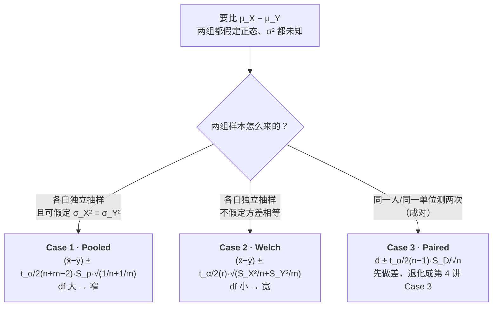

# STA2002 概率与统计 II · 第 5 讲笔记
## Confidence Interval II（置信区间 II）

> 授课：Zhenxing Guo、Ka Wai Tseng（香港中文大学（深圳）数据科学学院，2026 年 9 月）
> 教材：Hogg, Tanis & Zimmerman (2015) *Probability and Statistical Inference*, 9th ed., Pearson
> 对应教材章节：§7.2、§7.3、§7.4（讲义第 2 页明确给出 "Suggested reading: Chapter 7.2, 7.3 and 7.4 of the textbook"）
> 材料构成：讲义 `Lecture5 - Confidence Interval II.pdf`（**31 页**）+ **本讲课堂板书**（**3 张**，2026-09-23 分三批补发：板书 01 收于 11:21（Case 1）、板书 02 收于 11:26（Case 2）、板书 03 收于 11:37（Case 3 配对）；**原图均已归档到 `img/`，清单见 §12**）。**本讲的材料只有讲义与板书**，因此笔记**不包含任何超出这两份材料的内容**；凡属我补充、复算或模拟的部分，均用 **【补】** 标出，并在文末诚实备注中逐条列出。
> **组织方式**：正文**按讲义（PPT）的页序**撰写，**板书内容就地融入对应位置**并用 **【板书 NN】** 标出（编号对应 §12 的原图清单）。**来源标注约定见 §0**。讲义全部 31 页中，凡含公式、数值或图表的页面都已渲染成图片逐张核对；三张板书按区域裁切放大 3–8 倍逐行读取。

---

## 0. 本讲地图（先说清楚这一讲在干什么）

第 4 讲交付了**一个均值 $\mu$** 的置信区间，方法是"枢轴量（pivot）三步走"：造比值 → 写概率 → 反解。本讲**没有发明任何新方法**，它把同一个模板套到三件新事情上，最后再加一个**反着问**的问题。

讲义第 2 页把本讲的范围写得非常清楚：

> In this lecture we will continue our discussion on confidence intervals.
> Our focus today is on:
> - Confidence intervals for difference of two means
> - Confidence intervals for proportions
> - Sample size determination for a given margin of error
> Suggested reading: Chapter 7.2, 7.3 and 7.4 of the textbook.

三句话对应本讲的三大块，加上一块收尾：

| 讲义页 | 内容 | 本笔记 |
| --- | --- | --- |
| 第 2 页 | Introduction：本讲要交付什么 | §1 |
| 第 3 页 | 两均值之差的 CI：三条路的分岔 | §2 |
| 第 4–5 页 | **Case 1** Pooled $t$-interval + 例题 | §3 |
| 第 6–8 页 | **Case 2** Welch's $t$-interval + 例题 | §4 |
| 第 9–15 页 | **Case 3** Paired $t$-interval（定义 / 定理 / 证明 / 例题） | §5 |
| 第 16 页 | 三种区间的比较 | §5.7 |
| 第 17 页 | 发型设计题的答案 | §5.8 |
| 第 18–21 页 | **比例**的 CI（单总体） | §6 |
| 第 22–24 页 | **两比例之差**的 CI | §7 |
| 第 25–31 页 | **样本量确定**（均值 / 比例） | §8 |
| — | **【板书 01】Case 1 的两栏推导板**：一般两正态 $\to$ 补上等方差假设 $\to$ pooled pivot——**讲义无对应页**，它是第 4 页那个定理的推导过程 | §3.2 |
| — | **【板书 02】Welch 自由度 $r$ 的矩匹配推导**——**讲义无对应页**（讲义第 6 页只写 "where $r=\cdots$"） | §4.2、§4.4 |
| — | 速查表 / 核心直觉 / 术语对照 / 板书原图 / 诚实备注 | §9–§13 与文末 |

**一句话概括整讲的结构：第 4 讲的开关被换掉了。**

第 4 讲的分类开关是"分布假设 × $\sigma^2$ 是否已知"，得出四格。本讲的三个 case（Pooled / Welch / Paired）**分类标准完全不同**——它们分的是**两个样本之间的结构关系**（独立还是配对、方差是否相等），而不是分布假设。

> [!IMPORTANT]
> **有一件事必须点出来，因为它在讲义里只是散落在括号中、从没明说：本讲三个 case 的 $\sigma^2$ 全都是未知的。**
>
> 讲义第 3 页的三个 case 分别是：
> 1. Pooled：$\ldots$ independent，$\sigma_X^2=\sigma_Y^2=\sigma^2$ **but $\sigma^2$ is unknown**；
> 2. Welch：independent，$\sigma_X^2\ne\sigma_Y^2$ **are both unknown**；
> 3. Paired：$\ldots$ dependent，$\sigma_X^2$ and $\sigma_Y^2$ **are unknown**。
>
> 也就是说，第 4 讲那个"$\sigma^2$ 已知 / 未知"的开关在本讲**被彻底关掉了**——实际中比较两组时方差几乎从来不知道。所以**本讲所有关于均值的区间都用 $t$ 分布，没有一个是 $z$ 版本**（只有后面比例那一块因为走 CLT 才用 $z$）。知道这一点有用：做题时如果看到"两样本均值的 CI"却在纠结 $\sigma$ 用 $z$ 还是 $t$，答案是**不用纠结，本讲一律 $t$**。

**同一副骨架，五个新对象。** 把本讲的五个区间排在一起看，它们的差别只有"估计量、标准误、参考分布"三格：

| 要估的参数 | 点估计 | 标准误（SE） | 参考分布 | 讲义页 |
| --- | --- | --- | --- | --- |
| $\mu_X-\mu_Y$（等方差） | $\bar X-\bar Y$ | $S_p\sqrt{\dfrac1n+\dfrac1m}$ | $t(n+m-2)$ | 4–5 |
| $\mu_X-\mu_Y$（不等方差） | $\bar X-\bar Y$ | $\sqrt{\dfrac{S_X^2}{n}+\dfrac{S_Y^2}{m}}$ | $t(r)$，$r=\lfloor\cdot\rfloor$ | 6–8 |
| $\mu_X-\mu_Y$（配对） | $\bar D$ | $\dfrac{S_D}{\sqrt n}$ | $t(n-1)$ | 9–15 |
| $p$（单比例） | $\hat p$ | $\sqrt{\dfrac{\hat p(1-\hat p)}{n}}$ | $z$（CLT 近似） | 18–21 |
| $p_1-p_2$ | $\hat p_1-\hat p_2$ | $\sqrt{\dfrac{\hat p_1(1-\hat p_1)}{n_1}+\dfrac{\hat p_2(1-\hat p_2)}{n_2}}$ | $z$（CLT 近似） | 22–24 |

**最后一块（样本量确定）是唯一"反着用公式"的部分。** 前面所有内容都是"给定 $n$ 和 $1-\alpha$，区间多宽"；第 25–31 页反过来问"想让区间宽度不超过 $\epsilon$，$n$ 至少是多少"。这个反向问题的形式很简单（把宽度公式解出 $n$），但讲义特意指出了它的困难：**公式右边含未知的量，而那个未知的量本来是要靠样本才能估出来的**（$\sigma$ 不知道、$\hat p$ 不知道、$t$ 的自由度不知道）。整个第 25–31 页其实在讲"这些循环依赖怎么处理"。

**讲义的七个例题（本笔记全部独立复算过，见 §9 与文末）**：

| 例题 | 主题 | 讲义页 | 结果 |
| --- | --- | --- | --- |
| 例 1 | 两所高中标准化考试成绩（Pooled） | 5 | $[-3.65,\ 9.05]$ |
| 例 2 | 同一数据改用 Welch | 7–8 | $[-4.68,\ 10.08]$（**含一处讲义笔误，见 §4.3**） |
| 例 3 | 红绿灯反应时间（Paired），并在同一数据上算齐三种区间 | 13–15 | $[-0.1265,0.0015]$ / $[-0.1857,0.0607]$ / $[-0.1865,0.0615]$ |
| 例 4 | 投票支持率（单比例） | 18、21 | $[0.475,\ 0.579]$ |
| 例 5 | 男女生玩游戏比例之差 | 24 | $[0.17,\ 0.23]$ |
| 例 6 | 心理学记忆测试所需样本量 | 27 | $n=139$ |
| 例 7 | 公寓出售数量调查所需样本量 | 30–31 | $n=650$ |

**来源标注约定**：

- 无标记 → 讲义原文或对讲义的直接展开；
- **【板书 NN】** → 来自课堂板书（**3 张**原图见 §12，编号按**收到时刻**排：01 = Case 1、02 = Case 2、03 = Case 3），后附编号与板面；
- **【补】** → 讲义与板书都没有，由我补充、复算或模拟（文末诚实备注逐条列出）。

---

## 1. 本讲要交付的三件事（讲义第 2 页）

讲义第 2 页只用了三行 bullet，没有展开。这里把三件事的定位讲清。

**第一件：两均值之差 $\mu_X-\mu_Y$ 的区间。** 这是本讲篇幅最大的一块（第 3–17 页，占了一半）。它要回答的典型问题是：

> 大高中的标准化考试平均分，比小高中高多少？

注意问题里的"高多少"——**问的是差值，不是两个各自的值**。这与第 4 讲的"估一个均值"相比，参数从 1 维变成了 2 维（两个未知均值之差），但**估计量还是样本均值的线性组合**（$\bar X-\bar Y$），所以第 4 讲那套"标准化 → 反解"的技术可以直接用。真正的麻烦不在数学，而在**两个样本的结构关系有几种可能**（独立/配对、方差相等/不等），于是有三种区间公式。

**第二件：比例 $p$ 的区间。** 讲义第 18 页的引子是一个政治民调：$n=351$ 个选民里 $y=185$ 个支持候选人 A，问支持率 $p$ 的区间。

这里有一个**能让整块内容瞬间变简单**的观察，讲义没有明说，但它的推导里处处在用：

> [!TIP]
> **比例 $p$ 就是一个均值。** 把"支持 A"编码成 $X_i=1$、"不支持"编码成 $X_i=0$，那么 $X_i\sim\mathrm{Bernoulli}(p)$，而 $p=E[X_i]$——**$p$ 恰好是这个 Bernoulli 总体的均值**。于是"估比例"和"估均值"是同一件事，$\hat p=\bar X$ 就是样本均值。
>
> 这个视角一次解释了三件本来显得零散的事：
> 1. **为什么区间长成 $\hat p\pm z\sqrt{\hat p(1-\hat p)/n}$**——它就是"估计量 $\pm$ 临界值 $\times$ 标准误"，和第 4 讲完全一样；只是均值的标准误是 $\sigma/\sqrt n$，而 Bernoulli 的方差碰巧是 $p(1-p)$，所以标准误是 $\sqrt{p(1-p)/n}$。
> 2. **为什么这里用的是 $z$ 而不是 $t$**——Bernoulli 不是正态分布，用不了"正态 + 卡方"那条路（出不来 $t$）；只能靠**中心极限定理（Central Limit Theorem, CLT）**把 $\hat p$ 近似成正态，所以用 $z$。
> 3. **为什么区间是"近似"的**——第 4 讲的 Case 1/3 是精确的（$z$、$t$ 都是精确分布），而这里从 CLT 开始就带了近似，后面还要再替换一次未知的 $p$，**两层近似叠在一起**。

**第三件：样本量确定（sample size determination）。** 讲义第 25 页把动机写得很直白：

> Trade-off in study design
> - Increase sample size: higher cost
> - Decrease sample size: lower precision in the estimation
> To meet a given level of precision, what is the minimum sample size needed?

这是一个**设计问题**，不是分析问题——它在数据收集之前就要回答，而且答案直接决定钱花多少。第 25–31 页给了三个公式：均值（$\sigma$ 已知）、均值（$\sigma$ 未知）、比例。

**三块之间的技术联系**：

- 第一块和第二块共用同一副骨架（估量 $\pm$ 临界值 $\times$ SE），只是"估计量是什么、SE 长什么样"不同；
- 第三块是把前两块的宽度公式**反过来解**，所以它必须建立在第一、二块已经讲清的基础上；
- 三块都用同一个报告习惯：**区间 = 点估计 $\pm$ 误差范围（margin of error）**，而"误差范围"就是半宽。第 4 讲已经把"估计误差 $E:=|\bar X-\mu|$"定义成半宽（第 4 讲笔记 §4.5），本讲第 25 页把这个名字正式接了过来。

---

## 2. 两均值之差：三条路的分岔（讲义第 3 页）

讲义第 3 页原文：

> Suppose that we have two populations from which we draw i.i.d. random samples:
> $$X_1,\ldots,X_n\sim N(\mu_X,\sigma_X^2),\qquad Y_1,\ldots,Y_m\sim N(\mu_Y,\sigma_Y^2)$$
> How to construct confidence intervals for $\mu_X-\mu_Y$, the difference between the two population means?
> Consider three cases:
> 1. **Pooled $t$-interval**: $X_1,\ldots,X_n$ and $Y_1,\cdots,Y_m$ are independent. $\sigma_X^2=\sigma_Y^2=\sigma^2$ but $\sigma^2$ is unknown.
> 2. **Welch's $t$-interval**: $X_1,\ldots,X_n$ and $Y_1,\cdots,Y_m$ are independent. $\sigma_X^2\ne\sigma_Y^2$ are both unknown.
> 3. **Paired $t$-interval**: $X_i$ and $Y_i$ are dependent for each $i$, but pairs $(X_i,Y_i)$ are independent. $\sigma_X^2$ and $\sigma_Y^2$ are unknown.

### 2.1 为什么是三个 case，而不是两个

初看会觉得案例 1、2 都是"独立"，为什么要拆两个？拆的理由是**它们需要的假设强度不同**：

- **Pooled** 需要多一个假设（$\sigma_X^2=\sigma_Y^2$）。这个额外假设的**回报**是：两组的离差信息可以合起来估同一个 $\sigma^2$，自由度变成 $n+m-2$（更大），于是**区间更窄**。
- **Welch** 不要这个假设（更稳妥），**代价**是自由度只能算出一个偏小的 $r$，临界值更大，**区间更宽**。

**这就是本讲第一条经济规律：假设越弱，区间越宽。** 讲义第 8 页末尾那句 "In comparison, the two-sample pooled $t$-interval is $[-3.65,9.05]$" 就是在让你看这个代价——同一个数据集，Welch 的区间比 Pooled 宽了大约 0.4（半宽 $7.38$ 对 $6.35$）。

而 **Case 3（Paired）和另外两个根本不在一个维度上**：它不是"方差假设不同"，而是**抽样设计不同**。前两个 case 里 $\bar X$ 和 $\bar Y$ 来自两批互不相干的人；Case 3 里 $X_i$ 和 $Y_i$ 是**同一个人/同一个单位**的两次测量。这是"数据怎么来的"的差别，不是"假设强弱"的差别——所以配对的收益（和风险）在性质上与前两个不同（见 §5.7）。

### 2.2 决策图

三条路怎么走，画成决策树是这样：

> [!NOTE]
> **这张决策图是我整理的，讲义没有画。** 讲义第 3 页只给了三个 case 的并列陈述，没有给"怎么选"的流程；第 17 页虽然用发型题把两条设计路线指出来了，但那是在讲完三个 case **之后**才回头做的（见 §5.8）。

### 2.3 实际该选哪一个 【补】

讲义把三个 case 并列摆出，但没有给选择建议。实际工作中的做法是：

**（1）配对与否是"设计决定的"，不是"数据决定的"。** 如果数据本来就是同一个人前后两次测量（服药前后、上课前后、左右手），**必须**用 Paired，而且**不能**改用另外两个——把配对数据拆成两组独立数据会把信息浪费掉（量化见 §5.7）。反过来，如果数据是两批不同的人，**配对区间根本不适用**——$D_i=X_i-Y_i$ 里的那个减法没有意义，因为 $X_i$ 和 $Y_i$ 之间没有任何对应关系。

**（2）在 Pooled 和 Welch 之间，现代统计实践的默认建议是 Welch。** 理由有两条：

- 当方差**真的相等**时，Welch 的损失很小。我算过：$n=m$ 且方差相等时，Welch 的自由度 $r$ 恰好等于 $n+m-2$，两个区间**完全相同**（$n=8$ 时都是 $t_{0.025}(14)=2.1448$，$n=30$ 时都是 $t_{0.025}(58)=2.0017$）；$n\ne m$ 时才会略有差别，比如 $n=9,m=15$ 时 Welch 只宽 **2.2%**（$t_{0.025}(16)=2.1199$ 对 $t_{0.025}(22)=2.0739$）。
- 当方差**不相等**时，Pooled 的失败可以非常剧烈——我在 §5.7 会给一个覆盖率掉到 **0.58** 的模拟。**风险是不对称的：Welch 的代价最多几个百分点，Pooled 的代价可能是整个区间失效。**

**（3）传统做法是"先做方差齐性检验（$F$ 检验 / Levene 检验），再决定用哪个"。** 这个做法现在被认为有问题（检验的显著性水平会影响后续区间的性质，属于"用数据选模型"），但很多教材和软件仍然这么做，考试里可能遇到。**知道它的存在，但别把它当最佳实践。**

---

## 3. Case 1：Pooled $t$-interval（讲义第 4–5 页）

### 3.1 定理

讲义第 4 页原文：

> **Theorem.** Let $X_1,\ldots,X_n \stackrel{i.i.d.}{\sim}N(\mu_X,\sigma^2)$ and $Y_1,\ldots,Y_m \stackrel{i.i.d.}{\sim}N(\mu_Y,\sigma^2)$ be independent random variables. Then a $100(1-\alpha)\%$ CI for $\mu_X-\mu_Y$ is
> $$\bar X-\bar Y\pm t_{\alpha/2}(n+m-2)S_p\sqrt{\frac1n+\frac1m},$$
> where $S_p^2$ is the pooled estimator of $\sigma^2$:
> $$S_p^2=\frac{(n-1)S_X^2+(m-1)S_Y^2}{n+m-2}=\frac{\sum_{i=1}^n(X_i-\bar X)^2+\sum_{i=1}^m(Y_i-\bar Y)^2}{n+m-2}.$$
> It can be shown that $S_p^2$ is an unbiased estimator of $\sigma^2$.

> **这个定理是怎么来的，见 §3.2（板书 01）。** 那里用板书的两栏结构把推导重排了一遍——**右栏从一般的两个正态问起、左栏作答**，比讲义多讲清楚两件事：等方差假设是**后加**的（这就是 Welch 存在的理由），以及自由度 $n+m-2$ 是**两个卡方相加**得来的。

逐项拆解这个定理。

**（1）两个样本方差 $S_X^2$、$S_Y^2$ 的定义。** 按第 3 讲的约定（第 3 讲笔记 §3.4），样本方差的分母是 $n-1$：
$$S_X^2=\frac{1}{n-1}\sum_{i=1}^n(X_i-\bar X)^2,\qquad S_Y^2=\frac{1}{m-1}\sum_{i=1}^m(Y_i-\bar Y)^2.$$
**注意 $S_X^2$ 和 $S_Y^2$ 是两个不同的随机变量**（来自两批数据），它们各自是 $\sigma^2$ 的无偏估计（因为假设 $\sigma_X^2=\sigma_Y^2=\sigma^2$）——这是"可以合并"的前提。

**（2）$S_p^2$ 为什么叫"pooled（合并的）"。** 看它的第二种写法：
$$S_p^2=\frac{\sum_{i=1}^n(X_i-\bar X)^2+\sum_{i=1}^m(Y_i-\bar Y)^2}{n+m-2}=\frac{\text{SSE}_X+\text{SSE}_Y}{(n-1)+(m-1)}.$$
**分子是把两组的离差平方和加在一起，分母是把两组的自由度加在一起。** 这就是"合并"的含义——它把两份数据当成同一批数据的两个部分来处理。

**（3）为什么合并能换到好处（这是本 case 的核心直觉）。** 因为假设了 $\sigma_X^2=\sigma_Y^2=\sigma^2$，两组的离差平方和其实都在估**同一个** $\sigma^2$：
$$E[\text{SSE}_X]=(n-1)\sigma^2,\qquad E[\text{SSE}_Y]=(m-1)\sigma^2.$$
把两个独立的估计加权平均，得到的是一个**自由度更大**的估计——而 $t$ 分布的自由度越大、临界值越小（$t_{0.025}(22)=2.074$ 比 $t_{0.025}(16)=2.120$ 小），**区间就越窄**。**"合并"买到的就是这个：更窄的区间。**

**（4）无偏性的证明（讲义说 "It can be shown"，没给证明）【补】。** 三行：

$$E[S_p^2]=\frac{(n-1)E[S_X^2]+(m-1)E[S_Y^2]}{n+m-2}=\frac{(n-1)\sigma^2+(m-1)\sigma^2}{n+m-2}=\sigma^2.\qquad\checkmark$$

**这其实就是 $S_p^2$ 可以写成"两个无偏估计的加权平均"的直接结果**（权重 $\frac{n-1}{n+m-2}$ 与 $\frac{m-1}{n+m-2}$，和为 1）。这也解释了为什么分母必须是 $n+m-2$ 而不是别的数——它是为了让上式成立。**分母上那个 $-2$ 不是拍脑袋来的，是无偏性逼出来的。**

**（5）为什么这个比值服从 $t(n+m-2)$。** 分子：
$$\bar X-\bar Y-(\mu_X-\mu_Y)\sim N\!\left(0,\ \sigma^2\left(\frac1n+\frac1m\right)\right),$$
因为 $\bar X\sim N(\mu_X,\sigma^2/n)$、$\bar Y\sim N(\mu_Y,\sigma^2/m)$，且两组独立（独立正态变量的差仍是正态、方差相加）。标准化后：
$$\frac{\bar X-\bar Y-(\mu_X-\mu_Y)}{\sigma\sqrt{1/n+1/m}}\sim N(0,1).$$
再叠上第 3 讲留下的分布事实（第 3 讲笔记 §3.6、第 4 讲笔记 §6.4）：两组独立 + 正态，所以
$$\frac{\text{SSE}_X+\text{SSE}_Y}{\sigma^2}\sim\chi^2(n+m-2),$$
且它与 $\bar X-\bar Y$ **独立**（正态下"样本均值与样本方差独立"这条性质，对两组各自成立，再由两组独立传递过去）。于是按 $t$ 分布的定义（$T=Z/\sqrt{V/\nu}$）：
$$\frac{\bar X-\bar Y-(\mu_X-\mu_Y)}{S_p\sqrt{1/n+1/m}}\sim t(n+m-2).$$

> [!IMPORTANT]
> **注意 $\sigma$ 在最后一步被约掉了——这是整个 case 能成立的关键，也是第 4 讲 Case 3 那个机制的翻版。** 分子里的 $\sigma\sqrt{1/n+1/m}$ 除以分母里的 $\sigma\sqrt{1/n+1/m}$ 恰好等于 1。所以**我们不需要知道 $\sigma$，只需要知道 $S_p$**——"$\sigma$ 未知也能做区间"的秘密就在这里（第 4 讲笔记 §6.4 有同样的推导，可以对照看）。

**（6）这个定理的四个前提，一个都不能少**：

| 前提 | 用在哪一步 | 违反的后果 |
| --- | --- | --- |
| 两组**独立** | 差的方差 = 方差之和 | 变成配对问题，必须用 Case 3 |
| 两组都**正态** | $\bar X-\bar Y$ 正态 + $\text{SSE}/\sigma^2\sim\chi^2$ + 独立性 | 精确性失效；$n,m$ 大时可靠 CLT 近似 |
| **方差相等** $\sigma_X^2=\sigma_Y^2$ | $S_p^2$ 无偏 + $\text{SSE}_X+\text{SSE}_Y$ 是单个卡方 | **严重**：区间可能过窄（覆盖不足）也可能白宽（见 §5.7） |
| $\sigma^2$ **未知** | 用 $S_p$ 替 $\sigma$，把 $z$ 换成 $t$ | 若 $\sigma$ 真已知，用 $z_{\alpha/2}$ 会更窄、更精确 |

### 3.2 定理是怎么摆出来的：板书的两栏结构 【板书 01】

**这一节不引入新定理**，讲的是"§3.1 那个定理是怎么推导出来的"。**板书的摆法比讲义清楚**——讲义直接把定理和 $S_p^2$ 的定义端出来，板书则先摆一个**更一般的模型**，再把等方差当成"额外加的一步"。这个顺序值得单独看一遍，因为它解释了 **Case 2（Welch）为什么会存在**。

**板书原文（逐行转写）**。白板被一条竖线分成两栏，两栏是一问一答：

$$
\text{右栏（提问）}\qquad
\begin{aligned}
& \textbf{Suppose}\quad X \sim N(\mu_X,\sigma_X^2),\qquad Y \sim N(\mu_Y,\sigma_Y^2) \\
& \qquad \mu_X-\mu_Y \quad\text{（目标；板书在这一行下面画了着重线）} \\[3pt]
& X_1,\ldots,X_n\ \text{iid of } X, \qquad Y_1,\ldots,Y_m\ \text{i.i.d. of } Y. \\[3pt]
& \bar X \sim N\!\left(\mu_X,\frac{\sigma_X^2}{n}\right),\qquad
  \bar Y \sim N\!\left(\mu_Y,\frac{\sigma_Y^2}{m}\right) \\[3pt]
& \bar X-\bar Y \sim N(\mu_X-\mu_Y,\ \boxed{?}) \\[3pt]
& \frac{(n-1)S_X^2}{\sigma_X^2}\sim\chi^2(n-1),
  \qquad \frac{(m-1)S_Y^2}{\sigma_Y^2}\sim\chi^2(m-1)
\end{aligned}
$$

$$
\text{左栏（作答）}\qquad
\begin{aligned}
& (1)\quad X \perp Y \\
& \bar X-\bar Y \sim N\!\left(\mu_X-\mu_Y,\ \frac{\sigma_X^2}{n}+\frac{\sigma_Y^2}{m}\right) \\[4pt]
& (2)\quad \sigma_X^2=\sigma_Y^2=\sigma^2 \\
& \Rightarrow\ \left[(\bar X-\bar Y)\pm t_{\frac{\alpha}{2}(n+m-2)}\,S_p\sqrt{\tfrac1n+\tfrac1m}\right]
  \qquad\textbf{Pooled t-interval} \\[4pt]
& \frac{\bar X-\bar Y-(\mu_X-\mu_Y)}{\sigma\sqrt{\frac1n+\frac1m}}\sim N(0,1) \\[4pt]
& \frac{(n-1)S_X^2+(m-1)S_Y^2}{\sigma^2}\sim\chi^2(n+m-2) \\[4pt]
& \hat T=\frac{(\bar X-\bar Y)-(\mu_X-\mu_Y)}{S_p\sqrt{\frac1n+\frac1m}},\qquad
  S_p^2=\frac{(n-1)S_X^2+(m-1)S_Y^2}{n+m-2}
\end{aligned}
$$

（**版面记号**：板书在右栏的样本行处画了**两个花括号**、把样本行与"样本均值的分布"连起来，又画了**两条斜箭头**指向最后那两个卡方事实；左栏的 $(2)$ 有一个 $\Rightarrow$ 直接指向区间公式。这些是连接记号，不改变任何式子的含义。）

**两栏的对应关系**（右栏每问一句，左栏答一句）：

| 右栏（问） | 左栏（答） | 靠什么成立 |
| --- | --- | --- |
| $\bar X-\bar Y \sim N(\mu_X-\mu_Y,\ ?)$ 里的那个 "?" | $\dfrac{\sigma_X^2}{n}+\dfrac{\sigma_Y^2}{m}$ | **独立**（$X\perp Y$）+ 正态的差仍是正态、方差相加。**不需要等方差** |
| $(n-1)S_X^2/\sigma_X^2\sim\chi^2(n-1)$ 与 $(m-1)S_Y^2/\sigma_Y^2\sim\chi^2(m-1)$ 这两个事实 | 两者相加 $\sim\chi^2(n+m-2)$ | **需要 $\sigma_X^2=\sigma_Y^2=\sigma^2$**——否则两个分母不同，根本不能相加 |
| （把上面两块凑成 $t$） | $\hat T\sim t(n+m-2)$，区间随之得到 | $t$ 的定义 $Z/\sqrt{V/\nu}$（第 4 讲笔记 §6.4） |

**板书比讲义多讲清楚的三件事**（这也是我把这一节单列的理由）：

**第一，等方差假设是"后加的"，不是出发点。** 右栏的模型是**一般**的两个正态——$\sigma_X^2$ 与 $\sigma_Y^2$ 各写各的；到了左栏 $(2)$ 才令两者相等。**这一步正是 Case 2（Welch）存在的理由**：如果模型本来就把等方差写进去，"不等方差"这个 case 就无从谈起了。

**第二，那个 "?" 把问题问出来了。** 讲义直接给 $\bar X-\bar Y$ 的分布，板书把它写成 $N(\mu_X-\mu_Y,\ \boxed{?})$——**一个问号占位**。这是在提示读者：这个方差是**推出来的**，不是一个要背的东西。

**第三，自由度是"先分开、再相加"来的。** 板书写的是 $\chi^2(n-1)$ 与 $\chi^2(m-1)$ **两个**式子，再由"两个**独立**的卡方相加、自由度相加"得到 $\chi^2(n+m-2)$。**讲义直接给合并后的 $n+m-2$，把这一步跳过了**——而这恰恰是最容易记错的地方（写成 $n+m-1$、$\max(n,m)$ 之类）。§3.1 第 5 点补的正是这一步。

> [!IMPORTANT]
> **一条只有把两栏并排看才会浮现的观察：等方差假设只用在后半段。**
>
> 右栏那个 "?" 的答案 $\frac{\sigma_X^2}{n}+\frac{\sigma_Y^2}{m}$ **完全不依赖等方差**——它只靠"两组独立 + 各自正态"。**真正被等方差卡住的是"两个卡方能不能相加"这一步**：分母必须同为 $\sigma^2$，否则 $\frac{(n-1)S_X^2}{\sigma_X^2}+\frac{(m-1)S_Y^2}{\sigma_Y^2}$ 不是卡方。
>
> 所以准确的说法是：**等方差假设影响的是"能不能用 $S_p$ 造出一个精确的 $t$ 枢轴量"，而不是"两个均值的差服不服从正态"。前半段谁都不需要它。**（Welch 走的正是"前半段照用、后半段绕开"这条路：不合并方差，改用 $\frac{S_X^2}{n}+\frac{S_Y^2}{m}$ 的近似自由度，见 §4。）

**我的模拟核验（$B=800{,}000$，Python + NumPy）**。本机默认 venv 里没有 SciPy，$t$ 的 CDF 与分位数是我用不完全 Beta 连分式 + 二分法自写的，先用 $t_{0.025}(22)=2.073873$ 校准过：

| 核验对象 | 做法 | 结果 |
| --- | --- | --- |
| 板书最后一行 $\hat T\sim t(n+m-2)$ | $n=9$、$m=15$、$\sigma_X=\sigma_Y=1$，逐组按板书式子算 $\hat T$，与 $t(22)$ 逐点比 CDF（$c=-3,\ldots,3$） | **最大偏差 $0.00056$**，而该样本量下的蒙特卡洛标准误也是 $0.00056$；2.5%/97.5% 分位实测 $-2.0765/+2.0783$（$t(22)$ 为 $\mp2.0739$）→ **板书那一行成立** |
| 卡方相加（自由度 $n+m-2$） | 同上设定，算 $\frac{(n-1)S_X^2+(m-1)S_Y^2}{\sigma^2}$ | 实测均值 $22.0053$、方差 $43.95$（理论 $22$ 与 $2\times22=44$）；两个分量分别为 $8.00$ 与 $14.00$（理论 $8$、$14$）→ **"自由度相加"成立** |
| 右栏那个 "?" 的答案 | 三组不同方差设定下估 $\mathrm{Var}(\bar X-\bar Y)$ | 实测 $0.1772$ / $0.7068$ / $1.0708$ 对理论 $\frac{\sigma_X^2}{n}+\frac{\sigma_Y^2}{m}=0.1778$ / $0.7111$ / $1.0667$ → **与方差是否相等无关，始终成立** |
| **不加**等方差会怎样 | $\sigma_X=1,\sigma_Y=3$ 以及反向，仍套用板书的 $\hat T$ | 分位数变成 $\pm1.71$ 与 $\pm2.72$（$t(22)$ 是 $\pm2.07$）——**整个分布都错了**；对区间覆盖率的后果见 §5.7 那张表（$0.9788$ 与 $0.8788$） |

**顺带核实一处被裁掉的内容**：最后一行 $S_p^2=\frac{(n-1)S_X^2+(m-1)S_Y^2}{n+m-2}$ **分母被白板下沿裁掉了**（只能看到开头几个笔画）。我按讲义第 4 页的定义补全——**两者一致，并且用 §3.3 例 1 的数值验过**：$s_p^2=\frac{8(60.76)+14(48.24)}{22}=\frac{1161.44}{22}$，分母正是 $n+m-2=22$。

> [!TIP]
> **这一节与 §5.7 那条建议是同一件事的两面。** 板书把等方差写成"一个后来才加的假设"，而 §5.7 的模拟显示：**这个假设加错了，pooled 区间的覆盖率会掉到 $0.58$**（$n=5,m=25$、$\sigma_X=3,\sigma_Y=1$ 的设计）。所以实际建议就一句——**不确定方差是否相等时默认用 Welch**。

### 3.3 例 1：两所高中的标准化考试（讲义第 5 页）

讲义原文条件（$X$ = 大高中成绩，$Y$ = 小高中成绩，$\sigma_X^2=\sigma_Y^2=\sigma^2$）：

$$n=9,\quad \bar x=81.31,\quad s_x^2=60.76;\qquad m=15,\quad \bar y=78.61,\quad s_y^2=48.24.$$

求 95% 置信区间。讲义解法：

$$t_{0.025}(22)=2.074,\qquad s_p=\sqrt{\frac{8(60.76)+14(48.24)}{22}},$$
$$81.31-78.61\pm2.074\sqrt{\frac{8(60.76)+14(48.24)}{22}}\sqrt{\frac19+\frac1{15}}=[-3.65,\ 9.05].$$

**我的逐步复算**（Python + SciPy，见文末）：

| 步骤 | 计算 | 结果 |
| --- | --- | --- |
| 合并方差 | $s_p^2=\dfrac{8(60.76)+14(48.24)}{22}=\dfrac{1161.44}{22}$ | $52.7927$ |
| 合并标准差 | $s_p=\sqrt{52.7927}$ | $7.2659$ |
| 标准误 | $7.2659\times\sqrt{1/9+1/15}=7.2659\times0.42164$ | $3.0636$ |
| 临界值 | $t_{0.025}(22)$ | $2.073873$ |
| **半宽（margin of error）** | $2.073873\times3.0636$ | $6.3534$ |
| 中心 | $81.31-78.61$ | $2.70$ |
| **区间** | $2.70\pm6.3534$ | $[-3.6534,\ 9.0534]$ |

**与讲义逐位一致（$[-3.65,9.05]$）。**

**怎么读这个结果。** 三件事值得注意：

**第一，区间跨过了 0。** $[-3.65,9.05]$ 里包含 0，所以"两所高中的平均分没有差异"（$\mu_X-\mu_Y=0$）是一个**与数据相容**的假设。这和第 4 讲灯泡（$[1464.42,1491.58]$，不跨任何特殊值）不同——**跨 0 的区间在实践中的读法就是"看不出差别"**。这一点会在后续讲次（假设检验）被形式化，但区间已经把它说清楚了。

**第二，区间很宽——大约 12.7 分。** 原因不是数据差，而是**样本小加上组内波动大**：$s_p\approx7.27$ 分，而 $n=9$、$m=15$ 都不大，$1/n+1/m\approx0.178$ 都不小。想让这个区间窄一半，按第 4 讲的"四倍换一半"（第 4 讲笔记 §4.4），$n,m$ 得各翻大约四倍。

**第三，中心 2.70 两侧不对称地远离 0（左 3.65、右 9.05）。** 这不是异常，只是因为**中心不在 0 上**：2.70 减去 6.35 得 $-3.65$，加上 6.35 得 9.05。**区间的宽度只由 $s_p$、$1/n+1/m$、$t$ 决定，与中心落在哪里无关**——所以"不对称"是中心偏移的自然结果，不是误差的某种不对称。

---

## 4. Case 2：Welch's $t$-interval（讲义第 6–8 页）

### 4.1 定理

讲义第 6 页原文：

> **Theorem (Welch's $t$-interval).** Let $X_1,\ldots,X_n\stackrel{i.i.d.}{\sim}N(\mu_X,\sigma_X^2)$ and $Y_1,\ldots,Y_m\stackrel{i.i.d.}{\sim}N(\mu_Y,\sigma_Y^2)$ be independent. Then an **approximate** $100(1-\alpha)\%$ CI for $\mu_X-\mu_Y$ is:
> $$\bar X-\bar Y\pm t_{\alpha/2}(r)\sqrt{\frac{S_X^2}{n}+\frac{S_Y^2}{m}},$$
> where
> $$r=\left\lfloor\frac{\left(\dfrac{S_X^2}{n}+\dfrac{S_Y^2}{m}\right)^2}{\dfrac{1}{n-1}\left(\dfrac{S_X^2}{n}\right)^2+\dfrac{1}{m-1}\left(\dfrac{S_Y^2}{m}\right)^2}\right\rfloor.$$
> Note that $\lfloor x\rfloor$ is the floor function (greatest integer less than or equal to $x$), say $\lfloor3.4\rfloor=\lfloor3.9\rfloor=3$.

### 4.2 这个公式为什么这么丑，以及 "approximate" 三个字的分量

**标准误很简单：$\sqrt{S_X^2/n+S_Y^2/m}$**，就是把两组的方差各自除以自己的样本量，加起来开根号。第 4 讲里"两组独立 → 差的方差 = 方差之和"这条性质原样适用，只不过每个方差用各自样本的 $S_X^2$、$S_Y^2$ 去替。

**丑的是自由度 $r$。** 要理解它，先看第 4 讲 Case 3 是怎么做的（第 4 讲笔记 §6.4）：那里把 $\sigma$ 换成 $s$ 之后，比值恰好是
$$\frac{\bar X-\mu}{S/\sqrt n}=\frac{Z}{\sqrt{V/(n-1)}},\qquad V=\frac{(n-1)S^2}{\sigma^2}\sim\chi^2(n-1),$$
**分母的形状恰好是"卡方除以自由度"，所以 $t$ 分布是精确的。**

**Case 2 里这个形状没有了。** 因为两组方差不同，$\frac{S_X^2}{n}+\frac{S_Y^2}{m}$ 是**两个不同尺度的卡方型量之和**，它除以真实方差后**不是一个卡方分布**（除非 $\sigma_X^2=\sigma_Y^2$）。所以
$$\frac{\bar X-\bar Y-(\mu_X-\mu_Y)}{\sqrt{S_X^2/n+S_Y^2/m}}$$
**严格来说不服从任何 $t$ 分布。**

**这个自由度的来历：把枢轴量拆成两半（【板书 02】）。** 本讲课堂板书**完整推导了 $r$ 的来源**——这恰好是讲义第 6 页那句 "where $r=\cdots$" 留下的空白。板书的思路只有三步。

**第一步：把分母拆开，让枢轴量显出 $t$ 的形状。** 板书把 $\sqrt{S_X^2/n+S_Y^2/m}$ 写成"$\sigma$ 版的开根号"乘"一个比值开根号"，于是

$$\hat T=\frac{\bar X-\bar Y-(\mu_X-\mu_Y)}{\sqrt{\frac{S_X^2}{n}+\frac{S_Y^2}{m}}}=\frac{\bar X-\bar Y-(\mu_X-\mu_Y)}{\sqrt{\frac{\sigma_X^2}{n}+\frac{\sigma_Y^2}{m}}\ \cdot\ \sqrt{\dfrac{\frac{S_X^2}{n}+\frac{S_Y^2}{m}}{\frac{\sigma_X^2}{n}+\frac{\sigma_Y^2}{m}}}},$$

其中那个比值被板书画了一个**大圈**并标注

$$\frac{\frac{S_X^2}{n}+\frac{S_Y^2}{m}}{\frac{\sigma_X^2}{n}+\frac{\sigma_Y^2}{m}}\ \triangleq\ \frac{U}{\nu},\qquad U\sim\chi^2(\nu).$$

（圈的意思是"**这个量是整个推导的关键**"。）拆开之后，前一个因子恰好是**标准正态**：$\frac{\bar X-\bar Y-(\mu_X-\mu_Y)}{\sqrt{\sigma_X^2/n+\sigma_Y^2/m}}\sim N(0,1)$（第 4 讲 Case 1 已证）。所以 $\hat T$ 的形状是
$$\hat T=\frac{Z}{\sqrt{U/\nu}},\qquad Z\sim N(0,1),$$
**而 $\frac{Z}{\sqrt{U/\nu}}$ 正是 $t(\nu)$ 的定义**（$Z$、$U$ 独立；独立性来自正态下"样本均值与样本方差独立"）。板书写下 $\hat T\xrightarrow{d}t(\nu)$，讲义则用 "approximate" 表达同一件事。**"$\sigma$ 未知也能用"的秘密在这里第二次出现**：$\sigma$ 被拆到某个因子的分母里、不参与最后的形状（和第 4 讲 Case 3 的"$\sigma$ 约分掉"是同一件事的另一种写法）。

**第二步：用矩匹配反解 $\nu$（板书右侧整栏）。** 剩下的问题是"$\nu$ 该取多少"。板书用**前两阶矩**来定：

$$E\!\left\{\frac{\frac{S_X^2}{n}+\frac{S_Y^2}{m}}{\frac{\sigma_X^2}{n}+\frac{\sigma_Y^2}{m}}\right\}=1\ \triangleq\ E\!\left\{\frac{U}{\nu}\right\}=1$$

（因为 $E[S_X^2]=\sigma_X^2$、$E[S_Y^2]=\sigma_Y^2$，分子分母的期望相等；而 $\chi^2(\nu)/\nu$ 的期望恰好是 $1$——**这就是"拿它来冒充"合理的第一个理由**。）

$$\mathrm{Var}\!\left\{\frac{\frac{S_X^2}{n}+\frac{S_Y^2}{m}}{\frac{\sigma_X^2}{n}+\frac{\sigma_Y^2}{m}}\right\}=\frac{\frac{1}{n^2}\mathrm{Var}(S_X^2)+\frac{1}{m^2}\mathrm{Var}(S_Y^2)}{\left(\frac{\sigma_X^2}{n}+\frac{\sigma_Y^2}{m}\right)^2}\ \triangleq\ \mathrm{Var}\!\left(\frac{U}{\nu}\right)=\frac{1}{\nu^2}\cdot2\nu=\frac{2}{\nu}$$

（两个样本独立，所以分子里两项方差可以直接相加；分母是常数。最后一式用了 $\mathrm{Var}(\chi^2(\nu))=2\nu$。）

把 $\mathrm{Var}(S^2)=\frac{2\sigma^4}{n-1}$ 代进去（**这一小步板书没有单独写，是隐含的**，见文末"板书符号说明"第 8 条），并令两边相等：

$$\frac{2}{\nu}=\frac{2\left[\frac{1}{n-1}\left(\frac{\sigma_X^2}{n}\right)^2+\frac{1}{m-1}\left(\frac{\sigma_Y^2}{m}\right)^2\right]}{\left(\frac{\sigma_X^2}{n}+\frac{\sigma_Y^2}{m}\right)^2}\quad\Longrightarrow\quad \nu=\frac{\left(\frac{\sigma_X^2}{n}+\frac{\sigma_Y^2}{m}\right)^2}{\frac{1}{n-1}\left(\frac{\sigma_X^2}{n}\right)^2+\frac{1}{m-1}\left(\frac{\sigma_Y^2}{m}\right)^2}.$$

**注意两个 $2$ 恰好约掉**，所以最终的 $\nu$ 里没有系数 $2$——这也是"权重 $\frac{1}{n-1}$ 从哪来"的答案：它来自 $\mathrm{Var}(S^2)$ 的分母。

**第三步：把 $\sigma^2$ 换成 $S^2$。** 板书的最后一步：

$$\nu=\frac{\left(\frac{\sigma_X^2}{n}+\frac{\sigma_Y^2}{m}\right)^2}{\frac{1}{n-1}\left(\frac{\sigma_X^2}{n}\right)^2+\frac{1}{m-1}\left(\frac{\sigma_Y^2}{m}\right)^2}\ \approx\ \frac{\left(\frac{S_X^2}{n}+\frac{S_Y^2}{m}\right)^2}{\frac{1}{n-1}\left(\frac{S_X^2}{n}\right)^2+\frac{1}{m-1}\left(\frac{S_Y^2}{m}\right)^2}.$$

**右边就是讲义第 6 页那个 $r$（取整之前）。** 板书的 $\approx$ 是讲义那个 $\lfloor\cdot\rfloor$ 的"上游"：先把 $\sigma^2$ 换成 $S^2$（不可算 → 可算），再取整（实数 → 整数）。

**我的数值核验【补】**：用例 2 的数据（$n=9,s_x^2=60.76$；$m=15,s_y^2=48.24$），代入板书最后那个式子：

$$\nu=\frac{(6.7511+3.2160)^2}{\frac{(6.7511)^2}{8}+\frac{(3.2160)^2}{14}}=\frac{99.3433}{6.4360}=15.4357,$$

**与讲义 $r=15.4357\to15$ 逐位一致**——**说明我对板书这条链子的理解是正确的**（如果哪一步读错了，这个数就对不上）。同时这也补上了 §4.4 例 2 那个 $r$ 的出处。

**⚠️ 抄录勘误（你的转写 vs 板书原文）**：你给的转写里有两处会让公式对不上讲义，必须改——**Var 那一行的系数是 $\frac{1}{n^2}$、$\frac{1}{m^2}$（不是 $\frac1n$、$\frac1m$）；$\nu$ 公式分母的权重是 $\frac{1}{n-1}$、$\frac{1}{m-1}$（不是 $\frac1n$、$\frac1m$）**。逐条清单见文末「抄录笔误逐条修正表」。

> [!WARNING]
> **一条对我自己上一版笔记的更正（2026-09-23）。** 本笔记初稿里，我在自己加的【补】块中写过"真实比值的方差约为 $\mathrm{Var}\approx 2\dfrac{(\sigma_X^2/n+\sigma_Y^2/m)^2}{\cdots}$"——**那个式子写反了（分子分母颠倒）**。正确的是
> $$\mathrm{Var}\!\left(\text{ratio}\right)=\frac{2\left[\frac{1}{n-1}\left(\frac{\sigma_X^2}{n}\right)^2+\frac{1}{m-1}\left(\frac{\sigma_Y^2}{m}\right)^2\right]}{\left(\frac{\sigma_X^2}{n}+\frac{\sigma_Y^2}{m}\right)^2}.$$
> 我按例 2 的参数验过：**正确值 $0.12957$**（模拟 $B=400$ 万给 $0.12952$，相符），而旧式算出 $30.87$——**恰好等于 $2\nu$，是把倒数当成了原值**。**这个错误是靠板书纠正的**：板书里 $\mathrm{Var}=2/\nu$ 那一步白纸黑字，反推立刻能发现颠倒。旧说法保留在此，便于核对这次更正是怎么发生的。

**为什么"矩匹配"就能造出一个能用的区间（以及它的残余误差）【补】。** 板书的推导本质上只用了**两个矩**（$E=1$、$\mathrm{Var}=2/\nu$），而 $\chi^2(\nu)/\nu$ 是三阶矩起就有固定取值的分布——**两矩相等并不等于分布相等**。我量化了残余失配（例 2 参数，$B=400$ 万）：

| 指标 | 真实比值的实测值 | $\chi^2(\nu)/\nu$ 的值 | 偏差 |
| --- | --- | --- | --- |
| 均值 | $1.0000$ | $1$ | 匹配（定义如此） |
| 方差 | $0.12952$ | $0.12957$ | 匹配到 $0.04\%$ |
| **偏度** | $\mathbf{0.8636}$ | $0.7186$（理论 $\sqrt{8/\nu}=0.7199$） | **差 $20\%$** |
| **超额峰度** | $\mathbf{1.1878}$ | $0.7687$（理论 $12/\nu=0.7774$） | **差 $55\%$** |
| $2.5\%/97.5\%$ 分位 | $0.4458$ / $1.8390$ | $0.4238$ / $1.8192$ | 尾端差 $2\%\sim5\%$ |

**读法：真正的比值比 $\chi^2(\nu)/\nu$ 更偏、更厚尾。** 所以 Welch 区间在**尾巴**上是有系统偏差的（这也解释了 §4.4 例 2 那个"改正后"区间为什么和"精确"值差一点）。**但它对区间的实用效果很小**——因为 $t$ 区间对分位数的小偏差不敏感，下面的覆盖率模拟就是证据。**一句话总结这条链子：三个等号是"真实的"，两个 $\triangleq$ 和那个 $\approx$ 是"近似的"，后半段的可靠性全靠"两矩匹配得足够好"。**

**"approximate" 到底有多近似。** 讲义用了 "approximate" 这个词，而 Case 1 的定理没有。实测下来，**只要数据真的是正态的，Welch 区间的实际覆盖率非常接近名义值**。我的模拟（名义 95%，$B=40$ 万，正态数据，$\mu_X=\mu_Y=0$）：

| 设计 | Welch 实测覆盖 | Pooled 实测覆盖（对照） |
| --- | --- | --- |
| $n=9,m=15,\sigma_X=1,\sigma_Y=1$（方差相等） | $0.9503$ | $0.9506$ |
| $n=9,m=15,\sigma_X=1,\sigma_Y=3$ | $0.9499$ | **$0.9788$** |
| $n=9,m=15,\sigma_X=3,\sigma_Y=1$ | $0.9485$ | **$0.8788$** |
| $n=5,m=25,\sigma_X=3,\sigma_Y=1$ | $0.9493$ | **$0.5790$** |
| $n=5,m=25,\sigma_X=1,\sigma_Y=3$ | $0.9501$ | **$0.9999$** |

**读法：Welch 在所有五种设计下都稳稳落在 $0.949\pm0.002$，而 Pooled 从 0.58 到 0.9999 全线飘移。** 所以"approximate"这个标签其实**低估了 Welch 的可靠性、也让人误判了 Pooled 的可靠性**——真实情况正好反过来：**危险的是那个用了精确 $t$ 分布的 Pooled。** 这条我放在 §5.7 详细展开。

### 4.3 例 2：同一数据改用 Welch（讲义第 7–8 页）

讲义第 7 页把例 1 的条件换个假设重讲一遍：

> This time we assume $\sigma_X^2\ne\sigma_Y^2$。$\ldots$
> $$n=9\quad \bar x=81.31\quad s_X^2=60.76;\qquad m=15\quad \bar y=78.61\quad s_Y^2=48.24.$$

**数据与例 1 完全相同**，只改了"方差不等"这个假设。第 8 页的解法：

$$r=15,\qquad t_{0.025}(r)=2.131,\qquad \sqrt{\frac{s_X^2}{n}+\frac{s_Y^2}{m}}=\sqrt{\frac{60.76}{9}+\frac{78.61}{15}}=3.4629,$$
$$81.31-78.61\pm2.131\times3.4629=[-4.6794,\ 10.0794].$$

> [!WARNING]
> **讲义第 8 页有一处确凿的抄写错误：$\sqrt{\frac{60.76}{9}+\frac{78.61}{15}}$ 中的 $78.61$ 应该是 $48.24$。**
>
> $78.61$ 是第二组的**均值** $\bar y$，不是第二组的样本方差 $s_Y^2$（$s_Y^2=48.24$ 在第 7 页刚给过）。它在量纲上也说不通：$s_Y^2/m=48.24/15=3.216$ 才是"每样本的方差贡献"，而 $78.61/15=5.241$ 没有任何统计含义。
>
> **改正后**：
> $$\sqrt{\frac{60.76}{9}+\frac{48.24}{15}}=\sqrt{6.7511+3.2160}=\sqrt{9.9671}=3.1571,$$
> $$2.70\pm2.131\times3.1571=2.70\pm6.7291=[-4.0291,\ 9.4291].$$
>
> **即区间应为 $[-4.03,\ 9.43]$，而不是讲义的 $[-4.68,\ 10.08]$。** 我按讲义自己写的数字复算，得到的是 $[-4.6810,10.0810]$，与讲义 $[-4.6794,10.0794]$ 的差异只来自他们用了四舍五入后的 $3.4629$（我用了全精度）——**所以这不是我算错，是讲义那一行的数字抄错了。**

**一个有力的交叉证据，说明这是单点笔误而不是整题算错。** 我检查了自由度：如果那一行真的用了 $78.61$，那么 $r$ 应该算成
$$\frac{(6.7511+5.2407)^2}{\frac{1}{8}(6.7511)^2+\frac{1}{14}(5.2407)^2}=\frac{143.803}{7.6589}=18.776\ \Rightarrow\ \lfloor\cdot\rfloor=18,$$
对应 $t_{0.025}(18)=2.1009$，**但讲义写的是 $r=15$**。而用正确的 $48.24$ 算：$r=15.436\Rightarrow\lfloor\cdot\rfloor=15$ ✓（我复算 $15.435689$）。

> **结论：讲义的 $r=15$、$t_{0.025}(15)=2.131$ 都是对的，只有那个开根号里的 $78.61$ 抄错了。** 这说明整道题的框架没问题，可以放心按"$48.24$"理解。**如果考试照抄讲义那个数，得到的区间会比正确值宽约 10%**（半宽 $7.38$ 对 $6.73$）。

**Welch 区间比 Pooled 宽，宽在哪里。** 把两个区间的三个零件并排看（都用正确数字）：

| | 标准误 | 自由度 | 临界值 | 半宽 |
| --- | --- | --- | --- | --- |
| Pooled（例 1） | $3.0636$ | $22$ | $2.0739$ | $6.3534$ |
| Welch（例 2，改正后） | $3.1571$ | $15$ | $2.1315$ | $6.7291$ |

**两个零件都在往"更宽"的方向走**：标准误大 $3.1\%$（因为 $60.76$ 和 $48.24$ 不同，不能用自由度更大的合并估计），自由度从 22 掉到 15（临界值大 $2.8\%$）。合起来宽 $5.9\%$。**这正是"放松假设要付钱"的价格单。**

### 4.4 关于 floor（向下取整）【补】

讲义特意解释了 $\lfloor x\rfloor$ 是取整函数，但没有说为什么取整、以及往哪边取。四点：

**（1）为什么必须取整。** $t$ 分布的分位数表只对整数自由度有值（$t_{0.025}(15.436)$ 这种查不到）。所以 $r$ 必须变成整数才能查表或算临界值。

**（2）为什么向下取整是"保守"的。** 自由度越小 → $t$ 分布尾巴越厚 → 临界值越大 → 区间越宽 → 实际覆盖概率**不低于**名义值。所以 $\lfloor r\rfloor$ 是在"保证安全"这一侧取整。**这和 §8 里样本量一律向上取整（$139$ 而不是 $138$）是同一个思路：取整的方向永远朝着"更保守"的那一边。**

**（3）但这个保守基本是装饰性的。** $r$ 向下取整最多损失 1 个自由度，对临界值的影响在千分之几的量级（$t_{0.025}(15)=2.1314$ 对 $t_{0.025}(16)=2.1199$，差 $0.5\%$）；而 Welch 的**近似误差本身**（用 $t(r)$ 冒充真实分布）远大于这个。所以**不要以为取了 floor 就"补回"了近似的损失**——真要说保守，Welch 的保守来自它的自由度比 Pooled 小得多（$15$ 对 $22$），而不是那个取整。

**（4）一个提示**：不取整直接用 $t_{\alpha/2}(r)$ 在计算上完全可行（R 的 `qt(0.975, 15.4357)` 照样能算），很多软件就是这么做的，结果甚至更准（因为取整本身也在损失信息）。**讲义要求取整，是为了配合手查表的习惯。**

**（5）取整这一步的"上游"在板书上【板书 02】。** §4.2 里板书那条链子的末尾是 $\nu\ \approx\ \frac{(S_X^2/n+S_Y^2/m)^2}{\frac{1}{n-1}(S_X^2/n)^2+\frac{1}{m-1}(S_Y^2/m)^2}$——**这就是"取整之前"的 $r$**。所以完整的链条是四步：

$$\underbrace{\nu=\frac{(\sigma^2\text{ 版})}{(\sigma^2\text{ 版})}}_{\text{矩匹配解出}}\ \xrightarrow{\ \approx\ \text{换 }\sigma^2\to S^2\ }\ \underbrace{\nu=\frac{(S^2\text{ 版})}{(S^2\text{ 版})}=15.4357}_{\text{可算}}\ \xrightarrow{\ \lfloor\cdot\rfloor\ \text{取整}\ }\ r=15\ \xrightarrow{\ \text{查表}\ }\ t_{0.025}(15)=2.131.$$

**四个箭头里有三个是"为了能用"而做的让步**（不可算→可算、实数→整数、查表），而它们**全都朝保守方向偏**——这正是 §4.2 最后那张表要说的事：Welch 的可靠性不是靠某一步"精确"挣来的，而是靠每一步的偏差都不大、且方向一致。

---

## 5. Case 3：Paired $t$-interval（讲义第 9–15 页）

### 5.1 什么是配对样本（讲义第 9 页）

讲义第 9 页的定义：

> **Definition: paired samples.** Two samples are said to be **paired** when each data point in the first sample is matched and is related to a unique data point in the second sample.

讲义给的两个典型场景：

- **减肥药的有效性**：同一批参与者在**服药前**与**服药后**的体重；
- **在线课程的有效性**：同一批参与者在**上课前**与**上课后**的测验成绩。

**"matched and related to a unique data point" 这句话在说什么。** 它要求两次测量之间存在**一一对应**：第 1 个人服药前对应第 1 个人服药后，第 2 个人对应第 2 个人……**这个对应关系是配对方法的全部基础**，因为配对区间的核心操作是**逐对相减** $D_i=X_i-Y_i$。如果两组人之间没有这种对应（比如第 1 个人是甲组的、第 2 个人是乙组的，两人毫无关系），相减就没有任何意义。

**配对在统计上到底带来了什么？** 这一点讲义没有展开，但它是理解全节的关键：

> [!IMPORTANT]
> **配对的目的是"消掉个体之间的差异"。**
>
> 以减肥药为例。有人天生体重就高（比如 90 kg），有人天生低（比如 50 kg）。如果我用"服药后组 vs 服药前组"来比——即使药完全无效——两组的个体构成稍有不同（比如高体重的人恰好多分了几个到"服药后"组），均值就会差出好几公斤。**这个"个体差异"造成的噪声，把真正的药效完全盖住了。**
>
> 配对的做法是**同一个人自己和自己比**：$D_i = \text{服药后}_i-\text{服药前}_i$。这个差值里，"这个人天生体重多少"**被减掉了**——它同时出现在 $X_i$ 和 $Y_i$ 里，一减就没了。剩下的 $D_i$ 只包含"药效 + 这一次测量的随机误差"。
>
> 用 §5.4 的公式说就是：$\mathrm{Var}(D)=\sigma_X^2+\sigma_Y^2-2\rho\sigma_X\sigma_Y$。个体差异同时存在于 $X$ 和 $Y$ 里，所以 $\rho$ 很大，减掉的那一项 $2\rho\sigma_X\sigma_Y$ 也很大，**$D$ 的方差可以远小于 $\sigma_X^2+\sigma_Y^2$。** 方差小 → 标准误小 → 区间窄。**这就是配对的全部收益。**

### 5.2 两种设计的差别：发型题（讲义第 10 页）

讲义第 10 页给了一个很有意思的设计情境（页面附带一张人物照片，我这里不引用）：

> **Example: New hair style for Mr. Trump**
> Let's try to recommend a new hair style to Mr. Trump, "going chestnut" or "daddy look". Design a study to seek public opinions on these two hair styles.
>
> - **Design 1**: Randomly select **100 people** and show them "going chestnut", and randomly select **another 100 people** and show them "daddy look". Ask the participants to score the hair style being shown to them.
> - **Design 2**: Randomly select **100 people** and show them **both** "going chestnut" and "daddy look". Ask the participants to score **both** hair styles being shown to them.
>
> Is there any difference between the two designs? How would you conduct the comparisons?

**差别就在"同一批人被问了两次"这件事上。** 两个设计的对比：

| | Design 1（两组独立） | Design 2（配对） |
| --- | --- | --- |
| 样本 | A 组 100 人看发型甲；B 组 100 人看发型乙 | 同一组 100 人看两个发型 |
| 每个观察值 | 一个分数 | 两个分数（来自同一个人） |
| 用哪个区间 | Pooled 或 Welch | Paired |
| 总评分次数 | 200 | 200 |
| **评分人数** | **200** | **100** |

**关键区别：Design 2 用一半的人拿到了同样多的评分次数。** 表面看两个设计一样"贵"（都是 200 次评分），但 Design 2 里每个评分者对两个发型都打了分，**于是"这个人打分偏严/偏宽"这个个体特征在两次打分里都出现了**——它可以被减掉。Design 1 里没有这种可减掉的东西。

**代价是什么？** Design 2 里每个人要看两个发型、打两次分，实际操作更麻烦；而且**存在顺序效应（order effect）**——先看了发型甲再看乙，第二个判断可能被第一个影响。经典的处理是**随机化顺序**（一半人先看甲、一半人先看乙）。**讲义没有讨论顺序效应，也没有讨论"谁先谁后"的平衡设计**，但它们是配对设计实践中的标准注意事项。

### 5.3 定理（讲义第 11 页）

讲义原文：

> **Theorem (Paired $t$-interval).** Let $(X_1,Y_1),\ldots,(X_n,Y_n)$ be $n$ pairs of dependent measurements. Let $D_i=X_i-Y_i$. Suppose that $D_1,\ldots,D_n\stackrel{i.i.d.}{\sim}N(\mu_D,\sigma_D^2)$ with $\mu_D=\mu_X-\mu_Y$. Then, a $100(1-\alpha)\%$ CI for $\mu_X-\mu_Y$ is:
> $$\bar D\pm t_{\alpha/2}(n-1)\frac{S_D}{\sqrt n},$$
> where
> $$\bar D=\frac1n\sum_{i=1}^nD_i,\qquad S_D^2=\frac{1}{n-1}\sum_{i=1}^n(D_i-\bar D)^2.$$

**这个定理的"魔术"在于：一旦做了差，问题就退化成第 4 讲的 Case 3。**

看三个零件：
- 估计量：$\bar D=\bar X-\bar Y$（**恒成立，无论是否配对**，因为求平均是线性的）；
- 标准误：$S_D/\sqrt n$——**这就是"单个正态样本均值"的标准误**，样本量是配对对数 $n$；
- 参考分布：$t(n-1)$——**就是第 4 讲 Case 3 那个 $t(n-1)$**，自由度按"一个样本"数，而不是按"两个样本"数。

**换句话说：配对之后，"两样本问题"消失了，剩下的是"一个样本 $D_1,\ldots,D_n$ 的均值 $\mu_D$ 的区间"。** 所以第 4 讲关于 Case 3 的一切结论（包括 $t$ 分布的构造、自由度为什么是 $n-1$、$\sigma$ 为什么被约掉）原样适用，不需要重新理解。

> [!NOTE]
> **有一处讲义一笔带过但需要说清的地方：$\mu_D=\mu_X-\mu_Y$ 这个等号为什么成立。**
>
> $\mu_D=E[D_i]=E[X_i-Y_i]=E[X_i]-E[Y_i]=\mu_X-\mu_Y$。**配对只影响方差、不影响期望**——这是关键的区分：$\mathrm{Var}(D)=\sigma_X^2+\sigma_Y^2-2\mathrm{Cov}(X_i,Y_i)$（配对改变了它），但 $E[D]=\mu_X-\mu_Y$（配对没改变它）。所以**我们估计的目标量仍然是原来的 $\mu_X-\mu_Y$，只是换了一个（方差更小的）估计量 $\bar D$。** 这就是配对"既没换问题、又降低了误差"的原因。

**另外注意自由度是 $n-1$ 而不是 $2n-2$。** 配对之后只有 $n$ 个观测（$D_1,\ldots,D_n$），不是一个 $2n$ 个观测的两样本问题——**虽然原始数据有 $2n$ 个数。** 这一点最容易出错：看到"8 个受试、每人测 2 次、共 16 个数据"，很容易顺手写 $2n-2=14$ 个自由度，**那是 Pooled 区间的写法，不是配对的写法。**

**【板书 03】定理在板书上是怎么摆出来的（配对板的六行）。**

板书把这一节写成六行，逐行照录（**含板书自己的记号**，注意它用 $Z$ 而不是讲义的 $D$）：

$$
\begin{aligned}
& 2)\quad X,\ Y\ \text{are paired.}\qquad n=m. \\
& \longrightarrow\ (X_1,Y_1),\ \ldots,\ (X_n,Y_n),\quad \text{iid.} \\
& Z=X-Y. \\
& Z_1,Z_2,\ldots,Z_n\ \stackrel{iid}{\sim}\ N\!\left(\mu_X-\mu_Y,\ \sigma_Z^2\right) \\
& \widehat T=\frac{\sqrt n\,\big[\bar Z-(\mu_X-\mu_Y)\big]}{S_Z}\ \sim\ t(n-1) \\
& \left[\ \bar Z\pm t_{\alpha/2}(n-1)\frac{S_Z}{\sqrt n}\ \right],\qquad S_Z^2=\frac{1}{n-1}\sum_{i=1}^{n}(Z_i-\bar Z)^2
\end{aligned}
$$

**六行里有四处"写法不同、内容相同"**，值得逐条对照：

| 项目 | 讲义（§5.3） | 板书 | 说明 |
| --- | --- | --- | --- |
| 差值变量 | $D_i=X_i-Y_i$ | $Z_i=X_i-Y_i$ | **同一个量、不同字母** |
| 样本量 | 只说 $n$ 对 | **明写 $n=m$** | 配对天然两组等量（都等于对数），**所以不存在"$n$ 与 $m$ 谁大"的问题**——这也是配对板比 Pooled / Welch 板干净的原因 |
| 枢轴量 | $\dfrac{\bar D-(\mu_X-\mu_Y)}{S_D/\sqrt n}$ | $\dfrac{\sqrt n\,[\bar Z-(\mu_X-\mu_Y)]}{S_Z}$ | **恒等**（把分母的 $\sqrt n$ 提到分子），板书这个写法更省符号 |
| 分布事实 | $D_1,\ldots,D_n\stackrel{iid}{\sim}N(\mu_D,\sigma_D^2)$ | $Z_1,\ldots,Z_n\stackrel{iid}{\sim}N(\mu_X-\mu_Y,\sigma_Z^2)$ | 板书**把 $\mu_D$ 直接写成 $\mu_X-\mu_Y$**，一步到位（讲义先写 $\mu_D$ 再补一句 "with $\mu_D=\mu_X-\mu_Y$"） |

> [!WARNING]
> **$\boldsymbol{Z}$ 这个字母在本讲已经超载了，抄笔记时务必换成 $D$。** 同一节课里板书用它指过三样东西：① §4.1 的标准正态 $Z\sim N(0,1)$；② §4.2 拆枢轴量时的 $\frac{Z}{\sqrt{U/\nu}}$；③ **这里把"配对差值"也叫 $Z$**。三者互不相干，**其中 ③ 和 ①② 在同一块板上只隔了一条横框**。**本笔记一律用 $D$**（跟讲义的 `D_i` 走），只在照录板书那六行时保留 $Z$。

**板书真正多给的一行，是 $\sigma_Z^2$ 的来历。** 板上在 $Z_1,\ldots,Z_n\stackrel{iid}{\sim}N(\mu_X-\mu_Y,\sigma_Z^2)$ 这一行**下面划了一道横线**（标记"注意这一行"），并用**箭头**把右侧的注记引到 $\sigma_Z^2$ 上，注记内容是：

$$\sigma_Z^2=\sigma_X^2+\sigma_Y^2-2\,\mathrm{cov}(X,Y).$$

> [!IMPORTANT]
> **这一行是本次板书最有价值的一处——它把 §5.6 里"配对为什么能省一半"那条公式，从"我的补充"升级成了课堂内容。** §5.6 我写的是样本版本 $s_D^2=s_X^2+s_Y^2-2\hat\rho\,s_Xs_Y$；**板书给的是总体版本** $\sigma_Z^2=\sigma_X^2+\sigma_Y^2-2\mathrm{Cov}(X,Y)$，两者是同一件事（把样本的 $s$、$\hat\rho$ 换成总体的 $\sigma$、$\rho$）。**所以"配对的收益来自组内正相关"这件事，板上写明了。**
>
> **一处字形说明（两处独立证据）**：板书的字面是 "$\sigma_X^2+\sigma_Y^2\ \bar{2}\ \mathrm{cov}(X,Y)$"——那个 **"2" 上面画了一道横杠**，初看像"$+2$"或一个被划掉的数字。**按这块板的书写习惯，横杠就是减号**：同一批板书里 `1/(n−1)`、`1/(m−1)` 也是把减号写在 $n$、$m$ 上方，写成 `1/n̄1`、`1/m̄1`（见 §12 与文末"板书符号说明"）。**所以读作 $-2\,\mathrm{cov}(X,Y)$。** 另一条证据是数学：$\mathrm{Var}(X-Y)=\sigma_X^2+\sigma_Y^2-2\mathrm{Cov}(X,Y)$，若读成 $+2$ 则方差恒大于 $\sigma_X^2+\sigma_Y^2$，与"配对通常降方差"的整个动机矛盾。**两条证据互相印证，这个读法我有把握。**

**最后一行 $S_Z^2=\frac{1}{n-1}\sum(Z_i-\bar Z)^2$ 与讲义 $S_D^2$ 的定义逐字相同**，也和第 3 讲"样本方差分母用 $n-1$"的约定一致（第 3 讲笔记 §3.4）。

### 5.4 证明（讲义第 12 页）

讲义原文（非常简短）：

> **Proof.** As $\bar D\sim N(\mu_D,\sigma_D^2/n)$, $\dfrac{(n-1)S_D^2}{\sigma_D^2}\sim\chi^2(n-1)$, we have
> $$\frac{\bar D-(\mu_X-\mu_Y)}{S_D/\sqrt n}\sim t(n-1)$$
> $$\Pr\left(\bar D-t_{\alpha/2}(n-1)\frac{S_D}{\sqrt n}\le\mu_X-\mu_Y\le\bar D+t_{\alpha/2}(n-1)\frac{S_D}{\sqrt n}\right)=1-\alpha.$$

**这个证明逐字就是第 4 讲 Case 3 的推导**（第 4 讲笔记 §6.6），一步不差，只是把 $X$ 换成 $D$、把 $\mu$ 换成 $\mu_X-\mu_Y$。两处值得点一下：

**（1）第一条事实 $\bar D\sim N(\mu_D,\sigma_D^2/n)$** 来自"正态变量的线性组合仍是正态"+"独立同分布时均值的方差是 $\sigma^2/n$"。**这一条其实要求 $D_1,\ldots,D_n$ 是正态的**——而 $D_i=X_i-Y_i$ 是正态的条件是 $X_i,Y_i$ **联合正态**，不是各自正态就够。讲义的前提里写了 $D_1,\ldots,D_n\stackrel{i.i.d.}{\sim}N(\mu_D,\sigma_D^2)$，**所以它把这个假设直接安在 $D$ 上了，绕开了这个问题**。这是讲义在陈述上的一个聪明选择：**它不要求 $X$、$Y$ 各自正态，只要求"差"是正态的。**

**（2）第二条事实 $\frac{(n-1)S_D^2}{\sigma_D^2}\sim\chi^2(n-1)$** 是第 3 讲留下的分布事实（第 3 讲笔记 §3.6）。

两条事实放在一起，按 $t$ 分布的定义 $T=\frac{Z}{\sqrt{V/\nu}}$（$Z\sim N(0,1)$、$V\sim\chi^2(\nu)$、两者独立）：

$$\frac{\bar D-(\mu_X-\mu_Y)}{S_D/\sqrt n}=\frac{\dfrac{\bar D-(\mu_X-\mu_Y)}{\sigma_D/\sqrt n}}{\sqrt{\dfrac{(n-1)S_D^2}{\sigma_D^2}\Big/(n-1)}}=\frac{Z}{\sqrt{V/(n-1)}}\sim t(n-1).$$

**分子分母里的 $\sigma_D$ 再次精确抵消**——和 Case 1、Case 2 是同一个机制。独立性方面，$\bar D$ 与 $S_D^2$ 独立是正态样本的经典性质（第 4 讲笔记 §6.4）。

**（3）最后一行就是反解。** 从 $\Pr(-t_{\alpha/2}\le T\le t_{\alpha/2})=1-\alpha$ 出发，两边同乘 $S_D/\sqrt n$、再加 $\bar D$：
$$-t_{\alpha/2}\le\frac{\bar D-(\mu_X-\mu_Y)}{S_D/\sqrt n}\le t_{\alpha/2}\ \Longleftrightarrow\ \bar D-t_{\alpha/2}\frac{S_D}{\sqrt n}\le\mu_X-\mu_Y\le\bar D+t_{\alpha/2}\frac{S_D}{\sqrt n}.$$
和第 4 讲一样的"同乘分母、移项"两步。

**板书对这条链子的确认（以及它没写的那一步）【板书 03】。** §5.3 末照录的配对板上，直接写出了 $\widehat T=\dfrac{\sqrt n[\bar Z-(\mu_X-\mu_Y)]}{S_Z}\sim t(n-1)$ 和 $S_Z^2$ 的定义，**与上面 (1)(2)(3) 三步逐一对应**；区别只在于**板书把上面 (1)(2) 两步的"事实"当作已知前提写在最前面**（$Z_i\stackrel{iid}{\sim}N(\mu_X-\mu_Y,\sigma_Z^2)$），没有像 (2) 那样展开成 $\chi^2$ 与 $N(0,1)$ 的比值。

> [!NOTE]
> **所以这一节里"板书没有、由我补全"的部分只剩一处**：**$\sigma_D$ 为什么在约分中消失**（本节第 (2) 步那条 $\frac{Z}{\sqrt{V/(n-1)}}$ 的恒等式）。**配对板和讲义一样跳过了这一步**。其余（枢轴量、$t(n-1)$、$S_D^2$ 的定义、区间）**板书与讲义都在，不是补充**。

### 5.5 例 3：红绿灯反应时间（讲义第 13–14 页）

讲义第 13 页的题面：

> An experiment was conducted to compare people's reaction times to a red light versus a green light. When signaled with either the red or the green light, the subject was asked to hit a switch to turn off the light. When the switch was hit, a clock was turned off and the reaction time in seconds was recorded. The following results give the reaction times for **eight** subjects:

第 13 页的表格（我逐行读过渲染后的图，8 行数据完整）：

| Subject | Red ($x$) | Green ($y$) | $d=x-y$ |
| --- | --- | --- | --- |
| 1 | 0.30 | 0.43 | $-0.13$ |
| 2 | 0.23 | 0.32 | $-0.09$ |
| 3 | 0.41 | 0.58 | $-0.17$ |
| 4 | 0.53 | 0.46 | $0.07$ |
| 5 | 0.24 | 0.27 | $-0.03$ |
| 6 | 0.36 | 0.41 | $-0.05$ |
| 7 | 0.38 | 0.38 | $0.00$ |
| 8 | 0.51 | 0.61 | $-0.10$ |

第 14 页的解法：

> Let $X_i$ be the reaction time to red light, and $Y_i$ be the reaction time to green light. Based on the data in the table, we have
> $$n=8,\qquad \bar d=-0.0625,\qquad s_d=0.0765.$$
> The 95% CI for $\mu_X-\mu_Y$ is $-\;0.0625\pm t_{0.025}(7)\left(\dfrac{0.0765}{\sqrt8}\right)=[-0.1265,\ 0.0015]$.

**我的复算**（从表格原始数据逐项算，不是照抄讲义的 $\bar d$、$s_d$）：

| 量 | 讲义 | 我的复算 | 结论 |
| --- | --- | --- | --- |
| $n$ | $8$ | $8$ | ✓ |
| $\bar d$ | $-0.0625$ | $-0.062500$ | ✓ |
| $s_d$ | $0.0765$ | $0.076485$ | ✓ |
| $t_{0.025}(7)$ | （隐含 $2.365$） | $2.364624$ | ✓ |
| 半宽 | — | $2.364624\times0.076485/\sqrt8=0.06395$ | — |
| 区间 | $[-0.1265,0.0015]$ | $[-0.126450,\ 0.001451]$ | ✓ |

**逐位一致。** 另外我顺便把后续 §5.6 要用的量也算齐了（这些第 15 页会用到）：

| 量 | 讲义（第 15 页） | 我的复算 |
| --- | --- | --- |
| $\bar x$ | $0.3700$ | $0.370000$ |
| $\bar y$ | $0.4325$ | $0.432500$ |
| $s_X$ | $0.1124$ | $0.112377$ |
| $s_Y$ | $0.1173$ | $0.117321$ |
| $\mathrm{corr}(X,Y)$ | （未给） | **$0.779071$** |

**结果怎么读。** 三件事：

**第一，区间 $[-0.1265,0.0015]$ 刚好压住 0、右端只差 0.0015 秒。** 这是一个典型的**边缘显著（marginally significant）**情形：按 5% 水平的判据"区间是否含 0"，结论是"没有显著差异"；但上界离 0 只有千分之一点五秒，说明"绿灯反应更慢"这个可能性几乎被逼到边界上。**这种结果的正确态度是"证据不足以判定有差异，但倾向性明显"**，而不是简单说"没差别"——把它压成"没有差异"是一种常见的信息损失。

**第二，$\bar d<0$ 说明红灯反应更快。** 因为 $D=X-Y$（红减绿），$\bar d=-0.0625$ 意味着红灯平均快 0.0625 秒。差值的符号要跟着定义走，别把方向读反。

**第三，$\mathrm{corr}(X,Y)=0.779$ 是本节最重要的一个数。** 它解释了为什么 §5.6 里配对区间会窄一半（见下面的分析）。**这个数讲义从头到尾没有给**，但它才是"为什么配对在这里赢得这么明显"的答案。

### 5.6 同一组数据上再算 Pooled 与 Welch（讲义第 15 页）

讲义第 15 页做了本讲最值得看的一件事：**在同一批数据上把三种区间都算出来对比。**

> We can also build the pooled and Welch's $t$-interval on these data using $\bar x=0.3700$, $\bar y=0.4325$, $s_X=0.1124$, $s_Y=0.1173$
>
> - **Pooled $t$-interval**: Using $t_{\alpha/2}(14)=2.145$ and $s_p=\sqrt{\frac{7s_X^2+7s_Y^2}{14}}=0.1149$, the 95% CI is given by
> $$0.3700-0.4325\pm2.145\sqrt{\frac18+\frac18}\times0.1149=[-0.1857,\ 0.0607]$$
> - **Welch's $t$-interval**: Using $r=\left\lfloor\frac{(s_X^2/8+s_Y^2/8)^2}{\frac17(s_X^2/8)^2+\frac17(s_Y^2/8)^2}\right\rfloor=13$, $t_{\alpha/2}(13)=2.160$ and $\sqrt{\frac{s_X^2}{8}+\frac{s_Y^2}{8}}=0.0574$, the 95% CI is given by
> $$0.3700-0.4325\pm2.160\times0.0574=[-0.1865,\ 0.0615]$$

**我的复算全部一致**：

| 方法 | 关键量 | 讲义 | 我的复算 | 区间 |
| --- | --- | --- | --- | --- |
| Paired | $t_{0.025}(7)$、$s_d/\sqrt8$ | （隐含 $2.365$）、— | $2.364624$、$0.027041$ | $[-0.1265,\ 0.0015]$ |
| Pooled | $s_p$、$t_{0.025}(14)$、SE | $0.1149$、$2.145$ | $0.114876$、$2.144787$、$0.057438$ | $[-0.1857,\ 0.0607]$ |
| Welch | $r$、$t_{0.025}(13)$、SE | $13$、$2.160$、$0.0574$ | $13.9741\to13$、$2.160369$、$0.057438$ | $[-0.1866,\ 0.0616]$ |

**三个区间并排看，这是本讲最有信息量的一张表：**

| 方法 | 用的人数 | 半宽 | 95% CI |
| --- | --- | --- | --- |
| **Paired** | 8 对 | $0.0639$ | $[-0.1265,\ 0.0015]$ |
| Pooled | 16 个观测（当作两组各 8） | $0.1232$ | $[-0.1857,\ 0.0607]$ |
| Welch | 16 个观测（当作两组各 8） | $0.1241$ | $[-0.1865,\ 0.0615]$ |

**配对区间的半宽只有另外两个的一半。**

> [!IMPORTANT]
> **配对为什么能省一半——用相关数解释【补 · 已由板书 03 确认公式】**
>
> 配对标准误是 $s_D/\sqrt n$，Pooled/Welch 用的是 $\sqrt{s_X^2/n+s_Y^2/n}$（这里 $n=m=8$）。两者的差别全在
> $$s_D^2=s_X^2+s_Y^2-2\hat\rho\,s_Xs_Y.$$
> 代入实际数字：$s_X^2+s_Y^2=0.012629+0.013764=0.026393$，$2\hat\rho s_Xs_Y=2(0.779071)(0.112377)(0.117321)=0.020543$，所以
> $$s_D^2=0.026393-0.020543=0.005850,$$
> 与直接从 $d$ 列算出的 $s_D^2=0.00585008$ **逐位吻合**（这同时验证了关系式本身）。
>
> **也就是说：$s_X^2+s_Y^2$ 里有 78% 被"减掉"了。** 减掉的那部分正是"同一个人的反应快慢"这个个体特征——它在红灯和绿灯两次测量里都出现，配对相减时被消掉。
>
> **如果 $\rho=0$ 呢？** 那么 $s_D^2$ 会等于 $0.026393$（$s_D=0.1625$），配对区间的半宽会变成 $t_{0.025}(7)\times0.16246/\sqrt8=0.1358$——**比现在的 $0.0639$ 大一倍多，反而不如 Pooled。** 见 §5.7 的模拟。
>
> **所以"配对一定更窄"是错的。** 它更窄完全依赖一个前提：**配对的那两个测量之间真的正相关。** 反应时间实验里这个前提显然成立（同一个人做同一件事，反应快慢是个稳定特征）。但如果"配对"只是形式上的（比如按姓氏首字母把两组人配起来），$\rho\approx0$，**配对只会让区间更宽。**

**但这里有一个陷阱，必须说清。**

> [!WARNING]
> **三个区间的"样本量"含义不同，不能随便挑一个用。**
>
> - Paired 区间假设的是 **8 个受试、每人测两次**；
> - Pooled/Welch 区间假设的是 **两组独立的受试、各 8 人**（一共 16 个人）。
>
> 这两条假设是**互斥的设计**。讲义把三个都算出来是为了展示对比，**不是让你从三个里挑最窄的那个**。如果实验真的是"8 个受试各测两次"（这是题面说的），那么**唯一正确的方法是 Paired**；把它当成"两组独立各 8 人"来算，是在假设一个并没有发生的抽样方案。反过来，如果真的是"16 个人分成两组各 8 人"，那 $d=x-y$ 这个减法没有意义，Paired 区间就不适用。
>
> **判断依据永远是"数据是怎么收集的"，不是"哪个区间窄"。** 先看设计，再选公式——这就是 §2.2 那张决策图存在的理由。

### 5.7 三种区间的比较（讲义第 16 页）+ 我的核查【补】

讲义第 16 页全文：

> **Comparison of CI for difference in means**
> - Have the same center $\bar d=\bar x-\bar y$
> - In general, the CI width: **Paired $t$-interval < Pooled $t$-interval < Welch's $t$-interval**
> - When $s_X^2$ is close to $s_Y^2$, the widths of pooled $t$-interval and Welch's $t$-interval are similar.

三条逐条核查。**第一条对，第三条对，第二条的 "In general" 有问题。**

**（1）中心相同 ✓。** 因为 $\bar d=\frac1n\sum(X_i-Y_i)=\bar X-\bar Y$ **恒成立**（求平均是线性的，配对不配对都一样）。所以三个区间都以 $2.70$（或 $-0.0625$）为中心。**这一条讲义是对的，而且它是个有用的检查：无论用哪种方法，区间的中心必须相同，不同的只有半宽。**

**（2）"In general: Paired < Pooled < Welch" 这个排序经不起推敲。**

**先看 Paired vs Pooled。** 从 §5.6 的分解可见，配对更窄的**充要条件是 $\rho>0$**（组内正相关）。$\rho=0$ 时配对更宽。所以"Paired < Pooled"**不是一般结论，而是"配对变量正相关时的结论"**。我的模拟（8 对，名义 95%，正态）：

| 组内相关系数 $\rho$ | Paired 平均宽度 | 当作独立两样本的平均宽度 | 谁的区间更窄 |
| --- | --- | --- | --- |
| $0.0$ | $2.2818$ | $2.1070$ | **独立更窄**（配对亏了 8%） |
| $0.5$ | $1.6136$ | $2.0983$ | 配对窄 23% |
| $0.78$（反应时间数据） | $1.0703$ | $2.0864$ | **配对窄 49%** |
| $0.9$ | $0.7220$ | $2.0767$ | 配对窄 65% |

而且这张表还显示：**如果 $\rho>0$ 却错用了独立方法，代价不是"区间宽一点"，而是"报告的置信度严重虚高"**——$\rho=0.78$ 时按独立方法算的区间实测覆盖 **0.9989**（名义 0.95），$\rho=0.9$ 时是 **0.9999**。换句话说，**用错方法给你的不是"95% 的区间"，而是"99.9% 的区间"——白白浪费了一半宽度。** 这也是为什么 §5.6 那个"三选一"的陷阱是真陷阱。

**再看 Pooled vs Welch。** 我把两者的标准误平方作差化简，得到一个干净的条件：

$$\text{SE}^2_{\text{pool}}\le\text{SE}^2_{\text{Welch}}\quad\Longleftrightarrow\quad (n-m)(s_X^2-s_Y^2)\le0.$$

（推导：两边同乘 $nm(n+m-2)$，移项后整理得 $(n-m)(n+m-1)(s_X^2-s_Y^2)$ 的符号决定大小。）

**翻译成人话：只有当"样本量大的那一组，方差也大"时，Welch 才比 Pooled 宽。** 而这个条件**未必成立**。反过来的情形（样本量小的一组方差大）Pooled 会比 Welch 窄得多，**而且此时它的覆盖率会崩**。我的模拟（正态、名义 95%）：

| 设计（$\sigma_X,\sigma_Y$） | Pooled 实测覆盖 | Pooled 平均宽度 | Welch 实测覆盖 | Welch 平均宽度 |
| --- | --- | --- | --- | --- |
| $n=30,m=30,\sigma_X=1,\sigma_Y=1$ | $0.9506$ | — | $0.9503$ | 几乎相同 |
| $n=9,m=15,\sigma_X=1,\sigma_Y=3$ | $0.9788$ | $4.2493$ | $0.9507$ | $3.4930$ |
| $n=9,m=15,\sigma_X=3,\sigma_Y=1$ | $\mathbf{0.8788}$ | $3.3840$ | $0.9485$ | $4.5372$ |
| $n=5,m=25,\sigma_X=1,\sigma_Y=3$ | $\mathbf{0.9999}$ | $16.5671$ | $0.9501$ | $7.5510$ |
| $n=5,m=25,\sigma_X=3,\sigma_Y=1$ | $\mathbf{0.5790}$ | $6.7176$ | $0.9493$ | $20.9786$ |
| $n=30,m=30,\sigma_X=1,\sigma_Y=3$ | $0.9473$ | $2.2953$ | $0.9498$ | $2.3264$ |

**这张表是本讲我认为最有价值的补充，它把讲义那句话的问题暴露出来了：**

- **Pooled 的可靠性没有方向保证。** 同一个公式，在 $n=5,m=25,\sigma_X=3,\sigma_Y=1$ 时覆盖率掉到 **0.5790**（名义 95%！），在反向设计下又涨到 **0.9999**（宽度浪费一倍）。
- **Welch 在全部六种设计下都在 $0.9485\sim0.9507$，从没出事。**
- 所以正确的说法是：**"Welch 比 Pooled 宽"不是普遍事实；但"Welch 比 Pooled 可靠"几乎总是事实。** 讲义那句"Pooled 通常更窄"只在"方差不齐时大样本组方差也大"的特定情形下成立——**而这恰恰是最舒服、最不需要担心 Pooled 的那种情形。**

> [!TIP]
> **这条给的实际建议**：如果不确定方差是否相等（几乎总是如此），**默认用 Welch**。方差真相等时它只损失百分之几的宽度（$n\ne m$ 时 $2.2\%$，$n=m$ 时 $0$），方差不相等时它救了你的命。这是统计学里少见的"免费午餐"。

**（3）"$s_X^2$ 接近 $s_Y^2$ 时 pooled 与 Welch 宽度相近" ✓——而且可以给一个更强的说法【补】。** 我算过一个漂亮的巧合：

| $n$ | $m$ | Pooled 自由度 | Welch 的期望 $r$ | 说明 |
| --- | --- | --- | --- | --- |
| $8$ | $8$ | $14$ | $14.000$ | **完全相同** |
| $10$ | $10$ | $18$ | $18.000$ | **完全相同** |
| $30$ | $30$ | $58$ | $58.000$ | **完全相同** |
| $9$ | $15$ | $22$ | $16.986$ | 差 5 个自由度，宽度差 $2.2\%$ |
| $5$ | $25$ | $28$ | $5.722$ | 差 23 个自由度，宽度差 $25.5\%$ |

**当 $n=m$ 且方差相等时，Welch 的 $r$ 在期望上恰好等于 $n+m-2$，两个区间完全重合。** 这不是巧合：$n=m$ 时 $r=\dfrac{(2a)^2}{a^2/(n-1)+a^2/(n-1)}=2(n-1)=2n-2=n+m-2$（$a=\sigma^2/n$）。**所以"相近"其实对应"相等"；真正会拉开差距的是 $n$ 与 $m$ 悬殊的设计**（比如 $5$ 对 $25$），那里 Welch 的自由度会塌到 $5$ 左右，宽度多出四分之一。**"两组样本量差不多"才是 Pooled 与 Welch 差别不大的真正条件，不是"方差差不多"。** 这一条讲义没说准。

### 5.8 回到发型题（讲义第 17 页）

讲义第 17 页把第 10 页那个问题重新贴了一遍，但在两个设计后面各加了一个括号，把答案点出来：

> - **Design 1**: $\ldots$ (Pooled or Welch's $t$-interval)
> - **Design 2**: $\ldots$ (Paired $t$-interval)

**答案给了，但讲义没有解释"为什么"**（§5.2 我补了）。这里补一句更实用的判断口诀：

> **看"同一个人是否贡献了两个数"**——是 → 配对；否 → 独立。
>
> Design 2 里每个人既给"going chestnut"打分、又给"daddy look"打分，同一个人贡献两个数 → Paired。
> Design 1 里每个人只给一个发型打分 → 独立两组 → Pooled 或 Welch。

**注意讲义第 10 页（提出问题）和第 17 页（揭晓答案）在讲义里隔了 7 页**，中间插着 Paired 的定义、定理、证明、例题。这个编排是**故意的**：先让学生带着问题看 Case 3 的全部技术细节，最后再回头确认"原来那个设计就是配对"。**所以如果你第一遍读到第 10 页觉得"这跟配对有什么关系"，那是正常的——重读第 10 页时应该能立刻答出来。**

---

## 6. 比例的置信区间（讲义第 18–21 页）

### 6.1 从一个投票调查说起（讲义第 18 页）

讲义原文：

> **Example.** In a political campaign survey, we want to know the supporting rate of two candidates. In the survey, we collect a sample of $n=351$ voters. $y=185$ out of them favor candidate A, and the remaining favor candidate B. Let $p$ be the supporting rate in the population. How to build a CI for the supporting rate?
>
> Let $X_i$ represent the result of voter $i$. $X_i=1$ if he/she favors candidate A, and $X_i=0$ if candidate B.
> Given the supporting rate $p$, $X_1,X_2,\cdots,X_n\stackrel{i.i.d.}{\sim}\mathrm{Bernoulli}(p)$.
> Denote $Y=\sum_{i=1}^nX_i$, then $E(Y)=np$ and $\mathrm{Var}(Y)=np(1-p)$.
> If $n$ is large enough, then by central limit theorem (CLT):
> $$\frac{Y}{n}=\frac{\sum_{i=1}^nX_i}{n}\stackrel{\text{approx}}{\sim}N\left(p,\ \frac{p(1-p)}{n}\right).$$

**这一页的每一步都在做同一件事：把"比例"翻译成"均值"。** 逐句看：

**（1）为什么把答案编码成 0/1。** 这是本页最关键的一步。问卷回答本来是"支持 A / 支持 B"，是**类别**数据，没有大小、不能求平均。编码成 $X_i=1$（支持 A）和 $X_i=0$（支持 B）之后：

- $X_i$ 变成了一个**数值**（可以求平均了）；
- 而且它的期望恰好是 $p$：$E[X_i]=1\cdot p+0\cdot(1-p)=p$；
- 它的分布是 Bernoulli $(p)$，方差是 $p(1-p)$。

**（2）$Y=\sum X_i$ 是什么。** $Y$ 就是"支持 A 的人数"。所以 $E[Y]=np$、$\mathrm{Var}(Y)=np(1-p)$——这正是二项分布（binomial）的均值与方差（第 1 讲讲过的分布族，见第 1 讲笔记）。**注意这里讲义只写了 Bernoulli 的元素，没有单独引入二项分布，但 $Y$ 就是二项分布 $B(n,p)$。**

**（3）$Y/n$ 是什么。** $Y/n$ 就是"支持率"，也就是 $\bar X$。所以
$$\frac{Y}{n}=\bar X\stackrel{\text{approx}}{\sim}N\left(p,\ \frac{p(1-p)}{n}\right).$$
**这一行就是 CLT 的标准应用**：$\bar X$ 的期望是 $p$（Bernoulli 的均值），方差是 $\mathrm{Var}(X_i)/n=p(1-p)/n$。**和"任意分布、$n$ 大时样本均值近似正态"（第 4 讲 Case 2）完全一样，只是把 $\sigma^2$ 换成了 $p(1-p)$。**

> [!NOTE]
> **为什么必须靠 CLT，而不能像第 4 讲 Case 1/3 那样拿到精确分布？**
>
> 因为 Bernoulli 分布**不是正态**，$Y/n$ 的精确分布是"二项分布除以 $n$"（一个离散分布），与正态无关。而且它**也不存在"卡方"结构**，所以出不来 $t$。
>
> **这就是"精确 vs 近似"这个开关在第 4 讲和第 5 讲的分界**：均值的区间在正态假设下可以做到精确（$z$ 或 $t$）；比例的区间**本质上只有近似**，没有精确版本（除非用 Clopper–Pearson 那种直接基于二项分布的"精确"方法，但那是另一个技术路线，本讲不讲）。
>
> **所以本讲所有比例区间都要带上 "approximate" 三个字**——这不是客套，是实质性的。而且它带来的后果比第 4 讲 Case 2/4 严重得多，见 §6.5。

### 6.2 推导：从 CLT 到区间（讲义第 19 页）

讲义原文：

> Recall that the MLE of $p$ is:
> $$\hat p=\frac{Y}{n}=\frac{\sum_{i=1}^nX_i}{n}.$$
> Because $\hat p\stackrel{\text{approx}}{\sim}N\left(p,\dfrac{p(1-p)}{n}\right)$ for large $n$:
> $$\Pr\left(-z_{\alpha/2}\le\frac{\hat p-p}{\sqrt{\dfrac{p(1-p)}{n}}}\le z_{\alpha/2}\right)\approx1-\alpha$$
> $$\Pr\left(\hat p-z_{\alpha/2}\sqrt{\frac{p(1-p)}{n}}\le p\le\hat p+z_{\alpha/2}\sqrt{\frac{p(1-p)}{n}}\right)\approx1-\alpha.$$

**第一步：$\hat p$ 是 $p$ 的 MLE。** 这一条出自第 2 讲（第 2 讲笔记给了 Bernoulli 的 MLE 是 $\hat p=\bar X=Y/n$）。**顺带一提，它同时是 MoM**（第 3 讲笔记）——因为 $E[X]=p$，一阶矩方程直接给出 $\hat p=\bar X$。**这是 MLE 与 MoM 重合的少数简单情形之一。**

**第二步：标准化。** 把 $\hat p$ 减掉它的期望、除以它的标准差：
$$\frac{\hat p-p}{\sqrt{p(1-p)/n}}.$$

**第三步：反解，和第 4 讲一模一样的两个动作。** 两边同乘 $\sqrt{p(1-p)/n}$、再移项，把 $p$ 挤到中间。

> [!IMPORTANT]
> **但这一步和第 4 讲有一个本质区别，值得停下来看：这个"枢轴量"其实不是枢轴量。**
>
> 第 4 讲的枢轴量 $\frac{\bar X-\mu}{\sigma/\sqrt n}$ 和 $\frac{\bar X-\mu}{S/\sqrt n}$ 有一个共同点：**它们的分布完全不依赖未知参数**（分别是 $N(0,1)$ 和 $t(n-1)$，与 $\mu$、$\sigma$ 无关）。正是这一点让"写概率 → 反解"这套操作合法。
>
> 而这里的 $\frac{\hat p-p}{\sqrt{p(1-p)/n}}$ **分母里含未知的 $p$**，所以它的分布**仍然依赖 $p$**——只是当 $n$ 大时**对所有的 $p$ 都近似 $N(0,1)$**。也就是说，我们用的是"一致近似"而不是"精确的不变性"。
>
> **后果**：这个近似的质量**随 $p$ 变化**。$p$ 接近 0.5 时很好；$p$ 接近 0 或 1 时很差。这就是 §6.5 那个覆盖率灾难的根源——**讲义用 "for large $n$" 一笔带过，但这个"large"到底多大，取决于 $p$ 有多极端。**

上面第二行的不等式看起来已经是个区间了，但它还不能用——里面还有 $p$。

### 6.3 用 $\hat p$ 替换 $p$：大数定律与 plug-in（讲义第 20 页）

讲义原文：

> Since $p$ is unknown, we have
> $$\hat p\xrightarrow{p}p$$
> for large $n$, by the law of large number.
> Thus, we use $\hat p$ to approximate $p$ when $n$ is large.
> Finally, the approximate $100(1-\alpha)\%$ confidence interval is
> $$\hat p\pm z_{\alpha/2}\sqrt{\frac{\hat p(1-\hat p)}{n}}.$$

**这是本讲第三次出现"把未知参数换成它的相合估计"这个动作。**

- 第 4 讲 Case 3：$\sigma\to S$（把 $z$ 换成 $t$）；
- 第 4 讲 Case 4：同上 + CLT；
- 本讲 §6.3：$p\to\hat p$（**区间形式不变，只是把标准误里的 $p$ 换成 $\hat p$**）。

**注意这次的处理方式与 Case 3 不同——这次连分布都没换。** 为什么？因为 $z_{\alpha/2}$ 本来就已经是"近似"来的；把分母里的 $p$ 换成 $\hat p$ 只是让**标准误这个数**可算，而 $\hat p\xrightarrow{p}p$ 保证它不是乱换（**Slutsky 定理**：一个依分布收敛的序列除以一个依概率收敛到常数的序列，极限分布不变）。**所以这里只需要大数定律（LLN）保证相合性，不需要重新推导分布。** 第 4 讲笔记 §6.2 那个 Slutsky 论证在这里以更简化的形式重现了一遍。

**$\hat p\xrightarrow{p}p$ 这个记号**（$\xrightarrow{p}$ 是"依概率收敛"）：它的意思是"当 $n\to\infty$ 时，$\hat p$ 与 $p$ 的差距超过任意给定正数的概率趋于 0"。**这就是"相合估计（consistent estimator）"的定义**，也是第 3 讲"渐近无偏"的严格版本（第 3 讲笔记 §7.2）。而保证它成立的是**大数定律**：i.i.d. 样本的均值依概率收敛到总体均值，而 $\hat p=\bar X$、$p=E[X]$。

**最终公式：**

$$\hat p\pm z_{\alpha/2}\sqrt{\frac{\hat p(1-\hat p)}{n}}$$

**这就是本讲第二个 CI 公式，也是统计学教科书里最常被引用、最常被误用的一个公式。**

### 6.4 例 4：投票支持率（讲义第 21 页）

讲义原文：

> **Solution:** $\hat p=\dfrac{185}{351}\approx0.527$
> An approximate 95% CI for $p$ is:
> $$0.527\pm1.96\sqrt{\frac{0.527(1-0.527)}{351}}=[0.475,\ 0.579].$$

**我的复算**：

| 量 | 计算 | 结果 |
| --- | --- | --- |
| $\hat p$ | $185/351$ | $0.527066$ |
| $\hat p(1-\hat p)$ | — | $0.249268$ |
| 标准误 | $\sqrt{0.249268/351}$ | $0.026649$ |
| 半宽 | $1.96\times0.026649$ | $0.052232$ |
| **区间** | $0.527066\pm0.052232$ | $[0.474834,\ 0.579297]$ |

**与讲义 $[0.475,0.579]$ 一致。**

**怎么读。** 支持率大约在 47.5% 到 57.9% 之间。**这个区间跨过了 50%**——也就是说，"候选人 A 的支持率超过一半"这个结论**在这个样本量下还站不住**。这正好对应新闻里"民调显示两人势均力敌"的说法：区间跨 50% 就是"统计上还不能说有优势"。想让区间收窄到不跨 50%，需要更大的样本（或更高的真实支持率）。

### 6.5 【补】Wald 区间的已知缺陷与我的模拟

上面这个区间在统计文献里叫 **Wald 区间（Wald interval）**。它是"教科书标准答案"，同时也是**统计学里最著名的"有名但已知很差"的区间**。讲义完全没提这件事——按本课程笔记的惯例，我把它补上，但**明确指出：考试与作业请按讲义的 Wald 公式作答**。

**问题出在哪。** 回顾 §6.2 的关键点：$\frac{\hat p-p}{\sqrt{p(1-p)/n}}$ 的 $N(0,1)$ 近似**只在 $n$ 大、且 $p$ 不极端时**才好。而 Wald 区间在这个近似最差的地方还做了一件雪上加霜的事——**把分母里的 $p$ 换成了 $\hat p$**。当真实的 $p$ 很小、而样本又恰好抽到很少的成功数时，$\hat p$ 会**低估**方差，于是区间偏窄；而当 $\hat p=0$ 或 $1$ 时，$\sqrt{\hat p(1-\hat p)}=0$，**区间宽度直接变成 0**——一个宽度为 0 的"95% 置信区间"，覆盖概率是 0。**这在 $p$ 接近 0 的问题里（罕见病发病率、网络攻击率、缺陷率）不是理论担忧，是会真的发生的事。**

**我的模拟（名义 95%，$B=40$ 万次重复，蒙特卡洛标准误约 $0.00035$）：实测覆盖概率**

| $n$ | $p=0.05$ | $p=0.1$ | $p=0.3$ | $p=0.5$ |
| --- | --- | --- | --- | --- |
| $30$ | $\mathbf{0.7830}$ | $\mathbf{0.8087}$ | $0.9528$ | $0.9572$ |
| $50$ | $0.9206$ | $\mathbf{0.8790}$ | $\mathbf{0.9346}$ | $\mathbf{0.9346}$ |
| $100$ | $\mathbf{0.8768}$ | $0.9332$ | $0.9502$ | $0.9433$ |
| $500$ | $0.9324$ | $0.9428$ | $0.9492$ | $0.9457$ |
| $2000$ | $0.9466$ | $0.9459$ | $0.9492$ | $0.9481$ |

**这张表有四件事值得说：**

**（1）偏离可以非常剧烈。** $n=30,p=0.05$ 时报"95% 区间"，实际覆盖只有 **78.3%**。这不是小数点后的误差，是"你报的置信度和真的差 17 个百分点"。

**（2）"$n$ 大"的门槛比直觉高得多。** 讲义的例 4 用 $n=351$、$\hat p=0.527$（接近 0.5，最有利的情形）时表现良好；但换成 $p=0.05$，即使 $n=500$ 也只有 $0.9324$，要到 $n=2000$ 才勉强到位。**"大"是相对于"$np$ 和 $n(1-p)$ 都不小"来说的**，而不是相对于 $n$ 本身。常见的经验法则是要求 $n\hat p\ge5$ 且 $n(1-\hat p)\ge5$（有的教材要求 10 或 15）——**$n=30,p=0.05$ 时 $np=1.5$，远不达标**，与模拟结果完全对应。

**（3）覆盖率关于 $n$ 不是单调的（会振荡）。** $p=0.05$ 那一列：$n=50$ 是 $0.9206$，$n=100$ 反而降到 $0.8768$，$n=500$ 才回到 $0.9324$。这是"离散分布 + 连续近似"的典型产物——二项分布是格点上的（只取 $0,1/n,2/n,\dots$），正态是连续的，两者的错位程度随 $n$ 上下起伏。**所以"我把 $n$ 翻了一倍，区间应该更可靠"这句话，在比例上是不成立的。** 这条也解释了为什么统计界花了大力气去改良这个区间。

**（4）误差是单边的。** 我把 $n=50,p=0.05$ 的失手方向拆开看：

| 失手方向 | 实测概率 |
| --- | --- |
| 区间整体落在 $p$ **右侧**（下界 $>p$） | $0.0031$ |
| 区间整体落在 $p$ **左侧**（上界 $<p$） | $\mathbf{0.0775}$ |
| 合计漏掉 | $0.0806$ |

**漏掉的 8 个百分点里，有 7.75 个都落在同一侧。** 原因：$p=0.05$ 时二项分布是**右偏**的（分布向右拖尾），所以 $\hat p$ 更容易落在 $p$ 的下方，而 Wald 区间在下方又偏窄。**这个不对称很重要——它意味着"多抽点样本"能修好的是左边，但右边的偏差需要改用更好的区间去修。**

**（5）改良方案（讲义完全没有，但实际工作必须知道）**：

| 方法 | 做法 | 特点 |
| --- | --- | --- |
| **Wilson score 区间** | 不解出 $p$ 再替换，而是直接解 $\left\vert\frac{\hat p-p}{\sqrt{p(1-p)/n}}\right\vert=z_{\alpha/2}$ 关于 $p$ 的二次方程 | 覆盖率好得多；$\hat p=0$ 时仍有非零宽度 |
| **Agresti–Coull** | 先给分子分母各加 $z_{\alpha/2}^2/2$ 个"伪成功/伪失败"，再算 Wald | 公式几乎不变，效果大幅改善，最好记 |
| **Clopper–Pearson** | 直接用二项分布反解（F 分布分位数） | 保证覆盖率 $\ge1-\alpha$（保守），是"精确"方法 |

**考试提醒**：本课程作业与考试按讲义的 Wald 公式算。但如果你在做实际数据分析（或者读到民调新闻），**知道报告里那个"$\pm3\%$"很可能在 $p$ 极端时是虚的，是有价值的。**

---

## 7. 两个比例之差（讲义第 22–24 页）

### 7.1 构造（讲义第 22 页）

讲义原文：

> Now consider the difference in proportions between two **independent** populations instead of one.
> - $p_i$: proportion in population $i$ with a characteristic
> - $Y_i$: number of successes in sample from population $i$
> - $n_i$: sample size in population $i$
>
> Since
> $$E\!\left(\frac{Y_i}{n_i}\right)=p_i,\qquad \mathrm{Var}\!\left(\frac{Y_i}{n_i}\right)=\frac{p_i(1-p_i)}{n}$$
> Then, we have
> $$E\!\left(\frac{Y_1}{n_1}-\frac{Y_2}{n_2}\right)=p_1-p_2,\qquad \mathrm{Var}\!\left(\frac{Y_1}{n_1}-\frac{Y_2}{n_2}\right)=\frac{p_1(1-p_1)}{n_1}+\frac{p_2(1-p_2)}{n_2}$$
> For large $n_1$ and $n_2$, CLT tells:
> $$\hat p_1-\hat p_2\stackrel{\text{approx}}{\sim}N\left(p_1-p_2,\ \frac{p_1(1-p_1)}{n_1}+\frac{p_2(1-p_2)}{n_2}\right)$$

> [!WARNING]
> **这里有一处讲义的小疏漏：第一行方差的分母写成了 $n$，应为 $n_i$。**
>
> 讲义写的是 $\mathrm{Var}\!\left(\frac{Y_i}{n_i}\right)=\frac{p_i(1-p_i)}{n}$。**分母少了下标 $i$**——按前面刚定义的记号，这里的 $n$ 就是 $n_i$（第 $i$ 个总体的样本量）。
>
> 判断依据：同一页往下两行，$\mathrm{Var}\!\left(\frac{Y_1}{n_1}-\frac{Y_2}{n_2}\right)$ 展开后是 $\frac{p_1(1-p_1)}{n_1}+\frac{p_2(1-p_2)}{n_2}$，**两个分母都带上了下标**。所以第一行那个裸 $n$ 是漏写下标，不是别的意思。（此事记入文末"讲义疑点"。）

**结构上和 §6 几乎一样，只是把"一个比例"换成"两个比例之差"。** 逐项看：

**（1）"两个独立总体"这个前提很重要。** 因为只有独立，方差才能直接相加：$\mathrm{Var}(A-B)=\mathrm{Var}(A)+\mathrm{Var}(B)$。**如果两个样本来自同一批人（配对/重复测量），这条就不成立**——那就要走配对的路（讲义没有讲配对比例的情形，这属于进阶内容）。

**（2）每次"除以样本量"的量各自对应自己的总体。** $\frac{Y_i}{n_i}$ 是第 $i$ 个总体的支持率估计，它的方差是 $\frac{p_i(1-p_i)}{n_i}$——**注意 $p_i$ 和 $n_i$ 是配套的**，不能混用。这正是上面那处漏下标值得改回来的原因。

**（3）CLT 用两次。** 严格说，$\hat p_1\stackrel{approx}{\sim}N(p_1,\cdot)$、$\hat p_2\stackrel{approx}{\sim}N(p_2,\cdot)$（各自用一次 CLT），再由"独立正态变量之差的分布"得到 $\hat p_1-\hat p_2$ 的近似分布。**所以这里有两层近似（两个 CLT）叠在一起**——这比 §6 的单比例还多一层。**因此两比例之差的小样本表现比单比例更差**，实践中对 $n_1\hat p_1$、$n_1(1-\hat p_1)$、$n_2\hat p_2$、$n_2(1-\hat p_2)$ 四个量都要检查是否足够大。

### 7.2 推导（讲义第 23 页）

讲义原文：

> An approximate $100(1-\alpha)\%$ CI for $p_1-p_2$ is derived from:
> $$P\left(-z_{\alpha/2}\le\frac{(\hat p_1-\hat p_2)-(p_1-p_2)}{\sqrt{\dfrac{p_1(1-p_1)}{n_1}+\dfrac{p_2(1-p_2)}{n_2}}}\le z_{\alpha/2}\right)\approx1-\alpha$$
> Approximate $p_i$ by $\hat p_i$, so the CI is:
> $$\hat p_1-\hat p_2\pm z_{\alpha/2}\sqrt{\frac{\hat p_1(1-\hat p_1)}{n_1}+\frac{\hat p_2(1-\hat p_2)}{n_2}}$$

**完全一样的三个动作**：标准化 → 写概率 → 反解，最后再把 $p_i$ 逐个换成 $\hat p_i$（两次 plug-in，各自用大数定律 + Slutsky）。

**注意一点：这里的 plug-in 是"逐个换"，不是"合并后再换"。** 即 $\frac{p_1(1-p_1)}{n_1}\to\frac{\hat p_1(1-\hat p_1)}{n_1}$、$\frac{p_2(1-p_2)}{n_2}\to\frac{\hat p_2(1-\hat p_2)}{n_2}$，**两个比例各自用各自的估计**。这一点在 §7.4 会被拿出来单独说，因为它是一个常见的混淆源头。

### 7.3 例 5：男女生玩游戏比例之差（讲义第 24 页）

讲义原文：

> **Example.** Let $p_1$ be the proportion of male students into gaming, and $p_2$ be the proportion of female students into gaming. Suppose that $\hat p_1=0.6$, $\hat p_2=0.4$. When $n_1=2000$, $n_2=2200$, please construct an approximate 95% CI for $p_1-p_2$.
> The approximated 95% CI for $p_1-p_2$ is given by
> $$0.6-0.4\pm1.96\sqrt{\frac{0.6(1-0.6)}{2000}+\frac{0.4(1-0.4)}{2200}}=[0.17,\ 0.23]$$

**我的复算**：

| 量 | 计算 | 结果 |
| --- | --- | --- |
| 两项方差贡献 | $\frac{0.6\times0.4}{2000}$、$\frac{0.4\times0.6}{2200}$ | $0.00012000$、$0.00010909$ |
| 之和（方差） | — | $0.00022909$ |
| 标准误 | $\sqrt{0.00022909}$ | $0.015136$ |
| 半宽 | $1.96\times0.015136$ | $0.029666$ |
| **区间** | $0.2\pm0.029666$ | $[0.170334,\ 0.229666]$ |

**与讲义 $[0.17,0.23]$ 一致。**

**怎么读。** 区间完全落在 0 的右侧（下界 $0.17>0$），所以**"男生玩游戏的比例高于女生"这个结论在 5% 水平下是显著的**，而且差异不小：区间说这个差距大概在 17 到 23 个百分点之间。这和例 4 那个跨 50% 的区间形成对比——**同样是 95% 区间，一个给出明确的方向性结论，一个给不出，差别在于样本量和效应大小。**

**顺带一个值得注意的技术点**：这里两组样本量几乎相等（$2000$ 对 $2200$），且 $\hat p$ 都不极端，所以这个区间是 Wald 区间表现良好的情形之一。**如果换成"$n_1=2000,\hat p_1=0.02$"这种设定，这个区间同样会遭遇 §6.5 那个覆盖率问题。**

### 7.4 【补】一个高频混淆点：什么时候该"合并"，什么时候不该

这是本讲我建议单独记下来的一条**元规则**。它源于一个表面矛盾：

- §3 的 Pooled 区间**合并**了两组方差（算出 $S_p^2$）；
- §7 的两比例之差区间**不合并**（各自用 $\hat p_1,\hat p_2$）。

为什么同样是"两组比较"，一个合并、一个不合并？

> [!IMPORTANT]
> **判据：合并的前提是"两组共享同一个未知参数"这个假设。**
>
> - **两均值比较（Pooled）**：我们**假设** $\sigma_X^2=\sigma_Y^2=\sigma^2$——**同一个参数**。既然两组的信息都在估同一个 $\sigma^2$，那就可以（也应该）合起来估，得到自由度更大的 $S_p^2$。**假设本身换来了更窄的区间。**
> - **两比例之差的 CI**：我们**没有**假设 $p_1=p_2$——**恰恰相反，$p_1-p_2$ 就是我们要估的东西！** 如果假设相等，那 $p_1-p_2=0$，就没有区间可做了。既然它们是两个不同的参数，就必须各自用各自的数据估，**不能合并**。
>
> **所以"要不要合并"不是技术细节，而是"这个问题里两组是不是共享同一个未知参数"的直接反映。**

**顺着这条规则，可以理清一个经典的混淆点：**

| 场景 | $p_1$ 与 $p_2$ 的关系 | 是否合并 | 用什么 |
| --- | --- | --- | --- |
| **两比例之差的**置信区间 | 不假设相等（要求的就是差） | **不合并** | $\hat p_1$、$\hat p_2$ 各用各的（本讲 §7.3） |
| **两比例相等性的**假设检验（$H_0:p_1=p_2$） | **零假设说它们相等** = 同一个 $p$ | **合并** | 合并比例 $\bar p=\frac{Y_1+Y_2}{n_1+n_2}$ |

**这两行用同一组数据、却用不同的标准误**，很多教材把它们挨着写，非常容易记混。**记住上表第二行那个"零假设说它们相等，所以按相等来估方差"的逻辑，就不会搞反。**（本讲只讲 CI，所以本讲的一切都走"不合并"这一行。）

**另外一处容易搞混的**：§3 和本节都涉及"两组"，但一个是**均值**、一个是**比例**，而且合并与否相反。**区分它们最快的办法是问一句"这里的未知参数是一个还是两个"。**

---

## 8. 样本量确定（讲义第 25–31 页）

### 8.1 精度与成本的权衡（讲义第 25 页）

讲义原文：

> **Trade-off in study design**
> - Increase sample size: higher cost
> - Decrease sample size: lower precision in the estimation
>
> To meet a given level of precision, what is the minimum sample size needed?
>
> Suppose $X_1,\ldots,X_n\stackrel{i.i.d.}{\sim}N(\mu,\sigma^2)$, $\sigma^2$ **known**. The $100(1-\alpha)\%$ CI for $\mu$ is $\bar x\pm z_{\alpha/2}\sigma/\sqrt n$.
>
> **Half-width** $\dfrac{z_{\alpha/2}\sigma}{\sqrt n}$ of a CI is also called **margin of error** or **maximum error of the estimate**, which reflects the precision of the estimate.
>
> For a given tolerance $\epsilon$ in precision, we expect
> $$z_{\alpha/2}\sigma/\sqrt n\le\epsilon\ \Rightarrow\ n\ge\frac{z_{\alpha/2}^2\sigma^2}{\epsilon^2}$$

**这一步是本讲最简单的一步，也最容易因为"太简单"而做错。** 三个要点：

**（1）"half-width = margin of error = maximum error" 这三个名字指的是同一个量。** 第 4 讲（第 4 讲笔记 §4.5）把"估计误差 $E:=|\bar X-\mu|$"定义成半宽；这里正式给了它三个名字。**"maximum error" 这个名字值得注意**——它说的是"在我们承诺的置信水平下，误差不会超过这个数"，而不是"误差的期望是这个数"。**所以它是关于置信水平的一个承诺，不是误差的典型大小。**

**（2）为什么这整个方法成立的前提是 $\sigma^2$ 已知。** 因为公式右边是 $\frac{z_{\alpha/2}^2\sigma^2}{\epsilon^2}$，**必须能算出数来**。$\alpha$、$\epsilon$ 是你定的，$z$ 是查表的，只有 $\sigma$ 是数据里来的。**$\sigma$ 不知道，这个公式就只是个符号。** 这正是 §8.2 的动机。

**（3）必须向上取整，而且方向永远只有一个。** $\epsilon=2$、$\sigma=12$、$95\%$ 时 $n\ge138.2976$，答案是 $n=139$。**"至少 138.2976 个"在整数世界里意味着"至少 139 个"**；取 138 会让精度略差于要求，取 139 才满足。**和 §4.4 的 floor 一样：取整的方向永远朝着"更保守"的那一边。**

> [!NOTE]
> **一个日常生活中的对应【补】**：新闻里说的"民调误差 $\pm3\%$"，就是 $\frac{z_{\alpha/2}\sqrt{\hat p(1-\hat p)}}{\sqrt n}$ 在 $\hat p=0.5$、$n\approx1067$ 时的值：
> $$1.96\times\frac{\sqrt{0.25}}{\sqrt{1067}}=1.96\times0.01531=0.0300.$$
> **所以"全国 1000 多人抽样，误差 $\pm3\%$"这个最常见的民调口径，就是本页公式（比例版本）的一个特例。** 这也解释了为什么民调样本量通常就是 1000–1500 这个量级——不是随便定的，是"$\pm3\%$"这个精度要求反解出来的。

### 8.2 $\sigma$ 未知时的两个循环依赖（讲义第 26 页）

讲义原文：

> When $\sigma^2$ is **unknown**, the $100(1-\alpha)\%$ CI is $\bar x\pm t_{\alpha/2}(n-1)\dfrac{s}{\sqrt n}$. Set:
> $$t_{\alpha/2}(n-1)\frac{s}{\sqrt n}\le\epsilon\ \Rightarrow\ n\ge\frac{t_{\alpha/2}^2(n-1)s^2}{\epsilon^2}$$
> **Two issues:**
> 1. $t_{\alpha/2}(n-1)$ depends on $n$: use $z_{\alpha/2}$ as an approximation
> 2. $s^2$ depends on $n$: estimate $s_p^2$ from prior knowledge or pilot study
>
> Finally,
> $$n\ge\frac{z_{\alpha/2}^2(s_p)^2}{\epsilon^2}$$

**这一页是第 25–31 页里最有思想性的一页。** 它面对的困难是：**要求的 $n$ 出现在等式右边，而右边又依赖 $n$。**

**（1）第一个循环：$t_{\alpha/2}(n-1)$ 依赖 $n$。** 自由度里就有 $n$，所以要算 $n$ 得先知道 $n$。**处理方式：用 $z_{\alpha/2}$ 代替。** 理由是 $n$ 通常不会太小（几十以上），而 $t$ 与 $z$ 在 $n$ 大时很接近（第 4 讲笔记 §7.3 给了数：$n=30$ 时差 $4.35\%$、$n=100$ 时差 $1.24\%$）。

**（2）第二个循环：$s^2$ 依赖 $n$（而且这里更根本）。** 这个循环更严重——**数据还没收，哪来的 $s^2$？** 办法是用**先验知识或预试研究（pilot study）**的 $s_p^2$ 作为替代。

**（3）代价方向【补】——这一点讲义没说，但很重要：**

> [!WARNING]
> **这个最终公式是"双重不保守"的，得到的 $n$ 会偏小。**
>
> 1. **用 $z$ 替 $t$ 低估了临界值**（$z_{\alpha/2}<t_{\alpha/2}(n-1)$），所以算出的 $n$ 比应该要的少。在 $n$ 还不大时这个低估不能忽略（$n=30$ 时临界值差 $4.35\%$，而 $n$ 与临界值的平方成正比，所以 $n$ 会低估约 $8.5\%$）。
> 2. **$s_p^2$ 是外部信息，可能低估真实的 $\sigma^2$**。如果 pilot 恰好抽到了波动较小的一批，$s_p^2<\sigma^2$，算出的 $n$ 也会偏小。
>
> **两个偏差同向叠加**，所以**实践中通常会在这个 $n$ 上再加 10%~20% 的余量**（用于应对无应答、缺失数据、以及上面这两个偏差）。**讲义给的公式是"理论下限"，不是"施工方案"。**

**（4）还有一个更隐蔽的问题【补】**：$s_p^2$ 本身的可靠性又依赖 pilot 的样本量——pilot 太小时 $s_p^2$ 本身就是个噪声很大的估计，用它反解出的 $n$ 也就不可靠。**这是一个"元样本量问题"（designing the pilot）**，讲义没有涉及，属于进阶内容。**记住一点就够了：pilot 越小，$s_p^2$ 越不可信，最终 $n$ 的不确定性越大。**

### 8.3 例 6：心理学记忆测试（讲义第 27 页）

讲义原文：

> **Example.** A psychology study uses a standardized memory test with **known** standard deviation $\sigma=12$. Find the minimum sample size $n$ needed for a 95% confidence interval with a margin of error at most $2$.
> We want the margin of error (half-length) of the 95% confidence interval to be at most $E=2$. For a population mean $\mu$ with known standard deviation $\sigma$, the margin of error is given by
> $$E=z_{\alpha/2}\cdot\frac{\sigma}{\sqrt n}$$
> where $z_{\alpha/2}=1.96$ for 95% confidence interval. Given $\sigma=12$, we set:
> $$1.96\cdot\frac{12}{\sqrt n}\le2\ \Rightarrow\ n\ge138.2976$$
> Finally, we set a minimum sample size of $n=139$ students.

**我的复算**：$(1.96\times12/2)^2=(1.96\times6)^2=11.76^2=138.2976\Rightarrow\lceil\cdot\rceil=139$ ✓ **与讲义逐位一致。**

**三点值得注意：**

**（1）这里 $\sigma$ 是"已知"的（题目明说 known），所以用 $z$ 是严格正确的**，不是 §8.2 那种近似。**读题时务必看清楚 $\sigma$ 是"已知"还是"未知"——这决定了用不用那个双重不保守的公式。** 如果 $\sigma$ 未知，就得用 $z^2s_p^2/\epsilon^2$，而且还要交代 $s_p^2$ 从哪来。

**（2）$138.2976$ 和 $139$ 这个差别是实质的。** 如果用 138 个人，实际 margin of error 是 $1.96\times12/\sqrt{138}=2.00215$——**超过了 2 这个要求**。差这么一点点也不行，因为题目的要求是 "at most 2"。

**（3）"standardized memory test" 这个细节有用。** 题目说这是一个**标准化**测验，且 $\sigma$ **已知**——这在实际研究里是有依据的：标准化测验的分布参数由量表制定者通过常模数据提供，研究者可以直接引用。**这也是本讲唯一一道"$\sigma$ 已知"的例题**，值得记下来作为"什么时候可以用 $z$"的例子。

### 8.4 比例的样本量（讲义第 28 页）

讲义原文：

> For proportion $p$, the approximate CI is $\hat p\pm z_{\alpha/2}\sqrt{\dfrac{\hat p(1-\hat p)}{n}}$. Set the required precision $\epsilon$:
> $$z_{\alpha/2}\sqrt{\frac{\hat p(1-\hat p)}{n}}\le\epsilon\ \Rightarrow\ n\ge\frac{z_{\alpha/2}^2\hat p(1-\hat p)}{\epsilon^2}$$
> **However, $\hat p$ depends on $n$.**

**反解过程和 §8.1 一样（把不等式解出 $n$），但这里的循环依赖比 §8.2 更尴尬。**

为什么？回顾 §8.2 的两个循环：$t$ 依赖 $n$、$s^2$ 依赖 $n$。这里只剩一个，但它是**死结**：

- **$t$ 那个问题不存在了**——因为比例区间用的是 $z$，与 $n$ 无关。所以这里**不需要**"用 $z$ 替 $t$"这一步。
- **$\hat p$ 依赖 $n$**——但 $\hat p$ **只能在抽样之后才有**。而抽样之前我们恰恰在决定抽多少。**这是真正的鸡生蛋问题**：要知道抽多少，得知道 $\hat p$；要知道 $\hat p$，得先抽。

**所以必须从外部给 $\hat p$ 找一个替代品。** 这就是第 29 页讲的两条路。

**顺带一提**：$\hat p(1-\hat p)$ 这个量在公式里的地位和 §8.2 里 $s^2$ 完全对应——都是"标准误里那个抽样前不可能知道的成分"，都必须靠外部信息替代。**所以本讲的三个样本量公式，困难都集中在同一个位置：反解后的 $n$ 里含一个抽样前不可能知道的量。** 这可以说是第 25–31 页唯一的主题。

### 8.5 两种处理 $\hat p$ 的办法（讲义第 29 页）

讲义原文：

> Since $\hat p$ is unknown before sampling, two approaches:
> 1. Use prior estimate $p^*$: $\ n\ge\dfrac{z_{\alpha/2}^2p^*(1-p^*)}{\epsilon^2}$
> 2. Use the maximum variance: for $p\in[0,1]$, $p(1-p)\le\dfrac14$. Thus, $\ n\ge\dfrac{z_{\alpha/2}^2}{4\epsilon^2}$
> This gives the most conservative (largest) sample size.

**（1）方法一：用先验估计 $p^*$。** 来源可以是文献、预试研究、或者同一个量的历史调查。**代价是：如果 $p^*$ 猜错了，样本量就不对。** 而且偏差是**双向**的——$p^*$ 偏极端（接近 0 或 1）会低估所需样本量（因为 $p(1-p)$ 小）；$p^*$ 偏中间会高估。

**（2）方法二：$p(1-p)\le1/4$ 这个不等式【补上证明】。** 讲义直接给了结论，一行就能证：
$$p(1-p)=\frac14-\left(p-\frac12\right)^2\le\frac14,$$
**等号在 $p=1/2$ 处取到。** 所以"用最大方差"就是"假设 $p$ 恰好是最不利的 0.5"——**这是一种"最坏情况"设计，给出的是不依赖任何猜测的最大样本量。**

**（3）两个方法的对照表【补】。** 我算了 95% 置信水平下的常用值：

| 精度要求 $\epsilon$ | 保守公式 $z^2/(4\epsilon^2)$ | 用先验 $p^*=0.12$ 的公式 |
| --- | --- | --- |
| $\pm5\%$ | $385$ | $163$ |
| $\pm3\%$ | $1068$ | $451$ |
| $\pm2\%$ | $2401$ | $1015$ |
| $\pm1\%$ | $9604$ | $4059$ |

**"先做一个小规模预试"的经济价值就在这张表里：** 如果事先知道 $p$ 大概在 0.12 附近，$\epsilon=\pm2\%$ 时只需 **1015** 人，而保守做法要 **2401** 人。**省掉一半以上的成本。** 所以实际调查里几乎都会先做一个小规模预试或引用历史数据——**风险是猜错了要重来。**

> [!TIP]
> **什么时候该用保守公式？** 当"猜错 $p$"的代价很高时。典型的判断是：如果 $p$ **真的可能接近 0.5**、或者完全没有历史信息可用，就用 $z^2/(4\epsilon^2)$。反过来，如果这个比例在文献里有稳定的估计（比如"某疾病的患病率约 3%"），用先验值就是理性的。

### 8.6 例 7：公寓出售数量的调查（讲义第 30–31 页）

讲义第 30 页题面：

> A particular area contains $8000$ apartment units. In a preliminary survey, **12%** of the respondents said they planned to sell their apartments within the next year. We want to estimate the interval for the **total number** of owners planning to sell. Suppose that a 95% confidence interval with the half-width less than **200** is desired. How many owners do we need to survey?

第 31 页解法：

> **Solution:** The approximate CI of the proportions of owners planning to sell is $\hat p\pm z_{\alpha/2}\sqrt{\dfrac{\hat p(1-\hat p)}{n}}$.
> Because of $N$ units in total, the approximate CI of the **number** of owners planning to sell is $N\hat p\pm Nz_{\alpha/2}\sqrt{\dfrac{\hat p(1-\hat p)}{n}}$.
> Therefore, the margin of error is $Nz_{\alpha/2}\sqrt{\dfrac{\hat p(1-\hat p)}{n}}\le200$. Therefore, $1.96N\sqrt{\hat p(1-\hat p)/n}\le200$.
> Plug the prior estimate $p^*=0.12$, we have $n\ge649.1$. Therefore, we need to survey at least **650** apartment owners.

**我的复算**：代入 $N=8000$、$p^*=0.12$、$z=1.96$：
$$1.96\times8000\times\sqrt{\frac{0.1056}{n}}\le200\ \Rightarrow\ \sqrt{\frac{0.1056}{n}}\le0.012755\ \Rightarrow\ n\ge649.0767\ \Rightarrow\ n=650.$$
**与讲义 $649.1\to650$ 一致。**

**这道题有三个点值得拆开看：**

**（1）"总数"的区间是"比例"的区间乘 $N$。** 因为要估的量是 $Np$（计划出售的户数），而 $\hat p$ 是把它的估计量除以 $N$ 得到的，所以乘回去就行。**关键是：$\pm$ 后面那一整块（margin of error）也要乘 $N$。** 这一点容易漏——精度的要求 $\pm200$ 户，对应的是**乘完 $N$ 之后**那一块的量级。

**（2）用比例口径验算一遍，会更清楚 $\pm200$ 到底意味着什么。** $\pm200$ 户除以 $N=8000$ 就是**比例口径的 $\epsilon=0.025$**。用 §8.4 的公式：
$$n\ge\frac{1.96^2\times0.12\times0.88}{0.025^2}=\frac{0.4056}{0.000625}=648.96,$$
**和 $649.08$ 一致**（差异只在四舍五入）。**所以这道题本质上就是"$\pm2.5\%$ 的精度要求下，用先验 $p^*=0.12$ 需要多少样本"**，只是穿了件"户数"的外衣。**看清这一点，题目就没什么新东西了**——它考的是"别忘了乘 $N$"。

**（3）这道题用的是"方法一"（先验 $p^*=0.12$）**，因为题面给了 preliminary survey 的结果。**如果题面没有给 12%，就得用保守的 $z^2/(4\epsilon^2)=1.96^2/(4\times0.025^2)=1537$ 户**——**比 650 多了 887 户。** 这就是 §8.5 那张表说的事情，在这道题上的具体数字。

### 8.7 【补】有限总体校正：讲义这道题漏掉的一步

> [!NOTE]
> **这一节是我补充的，讲义（以及大多数教科书例题）故意不做这一步。考试请按讲义做。**

题目里"这个地区有 **8000** 套公寓、要调查其中的多少套"，是一个**有限总体**问题（finite population），而不是"从无限总体里抽样"。当抽样比例不可忽略时，标准误应该乘上一个**有限总体校正系数（finite population correction, FPC）**：
$$\text{FPC}=\sqrt{\frac{N-n}{N-1}}.$$

这道题的样本量 650 占总体 8000 的 **8.1%**，不算可忽略。加上 FPC 后条件变成
$$Nz_{\alpha/2}\sqrt{\frac{p^*(1-p^*)}{n}}\sqrt{\frac{N-n}{N-1}}\le200,$$
数值求解得到 $n\ge600.44$，即 **$n=601$**（我算的）。

**也就是说：讲义给的 650 是"不校正"的保守答案，校正后 601 就够了。** 差的这 49 户就是"总体本来就只有 8000 户、你抽了 8% 就不可能差太远"这份信息带来的折扣。

**为什么讲义不做 FPC？** 三个实际考虑：(a) 大多数教科书把 FPC 放在抽样调查（survey sampling）课程里讲，本课程是概率统计；(b) 做了 FPC 的公式更复杂、且要求明确写出"无放回简单随机抽样"这个前提；(c) 不做 FPC 是保守的（要的样本更多），对教学例题无害。

**但如果你真的要做抽样调查，FPC 是标准配置。** 尤其在抽样比例超过 5% 时，不做 FPC 就是在多花钱。

---

## 9. 一页纸速查表

**本讲主线**

| 环节 | 内容 | 讲义页 |
| --- | --- | --- |
| 定位 | 两均值之差 / 比例 / 两比例之差 / 样本量确定 | 2 |
| 三条路 | Pooled / Welch / Paired（**$\sigma^2$ 全未知**） | 3 |
| Case 1 | Pooled：$\bar x-\bar y\pm t_{\alpha/2}(n+m-2)S_p\sqrt{1/n+1/m}$ | 4–5 |
| Case 2 | Welch：$\bar x-\bar y\pm t_{\alpha/2}(r)\sqrt{S_X^2/n+S_Y^2/m}$，$r=\lfloor\cdot\rfloor$ | 6–8 |
| Case 3 | Paired：$\bar d\pm t_{\alpha/2}(n-1)S_D/\sqrt n$ | 9–15 |
| 比较 | Paired < Pooled < Welch（**"in general" 需加条件，见 §5.7**） | 16 |
| 比例 | $\hat p\pm z_{\alpha/2}\sqrt{\hat p(1-\hat p)/n}$ | 18–21 |
| 两比例之差 | $\hat p_1-\hat p_2\pm z_{\alpha/2}\sqrt{\dfrac{\hat p_1(1-\hat p_1)}{n_1}+\dfrac{\hat p_2(1-\hat p_2)}{n_2}}$ | 22–24 |
| 样本量（$\sigma$ 已知） | $n\ge z_{\alpha/2}^2\sigma^2/\epsilon^2$ | 25、27 |
| 样本量（$\sigma$ 未知） | $n\ge z_{\alpha/2}^2(s_p)^2/\epsilon^2$ | 26 |
| 样本量（比例） | $n\ge z_{\alpha/2}^2p^*(1-p^*)/\epsilon^2$ 或 $z_{\alpha/2}^2/(4\epsilon^2)$ | 28–31 |

**五个区间公式（都可写成 "点估计 $\pm$ 临界值 $\times$ 标准误"）**

| 参数 | 点估计 | 标准误 | 临界值 |
| --- | --- | --- | --- |
| $\mu_X-\mu_Y$（Pooled） | $\bar x-\bar y$ | $S_p\sqrt{\dfrac1n+\dfrac1m}$ | $t_{\alpha/2}(n+m-2)$ |
| $\mu_X-\mu_Y$（Welch） | $\bar x-\bar y$ | $\sqrt{\dfrac{S_X^2}{n}+\dfrac{S_Y^2}{m}}$ | $t_{\alpha/2}(r)$ |
| $\mu_X-\mu_Y$（Paired） | $\bar d$ | $\dfrac{S_D}{\sqrt n}$ | $t_{\alpha/2}(n-1)$ |
| $p$ | $\hat p$ | $\sqrt{\dfrac{\hat p(1-\hat p)}{n}}$ | $z_{\alpha/2}$ |
| $p_1-p_2$ | $\hat p_1-\hat p_2$ | $\sqrt{\dfrac{\hat p_1(1-\hat p_1)}{n_1}+\dfrac{\hat p_2(1-\hat p_2)}{n_2}}$ | $z_{\alpha/2}$ |

**自由度对照（最容易出错的一栏）**

| 方法 | 自由度 | 陷阱 |
| --- | --- | --- |
| Pooled | $n+m-2$ | 两个样本各自的 $n-1$ 相加 |
| Welch | $r=\lfloor\cdot\rfloor$（用样本方差算，**不是整数也得取整**） | $r$ 通常比 $n+m-2$ 小，且可能小很多 |
| Paired | $n-1$（**$n$ = 配对对数，不是数据总数 $2n$**） | 8 对数据是 $t(7)$，**不是** $t(14)$ |
| 单比例 / 两比例 | 无自由度（走 CLT，用 $z$） | 用 $z$ 不用 $t$ |

**三种均值区间的选择**

| 数据怎么来的 | 用哪个 | 自由度 | 备注 |
| --- | --- | --- | --- |
| 两批独立的人，可假定方差相等 | Pooled | $n+m-2$ | 最窄，但要承担方差齐性假设 |
| 两批独立的人，不假定方差相等 | Welch | $r$ | 现代默认选择，方差真等时几乎无损失 |
| 同一批人测两次（成对） | Paired | $n-1$ | 收益来自组内正相关 $\rho>0$ |

**合并与否的判据**

| 场景 | 共享同一个未知参数吗 | 动作 |
| --- | --- | --- |
| 两均值（$\sigma_X^2=\sigma_Y^2$ 假设成立） | 是（同一个 $\sigma^2$） | **合并** 成 $S_p^2$ |
| 两比例之差的 CI | 否（$p_1$、$p_2$ 就是要估的差） | **不合并** |
| 两比例相等的**假设检验** | 是（$H_0$ 说 $p_1=p_2$） | **合并** 成 $\bar p$ |

**三个样本量公式**

| 情形 | 公式 | 循环依赖怎么解 | 取整方向 |
| --- | --- | --- | --- |
| 均值，$\sigma$ 已知 | $n\ge\dfrac{z_{\alpha/2}^2\sigma^2}{\epsilon^2}$ | 无（都能算出来） | 向上 |
| 均值，$\sigma$ 未知 | $n\ge\dfrac{z_{\alpha/2}^2s_p^2}{\epsilon^2}$ | $t\to z$（近似）；$s^2\to$ pilot 的 $s_p^2$ | 向上 |
| 比例 | $n\ge\dfrac{z_{\alpha/2}^2p^*(1-p^*)}{\epsilon^2}$ 或 $\dfrac{z_{\alpha/2}^2}{4\epsilon^2}$ | $\hat p\to$ 先验 $p^*$ 或取最不利的 $0.5$ | 向上 |

**常用分位数**

| 量 | 值 |
| --- | --- |
| $z_{0.025}$（95% 区间） | $1.959964$ |
| $z_{0.05}$（90% 区间） | $1.644854$ |
| $z_{0.005}$（99% 区间） | $2.575829$ |
| $t_{0.025}(7)$ | $2.364624$ |
| $t_{0.025}(13)$ | $2.160369$ |
| $t_{0.025}(14)$ | $2.144787$ |
| $t_{0.025}(15)$ | $2.131450$ |
| $t_{0.025}(16)$ | $2.119905$ |
| $t_{0.025}(18)$ | $2.100922$ |
| $t_{0.025}(22)$ | $2.073873$ |
| $t_{0.025}(58)$ | $2.001717$ |

**R 换算**

| 需求 | 代码 |
| --- | --- |
| $z_{\alpha/2}$ | `qnorm(1-alpha/2)` |
| $t_{\alpha/2}(\nu)$ | `qt(1-alpha/2, nu)` |
| Welch 区间 | `t.test(x, y, var.equal = FALSE)`（R 默认） |
| Pooled 区间 | `t.test(x, y, var.equal = TRUE)` |
| 配对区间 | `t.test(x, y, paired = TRUE)` |
| 方差齐性检验 | `var.test(x, y)` |

**讲义七个例题（本笔记全部独立复算，逐位一致）**

| 例题 | 条件 | 讲义结果 | 我的复算 |
| --- | --- | --- | --- |
| 例 1 Pooled | $n=9,m=15$，$s_x^2=60.76,s_y^2=48.24$，95% | $[-3.65,9.05]$ | $[-3.6534,9.0534]$ ✓ |
| 例 2 Welch | 同数据，$\sigma_X^2\ne\sigma_Y^2$ | $[-4.6794,10.0794]$（**含笔误**） | **改正后 $[-4.0291,9.4291]$** |
| 例 3 Paired | 8 对，$\bar d=-0.0625$，$s_d=0.0765$ | $[-0.1265,0.0015]$ | $[-0.1265,0.0015]$ ✓ |
| 例 3 Pooled | 同数据当独立 | $[-0.1857,0.0607]$ | $[-0.1857,0.0607]$ ✓ |
| 例 3 Welch | 同数据当独立 | $[-0.1865,0.0615]$ | $[-0.1866,0.0616]$ ✓ |
| 例 4 比例 | $n=351$，$y=185$，95% | $[0.475,0.579]$ | $[0.4748,0.5793]$ ✓ |
| 例 5 两比例 | $\hat p_1=0.6,\hat p_2=0.4$，$n_1=2000,n_2=2200$ | $[0.17,0.23]$ | $[0.1703,0.2297]$ ✓ |
| 例 6 样本量 | $\sigma=12$，$\epsilon=2$，95% | $n=139$ | $138.2976\to139$ ✓ |
| 例 7 样本量 | $N=8000$，$p^*=0.12$，半宽 $\le200$ | $n=650$ | $649.0767\to650$ ✓ |

**我的覆盖概率模拟汇总（名义 95%，全部是我补充的）**

| 设定 | 实测覆盖 |
| --- | --- |
| Pooled，方差相等（$n=9,m=15$） | $0.9506$ |
| Pooled，$n=9,m=15,\sigma_X=1,\sigma_Y=3$ | $0.9788$ |
| Pooled，$n=9,m=15,\sigma_X=3,\sigma_Y=1$ | $\mathbf{0.8788}$ |
| Pooled，$n=5,m=25,\sigma_X=1,\sigma_Y=3$ | $\mathbf{0.9999}$ |
| Pooled，$n=5,m=25,\sigma_X=3,\sigma_Y=1$ | $\mathbf{0.5790}$ |
| Welch，以上五种设计 | $0.9485\sim0.9507$（全部正常） |
| Wald 比例，$n=30,p=0.05$ | $\mathbf{0.7830}$ |
| Wald 比例，$n=100,p=0.05$ | $\mathbf{0.8768}$ |
| Wald 比例，$n=2000,p=0.05$ | $0.9466$ |
| Paired，$\rho=0.78$（反应时间数据） | $0.9502$，平均宽度 $1.07$ |
| 同一数据错用独立方法（$\rho=0.78$） | $\mathbf{0.9989}$，平均宽度 $2.09$ |

---

## 10. 本讲八条核心直觉（考前回顾用）

**直觉一：本讲没有新方法，只有新对象。** 第 4 讲那套"造枢轴量 → 写概率 → 反解"三步走，在本讲被原样用了五遍：两个均值之差（三遍）、一个比例、两个比例之差。**五次里，标准误的形态换过四次、临界值换过三种，但骨架一次都没变。** 所以复习本讲最省力的方式是**只记住一张表**（§9 的"五个区间公式"）：考试时按表填空即可。真正需要"想"的只有一件事：**这一题的估计量方差该长什么样**——而它由"两组是否独立、方差是否相等、参数是不是同一个"这几个结构性事实决定。

**直觉二：第 4 讲的开关被换掉了。** 第 4 讲分类靠"分布假设 × $\sigma^2$ 是否已知"；本讲分类靠**"两个样本之间的结构关系"**（独立/配对、方差相等/不等）。而且**本讲的 $\sigma^2$ 一律未知**——三个 case 都在括号里写了 "unknown"。**所以本讲所有均值区间都是 $t$ 区间，没有 $z$ 版本。** 看到"两样本均值的 CI"还在纠结用 $z$ 还是 $t$，答案是不用纠结：**一律 $t$**。（比例那块用 $z$ 是另一回事，那里的原因不是"$\sigma$ 未知/已知"，而是"Bernoulli 不是正态，只能靠 CLT"。）

**直觉三：假设越弱，区间越宽——而这个"宽"不总是坏事。** 例 1 到例 2 展示了这条规律：同一个数据集，从"方差相等"放宽到"方差不等"，区间从 $[-3.65,9.05]$ 宽到 $[-4.03,9.43]$（改正笔误后），半宽多了 $5.9\%$。**这是放松假设要付的钱。** 但反过来看，Pooled 那个"精确"的 $t$ 分布是要靠"方差真的相等"撑着的——**撑不住的时候，它的覆盖率会从 95% 掉到 58%**（§5.7 的模拟）。所以要记住的是：**"更宽的区间"和"更可靠的区间"往往是同一件事，而不是两件互相矛盾的事。** Welch 不是"因为技术不行才宽一点"，它是"因为不假装知道方差相等，所以更诚实"。

**直觉四：配对的收益完全来自组内正相关，不是来自"配对"这个标签。** 这是本讲技术含量最高的一条。$s_D^2=s_X^2+s_Y^2-2\rho s_Xs_Y$——配对相减能消掉的，只有"同一个人两次测量里都出现的那部分差异"。反应时间数据里 $\rho=0.779$，所以 $s_X^2+s_Y^2$ 里有 78% 被减掉，配对区间的半宽因此只有 Pooled/Welch 的一半（$0.0639$ 对 $0.1232$）。**但如果 $\rho=0$，配对反而比独立方法亏 8%（宽度 $2.28$ 对 $2.11$）。** 所以判断"该不该配对"的时候，问的不是"数据看起来能不能配对"，而是**"配起来之后那两个数之间有没有真实的关联"**。**一个形式上的配对（比如按姓名首字母配对）不但没用，还会让结论变差。** 而且反过来说：**如果一个配对设计却按独立方法算了，代价不是"区间宽一点"，而是"报出来的置信度虚高"**（$\rho=0.78$ 时实测覆盖 $0.999$，等于白扔一半的宽度）。

**直觉五：比例区间就是"Bernoulli 均值的区间"。** 一旦看出 $\hat p=\bar X$、$p=E[X_i]$，第 4 讲那套框架就能直接搬过来：$\hat p$ 的分布靠 CLT 近似正态（因为 Bernoulli 不是正态）、标准误是 $\sqrt{p(1-p)/n}$（因为 Bernoulli 的方差是 $p(1-p)$）、$p$ 未知就用 $\hat p$ 替（靠大数定律和 Slutsky）。**这个视角的价值在于它把"比例"从一块独立知识变成"均值问题的一个特例"**——你要记的东西少了一半。它也顺手解释了为什么比例区间只能是近似的（Bernoulli 不是正态，没有精确分布可用），以及为什么它是两层近似（CLT + plug-in）。

**直觉六（我的模拟补充，讲义没有）：Wald 比例区间的"95%"可以差得很远，而且规律不是"n 越大越好"。** $n=30,p=0.05$ 时实际覆盖只有 **0.783**；$n=500,p=0.05$ 时是 **0.932**；要到 $n=2000$ 才勉强到 $0.947$。更反直觉的是**覆盖率关于 $n$ 会振荡**（$p=0.05$ 时 $n=50\to0.921$、$n=100\to0.877$、$n=500\to0.932$），因为二项分布是离散的、正态是连续的，两者错位程度随 $n$ 起伏。而失手的方向**严重不对称**（$n=50,p=0.05$ 时 7.75% 落在同一侧、只有 0.31% 落在另一侧）。所以讲义说的 "for large $n$" 里的那个"large"，**要按 $np$ 和 $n(1-p)$ 来判，不是按 $n$ 来判**；经验门槛是这两个量都不小于 5（有的教材要求 10 或 15）。

**直觉七："要不要合并"的判据是"两组是否共享同一个未知参数"。** 这是本讲最值得单独记的一条元规则，因为它能一次消掉两个常见混淆。Pooled 区间合并方差，是因为**假设** $\sigma_X^2=\sigma_Y^2$（同一个 $\sigma^2$）——假设换来了更窄的区间；两比例之差的 CI 不合并，是因为 **$p_1-p_2$ 就是要估的量**，如果假设相等那区间就退化成 $0$ 了。**顺着这条规则还能理清另一个经典陷阱**：同样是两个比例，做 **CI（不假设相等）** 时用各自的 $\hat p_i$，做 **相等性检验（$H_0$ 说相等）** 时用合并比例 $\bar p$。**记住"零假设说它们相等，所以按相等来估方差"这个逻辑链条就不会搞反。**

**直觉八：样本量公式是"反着用公式"，而它的代价是把未知当成已知。** 三个样本量公式的形式都极其简单（把宽度公式解出 $n$），但每一个都在右边藏了一个**抽样前不可能知道的量**：$\sigma$、$s^2$、$\hat p$、以及 $t$ 的自由度。讲义的"Two issues"（第 26 页）说的就是这个。**处理方式一律是"从外部找一个替代品"**：$\sigma$ 用 pilot 的 $s_p$、$t$ 用 $z$、$\hat p$ 用先验 $p^*$。**而替代必然带来偏差，且偏差方向一致——都是让算出来的 $n$ 偏小**（$z<t$ 低估临界值、$s_p^2$ 可能低估 $\sigma^2$、$p^*$ 猜偏了会低估 $p(1-p)$）。所以实践中的规矩是：**算出来的 $n$ 再加 10%~20% 的余量，然后向上取整。** 另外记住两条实用的：$\epsilon$ 减半则 $n$ 翻四倍（$n\propto1/\epsilon^2$）；$p^*$ 猜在 0.5 附近是最费钱的，用先验信息能省一半以上的样本（§8.5 的对照表）。

---

## 11. 中英术语对照

| 中文 | 英文 |
| --- | --- |
| 置信区间 | confidence interval (CI) |
| 置信系数 / 置信水平 | confidence coefficient / confidence level |
| 合并（方差） | pooled (variance) |
| 合并方差估计量 | pooled estimator of $\sigma^2$ |
| 合并 $t$ 区间 | pooled $t$-interval |
| Welch $t$ 区间 / Welch–Satterthwaite 近似 | Welch's $t$-interval / Welch–Satterthwaite approximation |
| 配对 $t$ 区间 | paired $t$-interval |
| 配对样本 | paired samples |
| 差值变量 | difference variable $D_i=X_i-Y_i$ |
| 成对观测 | paired observations |
| 顺序效应 | order effect |
| 自由度 | degrees of freedom (df) |
| 向下取整 / 向上取整 | floor function / ceiling function |
| 边际误差 / 最大误差 | margin of error / maximum error of the estimate |
| 半宽 | half-width |
| 精度 / 容差 | precision / tolerance |
| 样本量确定 | sample size determination |
| 预试研究 | pilot study |
| 先验估计 | prior estimate $p^*$ |
| 中心极限定理 | central limit theorem (CLT) |
| 大数定律 | law of large numbers (LLN) |
| 依概率收敛 | convergence in probability |
| 依分布收敛 | convergence in distribution |
| 相合估计量 | consistent estimator |
| 无偏估计量 | unbiased estimator |
| Slutsky 定理 | Slutsky's theorem |
| plug-in / 代入规则 | plug-in rule |
| 伯努利分布 | Bernoulli distribution |
| 二项分布 | binomial distribution |
| 标准误 | standard error (SE) |
| 方差齐性 | equality of variances / homoscedasticity |
| 方差齐性检验 | test for equality of variances（$F$ test / Levene's test） |
| 边缘显著 | marginally significant |
| Wald 区间 | Wald interval |
| Wilson score 区间 | Wilson score interval |
| Agresti–Coull 区间 | Agresti–Coull interval |
| Clopper–Pearson 区间 | Clopper–Pearson interval |
| 有限总体校正 | finite population correction (FPC) |
| 简单随机抽样（无放回） | simple random sampling (without replacement) |
| 最大方差 | maximum variance |
| 最保守的样本量 | most conservative sample size |
| 覆盖概率 | coverage probability |
| 蒙特卡洛标准误 | Monte Carlo standard error |
| 减肥药 / 反应时间 | weight loss drug / reaction time |
| 民调 / 支持率 | opinion poll / supporting rate |
| 标准化测验 | standardized test |

---

## 12. 板书原图（3 张）

板书照片已归档在与讲义同一目录下的 `img/` 文件夹：

| 文件（`img/` 下） | 收到时刻 | 覆盖内容 | 对应章节 |
| --- | --- | --- | --- |
| `STA2002-Lec5-板书01-两均值之差的Pooled推导.jpg` | 09-23 11:21 | **左右两栏 + 中间一条竖线**。右栏（提问）："Suppose $X\sim N(\mu_X,\sigma_X^2),\ Y\sim N(\mu_Y,\sigma_Y^2)$"、目标 $\mu_X-\mu_Y$（下加着重线）、两个样本行（各挂花括号）、$\bar X$ 与 $\bar Y$ 的分布、$\bar X-\bar Y\sim N(\mu_X-\mu_Y,\ ?)$、两个卡方事实。左栏（作答）：(1) $X\perp Y$ 与差的分布、(2) $\sigma_X^2=\sigma_Y^2=\sigma^2\Rightarrow$ 区间公式 + "**Pooled t-interval**"、标准化量 $\sim N(0,1)$、两卡方之和 $\sim\chi^2(n+m-2)$、$\hat T$ 与 $S_p^2$ 的定义 | **§3.2（新增一节）**，并给 §3.1 加了指路 |
| `STA2002-Lec5-板书02-Welch自由度的矩匹配推导.jpg` | 09-23 11:26 | **同样是"左右两栏 + 中间竖线"**，写的是 **Case 2（Welch）**。左栏（推导）：`ii) σ_X² ≠ σ_Y²`、Welch 区间 $\left[(\bar X-\bar Y)\pm t_{\alpha/2}(\nu)\sqrt{\frac{S_X^2}{n}+\frac{S_Y^2}{m}}\right]$、"**Welch's t-interval**"、$\hat T$ 的定义、把分母拆成 $\sqrt{\sigma^2\text{ 版}}\cdot\sqrt{\mathrm{ratio}}$、**大圈圈出** $\dfrac{S_X^2/n+S_Y^2/m}{\sigma_X^2/n+\sigma_Y^2/m}\triangleq\dfrac{U}{\nu}$ 并注 $U\sim\chi^2(\nu)$、结论 $\hat T\xrightarrow{d}t(\nu)$。右栏（定 $\nu$，用矩匹配）：$E\{\mathrm{ratio}\}=1\triangleq E\{U/\nu\}=1$；$\mathrm{Var}\{\mathrm{ratio}\}=\dfrac{\frac{1}{n^2}\mathrm{Var}(S_X^2)+\frac{1}{m^2}\mathrm{Var}(S_Y^2)}{(\sigma_X^2/n+\sigma_Y^2/m)^2}\triangleq\mathrm{Var}(U/\nu)=\frac{1}{\nu^2}\cdot2\nu=\frac{2}{\nu}$；$\nu=\dfrac{(\sigma^2\text{ 版})^2}{\frac{1}{n-1}(\sigma_X^2/n)^2+\frac{1}{m-1}(\sigma_Y^2/m)^2}\approx\dfrac{(S^2\text{ 版})^2}{\frac{1}{n-1}(S_X^2/n)^2+\frac{1}{m-1}(S_Y^2/m)^2}$。**板下沿（框外）另露出下一节的起头**："$X$ and $Y$ are paired"（左）、"Suppose $X\sim N(\mu_X,\sigma_X^2),\ Y\sim N(\mu_Y,\sigma_Y^2)$"（右） | **§4.2（新增推导链）、§4.4 第 (5) 点** |
| `STA2002-Lec5-板书03-配对情形的Z差值推导.jpg` | 09-23 11:37 | **竖幅、拍到上下两块板**。**上板 = 与 板书02 同一内容**（Case 2 / Welch：`ii) σ_X²≠σ_Y²`、Welch 区间、$\hat T$ 的定义、拆分母、圈出的 $\triangleq U/\nu$、$U\sim\chi^2(\nu)$、$\hat T\xrightarrow{d}t(\nu)$；右栏 $E\{\cdot\}$/$\mathrm{Var}\{\cdot\}$/$\nu$ 公式**只露出左半边**）。**下板 = 全新内容（Case 3 配对）**：`2) X, Y are paired.  n = m.`；$\longrightarrow(X_1,Y_1),\ldots,(X_n,Y_n)$ iid；$Z=X-Y$；$Z_1,\ldots,Z_n\stackrel{iid}{\sim}N(\mu_X-\mu_Y,\sigma_Z^2)$（**该行下划横线**，并有箭头把注记引到 $\sigma_Z^2$）；注记 $\sigma_Z^2=\sigma_X^2+\sigma_Y^2-2\,\mathrm{cov}(X,Y)$；$\widehat T=\dfrac{\sqrt n[\bar Z-(\mu_X-\mu_Y)]}{S_Z}\sim t(n-1)$；$\left[\bar Z\pm t_{\alpha/2}(n-1)\dfrac{S_Z}{\sqrt n}\right]$，$S_Z^2=\dfrac{1}{n-1}\sum_{i=1}^{n}(Z_i-\bar Z)^2$ | **§5.3 末（新增【板书 03】块）、§5.4 末**；并给 §5.6 的 $\sigma_D^2$ 公式补了出处 |

> **编号说明（三张）**：编号 `01`/`02`/`03` 沿用该课既有约定（`<课程>-<讲次>-板书NN-<内容>.jpg`，各讲从 `01` 起独立编号，见 `img/` 下 Lec1–Lec4 的命名）。**编号 = 收到顺序**（11:21 → 11:26 → 11:37），**也恰好等于内容的推进顺序**（Case 1 → Case 2 → Case 3）。
>
> - **02 与 03 的关系：03 的上板与 02 是同一块板、同一状态。** 我逐行比对过两者的上板——`ii) σ_X²≠σ_Y²`、Welch 区间、$\hat T$、拆分母、圈出的 $\triangleq U/\nu$、$U\sim\chi^2(\nu)$、$\hat T\xrightarrow{d}t(\nu)$ **一字不差**；差别只在取景：02 是横拍**只看上板**（右栏完整），03 是竖拍**连下板一起拍**（右栏只剩左半边）。**所以 03 的新信息全在下板，上板不重复并入。**
> - **01 与 02/03 的关系（我的判断 + 前提）**：三张的取景环境一致（**同样的穿孔吸音墙板、同一只右上角挂钟、同一条白板横框、同样的"两栏 + 中间竖线"版面**），内容却是**同一推导的连续三格**（`(i)` 等方差 → `ii)` 不等方差 → 配对）。**所以它们是同一堂课的多块板面（上下相邻的滑动板），内容互不重叠**——01 里没有任何 Welch / $\nu$ / 配对的痕迹，02 里没有任何 Pooled / $S_p^2$ 的痕迹，03 的下板是配对板。**因此三张可以分别并入 §3.2、§4.2、§5.3，不存在需要去重的重复内容。**
>   - **前提**：三张拍的是同一教室的相邻板面（由"墙板纹理 + 挂钟位置 + 白板边框位置高度一致"支持）；**若实际是相距较远、只是恰好同款的板，这条"相邻"的推断不成立**——但**"内容不重叠、可分别并入"这个结论不受影响**。
>   - **03 的取景给了 01/02 一个旁证**：03 竖拍同时容纳了两块板，**这说明教室的板是上下叠置的**；而 02 横拍上板时，框外恰好露出下板的**顶行**——两者互相印证"上下两块板"这个版面。
> - **一处我读不出结论的地方（如实说明）**：02 那张在框外拍到的小半行，我读作"$X$ and $Y$ are paired"（左）与"Suppose $X\sim N(\mu_X,\sigma_X^2),\ Y\sim N(\mu_Y,\sigma_Y^2)$"（右）；**而 03 的下板顶行明明是"`2)  X, Y are paired.  n = m.`"，并没有 "Suppose $\ldots$" 那一行。** 两种可能：(a) 下板在两张照片之间被**局部擦改**过（顶行的右半句被擦掉、换成 `n = m.`）；(b) 我把 02 那半行的右侧看错/看串了（那一小块在 02 里只露出约半行高，辨识条件很差）。**我倾向前者但无法确证，所以按"读不到就不并入"处理：02 那半行只作线索登记，没有进入正文；配对板的内容一律以 03 为准。**
> - 时间列用的是**照片的收到时刻**（由文件名里的 UTC 时间戳换算 GMT+8），**不是挂钟读数**。01 那张的挂钟我读到约 **11:1x** 且**两针位置本身互不自洽**（按分针读约 11:07–11:10，时针却明显更靠近 12）；02 那张我读到约 **11:05**（分针指 1、时针在 11 与 12 之间）；**03 那张的画面里没有挂钟**（竖幅往上裁掉了）。**这台钟在被证明可靠之前一律只作线索，时间以收到时刻为准。**
> - 按既有约定，正文已把三张板书的内容**全部提炼为文字与公式**（01 → §3.2；02 → §4.2、§4.4；03 → §5.3、§5.4），**不依赖图片即可独立阅读**；原图仅作核对之用。

---

## 13. 附：本笔记相对讲义的补充与说明（诚实备注）

### 材料来源

本笔记由**两类材料**合成：

1. 课件 `Lecture5 - Confidence Interval II.pdf`（**31 页 Slides**，含封面与页码页）；
2. **本讲课堂板书**（**共 3 张**，2026-09-23 分三批补发——11:21 一张（Case 1）、11:26 一张（Case 2）、11:37 一张（Case 3 配对）；**原图已归档到 `img/`，清单见 §12**）。

**本讲的材料只有讲义与板书。** 因此：

- 笔记**不包含任何未被讲义与板书这两份材料记录的口述内容**。我必须明确说明：**我没有、也没有虚构"老师上课讲了什么"。**
- **凡属我补充、复算或模拟的内容，一律用【补】标出**，并在下面各小节逐条列出。

> [!NOTE]
> **一条兑现的承诺（2026-09-23）。** 本笔记初稿（2026-09-23 上午）的"材料来源"里写过：**"由于没有板书，本笔记没有『板书原图』一节。如果后续补发本讲板书照片，我会按既有做法（内容就地并入正文 + 原图归档到同目录 `img/`）补进本笔记并另作说明。"** 当天 11:21 收到了第 1 张板书（Case 1 的两栏推导板），**这段承诺已按原样兑现**：内容就地并入 **§3.2**（新增一节，排在定理之后、例题之前）、原图归档为 `img/STA2002-Lec5-板书01-两均值之差的Pooled推导.jpg`、新增 **§12「板书原图（1 张）」**、元信息块与 §0 的地图表都已同步。**旧说法保留在下面，便于核对这次改动是怎么来的。**

**（以下是初稿原文，保留以便对照）** 初稿时材料只有讲义、也没有收到课堂板书照片，因此当时的说明是"不包含任何未被讲义记录的口述内容""没有『板书原图』一节"。

> [!NOTE]
> **第 2 张板书并入说明（2026-09-23 11:26 → 同日并入）。** 第 2 张（`img/STA2002-Lec5-板书02-Welch自由度的矩匹配推导.jpg`）与第 1 张是**同一推导的下一格**：第 1 张写 `(i)` 等方差（Pooled），第 2 张写 `ii)` 不等方差（Welch）。**并入位置**：**§4.2**（自由度的完整推导链——它补上的正是讲义第 6 页 "where $r=\cdots$" 留下的空白）、**§4.4 第 (5) 点**（取整的上游步骤）。**它同时纠正了我初稿里的一个错误**（见 §4.2 末的更正块）。**两张内容零重叠**，所以 §3.2 未作改动。
>
> **三处同步更新**：§12 由「（1 张）」改为「（2 张）」并新增一行；本节"增量表"补了 6 行；"属于我自行补充的部分"里**删掉了一条**（Welch 自由度推导，见下）。

> [!NOTE]
> **第 3 张板书并入说明（2026-09-23 11:37 → 同日并入）。** 第 3 张（`img/STA2002-Lec5-板书03-配对情形的Z差值推导.jpg`）是**竖幅、拍到上下两块板**：**上板与第 2 张是同一块板的同一状态**（Welch 那六行，一字不差），**下板才是新内容**——Case 3（配对）的六行推导。**并入位置**：
>
> - **§5.3 末**（新增【板书 03】块：照录配对板六行 + 与讲义定理的四处写法对照 + $\sigma_Z^2=\sigma_X^2+\sigma_Y^2-2\mathrm{cov}(X,Y)$ 那一行）；
> - **§5.4 末**（板书对证明链的确认，并指出**只剩下"$\sigma_D$ 为什么约分掉"这一步是讲义与板书都没写的**）；
> - **§5.6** 的标签由【补】改为【补 · 已由板书 03 确认公式】。
>
> **这一次的收获有两处，都不小**：① **$\sigma_Z^2=\sigma_X^2+\sigma_Y^2-2\mathrm{cov}(X,Y)$ 是板书原文**——§5.6 里"配对为什么能省一半"的那条公式**从"我的补充"变成课堂内容**，"配对收益来自组内正相关"这个结论不再需要我背书；② 板书**明写 $n=m$**，把"配对天然等量"这件事落到纸面（这解释了为什么配对板不需要讨论 $n$ 与 $m$ 的关系）。
>
> **同时新增两条"抄笔记必看的记号警告"**：板书的**配对差值变量叫 $Z$**（讲义叫 $D$），而 $Z$ 在同一节课里已经被标准正态用过两次（§4.1、§4.2）——**这是本讲最危险的一处符号超载**，见 §5.3 的警告块与文末"板书符号说明"。**本次并入还对一处旧判断作了更正**：第 3 张的下板顶行与第 2 张框外那半行对不上（详见 §12 的"一处我读不出结论的地方"）——**我按"读不到就不并入"处理，没有替板书补全。**

**读取方式**：讲义 31 页中，含公式、数值或图表的 **21 页**（第 4、5、6、8、11、12、13、14、15、16、18、19、20、21、22、24、25、26、27、29、31 页）我全部渲染成图片（dpi=130）逐张读取核对；其余纯文字页（第 1、2、3、7、9、10、17、23、28、30 页）用文本层通读。讲义的公式排版多为 LaTeX 生成的原生矢量文本，`pymupdf` 抽取的文本行与读图所见基本一致。**唯一一处"文本层与视觉不一致"的地方是第 6 页的取整记号**（见下面"讲义疑点"第 3 条）。**三张板书我按区域裁切并放大 3–8 倍逐行读取**（每张都先整张读建立版面认知，再对存疑处单独裁切核对）。**板书 01**：对左栏的区间公式、$\hat T$ 那一行、右栏那个 "?" 分别裁到 3–5 倍。**板书 02**：对 $\mathrm{Var}$ 那一行的系数（确认是 $\frac{1}{n^2}$、$\frac{1}{m^2}$，不是 $\frac1n$、$\frac1m$）、$\nu$ 公式分母的权重（确认是 $\frac{1}{n-1}$、$\frac{1}{m-1}$）、以及 $t(\nu)$ 的自变量字母，分别裁到 6–8 倍。**板书 03**：配对板逐行裁到 6–8 倍，其中三处**必须放大才敢下结论**——① $\sigma_X^2+\sigma_Y^2$ 后面那个 "$2$" 上的横杠（判为减号，见"符号说明"第 9 条）；② 板首那个连笔编号（把它与板书 01 的 `2)`、板书 02 的 `ii)` **并排拼成一张对比图**后仍不能确定，见同条）；③ $\widehat T$ 的分母是 $S_Z$ 还是别的下标。**另外，三张照片我都做了"横/竖幅 + 挂钟在哪一角 + 白板横框位置"的构图核对**，用来判断取景环境是否同一间教室（结论见 §12）。

### 课堂板书相对讲义的增量（已提炼进正文的位置）

本讲收到 **3 张**板书，分别并入 **§3.2（板书 01：Case 1 的两栏推导）**、**§4.2 / §4.4（板书 02：Welch 自由度 $\nu$ 的矩匹配）**、**§5.3 / §5.4（板书 03：配对情形，含 $\sigma_Z^2$ 的来历）**。下表把三张的逐行增量列在一起（按 01 → 02 → 03 排）。**三张的共同点**可以一句话概括：**板书讲的是"定理/公式怎么来的"，而讲义只讲"是什么"。**

| 板书面板 | 内容 | 与讲义的关系 | 并入位置 |
| --- | --- | --- | --- |
| 右栏（提问） | 一般两正态模型、"目标 $\mu_X-\mu_Y$"（下加着重线）、两个样本行、$\bar X$/$\bar Y$ 的分布、**$\bar X-\bar Y\sim N(\mu_X-\mu_Y,\ \boxed{?})$**、两个卡方事实 | **讲义完全没有这一段**（讲义第 4 页直接端出定理，没有"从一般模型起步"这一步）；**那个问号占位 "?" 是板书独有的写法** | §3.2 |
| 左栏 (1) | $X\perp Y$；差的分布与方差 $\frac{\sigma_X^2}{n}+\frac{\sigma_Y^2}{m}$ | 讲义定理里有"independent"这个前提，**但没有把"差的方差"单独写出来**；第 4 讲笔记 §6.4 有同类推导可对照 | §3.2 |
| 左栏 (2) | $\sigma_X^2=\sigma_Y^2=\sigma^2\Rightarrow$ 区间公式 + "**Pooled t-interval**" | 与讲义第 4 页定理**一致**；**但板书把它写成"条件 $\Rightarrow$ 结论"的一步**——这一步的位置差异有教学含义（见 §3.2 提示块） | §3.2 |
| 左栏第 3–4 行 | $\frac{\bar X-\bar Y-(\mu_X-\mu_Y)}{\sigma\sqrt{1/n+1/m}}\sim N(0,1)$；$\frac{(n-1)S_X^2+(m-1)S_Y^2}{\sigma^2}\sim\chi^2(n+m-2)$ | 与笔记 §3.1 第 5 点**逐行一致**；**板书把两个卡方"先分开、再相加"的过程写了出来**，讲义直接给合并结果 | §3.2（并回头给 §3.1 第 5 点补了指路） |
| 左栏末行 | $\hat T=\frac{(\bar X-\bar Y)-(\mu_X-\mu_Y)}{S_p\sqrt{1/n+1/m}}$、$S_p^2=\frac{(n-1)S_X^2+(m-1)S_Y^2}{n+m-2}$ | 与讲义/§3.1 一致；**$\hat T$ 这个记号（带帽子）是板书用词**，与第 4 讲板书的 "Pivot statistics $\hat T$"（第 4 讲笔记 §4.1）一脉相承 | §3.2 |
| **板书 02 · 左栏 (i)** | `ii) σ_X² ≠ σ_Y²`；Welch 区间 $\left[(\bar X-\bar Y)\pm t_{\alpha/2}(\nu)\sqrt{\frac{S_X^2}{n}+\frac{S_Y^2}{m}}\right]$；"**Welch's t-interval**" | 与讲义第 6 页公式**一致**；**板书写成 `ii)`，正承接板书 01 的 `(i)`**——两张是同一个推导的连续两格 | §4.2 |
| **板书 02 · 左栏（拆分母）** | $\hat T$ 的定义 → 把分母 $\sqrt{S_X^2/n+S_Y^2/m}$ 拆成"$\sigma$ 版开根号 × 比值开根号" | **讲义完全没有**（讲义第 6 页只写 "where $r=\cdots$"） | §4.2 |
| **板书 02 · 左栏（大圈）** | **大圈圈出** $\frac{S_X^2/n+S_Y^2/m}{\sigma_X^2/n+\sigma_Y^2/m}\triangleq\frac{U}{\nu}$ 并注 $U\sim\chi^2(\nu)$；结论 $\hat T\xrightarrow{d}t(\nu)$ | **讲义完全没有**；圈选表示"这一步是整个推导的关键" | §4.2 |
| **板书 02 · 右栏（一阶矩）** | $E\{\text{ratio}\}=1\triangleq E\{U/\nu\}=1$ | **讲义完全没有** | §4.2 |
| **板书 02 · 右栏（二阶矩）** | $\mathrm{Var}\{\text{ratio}\}=\frac{\frac1{n^2}\mathrm{Var}(S_X^2)+\frac1{m^2}\mathrm{Var}(S_Y^2)}{(\sigma_X^2/n+\sigma_Y^2/m)^2}\triangleq\mathrm{Var}(U/\nu)=\frac{2}{\nu}$，令两者相等反解 $\nu$ | **讲义完全没有**；**其中 $\mathrm{Var}(S^2)=\frac{2\sigma^4}{n-1}$ 这一步板书未单独写出（隐含）**，见「板书符号说明」 | §4.2 |
| **板书 02 · 右栏（末行）** | $\nu=\frac{(\sigma^2\text{ 版})^2}{\frac1{n-1}(\sigma_X^2/n)^2+\frac1{m-1}(\sigma_Y^2/m)^2}\approx\frac{(S^2\text{ 版})^2}{\cdots}$（把 $\sigma^2$ 换成 $S^2$） | **讲义完全没有**；**这就是讲义那个 $r$ 公式的来历**（权重 $\frac1{n-1}$ 来自 $\mathrm{Var}(S^2)$ 的分母） | §4.2、§4.4 |
| **板书 03 · 第 1 行** | `2) X, Y are paired.` **$n=m$** | 讲义只在定理里说 "Let $(X_1,Y_1),\ldots,(X_n,Y_n)$ be $n$ pairs"，**没有点出"两组样本量必然相等"** | §5.3 |
| **板书 03 · 第 2–3 行** | $\longrightarrow(X_1,Y_1),\ldots,(X_n,Y_n)$ iid；$Z=X-Y$ | 与讲义 "Let $D_i=X_i-Y_i$" 一致；**记号不同（板书 $Z$、讲义 $D$）**，且 $Z$ 在本讲已被标准正态用过两次 | §5.3（含警告块） |
| **板书 03 · 第 4 行 + 箭头注记** | $Z_1,\ldots,Z_n\stackrel{iid}{\sim}N(\mu_X-\mu_Y,\sigma_Z^2)$（**该行下划横线**），箭头把注记引到 $\sigma_Z^2$：$\sigma_Z^2=\sigma_X^2+\sigma_Y^2-2\,\mathrm{cov}(X,Y)$ | **讲义完全没有这条公式**；**它是 §5.6"配对为什么省一半"那条 $\rho$ 公式的总体版本**——本讲最实质的一处"由补充升级为课堂内容" | §5.3 末（提示块） |
| **板书 03 · 第 5 行** | $\widehat T=\frac{\sqrt n[\bar Z-(\mu_X-\mu_Y)]}{S_Z}\sim t(n-1)$ | 与讲义第 12 页证明的结论**一致**（分母的 $\sqrt n$ 写法不同）；**但板书把 "$\sigma$ 为什么约分掉" 这一步跳过了**（和讲义一样） | §5.4 |
| **板书 03 · 第 6 行** | $\left[\bar Z\pm t_{\alpha/2}(n-1)\frac{S_Z}{\sqrt n}\right]$，$S_Z^2=\frac{1}{n-1}\sum_{i=1}^n(Z_i-\bar Z)^2$ | 与讲义定理**逐字一致**（只是 $D\to Z$） | §5.3 |

> [!NOTE]
> **关于上表「板书 02」那 6 行（2026-09-23 补记）**：这 6 行**是我按 §12 对板书 02 的描述与 §4.2 的正文回填的**——它们原本由**另一路会话**写入，但在同一天的**并发写入**中丢失（我在删一条重复的登记行时用了"读全文 → 改 → 全文件写回"的方式，很可能覆盖了它）。**回填的内容取自本笔记自己的文字，不是我重新读图所得**；若与那一版的措辞不同，**以内容为准**。**教训已记入 skill：改笔记一律用精确字符串替换，不要整文件重写。**

**这张板书最值得记的一点**：它把**等方差假设**摆在"左栏 (2)"、而不是右栏的模型里。**这个位置差异让"Case 2（Welch）为什么存在"变得显然**——见 §3.2 的提示块。

**本讲板书还有没涉及的内容**：**比例（第 18–24 页）、样本量确定（第 25–31 页）这两块**板书没有写（**Case 1 / 2 / 3 已分别由板书 01 / 02 / 03 覆盖**）。所以本笔记这两部分仍然**只有讲义这一个来源**，不因这三次并入而提高证据等级。

### 板书符号说明（读不清或疑似笔误处）

**本节第 1–7 条针对板书 01，第 8 条针对板书 02，第 9 条针对板书 03**（三者分别于 2026-09-23 的 11:21 / 11:26 / 11:37 并入；板书 02、03 的可疑处另见其并入位置 §4.2、§5.3 与 §12 的表下说明）。

1. **$t_{\frac{\alpha}{2}(n+m-2)}$ 的下标是"连写"的**（§3.2 的原文里照录）。板书把 $\frac{\alpha}{2}$ 与 $(n+m-2)$ 紧贴在一起，**看上去像一个整体下标**。**正确读法只能是 $t_{\alpha/2}(n+m-2)$**——上尾 $\alpha/2$ 分位数、自由度 $n+m-2$，与第 4 讲建立的约定一致（第 4 讲笔记 §6.9）。**绝不能读成 $\alpha/2(n+m-2)$ 一个整体**（那会得到一个荒谬的小数下标）。
2. **分母位置有一处划改痕迹**。在 $\frac{\bar X-\bar Y-(\mu_X-\mu_Y)}{\sigma\sqrt{1/n+1/m}}$ 那一行的分母附近，有一个颜色较淡的 "$\sigma^2$" 和一道斜划痕。**我读作"先写 $\sigma^2$、后划掉改成 $\sigma\sqrt{1/n+1/m}$"的修改痕迹**；也可能是没擦干净的旧板书残影（这块板上另有多处淡痕）。**两种读法都不影响这一行的含义**——分母必须是 $\sigma\sqrt{1/n+1/m}$，否则与下一行的卡方凑不出 $t$。
3. **卡方那一行左侧有 "$(n-1)$" 的残影**。$\frac{(n-1)S_X^2+(m-1)S_Y^2}{\sigma^2}\sim\chi^2(n+m-2)$ 的等号附近有淡淡的 "$(n-1)$" 笔画，**疑似"先写成 $n-1$、后改成 $n+m-2$"**（很可能是顺手沿用了单样本的写法）。**残影太淡，我不确定。** 以清楚的 $\chi^2(n+m-2)$ 为准——它与 §3.1 第 5 点、以及我的模拟核验（均值 $22.0053$、方差 $43.95$）一致。
4. **最后一行 $S_p^2$ 的分母被裁掉**。照片（白板）下沿切掉了 $S_p^2$ 的分母，只能辨认出开头笔画。**我按讲义第 4 页的定义补全为 $n+m-2$**，并用 §3.3 例 1 的数值反验（$s_p^2=\frac{1161.44}{22}$，分母确实是 $22$）。**这是"读取不全但可交叉验证"的一处，不是猜测。**
5. **两栏之间的"花括号 + 斜箭头"**。右栏在样本行处画了两个花括号，再往下有两条斜箭头指向两个卡方事实。**我按"从样本推出分布"的连接记号理解**（不改变任何式子）；**箭头的确切指向（具体指着哪一行）我读得不够确定**，但两端各自清楚，不影响内容。
6. **右栏那个被椭圆圈起来的模糊区域**。在两个卡方事实之间有一块**被椭圆圈住、内容已被擦除或过曝的区域**，**我读不出任何字，也不推测**（可能是一句被擦掉的标注）。**若那一处确有内容，请补一张该区域更清晰的照片。**
7. **挂钟读数不可用（第三次印证）**。照片右上角挂钟我读到约 **11:1x**，但**两针位置互不自洽**（按分针读约 11:07–11:10，而时针明显更靠近 12、对应 11:30 左右）。**这与第 4 讲那批照片合起来构成第三次"挂钟不可靠"的记录**（第 4 讲笔记 §13）。**时间一律以收到时刻（09-23 11:21）为准。**
8. **（板书 02）$\mathrm{Var}(S^2)=\frac{2\sigma^4}{n-1}$ 这一步板书没有单独写出**——§4.2 反解 $\nu$ 时要用到它，属于**隐含步骤**（§4.2 已注明）。
   **⚠️ 一处曾经错位的交叉引用（已修好，留档）**：§4.2 里那句"见文末『板书符号说明』第 3 条"是在 **2026-09-23 并发写入期间**写下的，当时本节的条目编号与现在不同（它本意指的就是本条目）。**现已把 §4.2 那处引用直接改写成"第 8 条"，两处一致。** 需要留意的是：**第 3 条讲的是板书 01 的另一个问题（卡方行里的 "$(n-1)$" 笔画残影），与 $\mathrm{Var}(S^2)$ 无关**——所以如果你在别处看到"第 3 条"这个旧编号，请按"第 8 条"理解。
9. **（板书 03）配对板的"编号字形"与两处记号陷阱。** 分三点：
   - **① 板首那个编号我读作 $2)$，但不确定。** 字形是一个**连笔数字**后接 ")"（我把它的放大图与板书 01 的 `2)`、板书 02 的 `ii)` 并排比对过：**与 01 的 `2)` 形近，但起笔多一个小钩**，**所以也可能是 `3)`**）。**本课三块板的编号体系并不统一**：板书 01 的左栏用 `1)`、`2)` 编**推导步骤**（`1) X⊥Y` → `2) σ_X²=σ_Y²=σ² ⇒ Pooled`），板书 02 用 `ii)` 编**情形**（不等方差），配对板又回到数字。**它到底接哪一串编号，我无法从板上确定；这不影响任何内容。**
   - **② $Z$ 一字母三用（本讲最危险的一处符号超载）。** 同一节课里 $Z$ 指过三样东西：**标准正态**（§4.1 的 $Z\sim N(0,1)$）、**§4.2 拆枢轴量时的 numerator**（$\frac{Z}{\sqrt{U/\nu}}$）、以及**配对板的差值变量**（$Z_i=X_i-Y_i$）。**前两者与第三者只隔一条白板横框。** 本笔记**一律把差值写成 $D$**（跟讲义），只在照录配对板六行时保留 $Z$。
   - **③ "横杠 = 减号" 是这块板的书写习惯（本次靠它读对了两处公式）。** 配对板写 $\sigma_X^2+\sigma_Y^2\ \bar{2}\ \mathrm{cov}(X,Y)$、板书 02 写 `1/n̄1`、`1/m̄1`——**那个"横杠"都在后一个字符的**上方**，是老师写减号的习惯位置**（不是划掉、不是上划线）。据此把前者读作 $-2\,\mathrm{cov}(X,Y)$（与 $\mathrm{Var}(X-Y)$ 的公式一致）、后者读作 $1/(n-1)$、$1/(m-1)$（与讲义第 6 页的 $r$ 公式一致）。**两处都由数学独立印证过，读法可靠。**

### 发现的讲义疑点

1. **第 8 页有一处确凿的抄写错误（本讲最值得记的一条）**：Welch 例题里 $\sqrt{\frac{60.76}{9}+\frac{78.61}{15}}=3.4629$ 中的 $78.61$ 应为 $48.24$。
   - **判断依据**：(a) 第 7 页明确给了 $s_Y^2=48.24$，而 $78.61$ 是 $\bar y$；(b) 量纲上说，$s_Y^2/m=48.24/15=3.216$ 才是每样本的方差贡献，$78.61/15=5.241$ 没有意义；(c) **交叉证据**：若真用 $78.61$，算出的自由度应为 $18.776\to18$（对应 $t_{0.025}(18)=2.1009$），但讲义写的是 $r=15$；用 $48.24$ 算得 $15.436\to15$ ✓。**所以是单点笔误，不是整题错。**
   - **改正后**：SE $=3.1571$，区间 $=[-4.0291,9.4291]$（讲义的 $[-4.6794,10.0794]$ 比正确值宽约 10%）。详见 §4.3。

2. **第 22 页有一处漏写下标**：$\mathrm{Var}\!\left(\frac{Y_i}{n_i}\right)=\frac{p_i(1-p_i)}{n}$ 中的分母应为 $n_i$。
   - **判断依据**：同一页往下两行给出 $\mathrm{Var}\!\left(\frac{Y_1}{n_1}-\frac{Y_2}{n_2}\right)=\frac{p_1(1-p_1)}{n_1}+\frac{p_2(1-p_2)}{n_2}$，**两个分母都带下标**。所以第一行那个裸 $n$ 是漏写，不是别的意思。详见 §7.1。

3. **第 6 页的取整记号在 PDF 里被渲染成了竖线，容易误读成绝对值。**
   - 讲义文本层里这一行是 `Note that ⌊x⌋ is the floor function`（**Unicode 是 $\lfloor\cdot\rfloor$，内容正确**），$r$ 的公式两侧也用 $\lfloor\cdot\rfloor$ 括起来；但**渲染出来的字形是两条竖直的短线**，看上去和 $\lvert\cdot\rvert$（绝对值）几乎一样。$t$ 分布的分位数表只对整数自由度有值（$t_{0.025}(15.436)$ 这种查不到），所以 $r$ 必须变成整数才能查表——**按 $\lfloor\cdot\rfloor$ 理解无误**。这是字体/渲染问题，不是内容错误，但**读图时确实被骗过一次**，记在这里。

4. **第 16 页 "In general, the CI width: Paired $t$-interval < Pooled $t$-interval < Welch's $t$-interval" 这个排序表述过强。**
   - **Paired < Pooled** 只在**组内相关系数为正**时成立（$\mathrm{Var}(D)=\sigma_X^2+\sigma_Y^2-2\rho\sigma_X\sigma_Y$，$\rho>0$ 才更小；$\rho=0$ 时配对反而更宽）。
   - **Pooled < Welch** 只在 $(n-m)(s_X^2-s_Y^2)\le0$ 时成立，**而这个条件未必满足**；反过来的情形 Pooled 会窄得多，且覆盖率会崩（我模拟到 $0.5790$）。
   - 更准确的说法见 §5.7。**"$s_X^2$ 接近 $s_Y^2$ 时两者相近"这一条讲义是对的，但真正的条件其实是"$n$ 与 $m$ 差不多"**——$n=m$ 且方差相等时两者的期望自由度恰好相同（$r=n+m-2$），区间完全重合。

5. **第 3 页三个 case 的陈述里，$\sigma^2$ 全部未知这件事没有明说**，只在每个 case 的括号里各写一次（"but $\sigma^2$ is unknown" / "are both unknown" / "are unknown"）。**这容易和上一讲的"$\sigma^2$ 已知/未知"开关混淆**，让人以为本讲还有 $z$ 版本的均值区间。详见 §0 的提示块。

6. **讲义 p4 与 p6 的两个 Theorem 都默认正态**（$X_i\sim N$、$Y_j\sim N$），但 Welch 区间在实践中常用于非正态的大样本数据（靠 CLT）。**讲义没有提示这一点**——它的 Welch 定理是"正态数据下的近似"，而不是"任意数据下的近似"。

7. **讲义没有给 Welch 自由度 $r$ 的推导**，只写了 "where $r=\cdots$"。这个公式来自 Welch–Satterthwaite 逼近，本质是"让 $t(\nu)$ 的方差匹配真实比值的方差"（矩匹配），讲义没有交代来源。§4.2 我补了这段。

8. **讲义第 30–31 页的公寓题没有用有限总体校正（FPC）**。抽样比 $650/8000=8.1\%$ 不算可忽略，加了 FPC 后 $n\ge601$ 就够。这在教学中是常见做法（保守、简化），但实际抽样调查里 FPC 是标配。详见 §8.7。

9. **第 27 页排版的编排观察（非错误）**：第 25 页把 "Half-width ... is also called margin of error or maximum error of the estimate, which reflects the precision of the estimate" 这段文字夹在公式之间，读起来容易断句。内容无误。

10. **"confidence interval" 的两个层次的名字**：第 4 讲讲的是"CI 的置信系数 $1-\alpha$"；本讲讲的是"用 CI 反过来定样本量"。两者的衔接点（半宽 = margin of error）在第 4 讲的板书里有（第 4 讲笔记 §4.5），但在本讲第 25 页之前**讲义从未提到过 margin of error 这个词**。也就是说，如果没看第 4 讲的板书，第 25 页那个 "also called" 会显得有点突然。**这属于跨讲衔接上的小断层，不是错误。**

### 属于"讲义未给出、我自行补充"的部分（考试请以讲义与教师要求为准）

**概念与推导类补充**：

1. **$S_p^2$ 无偏性的证明**（§3.1）。讲义只说 "It can be shown that $S_p^2$ is an unbiased estimator of $\sigma^2$"，我补了三行证明，并指出"分母上的 $-2$ 是无偏性逼出来的"。**（板书 01 并入后核对：板书上没有任何期望运算，这一条板书未涉及，仍完全属于我的补充。）**
2. **Case 1 的完整推导链**（§3.1 第 5 点）：$\bar X-\bar Y$ 的正态性、$\text{SSE}_X+\text{SSE}_Y\sim\chi^2(n+m-2)$、独立性、以及"$\sigma$ 在约分中消失"。讲义只给了结论。**（板书 01 并入后部分升级，2026-09-23）** 这一条要拆开看：**板书写出了这条链的大部分环节**（差的分布与它的方差、标准化量 $\sim N(0,1)$、两个卡方相加、最后拼成 $\hat T$），所以"推导链本身是课堂内容"已经由板书确认，**§3.2 就是照着板书重排的**。**但板书上仍未见的两处**是：① "$\sigma$ 在约分中消失"这句**说明**（板书只写了 $\hat T$ 的定义式，没有点出约分）；② **分子与分母独立**这条前提（板书只写了 $X\perp Y$，没有明写 $\bar X-\bar Y$ 与 $S_p^2$ 独立）。**这两处仍属我的补充。**
3. ~~**Welch 自由度 $r$ 的来源**（§4.2）：Welch–Satterthwaite 的矩匹配思路、为什么公式里是"两个平方项相除"、为什么权重是 $\frac{1}{n-1}$ 和 $\frac{1}{m-1}$。讲义完全没讲。~~ → **（板书 02 并入后升级为课堂内容，2026-09-23）** 我原本把"矩匹配"这一整套思路记为"我的补充"（讲义确实只写了 "where $r=\cdots$"）。**但板书 02 把这条链子完整写了出来**：拆分母 → 圈出 $\triangleq U/\nu$ 并注 $U\sim\chi^2(\nu)$ → 用一阶矩 $E\{U/\nu\}=1$、二阶矩 $\mathrm{Var}\{U/\nu\}=\frac{2}{\nu}$ 反解 $\nu$ → 把 $\sigma^2$ 换成 $S^2$。**因此这一条从补充清单移出。** 仍属我自己的只剩三小点：① **"两个 $2$ 恰好约掉"这句解释**（板书只写了约掉后的结果，没有文字说明）；② **两矩匹配的残余失配量化**（真实比值的偏度 $0.8636$ 对 $\chi^2(\nu)/\nu$ 的 $0.7186$，超额峰度 $1.1878$ 对 $0.7687$，见 §4.2 末那张表）；③ **"为什么只配一、二阶矩就够用"的说明**。**此处还附一条对我自己的更正**：我上一版写的 $\mathrm{Var}$ 公式**分子分母颠倒了**，是被板书纠正的，见 §4.2 的更正块。
4. **为什么向下取整是保守的、以及这个保守有多小**（§4.4）。讲义只解释了 floor 的定义。
5. **"配对是为了消掉个体差异"这个动机**（§5.1 的提示块）。讲义只给了"paired samples"的定义和两个场景，没解释为什么这样能提高精度。
6. **配对设计的顺序效应与随机化顺序**（§5.2）。讲义没提。
7. **$\mu_D=\mu_X-\mu_Y$ 为什么成立、配对只改变方差**（§5.3 的提示块）。
8. **"配对之后 $D_i=X_i-Y_i$ 的正态性要求 $X,Y$ 联合正态、而讲义把假设直接安在 $D$ 上"**（§5.4 第 1 点）。
9. ~~**$\mathrm{corr}(X,Y)=0.779$ 以及 $s_D^2=s_X^2+s_Y^2-2\rho s_Xs_Y$ 的分解**（§5.6）。讲义**从头到尾没有给相关系数**，而这个数是"配对为什么赢得这么多"的答案。我复算的分解与原数据逐位吻合。~~ → **（板书 03 并入后部分升级，2026-09-23）** **这条公式的总体版本 $\sigma_Z^2=\sigma_X^2+\sigma_Y^2-2\,\mathrm{cov}(X,Y)$ 是板书原文**（§5.3 末照录），**所以"配对的收益来自组内正相关"这个机制不再是我的补充。** 仍属我的部分：**把这个机制搬到反应时间那组真实数据上做验证**——我算出 $\mathrm{corr}(X,Y)=0.779$（**讲义与板书都没有给这个数**），并验证由它推出的 $s_D^2=0.005850$ 与直接从 $d$ 列算出的值逐位吻合。**公式归板书，这个数字归我。**
**（补记，不另编号）配对板"只剩一步没写"的判定**（§5.4 末）。我把配对板的六行与讲义第 12 页的证明逐行对齐后确认：**"$\sigma_D$ 为什么在约分中消失"这一步，讲义与板书都没写**（板书把 $Z_i$ iid 正态当作前提直接给出 $t(n-1)$）。**这条判定本身是我做的对照工作**——它决定了 §5.4 里哪些内容可以降级、哪些仍须保留为我的补充。**（同类对照也做过两次：板书 01 与讲义、板书 03 与讲义的同/异，见 §3.2 与 §5.3 的对照表。）**
10. **Pooled 与 Welch 标准误大小关系的充要条件 $(n-m)(s_X^2-s_Y^2)\le0$**（§5.7）。这是我自己推的，用来指出讲义 "In general" 那个排序的问题。
11. **"$n=m$ 且方差相等时 Welch 的期望自由度恰好等于 $n+m-2$"这个巧合**（§5.7 第 3 点）。
12. **"这个枢轴量其实不是枢轴量"的分析**（§6.2 的提示块）：比例的标准化比值里分母含 $p$，所以分布仍依赖 $p$；这与第 4 讲"分布完全不依赖未知参数"的枢轴量有本质区别。
13. **Wald 区间的已知缺陷、经验门槛 $np\ge5$、非单调振荡、单边误差、以及 Wilson / Agresti–Coull / Clopper–Pearson 三种改良方案**（§6.5）。讲义完全没提，但这是比例区间最重要的实践知识。
14. **"要不要合并方差"的元规则、以及 CI 与假设检验在这一点上的区别**（§7.4）。
15. **样本量公式的"双重不保守"分析、以及被低估的比例（$n=30$ 时约 8.5%）**（§8.2 的提示块）+ **"pilot 越小则最终 $n$ 越不可靠"的元问题**。
16. **"民调 $\pm3\%$ 对应 $n\approx1067$"这个现实对应**（§8.1 的提示块）。
17. **$p(1-p)\le1/4$ 的一行证明**（§8.5）。
18. **保守公式与先验公式的四档对照表**（§8.5）。
19. **有限总体校正（FPC）的完整讨论**（§8.7）：公式、$n\ge601$ 的具体数字、以及讲义为何不做的三个理由。
20. **"等方差假设只用在后半段"这条结构性观察**（§3.2 的提示块）。**这是从板书两栏的先后关系读出来的**——右栏那个 "?" 的答案不依赖等方差，被卡住的是"两个卡方能否相加"那一步。讲义没有任何地方这样切分过；我认为它是理解"Welch 为什么存在"最省事的说法。
21. **板书两栏的"问答对应表"**（§3.2）——把右栏的每个问题与左栏的答案逐条配对、并标出各自用到了哪个前提。这张表是我整理的，板书只给了版面。

**数值模拟类补充（全部用 Python + NumPy + SciPy 独立完成，非讲义内容）**：

22. **七个例题与全部关键量的复算**（§9 的复算表）：**逐位一致**（例 2 的笔误除外）。
23. **五种两均值设计的覆盖概率模拟**（§4.2、§5.7）：Pooled 从 $0.5790$ 到 $0.9999$ 全线飘移；Welch 全部在 $0.9485\sim0.9507$。**这是本讲我认为最有价值的增量。**
24. **配对 vs 独立方法的宽度与覆盖对照（$\rho=0,0.5,0.78,0.9$）**（§5.7）：$\rho=0$ 时配对亏 8%；$\rho=0.78$ 时配对省 49%，而错用独立方法会得到实测覆盖 $0.9989$ 的"虚高区间"。
26. **板书 01 那个 $\hat T\sim t(n+m-2)$ 的直接核验**（§3.2，2026-09-23 新增，$B=80$ 万）：$n=9$、$m=15$、$\sigma_X=\sigma_Y=1$ 下逐点比 CDF，**最大偏差 $0.00056$**（该样本量的蒙特卡洛标准误同量级）；卡方部分实测均值 $22.0053$、方差 $43.95$（理论 $22$、$44$），两个分量 $8.00$ 与 $14.00$（理论 $8$、$14$）；并顺带确认"差的方差 $\frac{\sigma_X^2}{n}+\frac{\sigma_Y^2}{m}$ 不依赖等方差"。**这一条用的是我自写的 $t$ 分位数与 CDF（本机默认 venv 无 SciPy），实现与校准见 §3.2。**
25. **Wald 比例区间的覆盖概率矩阵（$n\times p$ 共 20 格）**（§6.5）：$n=30,p=0.05$ 时只有 $0.7830$；覆盖率关于 $n$ 会振荡；失手方向严重不对称（7.75% 对 0.31%）。

**模拟的可靠性说明**：全部模拟用 $B=40$ 万次重复，**蒙特卡洛标准误约 $0.00035$**（$\sqrt{0.95\times0.05/400000}$），因此**只有前三位小数可靠**。表里为了可读性保留了四位小数，**请按"前三位可信"理解**。上面的结论（如"$0.5790$ 远低于 $0.95$"）都远大于模拟误差，不受影响。

### 数值复算结果（均用 Python + NumPy + SciPy 独立完成）

| 项目 | 讲义值 | 我的复算值 | 结论 |
| --- | --- | --- | --- |
| 例 1 $s_p$ | $7.2659$ | $7.265860$ | 一致 |
| 例 1 $t_{0.025}(22)$ | $2.074$ | $2.073873$ | 一致 |
| 例 1 区间 | $[-3.65,9.05]$ | $[-3.6534,9.0534]$ | 一致 |
| 例 2 $r$（Welch） | $15$ | $15.435689\to15$ | 一致 |
| 例 2 $\sqrt{s_X^2/n+s_Y^2/m}$ | $3.4629$ | $3.462915$（用 $78.61$） / $\mathbf{3.157073}$（用 $48.24$） | **讲义那一行数字错** |
| 例 2 区间 | $[-4.6794,10.0794]$ | $[-4.6810,10.0810]$（照抄） / $\mathbf{[-4.0291,9.4291]}$（改正） | **应取改正值** |
| 例 3 $\bar d$ | $-0.0625$ | $-0.062500$ | 一致 |
| 例 3 $s_d$ | $0.0765$ | $0.076485$ | 一致 |
| 例 3 $t_{0.025}(7)$ | （隐含 $2.365$） | $2.364624$ | 一致 |
| 例 3 区间（Paired） | $[-0.1265,0.0015]$ | $[-0.1265,0.0015]$ | 一致 |
| 例 3 $s_p$ | $0.1149$ | $0.114876$ | 一致 |
| 例 3 区间（Pooled） | $[-0.1857,0.0607]$ | $[-0.1857,0.0607]$ | 一致 |
| 例 3 $r$（Welch） | $13$ | $13.974124\to13$ | 一致 |
| 例 3 区间（Welch） | $[-0.1865,0.0615]$ | $[-0.1866,0.0616]$ | 一致（末端舍入差异） |
| 例 4 $\hat p$ | $0.527$ | $0.527066$ | 一致 |
| 例 4 区间 | $[0.475,0.579]$ | $[0.4748,0.5793]$ | 一致 |
| 例 5 区间 | $[0.17,0.23]$ | $[0.1703,0.2297]$ | 一致 |
| 例 6 样本量 | $138.2976\Rightarrow139$ | $138.2976\Rightarrow139$ | 一致 |
| 例 7 样本量 | $649.1\Rightarrow650$ | $649.0767\Rightarrow650$ | 一致 |
| 反应时间 $\mathrm{corr}(X,Y)$ | （未给） | $0.779071$ | 我的补充 |

**【板书 01】$\hat T\sim t(n+m-2)$ 的核验（2026-09-23 新增，$B=80$ 万）**：$n=9$、$m=15$、$\sigma_X=\sigma_Y=1$ 时，按板书末行的定义逐组算 $\hat T$，与 $t(22)$ 逐点比 CDF（$c=-3,\ldots,3$）**最大偏差 $0.00056$**，而该样本量下的蒙特卡洛标准误也是 $0.00056$；卡方部分 $\frac{(n-1)S_X^2+(m-1)S_Y^2}{\sigma^2}$ 实测均值 $22.0053$、方差 $43.95$（理论 $22$、$44$），两分量 $8.00$ 与 $14.00$（理论 $8$、$14$）。**明细与"不加等方差会怎样"的对照见 §3.2。**（**说明**：这一条**没有用 SciPy**——本机默认 venv 里没有 SciPy，$t$ 的 CDF 与分位数是我用不完全 Beta 连分式 + 二分法自写的，已用 $t_{0.025}(22)=2.073873$ 校准；上面各行的原始复算是否用 SciPy 我无法追溯，未作改动。）

### 与第 4 讲笔记预测的对账

第 4 讲笔记有两处对下一讲做过预判，**其中一处是错的**：

| 第 4 讲笔记的原话 | 位置 | 本讲实际情况 | 结论 |
| --- | --- | --- | --- |
| "这个'两条腿'的想法，正是**第 5 讲将要讲的'最优区间'的入口**" | §4.4 末 | 本讲讲的是两均值之差 / 比例 / 样本量 | **未出现** |
| "分布不对称时，最短区间通常不是等尾的——这恰恰是**第 5 讲'最短置信区间'**要处理的问题" | §4.8 | 同上，**"最短置信区间"在本讲完全没有出现** | **预判错误** |
| "本讲只处理均值的 CI……**方差与比例的置信区间未涉及**" | 诚实备注第 9 条 | 比例的 CI 讲了 ✓；**方差的 CI 仍然没有** | **一半说对** |

**对账结论**：

1. **"下一讲讲最短置信区间"这个预判是错的。** 第 4 讲末尾那个"等尾 ↔ 最短"的伏笔（第 4 讲笔记 §4.8）在本讲**完全没有被接续**。本讲走的是"把区间推广到更多参数"这条路线，而不是"把区间做得更优"这条路线。**所以那个伏笔要么在更后面的讲次才会收，要么就此搁置。** 我在第 4 讲笔记 §4.8 和 §10 直觉八里都写过"这是第 5 讲要处理的问题"，**那两处现在需要按这条更正来读。**
2. **"比例的 CI 未涉及"说对了**——本讲第 18–24 页完整覆盖了单比例与两比例之差。
3. **"方差的 CI 仍然没有"**——本讲 31 页里没有任何一页处理 $\sigma^2$ 的置信区间。**所以截至第 5 讲，方差的区间估计仍是空白。** 考虑到第 4 讲标题是 "Confidence Interval I"、本讲是 "II"，而两讲加起来已经覆盖了均值、均值之差、比例、比例之差，**方差的 CI 很可能不会再有专门的讲次**（或者只会在讲方差分析/回归时顺带出现）。

**另外一条值得记的对账**：第 4 讲讲的是"四种情形"（正态/非正态 × $\sigma^2$ 已知/未知），本讲讲的是"三种设计"（Pooled/Welch/Paired）。**这两套分类不重叠也不互相包含**——它们是同一个模板下的两组不同的分支维度（第 4 讲按"分布假设"分，本讲按"样本结构"分）。**做题时不要试图把本讲的三个 case 塞进第 4 讲的四格**，那是两套独立的地图。

### 本讲的"够 / 不够"判断

**讲足了的部分**：

- **两均值之差的三个 case**：定理、证明（Pooled 给了结论、Paired 给了完整证明）、例题、以及"在同一个数据集上算齐三种区间"的对照。这一块是完整的，而且第 15–17 页那三页的编排（同一数据三种算法 + 比较 + 回到发型题）在教学设计上很有效。**唯一的问题是第 16 页那条 "In general" 的排序表述不准**（见上）。
- **比例的 CI**：从一个民调到 CLT 到 plug-in 到例 4，链条完整，且明确标了 "approximate"。**不够的是**：讲义没有提 Wald 区间在 $p$ 极端或 $n$ 偏小时会严重失真（§6.5）——这个坑在实际工作中很常见，**而且讲义用的 "for large $n$" 没有给任何门槛**。
- **两比例之差**：构造、推导、例题都给全了，结构上和单比例平行。**不够的是**：没有提"两个 CLT 叠在一起使小样本表现更差"，也没有提两比例差的小样本问题比单比例更严重。
- **样本量确定**：三个公式（$\sigma$ 已知 / $\sigma$ 未知 / 比例）都给了，而且第 26 页明确写出了"两个循环依赖"——**这一页是整块里最有价值的一页**，因为它讲的是思想而不是公式。两个例题（$139$、$650$）也都干净。

**不够 / 空缺的部分**：

- **方差的置信区间完全没有**（承接上面对账第 3 条）。
- **"最短置信区间"没有**（第 4 讲伏笔未收）。
- **配对设计的实践问题没讲**：顺序效应、随机化顺序、以及"配对失败的代价"（$\rho=0$ 时反而更差）。
- **"什么时候该用配对设计"这个设计层面的指导没有**——讲义（第 10、17 页）用的是发型题这种"对比两种设计"的方式，但没有给设计决策的准则。
- **Welch 区间的适用范围没讲**：它的定理陈述要求正态，但实践中的主要用途是非正态大样本（靠 CLT）。讲义在这里留了个空白。
- **两样本的样本量公式没有**：本讲的样本量只处理了"一个均值"和"一个比例"。实际做两样本比较时最常用的公式（$n\propto2\sigma^2/\epsilon^2$ 那一类）没有涉及。**这大概是下一讲或后续内容。**

**考试建议**：按讲义作答。**但要主动记住三件事**：(1) 例 2 第 8 页那个 $78.61$ 是笔误，正确是 $48.24$；(2) 本讲所有均值区间一律用 $t$（三个 case 的 $\sigma^2$ 都未知）；(3) 配对的自由度是 $n-1$（配对对数减一），**不是** $2n-2$。
