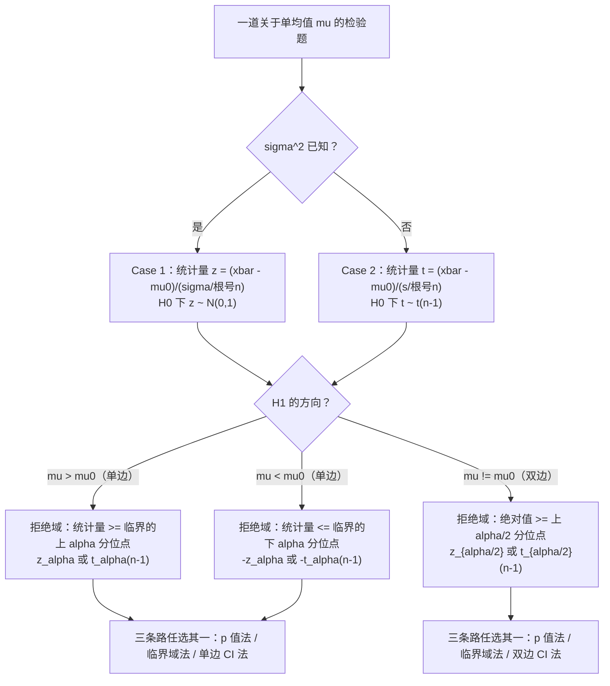

# STA2002 概率与统计 II · 第 6 讲笔记
## Hypothesis Testing I（假设检验 I）

> 授课：Zhenxing Guo、Ka Wai Tseng（香港中文大学（深圳）数据科学学院，2026 年 9 月）
> 教材：Hogg, Tanis & Zimmerman (2015) *Probability and Statistical Inference*, 9th ed., Pearson
> 对应教材章节：第 8.1 节（讲义第 2 页给出 "Suggested reading: Chapter 8.1 of the textbook"）
> 材料构成：讲义 `Lecture6 - Hypothesis Testing I.pdf`（**28 页**）。**本讲没有收到课堂板书照片**（课程目录的 `img/` 下暂无 Lec6 文件），因此笔记**不含任何板书内容**；讲义本身也没有提供讲解文本，因此也**不含任何未被讲义记录的口述内容**。凡属我补充、推导或复算的部分，一律用 **【补】** 标出，并在文末诚实备注中逐条列出。
> **组织方式**：正文**按讲义（PPT）的页序**撰写。28 页中凡含公式、图形或表格的页面（第 3、6、8、10、11、12、14、19、28 页）都已渲染成图片逐张核对；其中第 10 页与第 19 页的两幅图我另外做了**像素级测量**（标定坐标轴、逐列读出曲线与阴影边界），结论写在 §7.4 与 §11.5。

---

## 0. 本讲地图（先说清楚这一讲在干什么）

第 4 讲和第 5 讲都在回答同一个句式的问题：**"这个未知参数大致是多少？"** 答案是一段区间。

本讲换了一个句式：**"这个未知参数是不是等于某个给定的数？"** 答案是一个"是/否"的判决，外加一个叫 **$p$ 值**的可信度刻度。这就是**假设检验（hypothesis testing）**。

讲义第 2 页把本讲的范围列得很清楚：

> In this lecture we will introduce
> - Important concepts in hypothesis testing
> - Null hypothesis $H_0$ and alternative hypothesis $H_1$
> - Test statistic $T$ and critical region $C$
> - Type I and Type II error
> - Significance level $\alpha$
> - $p$-value
> - Hypothesis testing for mean
> Suggested reading: Chapter 8.1 of the textbook.

这份清单本身就是个信号：**七行里有六行是"概念"，只有最后一行是"应用"**。所以本讲的重心不在计算，而在**建立一套语言**——后面所有的检验（两个均值、比例、方差、回归系数）都要用这套语言表述，而本讲一次性把它定义完。

| 讲义页 | 内容 | 本笔记 |
| --- | --- | --- |
| 第 2 页 | Introduction：本讲覆盖什么 | §1 |
| 第 3 页 | 动机例题：钢条的断裂强度 | §2 |
| 第 4–5 页 | 怎么写 $H_0$ 与 $H_1$（简单/复合、单边/双边） | §3 |
| 第 6 页 | 临界域 $C$ 与检验统计量 $T$ | §4 |
| 第 7 页 | 判定规则 | §5 |
| 第 8 页 | 两类错误的四格表 | §6 |
| 第 9–10 页 | $\alpha$、$\beta$ 的定义，以及那幅双峰图 | §7 |
| 第 11 页 | 显著性水平 | §8 |
| 第 12 页 | $p$ 值 | §9 |
| 第 13–14 页 | 两个 case 与三条等价的路 | §10 |
| 第 15–19 页 | Case 1（$\sigma^2$ 已知）：三个方向 + 汇总图 | §11 |
| 第 20–23 页 | Case 2（$\sigma^2$ 未知）：三个方向 | §12 |
| 第 24–27 页 | 两道例题（双边 / 单边） | §13 |
| 第 28 页 | Summary 表 | §14 |
| — | 速查表 / 核心直觉 / 术语对照 / 诚实备注 | §14–§17 |

**一句话概括整讲的结构：把第 4 讲的枢轴量倒过来用。**

第 4 讲的枢轴量（pivot）是
$$Z=\frac{\bar X-\mu}{\sigma/\sqrt n}.$$
里面的 $\mu$ 是**未知参数**，所以 $Z$ 不能直接算——第 4 讲的做法是把它塞进一个概率陈述里，再反解出 $\mu$。

本讲做的事情是：**把那个未知的 $\mu$ 换成一个假设值 $\mu_0$。** $\mu_0$ 不是估计出来的，是"假设"出来的，所以它是**已知数**。于是
$$z=\frac{\bar x-\mu_0}{\sigma/\sqrt n}$$
可以直接算出一个数；这个数落在 $N(0,1)$ 的什么位置，就回答了"假设 $\mu=\mu_0$ 站不站得住"。

> [!IMPORTANT]
> **本讲没有引入任何新的分布、新的估计量或新的数学工具。** 全部检验统计量都是第 4、5 讲的老面孔，只是把待估参数换成了假设值：
>
> | 场景 | 第 4 讲用它做区间 | 本讲用它做检验 |
> | --- | --- | --- |
> | $\sigma^2$ 已知，单均值 | $\dfrac{\bar X-\mu}{\sigma/\sqrt n}\sim N(0,1)$ | $\dfrac{\bar X-\mu_0}{\sigma/\sqrt n}\sim N(0,1)$ |
> | $\sigma^2$ 未知，单均值 | $\dfrac{\bar X-\mu}{S/\sqrt n}\sim t(n-1)$ | $\dfrac{\bar X-\mu_0}{S/\sqrt n}\sim t(n-1)$ |
>
> **分子里的参数从"待估的 $\mu$"变成"被假设的 $\mu_0$"，其余一个字没变。** 所以复习本讲最省力的入口是先承认"这东西我见过"，然后专心学分给它的那套新词汇（$H_0$、$\alpha$、$p$、……）。

**来源标注约定**：

- 无标记 → 讲义原文或对讲义的直接展开；
- **【补】** → 讲义没有，由我补充、推导或复算（文末诚实备注逐条列出）；
- 本讲**没有收到课堂板书**，所以全文**没有【板书 NN】标记**。

---

## 1. 六个概念分别在回答什么问题（讲义第 2 页）

第 2 页那七行 bullet 是目录，不是内容。但把它们当成一张"角色分工表"来读，能提前知道每个概念是用来堵哪个洞的：

| 概念 | 它回答的问题 | 什么时候用 |
| --- | --- | --- |
| $H_0$ / $H_1$ | "我要检验的到底是谁、跟谁比？" | 拿到问题的第一步，必须先把这两句话写出来 |
| 检验统计量 $T$ | "把 $n$ 个数压成一个数，压成哪个？" | 定完假设之后、收数据之前 |
| 临界域 $C$ | "这个数大到什么程度我就翻脸？" | 收数据之前必须定好 |
| Type I / Type II error | "我可能犯哪两种错？" | 解释判决的可靠性时 |
| 显著性水平 $\alpha$ | "我愿意容忍多大比例的误报？" | 定临界域的那个旋钮 |
| $p$ 值 | "手上这批数据，对 $H_0$ 有多不利？" | 拿到数据之后，用来汇报结果 |
| 均值的检验 | "怎么把这套框架套到最常用的场景上？" | 讲义第 13–28 页 |

**【补】这张表里有一条顺序上的学问，讲义没有点明：**

> [!TIP]
> 这套流程的正确顺序是 **先写 $H_0/H_1$ → 再定 $T$ → 再定 $\alpha$（从而定 $C$）→ 最后才收数据**。讲义第 7 页的顺序就是 "Once we formulate $H_0$ and $H_1$, we collect data"。这个顺序不是形式主义：**如果先看数据再挑临界域，$\alpha$ 就不再是你承诺的那个数了**（你在偷偷挑一个最容易出结果的标准）。这就是"$p$ 值操纵（$p$-hacking）"的全部内容。讲义没有明说这条纪律，但它的编排次序严格守着这条纪律。

---

## 2. 从一根钢条的断裂强度说起（讲义第 3 页）

讲义用一道具体的题把整讲引出来。原文：

> Let $X$ equal the breaking strength of a steel bar. If the bar is manufactured by process I, $X\sim N(50,36)$. It is **hoped** that if process II (a new process) is used, $X\sim N(55,36)$. Given a large number of steel bars manufactured by process II, how could we test whether the five-unit increase in the mean breaking strength was realized?

先把记号说清楚。这里 $X$ 是一根钢条的断裂强度（单位按题目未说明，理解为某个强度单位）。括号里第二个数是**方差**（这是 Hogg 教材的惯例：$N(\mu,\sigma^2)$，第二个参数是方差不是标准差）——所以 $X$ 的标准差是 $\sqrt{36}=6$。老工艺的均值是 50，新工艺"希望"是 55，两边的方差都假设成 36。

**【补】这道题有三个结构性特征，它们决定了后面 25 页长什么样：**

1. **$\sigma^2=36$ 是已知的**。这就是为什么本讲后面画了两个 case（$\sigma^2$ 已知 / 未知），而**第一个 case 用的正是这道题**。
2. **有一个基准值 $\mu_0=50$**（老工艺的均值）。检验的对象就是它——"新工艺的均值还能不能算作 50"。
3. **有一个期望值 $\mu_1=55$**（新工艺想达到的均值）。这个数在后面单独有用：**只有当备择假设指定了一个具体的数，第二类错误的概率才能算成一个数**（§7）。

**【补】为什么是"抽一大批"而不是"抽一根"？** 因为单根钢条的噪声太大了：单次观测的标准差是 6，而我们要分辨的差别只有 5——**信噪比小于 1，抽一根完全看不出东西**。但样本均值的标准差是 $6/\sqrt n$，$n$ 越大越能分辨。本题后面取 $n=16$，于是标准差降到 $6/4=1.5$，信噪比变成 $5/1.5=3.3$，这才有分辨的余地。**"用样本均值代替单个观测"是整件事能成立的前提**，而讲义把这一步藏在了 "Given a large number of steel bars" 这半句话里。

**【补】"hoped" 这个词是题眼。** 讲义特意把它加粗了。它提示的是：55 这个数是**生产方的期望**，不是已知事实。假设检验要处理的正是"期望"与"事实"之间的落差——**数据不会因为谁希望它变成 55 就变成 55**。

---

## 3. 怎么把问题写成 $H_0$ 与 $H_1$（讲义第 4–5 页）

### 3.1 两个假设的定义（讲义第 4 页）

讲义先给出设定：$X_1,X_2,\ldots,X_n\stackrel{\text{i.i.d.}}{\sim}N(\mu,36)$。注意**方差 36 从设定里就写死了**，所以唯一的未知量是 $\mu$。然后：

- **零假设（null hypothesis）$H_0$**：关于 $\mu$ 可以取哪些值的**初始信念 / 主张 / 假设**（an initial belief/claim/assumption on the values that $\mu$ can take）。
- **备择假设（alternative hypothesis）$H_1$**：与它竞争的、我们想用来检验这个初始信念的**主张**。

**【补】用大白话讲，就是给两个假设分配了不同的"举证责任"：**

- $H_0$ = **默认状态 / 现状 / 没什么新鲜事**。它一开始被当作成立，除非数据足够反常。
- $H_1$ = **变化 / 发现 / 新工艺真的有效**。它是需要被数据"推出来"的那一方。

这个不对称性不是数学上的，是**决策惯例**上的。它带来一个直接的措辞后果：判决要么是"**拒绝 $H_0$**"，要么是"**未能拒绝 $H_0$**"，而**不是"接受 $H_0$"**。理由见 §3.4。

> [!NOTE]
> 讲义第 7 页用的原词是 "Retain $H_0$ (Reject $H_1$)" 和 "fail to reject $H_0$"。**用词是对的**——很多教材（包括不少中文教材）会随手写"接受 $H_0$"，那是不严谨的。这一点值得记下来。

### 3.2 简单假设与复合假设（讲义第 4 页）

- **简单假设（simple hypothesis）**：$\mu$ 只能取**一个值**的假设。
- **复合假设（composite hypothesis）**：$\mu$ 能取**一串值**的假设。

讲义给的四个例子：

| 假设 | 内容 | 类型 |
| --- | --- | --- |
| $H_0:\mu=50$ | 一个点 | 简单零假设 |
| $H_0:\mu\le 50$ | 一条射线 | 复合零假设 |
| $H_1:\mu=55$ | 一个点 | 简单备择假设 |
| $H_1:\mu>55$ | 一条射线 | 复合备择假设 |

**【补】这里有一个容易混的地方，值得单独拆开：**"简单 / 复合"和"单边 / 双边"是**两套互相独立的分类**。

- "简单 / 复合"说的是**假设本身包含几个 $\mu$ 值**；
- "单边 / 双边"说的是**$H_1$ 相对于 $H_0$ 的方向形状**（射向一侧，还是两侧都射）。

所以 $H_0:\mu=55,\ H_1:\mu>55$ 这句话既是"简单零假设"又是"单边检验"，两顶帽子同时戴。第 5 页那五行清单里，**两套分类是交叉出现的**（见下表），读的时候别把它们串成一条线。

### 3.3 五行清单逐行读（讲义第 5 页）

讲义第 5 页列出五种写法。这五行在讲义里没有任何解释，但每一行的用途都不一样：

| # | 写法 | 零假设 | 备择假设 | 检验方向 | 用在哪里 |
| --- | --- | --- | --- | --- | --- |
| ① | $H_0:\mu=50$，$H_1:\mu=55$ | 简单 | 简单 | 无（两点比较） | 第 3 页那道钢条题的原始形式；第 9 页那道算 $\beta$ 的例题 |
| ② | $H_0:\mu=55$，$H_1:\mu>55$ | 简单 | 复合 | 单边（右） | 第 16 页 |
| ③ | $H_0:\mu=55$，$H_1:\mu<55$ | 简单 | 复合 | 单边（左） | 第 17 页 |
| ④ | $H_0:\mu=55$，$H_1:\mu\ne 55$ | 简单 | 复合 | 双边 | 第 18 页 |
| ⑤ | $H_0:\mu\le 55$，$H_1:\mu>55$ | 复合 | 复合 | 单边（右） | **讲义列了却再没出现** |

**【补】第 ① 行是唯一一个"两个假设都只含一个 $\mu$ 值"的情形。** 这不是巧合——第 9 页那道题正是用它，因为只有在这种情形下，$H_0$ 对应一个分布、$H_1$ 也对应一个分布，$\alpha$ 与 $\beta$ 才各是一个**确定的数**。一旦 $H_1$ 变成 $\mu>55$ 这样的范围，$\beta$ 就变成一条关于 $\mu$ 的曲线了（§7.5）。

**【补】第 ⑤ 行与第 ② 行的关系，是这五行里最值得说清的一点。** 它们**做出来的检验完全一样**（临界域、$p$ 值、判决都相同），区别只在"$\alpha$ 是什么"：

$\alpha$ 的定义是 $\Pr(\text{拒绝}H_0\mid H_0\text{ 成立})$。当 $H_0$ 是一整条射线 $\mu\le 55$ 时，"$H_0$ 成立"对应的不是**一个**分布，而是**一族**分布，所以 $\Pr(\text{拒绝};\mu)$ 是 $\mu$ 的函数。惯例是取**最坏情形（上确界）**：

$$\alpha=\sup_{\mu\le 55}\Pr(\text{拒绝}H_0;\mu).$$

对于右边拒绝域（$z\ge z_\alpha$ 这类），$\Pr(\text{拒绝};\mu)$ 关于 $\mu$ 是递增的，所以**上确界恰好在边界 $\mu=55$ 处取到**：

$$\sup_{\mu\le 55}\Pr(\text{拒绝}H_0;\mu)=\Pr(\text{拒绝}H_0;\mu=55).$$

**结论：第 ⑤ 行的 $\alpha$ 与第 ② 行的 $\alpha$ 是同一个数。** 这就是为什么讲义后面所有地方都只写 $H_0:\mu=\mu_0$，而不再写 $H_0:\mu\le\mu_0$——**它把复合零假设化归成了边界上的简单零假设**。这个化归讲义没有交代，但整份 28 页都在用它（第 9、11、15–27 页每一处的 $\alpha$ 都是这么算的）。

### 3.4 【补】$H_0$ 与 $H_1$ 的四层不对称

讲义把两个假设并列定义，看起来是对称的。实际上它们在四处都不对称，而每一处都会在后面的计算里咬人：

**第一层：举证责任不对称。** $H_0$ 默认成立，要推翻它需要证据。所以判决只有"拒绝"和"未能拒绝"两种，**没有"接受 $H_0$"**。"未能拒绝"只意味着"数据没有给出足够证据"，不等于"$H_0$ 被证明了"。一个常见的类比是法庭上的"无罪推定"：判"无罪"不是判"确实没做"，而是"证据不足以定罪"。

**第二层：两类错误的严重程度不对称。** 错误地拒绝一个真的 $H_0$（第一类错误）在惯例上被认为更严重，所以 $\alpha$ 被强行定小（0.05、0.01）。这个"哪个更严重"的判断是**领域相关的**，不是数学结论：医学筛查里漏诊（第二类）可能更严重，而 $\alpha$ 的惯例值仍然是 0.05。

**第三层：$\beta$ 需要额外的信息。** $\alpha$ 只依赖 $H_0$（因为 $H_0:\mu=\mu_0$ 锁定了唯一一个分布），而 $\beta=\Pr(\text{不拒绝}H_0\mid H_1)$ 依赖 $H_1$——如果 $H_1$ 是一个范围，那"$H_1$ 成立"就有一族分布，$\beta$ 也就不是一个数而是一条曲线。**这就是第 3 页那道题为什么设成 "$H_1:\mu=55$" 而不是 "$H_1:\mu>50$"：只有简单备择，$\beta$ 才算得出来。** 讲义第 9 页直接开始算 $\beta$，从没提这一点。

**第四层：$H_0$ 与 $H_1$ 必须互斥且穷尽。** 第 5 页那五行里，$H_1$ 都是 $H_0$ 的补集（在 $\mu$ 的取值范围内），所以 $\mu$ 的每一个可能值都恰好落在一个假设里——除了第 ① 行。

**【补】第 ① 行是唯一有"裂隙"的一行**：$H_0:\mu=50$ 与 $H_1:\mu=55$ 之间，$\mu\in(50,55)$ 这些值**既不在 $H_0$ 里也不在 $H_1$ 里**。这在真实问题里是奇怪的设定（$\mu=52$ 的时候这个检验该怎么说话？），但在教学里是可以接受的，因为 $\alpha$ 只用到 $\mu=50$ 那一个分布、$\beta$ 只用到 $\mu=55$ 那一个分布，中间那一段从不被访问。**换句话说，正是这道"裂隙"让两个错误概率都能算成确定的数。** 有意思的是，这个裂隙并不会让检验失效——如果观测到 $\bar x=52$，检验照样会输出"不拒绝 $H_0$"，尽管此时真实情况可能是那个没人认领的 $\mu=52$。

---

## 4. 临界域 $C$ 与检验统计量 $T$（讲义第 6 页）

讲义先定义**样本空间（space of the sample）**：

$$\mathcal D:=\{(x_1,x_2,\ldots,x_n)\mid x_i\in S_X,\ i=1,2,\ldots,n\}.$$

也就是"所有可能被观测到的 $n$ 元组"的集合，$S_X$ 是单个观测的取值范围。然后：

> A test of $H_0$ versus $H_1$ is based on a subset $C$ of $\mathcal D$. This set $C$ that we reject $H_0$ is called the **critical region**. The region is usually specified in terms of **test statistic** $T$.

例题里取：检验统计量 $T=\bar X$，临界域 $C=\{(x_1,\ldots,x_n)\in\mathcal D\mid \bar x\ge 53\}$。

**【补】三件事需要讲清：**

**（1）检验统计量 $T$ 的作用是"把 $n$ 维压成 1 维"。** 样本空间 $\mathcal D$ 是 $n$ 维的，直接在上面划区域没法操作；压成一个数 $\bar X$ 之后，临界域就退化成数轴上的一个区间（$\bar x\ge 53$）。这个压缩之所以不丢信息，是因为**对正态总体的均值而言 $\bar X$ 是充分统计量（sufficient statistic）**——数据里关于 $\mu$ 的全部信息都装在这个均值里了。讲义没有用"充分性"这个词，但它选 $T=\bar X$ 是有根据的。

**（2）$C\subset\mathcal D$ 与 $\{\bar x\ge 53\}$ 严格说不是同一个东西。** 前者是样本空间里的集合，后者是实数轴上的一段——两者通过 $T$ 的**原像**对应。讲义混着写，做题时按后者理解即可。

**（3）那个 53 是人为选的。** 这是本讲最关键的一句话，而讲义自己在第 7 页最后一行给出了答案：

> How to determine critical region $C$ based on $T$? → **Probability of making a type I error**

也就是说，**选边界值的标准不是"看数据"，而是"先定 $\alpha$"**。$c=53$ 只是讲义随手给的一个例子；真正被规范确定的 $c$ 是在第 11 页用 $\alpha=0.05$ 解出来的 $52.47$（§8）。

**【补】为什么 $C$ 是"右边那条尾巴"而不是"左边那条"？** 因为备择假设说的是 $\mu>55$（$\mu$ 变大），而 $\bar x$ 大才支持 $\mu$ 大。**临界域的形状必须与 $H_1$ 的方向一致**——这是"单边 / 双边"在几何上的确切含义，也是 §11.5 那三张小图的全部内容。

---

## 5. 判定规则（讲义第 7 页）

讲义给的规则很干脆：

- **拒绝 $H_0$（接受 $H_1$）**，若 $(x_1,\ldots,x_n)\in C$；
- **保留 $H_0$（拒绝 $H_1$）**，若 $(x_1,\ldots,x_n)\notin C$。

例题：若 $\bar x\ge 53$ 就拒绝 $H_0$；否则（$\bar x<53$）不拒绝 $H_0$。

**【补】这里有两个值得留意的地方。**

**第一，规则的"位置"。** 判定规则是**在收数据之前**就写下来的（第 7 页开头的顺序是 "Once we formulate $H_0$ and $H_1$, we collect data to see whether $H_0$ is favoured or $H_1$ is favoured"）。规则一旦固定，$\alpha$ 才是一个先验承诺的数。

**第二，边界点的归属。** $\bar x=53$ 恰好等于边界时算拒绝（因为条件是 $\ge$）。在连续分布下这一个点不影响概率，但在离散检验里（比如后面可能讲到的符号检验）边界点的归属会真的改变 $\alpha$。讲义这里没有讨论，因为本讲所有分布都是连续的。

---

## 6. 两类错误（讲义第 8 页）

讲义第 8 页用一张四格表把"可能犯的错"说清：

| | $H_0$ 为真 | $H_1$ 为真 |
| --- | --- | --- |
| **拒绝 $H_0$** | 第一类错误（Type I error） | 正确 |
| **不拒绝 $H_0$** | 正确 | 第二类错误（Type II error） |

- **第一类错误**：$H_0$ 为真却拒绝它。
- **第二类错误**：$H_0$ 为假却不拒绝它。

**【补】这张表有三个读法值得展开：**

**（1）真实世界只有两种状态，判决也只有两种，所以四格里有两格永远不会发生**（$H_0$ 与 $H_1$ 不可能同时为真）。也就是说，**真值是固定的、判决是随机的**——随机的那一半（行）才是我们能控制的。这是为什么所有讨论都围绕"给定真值，判决出错的概率是多少"。

**（2）一个医学筛查的类比最有帮助**：

| | 真的没病（$H_0$） | 真的有病（$H_1$） |
| --- | --- | --- |
| 报告"阳性"（拒绝 $H_0$） | 误报（false positive）= 第一类错误 | 命中 |
| 报告"阴性"（不拒绝 $H_0$） | 命中 | 漏报（false negative）= 第二类错误 |

这个类比里 $H_0$ 是"没病"——和检验里 $H_0$ 是"没什么新鲜事"完全对应。**$H_0$ 永远是那个"平淡"的一方**，这也是为什么它享受默认地位。

**（3）两类错误的方向恰好相反**，而这个"相反"就是下一节那幅图的全部内容：第一类错误发生在"尾巴"的**外侧**（数据比边界更极端），第二类错误发生在"尾巴"的**内侧**（数据没跑到边界外面）。把边界往右推，第一类错误变小、第二类错误变大——这就是 §7.4 要讲的"此消彼长"。

---

## 7. 两个错误的概率 $\alpha$ 与 $\beta$（讲义第 9–10 页）

### 7.1 定义（讲义第 9 页）

$$\alpha=\Pr(\text{检验犯第一类错误})=\Pr(T\in C;\,H_0),$$
$$\beta=\Pr(\text{检验犯第二类错误})=\Pr(T\notin C;\,H_1).$$

**【补】这里有两个记号上的要点：**

- 分号后面的 "$;H_0$" 读作"**在 $H_0$ 成立的前提下**"，它指定了算概率时用哪个分布。
- **这两个概率是在两个完全不同的分布下算的。** $\alpha$ 在 $H_0$ 的分布（$\mu=50$）下算，$\beta$ 在 $H_1$ 的分布（$\mu=55$）下算。这是初学者最容易搞混的一处——看到"$\Pr(\cdot)$"就默认用同一个分布。**记住这条规则：问"犯第一类错误"就站在 $H_0$ 的分布上看，问"犯第二类错误"就站在 $H_1$ 的分布上看。**

讲义接着给的例题：

> $X_1,\ldots,X_n\stackrel{\text{i.i.d.}}{\sim}N(\mu,36)$ with $n=16$. We take the critical region $C=\{\bar x\ge 53\}$. What is the probability of a type I error and a type II error in the following test $H_0:\mu=50$ against $H_1:\mu=55$?

### 7.2 【补】讲义这道例题没有给答案——我把它算出来

先把分布写清楚。$\bar X\sim N(\mu,36/16)=N(\mu,2.25)$，所以 $\bar X$ 的标准差是 $\sqrt{2.25}=1.5$。

**第一类错误的概率**（站在 $H_0$：$\mu=50$ 上看）：
$$\alpha=\Pr(\bar X\ge 53;\,\mu=50)=\Pr\!\left(Z\ge\frac{53-50}{1.5}=2\right)=1-\Phi(2)=\mathbf{0.022750}.$$

**第二类错误的概率**（站在 $H_1$：$\mu=55$ 上看）：
$$\beta=\Pr(\bar X< 53;\,\mu=55)=\Pr\!\left(Z<\frac{53-55}{1.5}=-1.3333\right)=\Phi(-1.3333)=\mathbf{0.091211}.$$

**逐项复算见文末数值表**（用 SciPy 1.18.1 核对，$\alpha=0.02275013$、$\beta=0.09121122$）。

> [!IMPORTANT]
> **这道题的信息量远大于两个数字。** 注意 $\alpha=0.0228$ 与 $\beta=0.0912$ 都远小于"没做检验所以只能瞎猜"的 0.5——但这恰恰说明：**这个检验并不是"白做"，它确实把不确定性压小了；只不过压出来的结果是"两条都还有几个百分点的漏网空间"。** 而 $\beta$ 是 $\alpha$ 的四倍，说明这个临界域**偏保守**（更怕误报，不太怕漏报）。

**【补】一个漂亮的对称性：$\alpha$ 在 $c=53$ 处的值与 $\beta$ 在 $c=52$ 处的值完全相同（都是 $0.02275$）。** 原因是两条正态密度关于 $x=(50+55)/2=52.5$ 互为镜像，所以

$$\alpha(c)=\beta(105-c).$$

这给出一个更一般的关系：**$\alpha+\beta$ 的最小值一定在中点 $c=52.5$ 处取到**。本题在 $c=52.5$ 时 $\alpha=\beta=0.047790$，$\alpha+\beta=0.095581$。**这就是"两个错误之和"的理论下限（在 $n=16$ 的约束下）——无论怎么调 $c$ 都不可能压到比 9.56% 更低。**

### 7.3 讲义第 10 页那幅双峰图

讲义第 10 页只给了一句图注（"PDF of $\bar X$ under $H_0:\mu=50$ and $H_1:\mu=55$"）和一句结论（"by changing the critical region $C$, $\alpha$ increases (decreases) while $\beta$ decreases (increases), so both errors cannot be reduced at the same time"）。图本身需要逐要素读。

**【补】我把这幅图逐像素量过了，下面是读法（坐标轴标定：横轴上 $45,50,55,60$ 分别落在像素列 $91.0,\ 227.5,\ 363.0,\ 498.5$，纵轴上 $0,0.1,0.2$ 分别落在像素行 $377.0,\ 258.5,\ 139.5$）：**

1. **两条曲线**：左边那条标 $H_0$，峰值在 $\bar x=50$；右边那条标 $H_1$，峰值在 $\bar x=55$。两条峰值高度相同，实测像素高度对应 $0.2660$，与理论值 $1/(1.5\sqrt{2\pi})=0.265962$ 一致——**两条曲线的标准差都是 1.5，也就是 $\bar X$ 在 $n=16$ 下的标准差。**
2. **中间那条竖直细线就是 $c=53$。** 实测它落在像素列 $309$，反算横坐标 $53.02$，与例题里的 $53$ 吻合。**这条线把整个横轴劈成两半："线左边"= 不拒绝 $H_0$，"线右边"= 拒绝 $H_0$。**
3. **阴影有两块，用同一种浅蓝色画，看起来像一片"透镜"。** 逐列测阴影上边界后可以确认：
   - **$\alpha$ 那块在竖线右侧**，上边界正好是 **$H_0$ 曲线**。它的右端在 $\bar x\approx 54.4$ 处收口（实测最后一个着色列对应 $54.37$；理论值：$H_0$ 密度降到 $0.0042$ 时 $\bar x=54.32$，两者一致）。**这就是"$H_0$ 曲线的右尾"，面积 $0.02275$。**
   - **$\beta$ 那块在竖线左侧**，上边界正好是 **$H_1$ 曲线**。它的左端在 $\bar x\approx 50.7$ 处就已经细到看不见了（实测第一个着色列对应 $50.65$；理论值：$H_1$ 密度升到 $0.0042$ 时 $\bar x=50.68$，两者一致）。**这就是"$H_1$ 曲线的左尾"，面积 $0.09121$。**
   - 两个标签：$\alpha$ 的箭头指向右侧那块，$\beta$ 的箭头指向左侧那块。
4. **"看起来像一片透镜"是个视觉错觉**：两块阴影其实各自独立（左边那块是 $H_1$ 的尾巴、右边那块是 $H_0$ 的尾巴），只因为两块尾巴在竖线附近重叠，用同一种颜色画出来就黏成一片了。**注意这跟"两条曲线之间的那块区域"不是一回事**——阴影的下边界自始至终都是横轴（$y=0$），不是另一条曲线。这一点容易被误读。

> [!WARNING]
> **这幅图最容易被读错的地方：把两块阴影的面积大小关系弄反。** 图上左边的阴影看起来更"胖"，右边更"尖"——这与实际数值一致：$\beta=0.0912$ 确实是 $\alpha=0.0228$ 的四倍。**所以"更大的那一片是 $\beta$（第二类错误）"，不是 $\alpha$。** 直觉解释：$c=53$ 离 $H_1$ 的峰（55）比离 $H_0$ 的峰（50）更近，所以判"不拒绝"时更容易误伤 $H_1$，漏掉真实的变化。

### 7.4 【补】"两个错误不能同时减小"——这句结论的正确读法

讲义原话：*"by changing the critical region $C$, $\alpha$ increases (decreases) while $\beta$ decreases (increases), so both errors cannot be reduced at the same time."*

这句话很容易被读成一条"定律"，但它有一个**关键的前提被省略了：在固定 $n$ 和固定两个假设的条件下**。把前提补上之后，正确的说法是：

- **固定 $n$、固定 $H_0$ 与 $H_1$，只调 $c$**：$\alpha$ 与 $\beta$ 确实此消彼长，无法同时减小。这是对的。
- **但增大 $n$ 可以同时减小 $\alpha$ 和 $\beta$。** 因为 $\bar X$ 的标准差 $\sigma/\sqrt n$ 变小，两个分布被"捏瘦"，重叠区缩小，两条尾巴同时变细。

**【补】用本题的数把它算出来（$c$ 固定为 $c=53$ 时）：**

| $n$ | $\bar X$ 的标准差 | $\alpha$ | $\beta$ | 功效 $1-\beta$ |
| --- | --- | --- | --- | --- |
| 9 | $2.000$ | $0.06681$ | $0.15866$ | $0.84134$ |
| **16** | $\mathbf{1.500}$ | $\mathbf{0.02275}$ | $\mathbf{0.09121}$ | $\mathbf{0.90879}$ |
| 25 | $1.200$ | $0.00621$ | $0.04779$ | $0.95221$ |
| 36 | $1.000$ | $0.00135$ | $0.02275$ | $0.97725$ |
| 100 | $0.600$ | $2.87\times10^{-7}$ | $0.00043$ | $0.99957$ |

（表里 $c$ 一律取 53，所以这是一个"固定临界域、随样本量变化"的纵向对照。**唯一的限制是 $n$ 要花得起。**）

**【补】另一条更实用的口径：给定 $\alpha$ 和想要的功效，最小的 $n$ 是多少？** 对本题（单边、$\delta=\mu_1-\mu_0=5$、$\sigma=6$）：

$$n\approx\frac{(z_\alpha+z_\beta)^2\sigma^2}{\delta^2}=\frac{(1.6449+1.6449)^2\times36}{25}=15.58\ \Rightarrow\ n=16.$$

**恰好就是讲义在这道题里取的 $n=16$。** 复核一下：$n=16$ 时按 $\alpha=0.05$ 解出的 $c=50+1.6449\times1.5=52.4673$，此时 $\beta=\Phi\!\left(\frac{52.4673-55}{1.5}\right)=\Phi(-1.6890)=0.04566$，功效 $=0.95434$——**刚好越过 95%，再多一个样本就是浪费。** 所以 $n=16$ 是"$\alpha=0.05$、功效 95%"这个要求的临界解，讲义选它很可能就是照这个标准算的。

> [!NOTE]
> **这个 $n$ 的公式、以及"功效（power）"这个词，讲义全文 28 页一次都没有出现。** 讲义只讲了第一类/第二类错误，没有把它们和"样本量"连起来。这是本讲最大的一个缺口，详见文末诚实备注。

### 7.5 【补】功效函数：为什么讲义的 $\beta$ 能算成一个数，而一般情形不能

把"拒绝 $H_0$"的概率写成真实均值 $\mu$ 的函数，就得到**功效函数（power function）**：

$$K(\mu)=\Pr(\text{拒绝}H_0;\,\mu),\qquad \text{功效（power）}=1-\beta=K(\mu_1).$$

对本题（$c=53$、$n=16$，即 $\bar X$ 的 sd 为 $1.5$）：

$$K(\mu)=\Pr(\bar X\ge 53;\,\mu)=1-\Phi\!\left(\frac{53-\mu}{1.5}\right).$$

| $\mu$ | 48 | 50 | 52 | **53** | 55 | 57 | 60 |
| --- | --- | --- | --- | --- | --- | --- | --- |
| $K(\mu)$ | $0.00043$ | $0.02275$ | $0.25249$ | $0.50000$ | $0.90879$ | $0.99617$ | $0.999998$ |

读这张表要注意三点：

1. **$K(50)=\alpha=0.02275$**。功效函数在零假设真值处的取值**就是** $\alpha$——这不是巧合，因为"$H_0$ 为真时拒绝"和"犯第一类错误"是同一件事。
2. **$K(53)=0.5$**。临界值 $c=53$ 恰好是功效函数的"半格点"——在 $\mu=c$ 处，观测到 $\bar x\ge c$ 的概率正好是一半。这是必然的，因为 $\bar X$ 在 $\mu=53$ 时的分布关于 $c=53$ 对称。
3. **$K(\mu)$ 关于 $\mu$ 单调递增**，从 $\mu$ 很小时的 0 爬到 $\mu$ 很大时的 1。**只有在 $\mu=\mu_1=55$ 这一个点上，$K$ 才等于 $1-\beta$。** 这就是为什么讲义必须指定一个具体的备择值 $\mu_1$ 才能算 $\beta$——**"第二类错误的概率"本质上是功效函数在某一个点上的补数**，脱离 $\mu_1$ 就没有意义。

---

## 8. 显著性水平 $\alpha$（讲义第 11 页）

### 8.1 定义与操作顺序

讲义的三行 bullet：

> - Most of the time we fix the probability of type I error $\alpha$, for example, we take $\alpha=0.05=5\%$, and determine the corresponding critical region.
> - The value of $\alpha$ is called the **significance level** of the test.
> - We can also be more conservative, and for example, take $\alpha=0.01$.

然后是那个例题：

$$\Pr(\bar X\ge c;\,H_0)=\Pr\!\left(Z\ge\frac{c-50}{\sqrt{36/16}}\right)=0.05$$
$$\Rightarrow \frac{c-50}{\sqrt{36/16}}=z_{0.05}\ \Rightarrow\ c=52.48.$$

**【补】这三行 bullet 说的是本讲最重要的一个操作原则：**

> [!IMPORTANT]
> **$\alpha$ 是"事先承诺"，$c$ 是这个承诺在具体问题里的翻译。** 顺序永远是"先定 $\alpha$，再解出 $c$"——**不是**"先看数据长什么样，再挑一个合适的 $c$"。第 7 页那个悬而未决的问题（"How to determine critical region $C$ based on $T$?"）在这里被回答了。
>
> 另外注意"**conservative（保守）**"这个词在这里的意思：$\alpha$ 取 0.01 比 0.05 **更保守**——保守指的是"**更不愿意拒绝 $H_0$**"（更不愿意宣布"有新发现"），**不是**指"区间更宽"。这个用法和第 5 讲"更宽的区间更可靠"里的"保守"是两回事，别混。

### 8.2 【补】把 $c$ 解出来：严格值是多少

把 $z_{0.05}=1.644854$、$\sqrt{36/16}=1.5$ 代进去：

$$c=50+z_{0.05}\times 1.5=50+2.46728=\mathbf{52.4673}.$$

**讲义写的是 $52.48$。** 差 $0.0127$（相对误差 $0.024\%$）。这个差别有多要紧？如果用讲义那个 $c=52.48$，实际的第一类错误概率是

$$\Pr\!\left(Z\ge\frac{52.48-50}{1.5}\right)=\Pr(Z\ge 1.65333)=0.049132,$$

而不是承诺的 $0.050000$——**实际显著性水平变成了 4.91%，比承诺的 5% 小**（方向上是"更保守"，所以不危险，但确实不是 5%）。这是本讲唯一一处对不上的数值，已记入文末诚实备注。（顺带说：如果按常见表格里 $z_{0.05}=1.645$ 三位小数的值算，得到 $c=52.4675\to52.47$，也不是 52.48；要凑出 52.48 需要 $z_{0.05}\approx1.6533$。）

### 8.3 【补】$c$ 在"另一边"时长什么样

本题解 $c$ 的方程之所以这么简单，是因为 $H_1:\mu>55$ 把拒绝域放在右边，所以 $\alpha$ 落在右尾、$c$ 从 $\Pr(\bar X\ge c;H_0)=\alpha$ 解出。

**换成 $H_1:\mu<\mu_0$，拒绝域跑到左边，$\alpha$ 变成左尾面积**，方程就变成 $\Pr(\bar X\le c;H_0)=\alpha$，解出来 $c=\mu_0-z_\alpha\sigma/\sqrt n$。双边则两尾都要，$c$ 变成两个（$\mu_0\pm z_{\alpha/2}\sigma/\sqrt n$）。这三条解在 §11 会逐个写出来。

### 8.4 【补】$0.05$ 与 $0.01$ 只是惯例

讲义说"most of the time"取 0.05，也说可以取 0.01，但没说这两个数是从哪来的。答案是：**它们只是惯例**，没有理论必然性。0.05 这个门槛通常追溯到 Fisher 在 1925 年前后的用法，0.01 则更严。作为对照，粒子物理宣布"发现"用的门槛是 $5\sigma$，换算成单边显著性水平大约是

$$\Pr(Z\ge 5)=2.87\times10^{-7},$$

比 0.05 严格了五个数量级。**所以"$\alpha=0.05$"不是一个数学常数，而是一个领域的约定**——写论文时该用哪个，取决于该领域的规矩（医学临床试验常常用 0.025 单边，基因组学用更小的值）。知道这一点，比记住 0.05 本身更重要。

---

## 9. $p$ 值：观测到的显著性水平（讲义第 12 页）

### 9.1 定义

> $p$-value is the probability of observing a **more extreme** test statistic (**in the direction that favours $H_1$**), **given that $H_0$ is true**.
> A small $p$-value indicates the data is unlikely coming from $H_0$, and so the data is perhaps better explained by $H_1$.
> We reject $H_0$ if the $p$-value $\le\alpha$, where $\alpha$ is the significance level.
> $p$-value is also called the **observed significance level**.

**【补】把这句定义拆成四个成分，每一成分都对应一个坑：**

1. **"given that $H_0$ is true"** → 在 $H_0$ 的分布下算。**$p$ 值是一个条件概率，条件是 $H_0$ 为真，不是"数据已经拿到"。**
2. **"in the direction that favours $H_1$"** → 只算支持 $H_1$ 的那一侧。方向由 $H_1$ 的形状决定（单边只算一尾，双边两尾都算）。
3. **"more extreme [than the observed]"** → 讲义这句话**省略了比较对象**。严格定义是"**至少与观测值一样极端**"（at least as extreme as the observed test statistic），含等号。在连续分布下"含不含等号"不影响数值；在离散分布下会。
4. **"probability of observing a test statistic"** → 它算的是**统计量**的概率，不是原始数据的联合概率。

### 9.2 小 $p$ 值意味着什么

讲义的原话值得逐字读：*"A small $p$-value indicates the data is unlikely coming from $H_0$, and so the data is **perhaps** better explained by $H_1$."*

**【补】那个 "perhaps" 不能省。** $p$ 值的逻辑结构是**反证法**：

1. 先假设 $H_0$ 成立；
2. 在这样的假设下，看到"这么极端或更极端"的统计量的概率是 $p$；
3. 如果 $p$ 很小，就说明"$H_0$ 成立"与"我们真的看到了这个数据"这两件事很难同时为真；
4. 于是我们选择放弃 $H_0$。

**注意第 4 步的结论是"放弃 $H_0$"，不是"证明 $H_1$"。** 这是反证法的性质：它只能否定，不能肯定。现实中的类比是"排除法"——排除了所有其他可能之后剩下的那个，未必是**真的**，只是"我们还不能排除它"。**这就是为什么判决措辞是"拒绝 $H_0$"而不是"接受 $H_1$"。**

### 9.3 【补】"观测到的显著性水平"这个别名其实是一个更好的定义

讲义把 "observed significance level" 当别名一笔带过。但这个名字其实给出了一条**更直观、也更容易记住**的定义：

$$p=\inf\{\alpha:\text{在水平 }\alpha\text{ 下会拒绝 } H_0\}.$$

也就是"**最小的、仍会导致拒绝 $H_0$ 的 $\alpha$**"。它和定义里的 "we reject $H_0$ if $p\le\alpha$" 是完全等价的（因为 $p\le\alpha\iff\alpha\ge p$，所以能让判定翻转的分界点正是 $\alpha=p$）。

**这个视角的价值在于：它把 $p$ 值变成了一个"刻度"，让结果可以不依赖事先约定的 $\alpha$ 就被读懂。**

- $p=0.03$ 的读法：*"如果我把标准定在 3% 或更宽，就会拒绝；定在 1% 就不会。"*
- $p=0.47$ 的读法：*"要把标准放宽到 47% 才肯拒绝——等于说这数据几乎什么都没说。"*（这正是讲义第 24–25 页那道肿瘤题的结果。）

**这也是为什么论文里普遍直接报 $p$ 值而不是只报"在 0.05 下显著"**：报 $p$ 值把判断权留给了读者。

### 9.4 四行"更极端"（讲义第 12 页的例题）

例题设定：观测到 $\bar x=56$。四种假设组合下"更极端"分别指什么：

| 检验 | "更极端"的区域 | 含义 |
| --- | --- | --- |
| $H_0:\mu=50$ vs $H_1:\mu=55$ | $\bar X\ge 56$ | 只有右侧（$\bar x$ 大才支持 55 而不是 50） |
| $H_0:\mu=55$ vs $H_1:\mu>55$ | $\bar X\ge 56$ | 右侧 |
| $H_0:\mu=55$ vs $H_1:\mu<55$ | $\bar X\le 56$ | 左侧（$\bar x$ 小才支持"比 55 小"） |
| $H_0:\mu=55$ vs $H_1:\mu\ne 55$ | $\bar X\ge 56$ **或** $\bar X\le 54$ | 两侧都要（56 离 55 有 $+1$，另一侧的对应点是 $55-1=54$） |

**【补】逐行解释：**

**前两行看起来一模一样（都是 $\bar X\ge 56$），但背景分布不同。** 第一行要在 $N(50,\cdot)$ 下算，第二行要在 $N(55,\cdot)$ 下算——**同一个"更极端"，两个完全不同的数值**。用本题的 $\bar X$ 的 sd $=1.5$ 算出来：

| 检验 | $p$ 值 | 计算 |
| --- | --- | --- |
| $H_0:\mu=50$ vs $H_1:\mu=55$ | $3.167\times10^{-5}$ | $\Pr(Z\ge (56-50)/1.5=4)$ |
| $H_0:\mu=55$ vs $H_1:\mu>55$ | $0.25249$ | $\Pr(Z\ge (56-55)/1.5=0.6667)$ |
| $H_0:\mu=55$ vs $H_1:\mu<55$ | $0.74751$ | $\Pr(Z\le 0.6667)$ |
| $H_0:\mu=55$ vs $H_1:\mu\ne 55$ | $0.50499$ | $2\Pr(Z\ge 0.6667)$ |

**同一个 $\bar x=56$，四行给出从 $3.2\times10^{-5}$ 到 $0.75$ 的四个 $p$ 值**，跨度四个数量级。**这个例题的教学价值就在于此：$p$ 值不是"数据的属性"，而是"数据 + 假设"的联合属性。**

顺带两个自洽性检查（可以用来验证自己会算）：

- 第 2 行与第 3 行相加 $=0.25249+0.74751=1.00000$ ✓（同一分布的两条尾巴必补齐）。
- 第 4 行 $=2\times$ 第 2 行 $=2\times0.25249=0.50499$ ✓——**对对称分布，双边 $p$ 值恰好等于"较小的那个单边 $p$ 值"的两倍。**

**第四行还透露了讲义采用的是"等尾（equal-tail）"约定**：把 $\alpha$ 平均分到两侧（56 的镜像点是 54，两边各算一半）。对正态、$t$ 这些**对称分布**，等尾的区间恰好也是最短的，所以这个约定没问题。但**对非对称分布，等尾就不等于最短**——这个坑第 4 讲笔记 §4.8 埋过一次伏笔，第 5 讲没有收，**本讲也没有收**（本讲全程只用对称分布）。详见文末对账。

### 9.5 【补】$p$ 值不是三样东西

这是 $p$ 值最有价值的实践知识，而讲义一个字没提：

**（1）$p$ 值不是"$H_0$ 为真的概率"。** 它是 $\Pr(\text{数据}\mid H_0)$，不是 $\Pr(H_0\mid\text{数据})$。这两个量在数学上完全不同（后者还要用贝叶斯公式，得先有先验）。**看到一个很小的 $p$ 值就说"$H_0$ 为真的概率很小"，是统计里最常见的错误之一。**

**（2）$1-p$ 不是"$H_0$ 为真的把握"。** 同理，它没有这个含义。

**（3）$p$ 值小不等于效应大。** $p$ 值同时受**效应大小**和**样本量**两件事影响。固定效应大小，$n$ 越大 $p$ 越小。举个极端但真实的例子：假设真实偏移只有 $\delta=0.01$ 个标准差（实务上完全可以忽略），做双边 $z$ 检验：

| $n$ | $z$ 的值 | $p$ 值 |
| --- | --- | --- |
| $10^2$ | $0.10$ | $0.920$ |
| $10^4$ | $1.00$ | $0.317$ |
| $10^6$ | $10.00$ | $\approx1.5\times10^{-23}$ |

**到了 $n=10^6$，一个"小到没有实际意义"的偏移会给出 $p\approx10^{-23}$ 的"极其显著"结果。** 这就是"**统计显著（statistically significant）不等于实际重要（practically important）**"的根源。

**【补】判断实际重要性要看两样东西：效应量（effect size）和置信区间，不是 $p$ 值。** 比如本题的 $\delta=5$ 相对于 $\sigma=6$ 是 $0.83$ 个标准差，这本身就是一个很大的效应；而 §13.2 那道题的效应更大（$8.3$ 个标准误）。**"显著"只说明"可能不是 0"，"多大"要靠区间回答。** 第 4、5 讲辛苦算出来的置信区间，在这里终于找到了它的用处。

---

## 10. 两个 case 与三条等价的路（讲义第 13–14 页）

### 10.1 两个 case（讲义第 13 页）

讲义把均值的检验拆成两种情形——**这个开关和第 4 讲一模一样**：

- **Case 1：$\sigma^2$ 已知**
- **Case 2：$\sigma^2$ 未知**

（设定是 $X_1,\ldots,X_n\stackrel{\text{i.i.d.}}{\sim}N(\mu,\sigma^2)$，检验对象是 $\mu$。）

### 10.2 三条路（讲义第 14 页）

讲义把做检验的方法归纳成三条：

| 做法 | 操作 | 判定 |
| --- | --- | --- |
| **$p$ 值法**（$p$-value approach） | 在 $H_0$ 下算出 $p$ 值 | $p\le\alpha$ 则拒绝 |
| **临界域法**（critical region approach） | 在 $H_0$ 下定义拒绝域，算检验统计量 | 统计量落入拒绝域则拒绝 |
| **置信区间法**（confidence interval approach） | 造一个 $(1-\alpha)$ 置信区间 | 零假设值 $\mu_0$ 不在区间内则拒绝 |

讲义在最后一行用红色加粗写了一句断言：

> **These three approaches are equivalent!**

### 10.3 【补】三条路为什么等价（讲义只给了断言）

讲义只写了一句 "equivalent!"，没给理由。下面用 Case 1 的单边检验 $H_0:\mu=\mu_0$ vs $H_1:\mu>\mu_0$ 把四条不等式串起来（$z=(\bar x-\mu_0)/(\sigma/\sqrt n)$）：

$$
\begin{aligned}
&p\le\alpha\\
\iff&\Pr(Z>z)\le\alpha\\
\iff&z\ge z_\alpha\\
\iff&\frac{\bar x-\mu_0}{\sigma/\sqrt n}\ge z_\alpha\\
\iff&\mu_0\le \bar x-z_\alpha\frac{\sigma}{\sqrt n}\\
\iff&\mu_0\notin\left(\bar x-z_\alpha\frac{\sigma}{\sqrt n},\ \infty\right).
\end{aligned}
$$

**每一步都是一个单调变换（取尾概率是单调递减、乘除正数保序），所以四者是严格等价的。** 这就是那句 "equivalent!" 的全部证据。

**【补】但三条路并不完全对称——它们各自擅长回答不同的问题：**

| 做法 | 优点 | 缺点 |
| --- | --- | --- |
| $p$ 值法 | 给出一个**连续的可信度刻度**，别人可以按自己的 $\alpha$ 判断 | 要多算一次分布函数 |
| 临界域法 | **事先把标准写死**，最能防止事后挑数据；也最省事（只要比大小） | 只给"是/否"，不给"程度" |
| 置信区间法 | **一次算、多次用**：同一个区间能回答一族 $\mu_0$ 的检验问题 | 要额外注意单边/双边的配套（见下） |

### 10.4 【补】CI 法的独门价值：一次算，回答一整族问题

这是本节最值得记的一条。对固定的一批数据，$(1-\alpha)$ 置信区间里的**每一个值**都是"在这个水平下不能被拒绝的 $\mu_0$"：

$$\text{CI}_{1-\alpha}=\{\mu_0:\text{在水平 }\alpha\text{ 下不拒绝 } H_0:\mu=\mu_0\}.$$

**换句话说：置信区间就是"所有推不翻的零假设值"的集合。** 这条对偶关系（duality）一次解释了三件本来分开讲的事：

1. **为什么"区间包含 $\mu_0$"就等于"不拒绝"**——因为区间本身就是按"不拒绝"定义出来的。
2. **为什么第 4、5 讲要大费周章算区间**——区间不只服务"$\mu$ 是多少"，它还顺手把整族检验问题都答了。
3. **为什么报区间比报 $p$ 值信息量大**——报 $p$ 值只回答了"$\mu_0$ 这一个数能不能推翻"，报区间回答了"哪些数推不翻"，还顺带给出了效应的量级。

> [!WARNING]
> **CI 法有一个高频出错点：单边检验必须配单边区间。**
>
> 讲义第 16–17 页给出的区间是**一侧有界**的：对 $H_1:\mu>\mu_0$ 是 $\left(\bar x-z_\alpha\frac{\sigma}{\sqrt n},\ \infty\right)$，对 $H_1:\mu<\mu_0$ 是 $\left(-\infty,\ \bar x+z_\alpha\frac{\sigma}{\sqrt n}\right)$。**注意这里用的是 $z_\alpha$，不是 $z_{\alpha/2}$。**
>
> 如果拿一个**双边**的 $90\%$ 区间（用 $z_{0.05}=1.645$）去替代单边检验里那个 $95\%$ 单边区间，看起来好像"更严"，实际上**得到的检验水平是 $\alpha/2$ 而不是 $\alpha$**——你会比承诺的更保守，从而在某修边界情形下给出与临界域法**不一致**的结论。
>
> **规则记这一条就够：单边检验 → 单边区间（用 $z_\alpha$ 或 $t_\alpha$）；双边检验 → 双区间（用 $z_{\alpha/2}$ 或 $t_{\alpha/2}$）。** 配套关系一一对应，不要交叉使用。

### 10.5 【补】三条路的决策图

下面这张图是我整理的，**讲义没有画**——它把"拿到一道关于均值的检验题之后该怎么走"串成一条线：

**这张图的三个分岔点依次是：方差是否已知 → 备择的方向 → 单边还是双边。** 每一层都在换一个东西：第一层换统计量和分布，第二层换拒绝域的位置，第三层换临界值的下标（$\alpha$ 还是 $\alpha/2$）。

---

## 11. Case 1：$\sigma^2$ 已知（讲义第 15–19 页）

### 11.1 检验统计量与它的分布（讲义第 15 页）

$$T:=\frac{\bar X-\mu_0}{\sigma/\sqrt n}.$$

**在 $H_0:\mu=\mu_0$ 之下，$T\sim N(0,1)$。** 观测到数据 $x_1,\ldots,x_n$ 之后算出

$$z=\frac{\bar x-\mu_0}{\sigma/\sqrt n}.$$

**【补】三条要点：**

1. **分子用假设值 $\mu_0$、分母用已知的 $\sigma$。** 这就是 §0 说的"把枢轴量里的未知参数换成假设值"。因为 $\mu_0$ 和 $\sigma$ 都是已知数，$T$ 在 $H_0$ 下有一个**完全确定、不含任何未知参数的分布** $N(0,1)$——这正是枢轴量（pivot）的性质，本讲把它拿来当检验统计量用。
2. **"在 $H_0$ 下"这个限定很重要。** 如果真实均值不是 $\mu_0$，$T$ 就不服从 $N(0,1)$ 了——它服从 $N\!\left(\frac{\mu-\mu_0}{\sigma/\sqrt n},1\right)$，把中心平移了。**这个平移量正是功效函数 $K(\mu)$ 的自变量**（§7.5）。
3. **$z$ 的符号有方向含义**：$z$ 大 ⇒ $\bar x$ 比 $\mu_0$ 大很多 ⇒ 支持 $\mu>\mu_0$；$z$ 很负 ⇒ 支持 $\mu<\mu_0$。

### 11.2 单边检验 $H_1:\mu>\mu_0$（讲义第 16 页）

$$p=\Pr(T>z;\,H_0)=\Pr(Z>z).$$

在水平 $\alpha$ 下拒绝 $H_0$，当且仅当

$$p=\Pr(Z>z)\le\alpha\quad\text{（$p$ 值法）}$$
$$\iff z\ge z_\alpha\quad\text{（临界域法）}$$
$$\iff \mu_0\notin\left(\bar x-z_\alpha\frac{\sigma}{\sqrt n},\ \infty\right)\quad\text{（置信区间法）}.$$

### 11.3 单边检验 $H_1:\mu<\mu_0$（讲义第 17 页）

$$p=\Pr(T<z;\,H_0)=\Pr(Z<z).$$

在水平 $\alpha$ 下拒绝，当且仅当

$$p=\Pr(Z<z)\le\alpha\iff z\le-z_\alpha\iff\mu_0\notin\left(-\infty,\ \bar x+z_\alpha\frac{\sigma}{\sqrt n}\right).$$

### 11.4 双边检验 $H_1:\mu\ne\mu_0$（讲义第 18 页）

$$
\begin{aligned}
p&=\Pr(\lvert T\rvert>\lvert z\rvert;\,H_0)\\
&=\Pr(Z>\lvert z\rvert)+\Pr(Z<-\lvert z\rvert)\\
&=2\Pr(Z>\lvert z\rvert).
\end{aligned}
$$

在水平 $\alpha$ 下拒绝，当且仅当

$$p=2\Pr(Z>\lvert z\rvert)\le\alpha\iff\lvert z\rvert\ge z_{\alpha/2}\iff\mu_0\notin\left(\bar x-z_{\alpha/2}\frac{\sigma}{\sqrt n},\ \bar x+z_{\alpha/2}\frac{\sigma}{\sqrt n}\right).$$

**【补】把三条式子的规律提出来，只用记一句话：**

> **分子永远是 $\bar x-\mu_0$；分母永远是检验统计量的标准误；临界值永远是"上尾面积为 $\alpha$（单边）或 $\alpha/2$（双边）"的那个分位数。**

三条的具体差别只在两处：

| | 拒绝域 | 临界值 | $\alpha=0.05$ 时的数 |
| --- | --- | --- | --- |
| $H_1:\mu>\mu_0$ | $z\ge z_\alpha$ | 上尾 $\alpha$ | $1.6449$ |
| $H_1:\mu<\mu_0$ | $z\le-z_\alpha$ | 下尾 $\alpha$（即上尾 $\alpha$ 取负） | $-1.6449$ |
| $H_1:\mu\ne\mu_0$ | $\lvert z\rvert\ge z_{\alpha/2}$ | 上尾 $\alpha/2$ | $1.9600$ |

**这就是最容易扣分的地方：单边用 $z_\alpha$、双边用 $z_{\alpha/2}$。** 所以 $\alpha=0.05$ 下同时会出现 $1.645$ 和 $1.96$ 两个数，**它们的区别只在于单边还是双边**，不是"哪个更对"。

### 11.5 【补】第 19 页那张三合一图在读什么

第 19 页只有标题 "Case 1: $\sigma^2$ is known" 和一张图，没有任何文字——**它是整个 Case 1 的几何总结**。图中顶部写着 "*z* curve (probability distribution of test statistic $Z$ when $H_0$ is true)"，从这一个曲线引出三组小图（我把图放大到 300 dpi 后逐幅读出）：

| 位置 | 拒绝域 | 阴影面积 | 对应讲义页 |
| --- | --- | --- | --- |
| 左 | $z\ge z_\alpha$（右尾） | 一块，$=\alpha$ | 第 16 页 |
| 中 | $z\le -z_\alpha$（左尾） | 一块，$=\alpha$ | 第 17 页 |
| 右 | $z\ge z_{\alpha/2}$ **或** $z\le -z_{\alpha/2}$（两尾） | 两块，**各 $=\alpha/2$**，合计 $=\alpha$ | 第 18 页 |

**【补】这张图最有价值的细节是右图那个"Total shaded area $=\alpha$"的标注。** 它特意用一个箭头分别指向两小块阴影，再用一个总标注说明加起来的面积才是 $\alpha$——**这是在纠正一个最常见的错误：做双边检验时把每一边都当成 $\alpha$。** 如果每边都用 $\alpha$，总的第一类错误就变成 $2\alpha$ 了。

**整个 Case 1 的动作可以概括成一句话：把 $N(0,1)$ 曲线按 $H_1$ 的方向切出一块面积恰好等于 $\alpha$ 的尾巴。**

---

## 12. Case 2：$\sigma^2$ 未知（讲义第 20–23 页）

### 12.1 替换规则（讲义第 20 页）

讲义原话：*"Essentially, we replace the standard normal distribution by $t$-distribution with df $=(n-1)$ and $\sigma^2$ by $S^2$ in Case 1."*

$$T:=\frac{\bar X-\mu_0}{S/\sqrt n},\qquad\text{在 }H_0:\mu=\mu_0\text{ 下 }\ T\sim t(n-1).$$

观测后算 $t=\dfrac{\bar x-\mu_0}{s/\sqrt n}$。

**【补】这个替换的合法性来自第 4 讲那道推导**，三个环节缺一不可：

1. $\bar X\sim N(\mu_0,\sigma^2/n)$（正态总体的样本均值仍正态）；
2. $(n-1)S^2/\sigma^2\sim\chi^2(n-1)$，且**与 $\bar X$ 独立**；
3. 于是 $\dfrac{\bar X-\mu_0}{S/\sqrt n}=\dfrac{(\bar X-\mu_0)/(\sigma/\sqrt n)}{\sqrt{\frac{(n-1)S^2/\sigma^2}{n-1}}}=\dfrac{Z}{\sqrt{V/(n-1)}}\sim t(n-1)$。

**关键在于：分子里的 $Z$ 含 $\sigma$、分母里的 $V$ 也含 $\sigma$，两者在约分中把 $\sigma$ 消掉了。** 所以 $t(n-1)$ 这个分布**不依赖未知的 $\sigma^2$**——这正是"$\sigma^2$ 未知也能做检验"的原因。

> [!IMPORTANT]
> **$t$ 分布比正态"胖"的那一圈，就是估计 $\sigma^2$ 所付的代价。** 分子里用的是已知的 $\sigma$、分母里换成了估计的 $s$，多出来的那层不确定性让分布尾部变厚（$t$ 的临界值 $t_{0.05}(8)=1.86$ 大于 $z_{0.05}=1.645$），所以要拒绝 $H_0$ 需要更大的 $\lvert t\rvert$——**门槛被抬高了，这是"不知道 $\sigma$ 就要更谨慎"的数学体现。**

### 12.2–12.4 三个方向（讲义第 21–23 页）

把 §11.2–11.4 里的 $z$ 全部换成 $t$、$z_\alpha$ 全部换成 $t_\alpha(n-1)$：

| 检验 | $p$ 值 | 拒绝域 | 对应的 CI |
| --- | --- | --- | --- |
| $H_1:\mu>\mu_0$ | $\Pr(T>t;\,t(n-1))$ | $t\ge t_\alpha(n-1)$ | $\left(\bar x-t_\alpha(n-1)\frac{s}{\sqrt n},\ \infty\right)$ |
| $H_1:\mu<\mu_0$ | $\Pr(T<t;\,t(n-1))$ | $t\le -t_\alpha(n-1)$ | $\left(-\infty,\ \bar x+t_\alpha(n-1)\frac{s}{\sqrt n}\right)$ |
| $H_1:\mu\ne\mu_0$ | $2\Pr(T>\lvert t\rvert;\,t(n-1))$ | $\lvert t\rvert\ge t_{\alpha/2}(n-1)$ | $\bar x\pm t_{\alpha/2}(n-1)\frac{s}{\sqrt n}$ |

### 12.5 【补】记号 $t_\alpha(\nu)$ 到底指什么

这是最容易搞混的一个记号约定。**$t_\alpha(\nu)$ 指的是"上尾面积为 $\alpha$"的那个点**：

$$\Pr(T>t_\alpha(\nu))=\alpha,\qquad \nu=\text{自由度}.$$

所以 $t_\alpha(\nu)$ **恒为正**，左尾要用 $-t_\alpha(\nu)$。举例（$\nu=8$）：$t_{0.05}(8)=1.859548$，$t_{0.025}(8)=2.306004$，$t_{0.01}(8)=2.896459$。注意 $\alpha$ 越小、$t_\alpha$ 越大（尾巴越往右）。

**不要把它和 $t_{\alpha/2}$ 搞混**，也不要按"下尾"去理解它。讲义在这一点上写得是自洽的。

### 12.6 【补】第 23 页有一处明显的打字错误

第 23 页的标题行写的是：

> For the **one-sided** test $H_0:\mu=\mu_0$, $H_1:\mu\ne\mu_0$

**但 $H_1:\mu\ne\mu_0$ 是双边检验。** 对照第 18 页（Case 1 的同一位置）写的是 "For **two-sided** test $H_0:\mu=\mu_0$, $H_1:\mu\ne\mu_0$"——所以这是第 23 页一处的笔误。**内容本身（$p=2\Pr(T>\lvert t\rvert)$、$\lvert t\rvert\ge t_{\alpha/2}(n-1)$）是正确的双边形式**，只是标题里的"one-sided"写错了。

### 12.7 【补】Case 1 与 Case 2 的完整对照表

| | **Case 1（$\sigma^2$ 已知）** | **Case 2（$\sigma^2$ 未知）** |
| --- | --- | --- |
| 检验统计量 | $z=\dfrac{\bar x-\mu_0}{\sigma/\sqrt n}$ | $t=\dfrac{\bar x-\mu_0}{s/\sqrt n}$ |
| $H_0$ 下的分布 | $N(0,1)$ | $t(n-1)$ |
| $H_1:\mu>\mu_0$ | $z\ge z_\alpha$ | $t\ge t_\alpha(n-1)$ |
| $H_1:\mu<\mu_0$ | $z\le -z_\alpha$ | $t\le -t_\alpha(n-1)$ |
| $H_1:\mu\ne\mu_0$ | $\lvert z\rvert\ge z_{\alpha/2}$ | $\lvert t\rvert\ge t_{\alpha/2}(n-1)$ |
| 对应 CI | $\bar x\pm z_{\alpha/2}\dfrac{\sigma}{\sqrt n}$ | $\bar x\pm t_{\alpha/2}(n-1)\dfrac{s}{\sqrt n}$ |
| 需要的假设 | 正态总体；**非正态时大样本靠 CLT 勉强可用** | **正态总体（更强）** |
| 临界值（$\alpha=0.05$，双边） | $1.9600$ | 视自由度，如 $t_{0.025}(8)=2.3060$ |

**【补】最后两行值得单独说：Case 2 的假设比 Case 1 更强。**

- Case 1 只要 $\bar X$ 近似正态就行。由 CLT，**即使原始数据不正态，只要 $n$ 够大，$\bar X$ 也近似正态**，$z$ 检验还能用。
- Case 2 不一样：分子分母都是随机的，$t(n-1)$ 这个**精确**结论要求**总体本身正态**。数据不正态时 $t(n-1)$ 只是一个近似，需要更大的 $n$（经验上 $n\ge30$，且分布不能太偏），而且样本量要求比 Case 1 更高。

**讲义把这件事压缩成一句 "Essentially, we replace…"，没有讨论正态假设的强度差异。** 这是本讲的一个实际缺口（见文末）。

---

## 13. 两道例题（讲义第 24–27 页）

### 13.1 例：小鼠肿瘤 15 天的生长量（讲义第 24–25 页，双边检验）

**题目**：$X$（单位毫米）表示一只小鼠体内诱导出的肿瘤在 15 天内的生长量，假设 $X\sim N(\mu,\sigma^2)$。检验 $H_0:\mu=4.0$ 对双边备择 $H_1:\mu\ne 4.0$。观测到 $n=9$ 个数据，$\bar x=4.3$，$s=1.2$，取显著性水平 $\alpha=0.10$。

**第 24 页先算两个数：**

$$t=\frac{4.3-4}{1.2/\sqrt 9}=\frac{0.3}{0.4}=0.75,\qquad t_{0.05}(8)=1.86.$$

**【补】这里有两个"减一 / 减半"是本题的关键，也是最容易错的地方：**

- **自由度是 $n-1=8$，不是 $n=9$。** 因为统计量分母用的是 $s$（估出来的），用一个自由度去换它。
- **$\alpha=0.10$ 的双边检验 ⇒ 每侧 $0.05$ ⇒ 用 $t_{0.05}(8)$，不是 $t_{0.10}(8)$。**

**第 25 页把三条路各走一遍：**

- **$p$ 值法**：$p=2\Pr(T>0.75;\,t(8))=0.4747>0.1$ ⇒ 在 10% 水平下**不拒绝** $H_0$。
- **临界域法**：$\lvert t\rvert=0.75<1.86$ ⇒ **不拒绝**。
- **置信区间法**：$90\%$ 双边 CI 是
  $$4.3\pm1.86\times\frac{1.2}{\sqrt 9}=[3.556,\ 5.044],$$
  区间包含 $4$ ⇒ **不拒绝**。

**【补】我的复算（全部一致，明细见文末数值表）：** $t=0.75$（精确）；$t_{0.05}(8)=1.859548$（讲义写 $1.86$，四舍五入 ✓）；$p=0.474731$（讲义 $0.4747$ ✓）；CI 用 $1.86$ 得 $[3.556,5.044]$（讲义完全一致）；用精确的 $1.859548$ 得 $[3.5562,5.0438]$（末端第四位舍入差异）。

**【补】这道例题的教学价值在于它演示了"三条路给出同一个结论"，而且是一个"什么都不显著"的结论：**

- $p=0.47$ 意味着要把显著性水平放宽到 47% 才肯拒绝 $H_0$——这几乎等于说"数据什么都没说"。
- $\lvert t\rvert=0.75$ 说明样本均值只比假设值大了 $0.75$ 个标准误，完全在正常波动范围内。
- CI $[3.556,5.044]$ 把 $4.0$ 包在正中间，几乎没有偏心。

**三条路的一致性在这里是可见的**：$p$ 大 ⇔ $\lvert t\rvert$ 小 ⇔ $\mu_0$ 落在区间中央。**这三句话是同一件事的三种说法。**

**【补】另一个小观察（讲义没有提）**：这个 $90\%$ 区间的半宽是 $0.744$，相对于中心值 $4.3$ 是 $17\%$。$n=9$ 这么小的样本，加上 $s=1.2$ 相对 $\bar x$ 不小，区间自然宽。**如果不显著是因为区间宽，那么"不拒绝"就不能解释成"效应不存在"——只能说"证据不够"。** 这正是"fail to reject ≠ accept"的具体形态。

### 13.2 例：单边检验（讲义第 26–27 页）

**题目**：$n=25$，$\bar x=308.8$，$s=115.15$。检验 $H_0:\mu=500$ 对 $H_1:\mu<500$，取 $\alpha=0.01$。

**第 26 页：**

$$t=\frac{308.8-500}{115.15/\sqrt{25}}=\frac{-191.2}{23.03}=-8.30,\qquad t_{0.01}(24)=2.492.$$

**【补】注意这里的两个细节：**

- 分母 $115.15/5=23.03$，所以统计量是 $-191.2/23.03$。**标准误很小，导致这个 $-8.30$ 极其显著。**
- 因为是左尾检验，临界值是 $-t_{0.01}(24)=-2.492$（**负的**）。$t_{0.01}(24)=2.492$ 本身是正的（上尾分位数）。

**第 27 页：**

- **$p$ 值法**：$p=\Pr(T<-8.30;\,t(24))=8.17\times10^{-9}<0.01$ ⇒ **拒绝** $H_0$。
- **临界域法**：$t=-8.30<-2.492$ ⇒ **拒绝**。
- **置信区间法**：$99\%$ 单边 CI 是
  $$(-\infty,\ 308.8+2.492\times115.15/\sqrt{25}]=(-\infty,\ 366.191],$$
  区间不含 $500$ ⇒ **拒绝**。

**【补】我的复算（全部一致）：** 精确 $t=-8.302215$（讲义 $-8.30$ ✓）；$t_{0.01}(24)=2.492159$（讲义 $2.492$ ✓）；精确 $p=8.1742\times10^{-9}$（讲义 $8.17\times10^{-9}$ ✓）；上界 $=366.1908$（讲义 $366.191$ ✓）。**这一页的数字全部对得上。**

**【补】三点补充观察：**

**（1）这个 $p$ 值小到 $10^{-9}$ 量级，说明结论对 $\alpha$ 的选取完全不敏感。** 哪怕把 $\alpha$ 定到 $0.00001$，照样拒绝。这是"极端显著"的实例，和第 13.1 那道"完全不显著"的题形成完整对照——**两道题合起来把整讲的光谱铺满了**。

**（2）用"效应量"的语言读一下这道题。** 观测均值与假设值差了 $191.2$，而标准误只有 $23.03$，**差值是标准误的 $8.3$ 倍**。如果用 Cohen's $d$（偏移除以标准差）来衡量，$\lvert\bar x-\mu_0\rvert/s=191.2/115.15=1.66$——这是一个非常大的效应量（惯例上 $0.8$ 以上就算"大"）。**所以这道题的显著不只是"样本够大"，而是效应本身也很大。** 这与 §9.5 讲的反例（$\delta=0.01\sigma$ 但 $n=10^6$）正好相反。

**（3）这道题的数据来源讲义没给。** 只有 $n,\bar x,s$ 三个数，没有任何背景描述（测的是什么、为什么 $H_0$ 取 500）。**做题时这不成问题，但注意到这一点有助于记住：检验的输出完全由"三个数 + 假设 + $\alpha$"决定，与数据的来历无关。**

---

## 14. 一页纸速查表（讲义第 28 页 + 我的扩充）

讲义第 28 页的 Summary 表（Table 1: Tests of hypotheses for one mean）是整讲的收口。下表把它的内容保留，并补上"对应的置信区间"一列——**这一列是讲义没有的**，但它正是"三条路等价"的关键一环：

| $H_0$ | $H_1$ | $p$ 值 | 拒绝域 | 对应的 CI（$1-\alpha$） |
| --- | --- | --- | --- | --- |
| **$\sigma^2$ 已知**，$Z\sim N(0,1)$，$z=\dfrac{\bar x-\mu_0}{\sigma/\sqrt n}$ | | | | |
| $\mu=\mu_0$ | $\mu>\mu_0$ | $\Pr(Z>z)$ | $z\ge z_\alpha$ | $\left(\bar x-z_\alpha\frac{\sigma}{\sqrt n},\ \infty\right)$ |
| $\mu=\mu_0$ | $\mu<\mu_0$ | $\Pr(Z<z)$ | $z\le -z_\alpha$ | $\left(-\infty,\ \bar x+z_\alpha\frac{\sigma}{\sqrt n}\right)$ |
| $\mu=\mu_0$ | $\mu\ne\mu_0$ | $2\Pr(Z>\lvert z\rvert)$ | $\lvert z\rvert\ge z_{\alpha/2}$ | $\bar x\pm z_{\alpha/2}\frac{\sigma}{\sqrt n}$ |
| **$\sigma^2$ 未知**，$T\sim t(n-1)$，$t=\dfrac{\bar x-\mu_0}{s/\sqrt n}$ | | | | |
| $\mu=\mu_0$ | $\mu>\mu_0$ | $\Pr(T>t)$ | $t\ge t_\alpha(n-1)$ | $\left(\bar x-t_\alpha(n-1)\frac{s}{\sqrt n},\ \infty\right)$ |
| $\mu=\mu_0$ | $\mu<\mu_0$ | $\Pr(T<t)$ | $t\le -t_\alpha(n-1)$ | $\left(-\infty,\ \bar x+t_\alpha(n-1)\frac{s}{\sqrt n}\right)$ |
| $\mu=\mu_0$ | $\mu\ne\mu_0$ | $2\Pr(T>\lvert t\rvert)$ | $\lvert t\rvert\ge t_{\alpha/2}(n-1)$ | $\bar x\pm t_{\alpha/2}(n-1)\frac{s}{\sqrt n}$ |

**三条路的判定规则（讲义第 28 页最后三行）：**

- **$p$ 值法**：$p\le\alpha$ 则拒绝 $H_0$；
- **临界域法**：$z$ 或 $t$ 落入拒绝域则拒绝 $H_0$；
- **置信区间法**：CI 不含 $\mu_0$ 则拒绝 $H_0$。

**【补】再加一张"常用临界值"表，做题时可以直接查（$\alpha$ 是单边水平 / 双边时用 $\alpha/2$ 列）：**

| $\alpha$（单边） | $z_\alpha$ | $t_\alpha(8)$ | $t_\alpha(24)$ | $\alpha/2$（双边） | $z_{\alpha/2}$ |
| --- | --- | --- | --- | --- | --- |
| $0.10$ | $1.2816$ | $1.3968$ | $1.3178$ | $0.05$ | $1.6449$ |
| $0.05$ | $1.6449$ | $1.8595$ | $1.7109$ | $0.025$ | $1.9600$ |
| $0.025$ | $1.9600$ | $2.3060$ | $2.0639$ | $0.0125$ | $2.2414$ |
| $0.01$ | $2.3263$ | $2.8965$ | $2.4922$ | $0.005$ | $2.5758$ |
| $0.005$ | $2.5758$ | $3.3554$ | $2.7969$ | $0.0025$ | $2.8070$ |

（$t(8)$ 与 $t(24)$ 分别对应讲义两道例题的自由度。**注意 $\alpha=0.05$ 时单边是 $1.6449$、双边是 $1.9600$——这两个数都"正确"，区别只在单边还是双边。**）

**【补】考试时最容易踩的五个坑（按出错频率排）：**

1. **单边/双边的临界值搞反**（$\alpha$ 用成 $\alpha/2$，或反过来）。
2. **Case 1/2 的统计量搞混**（用了 $\sigma$ 和 $z$ 还是 $s$ 和 $t$）。
3. **自由度写成 $n$ 而不是 $n-1$**（Case 2 里）。
4. **左尾检验的临界值忘了取负号**（写成 $t\le 2.492$ 而不是 $t\le -2.492$）。
5. **CI 法里配错区间**（单边检验配了双边区间，见 §10.4 的警告）。

---

## 15. 本讲七条核心直觉（考前回顾用）

**直觉一：假设检验是把第 4 讲的枢轴量倒过来用。** 第 4 讲的 $(\bar X-\mu)/(\sigma/\sqrt n)$ 里 $\mu$ 未知、所以只能反解出区间；本讲把 $\mu$ 换成假设值 $\mu_0$，于是这个比值变成**可以直接算的数**，落在 $N(0,1)$ 或 $t(n-1)$ 的什么位置就回答了"假设站不站得住"。**整讲没有一个新公式，只有一套新词汇。**

**直觉二：两个错误的概率是在两个不同的分布下算的。** $\alpha$ 站在 $H_0$（$\mu=\mu_0$）的分布上看，$\beta$ 站在 $H_1$ 的分布上看。这是最容易混的一处。推论：**$\alpha$ 只由 $H_0$ 决定，而 $\beta$ 必须额外指定一个具体的备择值**——所以第 3 页的例题把 $H_1$ 设成 $\mu=55$（简单备择）而不是 $\mu>50$（复合备择）。如果 $H_1$ 是一个范围，$\beta$ 就变成一条曲线（功效函数 $K(\mu)$），只有在某个具体的 $\mu_1$ 上才是一个数。

**直觉三：固定 $n$ 时 $\alpha$ 与 $\beta$ 此消彼长，但只要 $n$ 够大就能同时压小。** 调 $c$ 只是挪动同一个杠杆的两端（本题 $\alpha+\beta$ 的下限是 $0.0956$，在中点 $c=52.5$ 处）；但增大 $n$ 会让两个分布被"捏瘦"，重叠区缩小，两条尾巴同时变细。**本题在 $\alpha=0.05$、功效 95% 的要求下最小样本量恰好是 $n=16$——就是讲义那道题取的数。** 这件事讲义完全没讲，但它是实践中最有用的一个计算。

**直觉四：$\alpha$ 是事先承诺，$p$ 值是事后汇报。** $\alpha$ 是研究者在看数据之前承诺的"我愿意容忍多大比例的误报"，$c$ 是这个承诺翻译成的数字；$p$ 值是拿到数据之后的"最小的、仍会拒绝的 $\alpha$"，是一个连续刻度，让结果可以不依赖事先约定的标准就被读懂。**顺序不能倒：先定 $\alpha$、再收数据，否则 $\alpha$ 就不是承诺了。**

**直觉五：$p$ 值小只说明"$H_0$ 不好解释数据"，不说明"$H_1$ 为真"，更不说明"效应很大"。** 它是 $\Pr(\text{数据}\mid H_0)$ 而不是 $\Pr(H_0\mid\text{数据})$；它同时受效应大小和样本量影响（$\delta=0.01\sigma$ 配上 $n=10^6$ 能得到 $p\approx10^{-23}$）。**判断实际重要性要看效应量和置信区间。** 讲义的措辞里那个 "perhaps" 就是留给这一条的。

**直觉六：三条路严格等价，因为它们之间只差一串单调变换。** $p\le\alpha\iff z\ge z_\alpha\iff\mu_0\notin\text{CI}$——每一步都是保序变换。**但三条路各有所长：$p$ 值法给出刻度，临界域法最防事后挑数据，置信区间法"一次算、回答一整族 $\mu_0$"。** 最后这条对偶关系（区间 = 推不翻的零假设值的集合）是本讲对第 4、5 讲所有区间工作的"回报"。

**直觉七：全讲最容易被扣分的只有一个细节，但它反复出现——单边用 $\alpha$、双边用 $\alpha/2$。** 于是单边检验用 $z_\alpha$ / $t_\alpha$、双边检验用 $z_{\alpha/2}$ / $t_{\alpha/2}$；对应的置信区间也必须配套（单边检验配单边区间）。**$\alpha=0.05$ 时你会同时遇到 $1.645$ 和 $1.96$，它们不是"新版本和旧版本"，而是两种检验方向。** 加上"自由度 $n-1$"和"左尾临界值取负"，这四条就是本讲的全部易错点。

---

## 16. 中英术语对照

| 中文 | 英文 |
| --- | --- |
| 假设检验 | hypothesis testing |
| 零假设 / 原假设 | null hypothesis ($H_0$) |
| 备择假设 / 对立假设 | alternative hypothesis ($H_1$) |
| 简单假设 | simple hypothesis |
| 复合假设 | composite hypothesis |
| 单边检验 | one-sided test |
| 双边检验 | two-sided test |
| 双侧检验（同义） | two-tailed test |
| 检验统计量 | test statistic ($T$) |
| 临界域 / 拒绝域 | critical region / rejection region ($C$) |
| 样本空间 | space of the sample ($\mathcal D$) |
| 判定规则 | decision rule |
| 第一类错误 | Type I error |
| 第二类错误 | Type II error |
| 误报 / 假阳性 | false positive |
| 漏报 / 假阴性 | false negative |
| 显著性水平 | significance level ($\alpha$) |
| $p$ 值 | $p$-value |
| 观测到的显著性水平 | observed significance level |
| 拒绝 | reject |
| 保留 / 不拒绝 | retain / fail to reject |
| 功效 | power ($1-\beta$) |
| 功效函数 | power function ($K(\mu)$) |
| 效应量 | effect size |
| 统计显著 | statistically significant |
| 实际重要 | practically important |
| $p$ 值操纵 / 选择性报告 | $p$-hacking |
| 置信区间法 | confidence interval approach |
| 单侧置信区间 | one-sided confidence interval |
| 对偶关系 | duality |
| 上尾概率 / 上尾分位数 | upper-tail probability / upper quantile |
| 中心极限定理 | central limit theorem (CLT) |
| 充分统计量 | sufficient statistic |
| 枢轴量 | pivot |
| 自由度 | degrees of freedom (df) |
| 上确界 | supremum |
| 钢条断裂强度 | breaking strength of a steel bar |
| 小鼠肿瘤生长量 | growth of a tumor induced in a mouse |
| 医学筛查 | medical screening |

---

## 17. 附：本笔记相对讲义的补充与说明（诚实备注）

### 材料来源

本笔记基于 `Lecture6 - Hypothesis Testing I.pdf`（**28 页**，2026 年 9 月，Zhenxing Guo & Ka Wai Tseng）整理。

- **本讲没有收到课堂板书照片**（`img/` 下没有 Lec6 相关文件），所以笔记里**没有任何板书内容**，全文也没有 **【板书 NN】** 标记。
- **本讲的材料只有讲义，而讲义本身不含讲解文本**，所以笔记里**没有任何"老师口头说过"的内容**，也不会虚构这类内容。
- 28 页中凡含公式、图形或表格的页面（第 3、6、8、10、11、12、14、19、28 页）都渲染成图片逐张核对过。第 10 页与第 19 页两幅图另外做了**像素级测量**（用 PyMuPDF 取出内嵌位图，标定坐标轴刻度后逐列读出曲线与阴影边界），结论写在 §7.3 与 §11.5。
- 所有数值复算用 **Python 3.13.12 + NumPy 2.5.3 + SciPy 1.18.1** 完成（本机受管环境实测有 SciPy），明细见下面的「数值复算结果」。

### 发现的讲义疑点

**1. 第 11 页的 $c=52.48$ 与精确值差 0.013（唯一的数值不一致）。**
讲义写 $\frac{c-50}{\sqrt{36/16}}=z_{0.05}\Rightarrow c=52.48$。用 $z_{0.05}=1.644854$、$\sqrt{36/16}=1.5$ 得 $c=52.46728$，即 **$52.47$**。用 $52.48$ 会让实际显著性水平变成 $0.049132$ 而不是 $0.050000$。差的方向是"更保守"（$\alpha$ 偏小），不危险，但确实不是 5%。顺带核过：用三位小数表值 $z_{0.05}=1.645$ 得 $52.4675$，也不是 $52.48$。详见 §8.2。

**2. 第 23 页的标题把双边检验写成了单边检验。**
原文：*"For the **one-sided** test $H_0:\mu=\mu_0$, $H_1:\mu\ne\mu_0$"*。$\mu\ne\mu_0$ 是双边；对照第 18 页同一位置写的是 "For **two-sided** test"。**内容（$p=2\Pr(T>\lvert t\rvert)$、$\lvert t\rvert\ge t_{\alpha/2}(n-1)$）是对的，只有标题错。** 详见 §12.6。

**3. 第 9 页的例题只提问、不给答案。**
原文：*"What is the probability of a type I error and a type II error in the following test $H_0:\mu=50$ against $H_1:\mu=55$?"* ——第 10 页紧接着只给了一幅图，**整份 28 页里再没有出现过这两个数**。我在 §7.2 补上了 $\alpha=0.022750$、$\beta=0.091211$（并附了完整的延伸计算）。**这不是笔误，是讲义的编排选择（留作课堂练习），但对自学者是一个断点。**

**4. 第 6 页"临界域"定义那一句有语法残缺。**
原文：*"This set $C$ that we reject $H_0$ is called the critical region."* 按意思应为 *"This set $C$ **in which** we reject $H_0$…"*。**纯语法问题，不影响理解。**

**5. 第 12 页 $p$ 值的定义省掉了比较对象。**
原文：*"the probability of observing a more extreme test statistic"* —— 严格定义应含"**至少与观测到的统计量一样极端**（at least as extreme as the observed one）"。连续分布下这不影响数值，但作为定义是不完整的。

**6. 第 5 页那五行假设里，第 ⑤ 行（$H_0:\mu\le 55$）列了却再没出现。**
讲义既没有说明"复合零假设的 $\alpha$ 怎么算"，也没有说明第 ⑤ 行与第 ② 行在计算上的关系（$\alpha$ 恰好在边界取到上确界）。我在 §3.3 补了这条化归。

**7. 第 5 页第 ① 行的两个假设之间有"裂隙"（这不是错误，但值得指出）。**
$H_0:\mu=50$ 与 $H_1:\mu=55$ 都是简单假设，$\mu\in(50,55)$ 这些值不属于任何一个假设。这一页的第 ②③④⑤ 行都用 $H_1$ 补全了 $H_0$ 的补集，**只有第 ① 行没有**。详见 §3.4。

**8. 记号 $N(50,36)$ 的第二个参数是方差，讲义没有明说。**
这是 Hogg 教材的惯例（$N(\mu,\sigma^2)$），不是错误；但第 3 页第一次出现时若不点明，很容易被读成标准差（那会得到 $\sigma=36$、$\bar X$ 的 sd $=9$，整题数值全变）。**提醒自己记住：教材里 $N$ 的第二个参数是方差。**

### 属于"讲义未给出、我自行补充"的部分（考试请以讲义与教师要求为准）

**概念与推导类补充：**

1. **第 9 页例题的答案**（$\alpha=0.022750$、$\beta=0.091211$），以及 $\alpha(c)=\beta(105-c)$ 这个对称性、和 $\alpha+\beta$ 的最小值在 $c=52.5$ 处（$=0.095581$）（§7.2）。
2. **功效（power）与功效函数（power function）**：$K(\mu)=\Pr(\text{拒绝}H_0;\mu)$、$K(\mu_0)=\alpha$、$K(\mu_1)=1-\beta$，以及本题 $K(\mu)$ 的完整数值表（§7.5）。**讲义全文 28 页一次没有出现 "power" 这个词。**
3. **"两个错误不能同时减小"的正确读法**：固定 $n$ 时才成立；**增大 $n$ 可以同时压小两个错误**。附了 $n=9,16,25,36,100$ 的纵向对照表，以及"给定 $\alpha$ 与功效求最小 $n$"的公式（本题 $n\ge15.58\Rightarrow16$）（§7.4）。
4. **复合零假设下 $\alpha$ 取上确界、且恰在边界取到**，以及第 ⑤ 行与第 ② 行的关系（§3.3）。
5. **$H_0$ 与 $H_1$ 的四层不对称**（举证责任、错误严重程度、$\beta$ 需要额外信息、互斥穷尽）（§3.4）。
6. **$p$ 值的等价定义 "最小的仍会拒绝的 $\alpha$"**，以及它为什么让结果可以不依赖事先的 $\alpha$ 被读懂（§9.3）。
7. **$p$ 值的三个常见误读**，以及"统计显著 ≠ 实际重要"的数值演示（$\delta=0.01\sigma$、$n=10^6$ 时 $p\approx1.5\times10^{-23}$）（§9.5）。
8. **第 12 页四行"更极端"对应的四个具体 $p$ 值**（$3.167\times10^{-5}$、$0.25249$、$0.74751$、$0.50499$），以及两条自洽性检查（两条单边之和为 1；双边 $=2\times$ 较小的单边）（§9.4）。
9. **"等尾"约定**，以及它对非对称分布不成立这一点（§9.4）。
10. **三条路等价的代数证明**（一串单调变换）——讲义只写了 "These three approaches are equivalent!"（§10.3）。
11. **三条路的优劣对照表**（§10.3），以及 **"置信区间 = 推不翻的零假设值的集合"这条对偶关系**（§10.4）。
12. **单边检验必须配单边区间（用 $z_\alpha$ / $t_\alpha$）**；混用双边区间会得到水平 $\alpha/2$ 而非 $\alpha$ 的检验（§10.4）。
13. **§10.5 的 Mermaid 决策图**——**这张图是我整理的，讲义没有画。**
14. **Case 2 的正态假设比 Case 1 强**（Case 1 可靠 CLT 救，Case 2 里 $t(n-1)$ 的精确性要求总体正态）（§12.7）。
15. **记号 $t_\alpha(\nu)$ 指上尾面积为 $\alpha$ 的点、恒为正**，以及它与 $t_{\alpha/2}$ 的区别（§12.5）。
16. **$\alpha=0.05/0.01$ 只是惯例**，以及粒子物理 $5\sigma$ 换算成单边显著性水平 $\approx2.87\times10^{-7}$（§8.4）。
17. **"保守"一词在本讲的两种含义**（更不愿拒绝 $H_0$，而不是"区间更宽"）（§8.1）。
18. **第 19 页三合一图的逐幅解读**，特别是右图 "Total shaded area $=\alpha$" 的标注在纠正什么错误（§11.5）。
19. **第 10 页双峰图的逐要素解读**（含像素级测量的结果：竖线在 $\bar x=53.02$、$\alpha$ 块右端收在 $\approx54.4$、$\beta$ 块左端细到看不见在 $\approx50.7$、两条曲线的峰高对应 $0.2660$），以及"两块阴影看着像一片透镜、其实是两条独立的尾巴"这个易误读点（§7.3）。
20. **§14 里"对应的置信区间"那一列、以及"常用临界值"表和"五个易错点"**——讲义第 28 页只有 $p$ 值与拒绝域两列。

**数值复算类补充（全部用 Python + NumPy + SciPy 独立完成，非讲义内容）：**

21. **讲义全部例题与关键量的复算**（下面的数值表，逐位一致，唯一的例外是第 11 页的 $c$）。
22. **$\alpha+\beta$ 关于 $c$ 的全区间最小值**（$c=52.5$ 时 $0.095581$，用 14001 个网格点扫描）。
23. **"给定 $\alpha$ 与功效求 $n$"的具体数字**（$n\ge15.58\Rightarrow16$，且 $n=16$ 时功效 $0.95434$ 刚好越过 95%）（§7.4）。
24. **功效函数 $K(\mu)$ 在 $\mu=48,50,52,53,55,57,60$ 上的值**（§7.5）。
25. **第 10 页图形的像素级测量**（坐标轴标定系数、竖线位置、两块阴影的边界，并用"密度降到 $0.0042$ 的横坐标"做了两次独立验证）（§7.3）。

### 数值复算结果（均用 Python + NumPy + SciPy 独立完成）

| 项目 | 讲义值 | 我的复算值 | 结论 |
| --- | --- | --- | --- |
| 第 9 页 $\alpha$（**讲义未给**） | — | $0.0227501$ | 我的补充 |
| 第 9 页 $\beta$（**讲义未给**） | — | $0.0912112$ | 我的补充 |
| 第 11 页 $c$（$\alpha=0.05$） | $52.48$ | $\mathbf{52.4673}$ | **不一致（见疑点 1）** |
| 第 11 页对应 $\alpha$（若用 $52.48$） | （应为 $0.05$） | $0.0491315$ | **不一致** |
| 第 24 页 $t$ | $0.75$ | $0.750000$ | 一致 |
| 第 24 页 $t_{0.05}(8)$ | $1.86$ | $1.859548$ | 一致（四舍五入） |
| 第 25 页 $p$ 值 | $0.4747$ | $0.474731$ | 一致 |
| 第 25 页 CI（用 $1.86$） | $[3.556,\ 5.044]$ | $[3.5560,\ 5.0440]$ | 一致 |
| 第 25 页 CI（用精确值） | — | $[3.5562,\ 5.0438]$ | 末端舍入差异 |
| 第 26 页 $t$ | $-8.30$ | $-8.302215$ | 一致 |
| 第 26 页 $t_{0.01}(24)$ | $2.492$ | $2.492159$ | 一致 |
| 第 27 页 $p$ 值 | $8.17\times10^{-9}$ | $8.1742\times10^{-9}$ | 一致 |
| 第 27 页 CI 上界 | $366.191$ | $366.1908$ | 一致 |

**补充计算（讲义没有的）：**

| 项目 | 结果 |
| --- | --- |
| $\alpha+\beta$ 的最小值（$c=52.5$） | $0.095581$（$\alpha=\beta=0.047790$） |
| 达到 $\alpha=0.05$、功效 $0.95$ 所需最小 $n$ | $15.58\Rightarrow\mathbf{16}$ |
| $n=16$、$c=52.4673$ 时的 $\beta$ / 功效 | $0.045660$ / $0.954340$ |
| 功效函数 $K(50)$ / $K(53)$ / $K(55)$ | $0.022750$ / $0.500000$ / $0.908789$ |
| 单边显著性水平 $5\sigma$（单边 $\Pr(Z\ge5)$） | $2.868\times10^{-7}$ |
| 双边 $p$ 值 $z=10$（$\delta=0.01\sigma$、$n=10^6$） | $1.524\times10^{-23}$ |
| 第 10 页图形竖线位置（像素反算） | $\bar x=53.02$ |
| 第 10 页两条曲线峰高（像素反算） | $0.2660$（理论 $0.265962$） |

### 与第 5 讲笔记预测的对账

第 5 讲笔记的文末（§13 的对账节与"够 / 不够"节）有几处对后续内容做过预判。逐条核对如下：

| 第 5 讲笔记的原话 | 位置 | 本讲实际情况 | 结论 |
| --- | --- | --- | --- |
| "跨 0 的区间在实践中的读法就是'看不出差别'。这一点会**在后续讲次（假设检验）被形式化**" | §3.3 | 本讲 §10.4 的置信区间法**正是这个形式化**：$\mu_0$ 落在 $1-\alpha$ 区间内 ⇔ 在水平 $\alpha$ 下不拒绝 $H_0:\mu=\mu_0$ | **完全命中** |
| "两比例相等性的**假设检验**（$H_0:p_1=p_2$）"要"**合并**成 $\bar p$" | §7.4、§10 速查表 | 本讲**只讲一个均值**的检验，**没有任何一页涉及比例的检验** | **未命中（本讲未涉及）** |
| "两样本的样本量公式没有……**这大概是下一讲或后续内容**" | §13 够/不够 | 本讲也没有两样本的样本量；**连"单样本检验的样本量/功效计算"都没有出现** | **未命中（继续推迟）** |
| "方差的 CI 仍然没有……**很可能不会再有专门的讲次**" | §13 对账第 3 条 | 本讲也不涉及方差检验 | **维持原判（仍为空缺）** |
| "那个'等尾 ↔ 最短'的伏笔……**要么在更后面的讲次才会收，要么就此搁置**" | §13 对账第 1 条 | 本讲第 18 页用 "$2\Pr(Z>\lvert z\rvert)$" 就是等尾约定，但**讲义没有讨论它是否最短** | **仍未收（本讲只用了等尾，没有比较）** |

**对账结论：**

1. **"假设检验会形式化跨 0 区间"这条预判完全说对了**，而且比预想的更彻底——本讲把"区间"和"不拒绝"做成了**等价定义**（区间就是推不翻的零假设值的集合），不只是"读法相近"。
2. **两比例、两样本的检验一条都没出现。** 第 5 讲花了一半篇幅在两个均值的区间上，本讲完全没有接续。**"Hypothesis Testing I"这个标题里的 "I" 说明后面还有 II**，那部分很可能就是两样本、比例、方差的检验。
3. **样本量/功效这条线仍然空着**，而且本讲连"单样本检验的样本量"都没讲——这比第 5 讲"样本量确定"那一大块（第 25–31 页）反而是**倒退**。这是一个值得注意的落差：第 5 讲讲区间时把样本量讲透了，第 6 讲讲检验时却不讲样本量。
4. **一个补充观察（跨讲的分类对照）**：第 4 讲的四个 case（正态/非正态 × $\sigma^2$ 已知/未知）、第 5 讲的三个 case（Pooled/Welch/Paired）、本讲的两个 case（$\sigma^2$ 已知/未知）——**三套分类的维度各不相同**：第 4 讲按"分布假设"分，第 5 讲按"样本结构"分，本讲**又回到了第 4 讲的"$\sigma^2$ 是否已知"**。所以本讲的 Case 1/2 可以直接和第 4 讲的 Case 1/3 对上号，这是三讲里唯一一次分类维度复用。

### 本讲的"够 / 不够"判断

**讲足了的部分：**

- **概念框架是完整的。** 第 2 页列的五件事（$H_0/H_1$、检验统计量与临界域、两类错误、显著性水平、$p$ 值）在 28 页里全部交付，一条不落，而且次序安排得很干净：第 4–5 页定假设 → 第 6–7 页定判定规则 → 第 8–10 页讲错误 → 第 11–12 页讲两个"尺度"（$\alpha$ 与 $p$） → 第 13–28 页做应用。**作为一套"语言的定义"，它是完备的。**
- **三道图形/表格的收口做得好。** 第 10 页的双峰图把 $\alpha$/$\beta$ 讲成了面积；第 19 页的三合一图把三个方向的拒绝域讲成了一个动作；第 28 页的汇总表把八种情形排在一张表里。**这三处是本讲的骨架。**
- **两道例题选得好**，而且第 25、27 页**坚持把三条路各走一遍**。这个重复是有意的、也有效——它就是在演示 §10 那句 "equivalent!"。
- **用词讲究**："Retain $H_0$"、"fail to reject $H_0$"，没有犯 "accept $H_0$" 这个最常见的错。第 12 页 $p$ 值那段用了 "perhaps"，措辞也很克制。

**不够 / 空缺的部分：**

- **功效（power）完全没有。** 这是本讲最大的缺口。讲了 $\beta$ 却不讲 $1-\beta$，而 $1-\beta$ 才是研究者真正关心的（"我的实验有没有能力发现问题"）。教材第 8.2 节就是讲这个的。
- **"$\beta$ 需要指定备择值"这件事没有明说。** 第 9 页那道题恰好用了简单备择，$\beta$ 成了一个数；但如果 $H_1:\mu>55$，$\beta$ 就是一条曲线。这个分岔讲义没有交代。
- **样本量 / 功效计算没有**（承接上一条）。
- **复合零假设的 $\alpha$ 怎么算没有**。第 5 页列出了 $H_0:\mu\le55$ 却不解释它和 $H_0:\mu=55$ 在计算上的关系。
- **本讲只有"一个均值"。** 两样本、配对、比例、方差的检验全都没有。尤其值得注意的是：**第 5 讲最核心的 Pooled/Welch/Paired 三套公式在这里完全没有被"检验化"**——而这是实际工作中最常用的部分。
- **$p$ 值的常见误读与"统计显著 ≠ 实际重要"没有提。**
- **Case 2 的正态假设强度没有讨论。** 讲义只说 "replace $\sigma^2$ by $S^2$"，没说这要求比 Case 1 更强的正态性。
- **最优性完全没有涉及**（有没有"最好的"临界域？为什么讲义第 9 页选的 $C=\{\bar x\ge53\}$ 是合理的？）。这是 Neyman–Pearson 引理的内容，教材第 8.4 节。
- **多重检验、事后选检验、$\alpha$ 的领域惯例差异**都没有。
- **第 5 页第 ① 行（simple vs simple）没有被利用。** 讲义把它列出来之后就没再用过——但**这一行恰恰是下一讲"最佳临界域"的入口**：simple-vs-simple 是唯一能定义一个"最优检验"的设定（在给定 $\alpha$ 下让 $\beta$ 最小）。**这几乎肯定是为下一讲埋的伏笔。**

**考试建议**：按讲义作答。有三件事建议主动记住：

1. **单边用 $z_\alpha$ / $t_\alpha$，双边用 $z_{\alpha/2}$ / $t_{\alpha/2}$**——这是本讲第一号易错点，且它同时出现在拒绝域、$p$ 值公式和置信区间里。
2. **Case 1 用 $\sigma$ 和 $z$、Case 2 用 $s$ 和 $t$，自由度是 $n-1$**；左尾检验的临界值要取负号。
3. **第 11 页的 $c=52.48$ 是近似值，精确是 $52.47$**（$z_{0.05}=1.644854$）。如果题目要求三位小数，按 **52.47** 写；如果讲义明确按 52.48 讲，就跟讲义。

**对第 7 讲的预判（供下次对账）：**

1. **最可能：最佳拒绝域（best critical region）。** 依据是第 5 页已经把 simple-vs-simple 的形式（$H_0:\mu=50$ vs $H_1:\mu=55$）摆出来了，而且第 9 页那道例题用的临界域 $C=\{\bar x\ge53\}$ 是"人为选的"——讲义从没说明它是不是最优的。Neyman–Pearson 引理（教材 §8.4 前后的内容）正好回答这个问题。
2. **很可能：功效函数与样本量/功效计算**（对应上面"不够"的前三条）。教材 §8.2 的内容，本讲整块跳过。
3. **可能：两个均值的检验**（承接第 5 讲的 Pooled / Welch / Paired 三套标准误，把本讲的 $z$/$t$ 换成双样本版本），以及**比例的检验**（含第 5 讲 §7.4 埋下的"合并比例 $\bar p$"那条线）。
4. **不太可能：** 方差的检验；最短置信区间（第 4 讲的伏笔，第 5 讲已跳过，本讲也没收）。
